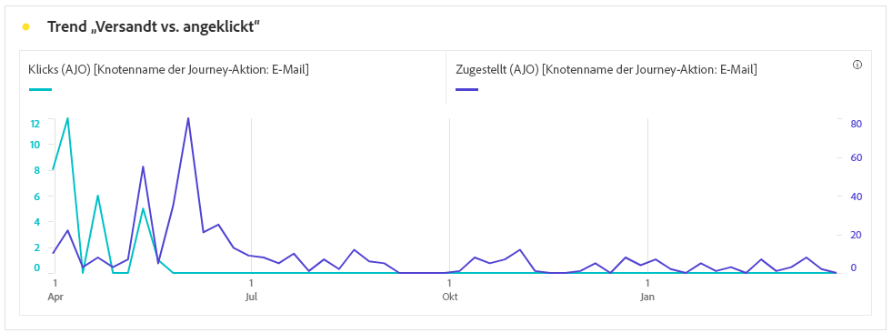
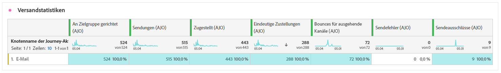
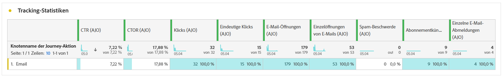
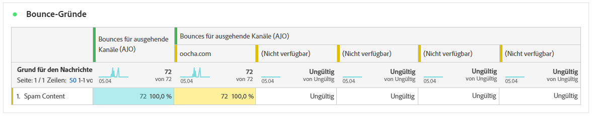

# E-Mail-Journey-Bericht {#journey-global-report}

>[!INFO]
>
>Da Apple neue Datenschutzfunktionen für seine native Mail-App eingeführt hat, einschließlich Mail Privacy Protection, können Absendende keine Tracking-Pixel mehr verwenden, um Daten von Profilen zu erfassen, die Mail Privacy Protection von Apple aktiviert haben. Daher kann die Fähigkeit von Adobe Journey Optimizer, E-Mail-Öffnungen mithilfe von Tracking-Pixeln zu verfolgen, beeinträchtigt werden. 
> [Erfahren Sie mehr](https://experienceleaguecommunities.adobe.com/t5/adobe-campaign-classic-blogs/the-impact-of-apple-ios-privacy-changes-on-email-marketing-and/ba-p/699780?profile.language=de) über die Auswirkungen der Datenschutzänderungen unter Apple iOS auf das E-Mail-Marketing.
> 
> Wir empfehlen, sich auf Klicks und Konversionsmetriken und nicht auf Öffnungsraten zu konzentrieren, um genauere Erkenntnisse zu erhalten.

>[!BEGINSHADEBOX]

Sie können Ihren E-Mail-Journey-Bericht aufrufen, indem Sie in der Journey auf die Schaltfläche **[!UICONTROL Bericht anzeigen]** klicken. [Weitere Informationen](report-gs-cja.md)

>[!ENDSHADEBOX]

## Versand- vs. Klick-Trend {#delivered-click}

Der Graph **[!UICONTROL Versand- vs. Klick-Trend]** zeigt eine detaillierte Analyse der Interaktion Ihrer Profile mit Ihren E-Mails und bietet wertvolle Erkenntnisse zur Interaktion verschiedener Domains mit Ihren Inhalten.

+++ Weitere Informationen zu den Metriken „Trend ‚Versandt vs. angeklickt‘“

* **[!UICONTROL Zugestellt]**: Anzahl der erfolgreich gesendeten E-Mails im Verhältnis zur Gesamtzahl der gesendeten E-Mails.

* **[!UICONTROL Klicks]**: Anzahl der Klicks auf einen Inhalt in Ihren E-Mails.

+++

## Versandstatus {#delivery-status}

Der Graph **[!UICONTROL Versandstatus]** zeigt die Performance Ihrer E-Mails auf einen Blick. Verfolgen Sie Schlüsselmetriken wie Sendungen und Bounces, um einen schnellen Überblick über die Effizienz Ihrer E-Mail-Journey zu erhalten.

+++ Weitere Informationen zu den Metriken „Versandstatus“

* **[!UICONTROL Zugestellt]**: Anzahl der erfolgreich gesendeten E-Mails im Verhältnis zur Gesamtzahl der gesendeten E-Mails.

* **[!UICONTROL Bounces für ausgehende Kanäle]**: Gesamtzahl der während des Sendevorgangs kumulierten Fehler und der automatischen Rücksendungen im Verhältnis zur Gesamtzahl der gesendeten Nachrichten.

* **[!UICONTROL Ausgehende Fehler]**: Gesamtanzahl der während eines Sendevorgangs aufgetretenen Fehler, die das Senden an Profile verhindert haben.

* **[!UICONTROL Ausgeschlossen]**: Anzahl der Profile, die durch Adobe Journey Optimizer ausgeschlossen wurden.

+++

## Versandstatistiken {#email-sending-statistics}

Die Tabelle **[!UICONTROL Versandstatistikzn]** bietet einen klaren Überblick über die Leistung Ihrer E-Mails in Ihren Journeys. Sie enthält Schlüsselmetriken wie die Versandrate und die Zielgruppengröße und bietet Ihnen wertvolle Erkenntnisse zur Effektivität und Reichweite Ihrer Journeys.

+++ Weitere Informationen zu den Metriken „Versandstatistiken“

* **[!UICONTROL Zielgruppe]**: Anzahl der Profile, die sich für die Zielgruppe qualifiziert haben, bevor Ausschlüsse, Unterdrückungen oder Einverständnisentnahmen angewendet wurden. In Journey mit aktiviertem erneuten Eintritt kann ein Profil mehrmals angesprochen werden.

* **[!UICONTROL Sendevorgänge]**: Gesamtzahl der Sendevorgänge für Ihre E-Mail.

* **[!UICONTROL Zugestellt]**: Anzahl der erfolgreich gesendeten E-Mails im Verhältnis zur Gesamtzahl der gesendeten Nachrichten.

* **[!UICONTROL Eindeutige Zustellungen]**: Anzahl der Profile, die mindestens eine E-Mail erfolgreich erhalten haben.

* **[!UICONTROL Bounces für ausgehende Kanäle]**: Gesamtzahl der während des Sendevorgangs kumulierten Fehler und der automatischen Rücksendungen im Verhältnis zur Gesamtzahl der gesendeten Nachrichten.

* **[!UICONTROL Ausgehende Fehler]**: Gesamtzahl der während des Sendevorgangs aufgetretenen Fehler, die das Senden an Profile verhindert haben.

* **[!UICONTROL Ausgehende Ausschlüsse]**: Anzahl der Profile, die durch Adobe Journey Optimizer ausgeschlossen wurden.

+++

## E-Mail – Tracking-Statistiken {#email-tracking}

Die Tabelle **[!UICONTROL E-Mail – Tracking-Statistiken]** bietet einen detaillierten Überblick über die Profilaktivität in Bezug auf E-Mails, die in Ihrer Journey enthalten sind. Dazu gehören Metriken zu Öffnungen, Klicks und andere relevante Interaktionsindikatoren, die einen umfassenden Überblick darüber bieten, wie Profile mit Ihrem E-Mail-Inhalt interagieren.

+++ Weitere Informationen zu den Metriken „Tracking-Statistiken“

* **[!UICONTROL Klickrate]**: Prozentsatz der Benutzenden, die mit der E-Mail interagiert haben.

* **[!UICONTROL Durchklick-Öffnungsrate]**: Anzahl der Öffnungen der E-Mail.

* **[!UICONTROL Klicks]**: Anzahl der Klicks auf einen Inhalt in Ihren E-Mails.

* **[!UICONTROL Einzelklicks]**: Die Anzahl der Profile, die auf einen Inhalt in einer E-Mail geklickt haben.

* **[!UICONTROL E-Mail-Öffnungen]**: Anzahl der Öffnungen Ihrer E-Mails in einer Kampagne.

* **[!UICONTROL Eindeutige E-Mail-Öffnungen]**: Anzahl der Profile, die E-Mails geöffnet haben.

* **[!UICONTROL Beschwerden wegen Spam]**: Gibt an, wie oft eine Nachricht als Spam oder Junk gekennzeichnet wurde.

* **[!UICONTROL Abmeldungen]**: Anzahl der Klicks auf den Abmelde-Link.

* **[!UICONTROL Eindeutige E-Mail-Abonnementkündigungen]**: Anzahl der Profile, die sich vom Erhalt Ihrer E-Mails abgemeldet haben.
+++

## E-Mail-Domains {#email-domains}

Die Tabelle **[!UICONTROL E-Mail-Domains]** bietet eine detaillierte Aufschlüsselung der E-Mails nach Domain, die umfassende Erkenntnisse zu Performance-Metriken Ihrer E-Mail-Journeys bietet. Mit dieser umfassenden Analyse können Sie das Verhalten verschiedener Domains als Reaktion auf Ihre E-Mail-Inhalte nachvollziehen.

+++ Weitere Informationen zu den Metriken „E-Mail-Domains“

* **[!UICONTROL Sendevorgänge]**: Gesamtzahl der Sendevorgänge für Ihre E-Mail.

* **[!UICONTROL Zugestellt]**: Anzahl der erfolgreich gesendeten E-Mails im Verhältnis zur Gesamtzahl der gesendeten E-Mails.

* **[!UICONTROL E-Mail-Öffnungen]**: Anzahl der Öffnungen Ihrer E-Mails in einer Journey.

* **[!UICONTROL Klicks]**: Anzahl der Klicks auf einen Inhalt in Ihren E-Mails.

* **[!UICONTROL Bounces für ausgehende Kanäle]**: Gesamtzahl der während des Sendevorgangs kumulierten Fehler und der automatischen Rücksendungen im Verhältnis zur Gesamtzahl der gesendeten E-Mails.

* **[!UICONTROL Ausgehende Fehler]**: Gesamtzahl der während des Sendevorgangs aufgetretenen Fehler, die das Senden an Profile verhindert haben.

* **[!UICONTROL Ausgehende Ausschlüsse]**: Anzahl der Profile, die durch Adobe Journey Optimizer ausgeschlossen wurden.

+++

## Labels getrackter Links {#track-link-label}

Die Tabelle **[!UICONTROL Bezeichnungen für verfolgten Link]** bietet einen umfassenden Überblick über die Link-Labels in Ihren E-Mails, in denen diejenigen hervorgehoben werden, die den meisten Besucher-Traffic generieren. Mit dieser Funktion können Sie die beliebtesten Links identifizieren und priorisieren.

+++ Weitere Informationen zu den Metriken „Labels für verfolgten Link“

* **[!UICONTROL Einzelklicks]**: Die Anzahl der Profile, die auf einen Inhalt in einer E-Mail geklickt haben.

* **[!UICONTROL Klicks]**: Anzahl der Klicks auf einen Inhalt in Ihren E-Mails.

+++

## Nachverfolgte Link-URLs {#track-link-url}

Die Tabelle **[!UICONTROL Nachverfolgte Link-URLs]** bietet einen umfassenden Überblick über die URLs in Ihrer E-Mail, die den meisten Besucher-Traffic anziehen. Auf diese Weise können Sie die beliebtesten Links identifizieren und priorisieren und Ihr Verständnis der Profilinteraktion mit bestimmten Inhalten in Ihren E-Mails verbessern.

+++ Weitere Informationen zu den Metriken „Nachverfolgte Link-URLs“

* **[!UICONTROL Einzelklicks]**: Die Anzahl der Profile, die auf einen Inhalt in einer E-Mail geklickt haben.

* **[!UICONTROL Klicks]**: Anzahl der Klicks auf einen Inhalt in Ihren E-Mails.

+++

## E-Mail-Betreff {#email-subject}

Die Tabelle **[!UICONTROL E-Mail-Betreff]** bietet einen umfassenden Überblick über E-Mail-Betreffzeilen, die den höchsten Besucher-Traffic angezogen haben. Diese Ressource bietet wertvolle Erkenntnisse zur Interaktionsdynamik von Zielgruppen.

+++ Weitere Informationen zu den Metriken „E-Mail-Betreff“

* **[!UICONTROL Zugestellt]**: Anzahl der erfolgreich gesendeten E-Mails im Verhältnis zur Gesamtzahl der gesendeten E-Mails.

* **[!UICONTROL Eindeutige Zustellungen]**: Anzahl der unterschiedlichen Profile, die mindestens eine E-Mail erfolgreich erhalten haben. Duplikate zählen dabei nicht.
+++

## Bounce-Gründe {#email-bounce-reasons}

Die Tabelle **[!UICONTROL Bounce-Gründe]** kompiliert die verfügbaren Daten zu nicht zugestellten Nachrichten und bietet detaillierte Einblicke in die spezifischen Ursachen von nicht zugestellten E-Mails.

Weitere Informationen zu Bounces finden Sie auf der Seite [ Unterdrückungslisten](../reports/suppression-list.md).

## Gründe für Ausschluss {#email-excluded}

Die Tabelle **[!UICONTROL Gründe für Ausschluss]** bietet einen umfassenden Überblick über die verschiedenen Faktoren, die zum Ausschluss von Benutzerprofilen aus der Zielgruppe geführt haben, sodass die Nachricht nicht empfangen wurde.

Auf [dieser Seite](exclusion-list.md) finden Sie die umfassende Liste der Gründe für den Ausschluss.

## Fehlergründe {#email-errors}

Die Tabelle **[!UICONTROL Fehlergründe]** bieten einen detaillierten Überblick über die Fehler, die während des Sendevorgangs aufgetreten sind, mit wichtigen Informationen über Art und Auftreten von Fehlern.
