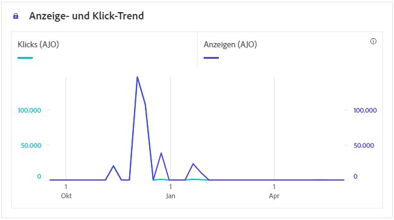
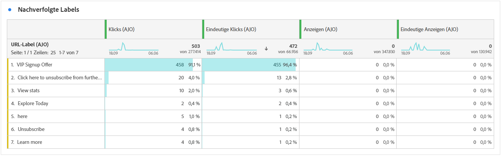
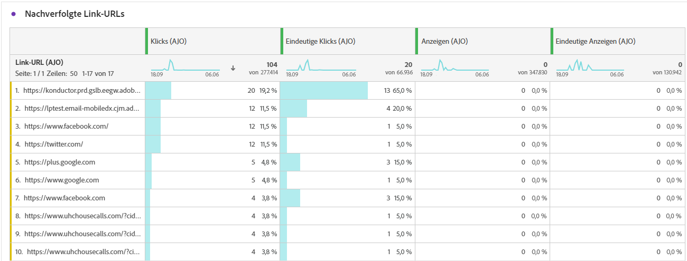

# In-App-Journey-Bericht {#journey-global-report}

>[!INFO]
>
>Ihr Journey-Bericht kann Informationen von mehreren Journeys gleichzeitig anzeigen, da Benutzende an mehr als einer Journey gleichzeitig beteiligt sein können. Daher können eingehende Nachrichten (In-App-, Web- und Code-basiert) in mehreren Journeys angezeigt werden, wenn sie für eine Benutzerin oder einen Benutzer ausgelöst wurden, die bzw. der an simultan aktiven Journeys teilnimmt, was zu einer Datenüberlappung führen kann.

>[!BEGINSHADEBOX]

Sie können Ihren In-App-Journey-Bericht aufrufen, indem Sie in der Journey auf die Schaltfläche **[!UICONTROL Bericht anzeigen]** klicken. [Weitere Informationen](report-gs-cja.md)

>[!ENDSHADEBOX]

## Anzeige- und Klick-Trend {#display-click-trend}

Der Graph **[!UICONTROL Anzeige- und Klick-Trend]** zeigt eine detaillierte Analyse der Interaktion Ihrer Profile mit Ihren In-App-Nachrichten und bietet wertvolle Erkenntnisse zur Interaktion von Profilen mit Ihren Inhalten.

+++ Weitere Informationen zu den Metriken „Anzeige- und Klick-Trend“

* **[!UICONTROL Klicks]**: Gibt an, wie oft die Benutzenden mit den In-App-Nachrichten interagiert haben.

* **[!UICONTROL Displays]**: Gibt an, wie oft die In-App-Nachricht dem Benutzer angezeigt wurde.

+++

## Klicks {#clicks-inapp}

Der Graph **[!UICONTROL Klicks]** zeigt Metriken für In-App-Klicks an, die sowohl die Gesamtanzahl der Klicks auf einen Inhalt als auch die Anzahl der einzelnen Profile darstellen, die auf den Inhalt geklickt haben.

+++ Weitere Informationen zu den Metriken „Klicks“

* **[!UICONTROL Einzelklicks]**: Die Anzahl der Profile, die auf einen Inhalt in Ihren In-App-Nachrichten geklickt haben.

* **[!UICONTROL Klicks]**: Gibt an, wie oft die Benutzenden mit den In-App-Nachrichten interagiert haben.

+++

## Anzeige {#display-inapp}

Anhand des Graphs **[!UICONTROL Anzeigen]** können Sie sowohl die Gesamtreichweite der Nachricht als auch die Anzahl der einzelnen Profile nachvollziehen, die mit der Nachricht interagieren.

+++ Weitere Informationen zu den Metriken „Anzeigen“

* **[!UICONTROL Displays]**: Gibt an, wie oft die In-App-Nachricht dem Benutzer angezeigt wurde.

* **[!UICONTROL Einzelanzeigen]**: Anzahl der Öffnungen der Nachricht, wobei mehrfache Interaktionen eines Profils nicht gezählt werden.

+++

## Tracking-Daten {#tracking-data-inapp}

Die Tabelle **[!UICONTROL Tracking-Daten]** bietet einen detaillierten Überblick über die Profilaktivität im Zusammenhang mit Ihren In-App-Nachrichten und liefert wichtige Erkenntnisse über die Interaktion und die Effektivität von In-App-Nachrichten.

+++ Weitere Informationen zu den Metriken „Tracking-Daten“

* **[!UICONTROL Personen]**: Anzahl der Benutzerprofile, die sich als Zielgruppenprofile für Ihre In-App-Nachrichten eignen.

* **[!UICONTROL Durchklickrate]**: Prozentsatz der Benutzenden, die mit den In-App-Nachrichten interagiert haben.

* **[!UICONTROL Durchklick-Öffnungsrate]**: Anzahl der Öffnungen der In-App-Nachrichten.

* **[!UICONTROL Klicks]**: Gibt an, wie oft die Benutzenden mit den In-App-Nachrichten interagiert haben.

* **[!UICONTROL Einzelklicks]**: Die Anzahl der Profile, die auf einen Inhalt in Ihren In-App-Nachrichten geklickt haben.

* **[!UICONTROL Displays]**: Gibt an, wie oft die In-App-Nachricht dem Benutzer angezeigt wurde.

* **[!UICONTROL Einzelanzeigen]**: Anzahl der Öffnungen der Nachricht, wobei mehrfache Interaktionen eines Profils nicht gezählt werden.

* **[!UICONTROL Sendevorgänge]**: Gesamtzahl der Sendevorgänge für Ihre In-App-Nachrichten.

* **[!UICONTROL Eingehend ausgelöst]**: Anzahl, wie oft eine In-App-Nachricht durch eine Benutzerinteraktion oder ein vordefiniertes Ereignis ausgelöst wurde.

* **[!UICONTROL Eingehende Abweisungen]**: Anzahl, wie oft Benutzende die In-App-Nachricht verworfen haben, ohne damit zu interagieren.

+++

## Labels getrackter Links {#track-link-label-inapp}

Die Tabelle **[!UICONTROL Bezeichnungen für verfolgten Link]** bietet einen umfassenden Überblick über die Link-Labels in Ihren In-App-Nachrichten und zeigt diejenigen an, die den höchsten Besucher-Traffic generieren. Mit dieser Funktion können Sie die beliebtesten Links identifizieren und priorisieren.

+++ Weitere Informationen zu den Metriken „Labels für verfolgten Link“

* **[!UICONTROL Einzelklicks]**: Die Anzahl der Profile, die auf einen Inhalt in Ihren In-App-Nachrichten geklickt haben.

* **[!UICONTROL Klicks]**: Gibt an, wie oft die Benutzenden mit den In-App-Nachrichten interagiert haben.

* **[!UICONTROL Displays]**: Gibt an, wie oft die In-App-Nachricht dem Benutzer angezeigt wurde.

* **[!UICONTROL Einzelanzeigen]**: Anzahl der Öffnungen der Nachricht, wobei mehrfache Interaktionen eines Profils nicht gezählt werden.

+++

## Nachverfolgte Link-URLs {#track-link-url-inapp}

Die Tabelle **[!UICONTROL Getrackte Link-URLs]** bietet einen umfassenden Überblick über die URLs in Ihren In-App-Nachrichten, die den höchsten Besucher-Traffic anziehen. Auf diese Weise können Sie die beliebtesten Links identifizieren und priorisieren und Ihr Verständnis der Profilinteraktion mit bestimmten Inhalten in Ihren In-App-Nachrichten verbessern.

+++ Weitere Informationen zu den Metriken „Nachverfolgte Link-URLs“

* **[!UICONTROL Einzelklicks]**: Die Anzahl der Profile, die auf einen Inhalt in Ihren In-App-Nachrichten geklickt haben.

* **[!UICONTROL Klicks]**: Gibt an, wie oft die Benutzenden mit den In-App-Nachrichten interagiert haben.

+++
