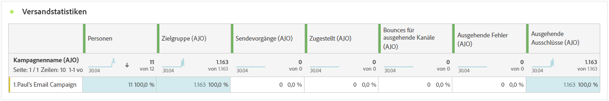
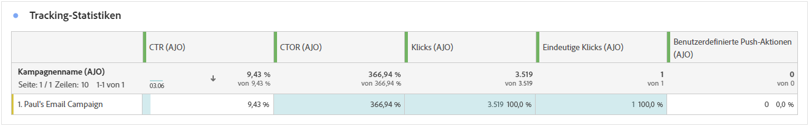
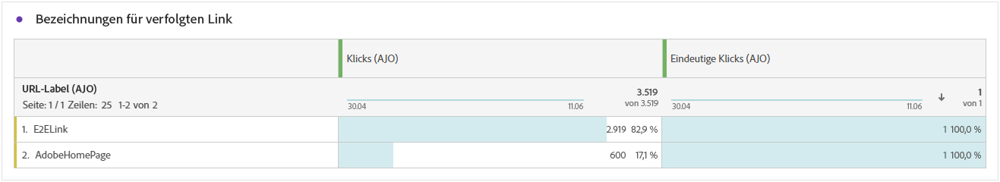
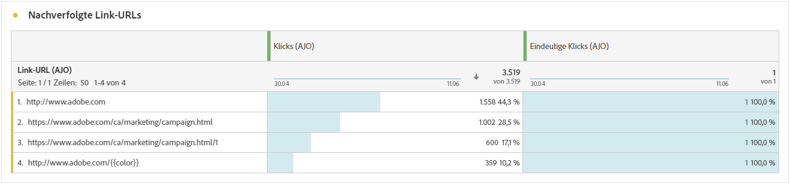
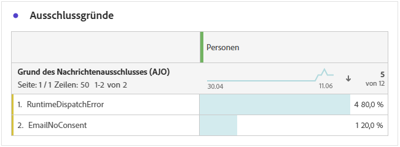

# Journey-Bericht zu Push-Benachrichtigungen {#journey-global-report}

>[!BEGINSHADEBOX]

Sie können auf den Bericht Ihrer Push-Benachrichtigungs-Journey zugreifen, indem Sie auf die Schaltfläche **[!UICONTROL Bericht anzeigen]** auf Ihrer Journey klicken. [Weitere Informationen](report-gs-cja.md)

>[!ENDSHADEBOX]

## Versandstatistiken {#sending-statistics-push}

Anhand der Tabelle **[!UICONTROL Versandstatistiken]** können Sie die Performance Ihrer Push-Benachrichtigungen nachvollziehen. Sie enthält Schlüsselmetriken wie die Versandrate und die Zielgruppengröße und bietet Ihnen wertvolle Erkenntnisse zur Effektivität und Reichweite Ihrer Journeys.

+++ Weitere Informationen zu Metriken für Versandstatistiken

* **[!UICONTROL Personen]**: Anzahl der Benutzerprofile, die sich als Zielgruppenprofile für Ihre SMS-Nachrichten eignen.

* **[!UICONTROL Zielgruppe]**: Gesamtzahl der während der Analyse verarbeiteten Push-Benachrichtigungen.

* **[!UICONTROL Sendevorgänge]**: Gesamtzahl der Sendevorgänge für die Push-Benachrichtigung.

* **[!UICONTROL Zugestellt]**: Anzahl der erfolgreich gesendeten Push-Benachrichtigungen im Verhältnis zur Gesamtzahl der gesendeten Push-Benachrichtigungen

* **[!UICONTROL Bounces für ausgehende Kanäle]**: Gesamtzahl der während des Sendevorgangs kumulierten Fehler und der automatischen Rücksendungen im Verhältnis zur Gesamtzahl der Push-Benachrichtigungen.

* **[!UICONTROL Ausgehende Fehler]**: Gesamtzahl der aufgetretenen Fehler, die das Senden an Profile verhindert haben.

* **[!UICONTROL Ausgehende Ausschlüsse]**: Anzahl der Profile, die durch Adobe Journey Optimizer ausgeschlossen wurden.

+++

## Tracking-Statistiken {#tracking-statistics-push}

Die Tabelle **[!UICONTROL Tracking-Statistiken]** bietet einen detaillierten Überblick über die Profilaktivität im Zusammenhang mit Ihren Push-Benachrichtigungen und liefert wichtige Erkenntnisse über die Interaktion und die Effektivität von Push-Benachrichtigungen.

+++ Weitere Informationen zu Metriken für Tracking-Statistiken

* **[!UICONTROL Durchklickrate]**: Prozentsatz der Benutzenden, die mit der Push-Benachrichtigung interagiert haben.

* **[!UICONTROL Durchklick-Öffnungsrate]**: Anzahl der Öffnungen der Push-Benachrichtigung.

* **[!UICONTROL Klicks]**: Anzahl der Klicks auf einen Inhalt in Ihrer Push-Benachrichtigung.

* **[!UICONTROL Einzelklicks]**: Die Anzahl der Profile, die auf einen Inhalt in Ihrer Push-Benachrichtigung geklickt haben.

* **[!UICONTROL Benutzerdefinierte Push-Aktionen]**: Anzahl der benutzerdefinierten Aktionen, die von Profilen als Reaktion auf die Push-Benachrichtigungen ausgeführt werden.
+++

## Labels getrackter Links {#track-link-label-push}

Die Tabelle **[!UICONTROL Bezeichnungen für verfolgten Link]** bietet einen umfassenden Überblick über die Link-Labels in Ihren Push-Benachrichtigungen und zeigt diejenigen an, die den höchsten Besucher-Traffic generieren. Mit dieser Funktion können Sie die beliebtesten Links identifizieren und priorisieren.

+++ Erfahren Sie mehr über Metriken für getrackte Link-Kennzeichnungen

* **[!UICONTROL Einzelklicks]**: Die Anzahl der Profile, die auf einen Inhalt in Ihren Push-Benachrichtigungen geklickt haben.

* **[!UICONTROL Klicks]**: Gibt an, wie oft ein Inhalt in Ihren Push-Benachrichtigungen angeklickt wurde.

+++

## Nachverfolgte Link-URLs {#track-link-url-push}

Die Tabelle **[!UICONTROL Nachverfolgte Link-URLs]** bietet einen umfassenden Überblick über die URLs in Ihren Push-Benachrichtigungen, die den höchsten Besucher-Traffic anziehen. Auf diese Weise können Sie die beliebtesten Links identifizieren und priorisieren und Ihr Verständnis der Profilinteraktion mit bestimmten Inhalten in Ihren Push-Benachrichtigungen verbessern.

+++ Weitere Informationen zur Metrik „Getrackte Link-URLs“

* **[!UICONTROL Einzelklicks]**: Die Anzahl der Profile, die auf einen Inhalt in Ihren Push-Benachrichtigungen geklickt haben.

* **[!UICONTROL Klicks]**: Gibt an, wie oft ein Inhalt in Ihren Push-Benachrichtigungen angeklickt wurde.

+++

## Bounce-Gründe {#bounce-reasons-push}

Die Tabelle **[!UICONTROL Bounce-Gründe]** bietet einen umfassenden Überblick über Daten zu nicht zugestellten Push-Benachrichtigungen und liefert wertvolle Erkenntnisse zu den spezifischen Ursachen von nicht zugestellten Push-Benachrichtigungen.

## Fehlergründe {#error-reasons-push}

Anhand der Tabelle **[!UICONTROL Fehlergründe]** können Sie die spezifischen Fehler identifizieren, die während des Sendevorgangs Ihrer Push-Benachrichtigungen aufgetreten sind. Dies ermöglicht eine gründliche Analyse aller aufgetretenen Probleme.

## Gründe für Ausschluss {#exclude-reasons-push}

Die Tabelle **[!UICONTROL Gründe für Ausschluss]** zeigt visuell die verschiedenen Faktoren auf, die zum Ausschluss von Benutzerprofilen aus der Zielgruppe geführt haben, sodass diese keine Push-Benachrichtigungen von Ihnen erhalten konnten.

Auf [dieser Seite](exclusion-list.md) finden Sie eine umfassende Liste der Ausschlussgründe.
