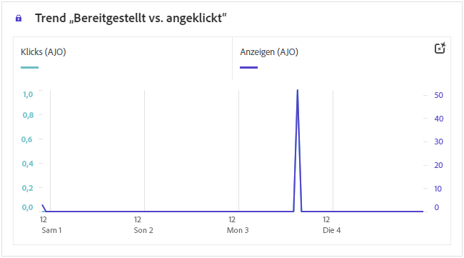
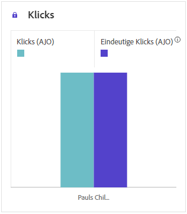
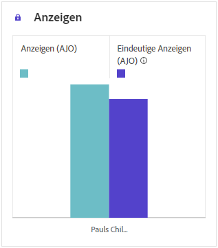
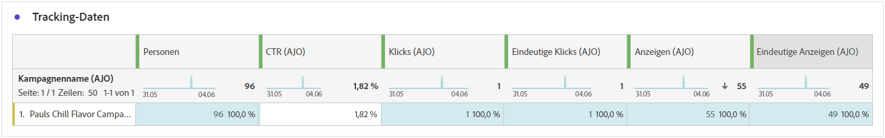
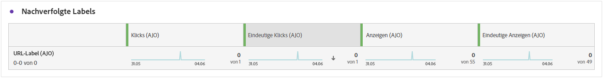
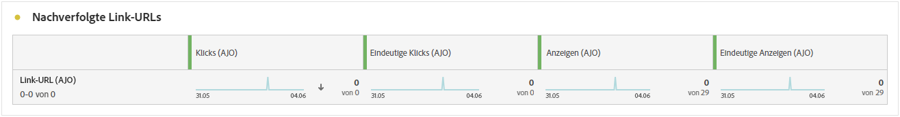

# Web-Journey-Bericht {#journey-global-report}

>[!INFO]
>
>Ihr Journey-Bericht kann Informationen von mehreren Journeys gleichzeitig anzeigen, da Benutzende an mehr als einer Journey gleichzeitig beteiligt sein können. Daher können eingehende Nachrichten (In-App-, Web- und Code-basiert) in mehreren Journeys angezeigt werden, wenn sie für eine Benutzerin oder einen Benutzer ausgelöst wurden, die bzw. der an simultan aktiven Journeys teilnimmt, was zu einer Datenüberlappung führen kann.

>[!BEGINSHADEBOX]

Sie können Ihren Web-Journey-Bericht aufrufen, indem Sie in der Journey auf die Schaltfläche **[!UICONTROL Bericht anzeigen]** klicken. [Weitere Informationen](report-gs-cja.md)

>[!ENDSHADEBOX]

## Impression- und Klick-Trend {#impressions-web}

Der Graph **[!UICONTROL Impression- und Klick-Trend]** zeigt eine detaillierte Analyse der Interaktion Ihrer Profile mit Ihren Web-Seiten und bietet wertvolle Erkenntnisse zur Interaktion von Profilen mit Ihren Inhalten.

+++ Weitere Informationen zu den Metriken „Impression- und Klick-Trend“

* **[!UICONTROL Klicks]**: Anzahl der Klicks auf einen Inhalt auf Ihren Web-Seiten.

* **[!UICONTROL Anzeigen]**: Anzahl der Öffnungen der Nachricht.

+++

## Klicks {#clicks-web}

Der Graph **[!UICONTROL Klicks]** zeigt Metriken für Klicks auf Web-Seiten an, die sowohl die Gesamtanzahl der Klicks auf Inhalte als auch die Anzahl der einzelnen Profile darstellen, die auf den Inhalt geklickt haben.

+++ Weitere Informationen zu den Metriken „Klicks“

* **[!UICONTROL Einzelklicks]**: Die Anzahl der Profile, die auf einen Inhalt auf Ihren Web-Seiten geklickt haben.

* **[!UICONTROL Klicks]**: Anzahl der Klicks auf einen Inhalt auf Ihren Web-Seiten.

+++

## Anzeigen {#displays-web}

Das Diagramm **[!UICONTROL Anzeigen]** hilft Ihnen, sowohl die Gesamtreichweite des Code-basierten Erlebnisses als auch die Anzahl der eindeutigen Profile, die mit der Nachricht interagieren, zu verstehen.

+++ Weitere Informationen zu den Metriken „Anzeigen“

* **[!UICONTROL Anzeigen]**: Anzahl der Öffnungen des Code-basierten Erlebnisses.

* **[!UICONTROL Einzelanzeigen]**: Anzahl der Öffnungen des Code-basierten Erlebnisses, wobei mehrfache Interaktionen eines Profils nicht gezählt werden.

+++

## Tracking-Daten {#track-data-web}

Die Tabelle **[!UICONTROL Tracking-Daten]** bietet einen detaillierten Überblick über die Profilaktivität im Zusammenhang mit Ihren Web-Seiten und liefert wichtige Erkenntnisse über die Interaktion und die Effektivität von Web-Seiten.

+++ Weitere Informationen zu den Metriken „Tracking-Daten“

* **[!UICONTROL Personen]**: Anzahl der Benutzerprofile, die sich als Zielgruppenprofile für Ihre Web-Seiten eignen.

* **[!UICONTROL Klickrate]**: Prozentsatz der Benutzenden, die mit den Web-Seiten interagiert haben.

* **[!UICONTROL Klicks]**: Anzahl der Klicks auf einen Inhalt auf Ihren Web-Seiten.

* **[!UICONTROL Einzelklicks]**: Die Anzahl der Profile, die auf einen Inhalt auf Ihren Web-Seiten geklickt haben.

* **[!UICONTROL Anzeigen]**: Anzahl der Öffnungen der Web-Seite.

* **[!UICONTROL Einzelanzeigen]**: Anzahl der Öffnungen der Web-Seite, wobei mehrfache Interaktionen eines Profils nicht berücksichtigt werden.

+++

## Labels getrackter Links {#track-link-web}

Die Tabelle **[!UICONTROL Bezeichnungen für verfolgten Link]** bietet einen umfassenden Überblick über die Link-Labels auf Ihren Web-Seiten und zeigt diejenigen an, die den höchsten Besucher-Traffic generieren. Mit dieser Funktion können Sie die beliebtesten Links identifizieren und priorisieren.

+++ Weitere Informationen zu den Metriken „Labels für verfolgten Link“

* **[!UICONTROL Einzelklicks]**: Die Anzahl der Profile, die auf einen Inhalt auf Ihren Web-Seiten geklickt haben.

* **[!UICONTROL Klicks]**: Anzahl der Klicks auf einen Inhalt auf Ihren Web-Seiten.

* **[!UICONTROL Anzeigen]**: Anzahl der Öffnungen der Nachricht.

* **[!UICONTROL Einzelanzeigen]**: Anzahl der Öffnungen der Nachricht, wobei mehrfache Interaktionen eines Profils nicht gezählt werden.

+++

## Nachverfolgte Link-URLs {#track-url-web}

Die Tabelle **[!UICONTROL Getrackte Link-URLs]** bietet einen umfassenden Überblick über die URLs auf Ihren Web-Seiten, die den höchsten Besucher-Traffic anziehen. Auf diese Weise können Sie die beliebtesten Links identifizieren und priorisieren und Ihr Verständnis der Profilinteraktion mit bestimmten Inhalten auf Ihren Web-Seiten verbessern.

+++ Weitere Informationen zu den Metriken „Nachverfolgte Link-URLs“

* **[!UICONTROL Einzelklicks]**: Die Anzahl der Profile, die auf einen Inhalt auf Ihren Web-Seiten geklickt haben.

* **[!UICONTROL Klicks]**: Anzahl der Klicks auf einen Inhalt auf Ihren Web-Seiten.

* **[!UICONTROL Anzeigen]**: Anzahl der Öffnungen der Nachricht.

* **[!UICONTROL Einzelanzeigen]**: Anzahl der Öffnungen der Nachricht, wobei mehrfache Interaktionen eines Profils nicht gezählt werden.

+++
