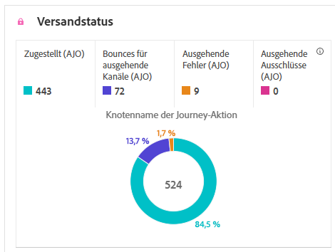
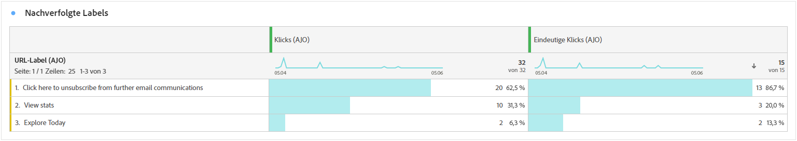
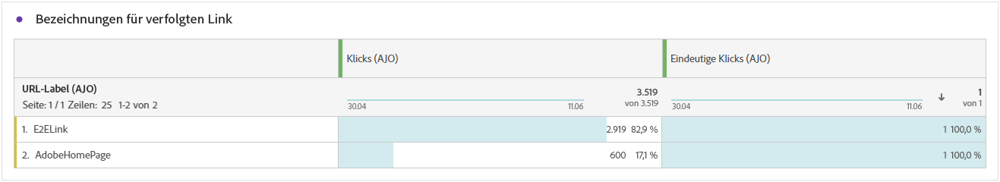
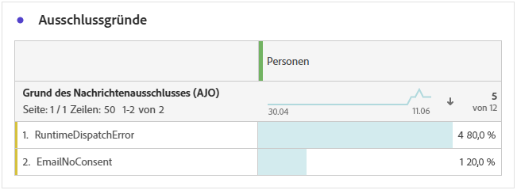
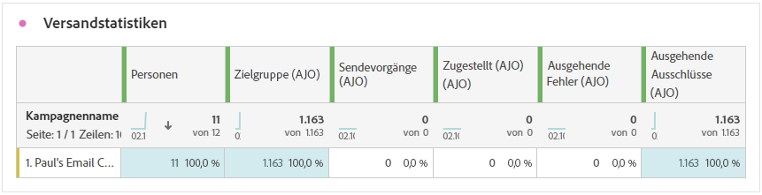

# Journey-Bericht {#journey-global-report}

Die **Journey-Bericht** fungiert als allumfassendes Dashboard, das eine Analyse wichtiger Metriken im Zusammenhang mit Ihrer Journey bereitstellt. Dies umfasst Details wie die Anzahl der eingegebenen Profile und Instanzen fehlgeschlagener Journeys und bietet einen umfassenden Einblick in die Effektivität Ihrer Journey und den Grad der Interaktion.

**Journey-Bericht** können direkt von Ihrer Journey mit der **[!UICONTROL Bericht anzeigen]** Schaltfläche.

Die **[!UICONTROL Journey-Bericht]** -Seite mit den folgenden Registerkarten angezeigt, je nach den Nachrichtenaktivitäten in Ihrer Journey:

* [Journey](#journey-global)
* [E-Mail](#email-global)
* [Push-Benachrichtigung](#push-global)
* [SMS](#sms-global)
* [In-App](#in-app-global)
* [Web](#web-cja)
* [Briefpost](#direct-mail-cja)

Weitere Informationen zum Customer Journey Analytics Workspace und zum Filtern und Analysieren von Daten finden Sie unter [diese Seite](https://experienceleague.adobe.com/en/docs/analytics-platform/using/cja-workspace/home).

## Journey-Überblick {#journey-global}

Die **[!UICONTROL Journey]** gibt Ihnen einen klaren Überblick über die wichtigsten Tracking-Daten zu Ihrer Journey.

### Journey-KPIs {#journey-perfomance}

Die **[!UICONTROL Journey]** Key Performance Indicators (KPIs) dienen als allumfassendes Dashboard und liefern eine Analyse der wesentlichen Metriken, die mit Ihrer Journey verknüpft sind. Dies umfasst Details wie die Anzahl der eingegebenen Profile und die Anzahl der fehlgeschlagenen einzelnen Journeys und bietet einen umfassenden Einblick in die Effektivität und den Grad der Interaktion Ihrer Journeys.

+++ Weitere Informationen zu Journey-KPI-Metriken

* **[!UICONTROL Journey-Interaktion]**: Gesamtzahl der Kontakte, die mit den von der Journey gesendeten Nachrichten interagiert haben

* **[!UICONTROL Journey]**: Gesamtzahl der Kontakte, die das Eintrittsereignis der Journey erreicht haben.

* **[!UICONTROL Journey beendet]**: Gesamtzahl der Kontakte, die die Journey verlassen haben.

* **[!UICONTROL Journey-Fehler]**: Gesamtzahl der einzelnen Journey, die nicht erfolgreich ausgeführt wurden.

+++

### Journey stats {#journey-stats}

Die **[!UICONTROL Journey-Statistiken]** -Tabelle bietet eine detaillierte Zusammenfassung wichtiger Daten zu Ihren Journey. Er enthält wichtige Metriken wie die Anzahl der Fehler und erfolgreichen Einträge und bietet wertvolle Einblicke in die Leistung und Reichweite Ihrer E-Mails und Journey.

+++ Weitere Informationen zu den Journey-Statistik-Metriken

* **[!UICONTROL Journey-Interaktion]**: Gesamtzahl der Kontakte, die mit den von der Journey gesendeten Nachrichten interagiert haben.

* **[!UICONTROL Journey]**: Gesamtzahl der Kontakte, die das Eintrittsereignis der Journey erreicht haben.

* **[!UICONTROL Journey beendet]**: Gesamtzahl der Kontakte, die die Journey verlassen haben.

* **[!UICONTROL Journey-Fehler]**: Gesamtzahl der einzelnen Journey, die nicht erfolgreich ausgeführt wurden.

* **[!UICONTROL Eindeutige Journey-Zentren]**: Gesamtzahl der Kontakte, die das Eintrittsereignis der Journey erreicht haben, wobei mehrere Interaktionen eines Profils nicht berücksichtigt werden.

* **[!UICONTROL Eindeutige Journey-Ausstiege]**: Gesamtzahl der Kontakte, die die Journey verlassen haben, wobei mehrere Interaktionen eines Profils nicht berücksichtigt werden.

* **[!UICONTROL Einzelne Journey-Fehler]**: Gesamtzahl der einzelnen Journey, die nicht erfolgreich ausgeführt wurden, mehrere Interaktionen eines Profils werden nicht berücksichtigt.

+++

## Journey-Arbeitsfläche {#journey-canvas}

Die **[!UICONTROL Journey Canvas]** -Widget ermöglicht es Ihnen, während der Navigation durch Ihre Journey visuell den Verlauf Ihrer Zielprofile zu verfolgen.

Verbessern Sie die Anpassung der Arbeitsfläche mit den folgenden Optionen:

* Fügen Sie den gewünschten Aktivitätstyp, z. B. Nachrichten oder Bedingungen, hinzu oder entfernen Sie ihn aus dem **[!UICONTROL Knotentyp]** Dropdown-Menü.
* Passen Sie die **[!UICONTROL Prozentwert]** um die Flussverteilung zwischen verschiedenen Journey-Pfaden zu bestimmen.
* Anpassen Ihrer **[!UICONTROL Pfeileinstellungen]** , um Beschriftungen, Bedingungen einzuschließen oder sich für eine saubere Anzeige zu entscheiden.
* Aktivieren Sie die **[!UICONTROL Fallout anzeigen]** zur Visualisierung von Profilen, die Ihre Journey direkt auf der Arbeitsfläche verlassen haben.

## Aktionsleistung {#action-performance}

### Leistung im Zeitverlauf {#action-overtime}

Die **[!UICONTROL Leistung im Zeitverlauf]** Mit diesem Diagramm können Sie die Anzahl der Profile identifizieren und analysieren, die den Kriterien entsprechen, damit sie für Ihre Aktionen als Zielprofile gelten. Diese Visualisierung bietet wertvolle Einblicke in die Effektivität Ihrer Strategien und hilft Ihnen bei datengesteuerten Entscheidungen zur Leistungsoptimierung.

### Aktionsübersicht {#action-overview}

Die **[!UICONTROL Aktionsübersicht]** -Tabelle dient als umfassendes Dashboard, das eine Analyse der Schlüsselmetriken im Zusammenhang mit den Aktionen in Ihrer Journey anbietet. Dazu gehören wichtige Details wie die Anzahl der Interaktionen und die Clickthrough-Rate.

+++ Weitere Informationen zu den Metriken mit Aktionsübersicht

* **[!UICONTROL Personen]**: Anzahl der Benutzerprofile, die für Ihre Aktionen als Zielprofile gelten.

* **[!UICONTROL Klickrate]**: Prozentsatz der Benutzer, die mit der Aktion interagiert haben.

* **[!UICONTROL Klicks]**: Anzahl der Klicks auf einen Inhalt in Ihren Aktionen.

* **[!UICONTROL Zugestellt]**: Anzahl der erfolgreich gesendeten Aktionen in Bezug auf die Gesamtzahl der gesendeten Aktionen.

+++

## Ereignisleistung {#events-performance}

### Leistung im Zeitverlauf {#event-overtime}

Die **[!UICONTROL Leistung im Zeitverlauf]** -Diagramm ermöglicht es Ihnen, die Anzahl der Profile zu identifizieren und zu analysieren, die als Zielprofile für Ihre Ereignisse gelten. Mit diesem leistungsstarken Tool können Sie Trends und Muster im Zeitverlauf verfolgen und erhalten wertvolle Einblicke zur Optimierung Ihrer Ereignisstrategien.

### Ereignisübersicht {#event-overview}

Die **[!UICONTROL Ereignisübersicht]** zeigt an, wie viele Profile im Zeitverlauf Ihren Ereigniskriterien entsprechen. Mit diesem Tool können Sie Muster in Qualifizierungsraten identifizieren, um Ihre Ereignisstrategie zu verfeinern.

+++ Weitere Informationen zu den Journey-Statistik-Metriken

* **[!UICONTROL Personen]**: Anzahl der Benutzerprofile, die als Zielprofile für Ihre Ereignisse gelten.

+++

## E-Mail-Details {#email-global}

In Ihrem Journey-Bericht wird die **[!UICONTROL Email]** im Tab werden die wichtigsten Informationen zu den auf Ihrer Journey gesendeten E-Mails aufgeführt.

### Zugestellt vs. Klick-Trend {#delivered-click}

Die **[!UICONTROL Zugestellt vs. Klick-Trend]** Das Diagramm zeigt eine detaillierte Analyse der Interaktion Ihrer Profile mit Ihren E-Mails und bietet wertvolle Einblicke in die Interaktion verschiedener Domänen mit Ihrem Inhalt.

+++ Weitere Informationen zu den Metriken Zugestellt vs. Klick-Trend

* **[!UICONTROL Zugestellt]**: Anzahl der erfolgreich gesendeten E-Mails im Verhältnis zur Gesamtzahl der gesendeten E-Mails.

* **[!UICONTROL Klicks]**: Anzahl der Klicks auf einen Inhalt in Ihren E-Mails.

+++

### Versandstatus {#delivery-status}

Die **[!UICONTROL Versandstatus]** -Diagramm zeigt die Leistung Ihrer E-Mails auf einen Blick. Verfolgen Sie wichtige Metriken wie Sendungen und Bounces, um einen schnellen Überblick über die Effizienz Ihrer E-Mail-Journey zu erhalten.

+++ Weitere Informationen zu Versandstatus-Metriken

* **[!UICONTROL Zugestellt]**: Anzahl der erfolgreich gesendeten E-Mails im Verhältnis zur Gesamtzahl der gesendeten E-Mails.

* **[!UICONTROL Bounces für ausgehende Kanäle]**: Gesamtzahl der während des Versandvorgangs kumulierten Fehler und der automatischen Bounce-Verarbeitung in Bezug auf die Gesamtzahl der gesendeten Nachrichten.

* **[!UICONTROL Ausgehende Fehler]**: Gesamtzahl der Fehler, die während des Versandvorgangs aufgetreten sind und die Versendung an Profile verhindert haben.

* **[!UICONTROL Ausgeschlossen]**: Anzahl der Profile, die durch Adobe Journey Optimizer ausgeschlossen wurden.

+++

### Versandstatistiken {#email-sending-statistics}

Die **[!UICONTROL Versandstatistiken]** bietet einen klaren Überblick über die Leistung Ihrer E-Mails in Ihren Journey. Sie verfolgt wichtige Metriken wie Versandraten und Interaktionen und bietet Ihnen wertvolle Einblicke zur Optimierung Ihrer E-Mail-Strategie für eine bessere Reichweite und Interaktion.

+++ Weitere Informationen zu Versandstatistiken-Metriken

* **[!UICONTROL Personen]**: Anzahl der Benutzerprofile, die als Zielprofile für Ihre Nachrichten gelten.

* **[!UICONTROL Zielgruppe]**: Gesamtzahl der während des Sendevorgangs verarbeiteten E-Mails.

* **[!UICONTROL Sendungen]**: Gesamtzahl der gesendeten E-Mails.

* **[!UICONTROL Zugestellt]**: Anzahl der erfolgreich gesendeten E-Mails im Verhältnis zur Gesamtzahl der gesendeten Nachrichten.

* **[!UICONTROL Bounces]**: Gesamtzahl der kumulierten Fehler beim Sendevorgang und der automatischen Rücksendungen im Verhältnis zur Gesamtzahl der gesendeten Nachrichten.

* **[!UICONTROL Ausgehende Fehler]**: Gesamtzahl der Fehler, die während des Versandvorgangs aufgetreten sind und die Versendung an Profile verhindert haben.

* **[!UICONTROL Ausgehende Ausschlüsse]**: Anzahl der von Adobe Journey Optimizer ausgeschlossenen Profile.

+++

### E-Mail – Tracking-Statistiken {#email-tracking}

Die Tabelle **[!UICONTROL E-Mail – Tracking-Statistiken]** bietet einen detaillierten Überblick über die Profilaktivität in Bezug auf E-Mails, die in Ihrer Journey enthalten sind. Dazu gehören Metriken zu Öffnungen, Klicks und andere relevante Interaktionsindikatoren, die einen umfassenden Überblick darüber bieten, wie Profile mit Ihrem E-Mail-Inhalt interagieren.

+++ Weitere Informationen zu Trackingstatistiken - Metriken

* **[!UICONTROL Durchklickrate (CTR)]**: Prozentsatz der Benutzer, die mit der E-Mail interagiert haben.

* **[!UICONTROL Clickthrough-Öffnungsrate (CTOR)]**: Gibt an, wie oft die E-Mail geöffnet wurde.

* **[!UICONTROL Klicks]**: Anzahl der Klicks auf einen Inhalt in Ihren E-Mails.

* **[!UICONTROL Einzelklicks]**: Die Anzahl der Profile, die auf einen Inhalt in einer E-Mail geklickt haben.

* **[!UICONTROL E-Mail wird geöffnet]**: Gibt an, wie oft Ihre E-Mails auf einem Journey geöffnet wurden.

* **[!UICONTROL Einzelöffnungen einer E-Mail]**: Prozentsatz der geöffneten E-Mails.

* **[!UICONTROL Beschwerden wegen Spam]**: Gibt an, wie oft eine Nachricht als Spam oder Junk gekennzeichnet wurde.

* **[!UICONTROL Abmeldungen]**: Anzahl der Klicks auf den Abmelde-Link.

+++

### E-Mail-Domains {#email-domains}

Die **[!UICONTROL E-Mail-Domänen]** bietet eine detaillierte Aufschlüsselung der E-Mails nach Domain, die umfassende Einblicke in die Leistungsmetriken Ihrer E-Mail-Journey bietet. Diese umfassende Analyse ermöglicht Ihnen, das Verhalten verschiedener Domänen als Reaktion auf Ihren E-Mail-Inhalt zu verstehen.

+++ Weitere Informationen zu E-Mail-Domainmetriken

* **[!UICONTROL Sendungen]**: Gesamtzahl der gesendeten E-Mails.

* **[!UICONTROL Zugestellt]**: Anzahl der erfolgreich gesendeten E-Mails im Verhältnis zur Gesamtzahl der gesendeten E-Mails.

* **[!UICONTROL E-Mail wird geöffnet]**: Gibt an, wie oft Ihre E-Mails auf einem Journey geöffnet wurden.

* **[!UICONTROL Klicks]**: Anzahl der Klicks auf einen Inhalt in Ihren E-Mails.

* **[!UICONTROL Bounces für ausgehende Kanäle]**: Gesamtzahl der Fehler, die während des Versandvorgangs kumuliert wurden, und der automatischen Bounce-Verarbeitung in Bezug auf die Gesamtzahl der gesendeten E-Mails.

* **[!UICONTROL Ausgehende Fehler]**: Gesamtzahl der Fehler, die während des Versandvorgangs aufgetreten sind und die Versendung an Profile verhindert haben.
+++

### Labels getrackter Links {#track-link-label}

Die **[!UICONTROL Getrackte Linkbeschriftungen]** bietet einen umfassenden Überblick über die Linkbeschriftungen in Ihren E-Mails, in denen diejenigen hervorgehoben werden, die den höchsten Besuchertraffic generieren. Mit dieser Funktion können Sie die beliebtesten Links identifizieren und priorisieren.

+++ Erfahren Sie mehr über die Metriken zu Getrackten Linkbeschriftungen

* **[!UICONTROL Einzelklicks]**: Die Anzahl der Profile, die auf einen Inhalt in einer E-Mail geklickt haben.

* **[!UICONTROL Klicks]**: Anzahl der Klicks auf einen Inhalt in Ihren E-Mails.

+++

### Getrackte Link-URLs {#track-link-url}

Die **[!UICONTROL Getrackte Link-URLs]** bietet einen umfassenden Überblick über die URLs in Ihrer E-Mail, die den höchsten Besuchertraffic aufweisen. Auf diese Weise können Sie die beliebtesten Links identifizieren und priorisieren und Ihr Verständnis der Profilinteraktion mit bestimmten Inhalten in Ihren E-Mails verbessern.

+++ Weitere Informationen zu den Metriken für getrackte Link-URLs

* **[!UICONTROL Einzelklicks]**: Die Anzahl der Profile, die auf einen Inhalt in einer E-Mail geklickt haben.

* **[!UICONTROL Klicks]**: Anzahl der Klicks auf einen Inhalt in Ihren E-Mails.

* **[!UICONTROL Anzeigen]**: Gibt an, wie oft die Nachricht geöffnet wurde.

* **[!UICONTROL Einzelanzeigen]**: Anzahl der Öffnungen der Nachricht, mehrere Interaktionen eines Profils werden nicht berücksichtigt.

+++

### E-Mail-Betreffe {#email-subject}

Die **[!UICONTROL E-Mail-Betreff]**  -Tabelle bietet einen umfassenden Überblick über E-Mail-Themen, die den höchsten Besucher-Traffic erzielt haben. Diese Ressource bietet wertvolle Einblicke in die Interaktionsdynamik von Zielgruppen.

+++ Weitere Informationen zu Metriken zu E-Mail-Themen

* **[!UICONTROL Personen]**: Anzahl der Benutzerprofile, die als Zielprofile für Ihre E-Mails gelten.

+++

### Bounce-Gründe {#email-bounce-reasons}

Die **[!UICONTROL Bounce-Gründe]** -Tabelle werden die verfügbaren Daten zu Bounce Messages kompiliert und bietet detaillierte Einblicke in die spezifischen Gründe für E-Mail-Bounces.

Weitere Informationen zu Bounces finden Sie auf der Seite [ Unterdrückungslisten](../reports/suppression-list.md).

### Ausschlussgründe {#email-excluded}

Die **[!UICONTROL Ausgeschlossene Gründe]** -Tabelle zeigt eine umfassende Übersicht der verschiedenen Faktoren, die dazu geführt haben, dass Benutzerprofile aus der Zielgruppe ausgeschlossen wurden, sodass die Nachricht nicht empfangen wurde.

Auf [dieser Seite](exclusion-list.md) finden Sie die umfassende Liste der Gründe für den Ausschluss.

### Fehlergründe {#email-errors}

Die **[!UICONTROL Fehlerursachen]** bietet Einblick in die spezifischen Fehler, die während des Versandvorgangs aufgetreten sind. Diese Tabelle bietet wertvolle Informationen über Art und Auftreten von Fehlern.

## Registerkarte „Push-Benachrichtigung“ {#push-global}

In Ihrem Journey-Bericht wird die **[!UICONTROL Push-Benachrichtigung]** im Tab werden die wichtigsten Informationen zu den auf Ihrer Journey gesendeten Push-Benachrichtigungen aufgeführt.

## Push-Benachrichtigung {#push-notification}

### Versandstatistiken {#sending-statistics-push}

Die **[!UICONTROL Versandstatistiken]** -Tabelle zeigt Ihnen, wie Ihre Push-Benachrichtigungen funktionieren. Er enthält wichtige Metriken wie die Zustellrate und die Zielgruppengröße und bietet Ihnen wertvolle Einblicke in die Effektivität und Reichweite Ihrer Journey.

+++ Weitere Informationen zu Versandstatistiken-Metriken

* **[!UICONTROL Personen]**: Anzahl der Benutzerprofile, die als Zielprofile für Ihre SMS-Nachrichten gelten.

* **[!UICONTROL Zielgruppe]**: Gesamtzahl der während der Analyse verarbeiteten Push-Benachrichtigungen.

* **[!UICONTROL Sendungen]**: Gesamtzahl der gesendeten Push-Benachrichtigungen.

* **[!UICONTROL Zugestellt]**: Anzahl der erfolgreich gesendeten Push-Benachrichtigungen im Verhältnis zur Gesamtzahl der gesendeten Push-Benachrichtigungen

* **[!UICONTROL Bounces für ausgehende Kanäle]**: Gesamtzahl der während des Versandvorgangs kumulierten Fehler und der automatischen Bounce-Verarbeitung in Bezug auf die Gesamtzahl der Push-Benachrichtigungen.

* **[!UICONTROL Ausgehende Fehler]**: Gesamtzahl der aufgetretenen Fehler, die den Versand an Profile verhinderten.

* **[!UICONTROL Ausgehende Ausschlüsse]**: Anzahl der von Adobe Journey Optimizer ausgeschlossenen Profile.

+++

### Tracking-Statistiken {#tracking-statistics-push}

Die **[!UICONTROL Trackingstatistiken]** bietet eine detaillierte Momentaufnahme der Profilaktivität, die mit Ihren Push-Benachrichtigungen verknüpft ist, und bietet wichtige Einblicke in die Interaktion und die Effektivität von Push-Benachrichtigungen.

+++ Weitere Informationen zu Trackingstatistiken - Metriken

* **[!UICONTROL Durchklickrate (CTR)]**: Prozentsatz der Benutzer, die mit der Push-Benachrichtigung interagiert haben.

* **[!UICONTROL Clickthrough-Öffnungsrate (CTOR)]**: Anzahl der Öffnungen der Push-Benachrichtigung.

* **[!UICONTROL Klicks]**: Anzahl der Klicks auf einen Inhalt in Ihrer Push-Benachrichtigung.

* **[!UICONTROL Einzelklicks]**: Anzahl der Profile, die auf einen Inhalt in Ihrer Push-Benachrichtigung geklickt haben.

<!--
* **[!UICONTROL Push custom actions]**: 
-->
+++

### Labels getrackter Links {#track-link-label-push}

Die **[!UICONTROL Getrackte Linkbeschriftungen]** -Tabelle bietet einen umfassenden Überblick über die Linkbeschriftungen in Ihren Push-Benachrichtigungen und zeigt diejenigen an, die den höchsten Besucher-Traffic generieren. Mit dieser Funktion können Sie die beliebtesten Links identifizieren und priorisieren.

+++ Erfahren Sie mehr über die Metriken zu Getrackten Linkbeschriftungen

* **[!UICONTROL Einzelklicks]**: Anzahl der Profile, die auf einen Inhalt in Ihren Push-Benachrichtigungen geklickt haben.

* **[!UICONTROL Klicks]**: Gibt an, wie oft ein Inhalt in Ihren Push-Benachrichtigungen angeklickt wurde.

+++

### Getrackte Link-URLs {#track-link-url-push}

Die **[!UICONTROL Getrackte Link-URLs]** bietet einen umfassenden Überblick über die URLs in Ihren Push-Benachrichtigungen, die den höchsten Besucher-Traffic anziehen. Auf diese Weise können Sie die beliebtesten Links identifizieren und priorisieren und so Ihr Verständnis der Profilinteraktion mit bestimmten Inhalten in Ihren Push-Benachrichtigungen verbessern.

+++ Weitere Informationen zu den Metriken für getrackte Link-URLs

* **[!UICONTROL Einzelklicks]**: Anzahl der Profile, die auf einen Inhalt in Ihren Push-Benachrichtigungen geklickt haben.

* **[!UICONTROL Klicks]**: Gibt an, wie oft ein Inhalt in Ihren Push-Benachrichtigungen angeklickt wurde.

+++

### Bounce-Gründe {#bounce-reasons-push}

Die **[!UICONTROL Bounces-Gründe]** -Tabelle bietet einen umfassenden Überblick über Daten zu Bounce-Push-Benachrichtigungen und liefert wertvolle Einblicke in die spezifischen Ursachen für Bounces bei Push-Benachrichtigungen.

### Fehlergründe {#error-reasons-push}

Die **[!UICONTROL Fehlerursachen]** -Tabelle können Sie die spezifischen Fehler identifizieren, die während des Versandvorgangs Ihrer Push-Benachrichtigungen aufgetreten sind. Dies ermöglicht eine gründliche Analyse aller aufgetretenen Probleme.

### Ausschlussgründe {#exclude-reasons-push}

Die **[!UICONTROL Ausschlussgründe]** zeigt visuell die verschiedenen Faktoren an, die zum Ausschluss von Benutzerprofilen aus der Zielgruppe geführt haben, sodass diese keine Push-Benachrichtigungen erhalten können.

Auf [dieser Seite](exclusion-list.md) finden Sie eine umfassende Liste der Ausschlussgründe.

## SMS {#sms}

### Zugestellt vs. Klick-Trend {#delivered-click-sms}

Die **[!UICONTROL Zugestellt vs. Klick-Trend]** Das Diagramm zeigt eine detaillierte Analyse der Interaktion Ihrer Profile mit Ihren SMS-Nachrichten und bietet wertvolle Einblicke in die Interaktion verschiedener Domänen mit Ihrem Inhalt.

+++ Weitere Informationen zu den Metriken Zugestellt vs. Klick-Trend

* **[!UICONTROL Zugestellt]**: Anzahl der erfolgreich gesendeten SMS in Bezug auf die Gesamtzahl der SMS-Nachrichten.

* **[!UICONTROL Klicks]**: Anzahl der Klicks auf einen Inhalt in Ihren SMS-Nachrichten.

+++

### Versandstatus {#delivery-status-sms}

Die **[!UICONTROL Versandstatus]** bietet einen detaillierten Überblick über die auf Ihre SMS bezogenen Profilaktivitäten. Dazu gehören Metriken zu zugestellten Nachrichten, Klicks und andere relevante Interaktionsindikatoren, die einen umfassenden Überblick darüber bieten, wie Profile mit Ihrem SMS-Inhalt interagieren.

+++ Weitere Informationen zu Versandstatus-Metriken

* **[!UICONTROL Zugestellt]**: Anzahl der erfolgreich gesendeten SMS in Bezug auf die Gesamtzahl der SMS-Nachrichten.

* **[!UICONTROL Bounces für ausgehende Kanäle]**: Gesamtzahl der im Versand- und automatischen Bounce-Prozesse kumulierten Fehler in Bezug auf die Gesamtzahl der gesendeten SMS-Nachrichten.

* **[!UICONTROL Ausgehende Fehler]**: Gesamtzahl der aufgetretenen Fehler, die den Versand an Profile verhinderten.

* **[!UICONTROL Ausgehende Ausschlüsse]**: Anzahl der von Adobe Journey Optimizer ausgeschlossenen Profile.

+++

### Labels getrackter Links {#track-link-label-sms}

Die **[!UICONTROL Getrackte Linkbeschriftungen]** bietet einen umfassenden Überblick über die Linkbeschriftungen in Ihren SMS-Nachrichten, in denen diejenigen hervorgehoben werden, die den höchsten Besuchertraffic erzeugen. Mit dieser Funktion können Sie die beliebtesten Links identifizieren und priorisieren.

+++ Erfahren Sie mehr über die Metriken zu Getrackten Linkbeschriftungen

* **[!UICONTROL Einzelklicks]**: Anzahl der Profile, die auf einen Inhalt in Ihrer SMS geklickt haben.

* **[!UICONTROL Klicks]**: Anzahl der Klicks auf einen Inhalt in Ihren SMS-Nachrichten.

+++

### Getrackte Link-URLs {#track-link-url-sms}

Die **[!UICONTROL Getrackte Link-URLs]** bietet einen umfassenden Überblick über die URLs in Ihren SMS-Nachrichten, die den höchsten Besuchertraffic aufweisen. Auf diese Weise können Sie die beliebtesten Links identifizieren und priorisieren und so Ihr Verständnis der Profilinteraktion mit bestimmten Inhalten in Ihren SMS-Nachrichten verbessern.

+++ Weitere Informationen zu den Metriken für getrackte Link-URLs

* **[!UICONTROL Einzelklicks]**: Anzahl der Profile, die auf einen Inhalt in Ihrer SMS geklickt haben.

* **[!UICONTROL Klicks]**: Anzahl der Klicks auf einen Inhalt in Ihren SMS-Nachrichten.

* **[!UICONTROL Anzeigen]**: Gibt an, wie oft die Nachricht geöffnet wurde.

* **[!UICONTROL Einzelanzeigen]**: Anzahl der Öffnungen der Nachricht, mehrere Interaktionen eines Profils werden nicht berücksichtigt.

+++

### Eingehende SMS-Nachricht {#sms-inbound}

Die **[!UICONTROL SMS-Empfang]** bietet einen umfassenden Überblick darüber, welche SMS-Nachrichten den meisten Besucher-Traffic erfahren haben. Diese Ressource bietet wertvolle Einblicke in die Interaktionsdynamik von Zielgruppen.

+++ Weitere Informationen zu den Metriken von SMS-eingehenden Nachrichten

* **[!UICONTROL Personen]**: Anzahl der Benutzerprofile, die als Zielprofile für Ihre SMS-Nachrichten gelten.

+++

### SMS-Nachrichtentyp {#sms-message-type}

Die **[!UICONTROL SMS-Nachrichtentyp]** bietet einen umfassenden Überblick darüber, welcher SMS-Nachrichtentyp den meisten Besucher-Traffic erfahren hat. Diese Ressource bietet wertvolle Einblicke in die Interaktionsdynamik von Zielgruppen.

+++ Weitere Informationen zu Metriken zum SMS-Nachrichtentyp

* **[!UICONTROL Personen]**: Anzahl der Benutzerprofile, die als Zielprofile für Ihre SMS-Nachrichten gelten.

+++

### SMS-Anbieter {#sms-providers}

Die **[!UICONTROL SMS-Provider]** -Tabelle bietet einen umfassenden Überblick darüber, welche SMS-Anbieter den höchsten Besuchertraffic erzielt haben. Diese Ressource bietet wertvolle Einblicke in die Interaktionsdynamik von Zielgruppen.

+++ Weitere Informationen zu SMS-Anbietermetriken

* **[!UICONTROL Personen]**: Anzahl der Benutzerprofile, die als Zielprofile für Ihre SMS-Nachrichten gelten.

+++

### Bounce-Gründe {#bounce-reasons-sms}

Die **[!UICONTROL Bounces-Gründe]** bietet einen umfassenden Überblick über Daten zu Bounce-SMS-Nachrichten und liefert wertvolle Einblicke in die spezifischen Ursachen von SMS-Bounces.

### Fehlergründe {#error-reasons-sms}

Die **[!UICONTROL Fehlerursachen]** -Tabelle können Sie die spezifischen Fehler identifizieren, die während des Versandvorgangs Ihrer SMS aufgetreten sind. Dies ermöglicht eine gründliche Analyse aller aufgetretenen Probleme.

### Ausschlussgründe {#excluded-reasons-sms}

Die **[!UICONTROL Ausschlussgründe]** zeigt visuell die verschiedenen Faktoren an, die zum Ausschluss von Benutzerprofilen aus der Zielgruppe geführt haben, sodass diese keine SMS-Nachrichten erhalten können.

Auf [dieser Seite](exclusion-list.md) finden Sie eine umfassende Liste der Ausschlussgründe.

## In-App

### Impressions- und Klicktrend {#impression-click-trend}

Die **[!UICONTROL Impressions- und Klicktrend]** Das Diagramm zeigt eine detaillierte Analyse der Interaktion Ihrer Profile mit Ihren In-App-Nachrichten und bietet wertvolle Einblicke in die Interaktion von Profilen mit Ihren Inhalten.

+++ Weitere Informationen zu Impressions- und Klicktrendmetriken

* **[!UICONTROL Klicks]**: Gibt an, wie oft in Ihren In-App-Nachrichten auf einen Inhalt geklickt wurde.

* **[!UICONTROL Anzeigen]**: Gibt an, wie oft die Nachricht geöffnet wurde.

+++

### Klicks {#clicks-inapp}

Die **[!UICONTROL Klicks]** Das Diagramm zeigt In-App-Klickmetriken an, die sowohl die Gesamtanzahl der Inhaltsklicks als auch die Anzahl der eindeutigen Profile, die auf den Inhalt geklickt haben, darstellen.

+++ Weitere Informationen zu Klickmetriken

* **[!UICONTROL Einzelklicks]**: Anzahl der Profile, die auf einen Inhalt in Ihren In-App-Nachrichten geklickt haben

* **[!UICONTROL Klicks]**: Gibt an, wie oft in Ihren In-App-Nachrichten auf einen Inhalt geklickt wurde.

+++

### Anzeige {#display-inapp}

Die **[!UICONTROL Anzeigen]** Anhand des Diagramms können Sie sowohl die GesamtReichweite der Nachricht als auch die Anzahl der eindeutigen Profile, die mit der Nachricht interagieren, nachvollziehen.

+++ Weitere Informationen zu Anzeigemetriken

* **[!UICONTROL Anzeigen]**: Gibt an, wie oft die Nachricht geöffnet wurde.

* **[!UICONTROL Einzelanzeigen]**: Anzahl der Öffnungen der Nachricht, mehrere Interaktionen eines Profils werden nicht berücksichtigt.

+++

### Tracking-Daten {#tracking-data-inapp}

Die **[!UICONTROL Tracking-Daten]** -Tabelle bietet eine detaillierte Momentaufnahme der Profilaktivität, die mit Ihren In-App-Nachrichten verknüpft ist, und bietet wichtige Einblicke in die Interaktion und die Effektivität von In-App-Nachrichten.

+++ Weitere Informationen zum Verfolgen von Datenmetriken

* **[!UICONTROL Personen]**: Anzahl der Benutzerprofile, die als Zielprofile für Ihre In-App-Nachrichten gelten.

* **[!UICONTROL Durchklickrate (CTR)]**: Prozentsatz der Benutzer, die mit In-App-Nachrichten interagiert haben.

* **[!UICONTROL Durchklicken der Öffnungsrate (CTOR)]**: Gibt an, wie oft In-App-Nachrichten geöffnet wurden.

* **[!UICONTROL Klicks]**: Gibt an, wie oft in Ihren In-App-Nachrichten auf einen Inhalt geklickt wurde.

* **[!UICONTROL Einzelklicks]**: Anzahl der Profile, die auf einen Inhalt in Ihren In-App-Nachrichten geklickt haben.

* **[!UICONTROL Anzeigen]**: Gibt an, wie oft die Nachricht geöffnet wurde.

* **[!UICONTROL Einzelanzeigen]**: Anzahl der Öffnungen der Nachricht, mehrere Interaktionen eines Profils werden nicht berücksichtigt.

* **[!UICONTROL Sendungen]**: Gesamtzahl der gesendeten In-App-Nachrichten.

<!--
* **[!UICONTROL Inbound triggered]**: 

* **[!UICONTROL Inbound dismisses]**: 
-->
+++

### Labels getrackter Links {#track-link-label-inapp}

Die **[!UICONTROL Getrackte Linkbeschriftungen]** -Tabelle bietet einen umfassenden Überblick über die Linkbeschriftungen in Ihren In-App-Nachrichten und zeigt diejenigen, die den höchsten Besucher-Traffic generieren. Mit dieser Funktion können Sie die beliebtesten Links identifizieren und priorisieren.

+++ Erfahren Sie mehr über die Metriken zu Getrackten Linkbeschriftungen

* **[!UICONTROL Einzelklicks]**: Anzahl der Profile, die auf einen Inhalt in Ihren In-App-Nachrichten geklickt haben.

* **[!UICONTROL Klicks]**: Gibt an, wie oft in Ihren In-App-Nachrichten auf einen Inhalt geklickt wurde.

* **[!UICONTROL Anzeigen]**: Gibt an, wie oft die Nachricht geöffnet wurde.

* **[!UICONTROL Einzelanzeigen]**: Anzahl der Öffnungen der Nachricht, mehrere Interaktionen eines Profils werden nicht berücksichtigt.

+++

### Getrackte Link-URLs {#track-link-url-inapp}

Die **[!UICONTROL Getrackte Link-URLs]** bietet einen umfassenden Überblick über die URLs in Ihren In-App-Nachrichten, die den höchsten Besucher-Traffic anziehen. Auf diese Weise können Sie die beliebtesten Links identifizieren und priorisieren und so Ihr Verständnis der Profilinteraktion mit bestimmten Inhalten in Ihren In-App-Nachrichten verbessern.

+++ Weitere Informationen zu den Metriken für getrackte Link-URLs

* **[!UICONTROL Einzelklicks]**: Anzahl der Profile, die auf einen Inhalt in Ihren In-App-Nachrichten geklickt haben

* **[!UICONTROL Klicks]**: Gibt an, wie oft in Ihren In-App-Nachrichten auf einen Inhalt geklickt wurde.

+++

## Web {#web-cja}

### Impressions- und Klicktrend {#impressions-web}

Die **[!UICONTROL Impressions- und Klicktrend]** Das Diagramm zeigt eine detaillierte Analyse der Interaktion Ihrer Profile mit Ihren Webseiten und bietet wertvolle Einblicke in die Interaktion der Profile mit Ihrem Inhalt.

+++ Weitere Informationen zu Impressions- und Klicktrendmetriken

* **[!UICONTROL Klicks]**: Anzahl der Klicks auf einen Inhalt auf Ihren Webseiten.

* **[!UICONTROL Anzeigen]**: Gibt an, wie oft die Nachricht geöffnet wurde.

+++

### Klicks {#clicks-web}

Die **[!UICONTROL Klicks]** -Diagramm zeigt Metriken zu Webseitenklick an, die sowohl die Gesamtanzahl der Inhaltsklicks als auch die Anzahl der eindeutigen Profile, die auf den Inhalt geklickt haben, darstellen.

+++ Weitere Informationen zu Klickmetriken

* **[!UICONTROL Einzelklicks]**: Anzahl der Profile, die auf einen Inhalt auf Ihren Webseiten geklickt haben.

* **[!UICONTROL Klicks]**: Anzahl der Klicks auf einen Inhalt auf Ihren Webseiten.

+++

### Anzeigen {#displays-web}

Die **[!UICONTROL Anzeigen]** Anhand des Diagramms können Sie sowohl die GesamtReichweite der Nachricht als auch die Anzahl der eindeutigen Profile, die mit der Nachricht interagieren, nachvollziehen.

+++ Weitere Informationen zu Anzeigemetriken

* **[!UICONTROL Anzeigen]**: Gibt an, wie oft die Nachricht geöffnet wurde.

* **[!UICONTROL Einzelanzeigen]**: Anzahl der Öffnungen der Nachricht, mehrere Interaktionen eines Profils werden nicht berücksichtigt.

+++

### Tracking-Daten {#track-data-web}

Die **[!UICONTROL Tracking-Daten]** bietet eine detaillierte Momentaufnahme der Profilaktivität, die mit Ihren Webseiten verknüpft ist, und bietet wichtige Einblicke in die Interaktion und die Effektivität von Webseiten.

+++ Weitere Informationen zum Verfolgen von Datenmetriken

* **[!UICONTROL Personen]**: Anzahl der Benutzerprofile, die als Zielprofile für Ihre Webseiten gelten.

* **[!UICONTROL Durchklickrate (CTR)]**: Prozentsatz der Benutzer, die mit den Webseiten interagiert haben.

* **[!UICONTROL Klicks]**: Anzahl der Klicks auf einen Inhalt auf Ihren Webseiten.

* **[!UICONTROL Einzelklicks]**: Anzahl der Profile, die auf einen Inhalt auf Ihren Webseiten geklickt haben.

* **[!UICONTROL Anzeigen]**: Gibt an, wie oft die Webseite geöffnet wurde.

* **[!UICONTROL Einzelanzeigen]**: Anzahl der Öffnungen der Webseite, mehrere Interaktionen eines Profils werden nicht berücksichtigt.

+++

### Labels getrackter Links {#track-link-web}

Die **[!UICONTROL Getrackte Linkbeschriftungen]** -Tabelle bietet einen umfassenden Überblick über die Linkbeschriftungen auf Ihren Webseiten, in denen diejenigen hervorgehoben werden, die den höchsten Besucher-Traffic generieren. Mit dieser Funktion können Sie die beliebtesten Links identifizieren und priorisieren.

+++ Erfahren Sie mehr über die Metriken zu Getrackten Linkbeschriftungen

* **[!UICONTROL Einzelklicks]**: Anzahl der Profile, die auf einen Inhalt auf Ihren Webseiten geklickt haben.

* **[!UICONTROL Klicks]**: Anzahl der Klicks auf einen Inhalt auf Ihren Webseiten.

* **[!UICONTROL Anzeigen]**: Gibt an, wie oft die Nachricht geöffnet wurde.

* **[!UICONTROL Einzelanzeigen]**: Anzahl der Öffnungen der Nachricht, mehrere Interaktionen eines Profils werden nicht berücksichtigt.

+++

### Getrackte Link-URLs {#track-url-web}

Die **[!UICONTROL Getrackte Link-URLs]** bietet einen umfassenden Überblick über die URLs auf Ihren Webseiten, die den höchsten Besuchertraffic erzielen. Auf diese Weise können Sie die beliebtesten Links identifizieren und priorisieren und so Ihr Verständnis der Profilinteraktion mit bestimmten Inhalten auf Ihren Webseiten erweitern.

+++ Weitere Informationen zu den Metriken für getrackte Link-URLs

* **[!UICONTROL Einzelklicks]**: Anzahl der Profile, die auf einen Inhalt auf Ihren Webseiten geklickt haben.

* **[!UICONTROL Klicks]**: Anzahl der Klicks auf einen Inhalt auf Ihren Webseiten.

* **[!UICONTROL Anzeigen]**: Gibt an, wie oft die Nachricht geöffnet wurde.

* **[!UICONTROL Einzelanzeigen]**: Anzahl der Öffnungen der Nachricht, mehrere Interaktionen eines Profils werden nicht berücksichtigt.

+++

## Briefpost {#direct-mail-cja}

### Versandstatistiken {#sending-statistics-directmail}

Die **[!UICONTROL Versandstatistiken]** gibt Ihnen einen Einblick in die Performance Ihrer Briefpost-Journey. Sehen Sie sich wichtige Metriken wie die Anzahl der Zielgruppenempfänger und erfolgreich zugestellten Teile an, damit Sie die Reichweite und Effektivität Ihrer Mailings messen können.

+++ Weitere Informationen zu Versandstatistiken-Metriken

* **[!UICONTROL Personen]**: Anzahl der Benutzerprofile, die als Zielprofile für Ihre Nachrichten gelten.

* **[!UICONTROL Targeting]**: Gesamtzahl der während des Versandvorgangs verarbeiteten Briefpost-Nachrichten.

* **[!UICONTROL Sendungen]**: Gesamtzahl der gesendeten Briefpost-Nachrichten.

* **[!UICONTROL Zugestellt]**: Anzahl der erfolgreich gesendeten Briefpost-Nachrichten in Bezug auf die Gesamtzahl der gesendeten Nachrichten.

* **[!UICONTROL Ausgehende Fehler]**: Gesamtzahl der Fehler, die während des Versandvorgangs aufgetreten sind und die Versendung an Profile verhindert haben.

* **[!UICONTROL Ausgehende Ausschlüsse]**: Anzahl der von Adobe Journey Optimizer ausgeschlossenen Profile.

+++

### Versandstatus {#delivery-status-directmail}

Die **[!UICONTROL Versandstatus]** -Diagramm bietet einen umfassenden Überblick über Daten zu gesendeten Briefpost-Nachrichten in Ihrer Journey und bietet Einblicke in wichtige Metriken wie Zugestellt und Fehler. Dies ermöglicht eine detaillierte Analyse des Versandprozesses von Briefpost-Nachrichten und liefert wertvolle Informationen über die Effizienz und Leistung Ihrer Journey.

+++ Weitere Informationen zu Versandstatus-Metriken

* **[!UICONTROL Zugestellt]**: Anzahl der erfolgreich gesendeten Briefpost-Nachrichten in Bezug auf die Gesamtzahl der gesendeten Briefpost-Nachrichten.

* **[!UICONTROL Ausgehende Fehler]**: Gesamtzahl der Fehler, die während eines Versandvorgangs aufgetreten sind und die Senden Ihrer Briefpost-Nachrichten an Profile verhinderten.

* **[!UICONTROL Ausgehende Ausschlüsse]**: Anzahl der von Adobe Journey Optimizer ausgeschlossenen Profile.

+++

### Fehlergründe {#error-reasons-directmail}

Die **[!UICONTROL Fehlerursachen]** -Tabelle können Sie die spezifischen Fehler identifizieren, die während des Versandvorgangs Ihrer Briefpost-Nachrichten aufgetreten sind. Dies ermöglicht eine gründliche Analyse aller aufgetretenen Probleme.

### Ausschlussgründe {#exclude-reasons-directmail}

Die **[!UICONTROL Ausschlussgründe]** zeigt visuell die verschiedenen Faktoren an, die zum Ausschluss von Benutzerprofilen aus der Zielgruppe geführt haben, sodass diese keine Briefpost-Nachrichten erhalten können.

Auf [dieser Seite](exclusion-list.md) finden Sie eine umfassende Liste der Ausschlussgründe.
