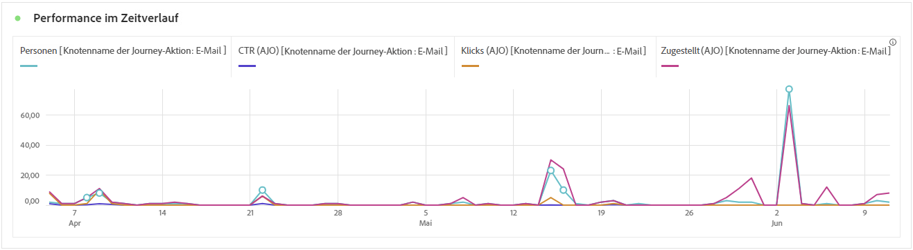

# Journey-Bericht {#journey-global-report}

Der **Journey-Bericht** dient als allumfassendes Dashboard, das eine Analyse der wichtigsten Metriken bereitstellt, die mit Ihrer Journey verknüpft sind. Dies umfasst Details wie die Anzahl der eingetretenen Profile und Instanzen fehlgeschlagener individueller Journeys und bietet einen umfassenden Einblick in die Effektivität Ihrer Journey und den Grad der Interaktion.

Über die Schaltfläche **[!UICONTROL Bericht anzeigen]** können Sie direkt von Ihrer Journey auf den **Journey-Bericht** zugreifen.

Weitere Informationen zum Customer Journey Analytics-Workspace und zum Filtern und Analysieren von Daten finden Sie auf [dieser Seite](https://experienceleague.adobe.com/de/docs/analytics-platform/using/cja-workspace/home).

## Journey-Überblick {#journey-global}

Mit dem **[!UICONTROL Journey-Bericht]** erhalten Sie einen klaren Überblick über die wichtigsten Tracking-Daten zu Ihrer Journey.

### Journey-KPIs {#journey-perfomance}

Die **[!UICONTROL Journey-KPIs]** (Key Performance Indicators) dienen als allumfassendes Dashboard und liefern eine Analyse der wichtigsten Metriken, die mit Ihrer Journey verknüpft sind. Dies umfasst Details wie die Anzahl der eingegebenen Profile und die Anzahl der fehlgeschlagenen individuellen Journeys und bietet einen umfassenden Einblick in die Effektivität und den Grad der Interaktion Ihrer Journeys.

+++ Weitere Informationen zu den Metriken für die Journey-KPIs

* **[!UICONTROL Journey-Interaktion]**: Gesamtzahl der Kontakte, die mit den von der Journey gesendeten Nachrichten interagiert haben

* **[!UICONTROL Journey-Eintritte]**: Gesamtzahl der Kontakte, die das Eintrittsereignis der Journey erreicht haben.

* **[!UICONTROL Journey-Austritte]**: Gesamtzahl der Kontakte, die die Journey verlassen haben.

* **[!UICONTROL Fehlgeschlagene Journeys]**: Gesamtzahl der individuellen Journeys, die nicht erfolgreich ausgeführt wurden.

+++

### Journey-Statistiken {#journey-stats}

Die Tabelle **[!UICONTROL Journey-Statistiken]** bietet eine detaillierte Zusammenfassung wichtiger Daten zu Ihren Journeys. Sie enthält Schlüsselmetriken wie die Anzahl der Fehler und erfolgreichen Eintritte und bietet wertvolle Erkenntnisse zur Performance und Reichweite Ihrer E-Mails und Journeys.

+++ Weitere Informationen zu den Journey-Statistik-Metriken

* **[!UICONTROL Journey-Interaktion]**: Gesamtzahl der Kontakte, die mit den von der Journey gesendeten Nachrichten interagiert haben

* **[!UICONTROL Journey-Eintritte]**: Gesamtzahl der Kontakte, die das Eintrittsereignis der Journey erreicht haben.

* **[!UICONTROL Journey-Austritte]**: Gesamtzahl der Kontakte, die die Journey verlassen haben.

* **[!UICONTROL Fehlgeschlagene Journeys]**: Gesamtzahl der individuellen Journeys, die nicht erfolgreich ausgeführt wurden.

* **[!UICONTROL Eindeutige Journey-Eintritte]**: Gesamtzahl der Kontakte, die das Eintrittsereignis der Journey erreicht haben, wobei mehrfache Interaktionen eines Profils nicht gezählt werden.

* **[!UICONTROL Eindeutige Journey-Austritte]**: Gesamtzahl der Kontakte, die die Journey verlassen haben, wobei mehrfache Interaktionen eines Profils nicht gezählt werden.

* **[!UICONTROL Eindeutige Journey-Fehler]**: Gesamtzahl der individuellen Journeys, die nicht erfolgreich ausgeführt wurden, wobei mehrfache Interaktionen eines Profils nicht gezählt werden.

+++

## Journey-Arbeitsfläche {#journey-canvas}

Mit dem Widget **[!UICONTROL Journey-Arbeitsfläche]** können Sie den Weg Ihrer Zielprofile durch die Journey visuell verfolgen. [Weitere Informationen finden Sie in der Customer Journey Analytics-Dokumentation](https://experienceleague.adobe.com/de/docs/analytics-platform/using/cja-workspace/visualizations/journey-canvas/journey-canvas)

Verbessern Sie die Anpassung Ihrer Arbeitsfläche mit den folgenden Optionen:

* Fügen Sie den gewünschten Aktivitätstyp, z. B. Nachrichten oder Bedingungen, hinzu oder entfernen Sie ihn aus dem Dropdown-Menü **[!UICONTROL Knotentyp]**.
* Passen Sie den **[!UICONTROL Prozentwert]** an, um die Flussverteilung zwischen verschiedenen Journey-Pfaden zu bestimmen.
* Passen Sie Ihre **[!UICONTROL Pfeileinstellungen]** an, um Labels und Bedingungen einzuschließen, oder entscheiden Sie sich für eine saubere Anzeige.
* Aktivieren Sie die Option **[!UICONTROL Fallout anzeigen]**, um direkt auf der Arbeitsfläche Profile zu visualisieren, die Ihre Journey verlassen haben.

## Aktions-Performance {#action-performance}

### Performance im Zeitverlauf {#action-overtime}

Anhand des Graphs **[!UICONTROL Performance im Zeitverlauf]** können Sie die Anzahl der Profile identifizieren und analysieren, die den Kriterien entsprechen, damit sie für Ihre Aktionen als Zielprofile gelten. Diese Visualisierung bietet wertvolle Erkenntnisse zur Effektivität Ihrer Strategien und hilft Ihnen, datengesteuerte Entscheidungen zur Leistungsoptimierung zu treffen.

### Aktionsüberblick {#action-overview}

Die Tabelle **[!UICONTROL Aktionsüberblick]** dient als umfassendes Dashboard, das eine Analyse der Schlüsselmetriken im Zusammenhang mit den Aktionen in Ihrer Journey bietet. Dazu gehören wichtige Details wie die Anzahl der Interaktionen und die Klickrate.

+++ Weitere Informationen zu Aktionsüberblickmetriken

* **[!UICONTROL Personen]**: Anzahl der Benutzerprofile, die sich als Zielgruppenprofile für Ihre Aktionen eignen.

* **[!UICONTROL Klickrate]**: Prozentsatz der Benutzenden, die mit der Aktion interagiert haben.

* **[!UICONTROL Klicks]**: Anzahl der Klicks auf einen Inhalt in Ihren Aktionen.

* **[!UICONTROL Zugestellt]**: Anzahl der erfolgreich gesendeten Aktionen im Verhältnis zur Gesamtzahl der gesendeten Aktionen.

+++

## Ereignis-Performance {#events-performance}

### Performance im Zeitverlauf {#event-overtime}

Anhand des Graphen **[!UICONTROL Performance im Zeitverlauf]** können Sie die Anzahl der Profile identifizieren und analysieren, die sich als Zielprofile für Ihre Ereignisse eignen. Mit diesem leistungsstarken Tool können Sie Trends und Muster im Zeitverlauf verfolgen und erhalten wertvolle Erkenntnisse zur Optimierung Ihrer Ereignisstrategien.

### Ereignisüberblick {#event-overview}

Die Tabelle **[!UICONTROL Ereignisüberblick]** zeigt an, wie viele Profile im Zeitverlauf Ihren Ereigniskriterien entsprechen. Mit diesem Tool können Sie Muster in Qualifizierungsraten identifizieren, um Ihre Ereignisstrategie zu verfeinern.

+++ Weitere Informationen zu den Journey-Statistik-Metriken

* **[!UICONTROL Personen]**: Anzahl der Benutzerprofile, die sich als Zielgruppenprofile für Ihre Ereignisse eignen.

+++
