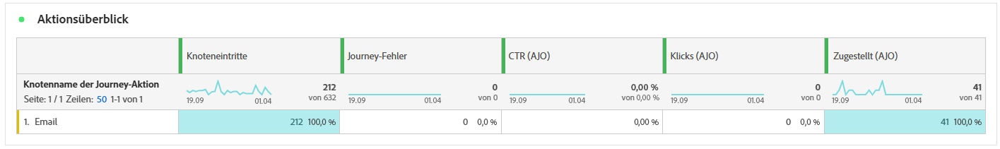
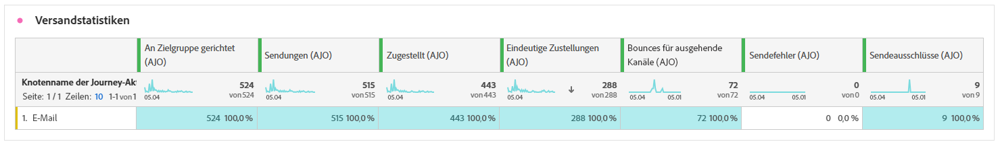
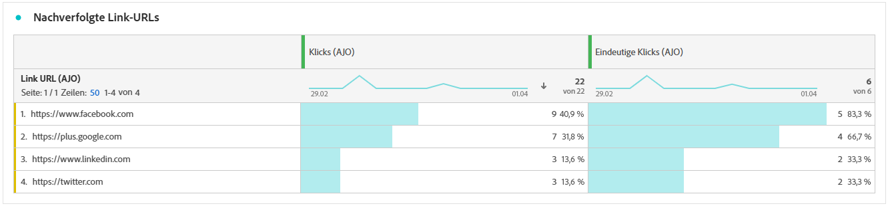
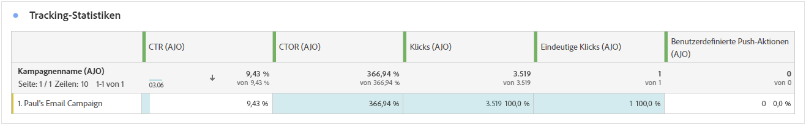
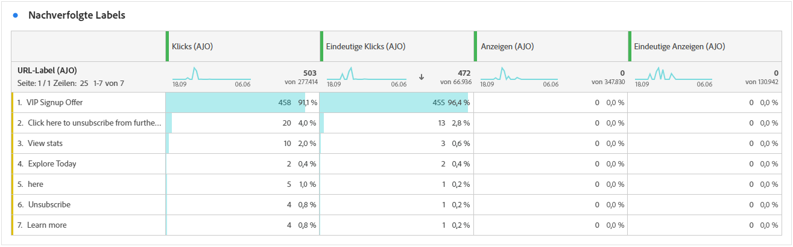
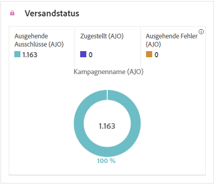

# Journey-Bericht {#journey-global-report}

Der **Journey-Bericht** dient als allumfassendes Dashboard, das eine Analyse der wichtigsten Metriken bereitstellt, die mit Ihrer Journey verknüpft sind. Dies umfasst Details wie die Anzahl der eingetretenen Profile und Instanzen fehlgeschlagener individueller Journeys und bietet einen umfassenden Einblick in die Effektivität Ihrer Journey und den Grad der Interaktion.

Über die Schaltfläche **[!UICONTROL Bericht anzeigen]** können Sie direkt von Ihrer Journey auf den **Journey-Bericht** zugreifen.

Die Seite **[!UICONTROL Journey-Bericht]** wird je nach den Nachrichtenaktivitäten in Ihrer Journey mit den folgenden Registerkarten angezeigt:

* [Journey](#journey-global)
* [E-Mail](#email-global)
* [Push-Benachrichtigung](#push-global)
* [SMS](#sms-global)
* [In-App](#in-app-global)
* [Web](#web-cja)
* [Direkt-Mail](#direct-mail-cja)
* [Codebasiert](#code-based)
* [Inhaltskarte](#content-card)

Weitere Informationen zum Customer Journey Analytics-Workspace und zum Filtern und Analysieren von Daten finden Sie auf [dieser Seite](https://experienceleague.adobe.com/de/docs/analytics-platform/using/cja-workspace/home).

## Journey-Überblick {#journey-global}

Mit dem **[!UICONTROL Journey-Bericht]** erhalten Sie einen klaren Überblick über die wichtigsten Tracking-Daten zu Ihrer Journey.

### Journey-KPIs {#journey-perfomance}

Die **[!UICONTROL Journey-KPIs]** (Key Performance Indicators) dienen als allumfassendes Dashboard und liefern eine Analyse der wichtigsten Metriken, die mit Ihrer Journey verknüpft sind. Dies umfasst Details wie die Anzahl der eingegebenen Profile und die Anzahl der fehlgeschlagenen individuellen Journeys und bietet einen umfassenden Einblick in die Effektivität und den Grad der Interaktion Ihrer Journeys.

+++ Weitere Informationen zu den Metriken für die Journey-KPIs

* **[!UICONTROL Journey-Interaktion]**: Gesamtzahl der Kontakte, die mit den von der Journey gesendeten Nachrichten interagiert haben

* **[!UICONTROL Journey-Eintritte]**: Gesamtzahl der Kontakte, die das Eintrittsereignis der Journey erreicht haben.

* **[!UICONTROL Journey-Austritte]**: Gesamtzahl der Kontakte, die die Journey verlassen haben.

* **[!UICONTROL Fehlgeschlagene Journeys]**: Gesamtzahl der individuellen Journeys, die nicht erfolgreich ausgeführt wurden.

+++

### Journey-Statistiken {#journey-stats}

Die Tabelle **[!UICONTROL Journey-Statistiken]** bietet eine detaillierte Zusammenfassung wichtiger Daten zu Ihren Journeys. Sie enthält Schlüsselmetriken wie die Anzahl der Fehler und erfolgreichen Eintritte und bietet wertvolle Erkenntnisse zur Performance und Reichweite Ihrer E-Mails und Journeys.

+++ Weitere Informationen zu den Journey-Statistik-Metriken

* **[!UICONTROL Journey-Interaktion]**: Gesamtzahl der Kontakte, die mit den von der Journey gesendeten Nachrichten interagiert haben

* **[!UICONTROL Journey-Eintritte]**: Gesamtzahl der Kontakte, die das Eintrittsereignis der Journey erreicht haben.

* **[!UICONTROL Journey-Austritte]**: Gesamtzahl der Kontakte, die die Journey verlassen haben.

* **[!UICONTROL Fehlgeschlagene Journeys]**: Gesamtzahl der individuellen Journeys, die nicht erfolgreich ausgeführt wurden.

* **[!UICONTROL Eindeutige Journey-Eintritte]**: Gesamtzahl der Kontakte, die das Eintrittsereignis der Journey erreicht haben, wobei mehrfache Interaktionen eines Profils nicht gezählt werden.

* **[!UICONTROL Eindeutige Journey-Austritte]**: Gesamtzahl der Kontakte, die die Journey verlassen haben, wobei mehrfache Interaktionen eines Profils nicht gezählt werden.

* **[!UICONTROL Eindeutige Journey-Fehler]**: Gesamtzahl der individuellen Journeys, die nicht erfolgreich ausgeführt wurden, wobei mehrfache Interaktionen eines Profils nicht gezählt werden.

+++

## Journey-Arbeitsfläche {#journey-canvas}

Das Widget **[!UICONTROL Journey Canvas]** ermöglicht es Ihnen, den Verlauf Ihrer Zielprofile während der Navigation durch Ihre Journey visuell zu verfolgen. [Weitere Informationen finden Sie in der Customer Journey Analytics-Dokumentation](https://experienceleague.adobe.com/en/docs/analytics-platform/using/cja-workspace/visualizations/journey-canvas/journey-canvas)

Verbessern Sie die Anpassung Ihrer Arbeitsfläche mit den folgenden Optionen:

* Fügen Sie den gewünschten Aktivitätstyp, z. B. Nachrichten oder Bedingungen, hinzu oder entfernen Sie ihn aus dem Dropdown-Menü **[!UICONTROL Knotentyp]**.
* Passen Sie den **[!UICONTROL Prozentwert]** an, um die Flussverteilung zwischen verschiedenen Journey-Pfaden zu bestimmen.
* Passen Sie Ihre **[!UICONTROL Pfeileinstellungen]** an, um Labels und Bedingungen einzuschließen, oder entscheiden Sie sich für eine saubere Anzeige.
* Aktivieren Sie die Option **[!UICONTROL Fallout anzeigen]**, um direkt auf der Arbeitsfläche Profile zu visualisieren, die Ihre Journey verlassen haben.

## Aktions-Performance {#action-performance}

### Performance im Zeitverlauf {#action-overtime}

Anhand des Graphs **[!UICONTROL Performance im Zeitverlauf]** können Sie die Anzahl der Profile identifizieren und analysieren, die den Kriterien entsprechen, damit sie für Ihre Aktionen als Zielprofile gelten. Diese Visualisierung bietet wertvolle Erkenntnisse zur Effektivität Ihrer Strategien und hilft Ihnen, datengesteuerte Entscheidungen zur Leistungsoptimierung zu treffen.

### Aktionsüberblick {#action-overview}

Die Tabelle **[!UICONTROL Aktionsüberblick]** dient als umfassendes Dashboard, das eine Analyse der Schlüsselmetriken im Zusammenhang mit den Aktionen in Ihrer Journey bietet. Dazu gehören wichtige Details wie die Anzahl der Interaktionen und die Klickrate.

+++ Weitere Informationen zu Aktionsüberblickmetriken

* **[!UICONTROL Personen]**: Anzahl der Benutzerprofile, die sich als Zielgruppenprofile für Ihre Aktionen eignen.

* **[!UICONTROL Klickrate]**: Prozentsatz der Benutzenden, die mit der Aktion interagiert haben.

* **[!UICONTROL Klicks]**: Anzahl der Klicks auf einen Inhalt in Ihren Aktionen.

* **[!UICONTROL Zugestellt]**: Anzahl der erfolgreich gesendeten Aktionen im Verhältnis zur Gesamtzahl der gesendeten Aktionen.

+++

## Ereignis-Performance {#events-performance}

### Performance im Zeitverlauf {#event-overtime}

Anhand des Graphen **[!UICONTROL Performance im Zeitverlauf]** können Sie die Anzahl der Profile identifizieren und analysieren, die sich als Zielprofile für Ihre Ereignisse eignen. Mit diesem leistungsstarken Tool können Sie Trends und Muster im Zeitverlauf verfolgen und erhalten wertvolle Erkenntnisse zur Optimierung Ihrer Ereignisstrategien.

### Ereignisüberblick {#event-overview}

Die Tabelle **[!UICONTROL Ereignisüberblick]** zeigt an, wie viele Profile im Zeitverlauf Ihren Ereigniskriterien entsprechen. Mit diesem Tool können Sie Muster in Qualifizierungsraten identifizieren, um Ihre Ereignisstrategie zu verfeinern.

+++ Weitere Informationen zu den Journey-Statistik-Metriken

* **[!UICONTROL Personen]**: Anzahl der Benutzerprofile, die sich als Zielgruppenprofile für Ihre Ereignisse eignen.

+++

## E-Mail-Details {#email-global}

In Ihrem Journey-Bericht enthält die Registerkarte **[!UICONTROL E-Mail]** die wichtigsten Informationen zu den E-Mails, die in Ihrer Journey gesendet wurden.

### Versand- vs. Klick-Trend {#delivered-click}

Der Graph **[!UICONTROL Versand- vs. Klick-Trend]** zeigt eine detaillierte Analyse der Interaktion Ihrer Profile mit Ihren E-Mails und bietet wertvolle Erkenntnisse zur Interaktion verschiedener Domains mit Ihren Inhalten.

+++ Weitere Informationen zu den Metriken, die den Versand- vs. Klick-Trend betreffen

* **[!UICONTROL Zugestellt]**: Anzahl der erfolgreich gesendeten E-Mails im Verhältnis zur Gesamtzahl der gesendeten E-Mails.

* **[!UICONTROL Klicks]**: Anzahl der Klicks auf einen Inhalt in Ihren E-Mails.

+++

### Versandstatus {#delivery-status}

Der Graph **[!UICONTROL Versandstatus]** zeigt die Performance Ihrer E-Mails auf einen Blick. Verfolgen Sie Schlüsselmetriken wie Sendungen und Bounces, um einen schnellen Überblick über die Effizienz Ihrer E-Mail-Journey zu erhalten.

+++ Weitere Informationen zu den Versandstatus-Metriken

* **[!UICONTROL Zugestellt]**: Anzahl der erfolgreich gesendeten E-Mails im Verhältnis zur Gesamtzahl der gesendeten E-Mails.

* **[!UICONTROL Bounces für ausgehende Kanäle]**: Gesamtzahl der während des Sendevorgangs kumulierten Fehler und der automatischen Rücksendungen im Verhältnis zur Gesamtzahl der gesendeten Nachrichten.

* **[!UICONTROL Ausgehende Fehler]**: Gesamtanzahl der während eines Sendevorgangs aufgetretenen Fehler, die das Senden an Profile verhindert haben.

* **[!UICONTROL Ausgeschlossen]**: Anzahl der Profile, die durch Adobe Journey Optimizer ausgeschlossen wurden.

+++

### Versandstatistiken {#email-sending-statistics}

Die Tabelle **[!UICONTROL Versandstatistikzn]** bietet einen klaren Überblick über die Leistung Ihrer E-Mails in Ihren Journeys. Sie enthält Schlüsselmetriken wie die Versandrate und die Zielgruppengröße und bietet Ihnen wertvolle Erkenntnisse zur Effektivität und Reichweite Ihrer Journeys.

+++ Weitere Informationen zu Metriken für Versandstatistiken

* **[!UICONTROL Personen]**: Anzahl der Benutzerprofile, die sich als Zielgruppenprofile für Ihre Nachrichten eignen.

* **[!UICONTROL Zielgruppe]**: Gesamtzahl der während des Sendevorgangs verarbeiteten E-Mails.

* **[!UICONTROL Sendevorgänge]**: Gesamtzahl der Sendevorgänge für Ihre E-Mail.

* **[!UICONTROL Zugestellt]**: Anzahl der erfolgreich gesendeten E-Mails im Verhältnis zur Gesamtzahl der gesendeten Nachrichten.

* **[!UICONTROL Bounces]**: Gesamtzahl der kumulierten Fehler beim Sendevorgang und der automatischen Rücksendungen im Verhältnis zur Gesamtzahl der gesendeten Nachrichten.

* **[!UICONTROL Ausgehende Fehler]**: Gesamtanzahl der während eines Sendevorgangs aufgetretenen Fehler, die das Senden an Profile verhindert haben.

* **[!UICONTROL Ausgehende Ausschlüsse]**: Anzahl der Profile, die durch Adobe Journey Optimizer ausgeschlossen wurden.

+++

### E-Mail – Tracking-Statistiken {#email-tracking}

Die Tabelle **[!UICONTROL E-Mail – Tracking-Statistiken]** bietet einen detaillierten Überblick über die Profilaktivität in Bezug auf E-Mails, die in Ihrer Journey enthalten sind. Dazu gehören Metriken zu Öffnungen, Klicks und andere relevante Interaktionsindikatoren, die einen umfassenden Überblick darüber bieten, wie Profile mit Ihrem E-Mail-Inhalt interagieren.

+++ Weitere Informationen zu Metriken für „Tracking-Statistiken“

* **[!UICONTROL Klickrate]**: Prozentsatz der Benutzenden, die mit der E-Mail interagiert haben.

* **[!UICONTROL Durchklick-Öffnungsrate]**: Anzahl der Öffnungen der E-Mail.

* **[!UICONTROL Klicks]**: Anzahl der Klicks auf einen Inhalt in Ihren E-Mails.

* **[!UICONTROL Einzelklicks]**: Die Anzahl der Profile, die auf einen Inhalt in einer E-Mail geklickt haben.

* **[!UICONTROL E-Mail-Öffnungen]**: Anzahl der Öffnungen Ihrer E-Mails in einer Journey.

* **[!UICONTROL Eindeutige E-Mail-Öffnungen]**: Prozentsatz der geöffneten E-Mails.

* **[!UICONTROL Beschwerden wegen Spam]**: Gibt an, wie oft eine Nachricht als Spam oder Junk gekennzeichnet wurde.

* **[!UICONTROL Abmeldungen]**: Anzahl der Klicks auf den Abmelde-Link.

+++

### E-Mail-Domains {#email-domains}

Die Tabelle **[!UICONTROL E-Mail-Domains]** bietet eine detaillierte Aufschlüsselung der E-Mails nach Domain, die umfassende Erkenntnisse zu Performance-Metriken Ihrer E-Mail-Journeys bietet. Mit dieser umfassenden Analyse können Sie das Verhalten verschiedener Domains als Reaktion auf Ihre E-Mail-Inhalte nachvollziehen.

+++ Weitere Informationen zu Metriken für E-Mail-Domains

* **[!UICONTROL Sendevorgänge]**: Gesamtzahl der Sendevorgänge für Ihre E-Mail.

* **[!UICONTROL Zugestellt]**: Anzahl der erfolgreich gesendeten E-Mails im Verhältnis zur Gesamtzahl der gesendeten E-Mails.

* **[!UICONTROL E-Mail-Öffnungen]**: Anzahl der Öffnungen Ihrer E-Mails in einer Journey.

* **[!UICONTROL Klicks]**: Anzahl der Klicks auf einen Inhalt in Ihren E-Mails.

* **[!UICONTROL Bounces für ausgehende Kanäle]**: Gesamtzahl der während des Sendevorgangs kumulierten Fehler und der automatischen Rücksendungen im Verhältnis zur Gesamtzahl der gesendeten E-Mails.

* **[!UICONTROL Ausgehende Fehler]**: Gesamtanzahl der während eines Sendevorgangs aufgetretenen Fehler, die das Senden an Profile verhindert haben.
+++

### Bezeichnungen für verfolgten Link {#track-link-label}

Die Tabelle **[!UICONTROL Bezeichnungen für verfolgten Link]** bietet einen umfassenden Überblick über die Link-Labels in Ihren E-Mails, in denen diejenigen hervorgehoben werden, die den meisten Besucher-Traffic generieren. Mit dieser Funktion können Sie die beliebtesten Links identifizieren und priorisieren.

+++ Weitere Informationen zu den Metriken der Bezeichnungen für verfolgte Links

* **[!UICONTROL Einzelklicks]**: Die Anzahl der Profile, die auf einen Inhalt in einer E-Mail geklickt haben.

* **[!UICONTROL Klicks]**: Anzahl der Klicks auf einen Inhalt in Ihren E-Mails.

+++

### Nachverfolgte Link-URLs {#track-link-url}

Die Tabelle **[!UICONTROL Nachverfolgte Link-URLs]** bietet einen umfassenden Überblick über die URLs in Ihrer E-Mail, die den meisten Besucher-Traffic anziehen. Auf diese Weise können Sie die beliebtesten Links identifizieren und priorisieren und Ihr Verständnis der Profilinteraktion mit bestimmten Inhalten in Ihren E-Mails verbessern.

+++ Weitere Informationen zu den Metriken der nachverfolgten Link-URLs

* **[!UICONTROL Einzelklicks]**: Die Anzahl der Profile, die auf einen Inhalt in einer E-Mail geklickt haben.

* **[!UICONTROL Klicks]**: Anzahl der Klicks auf einen Inhalt in Ihren E-Mails.

* **[!UICONTROL Anzeigen]**: Anzahl der Öffnungen der Nachricht.

* **[!UICONTROL Einzelanzeigen]**: Anzahl der Öffnungen der Nachricht, wobei mehrfache Interaktionen eines Profils nicht gezählt werden.

+++

### E-Mail-Betreff {#email-subject}

Die Tabelle **[!UICONTROL E-Mail-Betreff]** bietet einen umfassenden Überblick über E-Mail-Betreffzeilen, die den höchsten Besucher-Traffic angezogen haben. Diese Ressource bietet wertvolle Erkenntnisse zur Interaktionsdynamik von Zielgruppen.

+++ Weitere Informationen zu Metriken für den E-Mail-Betreff

* **[!UICONTROL Personen]**: Anzahl der Benutzerprofile, die sich als Zielgruppenprofile für Ihre E-Mails eignen.

+++

### Bounce-Gründe {#email-bounce-reasons}

Die Tabelle **[!UICONTROL Bounce-Gründe]** kompiliert die verfügbaren Daten zu nicht zugestellten Nachrichten und bietet detaillierte Einblicke in die spezifischen Ursachen von nicht zugestellten E-Mails.

Weitere Informationen zu Bounces finden Sie auf der Seite [ Unterdrückungslisten](../reports/suppression-list.md).

### Gründe für Ausschluss {#email-excluded}

Die Tabelle **[!UICONTROL Gründe für Ausschluss]** bietet einen umfassenden Überblick über die verschiedenen Faktoren, die zum Ausschluss von Benutzerprofilen aus der Zielgruppe geführt haben, sodass die Nachricht nicht empfangen wurde.

Auf [dieser Seite](exclusion-list.md) finden Sie die umfassende Liste der Gründe für den Ausschluss.

### Fehlergründe {#email-errors}

Die Tabelle **[!UICONTROL Fehlergründe]** bietet einen detaillierten Überblick über die Fehler, die während des Sendevorgangs aufgetreten sind, mit wichtigen Informationen über Art und Auftreten von Fehlern.

## Registerkarte „Push-Benachrichtigung“ {#push-global}

In Ihrem Journey-Bericht enthält die Registerkarte **[!UICONTROL Push-Benachrichtigung]** die wichtigsten Informationen zu den Push-Benachrichtigungen, die in Ihrer Journey gesendet wurden.

## Push-Benachrichtigung {#push-notification}

### Versandstatistiken {#sending-statistics-push}

Anhand der Tabelle **[!UICONTROL Versandstatistiken]** können Sie die Performance Ihrer Push-Benachrichtigungen nachvollziehen. Sie enthält Schlüsselmetriken wie die Versandrate und die Zielgruppengröße und bietet Ihnen wertvolle Erkenntnisse zur Effektivität und Reichweite Ihrer Journeys.

+++ Weitere Informationen zu Metriken für Versandstatistiken

* **[!UICONTROL Personen]**: Anzahl der Benutzerprofile, die sich als Zielgruppenprofile für Ihre SMS-Nachrichten eignen.

* **[!UICONTROL Zielgruppe]**: Gesamtzahl der während der Analyse verarbeiteten Push-Benachrichtigungen.

* **[!UICONTROL Sendevorgänge]**: Gesamtzahl der Sendevorgänge für die Push-Benachrichtigung.

* **[!UICONTROL Zugestellt]**: Anzahl der erfolgreich gesendeten Push-Benachrichtigungen im Verhältnis zur Gesamtzahl der gesendeten Push-Benachrichtigungen

* **[!UICONTROL Bounces für ausgehende Kanäle]**: Gesamtzahl der während des Sendevorgangs kumulierten Fehler und der automatischen Rücksendungen im Verhältnis zur Gesamtzahl der Push-Benachrichtigungen.

* **[!UICONTROL Ausgehende Fehler]**: Gesamtzahl der aufgetretenen Fehler, die das Senden an Profile verhindert haben.

* **[!UICONTROL Ausgehende Ausschlüsse]**: Anzahl der Profile, die durch Adobe Journey Optimizer ausgeschlossen wurden.

+++

### Tracking-Statistiken {#tracking-statistics-push}

Die Tabelle **[!UICONTROL Tracking-Statistiken]** bietet einen detaillierten Überblick über die Profilaktivität im Zusammenhang mit Ihren Push-Benachrichtigungen und liefert wichtige Erkenntnisse über die Interaktion und die Effektivität von Push-Benachrichtigungen.

+++ Weitere Informationen zu Metriken für „Tracking-Statistiken“

* **[!UICONTROL Durchklickrate]**: Prozentsatz der Benutzenden, die mit der Push-Benachrichtigung interagiert haben.

* **[!UICONTROL Durchklick-Öffnungsrate]**: Anzahl der Öffnungen der Push-Benachrichtigung.

* **[!UICONTROL Klicks]**: Anzahl der Klicks auf einen Inhalt in Ihrer Push-Benachrichtigung.

* **[!UICONTROL Einzelklicks]**: Die Anzahl der Profile, die auf einen Inhalt in Ihrer Push-Benachrichtigung geklickt haben.

<!--
* **[!UICONTROL Push custom actions]**: 
-->
+++

### Bezeichnungen für verfolgten Link {#track-link-label-push}

Die Tabelle **[!UICONTROL Bezeichnungen für verfolgten Link]** bietet einen umfassenden Überblick über die Link-Labels in Ihren Push-Benachrichtigungen und zeigt diejenigen an, die den höchsten Besucher-Traffic generieren. Mit dieser Funktion können Sie die beliebtesten Links identifizieren und priorisieren.

+++ Weitere Informationen zu den Metriken der Bezeichnungen für verfolgte Links

* **[!UICONTROL Einzelklicks]**: Die Anzahl der Profile, die auf einen Inhalt in Ihren Push-Benachrichtigungen geklickt haben.

* **[!UICONTROL Klicks]**: Gibt an, wie oft ein Inhalt in Ihren Push-Benachrichtigungen angeklickt wurde.

+++

### Nachverfolgte Link-URLs {#track-link-url-push}

Die Tabelle **[!UICONTROL Nachverfolgte Link-URLs]** bietet einen umfassenden Überblick über die URLs in Ihren Push-Benachrichtigungen, die den höchsten Besucher-Traffic anziehen. Auf diese Weise können Sie die beliebtesten Links identifizieren und priorisieren und Ihr Verständnis der Profilinteraktion mit bestimmten Inhalten in Ihren Push-Benachrichtigungen verbessern.

+++ Weitere Informationen zu den Metriken der nachverfolgten Link-URLs

* **[!UICONTROL Einzelklicks]**: Die Anzahl der Profile, die auf einen Inhalt in Ihren Push-Benachrichtigungen geklickt haben.

* **[!UICONTROL Klicks]**: Gibt an, wie oft ein Inhalt in Ihren Push-Benachrichtigungen angeklickt wurde.

+++

### Bounce-Gründe {#bounce-reasons-push}

Die Tabelle **[!UICONTROL Bounce-Gründe]** bietet einen umfassenden Überblick über Daten zu nicht zugestellten Push-Benachrichtigungen und liefert wertvolle Erkenntnisse zu den spezifischen Ursachen von nicht zugestellten Push-Benachrichtigungen.

### Fehlergründe {#error-reasons-push}

Anhand der Tabelle **[!UICONTROL Fehlergründe]** können Sie die spezifischen Fehler identifizieren, die während des Sendevorgangs Ihrer Push-Benachrichtigungen aufgetreten sind. Dies ermöglicht eine gründliche Analyse aller aufgetretenen Probleme.

### Gründe für Ausschluss {#exclude-reasons-push}

Die Tabelle **[!UICONTROL Gründe für Ausschluss]** zeigt visuell die verschiedenen Faktoren auf, die zum Ausschluss von Benutzerprofilen aus der Zielgruppe geführt haben, sodass diese keine Push-Benachrichtigungen von Ihnen erhalten konnten.

Auf [dieser Seite](exclusion-list.md) finden Sie eine umfassende Liste der Ausschlussgründe.

## SMS {#sms}

### Versand- vs. Klick-Trend {#delivered-click-sms}

Der Graph **[!UICONTROL Versand- vs. Klick-Trend]** zeigt eine detaillierte Analyse der Interaktion Ihrer Profile mit Ihren SMS-Nachrichten und bietet wertvolle Erkenntnisse zur Interaktion der Profile mit Ihrem Inhalt.

+++ Weitere Informationen zu den Metriken, die den Versand- vs. Klick-Trend betreffen

* **[!UICONTROL Zugestellt]**: Anzahl der erfolgreich gesendeten SMS-Nachrichten im Verhältnis zur Gesamtzahl der SMS-Nachrichten.

* **[!UICONTROL Klicks]**: Anzahl der Klicks auf einen Inhalt in Ihren SMS-Nachrichten.

+++

### Versandstatus {#delivery-status-sms}

Die Tabelle **[!UICONTROL Versandstatus]** bietet eine detaillierte Übersicht über die Profilaktivitäten im Zusammenhang mit Ihren SMS-Nachrichten. Dazu gehören Metriken zu gesendeten SMS-Nachrichten, Klicks und andere relevante Interaktionsindikatoren, die einen umfassenden Überblick darüber bieten, wie Profile mit Ihrem SMS-Inhalt interagieren.

+++ Weitere Informationen zu den Versandstatus-Metriken

* **[!UICONTROL Zugestellt]**: Anzahl der erfolgreich gesendeten SMS-Nachrichten im Verhältnis zur Gesamtzahl der SMS-Nachrichten.

* **[!UICONTROL Bounces für ausgehende Kanäle]**: Gesamtzahl der während des Sendevorgangs kumulierten Fehler und der automatischen Rücksendungen im Verhältnis zur Gesamtzahl der gesendeten SMS-Nachrichten.

* **[!UICONTROL Ausgehende Fehler]**: Gesamtzahl der aufgetretenen Fehler, die das Senden an Profile verhindert haben.

* **[!UICONTROL Ausgehende Ausschlüsse]**: Anzahl der Profile, die durch Adobe Journey Optimizer ausgeschlossen wurden.

+++

### Bezeichnungen für verfolgten Link {#track-link-label-sms}

Die Tabelle **[!UICONTROL Bezeichnungen für verfolgten Link]** bietet einen umfassenden Überblick über die Link-Labels in Ihren SMS-Nachrichten, in denen diejenigen hervorgehoben werden, die den meisten Besucher-Traffic generieren. Mit dieser Funktion können Sie die beliebtesten Links identifizieren und priorisieren.

+++ Weitere Informationen zu den Metriken der Bezeichnungen für verfolgte Links

* **[!UICONTROL Einzelklicks]**: Die Anzahl der Profile, die auf einen Inhalt in Ihrer SMS-Nachricht geklickt haben.

* **[!UICONTROL Klicks]**: Anzahl der Klicks auf einen Inhalt in Ihren SMS-Nachrichten.

+++

### Nachverfolgte Link-URLs {#track-link-url-sms}

Die Tabelle **[!UICONTROL Nachverfolgte Link-URLs]** bietet einen umfassenden Überblick über die URLs in Ihren SMS-Nachrichten, die den höchsten Besucher-Traffic anziehen. Auf diese Weise können Sie die beliebtesten Links identifizieren und priorisieren und Ihr Verständnis der Profilinteraktion mit bestimmten Inhalten in Ihren SMS-Nachrichten verbessern.

+++ Weitere Informationen zu den Metriken der nachverfolgten Link-URLs

* **[!UICONTROL Einzelklicks]**: Die Anzahl der Profile, die auf einen Inhalt in Ihrer SMS-Nachricht geklickt haben.

* **[!UICONTROL Klicks]**: Anzahl der Klicks auf einen Inhalt in Ihren SMS-Nachrichten.

* **[!UICONTROL Anzeigen]**: Anzahl der Öffnungen der Nachricht.

* **[!UICONTROL Einzelanzeigen]**: Anzahl der Öffnungen der Nachricht, wobei mehrfache Interaktionen eines Profils nicht gezählt werden.

+++

### Eingehende SMS-Nachricht {#sms-inbound}

Die Tabelle **[!UICONTROL Eingehende SMS-Nachricht]** bietet einen umfassenden Überblick über die SMS-Nachrichten, die den meisten Besucher-Traffic angezogen haben. Diese Ressource bietet wertvolle Erkenntnisse zur Interaktionsdynamik von Zielgruppen.

+++ Weitere Informationen zu Metriken für eingehende SMS-Nachrichten

* **[!UICONTROL Personen]**: Anzahl der Benutzerprofile, die sich als Zielgruppenprofile für Ihre SMS-Nachrichten eignen.

+++

### SMS-Nachrichtentyp {#sms-message-type}

Die Tabelle **[!UICONTROL SMS-Nachrichtentyp]** bietet einen umfassenden Überblick darüber, welcher SMS-Nachrichtentyp den höchsten Besucher-Traffic angezogen hat. Diese Ressource bietet wertvolle Erkenntnisse zur Interaktionsdynamik von Zielgruppen.

+++ Weitere Informationen zu Metriken für den SMS-Nachrichtentyp

* **[!UICONTROL Personen]**: Anzahl der Benutzerprofile, die sich als Zielgruppenprofile für Ihre SMS-Nachrichten eignen.

+++

### SMS-Anbieter {#sms-providers}

Die Tabelle **[!UICONTROL SMS-Anbieter]** bietet einen umfassenden Überblick über die SMS-Anbieter, die den höchsten Besucher-Traffic erzielt haben. Diese Ressource bietet wertvolle Erkenntnisse zur Interaktionsdynamik von Zielgruppen.

+++ Weitere Informationen zu Metriken für SMS-Anbieter

* **[!UICONTROL Personen]**: Anzahl der Benutzerprofile, die sich als Zielgruppenprofile für Ihre SMS-Nachrichten eignen.

+++

### Bounce-Gründe {#bounce-reasons-sms}

Die Tabelle **[!UICONTROL Bounce-Gründe]** bietet einen umfassenden Überblick über Daten zu nicht zugestellten SMS-Nachrichten und liefert wertvolle Erkenntnisse zu den spezifischen Ursachen von nicht zugestellten SMS-Nachrichten.

### Fehlergründe {#error-reasons-sms}

Anhand der Tabelle **[!UICONTROL Fehlergründe]** können Sie die spezifischen Fehler identifizieren, die während des Sendevorgangs Ihrer SMS-Nachrichten aufgetreten sind. Dies ermöglicht eine gründliche Analyse aller aufgetretenen Probleme.

### Gründe für Ausschluss {#excluded-reasons-sms}

Die Tabelle **[!UICONTROL Gründe für Ausschluss]** zeigt visuell die verschiedenen Faktoren auf, die zum Ausschluss von Benutzerprofilen aus der Zielgruppe geführt haben, sodass diese keine SMS-Nachrichten von Ihnen erhalten konnten.

Auf [dieser Seite](exclusion-list.md) finden Sie eine umfassende Liste der Ausschlussgründe.

## In-App

### Impression- und Klick-Trend {#impression-click-trend}

Der Graph **[!UICONTROL Impression- und Klick-Trend]** zeigt eine detaillierte Analyse der Interaktion Ihrer Profile mit Ihren In-App-Nachrichten und bietet wertvolle Erkenntnisse zur Interaktion von Profilen mit Ihren Inhalten.

+++ Weitere Informationen zu den Metriken für „Impression- und Klick-Trend“

* **[!UICONTROL Klicks]**: Anzahl der Klicks auf einen Inhalt in Ihren In-App-Nachrichten.

* **[!UICONTROL Anzeigen]**: Anzahl der Öffnungen der Nachricht.

+++

### Klicks {#clicks-inapp}

Der Graph **[!UICONTROL Klicks]** zeigt Metriken für In-App-Klicks an, die sowohl die Gesamtanzahl der Klicks auf einen Inhalt als auch die Anzahl der einzelnen Profile darstellen, die auf den Inhalt geklickt haben.

+++ Weitere Informationen zu Metriken für Klicks

* **[!UICONTROL Einzelklicks]**: Die Anzahl der Profile, die auf einen Inhalt in Ihren In-App-Nachrichten geklickt haben.

* **[!UICONTROL Klicks]**: Anzahl der Klicks auf einen Inhalt in Ihren In-App-Nachrichten.

+++

### Anzeige {#display-inapp}

Anhand des Graphs **[!UICONTROL Anzeigen]** können Sie sowohl die Gesamtreichweite der Nachricht als auch die Anzahl der einzelnen Profile nachvollziehen, die mit der Nachricht interagieren.

+++ Weitere Informationen zu Anzeigemetriken

* **[!UICONTROL Anzeigen]**: Anzahl der Öffnungen der Nachricht.

* **[!UICONTROL Einzelanzeigen]**: Anzahl der Öffnungen der Nachricht, wobei mehrfache Interaktionen eines Profils nicht gezählt werden.

+++

### Tracking-Daten {#tracking-data-inapp}

Die Tabelle **[!UICONTROL Tracking-Daten]** bietet einen detaillierten Überblick über die Profilaktivität im Zusammenhang mit Ihren In-App-Nachrichten und liefert wichtige Erkenntnisse über die Interaktion und die Effektivität von In-App-Nachrichten.

+++ Weitere Informationen zu Metriken für Tracking-Daten

* **[!UICONTROL Personen]**: Anzahl der Benutzerprofile, die sich als Zielgruppenprofile für Ihre In-App-Nachrichten eignen.

* **[!UICONTROL Durchklickrate]**: Prozentsatz der Benutzenden, die mit den In-App-Nachrichten interagiert haben.

* **[!UICONTROL Durchklick-Öffnungsrate]**: Anzahl der Öffnungen der In-App-Nachrichten.

* **[!UICONTROL Klicks]**: Anzahl der Klicks auf einen Inhalt in Ihren In-App-Nachrichten.

* **[!UICONTROL Einzelklicks]**: Die Anzahl der Profile, die auf einen Inhalt in Ihren In-App-Nachrichten geklickt haben.

* **[!UICONTROL Anzeigen]**: Anzahl der Öffnungen der Nachricht.

* **[!UICONTROL Einzelanzeigen]**: Anzahl der Öffnungen der Nachricht, wobei mehrfache Interaktionen eines Profils nicht gezählt werden.

* **[!UICONTROL Sendevorgänge]**: Gesamtzahl der Sendevorgänge für Ihre In-App-Nachrichten.

<!--
* **[!UICONTROL Inbound triggered]**: 

* **[!UICONTROL Inbound dismisses]**: 
-->
+++

### Bezeichnungen für verfolgten Link {#track-link-label-inapp}

Die Tabelle **[!UICONTROL Bezeichnungen für verfolgten Link]** bietet einen umfassenden Überblick über die Link-Labels in Ihren In-App-Nachrichten und zeigt diejenigen an, die den höchsten Besucher-Traffic generieren. Mit dieser Funktion können Sie die beliebtesten Links identifizieren und priorisieren.

+++ Weitere Informationen zu den Metriken der Bezeichnungen für verfolgte Links

* **[!UICONTROL Einzelklicks]**: Die Anzahl der Profile, die auf einen Inhalt in Ihren In-App-Nachrichten geklickt haben.

* **[!UICONTROL Klicks]**: Anzahl der Klicks auf einen Inhalt in Ihren In-App-Nachrichten.

* **[!UICONTROL Anzeigen]**: Anzahl der Öffnungen der Nachricht.

* **[!UICONTROL Einzelanzeigen]**: Anzahl der Öffnungen der Nachricht, wobei mehrfache Interaktionen eines Profils nicht gezählt werden.

+++

### Nachverfolgte Link-URLs {#track-link-url-inapp}

Die Tabelle **[!UICONTROL Getrackte Link-URLs]** bietet einen umfassenden Überblick über die URLs in Ihren In-App-Nachrichten, die den höchsten Besucher-Traffic anziehen. Auf diese Weise können Sie die beliebtesten Links identifizieren und priorisieren und Ihr Verständnis der Profilinteraktion mit bestimmten Inhalten in Ihren In-App-Nachrichten verbessern.

+++ Weitere Informationen zu den Metriken der nachverfolgten Link-URLs

* **[!UICONTROL Einzelklicks]**: Die Anzahl der Profile, die auf einen Inhalt in Ihren In-App-Nachrichten geklickt haben.

* **[!UICONTROL Klicks]**: Anzahl der Klicks auf einen Inhalt in Ihren In-App-Nachrichten.

+++

## Web {#web-cja}

### Impression- und Klick-Trend {#impressions-web}

Der Graph **[!UICONTROL Impression- und Klick-Trend]** zeigt eine detaillierte Analyse der Interaktion Ihrer Profile mit Ihren Web-Seiten und bietet wertvolle Erkenntnisse zur Interaktion von Profilen mit Ihren Inhalten.

+++ Weitere Informationen zu den Metriken für „Impression- und Klick-Trend“

* **[!UICONTROL Klicks]**: Anzahl der Klicks auf einen Inhalt auf Ihren Web-Seiten.

* **[!UICONTROL Anzeigen]**: Anzahl der Öffnungen der Nachricht.

+++

### Klicks {#clicks-web}

Der Graph **[!UICONTROL Klicks]** zeigt Metriken für Klicks auf Web-Seiten an, die sowohl die Gesamtanzahl der Klicks auf Inhalte als auch die Anzahl der einzelnen Profile darstellen, die auf den Inhalt geklickt haben.

+++ Weitere Informationen zu Metriken für Klicks

* **[!UICONTROL Einzelklicks]**: Die Anzahl der Profile, die auf einen Inhalt auf Ihren Web-Seiten geklickt haben.

* **[!UICONTROL Klicks]**: Anzahl der Klicks auf einen Inhalt auf Ihren Web-Seiten.

+++

### Anzeigen {#displays-web}

Mit dem Diagramm **[!UICONTROL Anzeigen]** können Sie sowohl die GesamtReichweite des code-basierten Erlebnisses als auch die Anzahl der eindeutigen Profile, die damit interagieren, verstehen.

+++ Weitere Informationen zu Anzeigemetriken

* **[!UICONTROL Anzeigen]**: Gibt an, wie oft das code-basierte Erlebnis geöffnet wurde.

* **[!UICONTROL Eindeutige Anzeigen]**: Gibt an, wie oft das code-basierte Erlebnis geöffnet wurde. Mehrere Interaktionen eines Profils werden nicht berücksichtigt.

+++

### Tracking-Daten {#track-data-web}

Die Tabelle **[!UICONTROL Tracking-Daten]** bietet einen detaillierten Überblick über die Profilaktivität im Zusammenhang mit Ihren Web-Seiten und liefert wichtige Erkenntnisse über die Interaktion und die Effektivität von Web-Seiten.

+++ Weitere Informationen zu Metriken für Tracking-Daten

* **[!UICONTROL Personen]**: Anzahl der Benutzerprofile, die sich als Zielgruppenprofile für Ihre Web-Seiten eignen.

* **[!UICONTROL Klickrate]**: Prozentsatz der Benutzenden, die mit den Web-Seiten interagiert haben.

* **[!UICONTROL Klicks]**: Anzahl der Klicks auf einen Inhalt auf Ihren Web-Seiten.

* **[!UICONTROL Einzelklicks]**: Die Anzahl der Profile, die auf einen Inhalt auf Ihren Web-Seiten geklickt haben.

* **[!UICONTROL Anzeigen]**: Anzahl der Öffnungen der Web-Seite.

* **[!UICONTROL Einzelanzeigen]**: Anzahl der Öffnungen der Web-Seite, wobei mehrfache Interaktionen eines Profils nicht berücksichtigt werden.

+++

### Bezeichnungen für verfolgten Link {#track-link-web}

Die Tabelle **[!UICONTROL Bezeichnungen für verfolgten Link]** bietet einen umfassenden Überblick über die Link-Labels auf Ihren Web-Seiten und zeigt diejenigen an, die den höchsten Besucher-Traffic generieren. Mit dieser Funktion können Sie die beliebtesten Links identifizieren und priorisieren.

+++ Weitere Informationen zu den Metriken der Bezeichnungen für verfolgte Links

* **[!UICONTROL Einzelklicks]**: Die Anzahl der Profile, die auf einen Inhalt auf Ihren Web-Seiten geklickt haben.

* **[!UICONTROL Klicks]**: Anzahl der Klicks auf einen Inhalt auf Ihren Web-Seiten.

* **[!UICONTROL Anzeigen]**: Anzahl der Öffnungen der Nachricht.

* **[!UICONTROL Einzelanzeigen]**: Anzahl der Öffnungen der Nachricht, wobei mehrfache Interaktionen eines Profils nicht gezählt werden.

+++

### Nachverfolgte Link-URLs {#track-url-web}

Die Tabelle **[!UICONTROL Getrackte Link-URLs]** bietet einen umfassenden Überblick über die URLs auf Ihren Web-Seiten, die den höchsten Besucher-Traffic anziehen. Auf diese Weise können Sie die beliebtesten Links identifizieren und priorisieren und Ihr Verständnis der Profilinteraktion mit bestimmten Inhalten auf Ihren Web-Seiten verbessern.

+++ Weitere Informationen zu den Metriken der nachverfolgten Link-URLs

* **[!UICONTROL Einzelklicks]**: Die Anzahl der Profile, die auf einen Inhalt auf Ihren Web-Seiten geklickt haben.

* **[!UICONTROL Klicks]**: Anzahl der Klicks auf einen Inhalt auf Ihren Web-Seiten.

* **[!UICONTROL Anzeigen]**: Anzahl der Öffnungen der Nachricht.

* **[!UICONTROL Einzelanzeigen]**: Anzahl der Öffnungen der Nachricht, wobei mehrfache Interaktionen eines Profils nicht berücksichtigt werden.

+++

## Direkt-Mail {#direct-mail-cja}

### Versandstatistiken {#sending-statistics-directmail}

Die Tabelle **[!UICONTROL Versandstatistiken]** bietet Ihnen Erkenntnisse zur Performance Ihrer Direkt-Mail-Journey. Sehen Sie sich die Schlüsselmetriken wie die Anzahl der Zielgruppenempfängerinnen und -empfänger und erfolgreich zugestellten Teile an, damit Sie die Reichweite und Effektivität Ihrer Mailings messen können.

+++ Weitere Informationen zu Metriken für Versandstatistiken

* **[!UICONTROL Personen]**: Anzahl der Benutzerprofile, die sich als Zielgruppenprofile für Ihre Nachrichten eignen.

* **[!UICONTROL Zielgruppe]**: Gesamtzahl der beim Sendevorgang verarbeiteten Direkt-Mail-Nachrichten.

* **[!UICONTROL Sendevorgänge]**: Gesamtzahl der Sendevorgänge für Ihre Direkt-Mail-Nachrichten.

* **[!UICONTROL Zugestellt]**: Anzahl der erfolgreich gesendeten Direkt-Mail-Nachrichten im Verhältnis zur Gesamtzahl der gesendeten Nachrichten.

* **[!UICONTROL Ausgehende Fehler]**: Gesamtzahl der während des Sendevorgangs aufgetretenen Fehler, die das Senden an Profile verhindert haben.

* **[!UICONTROL Ausgehende Ausschlüsse]**: Anzahl der Profile, die durch Adobe Journey Optimizer ausgeschlossen wurden.

+++

### Versandstatus {#delivery-status-directmail}

Der Graph **[!UICONTROL Versandstatus]** bietet einen umfassenden Überblick über Daten zu gesendeten Direkt-Mail-Nachrichten in Ihrer Journey und liefert Erkenntnisse zu Schlüsselmetriken wie zugestellte Nachrichten und Fehler. Dies ermöglicht eine detaillierte Analyse des Sendevorgangs von Direkt-Mail-Nachrichten und liefert wertvolle Informationen über die Effizienz und Performance Ihrer Journeys.

+++ Weitere Informationen zu den Versandstatus-Metriken

* **[!UICONTROL Zugestellt]**: Anzahl der erfolgreich gesendeten Direkt-Mail-Nachrichten im Verhältnis zur Gesamtzahl der gesendeten Direkt-Mail-Nachrichten.

* **[!UICONTROL Ausgehende Fehler]**: Gesamtzahl der während des Sendevorgangs aufgetretenen Fehler, die das Senden Ihrer Direkt-Mail-Nachrichten an Profile verhindert haben.

* **[!UICONTROL Ausgehende Ausschlüsse]**: Anzahl der Profile, die durch Adobe Journey Optimizer ausgeschlossen wurden.

+++

### Fehlergründe {#error-reasons-directmail}

Anhand der Tabelle **[!UICONTROL Fehlergründe]** können Sie die spezifischen Fehler identifizieren, die während des Sendevorgangs Ihrer Direkt-Mail-Nachrichten aufgetreten sind. Dies ermöglicht eine gründliche Analyse aller aufgetretenen Probleme.

### Gründe für Ausschluss {#exclude-reasons-directmail}

Die Tabelle **[!UICONTROL Gründe für Ausschluss]** zeigt visuell die verschiedenen Faktoren auf, die zum Ausschluss von Benutzerprofilen aus der Zielgruppe geführt haben, sodass diese keine Direkt-Mail-Nachrichten von Ihnen erhalten konnten.

Auf [dieser Seite](exclusion-list.md) finden Sie eine umfassende Liste der Ausschlussgründe.

## Code-basiertes Erlebnis

### Anzeigen und Klicken {#impressions-code}

Die Diagramme **[!UICONTROL Anzeigen und Klicken]** enthalten eine detaillierte Analyse der Interaktion Ihrer Profile mit Ihren code-basierten Erlebnissen und bieten wertvolle Einblicke in die Interaktion von Profilen mit Ihren Inhalten.

+++ Weitere Informationen zu Impressions- und Klickmetriken

* **[!UICONTROL Einzelklicks]**: Anzahl der Profile, die auf einen Inhalt in Ihren Erlebnissen geklickt haben.

* **[!UICONTROL Klicks]**: Gibt an, wie oft in Ihren Erlebnissen auf einen Inhalt geklickt wurde.

* **[!UICONTROL Anzeigen]**: Gibt an, wie oft das Erlebnis geöffnet wurde.

* **[!UICONTROL Einzelne Anzeigen]**: Gibt an, wie oft das Erlebnis geöffnet wurde. Mehrere Interaktionen eines Profils werden nicht berücksichtigt.

+++

### Tracking-Daten {#track-data-code}

Die Tabelle **[!UICONTROL Tracking-Daten]** bietet eine detaillierte Momentaufnahme der Profilaktivität, die mit Ihren code-basierten Erlebnissen verknüpft ist, und bietet so wichtige Einblicke in Interaktion und Erlebniseffektivität.

+++ Weitere Informationen zu Metriken für Tracking-Daten

* **[!UICONTROL Personen]**: Anzahl der Benutzerprofile, die als Zielprofile für Ihre Erlebnisse gelten.

* **[!UICONTROL Durchklickrate (CTR)]**: Prozentsatz der Benutzer, die mit Ihren Erlebnissen interagiert haben.

* **[!UICONTROL Klicks]**: Gibt an, wie oft in Ihren Erlebnissen auf einen Inhalt geklickt wurde.

* **[!UICONTROL Einzelklicks]**: Anzahl der Profile, die auf einen Inhalt in Ihren Erlebnissen geklickt haben.

* **[!UICONTROL Anzeigen]**: Gibt an, wie oft Ihr Erlebnis geöffnet wurde.

* **[!UICONTROL Eindeutige Anzeigen]**: Gibt an, wie oft Ihr Erlebnis geöffnet wurde. Mehrere Interaktionen eines Profils werden nicht berücksichtigt.

+++

### Bezeichnungen für verfolgten Link {#track-link-code}

Die Tabelle **[!UICONTROL Getrackte Link-Bezeichnungen]** bietet einen umfassenden Überblick über die Link-Bezeichnungen in Ihren code-basierten Erlebnissen und hebt hervor, welche die meisten Besucher-Traffic generieren. Mit dieser Funktion können Sie die beliebtesten Links identifizieren und priorisieren.

+++ Weitere Informationen zu den Metriken der Bezeichnungen für verfolgte Links

* **[!UICONTROL Einzelklicks]**: Anzahl der Profile, die auf einen Inhalt in Ihren code-basierten Erlebnissen geklickt haben.

* **[!UICONTROL Klicks]**: Gibt an, wie oft in Ihren code-basierten Erlebnissen auf einen Inhalt geklickt wurde.

* **[!UICONTROL Anzeigen]**: Gibt an, wie oft das Erlebnis geöffnet wurde.

* **[!UICONTROL Einzelne Anzeigen]**: Gibt an, wie oft das Erlebnis geöffnet wurde. Mehrere Interaktionen eines Profils werden nicht berücksichtigt.

+++

## Inhaltskarte {#content-card}

### Anzeigen und Klicken {#displays-content-card}

Die Diagramme **[!UICONTROL Anzeigen und Klicken]** enthalten eine detaillierte Analyse der Interaktion Ihrer Profile mit Ihren Inhaltskarten und bieten wertvolle Einblicke in die Interaktion der Profile mit Ihrem Inhalt.

+++ Weitere Informationen zu Anzeigen- und Klickmetriken

* **[!UICONTROL Einzelklicks]**: Anzahl der Profile, die auf einen Inhalt in Ihren Inhaltskarten geklickt haben.

* **[!UICONTROL Klicks]**: Gibt an, wie oft auf einen Inhalt in Ihren Inhaltskarten geklickt wurde.

* **[!UICONTROL Anzeigen]**: Gibt an, wie oft Ihre Inhaltskarte geöffnet wurde.

* **[!UICONTROL Einzelanzeigen]**: Gibt an, wie oft die Inhaltskarte geöffnet wurde, wobei mehrere Interaktionen eines Profils nicht berücksichtigt werden.

+++

### Tracking-Daten {#track-data-content}

Die Tabelle **[!UICONTROL Tracking-Daten]** bietet eine detaillierte Momentaufnahme der Profilaktivität, die mit Ihren Inhaltskarten verknüpft ist und wichtige Einblicke in die Interaktion und Erlebniseffektivität bietet.

+++ Weitere Informationen zu Metriken für Tracking-Daten

* **[!UICONTROL Personen]**: Anzahl der Benutzerprofile, die als Zielprofile für Ihre Inhaltskarten gelten.

* **[!UICONTROL Durchklickrate (CTR)]**: Prozentsatz der Benutzer, die mit Ihren Inhaltskarten interagiert haben.

* **[!UICONTROL Klicks]**: Gibt an, wie oft auf einen Inhalt in Ihren Inhaltskarten geklickt wurde.

* **[!UICONTROL Einzelklicks]**: Anzahl der Profile, die auf einen Inhalt in Ihren Inhaltskarten geklickt haben.

* **[!UICONTROL Anzeigen]**: Gibt an, wie oft Ihre Inhaltskarte geöffnet wurde.

* **[!UICONTROL Einzelanzeigen]**: Gibt an, wie oft Ihre Inhaltskarte geöffnet wurde. Mehrere Interaktionen eines Profils werden nicht berücksichtigt.

+++

### Bezeichnungen für verfolgten Link {#track-link-content}

Die Tabelle **[!UICONTROL Getrackte Link-Beschriftungen]** bietet einen umfassenden Überblick über die Linkbeschriftungen in Ihren Inhaltskarten und zeigt diejenigen, die den höchsten Besucher-Traffic generieren. Mit dieser Funktion können Sie die beliebtesten Links identifizieren und priorisieren.

+++ Weitere Informationen zu den Metriken der Bezeichnungen für verfolgte Links

* **[!UICONTROL Einzelklicks]**: Anzahl der Profile, die auf einen Inhalt in Ihren Inhaltskarten geklickt haben.

* **[!UICONTROL Klicks]**: Gibt an, wie oft auf einen Inhalt in Ihren Inhaltskarten geklickt wurde.

* **[!UICONTROL Anzeigen]**: Gibt an, wie oft die Inhaltskarte geöffnet wurde.

* **[!UICONTROL Einzelanzeigen]**: Gibt an, wie oft die Inhaltskarte geöffnet wurde, wobei mehrere Interaktionen eines Profils nicht berücksichtigt werden.

+++