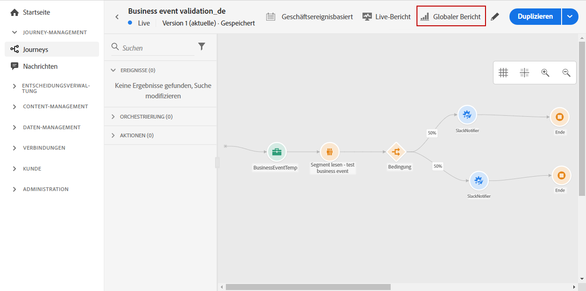

# Journey globaler Bericht {#journey-global-report}

Über die Schaltfläche **[!UICONTROL Globaler Bericht]** können Sie direkt von Ihrer Journey auf den Journey-globalen Bericht zugreifen.

Die Seite &quot;Journey **[!UICONTROL Globaler Bericht]**&quot;wird mit den folgenden Registerkarten angezeigt:

* [Journey](#journey-global)
* [E-Mail](#email-global)
* [Push-Benachrichtigung](#push-global)

Der Journey **[!UICONTROL Globaler Bericht]** wird in verschiedene Widgets unterteilt, die den Erfolg und die Fehler Ihres Journey detailliert beschreiben. Jedes Widget kann bei Bedarf angepasst und gelöscht werden. Weiterführende Informationen dazu finden Sie in diesem [Abschnitt](global-report.md#modify-dashboard).

## Journey tab {#journey-global}

Auf der Registerkarte **[!UICONTROL Globaler Bericht]** erhalten Sie eine klare Ansicht der wichtigsten Verfolgungsdaten zu Ihrer Journey.****

Mit dem Widget **[!UICONTROL Journey performance]** können Sie den Pfad Ihrer zielgerichteten Profil Schritt für Schritt durch Ihre Journey sehen.

Das Widget **[!UICONTROL Statistiken der Journey]** zeigt die folgenden KPIs an:

* **[!UICONTROL Eingegebene Profil]**: Gesamtzahl der Personen, die das Ereignis der Journey erreicht haben.

* **[!UICONTROL Exittierte Profil]**: Gesamtzahl der Personen, die die Journey verlassen haben.

* **[!UICONTROL Fehlgeschlagene individuelle Journey]**: Gesamtzahl der einzelnen Journey, die nicht erfolgreich ausgeführt wurden.

Mit den Widgets **[!UICONTROL Ereignis Performance]** und **[!UICONTROL Top-Ereignis]** können Sie sehen, welches **[!UICONTROL Ereignis]** erfolgreich über Diagramme und Tabellen ausgeführt wurde.

**[!UICONTROL Action]** Performance und  **[!UICONTROL Top-]** ActionWidgets stellen die erfolgreichsten Aktionen und Fehler dar, die beim Auslösen Ihrer  **** Aktionen aufgetreten sind. Die Tabelle **[!UICONTROL Top-Aktionen]** enthält die für **[!UICONTROL Aktionen]** verfügbaren Daten, z. B.:

* **[!UICONTROL Erfolgreich ausgeführte]** Aktionen: Gesamtanzahl der  **** Aktionen, die für eine Journey erfolgreich ausgeführt wurden.

* **[!UICONTROL Fehler in Aktion]**: Gesamtanzahl der Fehler, die bei  **[!UICONTROL Aktionen]** aufgetreten sind.

Das Diagramm **[!UICONTROL Fehlergründe]** zeigt den Typ der Fehler an, die bei **[!UICONTROL Aktionen]** aufgetreten sind.

<!--Events by origin-->

## Registerkarte &quot;E-Mail&quot; {#email-global}

Auf der Registerkarte **[!UICONTROL Globaler Bericht]** finden Sie auf der Registerkarte **[!UICONTROL E-Mail]** die Hauptinformationen zu den E-Mail-Versänden, die in Ihrer Journey gesendet werden.

Einen ausführlichen Bericht zu einem bestimmten E-Mail-Versand finden Sie im Abschnitt [Globalen E-Mail-Bericht](#email-global-report).

Im Diagramm **[!UICONTROL E-Mail-Versendestatistik]** wird der Erfolg Ihres Versands beschrieben:

* **[!UICONTROL Gesendet]**: Gesamtanzahl der Sends für den Versand.

* **[!UICONTROL Ausgeliefert]**: Anzahl der erfolgreich gesendeten Nachrichten im Verhältnis zur Gesamtanzahl der gesendeten Nachrichten.

* **[!UICONTROL Versand-Rate]**: Prozentsatz der erfolgreich gesendeten Nachrichten.

* **[!UICONTROL Absprünge]**: Gesamtzahl der während des Versands und der automatischen Rückgabeverarbeitung gesammelten Fehler im Verhältnis zur Gesamtanzahl der gesendeten Nachrichten.

* **[!UICONTROL Absprungrate]**: Prozentsatz der E-Mails, die im Vergleich zu gesendeten E-Mails abgeschnitten wurden.

* **[!UICONTROL Fehler]**: Gesamtanzahl der Fehler, die während eines Versands aufgetreten sind und die Versendung an Profil verhinderten.

* **[!UICONTROL Fehlerquote]**: Prozentsatz der Fehler, die während eines Versands auftraten, der das Senden des Fehlers verhinderte, im Vergleich zu gesendeten E-Mails.

Die **[!UICONTROL E-Mail - Verfolgungsstatistiken]** enthalten die verfügbaren Daten für die Aktivität des Empfängers für Ihren Versand:

* **[!UICONTROL Öffnet]**: Gibt an, wie oft der Versand in einem Versand geöffnet wurde.

* **[!UICONTROL Eindeutige Öffnen]**: Prozentsatz der geöffneten Versand.

* **[!UICONTROL Offene Rate]**: Gesamtzahl der geöffneten E-Mails im Vergleich zur Anzahl der zugestellten E-Mails.

* **[!UICONTROL Klicks]**: Anzahl der Klicks auf einen Inhalt in einer E-Mail.

* **[!UICONTROL Eindeutige Klicks]**: Anzahl der Empfänger, die in einer E-Mail auf einen Inhalt geklickt haben.

* **[!UICONTROL Durchklickrate]**: Prozentsatz der Benutzer, die mit der Journey interagiert haben.

Das Diagramm **[!UICONTROL Sendenstatistik]** enthält die für gesendete E-Mails verfügbaren Daten, z. B.:

* **[!UICONTROL Ausgeliefert]**: Anzahl der erfolgreich gesendeten Nachrichten im Verhältnis zur Gesamtanzahl der gesendeten Nachrichten.

* **[!UICONTROL Absprünge]**: Gesamtzahl der während des Versands und der automatischen Rückgabeverarbeitung gesammelten Fehler im Verhältnis zur Gesamtanzahl der gesendeten Nachrichten.

* **[!UICONTROL Fehler]**: Gesamtanzahl der Fehler, die während eines Versands aufgetreten sind und die Versendung an Profil verhinderten.

Die Widgets **[!UICONTROL Absprunggründe]** und **[!UICONTROL Absprunggrundsätze]** enthalten die verfügbaren Daten zu absprungenen Kategorien wie:

* **[!UICONTROL Hardbounce]**: die Gesamtzahl der permanenten Fehler, wie eine falsche E-Mail-Adresse. Dies umfasst eine Fehlermeldung, die explizit angibt, dass die Adresse ungültig ist, z. B. Unbekannte Nutzer.

* **[!UICONTROL Softbounce]**: die Gesamtzahl der temporären Fehler, wie eine volle Inbox.

* **[!UICONTROL Ignoriert]**: Die Gesamtanzahl der temporären Ereignisse (z. B. Abwesenheitszeiten) oder ein technischer Fehler, z. B. wenn der Absender Postmaster ist.

Weitere Informationen zu Absprüngen finden Sie auf der Seite [Unterdrückungs-Listen verwalten](../suppression-lists.md).

Das Diagramm **[!UICONTROL E-Mail - Top-URL]** und die Tabellendetails, welche URLs von Ihrem Versand am häufigsten besucht werden.

Das Diagramm **[!UICONTROL E-Mail - Beste Empfänger-Domäne]** und die Tabellendetails, welche Domänen von Empfängern am häufigsten zum Öffnen der E-Mail verwendet werden.

## Push-Registerkarte {#push-global}

Auf der Registerkarte **[!UICONTROL Globaler Bericht]** geben Sie unter **[!UICONTROL Push]** die Hauptinformationen zu den in Ihrer Journey gesendeten Push-Versänden an.

Einen ausführlichen Bericht zu einem bestimmten Push-Versand finden Sie im [Push Global-Bericht](#push-global-report).

Die Tabelle **[!UICONTROL Push-Benachrichtigung - Senden von Statistiken]** enthält die wichtigsten Informationen zu Ihren Push-Benachrichtigungen mit Diagrammen und KPIs:

* **[!UICONTROL Gesendet]**: Gesamtanzahl der Sends für den Versand.

* **[!UICONTROL Ausgeliefert]**: Anzahl der erfolgreich gesendeten Nachrichten im Verhältnis zur Gesamtanzahl der gesendeten Nachrichten.

* **[!UICONTROL Versand-Rate]**: Prozentsatz der erfolgreich gesendeten Nachrichten.

* **[!UICONTROL Absprünge]**: Gesamtzahl der während des Versands und der automatischen Rückgabeverarbeitung gesammelten Fehler im Verhältnis zur Gesamtanzahl der gesendeten Nachrichten.

* **[!UICONTROL Absprungrate]**: Prozentsatz der Push-Benachrichtigungen, die im Vergleich zu gesendeten Push-Benachrichtigungen abgeschnitten haben.

* **[!UICONTROL Fehler]**: Gesamtanzahl der Fehler, die während eines Versands aufgetreten sind und die Versendung an Profil verhinderten.

* **[!UICONTROL Fehlerquote]**: Prozentsatz der Fehler, die während eines Versands aufgetreten sind, der das Senden des Fehlers verhindert hat, im Vergleich zu gesendeten Push-Benachrichtigungen.

Die **[!UICONTROL Push - Verfolgungsstatistik]** enthält die verfügbaren Daten zur Aktivität des Empfängers für Ihren Versand:

* **[!UICONTROL Öffnet]**: Gibt an, wie oft eine Nachricht in einem Versand geöffnet wurde.

* **[!UICONTROL Offene Rate]**: Prozentsatz der geöffneten Push-Benachrichtigungen.

* **[!UICONTROL Aktionen]**: Gesamtzahl der Aktionen, die bei der zugestellten Push-Benachrichtigung durchgeführt wurden, z. B. Klicken auf oder Abbruch der Schaltfläche.

* **[!UICONTROL Interaktionen]**: Gesamtanzahl der Öffnen- und Aktionen für diese Push-Benachrichtigung, d. h. wenn das Profil den Push geöffnet hat oder auf eine Schaltfläche geklickt wurde.

* **[!UICONTROL Interaktionsrate]**: Prozentsatz der Öffnen- und Aktionen für diese Push-Benachrichtigung, d. h. wenn das Profil den Push geöffnet hat oder auf eine Schaltfläche geklickt wurde.

Das Diagramm **[!UICONTROL Zusammenfassung der Push-Benachrichtigung]** enthält die Daten, die für gesendete Push-Benachrichtigungen verfügbar sind, z. B.:

* **[!UICONTROL Öffnet]**: Gibt an, wie oft eine Nachricht in einem Versand geöffnet wurde.

* **[!UICONTROL Aktionen]**: Gesamtzahl der Aktionen, die bei der zugestellten Push-Benachrichtigung durchgeführt wurden, z. B. Klicken auf oder Abbruch der Schaltfläche.

* **[!UICONTROL Absprünge]**: Gesamtzahl der während des Versands und der automatischen Rückgabeverarbeitung gesammelten Fehler im Verhältnis zur Gesamtanzahl der gesendeten Nachrichten.

* **[!UICONTROL Ausgeliefert]**: Anzahl der erfolgreich gesendeten Nachrichten im Verhältnis zur Gesamtanzahl der gesendeten Nachrichten.

* **[!UICONTROL Fehler]**: Gesamtanzahl der Fehler, die während eines Versands aufgetreten sind und die Versendung an Profil verhinderten.

In der Grafik und Tabelle **[!UICONTROL Fehlergründe]** können Sie sehen, welcher Fehler während des Versands aufgetreten ist.

Die Diagramme und Tabellen **[!UICONTROL Verfolgung nach Plattform]**, **[!UICONTROL Versenden nach Plattform]** und **[!UICONTROL Aufschlüsselung nach Plattform]** geben einen Überblick über den Erfolg Ihrer Push-Benachrichtigung, je nach Betriebssystem Ihres Empfängers.
