# Globaler Bericht zur Journey {#journey-global-report}

>[!CONTEXTUALHELP]
>id="ajo_journey_global_report"
>title="Globaler Bericht zur Journey"
>abstract="Der globale Bericht zur Journey ermöglicht die Messung der Wirkung von Journeys über einen ausgewählten Zeitraum. Der Bericht ist in verschiedene Widgets unterteilt, die den Erfolg und die Fehler der Journey detailliert darstellen. Jedes Reporting-Dashboard kann durch Ändern der Größe oder Entfernen von Widgets verändert werden."

Globale Berichte, auf die über die Registerkarte „Gesamte Zeit“ zugegriffen werden kann, zeigen Ereignisse an, die vor mindestens zwei Stunden aufgetreten sind, und decken Ereignisse über einen ausgewählten Zeitraum ab. Im Vergleich dazu konzentrieren sich Live-Berichte auf Ereignisse, die innerhalb der letzten 24 Stunden stattgefunden haben. Der Zeitraum ab dem Auftreten des Ereignisses beträgt mindestens zwei Minuten.

Über die Schaltfläche **[!UICONTROL Bericht anzeigen]** können Sie direkt von Ihrer Journey auf den globalen Bericht zur Journey zugreifen.

Die Seite **[!UICONTROL Globaler Bericht]** zur Journey wird mit den folgenden Registerkarten angezeigt:

* [Journey](#journey-global)
* [E-Mail](#email-global)
* [Push-Benachrichtigung](#push-global)
* [SMS](#sms-global)
* [In-App](#in-app-global)

Der **[!UICONTROL globale Bericht]** zur Journey ist in verschiedene Widgets unterteilt, die den Erfolg und die Fehler Ihrer Journey detailliert beschreiben. Jedes Widget kann bei Bedarf angepasst und gelöscht werden. Weiterführende Informationen dazu finden Sie in diesem [Abschnitt](global-report.md#modify-dashboard).

Eine detaillierte Liste aller in Adobe Journey Optimizer verfügbaren Metriken finden Sie auf [dieser Seite](global-report.md#list-of-components-global).

## Registerkarte „Journey“ {#journey-global}

In Ihrem **[!UICONTROL globalen Bericht]** zur Journey erhalten Sie auf der Registerkarte **[!UICONTROL Journey]** eine übersichtliche Darstellung der wichtigsten Tracking-Daten zu Ihrer Journey.

### Journey-Performance {#journey-perfomance}

>[!CONTEXTUALHELP]
>id="ajo_journey_performance"
>title="Journey-Performance"
>abstract="XX"

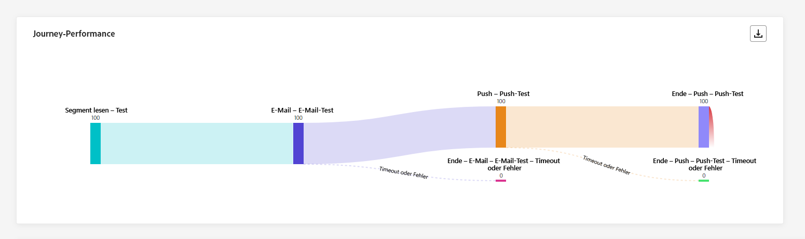

Die **[!UICONTROL Journey-Performance]** -Widget ermöglicht es Ihnen, während der Navigation durch Ihre Journey visuell den Verlauf Ihrer Zielprofile zu verfolgen.

### Journey-Statistiken {#journey-statistics}

>[!CONTEXTUALHELP]
>id="ajo_journey_statistics"
>title="Journey-Statistiken"
>abstract="XX"

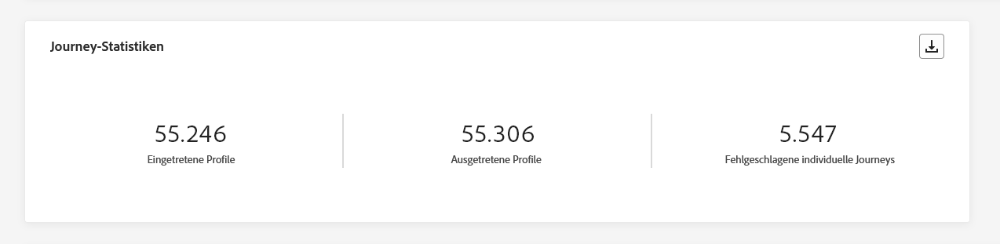

Die **[!UICONTROL Journey-Statistiken]** Key Performance Indicators (KPIs) dienen als allumfassendes Dashboard und liefern eine Analyse der wesentlichen Metriken, die mit Ihrer Journey verknüpft sind. Dies umfasst Details wie die Anzahl der erfassten Profile und Instanzen fehlgeschlagener Journey und bietet einen umfassenden Einblick in die Effektivität Ihrer Journey und den Grad der Interaktion.

+++ Weitere Informationen zu Journey-Statistikmetriken

* **[!UICONTROL Eingestiegene Profile]**: Gesamtzahl der Personen, die das Eintrittsereignis der Journey erreicht haben.

* **[!UICONTROL Ausgestiegene Profile]**: Gesamtzahl der Personen, die die Journey verlassen haben.

* **[!UICONTROL Fehlgeschlagene individuelle Journey]**: Gesamtzahl der individuellen Journeys, die nicht erfolgreich ausgeführt wurden.

+++

### Aktionsleistung {#action-performance}

>[!CONTEXTUALHELP]
>id="ajo_journey_action_performance"
>title="Aktionsleistung"
>abstract="XX"

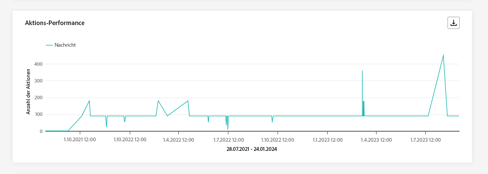

Die **[!UICONTROL Aktionsleistung]** Widget stellt die erfolgreichsten Aktionen dar, die beim **[!UICONTROL Aktionen]** ausgelöst wurden.

### Top-Aktionen {#top-actions}

>[!CONTEXTUALHELP]
>id="ajo_journey_top_actions"
>title="Top-Aktionen"
>abstract="XX"

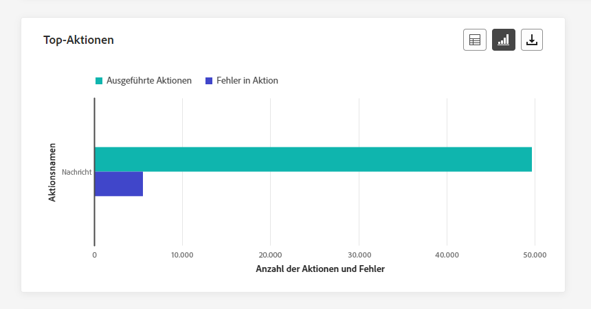

Die **[!UICONTROL Top-Aktionen]** -Tabelle wichtige Daten zu Ihrer **[!UICONTROL Aktionen]**. Es bietet kurze Einblicke in die Häufigkeit und Leistung jeder Aktion.

+++ Weitere Informationen zu den Metriken für Top-Aktionen

* **[!UICONTROL Erfolgreich ausgeführte Aktionen]**: Gesamtanzahl der **[!UICONTROL Aktionen]**, die für eine Journey erfolgreich ausgeführt wurden.

* **[!UICONTROL Fehler in Aktion]**: Gesamtanzahl der Fehler, die bei **[!UICONTROL Aktionen]** aufgetreten sind.

+++

### Gründe für Aktionsfehler {#action-error}

>[!CONTEXTUALHELP]
>id="ajo_journey_actions_error_reasons"
>title="Gründe für Aktionsfehler"
>abstract="XX"

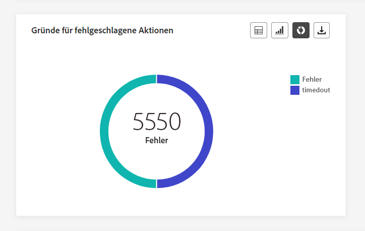

Die **[!UICONTROL Gründe für Aktionsfehler]**  Tabellen und Grafiken bieten einen umfassenden Überblick über Fehler, die während der Ausführung Ihrer **[!UICONTROL Aktionen]**.

### Ereignisse nach Ursprung {#events-origin}

>[!CONTEXTUALHELP]
>id="ajo_journey_events_origin"
>title="Ereignisse nach Ursprung"
>abstract="XX"

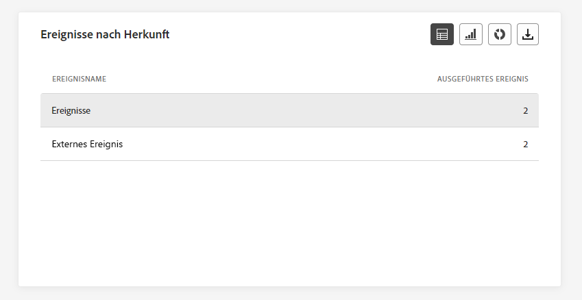

Die **[!UICONTROL Ereignisse nach Ursprung]** Tabellen und Grafiken bieten einen detaillierten Überblick über den erfolgreichen Empfang Ihrer **[!UICONTROL Veranstaltungen]**. Durch diese visuellen Darstellungen können Sie genau erkennen, welche Ihrer **[!UICONTROL Veranstaltungen]** wurden effektiv empfangen und bieten wertvolle Einblicke in die Performance und Wirkung einzelner Veranstaltungen innerhalb Ihrer Journey.

### Vom Ereignis empfangene Ereignisse {#events-received}

>[!CONTEXTUALHELP]
>id="ajo_journey_events_received"
>title="Vom Ereignis empfangene Ereignisse"
>abstract="XX"

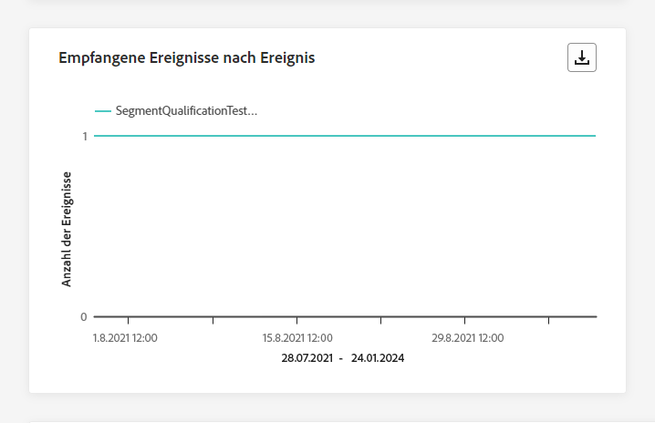

Die **[!UICONTROL Vom Ereignis empfangene Ereignisse]** -Diagramm ermöglicht es Ihnen, die spezifischen **[!UICONTROL Ereignis]** innerhalb Ihrer Journey effektiv ausgeführt wurde, was wertvolle Einblicke in die Performance und Erfolgsraten einzelner Ereignisse bietet.

### Top-Ereignisse {#top-events}

>[!CONTEXTUALHELP]
>id="ajo_journey_top_events"
>title="Top-Ereignisse"
>abstract="XX"

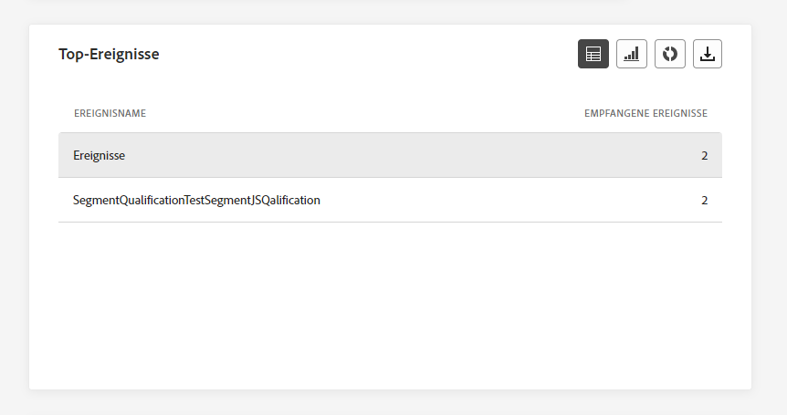

Die **[!UICONTROL Top-Ereignisse]** -Tabelle wichtige Daten zu Ihrer **[!UICONTROL Veranstaltungen]**. Es bietet kurze Einblicke in die Häufigkeit und Leistung jedes einzelnen **[!UICONTROL Ereignis]**.

### Einverständnisrichtlinien {#consent-policies}

>[!CONTEXTUALHELP]
>id="ajo_journey_consent_policies"
>title="Einverständnisrichtlinien"
>abstract="XX"

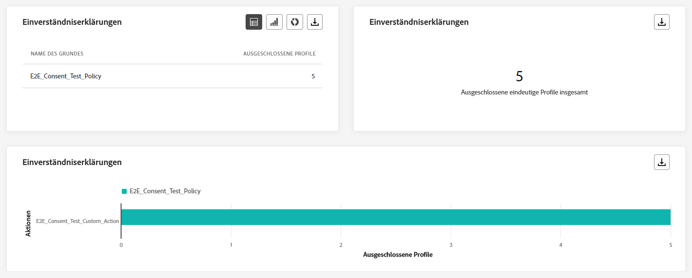

Die **[!UICONTROL Einverständnisrichtlinien]** Tabelle und Diagramm zeigen die Anzahl der Profile, die von den einzelnen Richtlinien in Ihren benutzerdefinierten Aktionen ausgeschlossen sind. Dies bietet einen klaren Einblick in die Auswirkungen der einzelnen Zustimmungsrichtlinien auf Profilausschlüsse.

Weitere Informationen zur Anpassung von Aktionen finden Sie in [der entsprechenden Dokumentation](../action/about-custom-action-configuration.md).

Damit diese Widgets in Ihren Journey-Berichten angezeigt werden, müssen Sie Ihre Dashboards zurücksetzen. Klicken Sie dazu auf **[!UICONTROL Ändern]** und dann oben in Ihrem Bericht auf **[!UICONTROL Zurücksetzen]**.

## Registerkarte „E-Mail“ {#email-global}

Von Ihrer Journey **[!UICONTROL Globaler Bericht]**, die **[!UICONTROL Email]** im Tab werden die wichtigsten Informationen zu den auf Ihrer Journey gesendeten E-Mails aufgeführt.

### E-Mail - Versandstatistiken {#email-sending-statistics}

>[!CONTEXTUALHELP]
>id="ajo_journey_email_sending_statistics"
>title="E-Mail - Versandstatistiken"
>abstract="XX"

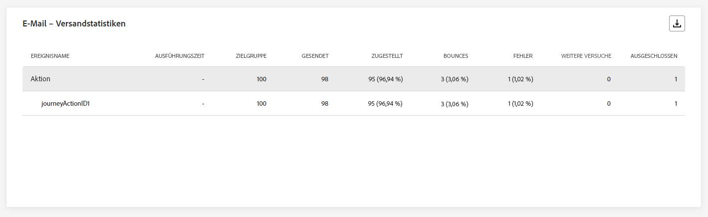

Die **[!UICONTROL Statistiken zum E-Mail-Versand]** bietet eine umfassende Zusammenfassung wichtiger Daten zu E-Mails in Ihren Journey. Sie enthält wichtige Metriken wie die Größe der Zielgruppe und die Anzahl der erfolgreich zugestellten E-Mails und bietet wertvolle Einblicke in die Effektivität und Reichweite Ihrer E-Mails und Journey.

+++ Weitere Informationen zu Metriken für E-Mail-Versandstatistiken

* **[!UICONTROL Ausführungszeit]**: Startzeit jeder Journey-Ausführung bei wiederkehrenden Journeys. Um nur eine oder mehrere Wiederholungen festzulegen, wählen Sie sie die gewünschte Option in der Dropdown-Liste **[!UICONTROL Ausführungszeit]**.

* **[!UICONTROL Zielgruppe]**: Anzahl der Profile, die bei einer Aktion wie etwa E-Mail- oder SMS-Versand angesprochen werden.

* **[!UICONTROL Gesendet]**: Gesamtzahl der für die Journey gesendeten E-Mails.

* **[!UICONTROL Zugestellt]**: Anzahl der erfolgreich gesendeten E-Mails in Bezug auf die Gesamtzahl der gesendeten E-Mails.

* **[!UICONTROL Versandrate]**: Prozentsatz der erfolgreich gesendeten E-Mails.

* **[!UICONTROL Bounces]**: Gesamtzahl der Fehler, die während des Versandvorgangs kumuliert wurden, und der automatischen Bounce-Verarbeitung in Bezug auf die Gesamtzahl der gesendeten E-Mails.

* **[!UICONTROL Bounce-Rate]**: Prozentsatz der E-Mails, die nicht erfolgreich zugestellt wurden, im Vergleich zur Zahl der gesendeten E-Mails.

* **[!UICONTROL Fehler]**: Gesamtzahl der während des Versandvorgangs aufgetretenen Fehler, die den Versand an Profile verhindert haben.

* **[!UICONTROL Fehlerrate]**: Prozentsatz der Fehler, die während des Versandvorgangs auftraten und die Zustellung verhinderten, im Vergleich zur Zahl der gesendeten E-Mails.

* **[!UICONTROL Weitere Zustellversuche]**: Anzahl der E-Mails in der Warteschlange für weitere Zustellversuche.

* **[!UICONTROL Ausgeschlossen]**: Anzahl der Profile, die durch Adobe Journey Optimizer ausgeschlossen wurden.

+++

### E-Mail – Tracking-Statistik {#email-tracking}

>[!CONTEXTUALHELP]
>id="ajo_journey_email_tracking_statistics"
>title="E-Mail – Tracking-Statistik"
>abstract="XX"

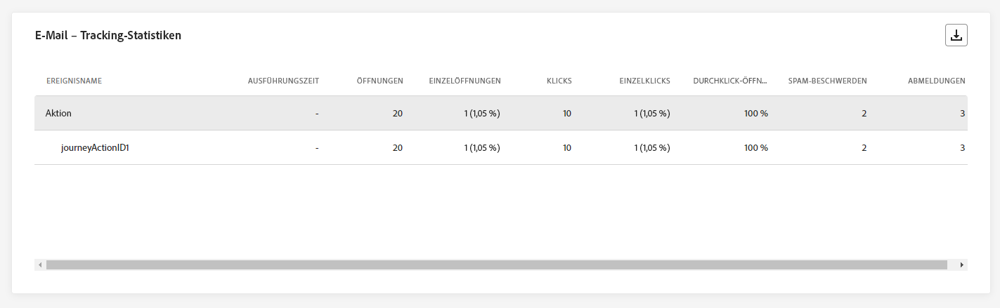

Die **[!UICONTROL E-Mail - Trackingstatistiken]** bietet eine detaillierte Übersicht über die Profilaktivität in Bezug auf E-Mails, die in Ihrer Journey enthalten sind. Dazu gehören Metriken zu Öffnungen, Klicks und andere relevante Interaktionsindikatoren, die einen umfassenden Überblick darüber bieten, wie Profile mit Ihrem E-Mail-Inhalt interagieren.

+++ Weitere Informationen zu E-Mail - Trackingstatistiken - Metriken

* **[!UICONTROL Ausführungszeit]**: Startzeit jeder Ausführung der wiederkehrenden E-Mail in Ihrer Journey. Um nur eine oder mehrere wiederkehrende E-Mails festzulegen, wählen Sie die gewünschte Option in der Dropdown-Liste **[!UICONTROL Ausführungszeit]**.

* **[!UICONTROL Öffnungen]**: Gibt an, wie oft Ihre E-Mails auf einem Journey geöffnet wurden.

* **[!UICONTROL Eindeutige Öffnungen]**: Prozentsatz der geöffneten E-Mails.

* **[!UICONTROL Rate der Einzelöffnungen]**: Gesamtzahl der geöffneten E-Mails im Vergleich zu den versendeten E-Mails.

* **[!UICONTROL Klicks]**: Anzahl der Klicks auf einen Inhalt in Ihren E-Mails.

* **[!UICONTROL Einzelklicks]**:Anzahl der Empfänger, die einen Inhalt in Ihren E-Mails angeklickt haben

* **[!UICONTROL Klickrate]**: Prozentsatz der Benutzer, die mit der Journey interagiert haben.

* **[!UICONTROL Abmeldungen]**: Zahl der Klicks auf den Abmelde-Link.

* **[!UICONTROL Beschwerden wegen Spam]**: Anzahl der E-Mails, die als Spam oder Junk gekennzeichnet wurden.

+++

### E-Mail – Versand-Performance {#email-performance}

>[!CONTEXTUALHELP]
>id="ajo_journey_email_sending_performance"
>title="E-Mail – Versand-Performance"
>abstract="XX"

Die **[!UICONTROL E-Mail - Versandleistung]** -Diagramm bietet einen umfassenden Überblick über Daten zu gesendeten E-Mails in Ihrer Journey und bietet Einblicke in wichtige Metriken wie zugestellt und Bounces. Dies ermöglicht eine detaillierte Analyse des E-Mail-Versandprozesses und liefert wertvolle Informationen über die Effizienz und Leistung Ihrer Journey.

+++ Erfahren Sie mehr über E-Mail - Leistungsmetriken senden

* **[!UICONTROL Zugestellt]**: Anzahl der erfolgreich gesendeten E-Mails in Bezug auf die Gesamtzahl der gesendeten E-Mails.

* **[!UICONTROL Bounces]**: Gesamtzahl der kumulierten Fehler beim Versandvorgang und der automatischen Rücksendungen, bezogen auf die Gesamtzahl der gesendeten Nachrichten.

* **[!UICONTROL Weitere Zustellversuche]**: Anzahl der E-Mails in der Warteschlange für weitere Zustellversuche.

* **[!UICONTROL Fehler]**: Gesamtzahl der Fehler, die während des Versandvorgangs aufgetreten sind und die Versendung an Profile verhindert haben.

+++

### E-Mail - Bounce-Kategorien und -Gründe {#email-bounce-categories}

>[!CONTEXTUALHELP]
>id="ajo_journey_email_bounces"
>title="E-Mail - Bounce-Kategorien und -Gründe"
>abstract="XX"

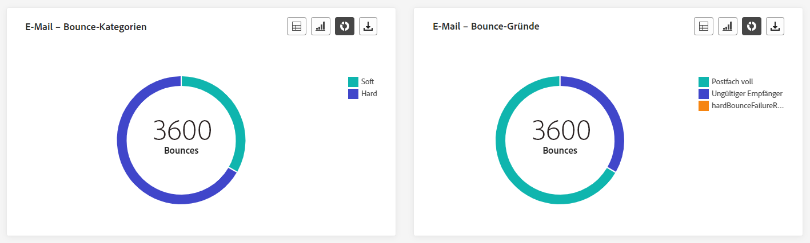

Die **[!UICONTROL Bounce-Gründe]** und **[!UICONTROL Bounce-Kategorien]** Widgets kompilieren die verfügbaren Daten zu Bounce Messages und bieten detaillierte Einblicke in die spezifischen Gründe und Kategorien hinter E-Mail-Bounces.

Weitere Informationen zu Bounces finden Sie auf der Seite [ Unterdrückungslisten](../reports/suppression-list.md).

+++ Weitere Informationen zu E-Mail - Metriken zu Bounce-Kategorien

* **[!UICONTROL Hardbounce]**: die Gesamtzahl der permanenten Fehler, wie eine falsche E-Mail-Adresse. Dazu gehören Fehlermeldungen, die explizit eine ungültige Adresse anzeigen, wie etwa „Benutzer unbekannt“.

* **[!UICONTROL Softbounce]**: die Gesamtzahl der temporären Fehler, wie ein voller Posteingang.

* **[!UICONTROL Ignoriert]**: Die Gesamtzahl der temporären Ereignisse, beispielsweise Abwesenheit, oder technischer Fehler, zum Beispiel wenn der Absendertyp Postmaster ist.

+++

### E-Mail – Fehlerursachen {#email-errors}

>[!CONTEXTUALHELP]
>id="ajo_journey_email_error_reasons"
>title="E-Mail – Fehlerursachen"
>abstract="XX"

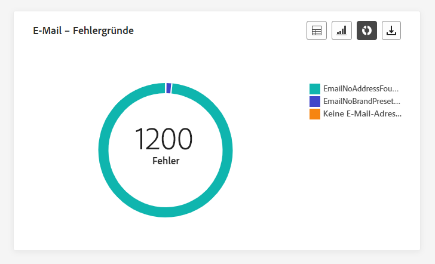

Die **[!UICONTROL Fehlerursachen]** Grafiken und Tabellen bieten einen Überblick über die spezifischen Fehler, die während des Versandvorgangs aufgetreten sind. Sie enthalten wertvolle Informationen über Art und Auftreten von Fehlern.

### E-Mail – Ausgeschlossene Gründe {#email-excluded}

>[!CONTEXTUALHELP]
>id="ajo_journey_email_excluded_reasons"
>title="E-Mail – Ausgeschlossene Gründe"
>abstract="XX"

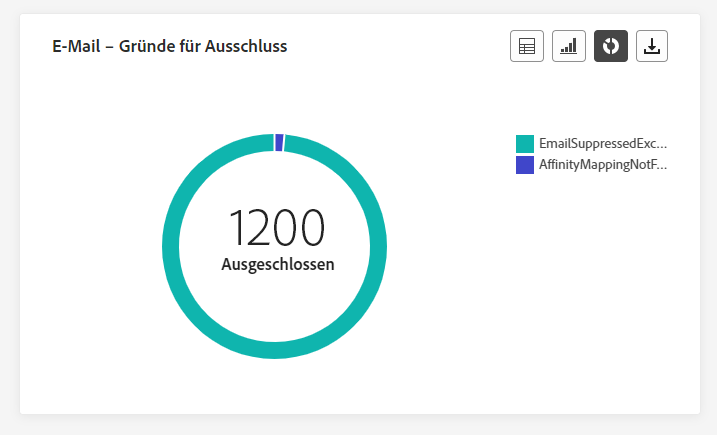

Die **[!UICONTROL Ausgeschlossene Gründe]** Grafiken und Tabellen bieten eine umfassende Übersicht über die verschiedenen Faktoren, die dazu geführt haben, dass Benutzerprofile aus der Zielgruppe ausgeschlossen wurden, sodass die Nachricht nicht empfangen wurde.

Siehe Abschnitt [diese Seite](exclusion-list.md) für die umfassende Liste der Ausschlussgründe.

### Von Domains gesendet und bereitgestellt {#sent-domains}

>[!CONTEXTUALHELP]
>id="ajo_journey_email_sent_delivered_domains"
>title="Von Domains gesendet und bereitgestellt"
>abstract="XX"

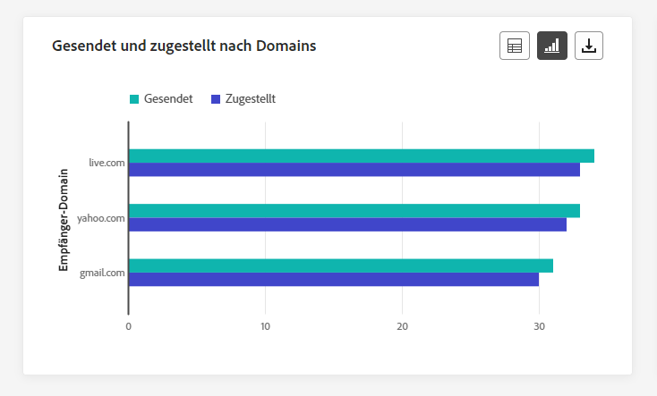

Die  **[!UICONTROL Gesendet und von Domänen bereitgestellt]** Tabellen und Diagramme enthalten eine detaillierte Aufschlüsselung der E-Mails auf Domänenebene und bieten umfassende Einblicke in die Leistung Ihrer E-Mails.

+++ Weitere Informationen zu den Metriken Gesendet und Von Domänen bereitgestellt

* **[!UICONTROL Gesendet]**: Gesamtzahl der gesendeten E-Mails.

* **[!UICONTROL Zugestellt]**: Anzahl der erfolgreich gesendeten E-Mails in Bezug auf die Gesamtzahl der gesendeten E-Mails.

+++

### Aufrufe und Klicks nach Domains {#open-domains}

>[!CONTEXTUALHELP]
>id="ajo_journey_email_open_clicks_domains"
>title="Aufrufe und Klicks nach Domains"
>abstract="XX"

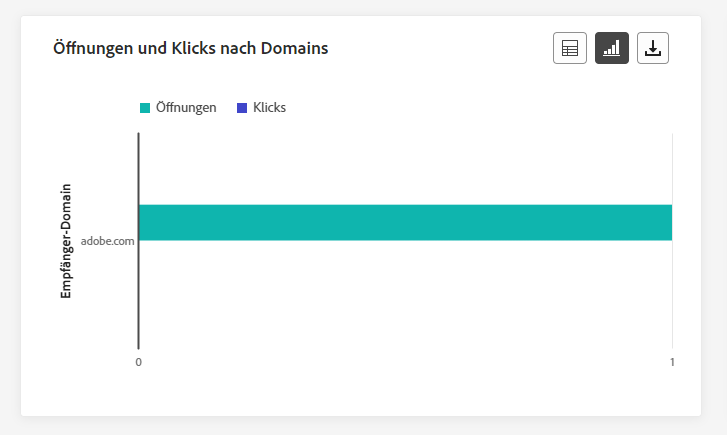

Die  **[!UICONTROL Öffnungen und Klicks nach Domänen]** Diagramm und Tabelle zeigen eine Aufschlüsselung der Interaktion Ihrer Profile mit Ihrer E-Mail auf Domänenebene, die wertvolle Einblicke in die Interaktion verschiedener Domänen mit Ihrem Inhalt bietet.

+++ Weitere Informationen zu den Metriken &quot;Öffnungen und Klicks nach Domänen&quot;

* **[!UICONTROL Öffnungen]**: Anzahl der Öffnungen der E-Mail.

* **[!UICONTROL Klicks]**: Anzahl der Klicks auf Inhalt einer E-Mail.

+++

### Bounces und Fehler nach Domains {#bounces-domains}

>[!CONTEXTUALHELP]
>id="ajo_journey_email_bounces_errors_domains"
>title="Bounces und Fehler nach Domains"
>abstract="XX"

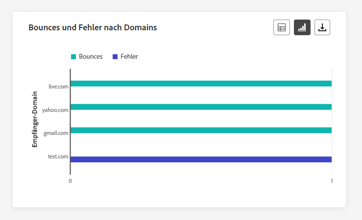

Die  **[!UICONTROL Bounces und Fehler nach Domänen]** Diagramm und Tabelle bieten eine Aufschlüsselung der spezifischen Fehler, die während des Versandvorgangs auf Domänenebene aufgetreten sind, und enthalten eine detaillierte Analyse der aufgetretenen Probleme.

+++ Weitere Informationen zu den Metriken &quot;Absprünge und Fehler nach Domänen&quot;

* **[!UICONTROL Bounces]**: Gesamtzahl der Fehler, die während des Versandvorgangs kumuliert wurden, und der automatischen Bounce-Verarbeitung in Bezug auf die Gesamtzahl der gesendeten E-Mails.

* **[!UICONTROL Fehler]**: Gesamtzahl der während des Versandvorgangs aufgetretenen Fehler, die den Versand an Profile verhindert haben.

+++

### Bounce-Gründe nach Domain {#bounce-reasons-domains}

>[!CONTEXTUALHELP]
>id="ajo_journey_email_bounces_reasons_domains"
>title="Bounces-Gründe nach Domänen"
>abstract="XX"

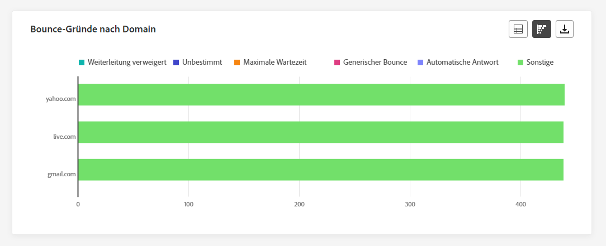

Die  **[!UICONTROL Bounce-Gründe nach Domain]** Diagramme und Tabellen bieten eine Aufschlüsselung der Daten auf Domänenebene bezüglich temporärer und permanenter Fehler und bieten detaillierte Einblicke in die Ursachen für abgespeckte Nachrichten.

### E-Mail – Beste URL {#email-top}

>[!CONTEXTUALHELP]
>id="ajo_journey_email_top_url"
>title="E-Mail – Beste URL"
>abstract="XX"

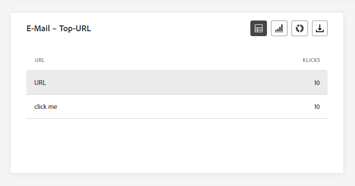

Die **[!UICONTROL Email - Top-URL]** Diagramm und Tabelle bieten einen umfassenden Überblick über die URLs in Ihrer E-Mail, die den höchsten Besucher-Traffic anziehen. Auf diese Weise können Sie die beliebtesten Links identifizieren und priorisieren und so Ihr Verständnis der Profilinteraktion mit bestimmten Inhalten in Ihren E-Mails verbessern.

### E-Mail - Optimierung {#email-sto}

>[!CONTEXTUALHELP]
>id="ajo_journey_email_optimization"
>title="E-Mail - Optimierung"
>abstract="XX"

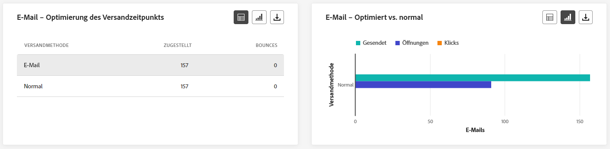

>[!NOTE]
>
>Die **[!UICONTROL Versandzeitoptimierung]** und **[!UICONTROL Optimiert vs. nicht optimiert]** -Widgets sind nur verfügbar, wenn die Option Sendezeitoptimierung für Ihren Versand aktiviert ist. Weitere Informationen zur Sendezeitoptimierung finden Sie auf [dieser Seite](../building-journeys/journeys-message.md#send-time-optimization).

Die **[!UICONTROL Versandzeitoptimierung]** und **[!UICONTROL Optimiert vs. nicht optimiert]** Widgets zeigen den Erfolg Ihrer E-Mails nach der Versandmethode an: optimiert oder normal.

+++ Erfahren Sie mehr über die Sendezeitoptimierung und optimierte und nicht optimierte Metriken

* **[!UICONTROL Zugestellt]**: Zahl der erfolgreich gesendeten Nachrichten im Vergleich zur Gesamtzahl der gesendeten Nachrichten.
* **[!UICONTROL Bounces]**: Gesamtzahl der kumulierten Fehler beim Versandvorgang und der automatischen Rücksendungen, bezogen auf die Gesamtzahl der gesendeten Nachrichten.

* **[!UICONTROL Gesendet]**: Gesamtzahl der für die Journey gesendeten E-Mails.

* **[!UICONTROL Öffnungen]**: Gibt an, wie oft Ihre E-Mails auf dem Journey geöffnet wurden.

* **[!UICONTROL Klicks]**: Anzahl der Klicks auf einen Inhalt in Ihren E-Mails.

+++

### E-Mail - Angebote {#email-offers}

>[!CONTEXTUALHELP]
>id="ajo_journey_email_offers"
>title="E-Mail - Angebote"
>abstract="XX"

>[!NOTE]
>
>Die Angebots-Widgets und -Metriken sind nur verfügbar, wenn eine Entscheidung in eine E-Mail eingefügt wurde. Weiterführende Informationen zum Entscheidungs-Management finden Sie auf dieser [Seite](../offers/get-started/starting-offer-decisioning.md).

Die **[!UICONTROL Angebotsstatistiken]** und **[!UICONTROL Detaillierte Statistiken]** über Widgets vom Typ Zeit hinweg messen Sie den Erfolg und die Wirkung Ihres Angebots auf Ihre Zielgruppe. Sie enthält die wichtigsten Informationen zu Ihrer Nachricht mit KPIs.

+++ Weitere Informationen zu E-Mail - Angebotsmetriken

* **[!UICONTROL Gesendete Angebote]**: Gibt an, wie oft das Angebot gesendet wurde.

* **[!UICONTROL Angebotseindruck]**: Gibt an, wie oft das Angebot in Ihren E-Mails geöffnet wurde.

* **[!UICONTROL Angebotsklicks]**: Anzahl der Klicks auf ein Angebot in Ihren E-Mails.

* **[!UICONTROL Platzierungsname]**: Name der Platzierung, die zur Anzeige Ihres Angebots verwendet wird. Weiterführende Informationen zu Platzierungen finden Sie auf dieser [Seite](../offers/offer-library/creating-placements.md).

* **[!UICONTROL Angebotsname]**: Name des Angebots, das in Ihren E-Mails hinzugefügt wird. Weiterführende Informationen zu Platzierungen finden Sie auf dieser [Seite](../offers/offer-library/creating-personalized-offers.md).

* **[!UICONTROL Angebot versendet]**: Gibt an, wie oft das Angebot insgesamt versendet wurde.

* **[!UICONTROL Impressionsrate des Angebots]**: Prozentsatz der geöffneten Angebote im Verhältnis zur Anzahl der gesendeten Angebote.

* **[!UICONTROL Klickrate des Angebots]**: Prozentsatz der Benutzer, die mit dem Angebot interagiert haben.

+++

## Registerkarte „Push-Benachrichtigung“ {#push-global}

Von Ihrer Journey **[!UICONTROL Globaler Bericht]**, die **[!UICONTROL Push-Benachrichtigung]** im Tab werden die wichtigsten Informationen zu den auf Ihrer Journey gesendeten Push-Benachrichtigungen aufgeführt.

### Push-Benachrichtigung – Sendestatistik {#push-sending-stat}

>[!CONTEXTUALHELP]
>id="ajo_journey_push_sending_statistics"
>title="Push-Benachrichtigung – Sendestatistik"
>abstract="XX"

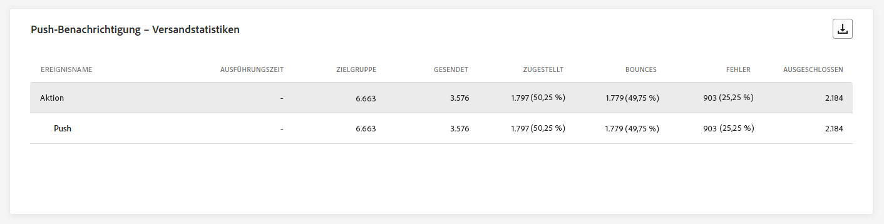

Die **[!UICONTROL Push-Benachrichtigung - Versandstatistiken]** bietet eine kurze Zusammenfassung wichtiger Daten zu Ihren Push-Benachrichtigungen, einschließlich Schlüsselmetriken wie der Anzahl der Zielkontakte und der Anzahl der erfolgreich zugestellten Nachrichten.

+++ Weitere Informationen zu Push-Benachrichtigungen - Metriken für Versandstatistiken

* **[!UICONTROL Ausführungszeit]**: Startzeit jeder Journey-Ausführung bei wiederkehrenden Journeys. Um nur eine oder mehrere Wiederholungen festzulegen, wählen Sie sie die gewünschte Option in der Dropdown-Liste **[!UICONTROL Ausführungszeit]**.

* **[!UICONTROL Zielgruppe]**: Anzahl der Profile, die bei einer Aktion wie etwa E-Mail- oder SMS-Versand angesprochen werden.

* **[!UICONTROL Gesendet]**: Gesamtzahl der gesendeten Push-Benachrichtigungen.

* **[!UICONTROL Zugestellt]**: Anzahl der erfolgreich gesendeten Push-Benachrichtigungen in Bezug auf die Gesamtzahl der gesendeten Push-Benachrichtigungen

* **[!UICONTROL Versandrate]**: Prozentsatz der erfolgreich gesendeten Push-Benachrichtigungen.

* **[!UICONTROL Bounces]**: Gesamtzahl der während des Versandvorgangs kumulierten Fehler und der automatischen Bounce-Verarbeitung in Bezug auf die Gesamtzahl der gesendeten Push-Benachrichtigungen.

* **[!UICONTROL Bounce-Rate]**: Prozentsatz der Push-Benachrichtigungen, die unzustellbar waren, im Vergleich zu den gesendeten Push-Benachrichtigungen.

* **[!UICONTROL Fehler]**: Gesamtzahl der während des Versandvorgangs aufgetretenen Fehler, die den Versand an Profile verhindert haben.

* **[!UICONTROL Fehlerrate]**: Prozentsatz der Fehler, die während des Versandvorgangs aufgetreten sind und den Versand nicht verhindert haben, in Bezug auf die gesendeten Push-Benachrichtigungen.

* **[!UICONTROL Ausgeschlossen]**: Anzahl der Profile, die durch Adobe Journey Optimizer ausgeschlossen wurden.

+++

### Push-Benachrichtigung – Tracking-Statistik {#push-tracking-stat}

>[!CONTEXTUALHELP]
>id="ajo_journey_push_tracking_statistics"
>title="Push-Benachrichtigung – Tracking-Statistik"
>abstract="XX"

Die **[!UICONTROL Push - Trackingstatistiken]** Widget bietet eine detaillierte Momentaufnahme der Profilaktivität, die mit Ihren Push-Benachrichtigungen verknüpft ist, und bietet wichtige Einblicke in die Interaktion und die Effektivität von Push-Benachrichtigungen.

+++ Weitere Informationen zu Push-Benachrichtigungen - Metriken zur Trackingstatistik

* **[!UICONTROL Ausführungszeit]**: Startzeit jeder Journey-Ausführung bei wiederkehrenden Journeys. Um nur eine oder mehrere Wiederholungen festzulegen, wählen Sie sie die gewünschte Option in der Dropdown-Liste **[!UICONTROL Ausführungszeit]**.

* **[!UICONTROL Öffnungen]**: Gibt an, wie oft Ihre Push-Benachrichtigungen auf dem Journey geöffnet wurden.

* **[!UICONTROL Aktionen]**: Gesamtzahl der Aktionen, die bei der gesendeten Push-Benachrichtigung durchgeführt wurden, d. h. Klick auf Schaltfläche oder Abbruch.

+++

### Push-Benachrichtigung – Sendezusammenfassung {#push-summary}

>[!CONTEXTUALHELP]
>id="ajo_journey_push_sending_summary"
>title="Push-Benachrichtigung – Sendezusammenfassung"
>abstract="XX"

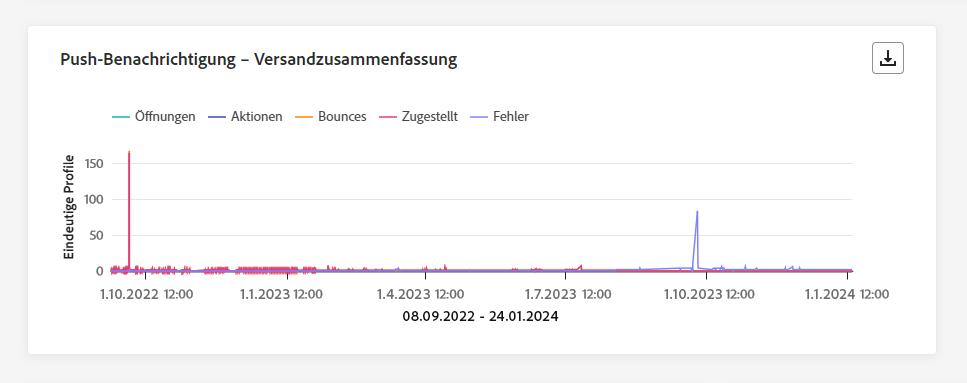

Die **[!UICONTROL Push-Benachrichtigung - Versandzusammenfassung]** -Diagramm bietet eine dynamische Darstellung mit einer Analyse Ihrer Push-Benachrichtigungs-Aktivität. Diese grafische Darstellung bietet eine umfassende Aufschlüsselung gesendeter Push-Benachrichtigungen.

+++ Erfahren Sie mehr über Push-Benachrichtigungen - Metriken zur Versandzusammenfassung

* **[!UICONTROL Öffnungen]**: Gibt an, wie oft Ihre Push-Benachrichtigungen auf dem Journey geöffnet wurden.

* **[!UICONTROL Aktionen]**: Gesamtzahl der Aktionen, die bei der gesendeten Push-Benachrichtigung durchgeführt wurden, d. h. Klick auf Schaltfläche oder Abbruch.

* **[!UICONTROL Bounces]**: Gesamtzahl der während des Versandvorgangs kumulierten Fehler und der automatischen Bounce-Verarbeitung in Bezug auf die Gesamtzahl der gesendeten Push-Benachrichtigungen.

* **[!UICONTROL Zugestellt]**: Anzahl der erfolgreich gesendeten Push-Benachrichtigungen in Bezug auf die Gesamtzahl der gesendeten Push-Benachrichtigungen

* **[!UICONTROL Fehler]**: Gesamtzahl der während des Versandvorgangs aufgetretenen Fehler, die den Versand an Profile verhindert haben.

+++

### Push-Benachrichtigung – Fehlerursachen {#push-error-reasons}

>[!CONTEXTUALHELP]
>id="ajo_journey_push_error_reasons"
>title="Push-Benachrichtigung – Fehlerursachen"
>abstract="XX"

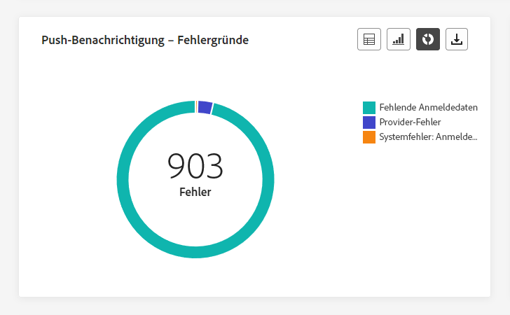

Die **[!UICONTROL Fehlerursachen]** Tabellen und Diagramme bieten Ihnen die Möglichkeit, spezifische Fehler zu identifizieren, die während des Versandvorgangs Ihrer Push-Benachrichtigungen aufgetreten sind. So erhalten Sie detaillierte Einblicke in Probleme, die während des Versandvorgangs aufgetreten sind.

### Push-Benachrichtigung – Ausschlussursachen {#push-excluded}

>[!CONTEXTUALHELP]
>id="ajo_journey_push_excluded_reasons"
>title="Push-Benachrichtigung – Ausschlussursachen"
>abstract="XX"

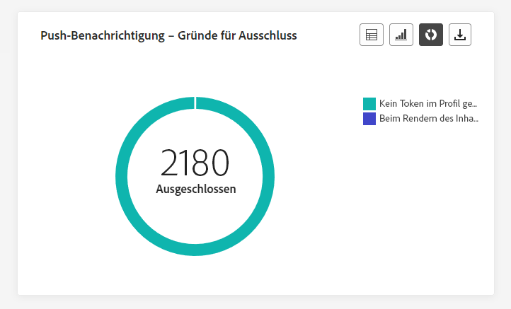

Die **[!UICONTROL Ausgeschlossene Gründe]** Grafiken und Tabellen zeigen die unterschiedlichen Gründe an, die verhindern, dass aus den Zielgruppenprofilen ausgeschlossene Benutzerprofile Ihre Push-Benachrichtigungen empfangen.

Siehe Abschnitt [diese Seite](exclusion-list.md) für die umfassende Liste der Ausschlussgründe.

### Push-Benachrichtigung – Aufschlüsselung nach Plattform {#push-breakdown}

>[!CONTEXTUALHELP]
>id="ajo_journey_push_breakdown_platform"
>title="Push-Benachrichtigung - Aufschlüsselung nach Plattform"
>abstract="XX"

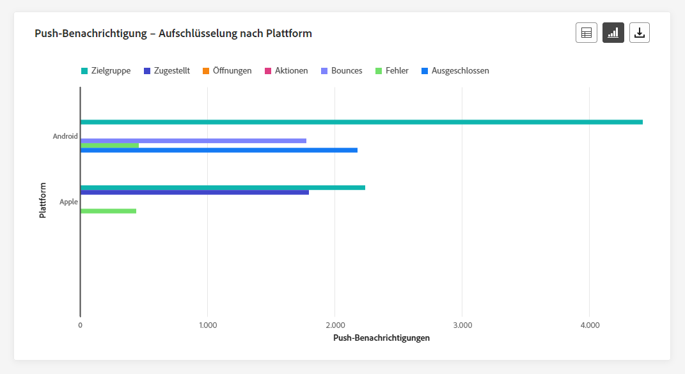

Die **[!UICONTROL Verteilung nach Plattform]** Diagramme und Tabellen enthalten eine detaillierte Analyse des Erfolgs Ihrer Push-Benachrichtigungen und bieten Einblicke auf der Basis des Betriebssystems Ihres Profils. Diese Aufschlüsselung verbessert Ihr Verständnis der Leistung Ihrer Push-Benachrichtigungen auf verschiedenen Plattformen.

### Push-Benachrichtigung - Optimierung {#push-sto}

>[!NOTE]
>
>Die Widgets **[!UICONTROL Optimiert vs. nicht optimiert]** und **[!UICONTROL Versandzeitoptimierung]** sind nur verfügbar, wenn die Option „Sendezeitoptimierung“ für Ihren Versand aktiviert ist. Weitere Informationen zur Sendezeitoptimierung finden Sie auf [dieser Seite](../building-journeys/journeys-message.md#send-time-optimization).

Die **[!UICONTROL Optimiert vs. nicht optimiert]** und **[!UICONTROL Versandzeitoptimierung]**  Widgets zeigen die wichtigsten Informationen bezüglich Ihrer Nachricht an, ob sie optimiert wurden oder nicht.

+++ Weitere Informationen zu Push-Benachrichtigungen - Optimierungsmetriken

* **[!UICONTROL Zugestellt]**: Zahl der erfolgreich gesendeten Nachrichten im Vergleich zur Gesamtzahl der gesendeten Nachrichten.

* **[!UICONTROL Öffnungen]**: Gibt an, wie oft Ihre Push-Benachrichtigungen auf dem Journey geöffnet wurden.

* **[!UICONTROL Aktionen]**: Gesamtzahl der Aktionen, die bei der gesendeten Push-Benachrichtigung durchgeführt wurden, d. h. Klick auf Schaltfläche oder Abbruch.

* **[!UICONTROL Zugestellt]**: Zahl der erfolgreich gesendeten Nachrichten im Vergleich zur Gesamtzahl der gesendeten Nachrichten.

* **[!UICONTROL Bounces]**: Gesamtzahl der kumulierten Fehler beim Versandvorgang und der automatischen Rücksendungen, bezogen auf die Gesamtzahl der gesendeten Nachrichten.

+++

## Registerkarte „SMS“ {#sms-global}

### SMS – Sendestatistik {#sms-sending-stat}

>[!CONTEXTUALHELP]
>id="ajo_journey_sms_sending_statistics"
>title="SMS – Sendestatistik"
>abstract="XX"

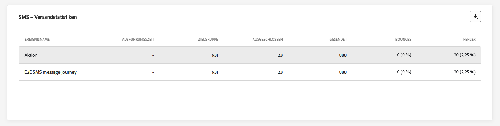

Die **[!UICONTROL SMS - Versandstatistiken]** bietet eine kurze Zusammenfassung wichtiger Daten zu Ihren SMS-Nachrichten, die wichtige Metriken wie die Anzahl der Zielkontakte und die Anzahl der erfolgreich zugestellten Nachrichten umfassen.

+++ Weitere Informationen zu SMS - Metriken für Versandstatistiken

* **[!UICONTROL Ausführungszeit]**: Startzeit jeder Journey-Ausführung bei wiederkehrenden Journeys. Um nur eine oder mehrere Wiederholungen festzulegen, wählen Sie sie die gewünschte Option in der Dropdown-Liste **[!UICONTROL Ausführungszeit]**.

* **[!UICONTROL Targeting]**: Anzahl der Benutzerprofile, die als Zielprofile für Ihre SMS-Nachrichten gelten.

* **[!UICONTROL Ausgeschlossen]**: Anzahl der Benutzerprofile, die von den Zielgruppenprofilen ausgeschlossen wurden und Ihre SMS-Nachrichten nicht erhalten haben.

* **[!UICONTROL Gesendet]**: Gesamtzahl der an die Journey gesendeten SMS-Nachrichten.

* **[!UICONTROL Bounces]**: Gesamtzahl der im Versand- und automatischen Bounce-Prozesse kumulierten Fehler in Bezug auf die Gesamtzahl der gesendeten SMS-Nachrichten.

* **[!UICONTROL Fehler]**: Gesamtzahl der während des Versandvorgangs aufgetretenen Fehler, die den Versand an Profile verhindert haben.

+++

### SMS - Trackingstatistiken {#sms-tracking-stat}

>[!CONTEXTUALHELP]
>id="ajo_journey_sms_tracking_statistics"
>title="SMS - Trackingstatistiken"
>abstract="XX"

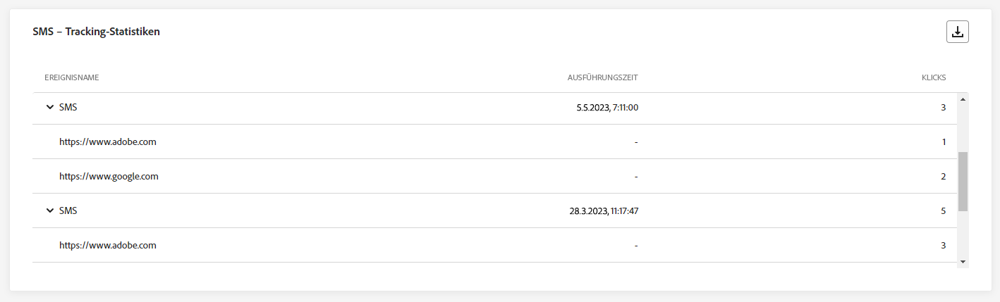

Die **[!UICONTROL SMS - Trackingstatistiken]** Widget bietet einen detaillierten Überblick über wichtige Informationen zur Interaktion Ihrer Besucher mit Ihren URLs und bietet Einblicke in die Effektivität Ihrer SMS-Nachrichten.

* **[!UICONTROL Ausführungszeit]**: Startzeit jeder Ausführung Ihrer wiederkehrenden SMS. Um nur eine oder mehrere wiederkehrende SMS als Zielgruppe auszuwählen, wählen Sie diese aus der **[!UICONTROL Ausführungszeit]** angezeigt.

* **[!UICONTROL Klicks]**: Anzahl der Klicks auf einen Inhalt in Ihren SMS-Nachrichten.

### SMS – Performance nach Datum {#sms-performance-date}

>[!CONTEXTUALHELP]
>id="ajo_journey_sms_perfomance_date"
>title="SMS – Performance nach Datum"
>abstract="XX"

Die **[!UICONTROL SMS - Leistung nach Datum]** -Widget bietet einen detaillierten Überblick über wichtige Informationen zu Ihren Nachrichten, die über ein Diagramm präsentiert werden, und bietet Einblicke in die Leistungstrends über bestimmte Zeiträume.

+++ Erfahren Sie mehr über SMS - Leistung nach Datumsmetriken

* **[!UICONTROL Gesendet]**: Gesamtzahl der gesendeten SMS-Nachrichten für die Journey

* **[!UICONTROL Bounces]**: Gesamtzahl der im Versand- und automatischen Bounce-Prozesse kumulierten Fehler in Bezug auf die Gesamtzahl der gesendeten SMS-Nachrichten.

* **[!UICONTROL Fehler]**: Gesamtzahl der während des Versandvorgangs aufgetretenen Fehler, die den Versand an Profile verhindert haben.

+++

### SMS – Bounce-Ursachen {#sms-bounce}

>[!CONTEXTUALHELP]
>id="ajo_journey_sms_bounces_reasons"
>title="SMS – Bounce-Ursachen"
>abstract="XX"

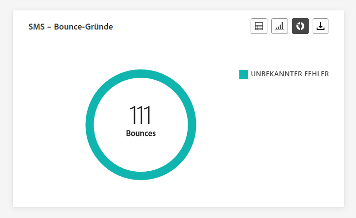

Die **[!UICONTROL Bounces-Gründe]** Grafiken und Tabellen bieten einen umfassenden Überblick über Daten zu Bounce-SMS-Nachrichten und liefern wertvolle Einblicke in die spezifischen Ursachen von SMS-Bounces.

### SMS – Fehlerursachen {#sms-error}

>[!CONTEXTUALHELP]
>id="ajo_journey_sms_error_reasons"
>title="SMS – Fehlerursachen"
>abstract="XX"

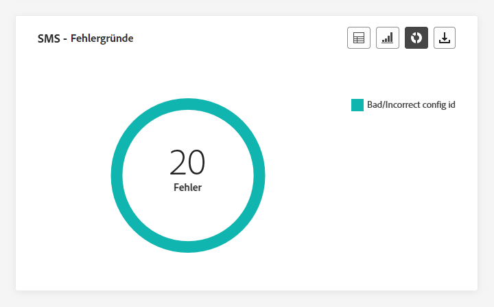

Die **[!UICONTROL Fehlerursachen]** Anhand von Diagrammen und Tabellen können Sie die spezifischen Fehler identifizieren, die während des Versandvorgangs Ihrer SMS aufgetreten sind. Dies ermöglicht eine gründliche Analyse aller aufgetretenen Probleme.

### SMS – Ausschlussursachen {#sms-excluded}

>[!CONTEXTUALHELP]
>id="ajo_journey_sms_excluded_reasons"
>title="SMS – Ausschlussursachen"
>abstract="XX"

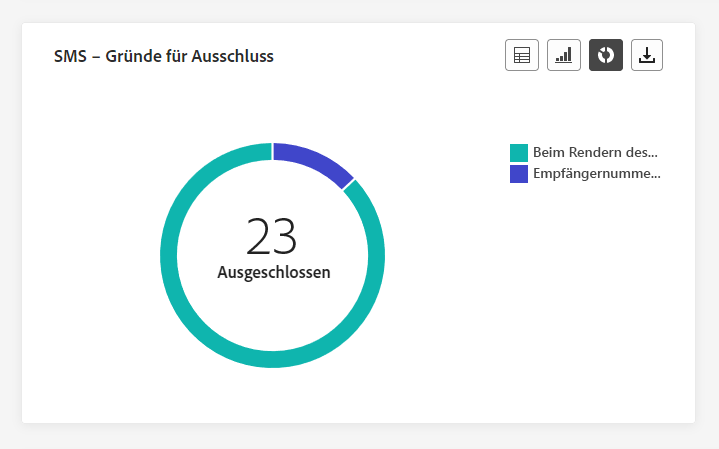

Die **[!UICONTROL Ausgeschlossene Gründe]** Grafiken und Tabellen zeigen visuell die verschiedenen Faktoren an, die zum Ausschluss von Benutzerprofilen aus der Zielgruppe geführt haben, sodass diese keine SMS-Nachrichten erhalten können.

Siehe Abschnitt [diese Seite](exclusion-list.md) für die umfassende Liste der Ausschlussgründe.

### SMS – Klicks nach Links {#sms-clicks}

>[!CONTEXTUALHELP]
>id="ajo_journey_sms_clicks"
>title="SMS – Klicks nach Links"
>abstract="XX"

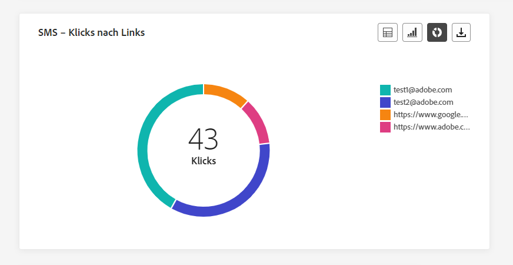

Die **[!UICONTROL SMS - Klicks nach Links]** Widget bietet wichtige Einblicke in die Interaktion Ihrer Besucher mit den in Ihren Nachrichten enthaltenen URLs und liefert wertvolle Informationen darüber, welche Links die meisten Interaktionen hervorrufen.

## Registerkarte „In-App“ {#in-app-global}

Von Ihrer Journey **[!UICONTROL Globaler Bericht]**, die **[!UICONTROL In-App]** im Tab werden die wichtigsten Informationen zu den In-App-Nachrichten aufgeführt, die in Ihren Journey gesendet werden.

### In-App-Performance {#inapp-performance}

>[!CONTEXTUALHELP]
>id="ajo_journey_inapp_performance"
>title="In-App-Performance"
>abstract="XX"

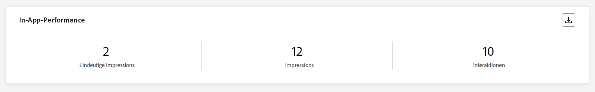

Die **[!UICONTROL In-App-Leistung]**  KPIs bieten wichtige Einblicke in die Interaktion Ihrer Profile mit In-App-Nachrichten und liefern wichtige Metriken, mit denen Sie die Effektivität und die Wirkung der in Ihrer Journey enthaltenen In-App-Nachrichten bewerten können.

+++ Erfahren Sie mehr über In-App - Leistung nach Datumsmetriken

* **[!UICONTROL Eindeutige Impressions]**: Anzahl der eindeutigen Benutzenden, an die die In-App-Nachricht gesendet wurde.

* **[!UICONTROL Impressions]**: Gesamtzahl der an alle Benutzenden gesendeten In-App-Nachrichten.

  >[!NOTE]
  >
  >Um sicherzustellen, dass eine Impression gezählt wird, muss die Benutzerin bzw. der Benutzer zwei Kriterien erfüllen:
  >* Qualifizierung innerhalb des In-App-Erlebnisses, das durch Erreichen der spezifischen In-App-Aktivität in ihrer bzw. seiner Journey erreicht wird.
  >* Erfüllung der in den Auslöseregeln festgelegten Bedingungen.
  > 
  >Aufgrund des zweiten Kriteriums kann es erhebliche Unterschiede zwischen der Anzahl der angesprochenen Profile und der Anzahl der eindeutigen Impressions geben.

* **[!UICONTROL Interaktionen]**: Zahl der Interaktionen mit Ihrer In-App-Nachricht. Dazu gehören alle von den Benutzenden durchgeführten Aktionen, wie z. B. Klicks, Abbrechen oder andere Interaktionen.
+++

### In-App-Zusammenfassung {#inapp-summary}

>[!CONTEXTUALHELP]
>id="ajo_journey_inapp_summary"
>title="In-App-Zusammenfassung"
>abstract="XX"

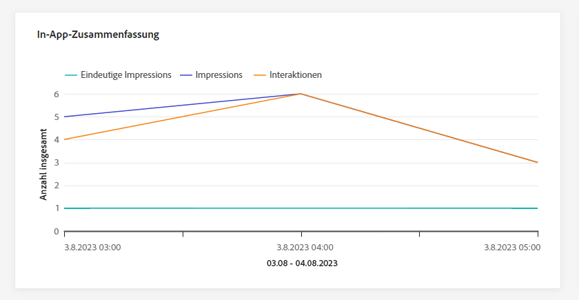

Die **[!UICONTROL In-App-Zusammenfassung]** Das Diagramm zeigt den Verlauf Ihrer In-App-Impressionen und -Interaktionen über den angegebenen Zeitraum und bietet einen umfassenden Überblick über die Leistung Ihrer In-App-Nachrichten.

### Interaktionen nach Typ {#interactions-type}

>[!CONTEXTUALHELP]
>id="ajo_journey_inapp_interactions"
>title="Interaktionen nach Typ"
>abstract="XX"

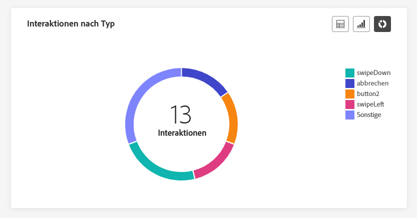

Die **[!UICONTROL Interaktionen nach Typ]** Grafiken und Tabellen enthalten eine detaillierte Darstellung der Interaktion von Profilen mit Ihrer In-App-Nachricht, der Verfolgung von Aktionen wie Klicks, Abweisungen oder anderen Formen der Interaktion.
