# Globaler Bericht zur Journey {#journey-global-report}

Über die Schaltfläche **[!UICONTROL Globaler Bericht]** können Sie direkt von Ihrer Journey auf den globalen Bericht zur Journey zugreifen.

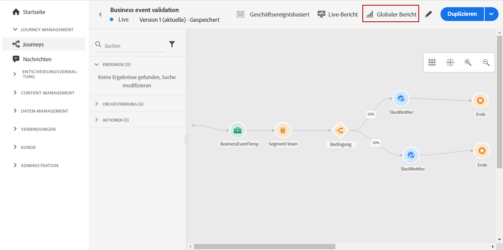

Die Seite **[!UICONTROL Globaler Bericht]** zur Journey wird mit den folgenden Registerkarten angezeigt:

* [Journey](#journey-global)
* [E-Mail](#email-global)
* [Push-Benachrichtigung](#push-global)

Der **[!UICONTROL globale Bericht]** zur Journey ist in verschiedene Widgets unterteilt, die den Erfolg und die Fehler Ihrer Journey detailliert beschreiben. Jedes Widget kann bei Bedarf angepasst und gelöscht werden. Weiterführende Informationen dazu finden Sie in diesem [Abschnitt](global-report.md#modify-dashboard).

## Registerkarte „Journey“  {#journey-global}

In Ihrem **[!UICONTROL globalen Bericht]** zur Journey erhalten Sie auf der Registerkarte **[!UICONTROL Journey]** eine übersichtliche Darstellung der wichtigsten Tracking-Daten zu Ihrer Journey.

Mit dem Widget **[!UICONTROL Performance der Journey]** können Sie den Weg Ihrer Zielprofile durch Ihre Journey Schritt für Schritt anzeigen.

Das Widget **[!UICONTROL Journey-Statistiken]** zeigt die folgenden KPIs an:

* **[!UICONTROL Eingestiegene Profile]**: Gesamtzahl der Personen, die das Eintrittsereignis der Journey erreicht haben.

* **[!UICONTROL Ausgestiegene Profile]**: Gesamtzahl der Personen, die die Journey verlassen haben.

* **[!UICONTROL Fehlgeschlagene individuelle Journey]**: Gesamtzahl der individuellen Journeys, die nicht erfolgreich ausgeführt wurden.

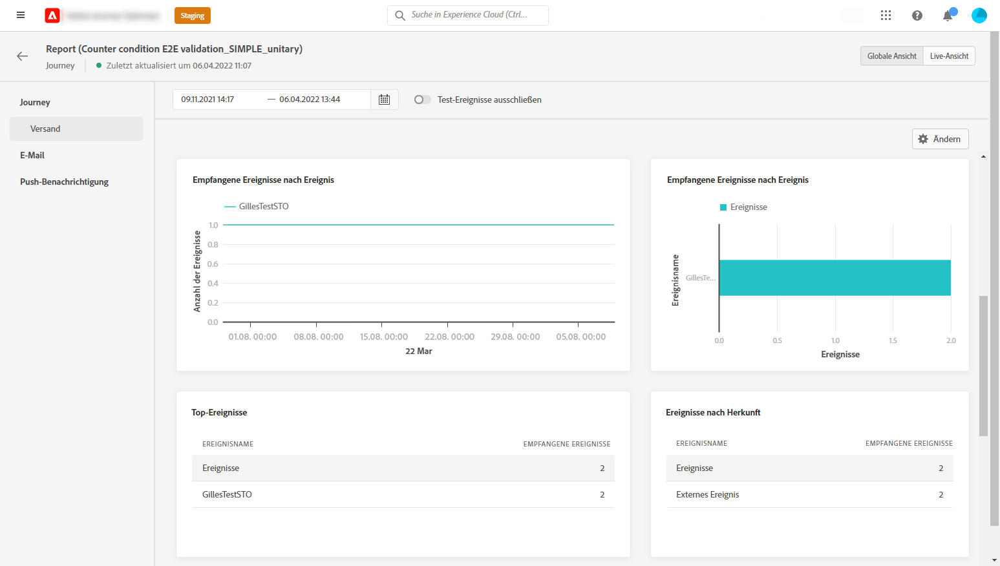

Mit den Widgets **[!UICONTROL Ereignisse durch ein Ereignis empfangen]**, **[!UICONTROL Ereignisse nach Herkunft]** und **[!UICONTROL Top-Ereignisse]** können Sie über Diagramme und Tabellen sehen, welches Ihrer **[!UICONTROL Ereignisse]** erfolgreich ausgeführt wurde.

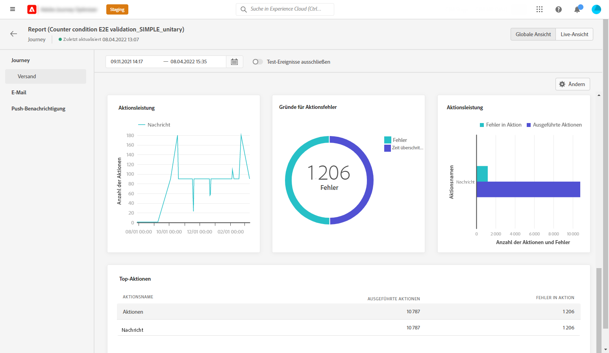

Die Widgets **[!UICONTROL Performance der Aktion]**, **[!UICONTROL Fehlergründe für Aktionen]** und **[!UICONTROL Top-Aktionen]** stellen die erfolgreichsten Aktionen und Fehler dar, die beim Auslösen Ihrer **[!UICONTROL Aktionen]** aufgetreten sind.

Die Tabelle **[!UICONTROL Top-Aktionen]** enthält die für **[!UICONTROL Aktionen]** verfügbaren Daten, z. B.:

* **[!UICONTROL Erfolgreich ausgeführte Aktionen]**: Gesamtanzahl der **[!UICONTROL Aktionen]**, die für eine Journey erfolgreich ausgeführt wurden.

* **[!UICONTROL Fehler in Aktion]**: Gesamtanzahl der Fehler, die bei **[!UICONTROL Aktionen]** aufgetreten sind.

## Registerkarte „E-Mail“  {#email-global}

In Ihrem **[!UICONTROL globalen Bericht]** zur Journey finden Sie auf der Registerkarte **[!UICONTROL E-Mail]** die wichtigsten Informationen zu den E-Mail-Sendungen, die in Ihrer Journey gesendet wurden.

Einen ausführlichen Bericht zu einem bestimmten E-Mail-Versand finden Sie im Abschnitt [Globaler E-Mail-Bericht](#email-global-report).

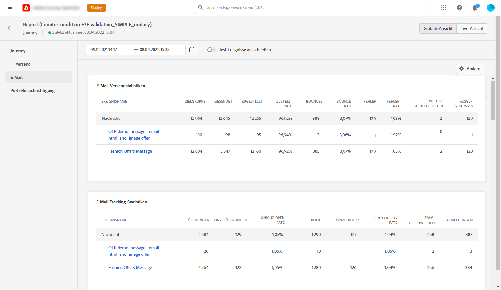

Im Diagramm **[!UICONTROL E-Mail-Sendestatistik]** wird der Erfolg Ihres Versands beschrieben:

* **[!UICONTROL Gesendet]**: Gesamtzahl der gesendeten Nachrichten.

* **[!UICONTROL Zugestellt]**: Zahl der erfolgreich gesendeten Nachrichten im Vergleich zur Gesamtzahl der gesendeten Nachrichten.

* **[!UICONTROL Zustellbarkeitsrate]**: Prozentsatz der erfolgreich gesendeten Nachrichten.

* **[!UICONTROL Bounces]**: Gesamtzahl der kumulierten Fehler bei Versand und automatischer Bounce-Verarbeitung in Relation zur Gesamtzahl der gesendeten Nachrichten.

* **[!UICONTROL Bounce-Rate]**: Prozentsatz der E-Mails, die nicht erfolgreich zugestellt wurden, im Vergleich zur Zahl der gesendeten E-Mails.

* **[!UICONTROL Fehler]**: Gesamtanzahl der Fehler, die während des Versands aufgetreten sind und die Zustellung an Profile verhinderten.

* **[!UICONTROL Fehlerrate]**: Prozentsatz der Fehler, die während des Versands auftraten und die Zustellung verhinderten, im Vergleich zur Zahl der gesendeten E-Mails.

Die **[!UICONTROL E-Mail-Tracking-Statistiken]** enthalten die verfügbaren Daten für die Aktivität der Empfänger für Ihren Versand:

* **[!UICONTROL Öffnungen]**: Gibt die Zahl der Öffnungen eines Versands an.

* **[!UICONTROL Eindeutige Öffnungen]**: Prozentsatz der geöffneten zugestellten Nachrichten.

* **[!UICONTROL Öffnungsrate]**: Gesamtzahl der geöffneten Nachrichten im Vergleich zu den versendeten E-Mails.

* **[!UICONTROL Klicks]**: Anzahl der Klicks auf Inhalt einer E-Mail.

* **[!UICONTROL Einzelklicks]**: Die Anzahl der Empfänger, die auf Inhalt in einer E-Mail geklickt haben.

* **[!UICONTROL Klickrate]**: Prozentsatz der Benutzer, die mit der Journey interagiert haben.

* **[!UICONTROL Abo beenden]**: Zahl der Klicks auf den Abmelde-Link.

* **[!UICONTROL Beschwerden wegen Spam]**: Gibt an, wie oft eine Nachricht als Spam oder Junk gekennzeichnet wurde.

Das Diagramm **[!UICONTROL Sendestatistiken]** enthält die Daten, die für gesendete E-Mails verfügbar sind, z. B.:

* **[!UICONTROL Zugestellt]**: Zahl der erfolgreich gesendeten Nachrichten im Vergleich zur Gesamtzahl der gesendeten Nachrichten.

* **[!UICONTROL Bounces]**: Gesamtzahl der kumulierten Fehler bei Versand und automatischer Bounce-Verarbeitung in Relation zur Gesamtzahl der gesendeten Nachrichten.

* **[!UICONTROL Fehler]**: Gesamtanzahl der Fehler, die während des Versands aufgetreten sind und die Zustellung an Profile verhinderten.

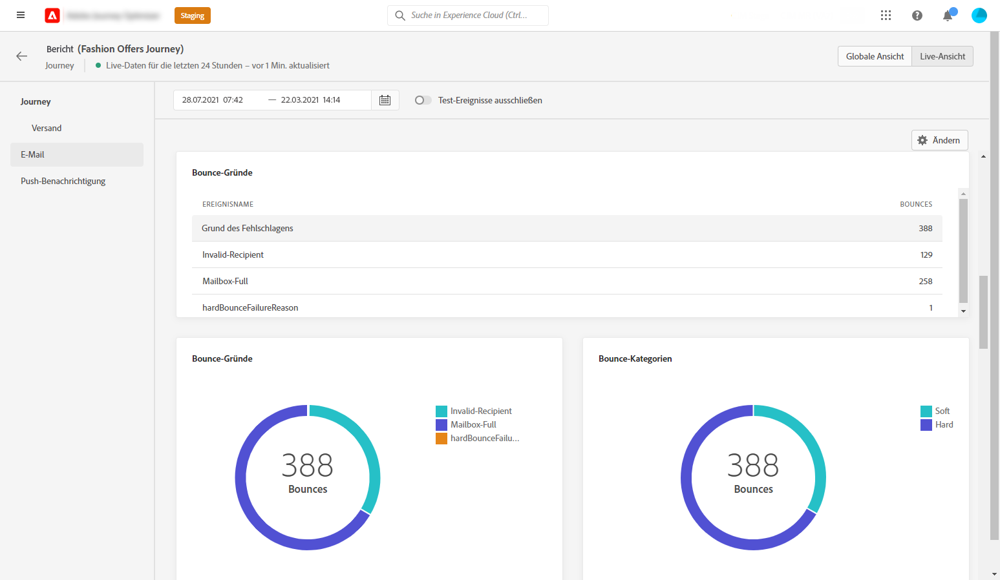

Die Widgets **[!UICONTROL Bounce-Gründe]** und **[!UICONTROL Bounce-Kategorien]** enthalten die verfügbaren Daten zu unzustellbaren Nachrichten wie:

* **[!UICONTROL Hardbounce]**: die Gesamtzahl der permanenten Fehler, wie eine falsche E-Mail-Adresse. Dazu gehören Fehlermeldungen, die explizit eine ungültige Adresse anzeigen, wie etwa „Benutzer unbekannt“.

* **[!UICONTROL Softbounce]**: die Gesamtzahl der temporären Fehler, wie ein voller Posteingang.

* **[!UICONTROL Ignoriert]**: Die Gesamtzahl der temporären Ereignisse, beispielsweise Abwesenheit, oder technischer Fehler, zum Beispiel wenn der Absendertyp Postmaster ist.

Weitere Informationen zu Bounces finden Sie auf der Seite [ Unterdrückungslisten](../reports/suppression-list.md).

In der Grafik **[!UICONTROL Fehlergründe]** und der Tabelle unten können Sie sehen, welcher Fehler während des Versands aufgetreten ist.

Das Diagramm und die Tabelle **[!UICONTROL Ausschlussgründe]** zeigen die verschiedenen Gründe an, die verhindert haben, dass Nutzerprofile, die von den Zielprofilen ausgeschlossen wurden, die Nachricht erhalten haben.

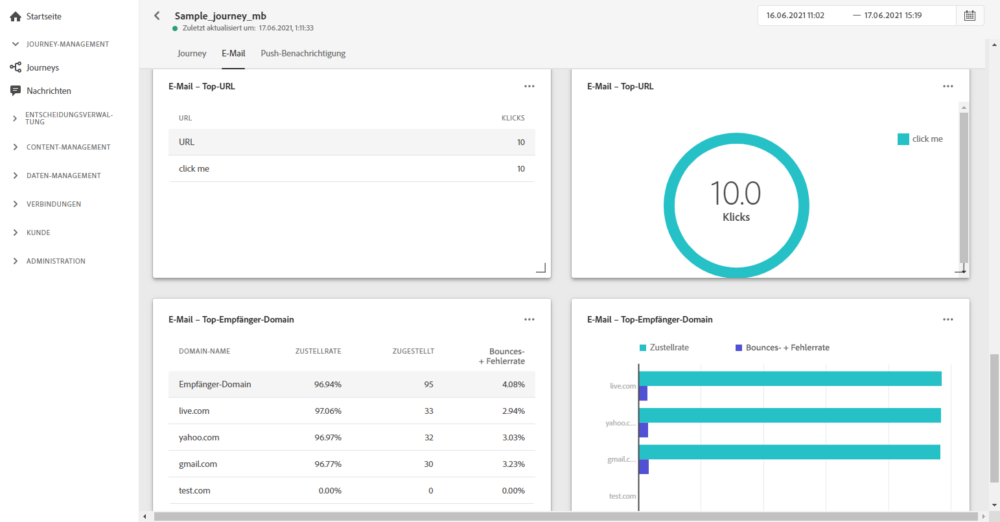

Das Diagramm **[!UICONTROL E-Mail – Top-URL]** und die Tabelle zeigen, welche URLs Ihres Versands am häufigsten besucht werden.

Das Diagramm **[!UICONTROL E-Mail – beste Empfänger-Domain]** und die Tabelle zeigen, welche Domains von Empfängern am häufigsten zum Öffnen der E-Mail verwendet werden.

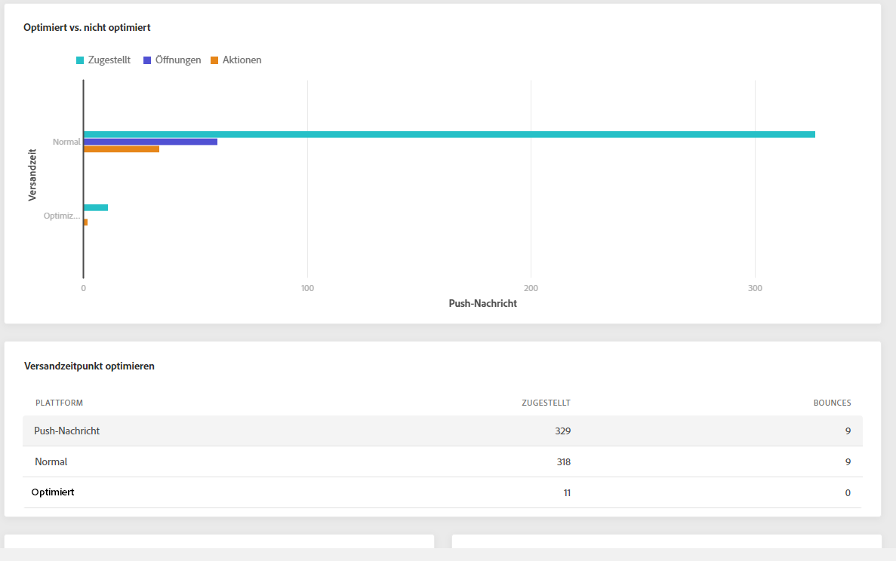

>[!NOTE]
>
>Die Widgets **[!UICONTROL Optimiert vs. nicht optimiert]** und **[!UICONTROL Versandzeitoptimierung]** sind nur verfügbar, wenn die Option „Sendezeitoptimierung“ für Ihren Versand aktiviert ist. Weitere Informationen zur Sendezeitoptimierung finden Sie auf [dieser Seite](../building-journeys/journeys-message.md#send-time-optimization).

Das Diagramm **[!UICONTROL Optimiert vs. nicht optimiert]** zeigt die wichtigsten Informationen bezüglich Ihrer Nachricht an, egal ob sie optimiert wurden oder nicht:

* **[!UICONTROL Gesendet]**: Gesamtzahl der Sendevorgänge für den Versand.
* **[!UICONTROL Öffnungen]**: Gibt an, wie oft die Sendung in einem Versand geöffnet wurde.
* **[!UICONTROL Klicks]**: Gibt an, wie oft ein Inhalt in einer E-Mail angeklickt wurde.

Die **[!UICONTROL Versandzeitoptimierung]** zeigt den Erfolg Ihres Versands in Abhängigkeit von der Versandmethode an: optimiert oder normal.

* **[!UICONTROL Zugestellt]**: Zahl der erfolgreich gesendeten Nachrichten im Vergleich zur Gesamtzahl der gesendeten Nachrichten.
* **[!UICONTROL Bounces]**: Gesamtzahl der kumulierten Fehler bei Versand und automatischer Bounce-Verarbeitung in Relation zur Gesamtzahl der gesendeten Nachrichten.

<!--

>[!NOTE]
>
>The Offers widgets and metrics are only available if a decision was inserted in an email. For more information on Decision Management, refer to this [page](../offers/get-started/starting-offer-decisioning.md).

The **[!UICONTROL Offers statistic]** and **[!UICONTROL Offers statistics]** over time widgets measure your offer's success and impact on your targeted audience. It detail the main information relative to your message with KPIs:

* **[!UICONTROL Offer sent]**: Total number of sends for the offer.

* **[!UICONTROL Offer impression]**: Number of times the offer was opened in a delivery.

* **[!UICONTROL Offer clicks]**: Number of times an offer was clicked on in a delivery.

The **[!UICONTROL Offers detailed statistic]** table contains the available data for recipient activity with your offer:

* **[!UICONTROL Placement name]**: Name of your placement used to display your offer. For more information on placement, refer to this [page](../offers/offer-library/creating-placements.md).

* **[!UICONTROL Offer name]**: Name of the offer added in the delivery. For more information on placement, refer to this [page](../offers/offer-library/creating-personalized-offers.md).

* **[!UICONTROL Offer sent]**: Total number of sends for the offer.

* **[!UICONTROL Offer impression rate]**: Percentage of opened offers compared to the number of sent offers.

* **[!UICONTROL Offer click rate]**: Percentage of users who interacted with the offer.
-->

## Registerkarte „Push-Benachrichtigung“  {#push-global}

In Ihrem **[!UICONTROL globalen Bericht]** zur Journey finden Sie auf der Registerkarte **[!UICONTROL Push-Benachrichtigung]** die wichtigsten Informationen zu den Push-Sendungen, die in Ihrer Journey gesendet wurden.

Einen ausführlichen Bericht zu einem bestimmten Push-Versand finden Sie im [globalen Bericht zu Push-Benachritigungen](#push-global-report).

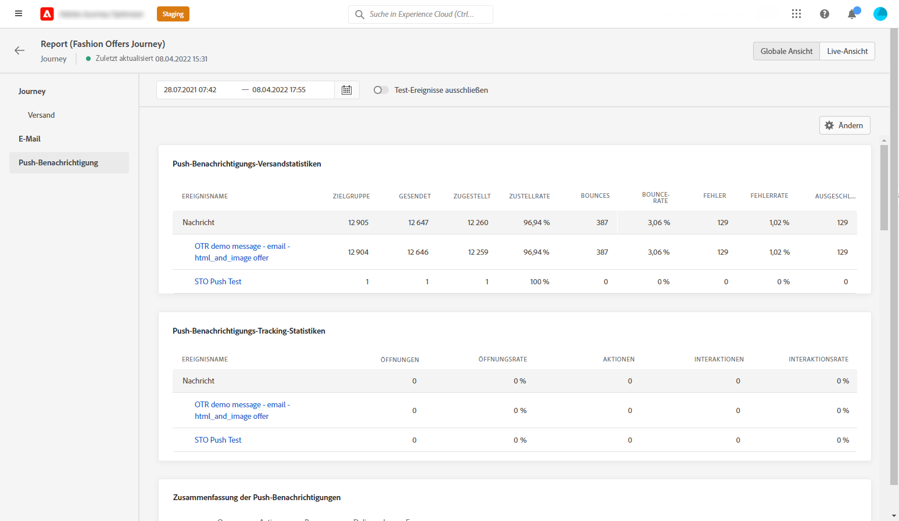

Die Tabelle **[!UICONTROL Push-Benachrichtigung – Sendestatistiken]** enthält die wichtigsten Informationen zu Ihren Push-Benachrichtigungen mit Diagrammen und KPIs:

* **[!UICONTROL Gesendet]**: Gesamtzahl der gesendeten Nachrichten.

* **[!UICONTROL Zugestellt]**: Zahl der erfolgreich gesendeten Nachrichten im Vergleich zur Gesamtzahl der gesendeten Nachrichten.

* **[!UICONTROL Zustellbarkeitsrate]**: Prozentsatz der erfolgreich gesendeten Nachrichten.

* **[!UICONTROL Bounces]**: Gesamtzahl der kumulierten Fehler bei Versand und automatischer Bounce-Verarbeitung in Relation zur Gesamtzahl der gesendeten Nachrichten.

* **[!UICONTROL Bounce-Rate]**: Prozentsatz der Push-Benachrichtigungen, die unzustellbar waren, im Vergleich zu den gesendeten Push-Benachrichtigungen.

* **[!UICONTROL Fehler]**: Gesamtanzahl der Fehler, die während des Versands aufgetreten sind und die Zustellung an Profile verhinderten.

* **[!UICONTROL Fehlerrate]**: Prozentualer Anteil der Fehler, die während eines Versands aufgetreten sind und den Versand verhindert haben, im Vergleich zu den gesendeten Push-Benachrichtigungen.

Die **[!UICONTROL Push-Benachrichtigung – Tracking-Statistik]** enthält die verfügbaren Daten zur Aktivität der Empfänger für Ihren Versand:

* **[!UICONTROL Öffnungen]**: Anzahl der Öffnungen einer Nachricht in einem Versand.

* **[!UICONTROL Öffnungsrate]**: Prozentsatz der geöffneten Push-Benachrichtigungen.

* **[!UICONTROL Aktionen]**: Gesamtzahl der Aktionen, die bei der gesendeten Push-Benachrichtigung durchgeführt wurden, d. h. Klick auf Schaltfläche oder Abbruch.

* **[!UICONTROL Interaktionen]**: Gesamtzahl der Öffnungen und Aktionen für diese Push-Benachrichtigung, d. h. wenn das Profil die Push-Benachrichtigung geöffnet hat oder wenn auf eine Schaltfläche geklickt wurde.

* **[!UICONTROL Interaktionsrate]**: Prozentsatz der Öffnungen und Aktionen für diese Push-Benachrichtigung, d. h. wenn das Profil die Push-Benachrichtigung geöffnet hat oder auf eine Schaltfläche geklickt wurde.

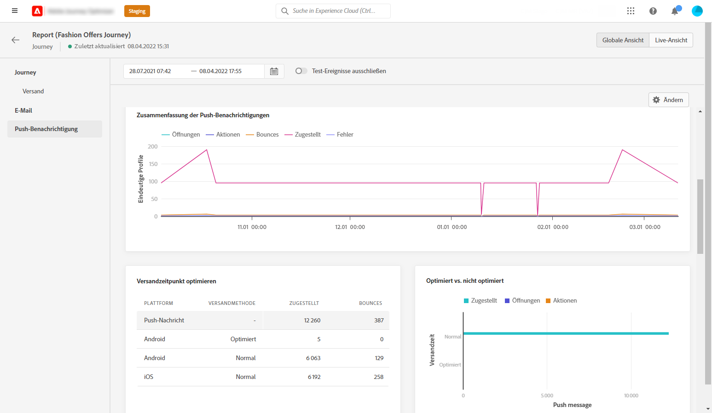

Das Diagramm **[!UICONTROL Zusammenfassung der Push-Benachrichtigung]** enthält die Daten, die für gesendete Push-Benachrichtigungen verfügbar sind, z. B.:

* **[!UICONTROL Öffnungen]**: Anzahl der Öffnungen einer Nachricht in einem Versand.

* **[!UICONTROL Aktionen]**: Gesamtzahl der Aktionen, die bei der gesendeten Push-Benachrichtigung durchgeführt wurden, d. h. Klick auf Schaltfläche oder Abbruch.

* **[!UICONTROL Bounces]**: Gesamtzahl der kumulierten Fehler bei Versand und automatischer Bounce-Verarbeitung in Relation zur Gesamtzahl der gesendeten Nachrichten.

* **[!UICONTROL Zugestellt]**: Zahl der erfolgreich gesendeten Nachrichten im Vergleich zur Gesamtzahl der gesendeten Nachrichten.

* **[!UICONTROL Fehler]**: Gesamtanzahl der Fehler, die während des Versands aufgetreten sind und die Zustellung an Profile verhinderten.

>[!NOTE]
>
>Die Widgets **[!UICONTROL Optimiert vs. nicht optimiert]** und **[!UICONTROL Versandzeitoptimierung]** sind nur verfügbar, wenn die Option „Sendezeitoptimierung“ für Ihren Versand aktiviert ist. Weitere Informationen zur Sendezeitoptimierung finden Sie auf [dieser Seite](../building-journeys/journeys-message.md#send-time-optimization).

Das Diagramm **[!UICONTROL Optimiert vs. nicht optimiert]** zeigt die wichtigsten Informationen bezüglich Ihrer Nachricht an, egal ob sie optimiert wurden oder nicht:

* **[!UICONTROL Zugestellt]**: Zahl der erfolgreich gesendeten Nachrichten im Vergleich zur Gesamtzahl der gesendeten Nachrichten.
* **[!UICONTROL Öffnungen]**: Gibt an, wie oft die Sendung in einem Versand geöffnet wurde.
* **[!UICONTROL Aktionen]**: Gesamtzahl der Aktionen, die bei der gesendeten Push-Benachrichtigung durchgeführt wurden, z. B. Klick auf Schaltfläche oder Abbruch.

Die **[!UICONTROL Versandzeitoptimierung]** zeigt den Erfolg Ihres Versands in Abhängigkeit von der Versandmethode an: optimiert oder normal.

* **[!UICONTROL Zugestellt]**: Zahl der erfolgreich gesendeten Nachrichten im Vergleich zur Gesamtzahl der gesendeten Nachrichten.
* **[!UICONTROL Bounces]**: Gesamtzahl der kumulierten Fehler bei Versand und automatischer Bounce-Verarbeitung in Relation zur Gesamtzahl der gesendeten Nachrichten.

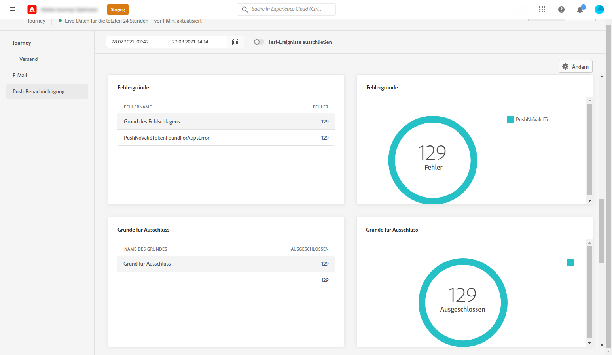

In der Grafik **[!UICONTROL Fehlergründe]** und der Tabelle unten können Sie sehen, welcher Fehler während des Versands aufgetreten ist.

Das Diagramm und die Tabelle **[!UICONTROL Ausschlussgründe]** zeigen die verschiedenen Gründe an, die verhindert haben, dass Nutzerprofile, die von den Zielprofilen ausgeschlossen wurden, die Nachricht erhalten haben.

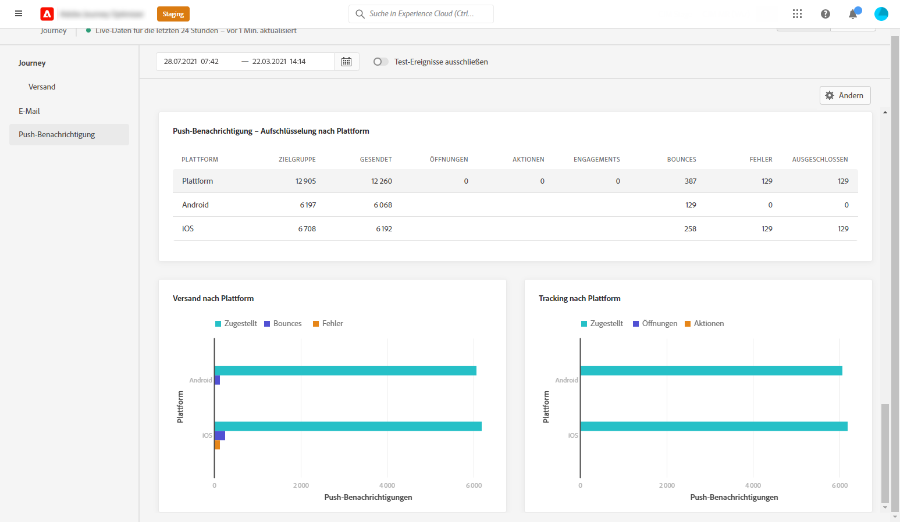

Die Diagramme und Tabellen **[!UICONTROL Tracking nach Plattform]**, **[!UICONTROL Senden nach Plattform]** und **[!UICONTROL Aufschlüsselung nach Plattform]** geben einen Überblick über den Erfolg Ihrer Push-Benachrichtigung, aufgeschlüsselt nach dem Betriebssystem Ihres Empfängers.
