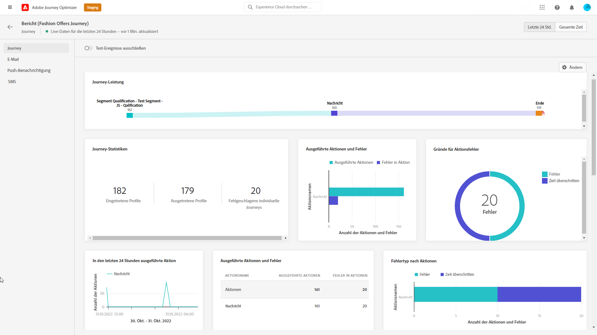
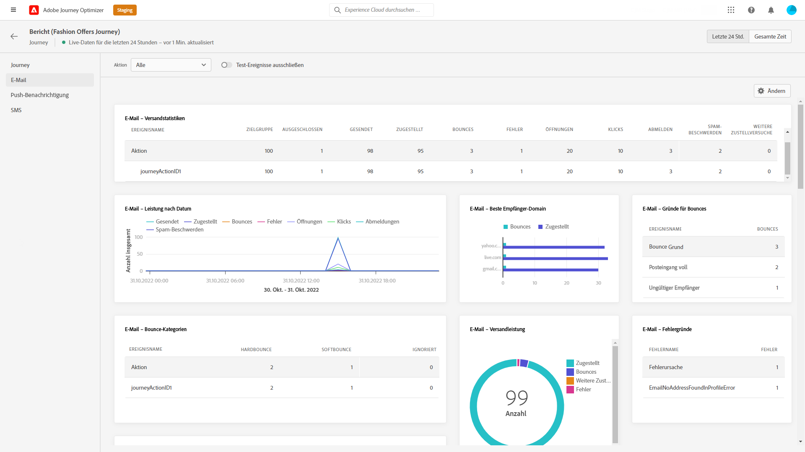
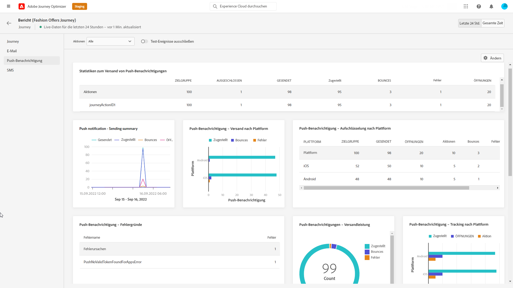
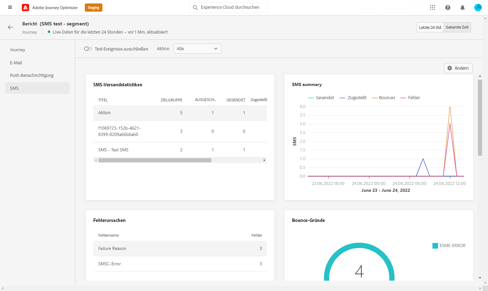

# Live-Bericht zur Journey {#journey-live-report}

>[!CONTEXTUALHELP]
>id="ajo_journey_live_report"
>title="Journey-Live-Bericht"
>abstract="Mit dem Journey-Live-Bericht können Sie die Wirkung und Leistung Ihrer Journeys nur in den letzten 24 Stunden in Echtzeit messen und visualisieren. Der Bericht ist in verschiedene Widgets unterteilt, die den Erfolg und die Fehler der Journey detailliert darstellen. Jedes Reporting-Dashboard kann durch Ändern der Größe oder Entfernen von Widgets verändert werden."

Live-Berichte, auf die über die Registerkarte „Letzte 24 Std.“ zugegriffen werden kann, zeigen Ereignisse an, die innerhalb der letzten 24 Stunden stattgefunden haben. Der Zeitraum ab dem Auftreten des Ereignisses beträgt mindestens zwei Minuten. Im Vergleich dazu konzentrieren sich globale Berichte auf Ereignisse, die vor mindestens zwei Stunden aufgetreten sind, und decken Ereignisse über einen ausgewählten Zeitraum ab.

Über die Schaltfläche **[!UICONTROL Bericht anzeigen]** können Sie direkt von Ihrer Journey auf den Journey-Live-Bericht zugreifen.

Die Seite **[!UICONTROL Journey-Live-Bericht]** wird mit den folgenden Registerkarten angezeigt:

* [Journey](#journey-live)
* [E-Mail](#email-live)
* [Push-Benachrichtigung](#push-live)
* [SMS](#sms-live)

Der **[!UICONTROL Journey-Live-Bericht]** ist in verschiedene Widgets unterteilt, die den Erfolg und die Fehler der Journey detailliert darstellen. Jedes Widget kann bei Bedarf angepasst und gelöscht werden. Weiterführende Informationen dazu finden Sie in diesem [Abschnitt](live-report.md#modify-dashboard).

Eine detaillierte Liste aller in Adobe Journey Optimizer verfügbaren Metriken finden Sie auf [dieser Seite](live-report.md#list-of-components-live).

## Registerkarte „Journey“ {#journey-live}

In Ihrem **[!UICONTROL Journey-Live-Bericht]** erhalten Sie über die Registerkarte **[!UICONTROL Journey]** eine Einblick in die wichtigsten Tracking-Daten zur Journey.

+++Erfahren Sie mehr über die verschiedenen Metriken und Widgets, die für den Journey-Bericht verfügbar sind.

Mit **[!UICONTROL Journey-Performance]** können Sie den Pfad Ihrer Zielprofile durch Ihre Journey Schritt für Schritt anzeigen.

Das Widget **[!UICONTROL Journey-Statistiken]** zeigt die folgenden KPIs an:

* **[!UICONTROL Eingestiegene Profile]**: Gesamtzahl der Personen, die das Eintrittsereignis der Journey erreicht haben.

* **[!UICONTROL Ausgestiegene Profile]**: Gesamtzahl der Personen, die die Journey verlassen haben.

* **[!UICONTROL Fehlgeschlagene individuelle Journeys]**: Gesamtzahl der individuellen Journeys, die nicht erfolgreich ausgeführt wurden.

Mit den Widgets **[!UICONTROL Ereignis, das in den letzten 24 Stunden ausgeführt wurde]** und **[!UICONTROL Ereignisse]** können Sie anhand der Gesamtanzahl, des Diagramms und der Tabelle sehen, welches Ihrer Ereignisse erfolgreich ausgeführt wurde.

Die Widgets **[!UICONTROL Aktion, die während der letzten 24 Stunden ausgeführt wurde]** und **[!UICONTROL Ausgeführte Aktionen und Fehler]** zeigen die erfolgreichste Aktion und die Fehler, die beim Auslösen Ihrer Aktionen aufgetreten sind. Das Aktionsdiagramm, die Tabelle und die Gesamtzahlen enthalten die für Aktionen verfügbaren Daten, z. B.:

* **[!UICONTROL Ausgeführte Aktionen]**: Gesamtzahl der für eine Journey erfolgreich ausgeführten Aktionen.

* **[!UICONTROL Fehler in Aktionen]**: Gesamtzahl der Fehler, die bei Aktionen aufgetreten sind.
+++

## Registerkarte „E-Mail“ {#email-live}

In Ihrem **[!UICONTROL Journey-Live-Bericht]** finden Sie auf der Registerkarte **[!UICONTROL E-Mail]** die wichtigsten Informationen zu den E-Mail-Sendungen, die in Ihrer Journey gesendet wurden.

+++Erfahren Sie mehr über die verschiedenen Metriken und Widgets, die für den E-Mail-Bericht verfügbar sind.

Das Widget **[!UICONTROL E-Mail-Versandstatistik]** enthält die wichtigsten Informationen zu Ihrer Nachricht:

* **[!UICONTROL Zugestellt]**: Die Anzahl der erfolgreich gesendeten Nachrichten.

* **[!UICONTROL Bounces]**: Gesamtzahl der kumulierten Fehler beim Versand und der automatischen Bounce-Verarbeitung.

* **[!UICONTROL Fehler]**: Gesamtanzahl der Fehler, die während des Versands aufgetreten sind und die Zustellung an Profile verhinderten.

Die Tabelle **[!UICONTROL Versandmetriken nach E-Mail]** und das Diagramm **[!UICONTROL E-Mail-Zusammenfassung]** zeigen, wie erfolgreich Ihr Versand war:

* **[!UICONTROL Gesendet]**: Gesamtzahl der Sendungen für den Versand.

* **[!UICONTROL Zugestellt]**: Die Anzahl der erfolgreich gesendeten Nachrichten.

* **[!UICONTROL Bounces]**: Gesamtzahl der kumulierten Fehler beim Versand und der automatischen Bounce-Verarbeitung.

* **[!UICONTROL Fehler]**: Gesamtanzahl der Fehler, die während des Versands aufgetreten sind und die Zustellung an Profile verhinderten.

* **[!UICONTROL Öffnungen]**: Anzahl der Öffnungen einer Nachricht in einem Versand.

* **[!UICONTROL Klicks]**: Anzahl der Klicks auf einen Inhalt in einem Versand.

* **[!UICONTROL Abo beenden]**: Zahl der Klicks auf den Abmelde-Link.

* **[!UICONTROL Beschwerden wegen Spam]**: Gibt an, wie oft eine Nachricht als Spam oder Junk gekennzeichnet wurde.

Die Widgets **[!UICONTROL Bounce-Gründe]**, **[!UICONTROL Bounce-Kategorien]** und **[!UICONTROL Hardbounces und Softbounces – nach E-Mail]** enthalten die verfügbaren Daten im Zusammenhang mit unzustellbaren Nachrichten, wie z. B:

* **[!UICONTROL Hardbounce]**: die Gesamtzahl der permanenten Fehler, wie eine falsche E-Mail-Adresse. Dazu gehören Fehlermeldungen, die explizit eine ungültige Adresse anzeigen, wie etwa „Benutzer unbekannt“.

* **[!UICONTROL Softbounce]**: die Gesamtzahl der temporären Fehler, wie ein voller Posteingang.

* **[!UICONTROL Ignoriert]**: Die Gesamtzahl der temporären Ereignisse, beispielsweise Abwesenheit, oder technischer Fehler, zum Beispiel wenn der Absendertyp Postmaster ist.

In den Diagrammen und Tabellen **[!UICONTROL Fehlerursachen]** und **[!UICONTROL Ausschlussgründe]** sehen Sie, welcher Fehler und welche Ausschlüsse während des Versands aufgetreten sind.

Das Diagramm **[!UICONTROL E-Mail – beste Empfänger-Domain]** und die Tabelle zeigen, welche Domains von Empfängern am häufigsten zum Öffnen der E-Mail verwendet werden.

>[!NOTE]
>
>Die Angebots-Widgets und -Metriken sind nur verfügbar, wenn eine Entscheidung in eine E-Mail eingefügt wurde. Weiterführende Informationen zum Entscheidungs-Management finden Sie auf dieser [Seite](../offers/get-started/starting-offer-decisioning.md).

Die Widgets **[!UICONTROL Angebotsstatistiken]** und **[!UICONTROL Angebotsstatistiken]** im Zeitverlauf messen den Erfolg und die Wirkung Ihres Angebots auf Ihre Audience. Sie enthalten die wichtigsten Informationen zu Ihrer Nachricht in Form von KPIs:

* **[!UICONTROL Gesendete Angebote]**: Gibt an, wie oft das Angebot gesendet wurde.

* **[!UICONTROL Angebots-Impression]**: Gibt an, wie oft das Angebot in einem Versand geöffnet wurde.

* **[!UICONTROL Angebotsklicks]**: Gibt an, wie oft ein Angebot in einem Versand angeklickt wurde.
+++

## Registerkarte „Push-Benachrichtigung“ {#push-live}

In dem **[!UICONTROL Live-Bericht]** Ihrer Journey finden Sie auf der Registerkarte **[!UICONTROL Push-Benachrichtigung]** die wichtigsten Informationen zu den Push-Sendungen, die in Ihrer Journey gesendet wurden.

+++Erfahren Sie mehr über die verschiedenen Metriken und Widgets, die für den Push-Bericht verfügbar sind.

Die Widgets **[!UICONTROL Performance des Push-Benachrichtigungsversandes]**, **[!UICONTROL Push-Benachrichtigungs-Zusammenfassung]** und **[!UICONTROL Sendemetriken – nach Push-Benachrichtigungen]** zeigen Details zu den wichtigsten Informationen in Bezug auf Ihre Nachricht:

* **[!UICONTROL Gesendet]**: Gesamtzahl der Sendungen für den Versand.

* **[!UICONTROL Zugestellt]**: Die Anzahl der erfolgreich gesendeten Nachrichten.

* **[!UICONTROL Bounces]**: Gesamtzahl der kumulierten Fehler beim Versand und der automatischen Bounce-Verarbeitung.

* **[!UICONTROL Fehler]**: Gesamtanzahl der Fehler, die während des Versands aufgetreten sind und die Zustellung an Profile verhinderten.

* **[!UICONTROL Öffnungen]**: Anzahl der Öffnungen einer Nachricht in einem Versand.

* **[!UICONTROL Aktionen]**: Gesamtzahl der Aktionen, die bei der gesendeten Push-Benachrichtigung durchgeführt wurden, d. h. Klick auf Schaltfläche oder Abbruch.

* **[!UICONTROL Interaktionen]**: Gesamtzahl der Öffnungen und Aktionen für diese Push-Benachrichtigung, d. h. wenn das Profil die Push-Benachrichtigung geöffnet hat oder wenn auf eine Schaltfläche geklickt wurde.

In den Diagrammen und Tabellen **[!UICONTROL Fehlerursachen]** und **[!UICONTROL Ausschlussgründe]** sehen Sie, welcher Fehler und welche Ausschlüsse während des Versands aufgetreten sind.

Mit dem Widget **[!UICONTROL Sendestatistiken – Fehlgeschlagen]** können Sie sehen, wie viele Fehler und Bounces aufgetreten sind.

Die Diagramme und Tabellen **[!UICONTROL Tracking nach Plattform]**, **[!UICONTROL Senden nach Plattform]** und **[!UICONTROL Aufschlüsselung nach Plattform]** geben einen Überblick über den Erfolg Ihrer Push-Benachrichtigung, aufgeschlüsselt nach Betriebssystem.
+++

## Registerkarte „SMS“ {#sms-live}

+++Erfahren Sie mehr über die verschiedenen Metriken und Widgets, die für den SMS-Bericht verfügbar sind.

Die Tabelle **[!UICONTROL SMS – Sendestatistik]** gibt Auskunft über den Erfolg des Versands:

* **[!UICONTROL Ausgewählt]**: Anzahl der Benutzerprofile, die sich als Zielgruppenprofile für diesen Versand eignen.

* **[!UICONTROL Ausgeschlossen]**: Anzahl der Benutzerprofile, die von den Zielgruppenprofilen ausgeschlossen waren und die die Nachricht nicht erhalten haben.

* **[!UICONTROL Gesendet]**: Gesamtzahl der Sendungen für den Versand.

* **[!UICONTROL Öffnungen]**: Anzahl der Öffnungen einer Nachricht in einem Versand.

* **[!UICONTROL Klicks]**: Anzahl der Klicks auf einen Inhalt in einem Versand.

* **[!UICONTROL Bounces]**: Gesamtzahl der kumulierten Fehler beim Versand und der automatischen Bounce-Verarbeitung.

* **[!UICONTROL Fehler]**: Gesamtanzahl der Fehler, die während des Versands aufgetreten sind und die Zustellung an Profile verhinderten.

Das Diagramm **[!UICONTROL SMS-Zusammenfassung]** zeigt den Erfolg Ihres Versands an:

* **[!UICONTROL Bounces]**: Gesamtzahl der kumulierten Fehler beim Versand und der automatischen Bounce-Verarbeitung.

* **[!UICONTROL Fehler]**: Gesamtanzahl der Fehler, die während des Versands aufgetreten sind und die Zustellung an Profile verhinderten.

In den Diagrammen und Tabellen zu den **[!UICONTROL Ausschlussgründen]** sehen Sie, welche Fehler und Ausschlüsse während des Versands aufgetreten sind.
+++
