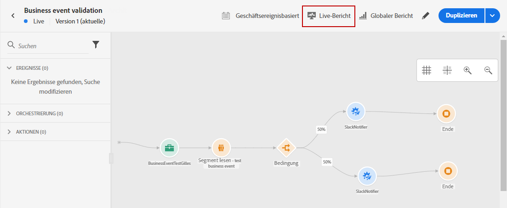
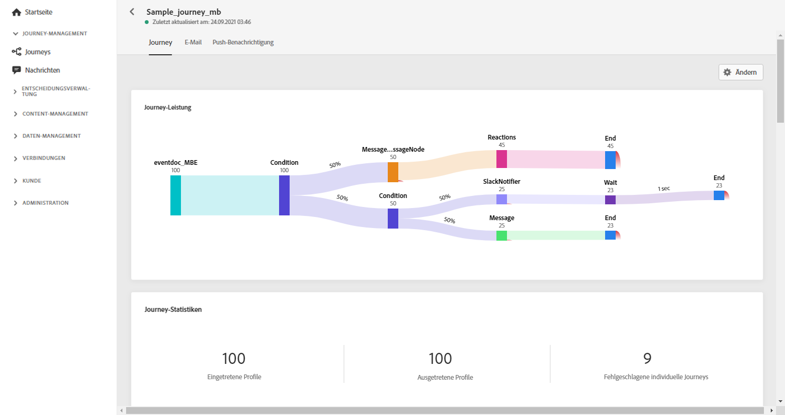
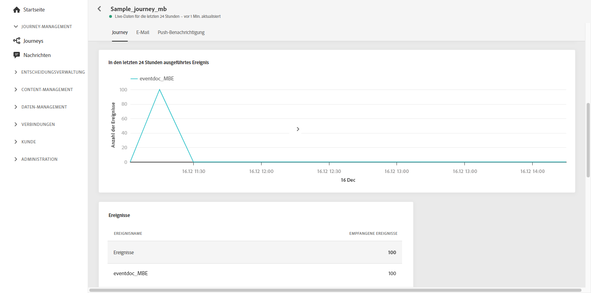
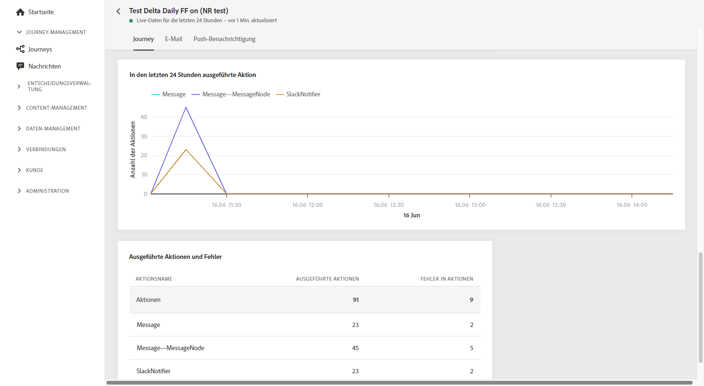
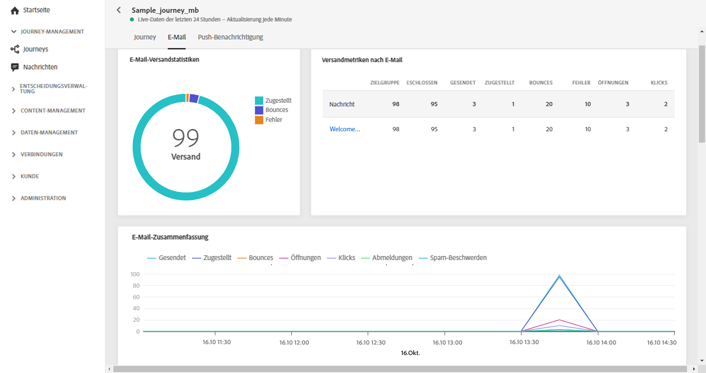
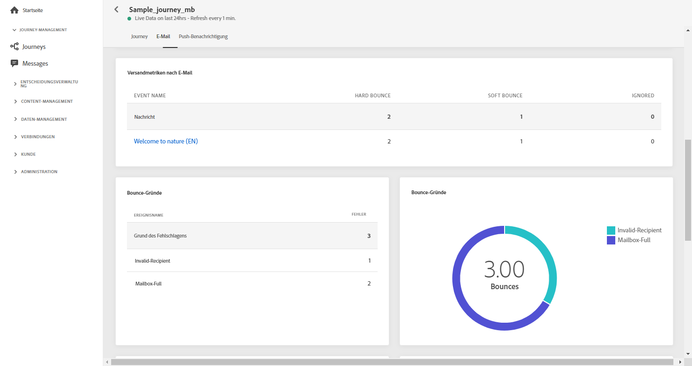
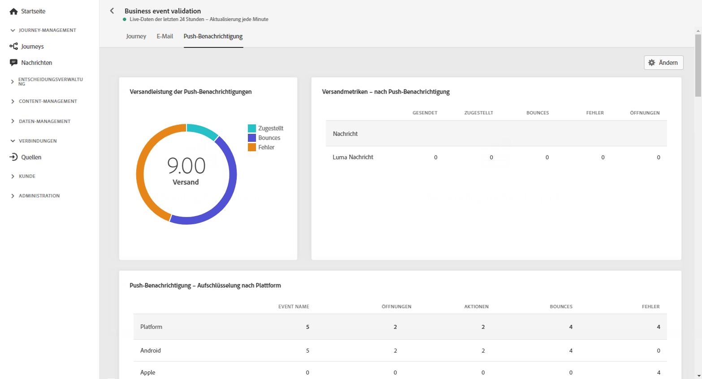
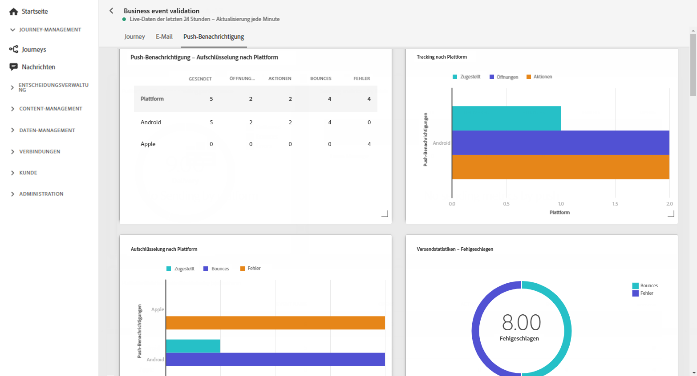

# Journey-Live-Bericht {#journey-live-report}

Über die Schaltfläche **[!UICONTROL Live-Bericht]** können Sie direkt von Ihrer Journey auf den Journey-Live-Bericht zugreifen.

Die Seite **[!UICONTROL Journey-Live-Bericht]** wird mit den folgenden Registerkarten angezeigt:

* [Journey](#journey-live)
* [E-Mail](#email-live)
* [Push-Benachrichtigung](#push-live)

Der **[!UICONTROL Journey-Live-Bericht]** ist in verschiedene Widgets unterteilt, die den Erfolg und die Fehler der Journey detailliert darstellen. Jedes Widget kann bei Bedarf angepasst und gelöscht werden. Weiterführende Informationen dazu finden Sie in diesem [Abschnitt](live-report.md#modify-dashboard).

## Registerkarte „Journey“ {#journey-live}

In Ihrem **[!UICONTROL Journey-Live-Bericht]** erhalten Sie über die Registerkarte **[!UICONTROL Journey]** eine Einblick in die wichtigsten Tracking-Daten zur Journey.

Mit **[!UICONTROL Journey-Performance]** können Sie den Pfad Ihrer Zielprofile durch Ihre Journey Schritt für Schritt anzeigen.

Das Widget **[!UICONTROL Journey-Statistiken]** zeigt die folgenden KPIs an:

* **[!UICONTROL Eingestiegene Profile]**: Gesamtzahl der Personen, die das Eintrittsereignis der Journey erreicht haben.

* **[!UICONTROL Ausgestiegene Profile]**: Gesamtzahl der Personen, die die Journey verlassen haben.

* **[!UICONTROL Fehlgeschlagene individuelle Journey]**: Gesamtzahl der individuellen Journeys, die nicht erfolgreich ausgeführt wurden.

Mit den Widgets **[!UICONTROL Ereignis, das in den letzten 24 Stunden ausgeführt wurde]**, **[!UICONTROL Ausgeführtes Ereignis]** und **[!UICONTROL Ereignis]** können Sie sehen, welche Ereignisse über Gesamtanzahl, Diagramm und Tabelle erfolgreich ausgeführt wurden.

Die Widgets **[!UICONTROL Aktion, die während der letzten 24 Stunden ausgeführt wurde]** und **[!UICONTROL Ausgeführte Aktionen und Fehler]** stellen die erfolgreichste Aktion und die Fehler dar, die beim Auslösen Ihrer Aktionen aufgetreten sind. Die Aktionsdiagramm-, Tabellen- und Gesamtzahlen enthalten die für Aktionen verfügbaren Daten, z. B.:

* **[!UICONTROL Erfolgreich ausgeführte Aktionen]**: Gesamtzahl der erfolgreich ausgeführten Aktionen für eine Journey.

* **[!UICONTROL Fehler in Aktion]**: Gesamtzahl der Fehler, die bei Aktionen aufgetreten sind.

## Registerkarte „E-Mail“  {#email-live}

In Ihrem **[!UICONTROL Journey-Live-Bericht]** finden Sie auf der Registerkarte **[!UICONTROL E-Mail]** die wichtigsten Informationen zu den E-Mail-Sendungen, die in Ihrer Journey gesendet wurden.

Einen ausführlichen Bericht zu einem bestimmten E-Mail-Versand finden Sie im Abschnitt [E-Mail-Live-Bericht](email-live-report.md).

Das Widget **[!UICONTROL E-Mail-Versandstatistik]** enthält die wichtigsten Informationen zu Ihrer Nachricht:

* **[!UICONTROL Zugestellt]**: Zahl der erfolgreich gesendeten Nachrichten im Vergleich zur Gesamtzahl der gesendeten Nachrichten.

* **[!UICONTROL Bounces]**: Gesamtzahl der kumulierten Fehler bei Versand und automatischer Bounce-Verarbeitung in Relation zur Gesamtzahl der gesendeten Nachrichten.

* **[!UICONTROL Fehler]**: Gesamtanzahl der Fehler, die während des Versands aufgetreten sind und die Zustellung an Profile verhinderten.

Die Tabelle **[!UICONTROL Versandmetriken nach E-Mail]** und das Diagramm **[!UICONTROL E-Mail-Zusammenfassung]** zeigen, wie erfolgreich Ihr Versand war:

* **[!UICONTROL Gesendet]**: Gesamtzahl der gesendeten Nachrichten.

* **[!UICONTROL Zugestellt]**: Zahl der erfolgreich gesendeten Nachrichten im Vergleich zur Gesamtzahl der gesendeten Nachrichten.

* **[!UICONTROL Bounces]**: Gesamtzahl der kumulierten Fehler bei Versand und automatischer Bounce-Verarbeitung in Relation zur Gesamtzahl der gesendeten Nachrichten.

* **[!UICONTROL Fehler]**: Gesamtanzahl der Fehler, die während des Versands aufgetreten sind und die Zustellung an Profile verhinderten.

* **[!UICONTROL Öffnungen]**: Anzahl der Öffnungen einer Nachricht in einem Versand.

* **[!UICONTROL Klicks]**: Anzahl der Klicks auf einen Inhalt in einem Versand.

* **[!UICONTROL Abo beenden]**: Zahl der Klicks auf den Abmelde-Link.

* **[!UICONTROL Beschwerden wegen Spam]**: Gibt an, wie oft eine Nachricht als Spam oder Junk gekennzeichnet wurde.

Die Widgets **[!UICONTROL Bounce-Gründe]**, **[!UICONTROL Bounce-Kategorien]** und **[!UICONTROL Hardbounces und Softbounces – nach E-Mail]** enthalten die verfügbaren Daten im Zusammenhang mit unzustellbaren Nachrichten, wie z. B:

* **[!UICONTROL Hardbounce]**: die Gesamtzahl der permanenten Fehler, wie eine falsche E-Mail-Adresse. Dazu gehören Fehlermeldungen, die explizit eine ungültige Adresse anzeigen, wie etwa „Benutzer unbekannt“.

* **[!UICONTROL Softbounce]**: die Gesamtzahl der temporären Fehler, wie ein voller Posteingang.

* **[!UICONTROL Ignoriert]**: Die Gesamtzahl der temporären Ereignisse, beispielsweise Abwesenheit, oder technischer Fehler, zum Beispiel wenn der Absendertyp Postmaster ist.

In der Grafik **[!UICONTROL Fehlergründe]** und der Tabelle unten können Sie sehen, welcher Fehler während des Versands aufgetreten ist.

## Registerkarte „Push-Benachrichtigung“  {#push-live}

In Ihrem **[!UICONTROL Journey-Live-Bericht]** enthält die Registerkarte **[!UICONTROL Push-Benachrichtigung]** die wichtigsten Informationen zu den Push-Sendungen, die in Ihrer Journey gesendet wurden.

Einen ausführlichen Bericht zu einem bestimmten Push-Versand finden Sie im Abschnitt [Push-Live-Bericht](push-live-report.md).

Die Widgets **[!UICONTROL Performance des Push-Benachrichtigungsversandes]**, **[!UICONTROL Push-Benachrichtigungs-Zusammenfassung]** und **[!UICONTROL Sendemetriken – nach Push-Benachrichtigungen]** zeigen Details zu den wichtigsten Informationen in Bezug auf Ihre Nachricht:

* **[!UICONTROL Gesendet]**: Gesamtzahl der gesendeten Nachrichten.

* **[!UICONTROL Zugestellt]**: Zahl der erfolgreich gesendeten Nachrichten im Vergleich zur Gesamtzahl der gesendeten Nachrichten.

* **[!UICONTROL Bounces]**: Gesamtzahl der kumulierten Fehler bei Versand und automatischer Bounce-Verarbeitung in Relation zur Gesamtzahl der gesendeten Nachrichten.

* **[!UICONTROL Fehler]**: Gesamtanzahl der Fehler, die während des Versands aufgetreten sind und die Zustellung an Profile verhinderten.

* **[!UICONTROL Öffnungen]**: Anzahl der Öffnungen einer Nachricht in einem Versand.

* **[!UICONTROL Aktionen]**: Gesamtzahl der Aktionen, die bei der gesendeten Push-Benachrichtigung durchgeführt wurden, d. h. Klick auf Schaltfläche oder Abbruch.

* **[!UICONTROL Interaktionen]**: Gesamtzahl der Öffnungen und Aktionen für diese Push-Benachrichtigung, d. h. wenn das Profil die Push-Benachrichtigung geöffnet hat oder wenn auf eine Schaltfläche geklickt wurde.

In der Grafik **[!UICONTROL Fehlergründe]** und der Tabelle unten können Sie sehen, welcher Fehler während des Versands aufgetreten ist.

Die Diagramme und Tabellen **[!UICONTROL Tracking nach Plattform]**, **[!UICONTROL Senden nach Plattform]** und **[!UICONTROL Aufschlüsselung nach Plattform]** geben einen Überblick über den Erfolg Ihrer Push-Benachrichtigung, je nach Betriebssystem.

Mit dem Widget **[!UICONTROL Sendestatistiken – Fehlgeschlagen]** können Sie sehen, wie viele Fehler und Bounces aufgetreten sind.
