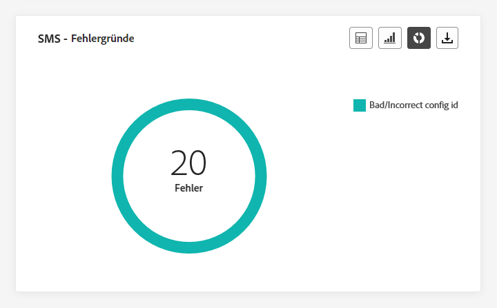

# Live-Bericht zur Journey {#journey-live-report}

>[!CONTEXTUALHELP]
>id="ajo_journey_live_report"
>title="Journey-Live-Bericht"
>abstract="Mit dem Journey-Live-Bericht können Sie die Wirkung und Performance Ihrer Journeys nur in den letzten 24 Stunden in Echtzeit messen und visualisieren. Der Bericht ist in verschiedene Widgets unterteilt, die den Erfolg und die Fehler der Journey detailliert darstellen. Jedes Reporting-Dashboard kann durch Ändern der Größe oder Entfernen von Widgets verändert werden."

Live-Berichte, auf die über die Registerkarte „Letzte 24 Std.“ zugegriffen werden kann, zeigen Ereignisse an, die innerhalb der letzten 24 Stunden stattgefunden haben. Der Zeitraum ab dem Auftreten des Ereignisses beträgt mindestens zwei Minuten. Im Vergleich dazu konzentrieren sich globale Berichte auf Ereignisse, die vor mindestens zwei Stunden aufgetreten sind, und decken Ereignisse über einen ausgewählten Zeitraum ab.

Über die Schaltfläche **[!UICONTROL Bericht anzeigen]** können Sie direkt von Ihrer Journey auf den Journey-Live-Bericht zugreifen.

Die Seite **[!UICONTROL Journey-Live-Bericht]** wird mit den folgenden Registerkarten angezeigt:

* [Journey](#journey-live)
* [E-Mail](#email-live)
* [Push-Benachrichtigung](#push-live)
* [SMS](#sms-live)
* [In-App](#in-app-live)

Der **[!UICONTROL Journey-Live-Bericht]** ist in verschiedene Widgets unterteilt, die den Erfolg und die Fehler der Journey detailliert darstellen. Jedes Widget kann bei Bedarf angepasst und gelöscht werden. Weiterführende Informationen dazu finden Sie in diesem [Abschnitt](live-report.md#modify-dashboard).

Eine detaillierte Liste aller in Adobe Journey Optimizer verfügbaren Metriken finden Sie auf [dieser Seite](live-report.md#list-of-components-live).

## Registerkarte „Journey“ {#journey-live}

In Ihrem **[!UICONTROL Journey-Live-Bericht]** erhalten Sie über die Registerkarte **[!UICONTROL Journey]** eine Einblick in die wichtigsten Tracking-Daten zur Journey.

### Journey {#journey-performance}

Mit **[!UICONTROL Journey-Performance]** können Sie den Pfad Ihrer Zielprofile durch Ihre Journey Schritt für Schritt anzeigen.

### Journey {#journey-statistics}

Die **[!UICONTROL Journey-Statistiken]** Key Performance Indicators (KPIs) fungieren als allumfassendes Dashboard, das eine Analyse der wichtigsten Metriken liefert, die in den letzten 24 Stunden mit Ihrer Journey verknüpft sind. Dies umfasst Details wie die Anzahl der eingegebenen Profile und Instanzen fehlgeschlagener Journey und bietet einen umfassenden Einblick in die Effektivität Ihrer Journey und den Grad der Interaktion.

+++ Weitere Informationen zu Metriken mit Journey-Statistiken

* **[!UICONTROL Eingestiegene Profile]**: Gesamtzahl der Personen, die das Eintrittsereignis der Journey erreicht haben.

* **[!UICONTROL Ausgestiegene Profile]**: Gesamtzahl der Personen, die die Journey verlassen haben.

* **[!UICONTROL Fehlgeschlagene individuelle Journeys]**: Gesamtzahl der individuellen Journeys, die nicht erfolgreich ausgeführt wurden.
+++

### Aktion, die in den letzten 24 Stunden ausgeführt wurde {#action-executed}

Die **[!UICONTROL Aktion, die in den letzten 24 Stunden ausgeführt wurde]** Widget stellt die erfolgreichste Aktion dar, die beim Auslösen Ihrer Aktionen aufgetreten ist.

+++ Erfahren Sie mehr über die Aktion, die in den letzten 24 Stunden ausgeführt wurde - Metriken

* **[!UICONTROL Ausgeführte Aktionen]**: Gesamtzahl der für eine Journey erfolgreich ausgeführten Aktionen.

* **[!UICONTROL Fehler in Aktionen]**: Gesamtzahl der Fehler, die bei Aktionen aufgetreten sind.

+++

### Ausgeführte Aktionen und Fehler {#actions-errors}

Die **[!UICONTROL Ausgeführte Aktionen und Fehler]** Widget stellt die erfolgreichste Aktion und Fehler dar, die beim Auslösen Ihrer Aktionen aufgetreten sind.

+++ Weitere Informationen zu den Metriken ausgeführte Aktionen und Fehler

* **[!UICONTROL Ausgeführte Aktionen]**: Gesamtzahl der für eine Journey erfolgreich ausgeführten Aktionen.

* **[!UICONTROL Fehler in Aktionen]**: Gesamtzahl der Fehler, die bei Aktionen aufgetreten sind.

+++

### Gründe für Aktionsfehler {#actions-error-reasons}

Die **[!UICONTROL Gründe für Aktionsfehler]** -Tabelle und -Diagramm bieten einen umfassenden Überblick über Fehler, die während der Ausführung Ihrer Aktionen in den letzten 24 Stunden aufgetreten sind.

### Fehlertyp nach Aktionen {#error-type-actions}

Die **[!UICONTROL Fehlertyp nach Aktionen]** -Tabelle und -Diagramm bieten einen umfassenden Überblick über Fehler, die in den letzten 24 Stunden bei jeder Ausführung Ihrer Aktionen aufgetreten sind.

### Ereignis, das in den letzten 24 Stunden ausgeführt wurde {#event-executed-24hours}

Die **[!UICONTROL Ereignis, das in den letzten 24 Stunden ausgeführt wurde]** -Widget ermöglicht es Ihnen zu identifizieren, welche Ihrer Ereignisse innerhalb der letzten 24 Stunden erfolgreich ausgeführt wurde.

### Events {#events}

Die **[!UICONTROL Veranstaltungen]** -Widget können Sie anhand der Zusammenfassungsnummer, des Diagramms und der Tabelle anzeigen, welches Ihrer Ereignisse erfolgreich ausgeführt wurde.

### Ereignisse nach Ursprung {#events-origin}

Die **[!UICONTROL Ereignisse nach Ursprung]** Tabellen und Grafiken bieten einen detaillierten Überblick über den erfolgreichen Empfang Ihrer Veranstaltungen in den letzten 24 Stunden. Durch diese visuellen Darstellungen können Sie genau erkennen, welche Ihrer Veranstaltungen effektiv empfangen wurden, und erhalten wertvolle Einblicke in die Performance und Wirkung einzelner Veranstaltungen innerhalb Ihrer Journey.

## Registerkarte „E-Mail“ {#email-live}

Von Ihrer Journey **[!UICONTROL Live-Bericht]**, die **[!UICONTROL Email]** im Tab werden die wichtigsten Informationen zu den auf Ihrer Journey gesendeten E-Mails aufgeführt.

### E-Mail-Versandleistung {#email-sending-performance}

Die **[!UICONTROL E-Mail - Versandleistung]** -Diagramm bietet einen umfassenden Überblick über die Daten zu gesendeten E-Mails in Ihrer Journey und bietet Einblicke in wichtige Metriken wie zugestellt und Bounces, die in den letzten 24 Stunden aufgetreten sind. Dies ermöglicht eine detaillierte Analyse des E-Mail-Versandprozesses und liefert wertvolle Informationen über die Effizienz und Leistung Ihrer Journey.

+++ Erfahren Sie mehr über E-Mail - Leistungsmetriken senden

* **[!UICONTROL Zugestellt]**: Anzahl der erfolgreich gesendeten E-Mails.

* **[!UICONTROL Bounces]**: Gesamtzahl der kumulierten Fehler beim Versandvorgang und der automatischen Rücksendungen.

* **[!UICONTROL Fehler]**: Gesamtzahl der während des Versandvorgangs aufgetretenen Fehler, die den Versand an Profile verhindert haben.

* **[!UICONTROL Weitere Zustellversuche]**: Anzahl der E-Mails in der Warteschlange für weitere Zustellversuche.

+++

### E-Mail – Statistiken {#email-stat}

Die **[!UICONTROL E-Mail - Statistiken]** -Tabelle enthält eine umfassende Zusammenfassung der wichtigsten Daten zu E-Mails in Ihren Journey in den letzten 24 Stunden. Sie enthält wichtige Metriken wie die Größe der Zielgruppe und die Anzahl der erfolgreich zugestellten E-Mails und bietet wertvolle Einblicke in die Effektivität und Reichweite Ihrer E-Mails und Journey.

+++ Weitere Informationen zu Metriken für E-Mail-Versandstatistiken

* **[!UICONTROL Zielgruppe]**: Gesamtzahl der beim Versandvorgang verarbeiteten Nachrichten.

* **[!UICONTROL Ausgeschlossen]**: Anzahl der Profile, die durch Adobe Journey Optimizer ausgeschlossen wurden.

* **[!UICONTROL Gesendet]**: Gesamtzahl der gesendeten E-Mails.

* **[!UICONTROL Zugestellt]**: Anzahl der erfolgreich gesendeten E-Mails in Bezug auf die Gesamtzahl der gesendeten Nachrichten.

* **[!UICONTROL Bounces]**: Gesamtzahl der kumulierten Fehler beim Versandvorgang und der automatischen Rücksendungen, bezogen auf die Gesamtzahl der gesendeten Nachrichten.

* **[!UICONTROL Fehler]**: Gesamtzahl der während des Versandvorgangs aufgetretenen Fehler, die den Versand an Profile verhindert haben.

* **[!UICONTROL Öffnungen]**: Anzahl der Öffnungen Ihrer E-Mails.

* **[!UICONTROL Klicks]**: Anzahl der Klicks auf einen Inhalt in Ihren E-Mails.

* **[!UICONTROL Abo beenden]**: Zahl der Klicks auf den Abmelde-Link.

* **[!UICONTROL Beschwerden wegen Spam]**: Gibt an, wie oft eine Nachricht als Spam oder Junk gekennzeichnet wurde.

* **[!UICONTROL Weitere Zustellversuche]**: Anzahl der E-Mails in der Warteschlange für weitere Zustellversuche.

+++

### E-Mail – Performance nach Datum {#email-perf-date}

Die **[!UICONTROL E-Mail - Leistung nach Datum]** -Widget bietet einen detaillierten Überblick über die wichtigsten Informationen zu Ihren E-Mails, der in einem Diagramm dargestellt wird und Einblicke in die Leistungstrends der letzten 24 Stunden bietet.

+++ Weitere Informationen zu E-Mail - Leistung nach Datum - Metriken

* **[!UICONTROL Gesendet]**: Gesamtzahl der gesendeten E-Mails.

* **[!UICONTROL Zugestellt]**: Anzahl der erfolgreich gesendeten E-Mails.

* **[!UICONTROL Bounces]**: Gesamtzahl der kumulierten Fehler beim Versandvorgang und der automatischen Rücksendungen.

* **[!UICONTROL Fehler]**: Gesamtzahl der Fehler, die während des Versandvorgangs aufgetreten sind und die Versendung an Profile verhindert haben.

* **[!UICONTROL Öffnungen]**: Anzahl der Öffnungen Ihrer E-Mails.

* **[!UICONTROL Klicks]**: Anzahl der Klicks auf einen Inhalt in Ihren E-Mails.

* **[!UICONTROL Abo beenden]**: Zahl der Klicks auf den Abmelde-Link.

* **[!UICONTROL Beschwerden wegen Spam]**: Gibt an, wie oft eine Nachricht als Spam oder Junk gekennzeichnet wurde.

+++

### E-Mail - Bounce-Kategorien und -Gründe {#email-bounce-categories}

Die **[!UICONTROL Bounce-Gründe]** und **[!UICONTROL Bounce-Kategorien]** Widgets kompilieren die verfügbaren Daten zu Bounce Messages und bieten detaillierte Einblicke in die spezifischen Gründe und Kategorien hinter E-Mail-Bounces in den letzten 24 Stunden.

Weitere Informationen zu Bounces finden Sie auf der Seite [ Unterdrückungslisten](../reports/suppression-list.md).

+++ Weitere Informationen zu E-Mail - Metriken zu Bounce-Kategorien und -Gründen

* **[!UICONTROL Hardbounce]**: die Gesamtzahl der permanenten Fehler, wie eine falsche E-Mail-Adresse. Dazu gehören Fehlermeldungen, die explizit eine ungültige Adresse anzeigen, wie etwa „Benutzer unbekannt“.

* **[!UICONTROL Softbounce]**: die Gesamtzahl der temporären Fehler, wie ein voller Posteingang.

* **[!UICONTROL Ignoriert]**: Die Gesamtzahl der temporären Ereignisse, beispielsweise Abwesenheit, oder technischer Fehler, zum Beispiel wenn der Absendertyp Postmaster ist.

+++

### E-Mail – Fehlerursachen {#email-error-reasons}

Die **[!UICONTROL Fehlerursachen]** Grafiken und Tabellen bieten einen Überblick über die spezifischen Fehler, die während des Versandvorgangs der letzten 24 Stunden aufgetreten sind. Sie enthalten wertvolle Informationen über Art und Auftreten von Fehlern.

### E-Mail – Ausgeschlossene Gründe {#email-excluded}

Die **[!UICONTROL Ausgeschlossene Gründe]** Grafiken und Tabellen bieten einen umfassenden Überblick über die verschiedenen Faktoren, die zum Ausschluss von Benutzerprofilen aus der Zielgruppe geführt haben, sodass die Nachricht in den letzten 24 Stunden nicht empfangen wurde.

Siehe Abschnitt [diese Seite](exclusion-list.md) für die umfassende Liste der Ausschlussgründe.

### E-Mail – Beste Empfänger-Domain {#email-best-recipient}

Die **[!UICONTROL E-Mail - Beste Empfänger-Domain]** Diagramm und Tabelle bieten eine detaillierte Aufschlüsselung der Domänen, die Profile in den letzten 24 Stunden am häufigsten zum Öffnen Ihrer E-Mails verwenden. Dies bietet wertvolle Einblicke in das Profilverhalten und hilft Ihnen, die bevorzugten Plattformen zu verstehen.

### E-Mail - Angebote {#email-offers}

>[!NOTE]
>
>Die Angebots-Widgets und -Metriken sind nur verfügbar, wenn eine Entscheidung in eine E-Mail eingefügt wurde. Weiterführende Informationen zum Entscheidungs-Management finden Sie auf dieser [Seite](../offers/get-started/starting-offer-decisioning.md).

Die **[!UICONTROL Angebotsstatistiken]** und **[!UICONTROL Angebotsstatistiken im Zeitverlauf]** -Widgets messen den Erfolg und die Wirkung Ihres Angebots auf Ihre Zielgruppe. Sie enthält die wichtigsten Informationen zu Ihrer Nachricht mit KPIs.

+++ Weitere Informationen zu E-Mail - Angebotsmetriken

* **[!UICONTROL Gesendete Angebote]**: Gibt an, wie oft das Angebot gesendet wurde.

* **[!UICONTROL Angebotseindruck]**: Gibt an, wie oft das Angebot in Ihren E-Mails geöffnet wurde.

* **[!UICONTROL Angebotsklicks]**: Anzahl der Klicks auf ein Angebot in Ihren E-Mails.

+++

## Registerkarte „Push-Benachrichtigung“ {#push-live}

Von Ihrer Journey **[!UICONTROL Live-Bericht]**, die **[!UICONTROL Push-Benachrichtigung]** im Tab werden die wichtigsten Informationen bezüglich der auf Ihrer Journey gesendeten Push-Benachrichtigung aufgeführt.

### Push-Benachrichtigung – Statistiken {#push-statistics}

**[!UICONTROL Push notification - Statistics]** bietet eine kurze Zusammenfassung wichtiger Daten zu Ihren Push-Benachrichtigungen, einschließlich Schlüsselmetriken wie der Anzahl der Zielkontakte und der Anzahl der erfolgreich zugestellten Nachrichten innerhalb der letzten 24 Stunden.

+++ Weitere Informationen zu Push-Benachrichtigungen - Statistikmetriken

* **[!UICONTROL Zielgruppe]**: Anzahl der Profile, die bei einer Aktion wie etwa E-Mail- oder SMS-Versand angesprochen werden.

* **[!UICONTROL Ausgeschlossen]**: Anzahl der Profile, die durch Adobe Journey Optimizer ausgeschlossen wurden.

* **[!UICONTROL Gesendet]**: Gesamtzahl der gesendeten Push-Benachrichtigungen.

* **[!UICONTROL Zugestellt]**: Anzahl der erfolgreich gesendeten Push-Benachrichtigungen.

* **[!UICONTROL Bounces]**: Gesamtzahl der kumulierten Fehler beim Versandvorgang und der automatischen Rücksendungen.

* **[!UICONTROL Fehler]**: Gesamtzahl der während des Versandvorgangs aufgetretenen Fehler, die den Versand an Profile verhindert haben.

* **[!UICONTROL Öffnungen]**: Gibt an, wie oft Ihre Push-Benachrichtigung geöffnet wurde.
+++

### Push-Benachrichtigung – Aufschlüsselung nach Plattform {#push-breakdown}

Die **[!UICONTROL Push-Benachrichtigung - Verteilung nach Plattform]** Diagramme und Tabellen enthalten eine detaillierte Analyse des Erfolgs Ihrer Push-Benachrichtigungen und bieten Einblicke auf der Basis des Betriebssystems Ihres Profils. Diese Aufschlüsselung verbessert Ihr Verständnis der Leistung Ihrer Push-Benachrichtigungen auf verschiedenen Plattformen.

### Push-Benachrichtigung – Sendezusammenfassung {#push-sending-summary}

Die **[!UICONTROL Zusammenfassung für Push-Benachrichtigungen]** -Diagramm bietet eine dynamische Darstellung, die eine Analyse Ihrer Push-Benachrichtigungs-Aktivität innerhalb der letzten 24 Stunden anzeigt. Diese grafische Darstellung bietet eine umfassende Aufschlüsselung gesendeter Push-Benachrichtigungen.

+++ Erfahren Sie mehr über Push-Benachrichtigungen - Metriken zur Versandzusammenfassung

* **[!UICONTROL Gesendet]**: Gesamtzahl der gesendeten Push-Benachrichtigungen.

* **[!UICONTROL Zugestellt]**: Anzahl der erfolgreich gesendeten Push-Benachrichtigungen.

* **[!UICONTROL Bounces]**: Gesamtzahl der kumulierten Fehler beim Versandvorgang und der automatischen Rücksendungen.

* **[!UICONTROL Fehler]**: Gesamtzahl der während des Versandvorgangs aufgetretenen Fehler, die den Versand an Profile verhindert haben.

* **[!UICONTROL Öffnungen]**: Gibt an, wie oft Ihre Push-Benachrichtigungen geöffnet wurden.

* **[!UICONTROL Klicks]**: Anzahl der Klicks auf einen Inhalt in Ihren Push-Benachrichtigungen.

+++

### Push-Benachrichtigung – Fehlerursachen {#push-error}

Die **[!UICONTROL Fehlerursachen]** Tabellen und Diagramme bieten Ihnen die Möglichkeit, spezifische Fehler zu identifizieren, die während des Versandvorgangs Ihrer Push-Benachrichtigungen aufgetreten sind. So erhalten Sie detaillierte Einblicke in alle in den letzten 24 Stunden aufgetretenen Probleme.

### Push-Benachrichtigung – Ausschlussursachen {#push-excluded}

Die **[!UICONTROL Ausgeschlossene Gründe]** Grafiken und Tabellen zeigen die unterschiedlichen Gründe an, die verhindert haben, dass Benutzerprofile, die aus den Zielgruppenprofilen ausgeschlossen wurden, Ihre Push-Benachrichtigungen innerhalb der letzten 24 Stunden erhalten.

Siehe Abschnitt [diese Seite](exclusion-list.md) für die umfassende Liste der Ausschlussgründe.

## Registerkarte „SMS“ {#sms-live}

### SMS – Statistiken {#sms-statistics}

Die **[!UICONTROL SMS - Statistiken]** bietet eine kurze Zusammenfassung wichtiger Daten zu Ihren SMS-Nachrichten, die wichtige Metriken wie die Anzahl der Zielkontakte und die Anzahl der erfolgreich zugestellten Nachrichten aus den letzten 24 Stunden umfasst.

+++ Weitere Informationen zu SMS - Statistikmetriken

* **[!UICONTROL Angesprochen]**: Anzahl der Benutzerprofile, die sich als Zielgruppenprofile für diesen Versand eignen.

* **[!UICONTROL Ausgeschlossen]**: Anzahl der Benutzerprofile, die von den Zielgruppenprofilen ausgeschlossen waren und die die Nachricht nicht erhalten haben.

* **[!UICONTROL Gesendet]**: Gesamtzahl der gesendeten SMS-Nachrichten.

* **[!UICONTROL Öffnungen]**: Anzahl der Öffnungen Ihrer SMS-Nachrichten.

* **[!UICONTROL Klicks]**: Anzahl der Klicks auf einen Inhalt in Ihren SMS-Nachrichten.

* **[!UICONTROL Bounces]**: Gesamtzahl der Fehler, die während des Versandvorgangs, des Versandvorgangs und der automatischen Bounce-Verarbeitung kumuliert wurden.

* **[!UICONTROL Fehler]**: Gesamtzahl der während des Versandvorgangs aufgetretenen Fehler, die den Versand an Profile verhindert haben.

+++

### SMS – Performance nach Datum {#sms-performance}

Die **[!UICONTROL SMS - Leistung nach Datum]** -Widget bietet einen detaillierten Überblick über die wichtigsten Informationen zu Ihren Nachrichten, die in einem Diagramm dargestellt werden und Einblicke in die Leistungstrends der letzten 24 Stunden bieten.

+++ Erfahren Sie mehr über SMS - Leistung nach Datumsmetriken

* **[!UICONTROL Gesendet]**: Gesamtzahl der gesendeten SMS-Nachrichten.

* **[!UICONTROL Bounces]**: Gesamtzahl der kumulierten Fehler beim Versandvorgang und der automatischen Rücksendungen.

* **[!UICONTROL Fehler]**: Gesamtzahl der während des Versandvorgangs aufgetretenen Fehler, die den Versand an Profile verhindert haben.

+++

### SMS – Bounce-Ursachen {#sms-bounces}

Die **[!UICONTROL SMS - Bounces-Gründe]** Grafiken und Tabellen bieten einen umfassenden Überblick über Daten zu Bounce-SMS-Nachrichten und liefern wertvolle Einblicke in die spezifischen Ursachen von SMS-Bounces in den letzten 24 Stunden.

### SMS – Fehlerursachen {#sms-error}

Die **[!UICONTROL SMS - Fehlerursachen]** Grafiken und Tabellen ermöglichen es Ihnen, die spezifischen Fehler zu identifizieren, die während des Versandvorgangs Ihrer SMS aufgetreten sind. Auf diese Weise können Sie alle in den letzten 24 Stunden aufgetretenen Probleme eingehend analysieren.

### SMS – Ausschlussursachen {#sms-excluded}

Die **[!UICONTROL SMS - Ausgeschlossene Gründe]** Grafiken und Tabellen zeigen visuell die verschiedenen Faktoren an, die zum Ausschluss von Benutzerprofilen aus der Zielgruppe geführt haben, sodass diese keine SMS-Nachrichten erhalten können.

Siehe Abschnitt [diese Seite](exclusion-list.md) für die umfassende Liste der Ausschlussgründe.

### SMS – Klicks nach Links {#sms-clicks}

Die **[!UICONTROL SMS - Klicks nach Links]** Widget bietet wichtige Einblicke in die Interaktion Ihrer Besucher mit den in Ihren Nachrichten enthaltenen URLs und liefert wertvolle Informationen darüber, welche Links innerhalb der letzten 24 Stunden die meiste Interaktion hervorrufen.

## Registerkarte „In-App“ {#in-app-live}

### In-App-Performance {#inapp-performance}

Die **[!UICONTROL In-App-Leistung]** KPIs bieten wichtige Einblicke in die Interaktion Ihrer Profile mit In-App-Nachrichten in den letzten 24 Stunden und liefern wichtige Metriken, mit denen Sie die Effektivität und Wirkung der in Ihrer Journey enthaltenen In-App-Nachrichten bewerten können.

+++ Weitere Informationen zu In-App-Nachrichten - Leistungsmetriken

* **[!UICONTROL Impressions]**: Gesamtzahl der an alle Benutzerinnen und Benutzer gesendeten In-App-Nachrichten.

  >[!NOTE]
  >
  >Um sicherzustellen, dass eine Impression gezählt wird, muss die Benutzerin bzw. der Benutzer zwei Kriterien erfüllen:
  >* Qualifizierung innerhalb des In-App-Erlebnisses, das durch Erreichen der spezifischen In-App-Aktivität in ihrer bzw. seiner Journey erreicht wird.
  >* Erfüllung der in den Auslöseregeln festgelegten Bedingungen.
  > 
  >Aufgrund des zweiten Kriteriums kann es erhebliche Unterschiede zwischen der Anzahl der angesprochenen Profile und der Anzahl der eindeutigen Impressions geben.

* **[!UICONTROL Interaktionen]**: Gesamtzahl der Interaktionen mit Ihrer In-App-Nachricht. Dazu gehören alle von den Benutzenden durchgeführten Aktionen, wie z. B. Klicks, Abbrechen oder andere Interaktionen.

+++

### In-App-Zusammenfassung {#inapp-summary}

Die **[!UICONTROL In-App-Zusammenfassung]** Das Diagramm zeigt den Verlauf Ihrer In-App-Impressionen und -Interaktionen in den letzten 24 Stunden und bietet einen umfassenden Überblick über die Leistung Ihrer In-App-Nachrichten.

+++ Erfahren Sie mehr über Metriken zur In-App-Zusammenfassung

* **[!UICONTROL Impressions]**: Gesamtzahl der an alle Benutzerinnen und Benutzer gesendeten In-App-Nachrichten.

  >[!NOTE]
  >
  >Um sicherzustellen, dass eine Impression gezählt wird, muss die Benutzerin bzw. der Benutzer zwei Kriterien erfüllen:
  >* Qualifizierung innerhalb des In-App-Erlebnisses, das durch Erreichen der spezifischen In-App-Aktivität in ihrer bzw. seiner Journey erreicht wird.
  >* Erfüllung der in den Auslöseregeln festgelegten Bedingungen.
  > 
  >Aufgrund des zweiten Kriteriums kann es erhebliche Unterschiede zwischen der Anzahl der angesprochenen Profile und der Anzahl der eindeutigen Impressions geben.

* **[!UICONTROL Interaktionen]**: Gesamtzahl der Interaktionen mit Ihrer In-App-Nachricht. Dazu gehören alle von den Benutzenden durchgeführten Aktionen, wie z. B. Klicks, Abbrechen oder andere Interaktionen.

+++

### Interaktionen nach Typ {#interactions-type}

Die **[!UICONTROL Interaktionen nach Typ]** In Diagrammen und Tabellen wird beschrieben, wie Benutzer mit Ihrer In-App-Nachricht interagiert haben, indem sie Klicks, Verwerfungen oder Interaktionen verfolgen.
