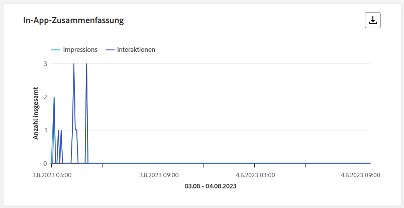

# Live-Bericht zur Journey {#journey-live-report}

>[!CONTEXTUALHELP]
>id="ajo_journey_live_report"
>title="Journey-Live-Bericht"
>abstract="Mit dem Journey-Live-Bericht können Sie die Wirkung und Performance Ihrer Journeys nur in den letzten 24 Stunden in Echtzeit messen und visualisieren. Der Bericht ist in verschiedene Widgets unterteilt, die den Erfolg und die Fehler der Journey detailliert darstellen. Jedes Reporting-Dashboard kann durch Ändern der Größe oder Entfernen von Widgets verändert werden."

Live-Berichte, auf die über die Registerkarte „Letzte 24 Std.“ zugegriffen werden kann, zeigen Ereignisse an, die innerhalb der letzten 24 Stunden stattgefunden haben. Der Zeitraum ab dem Auftreten des Ereignisses beträgt mindestens zwei Minuten. Im Vergleich dazu konzentrieren sich globale Berichte auf Ereignisse, die vor mindestens zwei Stunden aufgetreten sind, und decken Ereignisse über einen ausgewählten Zeitraum ab.

Über die Schaltfläche **[!UICONTROL Bericht anzeigen]** können Sie direkt von Ihrer Journey auf den Journey-Live-Bericht zugreifen.

Die Seite **[!UICONTROL Journey-Live-Bericht]** wird mit den folgenden Registerkarten angezeigt:

* [Journey](#journey-live)
* [E-Mail](#email-live)
* [Push-Benachrichtigung](#push-live)
* [SMS](#sms-live)
* [In-App](#in-app-live)

Der **[!UICONTROL Journey-Live-Bericht]** ist in verschiedene Widgets unterteilt, die den Erfolg und die Fehler der Journey detailliert darstellen. Jedes Widget kann bei Bedarf angepasst und gelöscht werden. Weiterführende Informationen dazu finden Sie in diesem [Abschnitt](live-report.md#modify-dashboard).

Eine detaillierte Liste aller in Adobe Journey Optimizer verfügbaren Metriken finden Sie auf [dieser Seite](live-report.md#list-of-components-live).

## Registerkarte „Journey“ {#journey-live}

In Ihrem **[!UICONTROL Journey-Live-Bericht]** erhalten Sie über die Registerkarte **[!UICONTROL Journey]** eine Einblick in die wichtigsten Tracking-Daten zur Journey.

### Journey-Leistung {#journey-performance}

>[!CONTEXTUALHELP]
>id="ajo_journey_performance_live"
>title="Journey-Leistung"
>abstract="Mit dem Journey Performance-Widget können Sie den Pfad Ihrer Zielprofile visuell verfolgen, während sie während der letzten 24 Stunden durch Ihre Journey laufen."

Mit **[!UICONTROL Journey-Leistung]** können Sie den Pfad Ihrer Zielprofile durch Ihre Journey Schritt für Schritt anzeigen.

### Journey-Statistiken {#journey-statistics}

>[!CONTEXTUALHELP]
>id="ajo_journey_statistics_live"
>title="Journey-Statistiken"
>abstract="Die Journey Statistics Key Performance Indicators (KPIs) dienen als umfassendes Dashboard, das eine umfassende Analyse der wichtigsten Metriken aus den letzten 24 Stunden im Zusammenhang mit Ihrer Journey ermöglicht."

Die Key Performance Indicators (KPIs) **[!UICONTROL Journey-Statistiken]** fungieren als allumfassendes Dashboard, das eine Analyse der wichtigsten Metriken im Zusammenhang mit Ihrer Journey in den letzten 24 Stunden liefert. Dies umfasst Details wie die Anzahl der eingegebenen Profile und Instanzen fehlgeschlagener Journeys und bietet einen umfassenden Einblick in die Effektivität Ihrer Journey und den Grad der Interaktion.

+++ Weitere Informationen zu den Metriken von Journey-Statistiken

* **[!UICONTROL Eingestiegene Profile]**: Gesamtzahl der Personen, die das Eintrittsereignis der Journey erreicht haben.

* **[!UICONTROL Ausgestiegene Profile]**: Gesamtzahl der Personen, die die Journey verlassen haben.

* **[!UICONTROL Fehlgeschlagene individuelle Journeys]**: Gesamtzahl der individuellen Journeys, die nicht erfolgreich ausgeführt wurden.
+++

### In den letzten 24 Stunden ausgeführte Aktion {#action-executed}

>[!CONTEXTUALHELP]
>id="ajo_journey_actions_executed_live"
>title="In den letzten 24 Stunden ausgeführte Aktion"
>abstract="Das Widget Aktion, die in den letzten 24 Stunden ausgeführt wurde, zeigt die aktuelle Leistung an und zeigt die Effektivität Ihrer ausgeführten Aktionen innerhalb der letzten 24 Stunden."

Das Widget **[!UICONTROL In den letzten 24 Stunden ausgeführte Aktion]** stellt die erfolgreichste Aktion dar, die beim Auslösen Ihrer Aktionen stattgefunden hat.

+++ Weitere Informationen zu den Metriken von „In den letzten 24 Stunden ausgeführte Aktion“

* **[!UICONTROL Ausgeführte Aktionen]**: Gesamtzahl der für eine Journey erfolgreich ausgeführten Aktionen.

* **[!UICONTROL Fehler in Aktionen]**: Gesamtzahl der Fehler, die bei Aktionen aufgetreten sind.

+++

### Ausgeführte Aktionen und Fehler {#actions-errors}

>[!CONTEXTUALHELP]
>id="ajo_journey_actions_executed__errors_live"
>title="Ausgeführte Aktionen und Fehler"
>abstract="Das Widget Ausgeführte Aktionen und Fehler zeigt die erfolgreichsten Aktionen und Fehler an, die während der Auslösung von Aktionen in den letzten 24 Stunden aufgetreten sind. Dieses Widget bietet einen umfassenden Überblick über erfolgreiche Ausführungen und aufgetretene Fehler und bietet wertvolle Einblicke in die aktuelle Leistung Ihrer Aktionen."

Die **[!UICONTROL Ausgeführte Aktionen und Fehler]** Widget stellt die erfolgreichste Aktion und Fehler dar, die beim Auslösen Ihrer Aktionen in den letzten 24 Stunden aufgetreten sind.

+++ Weitere Informationen zu den Metriken von ausgeführten Aktionen und Fehlern

* **[!UICONTROL Ausgeführte Aktionen]**: Gesamtzahl der für eine Journey erfolgreich ausgeführten Aktionen.

* **[!UICONTROL Fehler in Aktionen]**: Gesamtzahl der Fehler, die bei Aktionen aufgetreten sind.

+++

### Gründe für Aktionsfehler {#actions-error-reasons}

>[!CONTEXTUALHELP]
>id="ajo_journey_actions_errors_live"
>title="Gründe für Aktionsfehler"
>abstract="Die Tabelle mit den Gründe für Fehler in Aktionen und das Diagramm enthalten eine ausführliche Zusammenfassung der Fehler, die bei der Ausführung Ihrer Aktionen aufgetreten sind. Sie bieten einen umfassenden Überblick über die Probleme, die in den letzten 24 Stunden aufgetreten sein können."

Die Tabelle und der Graph **[!UICONTROL Gründe für Aktionsfehler]** bieten einen umfassenden Überblick über Fehler, die während der Ausführung Ihrer Aktionen in den letzten 24 Stunden aufgetreten sind.

### Fehlertyp nach Aktionen {#error-type-actions}

>[!CONTEXTUALHELP]
>id="ajo_journey_actions_error_type_live"
>title="Fehlertyp nach Aktionen"
>abstract="Die Tabelle mit den Aktionstypen und das Diagramm &quot;Fehlertyp nach Aktionen&quot;bieten einen umfassenden Überblick über Fehler, die bei jeder Ausführung Ihrer Aktionen in den letzten 24 Stunden aufgetreten sind."

Die Tabelle und der Graph **[!UICONTROL Fehlertyp nach Aktionen]** bieten einen umfassenden Überblick über Fehler, die in den letzten 24 Stunden bei jeder Ausführung Ihrer Aktionen aufgetreten sind.

### In den letzten 24 Stunden ausgeführtes Ereignis {#event-executed-24hours}

>[!CONTEXTUALHELP]
>id="ajo_journey_event_24hours_live"
>title="In den letzten 24 Stunden ausgeführtes Ereignis"
>abstract="Mit dem Widget Ereignis , das in den letzten 24 Stunden ausgeführt wurde, können Sie ermitteln, welches Ihrer Ereignisse innerhalb der letzten 24 Stunden erfolgreich ausgeführt wurde. "

Das Widget **[!UICONTROL In den letzten 24 Stunden ausgeführtes Ereignis]** ermöglicht es Ihnen zu identifizieren, welche Ihrer Ereignisse innerhalb der letzten 24 Stunden erfolgreich ausgeführt wurden.

### Ereignisse {#events}

>[!CONTEXTUALHELP]
>id="ajo_journey_events_live"
>title="Ereignisse"
>abstract="Das Ereignis-Widget bietet eine umfassende Übersicht darüber, welche Ihrer Ereignisse erfolgreich ausgeführt wurden, und bietet eine Zusammenfassungsnummer, ein Diagramm und eine Tabelle mit detaillierten Einblicken aus den letzten 24 Stunden."

Mit dem Widget **[!UICONTROL Ereignisse]** können Sie anhand der Zusammenfassungsnummer, des Graphen und der Tabelle anzeigen, welches Ihrer Ereignisse erfolgreich ausgeführt wurde.

### Ereignisse nach Herkunft {#events-origin}

>[!CONTEXTUALHELP]
>id="ajo_journey_events_origin_live"
>title="Ereignisse nach Herkunft"
>abstract="Die Tabelle Events by Origin und die Diagramme bieten einen Überblick über den erfolgreichen Empfang Ihrer Veranstaltungen in den letzten 24 Stunden. Diese visuellen Darstellungen ermöglichen es Ihnen, die tatsächlich erhaltenen Ereignisse genau zu identifizieren und wertvolle Einblicke in die Leistung und Wirkung der einzelnen Ereignisse innerhalb Ihrer Journey zu erhalten."

Die Tabelle und die Graphen **[!UICONTROL Ereignisse nach Herkunft]** geben eine detaillierte Sicht auf den erfolgreichen Empfang Ihrer Ereignisse in den letzten 24 Stunden. Durch diese visuellen Darstellungen können Sie genau erkennen, welche Ihrer Ereignisse effektiv empfangen wurden, und erhalten wertvolle Einblicke in die Performance und Wirkung einzelner Ereignisse innerhalb Ihrer Journey.

## Registerkarte „E-Mail“ {#email-live}

Im **[!UICONTROL Live-Bericht]** Ihrer Journey enthält die Registerkarte **[!UICONTROL E-Mail]** die wichtigsten Informationen zu den E-Mails, die in Ihrer Journey gesendet wurden.

### E-Mail – Versandleistung {#email-sending-performance}

>[!CONTEXTUALHELP]
>id="ajo_journey_email_sending_performance_live"
>title="E-Mail – Versandleistung"
>abstract="Der Graph „E-Mail – Versandstatistik“ fasst wichtige Daten zu Ihren E-Mails, z. B. „Angesprochen“ oder „Zugestellt“, aus den letzten 24 Stunden zusammen."

Das Diagramm **[!UICONTROL E-Mail – Versandleistung]** bietet einen umfassenden Überblick über die Daten zu gesendeten E-Mails in Ihrer Journey und bietet Einblicke in Schlüsselmetriken wie zugestellte Nachrichten und Bounces, die in den letzten 24 Stunden aufgetreten sind. Dies ermöglicht eine detaillierte Analyse des E-Mail-Sendevorgangs und liefert wertvolle Informationen über die Effizienz und Performance Ihrer Journeys.

+++ Weitere Informationen zu Metriken von „E-Mail – Versandleistung“

* **[!UICONTROL Zugestellt]**: Die Anzahl der erfolgreich gesendeten E-Mails.

* **[!UICONTROL Bounces]**: Gesamtzahl der kumulierten Fehler beim Sendevorgang und der automatischen Rücksendungen.

* **[!UICONTROL Fehler]**: Gesamtzahl der während des Versandvorgangs aufgetretenen Fehler, die den Versand an Profile verhindert haben.

* **[!UICONTROL Weitere Zustellversuche]**: Anzahl der E-Mails in der Warteschlange für weitere Zustellversuche.

+++

### E-Mail – Statistiken {#email-stat}

>[!CONTEXTUALHELP]
>id="ajo_journey_email_statistics_live"
>title="E-Mail – Statistiken"
>abstract="Die Tabelle „E-Mail – Statistik“ enthält Daten zur Profilaktivität Ihrer E-Mail aus den letzten 24 Stunden."

Die Tabelle **[!UICONTROL E-Mail – Statistiken]** enthält eine umfassende Zusammenfassung der wichtigsten Daten zu E-Mails in Ihren Journeys in den letzten 24 Stunden. Sie enthält wichtige Metriken wie die Größe der Zielgruppe und die Anzahl der erfolgreich zugestellten E-Mails. Außerdem bietet sie wertvolle Einblicke in die Effektivität und Reichweite Ihrer E-Mails und Journeys.

+++ Weitere Informationen zu Metriken für die E-Mail-Versandstatistiken

* **[!UICONTROL Zielgruppe]**: Gesamtzahl der beim Sendevorgang verarbeiteten Nachrichten.

* **[!UICONTROL Ausgeschlossen]**: Anzahl der Profile, die durch Adobe Journey Optimizer ausgeschlossen wurden.

* **[!UICONTROL Gesendet]**: Gesamtzahl der gesendeten E-Mails.

* **[!UICONTROL Zugestellt]**: Anzahl der erfolgreich gesendeten E-Mails im Verhältnis zur Gesamtzahl der gesendeten Nachrichten.

* **[!UICONTROL Bounces]**: Gesamtzahl der kumulierten Fehler beim Sendevorgang und der automatischen Rücksendungen im Verhältnis zur Gesamtzahl der gesendeten Nachrichten.

* **[!UICONTROL Fehler]**: Gesamtzahl der während des Sendevorgangs aufgetretenen Fehler, die das Senden an Profile verhindert haben.

* **[!UICONTROL Öffnungen]**: Anzahl der Öffnungen Ihrer E-Mails.

* **[!UICONTROL Klicks]**: Anzahl der Klicks auf Inhalte in Ihren E-Mails.

* **[!UICONTROL Abo beenden]**: Zahl der Klicks auf den Abmelde-Link.

* **[!UICONTROL Beschwerden wegen Spam]**: Gibt an, wie oft eine Nachricht als Spam oder Junk gekennzeichnet wurde.

* **[!UICONTROL Weitere Zustellversuche]**: Anzahl der E-Mails in der Warteschlange für weitere Zustellversuche.

+++

### E-Mail – Leistung nach Datum {#email-perf-date}

>[!CONTEXTUALHELP]
>id="ajo_journey_email_performance_bydate_live"
>title="E-Mail – Leistung nach Datum"
>abstract="Der Graph „E-Mail – Leistung nach Datum“ präsentiert umfassende Daten aus den letzten 24 Stunden zu gesendeten E-Mails und bietet Einblicke in wichtige Metriken wie Sendungen und Bounces, sodass eine detaillierte Analyse des E-Mail-Sendevorgangs möglich ist."

Das Widget **[!UICONTROL E-Mail – Leistung nach Datum]** bietet einen detaillierten Überblick über die wichtigsten Informationen zu Ihren E-Mails, die in einem Diagramm dargestellt werden und einen Einblick in die Leistungs-Trends über die letzten 24 Stunden geben.

+++ Weitere Informationen über E-Mails – Metriken zur Leistung nach Datum

* **[!UICONTROL Gesendet]**: Gesamtzahl der gesendeten E-Mails.

* **[!UICONTROL Zugestellt]**: Die Anzahl der erfolgreich gesendeten E-Mails.

* **[!UICONTROL Bounces]**: Gesamtzahl der kumulierten Fehler beim Sendevorgang und der automatischen Rücksendungen.

* **[!UICONTROL Fehler]**: Gesamtzahl der während des Sendevorgangs aufgetretenen Fehler, die das Senden an Profile verhindert haben.

* **[!UICONTROL Öffnungen]**: Anzahl der Öffnungen Ihrer E-Mails.

* **[!UICONTROL Klicks]**: Anzahl der Klicks auf einen Inhalt in Ihren E-Mails.

* **[!UICONTROL Abo beenden]**: Zahl der Klicks auf den Abmelde-Link.

* **[!UICONTROL Beschwerden wegen Spam]**: Gibt an, wie oft eine Nachricht als Spam oder Junk gekennzeichnet wurde.

+++

### E-Mail – Bounce-Kategorien und -Gründe {#email-bounce-categories}

>[!CONTEXTUALHELP]
>id="ajo_journey_email_bounces_live"
>title="E-Mail – Bounce-Kategorien und -Gründe"
>abstract="XX"

Die Widgets **[!UICONTROL Bounce-Gründe]** und **[!UICONTROL Bounce-Kategorien]** stellen die verfügbaren Daten zu Bounce-Nachrichten zusammen und bieten detaillierte Einblicke in die spezifischen Gründe und Kategorien für E-Mail-Bounces der letzten 24 Stunden.

Weitere Informationen zu Bounces finden Sie auf der Seite [ Unterdrückungslisten](../reports/suppression-list.md).

+++ Weitere Informationen zu Metriken für „E-Mail – Bounce-Kategorien und -Gründe“

* **[!UICONTROL Hardbounce]**: die Gesamtzahl der permanenten Fehler, wie eine falsche E-Mail-Adresse. Dazu gehören Fehlermeldungen, die explizit eine ungültige Adresse anzeigen, wie etwa „Benutzer unbekannt“.

* **[!UICONTROL Softbounce]**: die Gesamtzahl der temporären Fehler, wie ein voller Posteingang.

* **[!UICONTROL Ignoriert]**: Die Gesamtzahl der temporären Ereignisse, beispielsweise Abwesenheit, oder technischer Fehler, zum Beispiel wenn der Absendertyp Postmaster ist.

+++

### E-Mail – Fehlergründe {#email-error-reasons}

>[!CONTEXTUALHELP]
>id="ajo_journey_email_errors_live"
>title="E-Mail – Fehlergründe"
>abstract="Anhand der Graphen und der Tabelle „E-Mail – Fehlerursachen“ können Sie die spezifischen Fehler identifizieren, die während des Versandvorgangs in den letzten 24 Stunden aufgetreten sind."

Die Graphen und die Tabelle **[!UICONTROL Fehlergründe]** bieten einen Einblick in die spezifischen Fehler, die während des Sendevorgangs der letzten 24 Stunden aufgetreten sind, und liefern wertvolle Informationen über die Art und das Auftreten der Fehler.

### E-Mail – Gründe für Ausschluss {#email-excluded}

>[!CONTEXTUALHELP]
>id="ajo_journey_email_excluded_live"
>title="E-Mail – Gründe für Ausschluss"
>abstract="Die Graphen und die Tabelle „E-Mail – Ausgeschlossene Gründe“ veranschaulichen die verschiedenen Faktoren, die dazu geführt haben, dass Benutzerprofile, die von der Zielgruppe ausgeschlossen waren, die Nachricht in den letzten 24 Stunden nicht erhalten haben."

Die Graphen und die Tabelle **[!UICONTROL Gründe für Ausschluss]** bieten eine umfassende Übersicht über die verschiedenen Faktoren, die dazu geführt haben, dass Benutzerprofile aus der Zielgruppe ausgeschlossen wurden, sodass die Nachricht in den letzten 24 Stunden nicht empfangen wurde.

Auf [dieser Seite](exclusion-list.md) finden Sie eine umfassende Liste der Ausschlussgründe.

### E-Mail – beste Empfänger-Domain {#email-best-recipient}

>[!CONTEXTUALHELP]
>id="ajo_journey_email_best_recipient_live"
>title="E-Mail – beste Empfänger-Domain"
>abstract="Der Graph und die Tabelle „E-Mail – Beste Empfänger-Domain“ enthalten eine detaillierte Aufschlüsselung der Domains, die Empfängerinnen und Empfänger am häufigsten zum Öffnen der E-Mail verwenden, und bieten wertvolle Einblicke in das Empfängerverhalten aus den letzten 24 Stunden."

Der Graph und die Tabelle **[!UICONTROL E-Mail – beste Empfänger-Domain]** bieten eine detaillierte Aufschlüsselung der Domains, die Profile am häufigsten zum Öffnen Ihrer E-Mails verwenden. Dies bietet wertvolle Informationen in das Profilverhalten und darüber, welches die bevorzugten Plattformen sind.

### E-Mail – Angebote {#email-offers}

>[!CONTEXTUALHELP]
>id="ajo_journey_email_offers_live"
>title="E-Mail – Angebote"
>abstract="Die Widgets Angebotsstatistik und Angebote bieten umfassende Statistiken über die Leistung Ihrer Angebote in den letzten 24 Stunden, eine detaillierte Analyse ihrer Wirkung im Zeitverlauf und detaillierte Statistiken für ein tieferes Verständnis."

>[!NOTE]
>
>Die Angebots-Widgets und -Metriken sind nur verfügbar, wenn eine Entscheidung in eine E-Mail eingefügt wurde. Weiterführende Informationen zum Entscheidungs-Management finden Sie auf dieser [Seite](../offers/get-started/starting-offer-decisioning.md).

Die Widgets **[!UICONTROL Angebotsstatistiken]** und **[!UICONTROL Angebotsstatistiken im Zeitverlauf]** messen den Erfolg Ihres Angebots und dessen Wirkung auf Ihre Zielgruppe. Sie enthalten die wichtigsten Informationen zu Ihrer Nachricht in Form von KPIs.

+++ Weitere Informationen über E-Mails – Angebotsmetriken

* **[!UICONTROL Gesendete Angebote]**: Gibt an, wie oft das Angebot gesendet wurde.

* **[!UICONTROL Angebots-Impression]**: Gibt an, wie oft das Angebot in Ihren E-Mails geöffnet wurde.

* **[!UICONTROL Angebots-Klicks]**: Gibt an, wie oft ein Angebot in Ihren E-Mails angeklickt wurde.

+++

### E-Mail – Optimierung {#email-sto}

>[!CONTEXTUALHELP]
>id="ajo_journey_email_optimization_live"
>title="E-Mail – Optimierung"
>abstract="Die Widgets Sendezeitoptimierung und Optimierte bzw. Nicht-optimierte Sendungen enthalten detaillierte Informationen aus den letzten 24 Stunden zu Ihren Nachrichten und heben hervor, ob sie optimiert wurden oder nicht."

>[!NOTE]
>
>Die Widgets **[!UICONTROL Versandzeitoptimierung]** und **[!UICONTROL Optimiert vs. nicht optimiert]** sind nur verfügbar, wenn die Option „Versandzeitoptimierung“ für Ihren Versand aktiviert ist. Weitere Informationen zur Versandzeitoptimierung finden Sie auf [dieser Seite](../building-journeys/journeys-message.md#send-time-optimization).

Die Widgets **[!UICONTROL Versandzeitoptimierung]** und **[!UICONTROL Optimiert vs. nicht optimiert]** zeigen den Erfolg Ihrer E-Mails in Abhängigkeit von der Versandmethode an: optimiert oder normal.

+++ Mehr Informationen zur Versandzeitoptimierung und zu Metriken „Optimiert vs. nicht optimiert“

* **[!UICONTROL Zugestellt]**: Zahl der erfolgreich gesendeten Nachrichten im Vergleich zur Gesamtzahl der gesendeten Nachrichten.
* **[!UICONTROL Bounces]**: Gesamtzahl der kumulierten Fehler beim Versandvorgang und der automatischen Rücksendungen, bezogen auf die Gesamtzahl der gesendeten Nachrichten.

* **[!UICONTROL Gesendet]**: Gesamtzahl der für die Journey gesendeten E-Mails.

* **[!UICONTROL Öffnungen]**: Gibt an, wie oft Ihre E-Mails in der Journey geöffnet wurden.

* **[!UICONTROL Klicks]**: Anzahl der Klicks auf Inhalte in Ihren E-Mails.

+++

## Registerkarte „Push-Benachrichtigung“ {#push-live}

Im **[!UICONTROL Live-Bericht]** Ihrer Journey finden Sie auf der Registerkarte **[!UICONTROL Push-Benachrichtigung]** die wichtigsten Informationen zu der Push-Benachrichtigung, die in Ihrer Journey gesendet wurden.

### Push-Benachrichtigung – Versandleistung {#push-sending-performance}

>[!CONTEXTUALHELP]
>id="ajo_journey_push_sending_performance_live"
>title="Push-Benachrichtigung – Versandleistung"
>abstract="Der Graph „Push-Benachrichtigung – Versand-Performance“ fasst wichtige Daten zu Ihrer Push-Benachrichtigung zusammen, z. B. „Fehler“ oder „Zugestellte Nachrichten“ aus den letzten 24 Stunden."

Das Diagramm **[!UICONTROL Versandleistung für Push-Benachrichtigungen]** bietet einen umfassenden Überblick über die Daten zu den in den letzten 24 Stunden versandten Push-Benachrichtigungen. Es bietet Einblicke in wichtige Metriken wie zugestellte Nachrichten und Bounces, sodass eine detaillierte Prüfung des Sendevorgangs für Push-Benachrichtigungen möglich ist.

+++ Weitere Informationen zu Metriken von „Push-Benachrichtigung – Versandleistung“

* **[!UICONTROL Zugestellt]**: Die Anzahl der erfolgreich gesendeten Nachrichten.

* **[!UICONTROL Bounces]**: Gesamtzahl der kumulierten Fehler beim Versandvorgang und der automatischen Rücksendungen.

* **[!UICONTROL Fehler]**: Gesamtzahl der während des Sendevorgangs aufgetretenen Fehler, die das Senden an Profile verhindert haben.

+++

### Push-Benachrichtigung – Statistiken {#push-statistics}

>[!CONTEXTUALHELP]
>id="ajo_journey_push_statistics_live"
>title="Push-Benachrichtigung – Statistiken"
>abstract="Die Tabelle „Push-Benachrichtigung – Statistik“ enthält Daten zur Empfängeraktivität der letzten 24 Stunden für Ihre Push-Benachrichtigung."

Die Tabelle **[!UICONTROL Push-Benachrichtigung – Statistiken]** bietet eine übersichtliche Zusammenfassung der wichtigsten Daten im Zusammenhang mit Ihren Push-Benachrichtigungen, darunter wichtige Schlüsselmetriken wie die Anzahl der gezielten Nachrichten und die Anzahl der erfolgreich zugestellten Nachrichten innerhalb der letzten 24 Stunden.

+++ Weitere Informationen zu Metriken für „Push-Benachrichtigungen – Statistiken“

* **[!UICONTROL Zielgruppe]**: Anzahl der Profile, die bei einer Aktion wie etwa E-Mail- oder SMS-Versand angesprochen werden.

* **[!UICONTROL Ausgeschlossen]**: Anzahl der Profile, die durch Adobe Journey Optimizer ausgeschlossen wurden.

* **[!UICONTROL Gesendet]**: Gesamtzahl der gesendeten Push-Benachrichtigungen.

* **[!UICONTROL Zugestellt]**: Die Anzahl der erfolgreich gesendeten Push-Benachrichtigungen.

* **[!UICONTROL Bounces]**: Gesamtzahl der kumulierten Fehler beim Versandvorgang und der automatischen Rücksendungen.

* **[!UICONTROL Fehler]**: Gesamtzahl der während des Versandvorgangs aufgetretenen Fehler, die den Versand an Profile verhindert haben.

* **[!UICONTROL Öffnungen]**: Gibt an, wie oft Ihre Push-Benachrichtigung geöffnet wurde.
+++

### Push-Benachrichtigung – Aufschlüsselung nach Plattform {#push-breakdown}

>[!CONTEXTUALHELP]
>id="ajo_journey_push_breakdown_live"
>title="Push-Benachrichtigung – Aufschlüsselung nach Plattform"
>abstract="Die Graphen und die Tabelle „Aufschlüsselung nach Plattform“ enthalten eine Aufschlüsselung des Erfolgs Ihrer Push-Benachrichtigungen in den letzten 24 Stunden basierend auf dem Betriebssystem der Empfängerin bzw. des Empfängers."

Der Graph und die Tabelle **[!UICONTROL Push-Benachrichtigung – Aufschlüsselung nach Plattform]** liefern eine detaillierte Analyse des Erfolgs Ihrer Push-Benachrichtigungen und bieten Einblicke auf der Grundlage des Betriebssystems Ihres Profils. Diese Aufschlüsselung verbessert Ihr Verständnis der Leistung Ihrer Push-Benachrichtigungen auf verschiedenen Plattformen.

### Push-Benachrichtigung – Sendezusammenfassung {#push-sending-summary}

>[!CONTEXTUALHELP]
>id="ajo_journey_push_sending_summary_live"
>title="Push-Benachrichtigung – Sendezusammenfassung"
>abstract="Der Graph „Push-Benachrichtigung – Sendezusammenfassung“ zeigt die Daten an, die für gesendete Push-Benachrichtigungen aus den letzten 24 Stunden verfügbar sind."

Der Graph **[!UICONTROL Zusammenfassung der Push-Benachrichtigungen]** bietet eine dynamische Darstellung, die eine Analyse Ihrer Push-Benachrichtigungsaktivitäten der letzten 24 Stunden anzeigt. Diese grafische Darstellung bietet eine umfassende Aufschlüsselung gesendeter Push-Benachrichtigungen.

+++ Weitere Informationen zu Push-Benachrichtigungen – Metriken zur Sendezusammenfassung

* **[!UICONTROL Gesendet]**: Gesamtzahl der gesendeten Push-Benachrichtigungen.

* **[!UICONTROL Zugestellt]**: Die Anzahl der erfolgreich gesendeten Push-Benachrichtigungen.

* **[!UICONTROL Bounces]**: Gesamtzahl der kumulierten Fehler beim Versandvorgang und der automatischen Rücksendungen.

* **[!UICONTROL Fehler]**: Gesamtzahl der während des Versandvorgangs aufgetretenen Fehler, die den Versand an Profile verhindert haben.

* **[!UICONTROL Öffnungen]**: Gibt an, wie oft Ihre Push-Benachrichtigungen geöffnet wurden.

* **[!UICONTROL Klicks]**: Gibt an, wie oft ein Inhalt in Ihren Push-Benachrichtigungen angeklickt wurde.

+++

### Push-Benachrichtigung – Fehlergründe {#push-error}

>[!CONTEXTUALHELP]
>id="ajo_journey_push_error_reasons_live"
>title="Push-Benachrichtigung – Fehlergründe"
>abstract="Anhand der Graphen und der Tabelle „Fehlerursachen“ können Sie die spezifischen Fehler identifizieren, die in den letzten 24 Stunden des Versandvorgangs aufgetreten sind."

Die Tabelle und die Diagramme **[!UICONTROL Fehlergründe]** bieten Ihnen die Möglichkeit, die spezifischen Fehler zu identifizieren, die während des Sendevorgangs Ihrer Push-Benachrichtigungen aufgetreten sind. So erhalten Sie einen detaillierten Einblick in alle Probleme, die in den letzten 24 Stunden aufgetreten sind.

### Push-Benachrichtigung – Gründe für Ausschluss {#push-excluded}

>[!CONTEXTUALHELP]
>id="ajo_journey_push_excluded_reasons_live"
>title="Push-Benachrichtigung – Gründe für Ausschluss"
>abstract="Die Graphen und die Tabelle „E-Mail – Ausgeschlossene Gründe“ veranschaulichen die verschiedenen Faktoren, die dazu geführt haben, dass Benutzerprofile, die von der Zielgruppe ausgeschlossen waren, die Nachricht in den letzten 24 Stunden nicht erhalten haben."

Die Graphen und die Tabelle **[!UICONTROL Gründe für Ausschluss]** zeigen die verschiedenen Gründe an, die verhindert haben, dass Benutzerprofile, die von den Zielprofilen ausgeschlossen wurden, in den letzten 24 Stunden Ihre Push-Benachrichtigungen erhalten haben.

Auf [dieser Seite](exclusion-list.md) finden Sie eine umfassende Liste der Ausschlussgründe.

## Registerkarte „SMS“ {#sms-live}

### SMS – Statistiken {#sms-statistics}

>[!CONTEXTUALHELP]
>id="ajo_journey_sms_statistics_live"
>title="SMS – Statistiken"
>abstract="Die Tabelle „SMS – Versandstatistik“ enthält eine Zusammenfassung der wichtigsten Daten zu Ihren SMS-Nachrichten, wie z. B. „Angesprochen“ oder „Zugestellte Nachrichten aus den letzten 24 Stunden“."

Die Tabelle **[!UICONTROL SMS – Statistiken]** bietet eine übersichtliche Zusammenfassung der wichtigsten Daten zu Ihren SMS-Nachrichten. Dazu gehören wichtige Schlüsselmetriken wie die Anzahl der gezielten Nachrichten und die Anzahl der erfolgreich zugestellten Nachrichten der letzten 24 Stunden.

+++ Weitere Informationen zu SMS – Metriken für Statistiken

* **[!UICONTROL Angesprochen]**: Anzahl der Benutzerprofile, die sich als Zielgruppenprofile für diesen Versand eignen.

* **[!UICONTROL Ausgeschlossen]**: Anzahl der Benutzerprofile, die von den Zielgruppenprofilen ausgeschlossen waren und die die Nachricht nicht erhalten haben.

* **[!UICONTROL Gesendet]**: Gesamtzahl der gesendeten SMS-Nachrichten.

* **[!UICONTROL Öffnungen]**: Anzahl der Öffnungen Ihrer SMS-Nachrichten.

* **[!UICONTROL Klicks]**: Anzahl der Klicks auf einen Inhalt in Ihren SMS-Nachrichten.

* **[!UICONTROL Bounces]**: Gesamtzahl der Fehler, die während des Versandvorgangs, des Versandvorgangs und der automatischen Bounce-Verarbeitung kumuliert wurden.

* **[!UICONTROL Fehler]**: Gesamtzahl der während des Sendevorgangs aufgetretenen Fehler, die das Senden an Profile verhindert haben.

+++

### SMS – Leistung nach Datum {#sms-performance}

>[!CONTEXTUALHELP]
>id="ajo_journey_sms_performance_live"
>title="SMS – Leistung nach Datum"
>abstract="Das Widget „SMS – Performance nach Datum“ liefert wichtige Informationen aus den letzten 24 Stunden über Ihre Nachrichten in einer grafischen Darstellung."

Das Widget **[!UICONTROL SMS – Leistung nach Datum]** bietet einen detaillierten Überblick über die wichtigsten Informationen zu Ihren Nachrichten, die in einem Diagramm dargestellt werden und einen Einblick in die Leistungs-Trends über die letzten 24 Stunden geben.

+++ Weitere Informationen zu SMS – Metriken zur Leistung nach Datum

* **[!UICONTROL Gesendet]**: Gesamtzahl der gesendeten SMS-Nachrichten.

* **[!UICONTROL Bounces]**: Gesamtzahl der kumulierten Fehler beim Versandvorgang und der automatischen Rücksendungen.

* **[!UICONTROL Fehler]**: Gesamtzahl der während des Sendevorgangs aufgetretenen Fehler, die das Senden an Profile verhindert haben.

+++

### SMS – Bounce-Gründe {#sms-bounces}

>[!CONTEXTUALHELP]
>id="ajo_journey_sms_bounces_live"
>title="SMS – Bounce-Gründe"
>abstract="Die Graphen und die Tabelle „Bounce-Ursachen“ enthalten die Daten aus den letzten 24 Stunden bezüglich Bounce-Nachrichten."

Die Graphen und die Tabelle **[!UICONTROL SMS – Bounce-Gründe]** bieten einen umfassenden Überblick über die Daten im Zusammenhang mit Bounce-SMS-Nachrichten und liefern wertvolle Einblicke in die spezifischen Gründe für die Bounces von SMS-Nachrichten in den letzten 24 Stunden.

### SMS – Fehlergründe {#sms-error}

>[!CONTEXTUALHELP]
>id="ajo_journey_sms_error_live"
>title="SMS – Fehlergründe"
>abstract="Die Graphen und die Tabelle „SMS – Fehlerursachen“ ermöglichen es Ihnen, die spezifischen Fehler zu identifizieren, die in den letzten 24 Stunden während des Versandvorgangs aufgetreten sind."

Die Graphen und die Tabelle **[!UICONTROL SMS – Fehlergründe]** ermöglichen es Ihnen, die spezifischen Fehler zu identifizieren, die während des Sendevorgangs Ihrer SMS-Nachrichten aufgetreten sind. Dies erleichtert eine gründliche Analyse der Probleme, die in den letzten 24 Stunden aufgetreten sind.

### SMS – Gründe für Ausschluss {#sms-excluded}

>[!CONTEXTUALHELP]
>id="ajo_journey_sms_excluded_live"
>title="SMS – Gründe für Ausschluss"
>abstract="Die Graphen und die Tabelle „E-Mail – Ausgeschlossene Gründe“ veranschaulichen die verschiedenen Faktoren, die dazu geführt haben, dass Benutzerprofile, die von der Zielgruppe ausgeschlossen waren, die Nachricht in den letzten 24 Stunden nicht erhalten haben."

Die Graphen und die Tabelle **[!UICONTROL SMS – Gründe für Ausschluss]** stellen visuell die verschiedenen Faktoren dar, die zum Ausschluss von Nutzerprofilen aus der Zielgruppe geführt haben, sodass diese Ihre SMS-Nachrichten nicht empfangen konnten.

Auf [dieser Seite](exclusion-list.md) finden Sie eine umfassende Liste der Ausschlussgründe.

<!--
### SMS - Clicks by links {#sms-clicks}

The **[!UICONTROL SMS - Clicks by links]** widget offers essential insights into your visitors' engagement with the URLs included in your messages, providing valuable information about which links attract the most interaction within the last 24 hours.
-->

## Registerkarte „In-App“ {#in-app-live}

### In-App-Leistung {#inapp-performance}

>[!CONTEXTUALHELP]
>id="ajo_journey_inapp_performance_live"
>title="In-App-Leistung"
>abstract="Die KPIs zur In-App-Leistung bieten wichtige Einblicke in die Interaktion Ihrer Besucher mit In-App-Nachrichten in den letzten 24 Stunden.&quot;"

Die KPIs **[!UICONTROL In-App-Leistung]** bieten wichtige Einblicke in die Interaktion Ihrer Profile mit In-App-Nachrichten in den letzten 24 Stunden. Sie liefern wichtige Metriken, um die Effektivität und Wirkung der In-App-Nachrichten in Ihrer Journey zu bewerten.

+++ Weitere Informationen zu In-App – Leistungsmetriken

* **[!UICONTROL Impressions]**: Gesamtzahl der an alle Benutzerinnen und Benutzer gesendeten In-App-Nachrichten.

  >[!NOTE]
  >
  >Um sicherzustellen, dass eine Impression gezählt wird, muss die Benutzerin bzw. der Benutzer zwei Kriterien erfüllen:
  >* Qualifizierung innerhalb des In-App-Erlebnisses, das durch Erreichen der spezifischen In-App-Aktivität in ihrer bzw. seiner Journey erreicht wird.
  >* Erfüllung der in den Auslöseregeln festgelegten Bedingungen.
  > 
  >Aufgrund des zweiten Kriteriums kann es erhebliche Unterschiede zwischen der Anzahl der angesprochenen Profile und der Anzahl der eindeutigen Impressions geben.

* **[!UICONTROL Interaktionen]**: Gesamtzahl der Interaktionen mit Ihrer In-App-Nachricht. Dazu gehören alle von den Benutzenden durchgeführten Aktionen, wie z. B. Klicks, Abbrüche oder andere Interaktionen.

+++

### In-App-Zusammenfassung {#inapp-summary}

>[!CONTEXTUALHELP]
>id="ajo_journey_inapp_summary_live"
>title="In-App-Zusammenfassung"
>abstract="Der In-App-Übersichtsgraph zeigt den Verlauf Ihrer In-App-Impressions und -Interaktionen in den letzten 24 Stunden."

Der Graph **[!UICONTROL In-App-Zusammenfassung]** veranschaulicht die Entwicklung Ihrer In-App-Impressions und -Interaktionen in den letzten 24 Stunden und bietet einen umfassenden Überblick über die Leistung Ihrer In-App-Nachrichten.

+++ Weitere Informationen zu In-App-Zusammenfassungsmetriken

* **[!UICONTROL Impressions]**: Gesamtzahl der an alle Benutzerinnen und Benutzer gesendeten In-App-Nachrichten.

  >[!NOTE]
  >
  >Um sicherzustellen, dass eine Impression gezählt wird, muss die Benutzerin bzw. der Benutzer zwei Kriterien erfüllen:
  >* Qualifizierung innerhalb des In-App-Erlebnisses, das durch Erreichen der spezifischen In-App-Aktivität in ihrer bzw. seiner Journey erreicht wird.
  >* Erfüllung der in den Auslöseregeln festgelegten Bedingungen.
  > 
  >Aufgrund des zweiten Kriteriums kann es erhebliche Unterschiede zwischen der Anzahl der angesprochenen Profile und der Anzahl der eindeutigen Impressions geben.

* **[!UICONTROL Interaktionen]**: Gesamtzahl der Interaktionen mit Ihrer In-App-Nachricht. Dazu gehören alle von den Benutzenden durchgeführten Aktionen, wie z. B. Klicks, Abbrüche oder andere Interaktionen.

+++

### Interaktionen nach Typ {#interactions-type}

>[!CONTEXTUALHELP]
>id="ajo_journey_inapp_interactions_live"
>title="Interaktionen nach Typ"
>abstract="Die Graphen und die Tabelle „Interaktionen nach Typ“ beschreiben, wie Benutzende mit Ihrer In-App-Nachricht interagiert haben, indem Klicks, Abbrechen oder Interaktionen verfolgt werden."

Die Graphen und die Tabelle **[!UICONTROL Interaktionen nach Typ]** beschreiben, wie Benutzende mit Ihrer In-App-Nachricht interagiert haben, indem Klicks, Abbrüche oder Interaktionen verfolgt werden.
