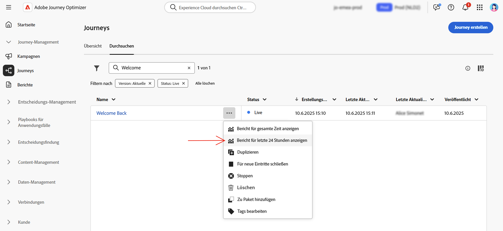

# Journey-Live-Bericht {#journey-live-report}

Der Journey-Live-Bericht kann direkt von Ihrer Journey aus mit dem **[!UICONTROL View report]** Schaltfläche.

Die Journey **[!UICONTROL Live report]** wird mit den folgenden Registerkarten angezeigt:

* [Journey](#journey-live)
* [Email](#email-live)
* [Push](#push-live)
* [SMS](#sms-live)

Die Journey **[!UICONTROL Live report]** ist in verschiedene Widgets unterteilt, die den Erfolg und die Fehler Ihrer Journey detailliert beschreiben. Jedes Widget kann bei Bedarf in der Größe angepasst und gelöscht werden. Weitere Informationen hierzu finden Sie in diesem Abschnitt [Abschnitt](live-report.md#modify-dashboard).

Eine detaillierte Liste aller in Adobe Journey Optimizer verfügbaren Metriken finden Sie unter [diese Seite](live-report.md#list-of-components-live).

## Registerkarte &quot;Journey&quot; {#journey-live}

Von Ihrer Reise aus **[!UICONTROL Live report]**, die **[!UICONTROL Journey]** bietet einen klaren Überblick über die wichtigsten Tracking-Daten zu Ihrer Journey.

+++ Erfahren Sie mehr über die verschiedenen Metriken und Widgets, die für den Journey-Bericht verfügbar sind.

**[!UICONTROL Journey Performance]** ermöglicht es Ihnen, den Pfad Ihrer Zielgruppenprofile Schritt für Schritt durch Ihre Journey zu sehen.

Die **[!UICONTROL Journey Statistics]** Widget zeigt die folgenden KPIs an:

* **[!UICONTROL Entered profiles]**: Gesamtzahl der Kontakte, die das Eintrittsereignis der Journey erreicht haben.

* **[!UICONTROL Exited profiles]**: Gesamtzahl der Kontakte, die die Journey verlassen haben.

* **[!UICONTROL Failed individual journeys]**: Gesamtzahl der einzelnen Journeys, die nicht erfolgreich ausgeführt wurden.

Die **[!UICONTROL Event executed over the last 24 hours]** und **[!UICONTROL Events]** -Widgets zeigen Ihnen, welches Ihrer Ereignisse erfolgreich ausgeführt wurde, anhand von Zusammenfassungsnummer, Diagramm und Tabelle.

Die **[!UICONTROL Action executed over the last 24 hours]** und **[!UICONTROL Actions executed and errors]** Widgets stellen die erfolgreichste Aktion und Fehler dar, die beim Auslösen Ihrer Aktionen aufgetreten sind. Die Aktionsdiagramme, Tabellen- und Zusammenfassungsnummern enthalten die für Aktionen verfügbaren Daten, z. B.:

* **[!UICONTROL Actions executed]**: Gesamtzahl der für eine Journey erfolgreich durchgeführten Aktionen.

* **[!UICONTROL Error in actions]**: Gesamtzahl der Fehler, die bei Aktionen aufgetreten sind.
+++

## Email-Tab {#email-live}

Von Ihrer Reise aus **[!UICONTROL Live report]**, die **[!UICONTROL Email]** enthält die wichtigsten Informationen zu den in Ihrer Journey gesendeten E-Mail-Sendungen.

+++ Erfahren Sie mehr über die verschiedenen Metriken und Widgets, die für den E-Mail-Bericht verfügbar sind.

Die **[!UICONTROL Email Sending Statistics]** Widget beschreibt die wichtigsten Informationen zu Ihrer Nachricht:

* **[!UICONTROL Delivered]**: Anzahl der erfolgreich gesendeten Nachrichten.

* **[!UICONTROL Bounces]**: Gesamtzahl der über alle Sendungen hinweg kumulierten Fehler und der automatischen Bounce-Verarbeitung.

* **[!UICONTROL Errors]**: Gesamtzahl der bei einem Versand aufgetretenen Fehler, die den Versand an Profile verhinderten.

Die **[!UICONTROL Sending metrics by Email]** Tabelle und **[!UICONTROL Email Summary]** -Diagramm zeigt den Erfolg Ihres Versands:

* **[!UICONTROL Sent]**: Gesamtzahl der gesendeten Nachrichten

* **[!UICONTROL Delivered]**: Anzahl der erfolgreich gesendeten Nachrichten.

* **[!UICONTROL Bounces]**: Gesamtzahl der über alle Sendungen hinweg kumulierten Fehler und der automatischen Bounce-Verarbeitung.

* **[!UICONTROL Errors]**: Gesamtzahl der bei einem Versand aufgetretenen Fehler, die den Versand an Profile verhinderten.

* **[!UICONTROL Opens]**: Anzahl der Öffnungen einer Nachricht in einem Versand.

* **[!UICONTROL Clicks]**: Anzahl der Klicks auf einen Inhalt in einem Versand.

* **[!UICONTROL Unsubscribe]**: Anzahl der Klicks auf den Abmelde-Link.

* **[!UICONTROL Spam complaints]**: Gibt an, wie oft eine Nachricht als Spam oder Junk gekennzeichnet wurde.

Die **[!UICONTROL Bounce Reasons]**, **[!UICONTROL Bounce categories]** und **[!UICONTROL Hard and bounce - by Email]** -Widgets enthalten die verfügbaren Daten zu Bounce-Nachrichten, z. B.:

* **[!UICONTROL Hard bounce]**: Die Gesamtzahl der permanenten Fehler, z. B. eine falsche E-Mail-Adresse. Dies beinhaltet eine Fehlermeldung, die explizit angibt, dass die Adresse ungültig ist, z. B. &quot;Unbekannter Benutzer&quot;.

* **[!UICONTROL Soft bounce]**: Die Gesamtzahl der temporären Fehler, z. B. einer vollen Inbox.

* **[!UICONTROL Ignored]**: Die Gesamtzahl der temporären Ereignisse, z. B. &quot;Out of office&quot;, oder eines technischen Fehlers, z. B. wenn der Absendertyp Postmaster ist.

Die **[!UICONTROL Error Reasons]** und **[!UICONTROL Exclude Reasons]** Mit Diagrammen und Tabellen können Sie sehen, welcher Fehler und welche Ausschlüsse während des Versands aufgetreten sind.

Die **[!UICONTROL Email - Top recipient domain]** Anhand von Diagrammen und Tabellen wird beschrieben, welche Domänen von den Empfängern am häufigsten zum Öffnen der E-Mail verwendet werden.

>[!NOTE]
>
>Die Widgets Angebote und Metriken sind nur verfügbar, wenn eine Entscheidung in eine E-Mail eingefügt wurde. Weiterführende Informationen zur Entscheidungsverwaltung finden Sie in diesem [page](../offers/get-started/starting-offer-decisioning.md).

Die **[!UICONTROL Offers statistic]** und **[!UICONTROL Offers statistics]** über Widgets vom Typ Zeit hinweg messen Sie den Erfolg und die Wirkung Ihres Angebots auf Ihre Zielgruppe. Sie enthalten die wichtigsten Informationen zu Ihrer Nachricht mit KPIs:

* **[!UICONTROL Offer sent]**: Gesamtzahl der gesendeten Nachrichten für das Angebot.

* **[!UICONTROL Offer impression]**: Anzahl der Öffnungen des Angebots in einem Versand.

* **[!UICONTROL Offer clicks]**: Anzahl der Klicks auf ein Angebot in einem Versand.
+++

## Tab Push notification {#push-live}

Von Ihrer Reise aus **[!UICONTROL Live report]**, die **[!UICONTROL Push notification]** im Tab werden die wichtigsten Informationen zu den in Ihrer Journey gesendeten Push-Nachrichten aufgeführt.

+++ Erfahren Sie mehr über die verschiedenen Metriken und Widgets, die für den Push-Bericht verfügbar sind.

**[!UICONTROL Push notification sending performance]**, **[!UICONTROL Push notification summary]** und **[!UICONTROL Sending metrics - by Push]** Widgets zeigen die wichtigsten Informationen zu Ihrer Nachricht an:

* **[!UICONTROL Sent]**: Gesamtzahl der gesendeten Nachrichten

* **[!UICONTROL Delivered]**: Anzahl der erfolgreich gesendeten Nachrichten.

* **[!UICONTROL Bounces]**: Gesamtzahl der über alle Sendungen hinweg kumulierten Fehler und der automatischen Bounce-Verarbeitung.

* **[!UICONTROL Errors]**: Gesamtzahl der bei einem Versand aufgetretenen Fehler, die den Versand an Profile verhinderten.

* **[!UICONTROL Opens]**: Anzahl der Öffnungen einer Nachricht in einem Versand.

* **[!UICONTROL Actions]**: Gesamtzahl der Aktionen, die mit der gesendeten Push-Benachrichtigung durchgeführt wurden, z. B. Klick auf eine Schaltfläche oder Abweisung.

* **[!UICONTROL Engagements]**: Gesamtzahl der Öffnungen und Aktionen für diese Push-Benachrichtigung, d. h. wenn das Profil die Push-Benachrichtigung geöffnet oder auf eine Schaltfläche geklickt hat.

Die **[!UICONTROL Error Reasons]** und **[!UICONTROL Exclude Reasons]** Mit Diagrammen und Tabellen können Sie sehen, welcher Fehler und welche Ausschlüsse während des Versands aufgetreten sind.

Die **[!UICONTROL Sending statistics - Failed]** -Widget können Sie sehen, wie viele Fehler und Bounces aufgetreten sind.

Die **[!UICONTROL Tracking by platform]**, **[!UICONTROL Sending by platform]** und **[!UICONTROL Breakdown by platform]** Grafiken und Tabellen zeigen den Erfolg Ihrer Push-Benachrichtigung in Abhängigkeit vom Betriebssystem.
+++

## SMS-Tab {#sms-live}

+++ Erfahren Sie mehr über die verschiedenen Metriken und Widgets, die für den SMS-Bericht verfügbar sind.

Die **[!UICONTROL SMS - Sending statistics]** -Tabelle zeigt den Erfolg Ihres Versands:

* **[!UICONTROL Targeted]**: Anzahl der Benutzerprofile, die als Zielprofile für diesen Versand gelten.

* **[!UICONTROL Excluded]**: Anzahl der Benutzerprofile, die von den Zielgruppenprofilen ausgeschlossen waren und die die Nachricht nicht erhalten haben.

* **[!UICONTROL Sent]**: Gesamtzahl der gesendeten Nachrichten

* **[!UICONTROL Delivered]**: Anzahl der erfolgreich gesendeten Nachrichten.

* **[!UICONTROL Opens]**: Anzahl der Öffnungen einer Nachricht in einem Versand.

* **[!UICONTROL Clicks]**: Anzahl der Klicks auf einen Inhalt in einem Versand.

* **[!UICONTROL Bounces]**: Gesamtzahl der über alle Sendungen hinweg kumulierten Fehler und der automatischen Bounce-Verarbeitung.

* **[!UICONTROL Errors]**: Gesamtzahl der bei einem Versand aufgetretenen Fehler, die den Versand an Profile verhinderten.

Die **[!UICONTROL SMS Summary]** -Diagramm zeigt den Erfolg Ihres Versands:

* **[!UICONTROL Delivered]**: Anzahl der erfolgreich gesendeten Nachrichten.

* **[!UICONTROL Bounces]**: Gesamtzahl der über alle Sendungen hinweg kumulierten Fehler und der automatischen Bounce-Verarbeitung.

* **[!UICONTROL Errors]**: Gesamtzahl der bei einem Versand aufgetretenen Fehler, die den Versand an Profile verhinderten.

Die **[!UICONTROL Exclude Reasons]** Mit Diagrammen und Tabellen können Sie sehen, welcher Fehler und welche Ausschlüsse während des Versands aufgetreten sind.
+++
