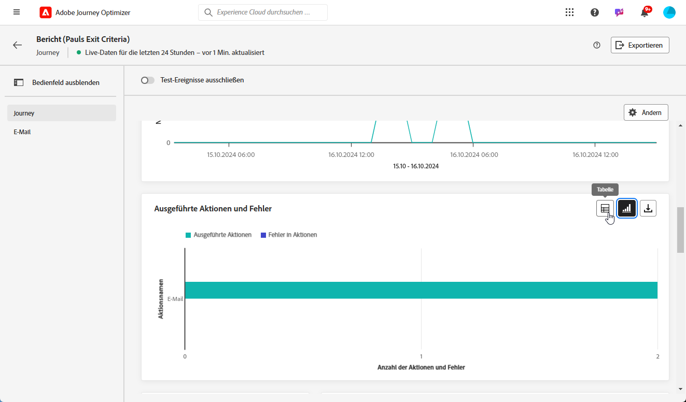
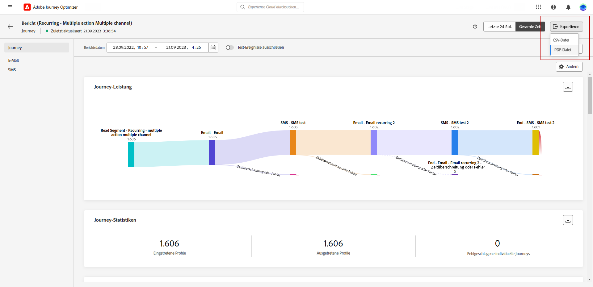

# Erste Schritte mit dem Live-Bericht {#live-report}

Verwenden Sie den **[!UICONTROL Live-Bericht]**, um die Wirkung und Leistung Ihrer Journeys und Nachrichten in Echtzeit in einem integrierten Dashboard zu messen und zu visualisieren.
Die Daten sind im **[!UICONTROL Live-Bericht]** verfügbar, sobald Ihr Versand erfolgt ist oder Ihre Journey auf der Registerkarte **[!UICONTROL Letzte 24 Std.]** ausgeführt wurde.

* Wenn Sie eine Journey im Kontext einer Journey anpeilen möchten, rufen Sie über das Menü **[!UICONTROL Journeys]** Ihre Journey auf und klicken Sie auf die Schaltfläche **[!UICONTROL Bericht anzeigen]**.

  

* Wenn Sie eine Kampagne als Ziel wählen möchten, rufen Sie im Menü **[!UICONTROL Kampagnen]** Ihre Kampagne auf und klicken auf die Schaltfläche **[!UICONTROL Berichte]**.

  

* Wenn Sie vom **[!UICONTROL globalen Bericht]** zum **[!UICONTROL Live-Bericht]** für Ihren Versand wechseln möchten, klicken Sie auf **[!UICONTROL Letzte 24 Std.]** im Registerkarten-Umschalter.

  

Eine detaillierte Liste aller in Adobe Journey Optimizer verfügbaren Metriken finden Sie auf [dieser Seite](#list-of-components-live).

## Dashboard anpassen {#modify-dashboard}

Jedes Reporting-Dashboard kann durch Ändern der Größe oder Entfernen von Widgets verändert werden. Das Ändern der Widgets wirkt sich nur auf das Dashboard des aktuellen Benutzers aus. Andere Benutzer sehen ihre eigenen Dashboards oder die standardmäßig festgelegten.

1. Im Dropdown-Menü **[!UICONTROL Aktionen]** können Sie auswählen, ob Sie eine bestimmte Aktion Ihrer Journey auswerten möchten.

1. Sie können mit der Umschaltleiste auswählen, ob Sie Testereignisse aus Ihren Berichten ausschließen möchten. Weitere Informationen zu Testereignissen finden Sie auf [dieser Seite](../building-journeys/testing-the-journey.md).

   Beachten Sie, dass die Option **[!UICONTROL Test-Ereignisse ausschließen]** nur für Journey-Berichte verfügbar ist.

   

1. Um die Größe von Widgets zu ändern oder sie zu entfernen, klicken Sie auf **[!UICONTROL Ändern]**.

   

1. Sie können die Größe der Widgets durch Ziehen an der rechten unteren Ecke anpassen.

   

1. Klicken Sie auf **[!UICONTROL Entfernen]**, um alle Widgets zu entfernen, die Sie nicht benötigen.

   

1. Wenn Sie mit der Anzeigereihenfolge und der Größe Ihrer Widgets zufrieden sind, klicken Sie auf **[!UICONTROL Speichern]**.

1. Um die Darstellung Ihrer Daten anzupassen, können Sie zwischen verschiedenen Visualisierungsoptionen, wie Graphen, Tabellen und Ringdiagrammen, wechseln.

   

Ihr Dashboard ist jetzt gespeichert. Ihre verschiedenen Änderungen werden bei einer späteren Verwendung Ihrer Live-Berichte erneut angewendet. Verwenden Sie bei Bedarf die Option **[!UICONTROL Zurücksetzen]**, um die Standard-Widgets und ihre Standardreihenfolge wiederherzustellen.

## Exportieren der Berichte {#export-reports}

Sie können Ihre Berichte einfach in PDF-Format exportieren, sodass Sie sie freigeben oder drucken können.

1. Klicken Sie in Ihrem Bericht auf **[!UICONTROL Exportieren]**.

   

1. Konfigurieren Sie das Dokument wie gewünscht im Drucken-Fenster. Beachten Sie, dass die Optionen je nach Browser variieren können.

1. Wählen Sie, ob Sie Ihren Bericht als PDF drucken oder speichern möchten.

1. Suchen Sie den Ordner, in dem Sie die Datei speichern möchten, benennen Sie diesen gegebenenfalls um und klicken Sie auf Speichern.

Ihr Bericht kann jetzt in einer PDF-Datei angezeigt oder freigegeben werden.
