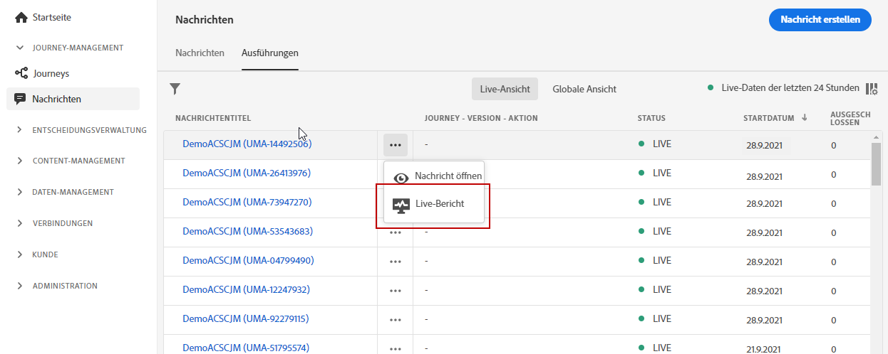

# Erste Schritte mit dem Live-Bericht {#live-report}

Verwenden Sie den **[!UICONTROL Live-Bericht]**, um die Wirkung und Leistung Ihrer Journeys und Nachrichten in Echtzeit in einem integrierten Dashboard zu messen und zu visualisieren.
Im **[!UICONTROL Live-Bericht]** sind Daten verfügbar, sobald Ihr Versand durchgeführt oder Ihre Journey ausgeführt wird.

* Wenn Sie eine Journey oder Sendungen innerhalb einer Journey ansprechen möchten, greifen Sie im Menü **[!UICONTROL Journeys]** auf Ihre Journey zu und klicken Sie auf das Symbol **[!UICONTROL Live-Bericht]**. Dann können Sie die Live-Berichte „Journey“, „E-Mail“ und „Push-Benachrichtigung“ finden.

   

* Wenn Sie einen bestimmten Versand ansprechen möchten, wählen Sie **[!UICONTROL Live-Ansicht]** auf der Registerkarte **[!UICONTROL Ausführungen]** Ihrer Nachrichten die Option **[!UICONTROL Live-Bericht]** aus dem erweiterten Menü des ausgewählten Versands.

   

* Wenn Sie von der **[!UICONTROL Live-Bericht]** der **[!UICONTROL Gesamtbericht]** Klicken Sie für Ihren Versand auf **[!UICONTROL Globale Ansicht]** über den Tab-Umschalter aus.

   

## Dashboard anpassen {#modify-dashboard}

Jedes Reporting-Dashboard kann durch Ändern der Größe oder Entfernen von Widgets geändert werden. Das Ändern der Widgets wirkt sich nur auf das Dashboard des aktuellen Benutzers aus. Andere Benutzer sehen ihre eigenen Dashboards oder die standardmäßig festgelegten.

1. Sie können mit der Umschaltleiste auswählen, ob Sie Testereignisse aus Ihren Berichten ausschließen möchten. Weitere Informationen zu Testereignissen finden Sie auf [dieser Seite](../building-journeys/testing-the-journey.md).

   Beachten Sie Folgendes: **[!UICONTROL Testereignisse ausschließen]** ist nur für Journey-Berichte verfügbar.

   

1. Um die Größe von Widgets zu ändern oder sie zu entfernen, klicken Sie auf **[!UICONTROL Ändern]**.

   

1. Sie können die Größe der Widgets durch Ziehen an der rechten unteren Ecke anpassen.

   

1. Klicken Sie auf **[!UICONTROL Entfernen]**, um alle Widgets zu entfernen, die Sie nicht benötigen.

   

1. Wenn Sie mit der Anzeigereihenfolge und der Größe Ihrer Widgets zufrieden sind, klicken Sie auf **[!UICONTROL Speichern]**.

Ihr Dashboard ist jetzt gespeichert. Ihre verschiedenen Änderungen werden bei einer späteren Verwendung Ihrer Live-Berichte erneut angewendet. Verwenden Sie bei Bedarf die Option **[!UICONTROL Zurücksetzen]**, um die Standard-Widgets und ihre Standardreihenfolge wiederherzustellen.
