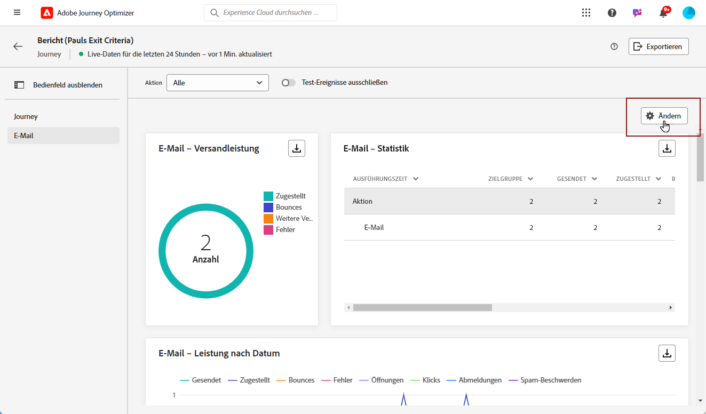

# Erste Schritte mit dem Live-Bericht {#live-report}

Verwenden Sie den **[!UICONTROL Live-Bericht]**, um die Wirkung und Leistung Ihrer Journeys und Nachrichten in Echtzeit in einem integrierten Dashboard zu messen und zu visualisieren.
Die Daten sind im **[!UICONTROL Live-Bericht]** verfügbar, sobald Ihr Versand erfolgt ist oder Ihre Journey auf der Registerkarte **[!UICONTROL Letzte 24 Std.]** ausgeführt wurde.

* Wenn Sie eine Journey im Kontext einer Journey anpeilen möchten, rufen Sie über das Menü **[!UICONTROL Journeys]** Ihre Journey auf und klicken Sie auf die Schaltfläche **[!UICONTROL Bericht anzeigen]**.

   

* Wenn Sie eine Kampagne als Ziel wählen möchten, rufen Sie im Menü **[!UICONTROL Kampagnen]** Ihre Kampagne auf und klicken auf die Schaltfläche **[!UICONTROL Berichte]**.

   

* Wenn Sie vom **[!UICONTROL globalen Bericht]** zum **[!UICONTROL Live-Bericht]** für Ihren Versand wechseln möchten, klicken Sie auf **[!UICONTROL Letzte 24 Std.]** im Registerkarten-Umschalter.

   

Eine detaillierte Liste aller in Adobe Journey Optimizer verfügbaren Metriken finden Sie auf [dieser Seite](#list-of-components-live).

## Dashboard anpassen {#modify-dashboard}

Jedes Reporting-Dashboard kann durch Ändern der Größe oder Entfernen von Widgets verändert werden. Das Ändern der Widgets wirkt sich nur auf das Dashboard des aktuellen Benutzers aus. Andere Benutzer sehen ihre eigenen Dashboards oder die standardmäßig festgelegten.

1. Im Dropdown-Menü **[!UICONTROL Aktionen]** können Sie auswählen, ob Sie eine bestimmte Aktion Ihrer Journey auswerten möchten.

1. Sie können mit der Umschaltleiste auswählen, ob Sie Testereignisse aus Ihren Berichten ausschließen möchten. Weitere Informationen zu Testereignissen finden Sie auf [dieser Seite](../building-journeys/testing-the-journey.md).

   Beachten Sie, dass die Option **[!UICONTROL Test-Ereignisse ausschließen]** nur für Journey-Berichte verfügbar ist.

   

1. Um die Größe von Widgets zu ändern oder sie zu entfernen, klicken Sie auf **[!UICONTROL Ändern]**.

   

1. Sie können die Größe der Widgets durch Ziehen an der rechten unteren Ecke anpassen.

   

1. Klicken Sie auf **[!UICONTROL Entfernen]**, um alle Widgets zu entfernen, die Sie nicht benötigen.

   

1. Wenn Sie mit der Anzeigereihenfolge und der Größe Ihrer Widgets zufrieden sind, klicken Sie auf **[!UICONTROL Speichern]**.

1. Um die Darstellung Ihrer Daten anzupassen, können Sie zwischen verschiedenen Visualisierungsoptionen, wie Graphen, Tabellen und Ringdiagrammen, wechseln.

   

Ihr Dashboard ist jetzt gespeichert. Ihre verschiedenen Änderungen werden bei einer späteren Verwendung Ihrer Live-Berichte erneut angewendet. Verwenden Sie bei Bedarf die Option **[!UICONTROL Zurücksetzen]**, um die Standard-Widgets und ihre Standardreihenfolge wiederherzustellen.

## Liste von Komponenten {#list-of-components-live}

In den Tabellen unten finden Sie nach Versandtyp geordnet die Liste der Metriken, die in Berichten verwendet werden, sowie ihre Definitionen.

### Journey-Metriken {#journey-metrics}

<table> 
 <thead> 
  <tr> 
   <th> Metrik  </th> 
   <th> Definition  </th> 
</tr>
 </thead> 
 <tbody> 
  <tr> 
   <td>Erfolgreich ausgeführte Aktionen  </td> 
   <td> Gesamtzahl der erfolgreich ausgeführten Aktionen für eine Journey . </td> 
</tr> 
  <tr> 
   <td> Eingetretene Profile  </td> 
   <td> Gesamtzahl der Einzelanwendenden, die das Eintrittsereignis der Journey erreicht haben.  </td> 
</tr>
  <tr> 
   <td> Fehler bei Aktion  </td> 
   <td>Gesamtzahl der Fehler, die bei Aktionen aufgetreten sind.  </td> 
</tr> 
  <tr> 
   <td> Ausgestiegene Profile  </td> 
   <td> Gesamtzahl der Einzelanwendenden, die die Journey verlassen haben  </td> 
</tr> 
  <tr> 
   <td> Fehlgeschlagene einzelne Journey  </td> 
   <td> Gesamtzahl der einzelnen Journeys, die nicht erfolgreich ausgeführt wurden.  </td> 
</tr> 
 </tbody> 
</table>

### Dimensionen und Metriken für E-Mail und SMS {#email-and-sms-metrics}

<table> 
 <thead> 
  <tr> 
   <th> Metrik  </th> 
   <th> Definition  </th> 
</tr>
 </thead> 
 <tbody>
  <tr> 
   <td> Bounces  </td> 
   <td> Gesamtzahl der kumulierten Fehler beim Versand und der automatischen Bounce-Verarbeitung.  </td> 
</tr> 
  <tr> 
   <td> Absprungrate  </td> 
   <td> Prozentsatz der Bounce-E-Mails im Vergleich zu den gesendeten E-Mails  </td> 
</tr>
  <tr> 
   <td> Klicks  </td> 
   <td> Anzahl der Klicks auf einen Inhalt in einer E-Mail.  </td> 
</tr> 
  <tr> 
   <td> Zugestellt   </td> 
   <td> Anzahl der erfolgreich versendeten Nachrichten. </td> 
</tr> 
  <tr> 
   <td> Zustellungsrate  </td> 
   <td> Prozentsatz der erfolgreich gesendeten Nachrichten  </td> 
</tr>
  <tr> 
   <td> Fehler  </td> 
   <td> Gesamtanzahl der Fehler, die während des Versands aufgetreten sind und die Zustellung an Profile verhinderten.  </td> 
</tr> 
  <tr> 
   <td> Fehlerrate  </td> 
   <td> Prozentsatz der Fehler, die während des Versands auftraten und die Zustellung verhinderten, im Vergleich zur Zahl der gesendeten E-Mails.  </td> 
</tr>
  <tr> 
   <td> Ausgeschlossen  </td> 
   <td> Anzahl der Profile, die durch Adobe Journey Optimizer ausgeschlossen wurden.  </td> 
</tr>
  <tr> 
   <td> Hardbounce  </td> 
   <td> Gesamtzahl der permanenten Fehler, wie beispielsweise eine falsche E-Mail-Adresse. Dazu gehören Fehlermeldungen, die explizit eine ungültige Adresse anzeigen, wie etwa „Benutzer unbekannt“.  </td>
</tr>
  <tr> 
   <td> Ignoriert  </td> 
   <td> Die Gesamtzahl der temporären Fehler, wie beispielsweise Abwesenheit oder technische Fehler, etwa wenn der Absendertyp Postmaster ist.  </td> 
</tr>
   <tr> 
   <td>Klickrate des Angebots  </td> 
   <td>Prozentsatz der Benutzenden, die mit dem Angebot interagiert haben.  </td> 
</tr>
   <tr> 
   <td>Impressionsrate des Angebots  </td> 
   <td>Prozentsatz der geöffneten Angebote im Verhältnis zur Anzahl der gesendeten Angebote.  </td> 
</tr>
   <tr> 
   <td>Name des Angebots  </td> 
   <td> Name des im Versand hinzugefügten Angebots. Weiterführende Informationen zu Platzierungen finden Sie auf dieser <a href="../offers/offer-library/creating-personalized-offers.md">Seite</a>.  </td> 
</tr>
   <tr> 
   <td>Gesendetes Angebot  </td> 
   <td>Gesamtzahl der Sendevorgänge für das Angebot.  </td> 
</tr> 
  <tr>
   <td>Öffnungen  </td> 
   <td> Die Anzahl, wie oft die Nachricht geöffnet wurde.  </td> 
</tr> 
  <tr> 
   <td> Öffnungsrate  </td> 
   <td> Gesamtzahl der geöffneten E-Mails im Vergleich zur Anzahl der zugestellten E-Mails.  </td> 
</tr>
  <tr> 
   <td>Name der Platzierung  </td> 
   <td> Name der Platzierung, die zur Anzeige Ihres Angebots verwendet wird. Weiterführende Informationen zu Platzierungen finden Sie auf dieser <a href="../offers/offer-library/creating-placements.md">Seite</a>. </td> 
</tr> 
  <tr> 
   <td> Weitere Zustellversuche  </td> 
   <td> Anzahl der E-Mails in der Warteschlange für weitere Zustellversuche.  </td> 
</tr> 
  <tr> 
   <td> Gesendet  </td> 
   <td> Gesamtzahl der gesendeten Nachrichten  </td> 
</tr>
  <tr> 
   <td> Softbounce  </td> 
   <td> Gesamtzahl der temporären Fehler, beispielsweise einer vollen Inbox  </td> 
</tr>
  <tr> 
   <td> Spam-Beschwerden  </td> 
   <td> Anzahl der Fälle, in denen eine Nachricht als Spam oder Junk deklariert wurde.  </td> 
</tr>
  <tr> 
   <td> Zielgruppe  </td> 
   <td> Gesamtzahl der bei der Versandanalyse verarbeiteten Nachrichten.  </td> 
</tr> 
  <tr> 
   <td> Einzelklicks  </td> 
   <td> Die Anzahl der Empfänger, die auf einen Inhalt in einer E-Mail geklickt haben.  </td> 
</tr> 
  <tr> 
   <td>Einzelklickrate  </td> 
   <td> Prozentualer Anteil der Benutzenden, die mit dem Versand interagiert haben.  </td> 
</tr>
  <tr> 
   <td> Einzelöffungen  </td> 
   <td>Anzahl der Empfänger, die den Versand geöffnet haben  </td> 
</tr> 
  <tr> 
   <td> Abmeldungen  </td> 
   <td> Gesamtanzahl der Klicks auf den Abmelde-Link.  </td> 
</tr> 
 </tbody> 
</table>

### Landingpage-Metriken {#landing-page-metrics}

<table> 
 <thead> 
  <tr> 
   <th> Metrik  </th> 
   <th> Definition  </th> 
</tr>
 </thead> 
 <tbody>
 <tr> 
  <td>Bounces  </td> 
   <td>Anzahl der Personen, die nicht mit der Landingpage interagiert und die Aktion zum Abonnieren nicht abgeschlossen haben.  </td> 
</tr>
 <tr>
  <tr> 
   <td>Klicks  </td> 
   <td>Anzahl der Klicks auf einen Inhalt der Landingpage.  </td> 
</tr>
<tr>
<td>Konversion  </td> 
   <td>Anzahl der Personen, die mit der Landingpage interagiert haben, beispielsweise ein Formular ausgefüllt haben.  </td> 
</tr>
 <tr> 
   <td>Journey(s)  </td> 
   <td>Anzahl der Besuche auf einer Landingpage von einer Journey.  </td> 
</tr>
 <tr> 
   <td>Andere Quellen  </td> 
   <td>Anzahl der Besuche auf Ihrer Landingpage, die von einer externen Quelle anstelle einer Journey stammen.  </td> 
</tr>
 <tr> 
   <td>Besuche insgesamt  </td> 
   <td> Gesamtzahl der Besuche auf Ihrer Landingpage, die von Journeys und externen Quellen stammen, einschließlich mehrerer Besuche eines Empfängers.  </td> 
</tr>
 <tr> 
   <td>Unique Visitors  </td> 
   <td>Anzahl der Personen, die Ihre Landingpage besucht haben, wobei mehrfache Besuche eines Empfängers nicht berücksichtigt werden.  </td> 
</tr>
 <tr> 
   <td>Besuche  </td> 
   <td>Anzahl der Besuche auf einer Landingpage, einschließlich mehrfacher Besuche eines Empfängers.  </td> 
</tr>
 </tbody> 
</table>

### Metriken zu Push-Benachrichtigungen             {#push-notification-metrics}

<table> 
 <thead> 
  <tr> 
   <th> Metrik  </th> 
   <th> Definition  </th> 
</tr>
 </thead> 
 <tbody>
 <tr> 
   <td>Aktionen  </td> 
   <td> Gesamtzahl der Aktionen, die bei der gesendeten Push-Benachrichtigung durchgeführt wurden, beispielsweise Klicken auf eine Schaltfläche oder Abbrechen.  </td> 
</tr>
  <tr> 
   <td>Bounces  </td> 
   <td> Gesamtzahl der kumulierten Fehler beim Versand und der automatischen Bounce-Verarbeitung.  </td> 
</tr> 
  <tr> 
   <td> Zugestellt  </td> 
   <td> Anzahl der erfolgreich versendeten Nachrichten.  </td> 
</tr> 
  <tr> 
   <td>Interaktionen  </td> 
   <td> Gesamtzahl der Öffnungen und Aktionen für diese Push-Benachrichtigung, also ob das Profil die Push-Benachrichtigung geöffnet hat oder ob eine Schaltfläche angeklickt wurde.  </td> 
</tr> 
  <tr> 
   <td> Fehler  </td> 
   <td> Gesamtanzahl der Fehler, die während des Versands aufgetreten sind und die Zustellung an Profile verhinderten.  </td> 
</tr>
  <tr> 
   <td> Ausgeschlossen  </td> 
   <td> Anzahl der Profile, die durch Adobe Journey Optimizer ausgeschlossen wurden.  </td> 
</tr>
  <tr> 
   <td> Öffnungen  </td> 
   <td> Gesamtzahl der Push-Benachrichtigungen, die an das Gerät gesendet und vom Benutzer angeklickt wurden, sodass die App geöffnet wurde. Dies ist ähnlich der Klick-Kategorie mit dem Unterschied, dass keine Push-Öffnung ausgelöst wird, wenn die Benachrichtigung verworfen wird.  </td> 
</tr> 
  <tr> 
   <td> Gesendet  </td> 
   <td> Gesamtzahl der gesendeten Nachrichten  </td> 
</tr> 
  <tr> 
   <td> Zielgruppe  </td> 
   <td> Gesamtzahl der Push-Nachrichten, die während der Versandanalyse verarbeitet wurden.  </td> 
</tr>  
 </tbody> 
</table>

<!--
### In-app metrics {#inapp-metrics}
<table> 
 <thead> 
  <tr> 
   <th> Metric  </th> 
   <th> Definition  </th> 
</tr>
 </thead> 
 <tbody>
 <tr> 
   <td>Clicks  </td> 
   <td>Total number of recipients who interacted with the buttons included in the In-app message.  </td> 
</tr>
  <tr> 
   <td>Impressions  </td> 
   <td> Total number of In-app messages delivered to all users.  </td>
</tr>
  <tr> 
   <td>Unique impressions  </td> 
   <td>Number of unique users to whom the In-app message was delivered.  </td>
</tr>
 </tbody> 
</table>
-->