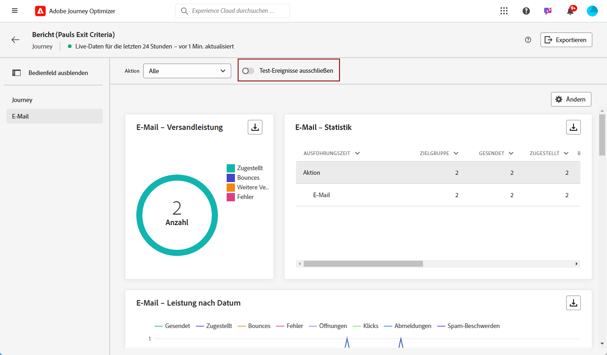

# Erste Schritte mit dem Live-Bericht {#live-report}

Verwenden Sie den **[!UICONTROL Live-Bericht]**, um die Wirkung und Leistung Ihrer Journeys und Nachrichten in Echtzeit in einem integrierten Dashboard zu messen und zu visualisieren.
Die Daten sind im Abschnitt **[!UICONTROL Live-Bericht]** unmittelbar nach dem Versand oder der Ausführung Ihrer Journey über die **[!UICONTROL Letzte 24 Stunden]** Registerkarte.

* Wenn Sie eine Journey im Kontext einer Journey ansprechen möchten, können Sie über die **[!UICONTROL Journey]** auf Ihre Journey zugreifen und auf die **[!UICONTROL Bericht anzeigen]** Schaltfläche.

   

* Wenn Sie eine Kampagne als Ziel auswählen möchten, können Sie über die **[!UICONTROL Kampagnen]** , greifen Sie auf Ihre Kampagne zu und klicken Sie auf **[!UICONTROL Berichte]** Schaltfläche.

   

* Wenn Sie von der **[!UICONTROL Gesamtbericht]** der **[!UICONTROL Live-Bericht]** Klicken Sie für Ihren Versand auf **[!UICONTROL Letzte 24 Stunden]** über den Tab-Umschalter aus.

   

Eine detaillierte Liste aller in Adobe Journey Optimizer verfügbaren Metriken finden Sie unter [diese Seite](#list-of-components-live).

## Dashboard anpassen {#modify-dashboard}

Jedes Reporting-Dashboard kann durch Ändern der Größe oder Entfernen von Widgets geändert werden. Das Ändern der Widgets wirkt sich nur auf das Dashboard des aktuellen Benutzers aus. Andere Benutzer sehen ihre eigenen Dashboards oder die standardmäßig festgelegten.

1. Sie können mit der Umschaltleiste auswählen, ob Sie Testereignisse aus Ihren Berichten ausschließen möchten. Weitere Informationen zu Testereignissen finden Sie auf [dieser Seite](../building-journeys/testing-the-journey.md).

   Beachten Sie, dass die Option **[!UICONTROL Test-Ereignisse ausschließen]** nur für Journey-Berichte verfügbar ist.

   

1. Um die Größe von Widgets zu ändern oder sie zu entfernen, klicken Sie auf **[!UICONTROL Ändern]**.

   

1. Sie können die Größe der Widgets durch Ziehen an der rechten unteren Ecke anpassen.

   

1. Klicken Sie auf **[!UICONTROL Entfernen]**, um alle Widgets zu entfernen, die Sie nicht benötigen.

   

1. Wenn Sie mit der Anzeigereihenfolge und der Größe Ihrer Widgets zufrieden sind, klicken Sie auf **[!UICONTROL Speichern]**.

Ihr Dashboard ist jetzt gespeichert. Ihre verschiedenen Änderungen werden bei einer späteren Verwendung Ihrer Live-Berichte erneut angewendet. Verwenden Sie bei Bedarf die Option **[!UICONTROL Zurücksetzen]**, um die Standard-Widgets und ihre Standardreihenfolge wiederherzustellen.

## Liste von Komponenten {#list-of-components-live}

In den Tabellen unten finden Sie nach Versandtyp geordnet die Liste der Metriken, die in Berichten verwendet werden, sowie ihre Definitionen.

### Journey-Metriken {#journey-metrics}

<table> 
 <thead> 
  <tr> 
   <th> Metrik  </th> 
   <th> Definition  </th> 
</tr>
 </thead> 
 <tbody> 
  <tr> 
   <td>Erfolgreich ausgeführte Aktionen  </td> 
   <td> Gesamtzahl der Aktionen, die für eine Journey erfolgreich ausgeführt wurden.  </td> 
</tr> 
  <tr> 
   <td> Eingegebene Profile  </td> 
   <td> Gesamtzahl der Kontakte, die das Eintrittsereignis der Journey erreicht haben.  </td> 
</tr>
  <tr> 
   <td> Fehler in Aktion  </td> 
   <td>Gesamtzahl der Fehler, die bei Aktionen aufgetreten sind.  </td> 
</tr> 
  <tr> 
   <td> Ausgehende Profile  </td> 
   <td> Gesamtzahl der Personen, die die Journey verlassen haben.  </td> 
</tr> 
  <tr> 
   <td> Fehlgeschlagene einzelne Journey  </td> 
   <td> Gesamtzahl der einzelnen Journey, die nicht erfolgreich ausgeführt wurden.  </td> 
</tr> 
 </tbody> 
</table>

### Metriken zu E-Mail und SMS             {#email-and-sms-metrics}

<table> 
 <thead> 
  <tr> 
   <th> Metrik  </th> 
   <th> Definition  </th> 
</tr>
 </thead> 
 <tbody>
  <tr> 
   <td> Bounces  </td> 
   <td> Gesamtzahl der kumulierten Fehler beim Versand und der automatischen Bounce-Verarbeitung.  </td> 
</tr> 
  <tr> 
   <td> Absprungrate  </td> 
   <td> Prozentsatz der Bounce-E-Mails in Bezug auf die gesendeten E-Mails  </td> 
</tr>
  <tr> 
   <td> Klicks  </td> 
   <td> Anzahl der Klicks auf einen Inhalt in einer E-Mail.  </td> 
</tr> 
  <tr> 
   <td> Zugestellt   </td> 
   <td> Anzahl der erfolgreich gesendeten Nachrichten. </td> 
</tr> 
  <tr> 
   <td> Zustellrate  </td> 
   <td> Prozentsatz der erfolgreich gesendeten Nachrichten  </td> 
</tr>
  <tr> 
   <td> Fehler  </td> 
   <td> Gesamtzahl der bei einem Versand aufgetretenen Fehler, die den Versand an Profile verhinderten.  </td> 
</tr> 
  <tr> 
   <td> Fehlerrate  </td> 
   <td> Prozentsatz der Fehler, die während eines Versands aufgetreten sind, der den Versand verhinderte, in Bezug auf die gesendeten E-Mails.  </td> 
</tr>
  <tr> 
   <td> Ausgeschlossen  </td> 
   <td> Anzahl der Profile, die von Adobe Journey Optimizer ausgeschlossen wurden.  </td> 
</tr>
  <tr> 
   <td> Hardbounce  </td> 
   <td> Die Gesamtzahl der permanenten Fehler, z. B. eine falsche E-Mail-Adresse. Dazu gehören Fehlermeldungen, die explizit eine ungültige Adresse anzeigen, wie etwa „Benutzer unbekannt“.  </td>
</tr>
  <tr> 
   <td> Ignoriert  </td> 
   <td> Die Gesamtzahl der temporären Ereignisse, z. B. "Out of office", oder eines technischen Fehlers, z. B. wenn der Absendertyp Postmaster ist.  </td> 
</tr>
   <tr> 
   <td>Klickrate des Angebots  </td> 
   <td>Prozentsatz der Benutzer, die mit dem Angebot interagiert haben.  </td> 
</tr>
   <tr> 
   <td>Impressionsrate des Angebots  </td> 
   <td>Prozentsatz der geöffneten Angebote in Bezug auf die Anzahl der gesendeten Angebote.  </td> 
</tr>
   <tr> 
   <td>Name des Angebots  </td> 
   <td> Name des im Versand hinzugefügten Angebots. Weiterführende Informationen zu Platzierungen finden Sie auf dieser <a href="../offers/offer-library/creating-personalized-offers.md">Seite</a>.  </td> 
</tr>
   <tr> 
   <td>gesendetes Angebot  </td> 
   <td>Gesamtzahl der gesendeten Nachrichten für das Angebot.  </td> 
</tr> 
  <tr>
   <td>Öffnungen  </td> 
   <td> Anzahl der Öffnungen der Nachricht.  </td> 
</tr> 
  <tr> 
   <td> Öffnungsrate  </td> 
   <td> Gesamtzahl der geöffneten E-Mails in Bezug auf die Anzahl der zugestellten E-Mails.  </td> 
</tr>
  <tr> 
   <td>Platzierungsname  </td> 
   <td> Name der Platzierung, die zur Anzeige Ihres Angebots verwendet wird. Weiterführende Informationen zu Platzierungen finden Sie auf dieser <a href="../offers/offer-library/creating-placements.md">Seite</a>. </td> 
</tr> 
  <tr> 
   <td> Weitere Zustellversuche  </td> 
   <td> Anzahl der E-Mails in der Warteschlange für weitere Zustellversuche.  </td> 
</tr> 
  <tr> 
   <td> Gesendet  </td> 
   <td> Gesamtzahl der gesendeten Nachrichten  </td> 
</tr>
  <tr> 
   <td> Softbounce  </td> 
   <td> Gesamtzahl der temporären Fehler, beispielsweise einer vollen Inbox  </td> 
</tr>
  <tr> 
   <td> Spam-Beschwerden  </td> 
   <td> Gibt an, wie oft eine Nachricht als Spam oder Junk gekennzeichnet wurde.  </td> 
</tr>
  <tr> 
   <td> Targeting  </td> 
   <td> Gesamtzahl der bei der Analyse verarbeiteten Nachrichten.  </td> 
</tr> 
  <tr> 
   <td> Einzelklicks  </td> 
   <td> Anzahl der Empfänger, die einen Inhalt in einer E-Mail angeklickt haben  </td> 
</tr> 
  <tr> 
   <td>Eindeutige Klickrate  </td> 
   <td> Prozentsatz der Benutzer, die mit dem Versand interagiert haben  </td> 
</tr>
  <tr> 
   <td> Einzelöffungen  </td> 
   <td>Anzahl der Empfänger, die den Versand geöffnet haben  </td> 
</tr> 
  <tr> 
   <td> Abmeldungen  </td> 
   <td> Gesamtanzahl der Klicks auf den Abmelde-Link.  </td> 
</tr> 
 </tbody> 
</table>

### Landingpage-Metriken {#landing-page-metrics}

<table> 
 <thead> 
  <tr> 
   <th> Metrik  </th> 
   <th> Definition  </th> 
</tr>
 </thead> 
 <tbody>
 <tr> 
  <td>Bounces  </td> 
   <td>Anzahl der Personen, die nicht mit der Landingpage interagiert und die Aktion zum Abonnieren nicht abgeschlossen haben.  </td> 
</tr>
 <tr> 
   <td>Absprungrate  </td> 
   <td>Anzahl der Personen, die nicht mit der Landingpage interagiert und die Aktion zum Abonnieren nicht abgeschlossen haben.  </td> 
</tr>
 <tr>
  <tr> 
   <td>Klicks  </td> 
   <td>Anzahl der Klicks auf einen Inhalt auf der Landingpage.  </td> 
</tr>
 <tr> 
   <td>Klickrate  </td> 
   <td>Prozentsatz der Klicks auf die Landingpage  </td>
</tr>
<tr>
<td>Konversion  </td> 
   <td>Anzahl der Personen, die mit der Landingpage interagiert haben, z. B. Abonnenten eines Formulars.  </td> 
</tr>
<tr>
   <td>Konversionsrate  </td> 
   <td>Anzahl der Personen, die mit der Landingpage interagiert haben, z. B. Abonnenten eines Formulars.  </td> 
</tr>
 <tr> 
   <td>Journey  </td> 
   <td>Anzahl der Besuche auf einer Landingpage von einer Journey.  </td> 
</tr>
 <tr> 
   <td>Andere Quellen  </td> 
   <td>Anzahl der Besuche auf Ihrer Landingpage von einer externen Quelle anstelle einer Journey.  </td> 
</tr>
 <tr> 
   <td>Besuche insgesamt  </td> 
   <td> Gesamtzahl der Besuche auf Ihrer Landingpage von Journey und externen Quellen, einschließlich mehrerer Besuche eines Empfängers.  </td> 
</tr>
 <tr> 
   <td>Unique Visitors  </td> 
   <td>Anzahl der Personen, die Ihre Landingpage besucht haben, wobei mehrere Besuche eines Empfängers nicht berücksichtigt werden.  </td> 
</tr>
 <tr> 
   <td>Besuche  </td> 
   <td>Anzahl der Besuche auf Ihrer Landingpage, einschließlich mehrerer Besuche eines Empfängers.  </td> 
</tr>
 </tbody> 
</table>

