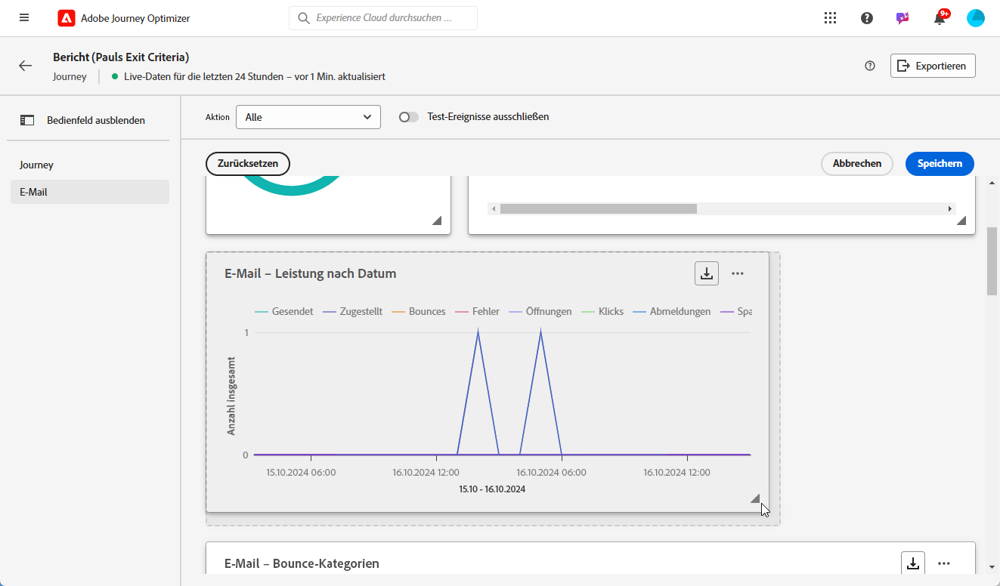

# Erste Schritte mit dem Live-Bericht {#live-report}

Verwenden Sie den **[!UICONTROL Live-Bericht]**, um die Wirkung und Leistung Ihrer Journeys und Nachrichten in Echtzeit in einem integrierten Dashboard zu messen und zu visualisieren.
Im **[!UICONTROL Live-Bericht]** sind Daten verfügbar, sobald Ihr Versand durchgeführt oder Ihre Journey ausgeführt wird.

* Wenn Sie eine Journey oder Sendungen im Kontext einer Journey auswählen möchten, können Sie über die **[!UICONTROL Journey]** auf Ihre Journey zugreifen und auf die **[!UICONTROL Bericht anzeigen]** Schaltfläche. Danach finden Sie die Live-Berichte Journey, E-Mail, SMS und Push-Benachrichtigungen.

   

* Wenn Sie von der **[!UICONTROL Live-Bericht]** der **[!UICONTROL Live-Bericht]** Klicken Sie für Ihren Versand auf **[!UICONTROL Live-Ansicht]** über den Tab-Umschalter aus.

   

## Dashboard anpassen {#modify-dashboard}

Jedes Reporting-Dashboard kann durch Ändern der Größe oder Entfernen von Widgets geändert werden. Das Ändern der Widgets wirkt sich nur auf das Dashboard des aktuellen Benutzers aus. Andere Benutzer sehen ihre eigenen Dashboards oder die standardmäßig festgelegten.

1. Sie können mit der Umschaltleiste auswählen, ob Sie Testereignisse aus Ihren Berichten ausschließen möchten. Weitere Informationen zu Testereignissen finden Sie auf [dieser Seite](../building-journeys/testing-the-journey.md).

   Beachten Sie, dass die Option **[!UICONTROL Test-Ereignisse ausschließen]** nur für Journey-Berichte verfügbar ist.

   

1. Um die Größe von Widgets zu ändern oder sie zu entfernen, klicken Sie auf **[!UICONTROL Ändern]**.

   

1. Sie können die Größe der Widgets durch Ziehen an der rechten unteren Ecke anpassen.

   

1. Klicken Sie auf **[!UICONTROL Entfernen]**, um alle Widgets zu entfernen, die Sie nicht benötigen.

   

1. Wenn Sie mit der Anzeigereihenfolge und der Größe Ihrer Widgets zufrieden sind, klicken Sie auf **[!UICONTROL Speichern]**.

Ihr Dashboard ist jetzt gespeichert. Ihre verschiedenen Änderungen werden bei einer späteren Verwendung Ihrer Live-Berichte erneut angewendet. Verwenden Sie bei Bedarf die Option **[!UICONTROL Zurücksetzen]**, um die Standard-Widgets und ihre Standardreihenfolge wiederherzustellen.
