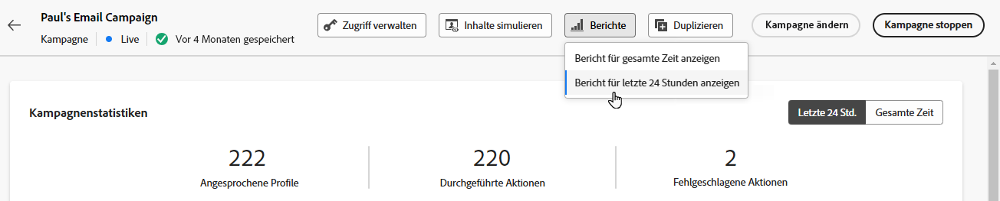
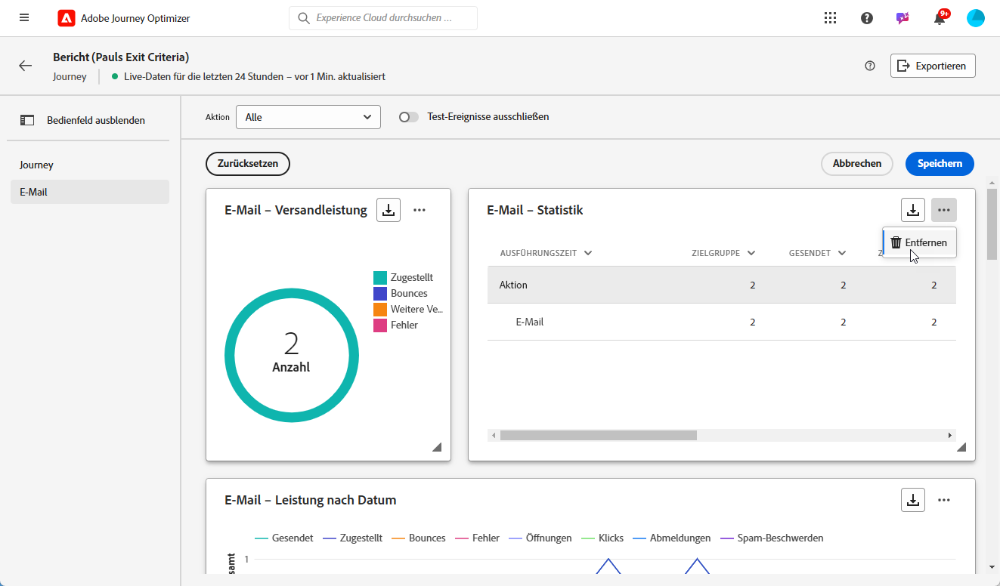

# Erste Schritte mit dem Live-Bericht {#live-report}

Verwenden Sie die **[!UICONTROL Live report]** , um die Wirkung und Leistung Ihrer Journeys und Ihrer Nachrichten in Echtzeit in einem integrierten Dashboard zu messen und zu visualisieren.
Die Daten sind im Abschnitt **[!UICONTROL Live report]** unmittelbar nach dem Versand oder der Ausführung Ihrer Journey von der **[!UICONTROL Last 24hrs]** Registerkarte.

* Wenn Sie eine Journey im Kontext einer Journey als Ziel auswählen möchten, können Sie über die **[!UICONTROL Journeys]** , greifen Sie auf Ihre Journey zu und klicken Sie auf **[!UICONTROL View report]** Schaltfläche.

   

* Wenn Sie eine Kampagne als Ziel auswählen möchten, können Sie über die **[!UICONTROL Campaigns]** , greifen Sie auf Ihre Kampagne zu und klicken Sie auf **[!UICONTROL Reports]** Schaltfläche.

   

* Wenn Sie von der **[!UICONTROL Global report]** der **[!UICONTROL Live report]** Klicken Sie für Ihren Versand auf **[!UICONTROL Last 24hrs]** über den Tab-Umschalter aus.

   

Eine detaillierte Liste aller in Adobe Journey Optimizer verfügbaren Metriken finden Sie unter [diese Seite](#list-of-components-live).

## Dashboard anpassen {#modify-dashboard}

Jedes Berichts-Dashboard kann durch Ändern der Größe oder Entfernung von Widgets geändert werden. Das Ändern der Widgets wirkt sich nur auf das Dashboard des aktuellen Benutzers aus. Andere Benutzer sehen ihre eigenen Dashboards oder die standardmäßig festgelegten Dashboards.

1. Wählen Sie mit der Umschalter-Leiste aus, ob Sie Testereignisse aus Ihren Berichten ausschließen möchten. Weitere Informationen zu Testereignissen finden Sie unter [diese Seite](../building-journeys/testing-the-journey.md).

   Beachten Sie Folgendes: **[!UICONTROL Exclude test events]** ist nur für Journey-Berichte verfügbar.

   

1. Um die Größe von Widgets zu ändern oder zu entfernen, klicken Sie auf **[!UICONTROL Modify]**.

   

1. Passen Sie die Größe der Widgets an, indem Sie die untere rechte Ecke ziehen.

   

1. Klicken **[!UICONTROL Remove]** um alle Widgets zu entfernen, die Sie nicht benötigen.

   

1. Wenn Sie mit der Anzeigereihenfolge und der Größe Ihrer Widgets zufrieden sind, klicken Sie auf **[!UICONTROL Save]**.

Ihr Dashboard wurde jetzt gespeichert. Ihre verschiedenen Änderungen werden für eine spätere Verwendung Ihrer Live-Berichte erneut angewendet. Verwenden Sie bei Bedarf die **[!UICONTROL Reset]** -Option, um die Reihenfolge der Standard-Widgets und -Widgets wiederherzustellen.

## Liste von Komponenten {#list-of-components-live}

In den Tabellen unten finden Sie die Liste der Metriken, die in Berichten verwendet werden, sowie ihre Definitionen je nach Versandtyp.

### Journey-Metriken {#journey-metrics}

<table> 
 <thead> 
  <tr> 
   <th> Metrik  </th> 
   <th> Definition  </th> 
</tr>
 </thead> 
 <tbody> 
  <tr> 
   <td>Erfolgreich ausgeführte Aktionen  </td> 
   <td> Gesamtzahl der Aktionen, die für eine Journey erfolgreich ausgeführt wurden.  </td> 
</tr> 
  <tr> 
   <td> Eingegebene Profile  </td> 
   <td> Gesamtzahl der Kontakte, die das Eintrittsereignis der Journey erreicht haben.  </td> 
</tr>
  <tr> 
   <td> Fehler in Aktion  </td> 
   <td>Gesamtzahl der Fehler, die bei Aktionen aufgetreten sind.  </td> 
</tr> 
  <tr> 
   <td> Ausgehende Profile  </td> 
   <td> Gesamtzahl der Kontakte, die die Journey verlassen haben.  </td> 
</tr> 
  <tr> 
   <td> Fehlgeschlagene individuelle Journey  </td> 
   <td> Gesamtzahl der einzelnen Journeys, die nicht erfolgreich ausgeführt wurden.  </td> 
</tr> 
 </tbody> 
</table>

### E-Mail- und SMS-Metriken {#email-and-sms-metrics}

<table> 
 <thead> 
  <tr> 
   <th> Metrik  </th> 
   <th> Definition  </th> 
</tr>
 </thead> 
 <tbody>
  <tr> 
   <td> Bounces  </td> 
   <td> Gesamtzahl der über alle Sendungen hinweg kumulierten Fehler und der automatischen Bounce-Verarbeitung.  </td> 
</tr> 
  <tr> 
   <td> Absprungrate  </td> 
   <td> Prozentsatz der Bounce-E-Mails in Bezug auf die gesendeten E-Mails  </td> 
</tr>
  <tr> 
   <td> Klicks  </td> 
   <td> Anzahl der Klicks auf einen Inhalt in einer E-Mail.  </td> 
</tr> 
  <tr> 
   <td> Zugestellt   </td> 
   <td> Anzahl der erfolgreich gesendeten Nachrichten. </td> 
</tr> 
  <tr> 
   <td> Zustellrate  </td> 
   <td> Prozentsatz der erfolgreich gesendeten Nachrichten  </td> 
</tr>
  <tr> 
   <td> Fehler  </td> 
   <td> Gesamtzahl der bei einem Versand aufgetretenen Fehler, die den Versand an Profile verhinderten.  </td> 
</tr> 
  <tr> 
   <td> Fehlerrate  </td> 
   <td> Prozentsatz der Fehler, die während eines Versands aufgetreten sind, der den Versand verhinderte, in Bezug auf die gesendeten E-Mails.  </td> 
</tr>
  <tr> 
   <td> Ausgeschlossen  </td> 
   <td> Anzahl der Profile, die von Adobe Journey Optimizer ausgeschlossen wurden.  </td> 
</tr>
  <tr> 
   <td> Hardbounce  </td> 
   <td> Die Gesamtzahl der permanenten Fehler, z. B. eine falsche E-Mail-Adresse. Dies beinhaltet eine Fehlermeldung, die explizit angibt, dass die Adresse ungültig ist, z. B. "Unbekannter Benutzer".  </td>
</tr>
  <tr> 
   <td> Ignoriert  </td> 
   <td> Die Gesamtzahl der temporären Ereignisse, z. B. "Out of office", oder eines technischen Fehlers, z. B. wenn der Absendertyp Postmaster ist.  </td> 
</tr>
   <tr> 
   <td>Klickrate des Angebots  </td> 
   <td>Prozentsatz der Benutzer, die mit dem Angebot interagiert haben.  </td> 
</tr>
   <tr> 
   <td>Impressionsrate des Angebots  </td> 
   <td>Prozentsatz der geöffneten Angebote in Bezug auf die Anzahl der gesendeten Angebote.  </td> 
</tr>
   <tr> 
   <td>Angebotsname  </td> 
   <td> Name des im Versand hinzugefügten Angebots. Weiterführende Informationen zur Platzierung finden Sie in diesem Abschnitt <a href="../offers/offer-library/creating-personalized-offers.md">page</a>.  </td> 
</tr>
   <tr> 
   <td>gesendetes Angebot  </td> 
   <td>Gesamtzahl der gesendeten Nachrichten für das Angebot.  </td> 
</tr> 
  <tr>
   <td>Öffnungen  </td> 
   <td> Anzahl der Öffnungen der Nachricht.  </td> 
</tr> 
  <tr> 
   <td> Öffnungsrate  </td> 
   <td> Gesamtzahl der geöffneten E-Mails in Bezug auf die Anzahl der zugestellten E-Mails.  </td> 
</tr>
  <tr> 
   <td>Platzierungsname  </td> 
   <td> Name der Platzierung, die zur Anzeige Ihres Angebots verwendet wird. Weiterführende Informationen zur Platzierung finden Sie in diesem Abschnitt <a href="../offers/offer-library/creating-placements.md">page</a>. </td> 
</tr> 
  <tr> 
   <td> Weitere Zustellversuche  </td> 
   <td> Anzahl der E-Mails in der Warteschlange für weitere Zustellversuche.  </td> 
</tr> 
  <tr> 
   <td> Gesendet  </td> 
   <td> Gesamtzahl der gesendeten Nachrichten  </td> 
</tr>
  <tr> 
   <td> Softbounce  </td> 
   <td> Gesamtzahl der temporären Fehler, z. B. einer vollen Inbox.  </td> 
</tr>
  <tr> 
   <td> Beschwerden wegen Spam  </td> 
   <td> Gibt an, wie oft eine Nachricht als Spam oder Junk gekennzeichnet wurde.  </td> 
</tr>
  <tr> 
   <td> Targeting  </td> 
   <td> Gesamtzahl der bei der Versandanalyse verarbeiteten Nachrichten.  </td> 
</tr> 
  <tr> 
   <td> Einzelklicks  </td> 
   <td> Anzahl der Empfänger, die einen Inhalt in einer E-Mail angeklickt haben  </td> 
</tr> 
  <tr> 
   <td>Eindeutige Klickrate  </td> 
   <td> Prozentsatz der Benutzer, die mit dem Versand interagiert haben  </td> 
</tr>
  <tr> 
   <td> Einzelöffnungen  </td> 
   <td>Anzahl der Empfänger, die den Versand geöffnet haben  </td> 
</tr> 
  <tr> 
   <td> Abmeldungen  </td> 
   <td> Anzahl der Klicks auf den Abmelde-Link.  </td> 
</tr> 
 </tbody> 
</table>

### Landingpage-Metriken {#landing-page-metrics}

<table> 
 <thead> 
  <tr> 
   <th> Metrik  </th> 
   <th> Definition  </th> 
</tr>
 </thead> 
 <tbody>
 <tr> 
  <td>Bounces  </td> 
   <td>Anzahl der Personen, die nicht mit der Landingpage interagiert und die Aktion zum Abonnieren nicht abgeschlossen haben.  </td> 
</tr>
 <tr>
  <tr> 
   <td>Klicks  </td> 
   <td>Anzahl der Klicks auf einen Inhalt auf der Landingpage.  </td> 
</tr>
<tr>
<td>Konversion  </td> 
   <td>Anzahl der Personen, die mit der Landingpage interagiert haben, z. B. Abonnenten eines Formulars.  </td> 
</tr>
 <tr> 
   <td>Journey(s)  </td> 
   <td>Anzahl der Besuche Ihrer Landingpage von einer Journey.  </td> 
</tr>
 <tr> 
   <td>Andere Quellen  </td> 
   <td>Anzahl der Besuche auf Ihrer Landingpage, die von einer externen Quelle statt von einer Journey stammen.  </td> 
</tr>
 <tr> 
   <td>Besuche insgesamt  </td> 
   <td> Gesamtzahl der Besuche Ihrer Landingpage durch Journeys und externe Quellen, einschließlich mehrerer Besuche eines Empfängers.  </td> 
</tr>
 <tr> 
   <td>Unique Visitors  </td> 
   <td>Anzahl der Personen, die Ihre Landingpage besucht haben, mehrere Besuche eines Empfängers werden nicht berücksichtigt.  </td> 
</tr>
 <tr> 
   <td>Besuche  </td> 
   <td>Anzahl der Besuche auf Ihrer Landingpage, einschließlich mehrerer Besuche eines Empfängers.  </td> 
</tr>
 </tbody> 
</table>

### Metriken zu Push-Benachrichtigungen {#push-notification-metrics}

<table> 
 <thead> 
  <tr> 
   <th> Metrik  </th> 
   <th> Definition  </th> 
</tr>
 </thead> 
 <tbody>
 <tr> 
   <td>Aktionen  </td> 
   <td> Gesamtzahl der Aktionen, die mit der gesendeten Push-Benachrichtigung durchgeführt wurden, z. B. Klick auf eine Schaltfläche oder Abweisung.  </td> 
</tr>
  <tr> 
   <td>Bounces  </td> 
   <td> Gesamtzahl der über alle Sendungen hinweg kumulierten Fehler und der automatischen Bounce-Verarbeitung.  </td> 
</tr> 
  <tr> 
   <td> Zugestellt  </td> 
   <td> Anzahl der erfolgreich gesendeten Nachrichten.  </td> 
</tr> 
  <tr> 
   <td>Interaktionen  </td> 
   <td> Gesamtzahl der Öffnungen und Aktionen für diese Push-Benachrichtigung, d. h. wenn das Profil die Push-Benachrichtigung geöffnet oder auf eine Schaltfläche geklickt hat.  </td> 
</tr> 
  <tr> 
   <td> Fehler  </td> 
   <td> Gesamtzahl der bei einem Versand aufgetretenen Fehler, die den Versand an Profile verhinderten.  </td> 
</tr>
  <tr> 
   <td> Ausgeschlossen  </td> 
   <td> Anzahl der Profile, die von Adobe Journey Optimizer ausgeschlossen wurden.  </td> 
</tr>
  <tr> 
   <td> Öffnungen  </td> 
   <td> Gesamtzahl der Push-Benachrichtigungen, die an das Gerät gesendet und von Benutzern angeklickt wurden, sodass die App geöffnet wurde. Dies ähnelt dem Push-Klick , bis auf die Tatsache, dass keine Push-Öffnung ausgelöst wird, wenn die Benachrichtigung verworfen wird.  </td> 
</tr> 
  <tr> 
   <td> Gesendet  </td> 
   <td> Gesamtzahl der gesendeten Nachrichten  </td> 
</tr> 
  <tr> 
   <td> Targeting  </td> 
   <td> Gesamtzahl der während der Versandanalyse verarbeiteten Push-Nachrichten.  </td> 
</tr>  
 </tbody> 
</table>

<!--
### In-app metrics {#inapp-metrics}
<table> 
 <thead> 
  <tr> 
   <th> Metric  </th> 
   <th> Definition  </th> 
</tr>
 </thead> 
 <tbody>
 <tr> 
   <td>Clicks  </td> 
   <td>Total number of recipients who interacted with the buttons included in the In-app message.  </td> 
</tr>
  <tr> 
   <td>Impressions  </td> 
   <td> Total number of In-app messages delivered to all users.  </td>
</tr>
  <tr> 
   <td>Unique impressions  </td> 
   <td>Number of unique users to whom the In-app message was delivered.  </td>
</tr>
 </tbody> 
</table>
-->