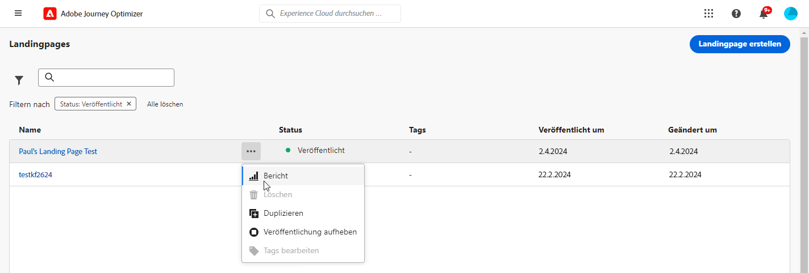
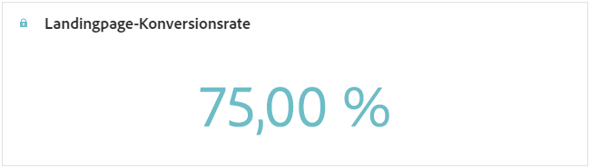
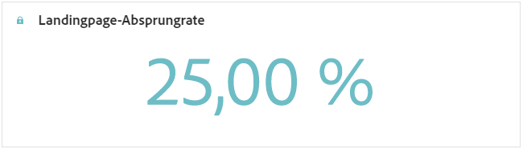
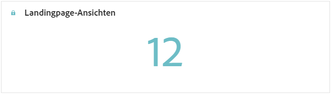
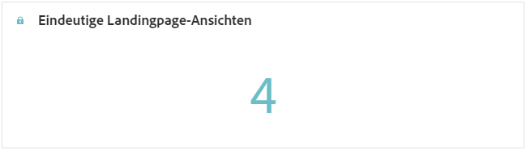
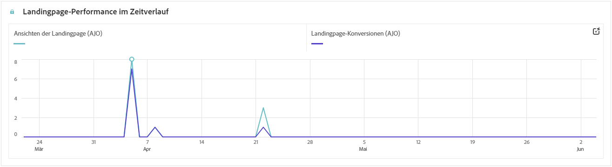
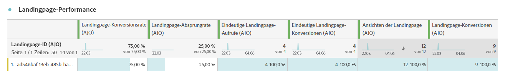

# Landingpage-Bericht {#lp-report-global-cja}

Der Bericht zu **Landingpages** bietet wertvolle Einblicke in Benutzerverhalten, Interaktionsmuster, Konversionsraten und andere Schlüsselmetriken, sodass Sie fundierte Entscheidungen treffen und die Performance Ihrer Landingpage effektiv optimieren können.

Um auf Ihre Berichte zuzugreifen, wählen Sie **[!UICONTROL Bericht]** über das erweiterte Menü der ausgewählten Landingpage aus.

Weitere Informationen zu Customer Journey Analytics Workspace und zum Filtern und Analysieren von Daten finden Sie auf [dieser Seite](https://experienceleague.adobe.com/de/docs/analytics-platform/using/cja-workspace/home).

## Konversionsrate der Landingpage {#lp-conversion}

Mit der KPI **[!UICONTROL Konversionsrate der Landingpage]** können Sie die Effektivität Ihrer Landingpage anhand der Anzahl der Besuche und Interaktionen bewerten.

* **[!UICONTROL Konversionsrate der Landingpage]**: Anzahl der Personen, die mit der Landingpage interagiert haben, z. B. Benutzende, die sich über ein Formular angemeldet haben, im Verhältnis zur Gesamtzahl der Besuche.

## Absprungrate der Landingpage {#lp-bounce-rate}

Die KPI **[!UICONTROL Absprungrate der Landingpage]** bietet Informationen zu Profilen, die sich Ihre Landingpage angesehen haben, ohne mit Elementen zu interagieren oder darauf zu klicken.

* **[!UICONTROL Absprungrate der Landingpage]**: Anzahl der Personen, die nicht mit der Landingpage interagiert haben und die Aktion zum Anmelden nicht abgeschlossen haben, im Verhältnis zur Gesamtzahl der Besuche.

## Landingpage-Ansichten {#lp-views}

Mit der KPI **[!UICONTROL Landingpage-Ansichten]** können Sie die Auswirkungen Ihrer Landingpage anzeigen.

* **[!UICONTROL Landingpage-Ansichten]**: Gesamtzahl der Besuche auf Ihrer Landingpage, die von Journeys und externen Quellen ausgehen, einschließlich mehrfacher Besuche eines Profils.

## Eindeutige Landingpage-Ansichten {#lp-unique-views}

Mit der KPI **[!UICONTROL Eindeutige Landingpage-Ansichten]** können Sie die Wirkung Ihrer Landingpage messen, indem Sie mehrfache Ansichten desselben Profils ausschließen.

* **[!UICONTROL Eindeutige Landingpage-Ansichten]**: Anzahl der Personen, die Ihre Landingpage besucht haben, wobei mehrfache Besuche eines Profils nicht gezählt werden.

## Landingpage-Performance im Zeitverlauf {#lp-performance-overtime}

Der Graph **[!UICONTROL Landingpage-Performance im Zeitverlauf]** misst den Erfolg Ihrer Landingpages und die Auswirkungen auf Ihre Zielgruppe.

* **[!UICONTROL Landingpage-Ansichten]**: Gesamtzahl der Besuche auf Ihrer Landingpage, die von Journeys und externen Quellen ausgehen, einschließlich mehrfacher Besuche eines Profils.

* **[!UICONTROL Landingpage-Konversionsrate]**: Anzahl der Personen, die mit der Landingpage interagiert haben, z. B. ein Formular ausgefüllt haben, im Verhältnis zur Gesamtzahl der Besuche.

## Landingpage-Performance {#lp-performance}

Die Tabelle **[!UICONTROL Landingpage-Performance]** dient als umfassendes Dashboard, das eine detaillierte Aufschlüsselung der Schlüsselmetriken für Ihre Landingpage bietet.

* **[!UICONTROL Landingpage-Konversionsrate]**: Anzahl der Personen, die mit der Landingpage interagiert haben, z. B. Benutzende, die sich über ein Formular angemeldet haben, im Verhältnis zur Gesamtzahl der Besuche.

* **[!UICONTROL Landingpage-Absprungrate]**: Anzahl der Personen, die nicht mit der Landingpage interagiert haben und die Aktion zum Anmelden nicht abgeschlossen haben, im Verhältnis zur Gesamtzahl der Besuche.

* **[!UICONTROL Eindeutige Landingpage-Ansichten]**: Anzahl der Personen, die Ihre Landingpage besucht haben, wobei mehrfache Besuche eines Profils nicht gezählt werden.

* **[!UICONTROL Eindeutige Landingpage-Konversionsrate]**: Anzahl der Personen, die mit der Landingpage interagiert habe, wobei mehrfache Interaktionen eines Profils nicht gezählt werden.

* **[!UICONTROL Landingpage-Ansichten]**: Gesamtzahl der Besuche auf Ihrer Landingpage, die von Journeys und externen Quellen ausgehen, einschließlich mehrfacher Besuche eines Profils.

* **[!UICONTROL Landingpage-Konversion]**: Anzahl der Personen, die mit der Landingpage interagiert haben, z. B. ein Formular für ein Abonnement ausgefüllt haben.

## Journeys {#lp-journeys}

Die Tabelle **[!UICONTROL Journey]** bietet einen umfassenden Überblick mit einer detaillierten Beschreibung der Häufigkeit der Besuche auf Ihrer Landingpage im Kontext der Journey einer Benutzerin oder eines Benutzers. Diese aufschlussreiche Darstellung bietet wertvolle Daten zu Benutzerinteraktionen, sodass Sie nachvollziehen können, wie Besuchende durch Ihre Site navigieren und mit Ihren Inhalten interagieren.

* **[!UICONTROL Landingpage-Ansichten]**: Gesamtzahl der Besuche auf Ihrer Landingpage, die von Journeys und externen Quellen ausgehen, einschließlich mehrfacher Besuche eines Profils.

* **[!UICONTROL Landingpage-Konversion]**: Anzahl der Personen, die mit der Landingpage interagiert haben, z. B. ein Formular für ein Abonnement ausgefüllt haben.

## Kampagnen {#lp-campaigns}

Die Tabelle **[!UICONTROL Kampagnen]** bietet Einblicke in die Anzahl der Besuche, die infolge spezifischer Kampagnen an Ihre Landingpage geleitet wurden. So erhalten Sie einen umfassenden Überblick über die Effektivität der Kampagne und die Interaktion mit dem Inhalt Ihrer Landingpage.

* **[!UICONTROL Landingpage-Ansichten]**: Gesamtzahl der Besuche auf Ihrer Landingpage, die von Journeys und externen Quellen ausgehen, einschließlich mehrfacher Besuche eines Profils.

* **[!UICONTROL Landingpage-Konversion]**: Anzahl der Personen, die mit der Landingpage interagiert haben, z. B. ein Formular für ein Abonnement ausgefüllt haben.

## Kanal {#lp-channels}

Die Tabelle **[!UICONTROL Kanal]** zeigt die Anzahl der Besuche auf Ihrer Landingpage kategorisiert nach Kanälen an.

* **[!UICONTROL Landingpage-Ansichten]**: Gesamtzahl der Besuche auf Ihrer Landingpage, die von Journeys und externen Quellen ausgehen, einschließlich mehrfacher Besuche eines Profils.

* **[!UICONTROL Landingpage-Konversion]**: Anzahl der Personen, die mit der Landingpage interagiert haben, z. B. ein Formular für ein Abonnement ausgefüllt haben.

## Links mit den meisten Klicks {#lp-top-clicked}

Die Tabelle **[!UICONTROL Links mit den meisten Klicks]** bietet Einblicke in die Interaktion der Besuchenden mit dem Versand und hebt hervor, welche Links von Ihrer Zielgruppe am meisten Interaktion und Aufmerksamkeit erhalten.

* **[!UICONTROL Landingpage-Klicks]**: Anzahl der Klicks auf einen Inhalt auf der Landingpage.
