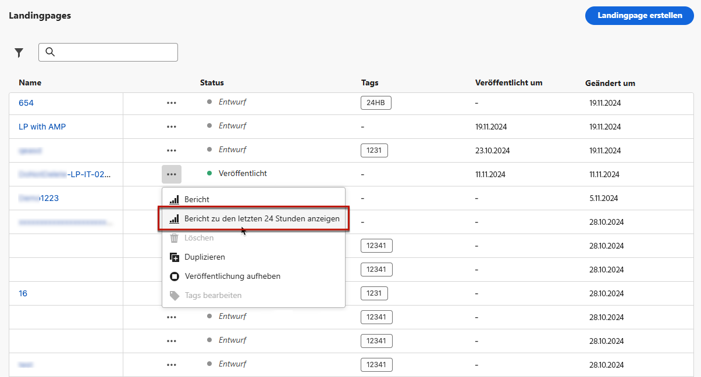
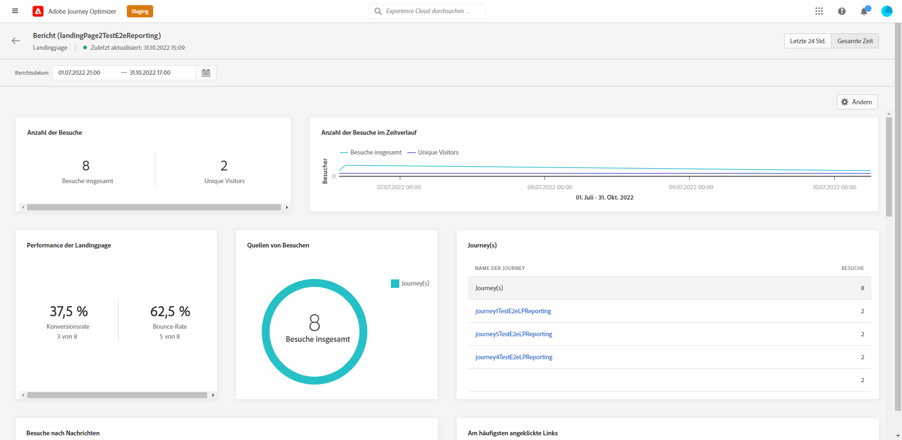

# Globaler Landingpage-Bericht {#lp-report-global}

Die Landingpage **[!UICONTROL Global report]** zeigt Details zu den Auswirkungen Ihrer Landingpages über einen ausgewählten Zeitraum an. Informationen zur Messung Ihrer Landingpage-Daten über die letzten 24 Stunden finden Sie im Abschnitt [Live-Bericht zu Landingpages](lp-report-live.md).

Um auf Ihre Berichte zuzugreifen, wählen Sie **[!UICONTROL Report]** über das erweiterte Menü Ihrer ausgewählten Landingpage.

Die Landingpage **[!UICONTROL Global report]** ist in verschiedene Widgets unterteilt, in denen der Erfolg und die Fehler Ihres Versands detailliert beschrieben werden. Jedes Widget kann bei Bedarf in der Größe angepasst und gelöscht werden. Weitere Informationen hierzu finden Sie in diesem Abschnitt [Abschnitt](global-report.md).

+++ Erfahren Sie mehr über die verschiedenen Metriken und Widgets, die für den globalen Landingpage-Bericht verfügbar sind.

Die **[!UICONTROL Number of visits]** und **[!UICONTROL Number of visits over time]** -Widgets ermöglichen es Ihnen, die Auswirkungen Ihrer Landingpage über den ausgewählten Zeitraum durch ein Diagramm und KPIs mit den folgenden Metriken zu sehen:

* **[!UICONTROL Total visits]**: Gesamtzahl der Besuche Ihrer Landingpage durch Journeys und externe Quellen, einschließlich mehrerer Besuche eines Empfängers.

* **[!UICONTROL Unique visitors]**: Anzahl der Personen, die Ihre Landingpage besucht haben, mehrere Besuche eines Empfängers werden nicht berücksichtigt.

Die **[!UICONTROL Landing page performance]** Widget erläutert die wichtigsten Informationen bezüglich Ihrer Nachricht über KPIs:

* **[!UICONTROL Conversion rate]**: Anzahl der Personen, die mit der Landingpage interagiert haben, z. B. Benutzer, die sich für ein Formular angemeldet haben, in Bezug auf die Gesamtzahl der Besuche.

* **[!UICONTROL Bounce rate]**: Anzahl der Personen, die nicht mit der Landingpage interagiert haben und die Aktion zum Anmelden nicht abgeschlossen haben, in Bezug auf die Gesamtzahl der Besuche.

Die **[!UICONTROL Visit sources]** -Widget gibt an, wie Besucher auf Ihre Landingpage zugreifen:

* **[!UICONTROL Journey(s)]**: Anzahl der Besuche Ihrer Landingpage von einer Journey.

* **[!UICONTROL Other sources]**: Anzahl der Besuche auf Ihrer Landingpage, die von einer externen Quelle statt von einer Journey stammen.

Die **[!UICONTROL Top clicked links]** identifiziert die Interaktion der Besucher mit dem Versand:

* **[!UICONTROL Clicks]**: Anzahl der Klicks auf einen Inhalt auf der Landingpage.

* **[!UICONTROL Click rate]**: Prozentsatz der Klicks auf die Landingpage

Die **[!UICONTROL Journey(s)]** -Widget stellt die Anzahl der Besuche auf Ihrer Landingpage von einer Journey dar:

* **[!UICONTROL Visits]**: Anzahl der Besuche auf Ihrer Landingpage, einschließlich mehrerer Besuche eines Empfängers.

Die **[!UICONTROL Other sources]** -Widget stellt die Anzahl der Besuche auf Ihrer Landingpage aus einer externen Quelle anstelle einer Journey dar.

Die **[!UICONTROL Visits by messages]** / **[!UICONTROL Conversions by messages]** -Diagramme stellen die Gesamtzahl der Besuche und Personen dar, die in dem betreffenden Zeitraum je nach den gesendeten Nachrichten erfolgreich mit Ihrer Landingpage interagiert haben.

Die **[!UICONTROL Visits by channels]** / **[!UICONTROL Conversions by channels]** -Diagramme stellen die Gesamtzahl der Besuche und Personen dar, die in dem betreffenden Zeitraum je nach Kanal erfolgreich mit Ihrer Landingpage interagiert haben.
+++

Eine detaillierte Liste aller in Adobe Journey Optimizer verfügbaren Metriken finden Sie unter [diese Seite](global-report.md#list-of-components-global).
