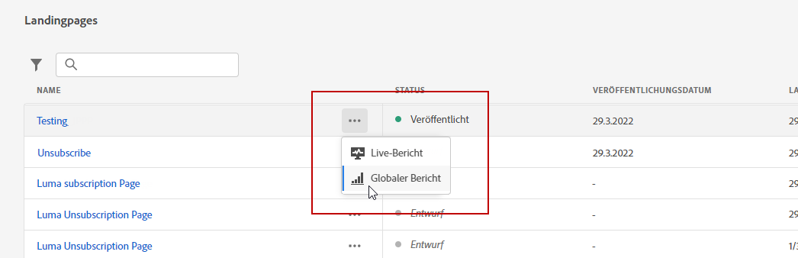
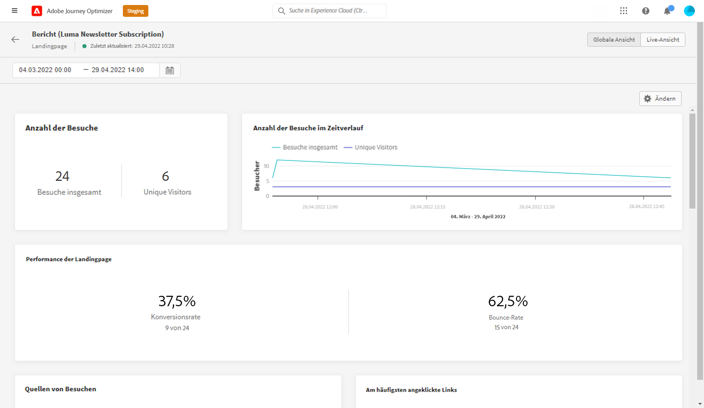
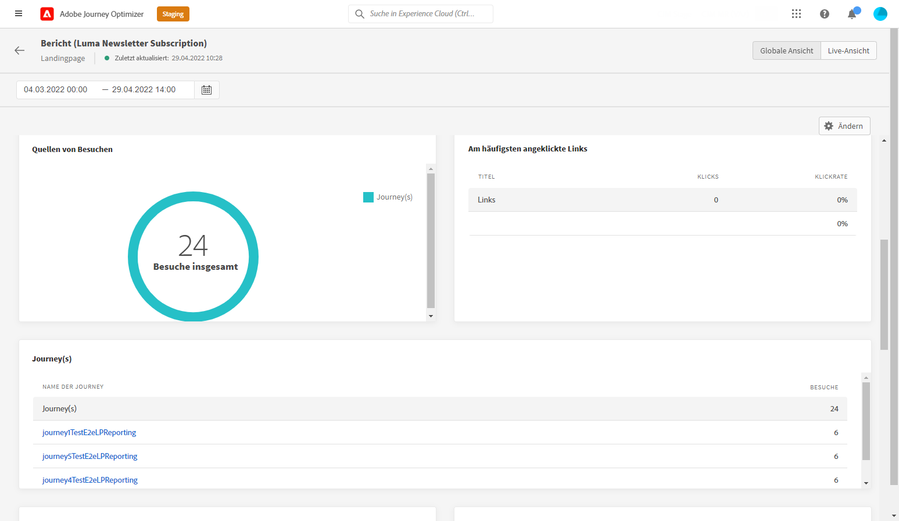
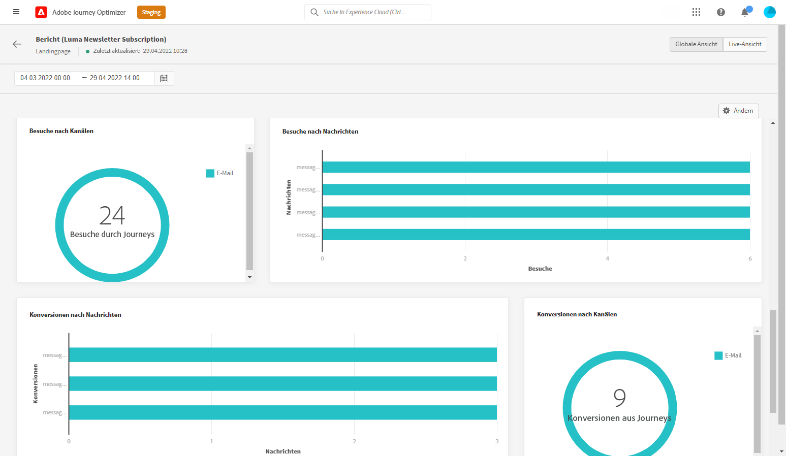

# Globaler Landingpage-Bericht {#lp-report-global}

Die Landingpage **[!UICONTROL Gesamtbericht]** zeigt Details zu den Auswirkungen Ihrer Landingpages über einen ausgewählten Zeitraum an. Informationen zur Messung Ihrer Landingpage-Daten über die letzten 24 Stunden finden Sie im Abschnitt [Live-Bericht zu Landingpages](lp-report-live.md).

Um auf Ihre Berichte zuzugreifen, wählen Sie **[!UICONTROL Gesamtbericht]** über das erweiterte Menü Ihrer ausgewählten Landingpage.

Die Landingpage **[!UICONTROL Gesamtbericht]** ist in verschiedene Widgets unterteilt, in denen der Erfolg und die Fehler Ihres Versands detailliert beschrieben werden. Jedes Widget kann bei Bedarf angepasst und gelöscht werden. Weiterführende Informationen dazu finden Sie in diesem [Abschnitt](global-report.md).

Die Widgets **[!UICONTROL Anzahl der Besuche]** und **[!UICONTROL Anzahl der Besuche im Zeitverlauf]** stellen die Wirkung Ihrer Landingpage über den ausgewählten Zeitraum mithilfe eines Diagramms und KPIs mit den folgenden Metriken dar:

* **[!UICONTROL Besuche insgesamt]**: Gesamtzahl der Besuche auf Ihrer Landingpage ausgehend von Journeys und externen Quellen, einschließlich mehrerer Besuche eines Empfängers.

* **[!UICONTROL Unique Visitors]**: Anzahl der Personen, die Ihre Landingpage besucht haben, wobei mehrere Besuche eines Empfängers nicht berücksichtigt werden.

Das Widget **[!UICONTROL Leistung der Landingpage]** stellt anhand von KPIs die wichtigsten Informationen bezüglich Ihrer Nachricht dar:

* **[!UICONTROL Konversionsrate]**: Anzahl der Personen, die mit der Landingpage interagiert haben, z. B. Benutzer, die sich über ein Formular angemeldet haben, bezogen auf die Gesamtzahl der Besuche.

* **[!UICONTROL Absprungrate]**: Anzahl der Personen, die nicht mit der Landingpage interagiert haben und die Aktion zum Anmelden nicht abgeschlossen haben, bezogen auf die Gesamtzahl der Besuche.

Das Widget **[!UICONTROL Besuchsquellen]** gibt an, wie Besucher auf Ihre Landingpage zugreifen:

* **[!UICONTROL Journey(s)]**: Anzahl der Besuche auf einer Landingpage von einer Journey.

* **[!UICONTROL Andere Quellen]**: Anzahl der Besuche auf Ihrer Landingpage ausgehend von einer externen Quelle anstelle einer Journey.

**[!UICONTROL Am häufigsten angeklickte Links]** identifiziert die Interaktion der Besucher mit dem Versand:

* **[!UICONTROL Klicks]**: Anzahl der Klicks auf einen Inhalt auf der Landingpage.

* **[!UICONTROL Klickrate]**: Prozentsatz der Klicks auf die Landingpage.

Das Widget **[!UICONTROL Journey(s)]** stellt die Anzahl der Besuche auf einer Landingpage ausgehend von einer Journey dar:

* **[!UICONTROL Besuche]**: Anzahl der Besuche auf einer Landingpage, einschließlich mehrerer Besuche eines Empfängers.

Das Widget **[!UICONTROL Andere Quellen]** stellt die Anzahl der Besuche auf einer Landingpage ausgehend von einer externen Quelle anstelle einer Journey dar.

Die Diagramme **[!UICONTROL Besuche nach Nachrichten]**/**[!UICONTROL Konversionen nach Nachrichten]** stellen die Gesamtzahl der Besuche und Personen dar, die in dem betreffenden Zeitraum je nach den gesendeten Nachrichten erfolgreich mit Ihrer Landingpage interagiert haben.

Die Diagramme **[!UICONTROL Besuche nach Kanälen]**/**[!UICONTROL Konversionen nach Kanälen]** stellen die Gesamtzahl der Besuche und Personen dar, die in dem betreffenden Zeitraum je nach Kanal erfolgreich mit Ihrer Landingpage interagiert haben.
