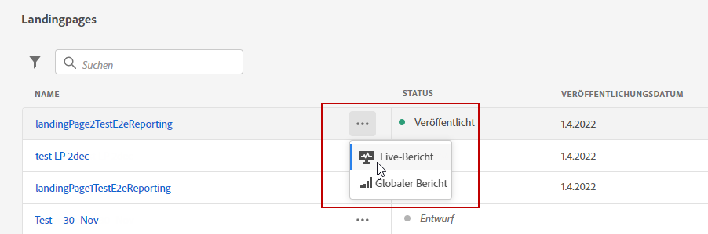
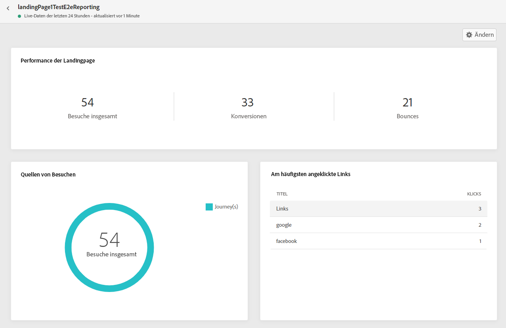
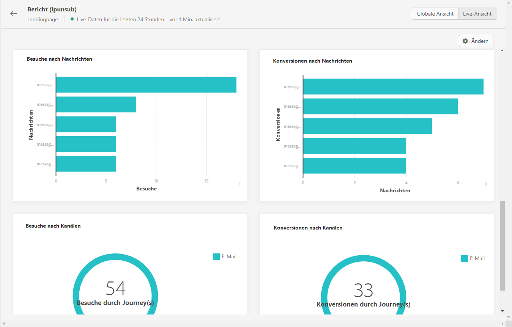

# Live-Bericht zu Landingpages {#lp-report-live}

Die Landingpage **[!UICONTROL Live-Bericht]** zeigt nur Details zu den Auswirkungen Ihrer Landingpages in den letzten 24 Stunden an. Informationen zum Messen der Landingpage-Daten über einen bestimmten Zeitraum finden Sie im Abschnitt [Globaler Landingpage-Bericht](lp-report-global.md).

Um auf Ihre Berichte zuzugreifen, wählen Sie **[!UICONTROL Live-Bericht]** über das erweiterte Menü Ihrer ausgewählten Landingpage.

Die Landingpage **[!UICONTROL Live-Bericht]** ist in verschiedene Widgets unterteilt, in denen der Erfolg und die Fehler Ihres Versands detailliert beschrieben werden. Jedes Widget kann bei Bedarf angepasst und gelöscht werden. Weiterführende Informationen dazu finden Sie in diesem [Abschnitt](live-report.md).

Das Widget **[!UICONTROL Leistung der Landingpage]** zeigt die wichtigsten Informationen in Form von KPIs an, die in den letzten 24 Stunden zu Ihrer Nachricht erfasst wurden:

* **[!UICONTROL Besuche insgesamt]**: Gesamtzahl der Besuche auf Ihrer Landingpage ausgehend von einer Journey oder anderen Quellen, einschließlich mehrerer Besuche eines Empfängers.

* **[!UICONTROL Konversionen]**: Anzahl der Personen, die mit der Landingpage interagiert haben, z. B. ein Formular für ein Abonnement ausgefüllt haben.

* **[!UICONTROL Bounces]**: Anzahl der Personen, die nicht mit der Landingpage interagiert und die Aktion zum Abonnieren nicht abgeschlossen haben.

Das Widget **[!UICONTROL Besuchsquellen]** gibt an, wie Besucher auf Ihre Landingpage zugreifen:

* **[!UICONTROL Journey(s)]**: Anzahl der Besuche auf einer Landingpage von einer Journey.

* **[!UICONTROL Andere Quellen]**: Anzahl der Besuche auf einer Landingpage von einer externen Quelle anstelle einer Journey.

**[!UICONTROL Am häufigsten angeklickte Links]** beschreibt die Interaktion der Besucher mit der Landingpage:

* **[!UICONTROL Klicks]**: Anzahl der Klicks auf einen Inhalt auf der Landingpage.

Das Widget **[!UICONTROL Journey(s)]** stellt die Anzahl der Besuche auf Ihrer Landingpage ausgehend von einer Journey dar.

Das Widget **[!UICONTROL Andere Quellen]** stellt die Anzahl der Besuche auf einer Landingpage ausgehend von einer externen Quelle anstelle einer Journey dar.

Die Diagramme **[!UICONTROL Besuche nach Nachrichten]** / **[!UICONTROL Konversionen nach Nachrichten]** geben die Gesamtzahl der Besuche und Personen an, die in den letzten 24 Stunden je nach den gesendeten Nachrichten erfolgreich mit Ihrer Landingpage interagiert haben.

Die Diagramme **[!UICONTROL Besuche nach Kanälen]** / **[!UICONTROL Konversionen nach Kanälen]** geben die Gesamtzahl der Besuche und Personen an, die in den letzten 24 Stunden je nach Kanal erfolgreich mit Ihrer Landingpage interagiert haben.
