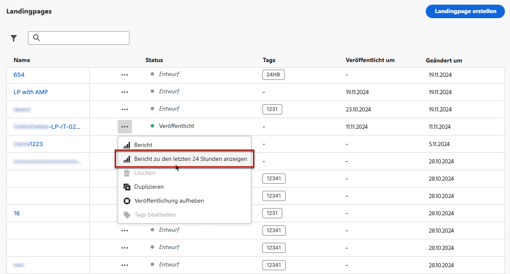

# Live-Bericht zu Landingpages {#lp-report-live}

>[!CONTEXTUALHELP]
>id="ajo_landing_page_live_report"
>title="Live-Bericht zu Landingpages"
>abstract="Mit dem Live-Bericht zu Landingpages kann die Wirkung und Performance einer Landingpage nur in den letzten 24 Stunden in Echtzeit gemessen und visualisiert werden. Der Bericht ist in verschiedene Widgets unterteilt, die den Erfolg und die Fehler der Landingpage detailliert darstellen. Jedes Reporting-Dashboard kann durch Ändern der Größe oder Entfernen von Widgets verändert werden."

Live-Berichte, auf die über die Registerkarte „Letzte 24 Std.“ zugegriffen werden kann, zeigen Ereignisse an, die innerhalb der letzten 24 Stunden stattgefunden haben. Der Zeitraum ab dem Auftreten des Ereignisses beträgt dabei mindestens zwei Minuten. Im Vergleich dazu konzentrieren sich Berichte in Customer Journey Analytics auf Ereignisse, die vor mindestens zwei Stunden aufgetreten sind, und decken Ereignisse über einen ausgewählten Zeitraum ab.

Um auf Ihre Berichte zuzugreifen, wählen Sie **[!UICONTROL Bericht für letzte 24 Stunden anzeigen]** über das erweiterte Menü der ausgewählten Landingpage aus.

Der **[!UICONTROL Live-Bericht]** zu Landingpages ist in verschiedene Widgets unterteilt, die den Erfolg und die Fehler Ihres Versands detailliert beschreiben. Jedes Widget kann bei Bedarf angepasst und gelöscht werden. Weiterführende Informationen dazu finden Sie in diesem [Abschnitt](live-report.md).

+++Erfahren Sie mehr über die verschiedenen Metriken und Widgets, die für den Live-Bericht zur Landingpage verfügbar sind.

Das Widget **[!UICONTROL Performance der Landingpage]** zeigt die wichtigsten Informationen in Form von KPIs an, die in den letzten 24 Stunden zu Ihrer Nachricht erfasst wurden:

* **[!UICONTROL Besuche insgesamt]**: Gesamtzahl der Besuche auf Ihrer Landingpage ausgehend von einer Journey oder anderen Quellen, einschließlich mehrerer Besuche eines Empfängers.

* **[!UICONTROL Konversionen]**: Anzahl der Personen, die mit der Landingpage interagiert haben, z. B. ein Formular für ein Abonnement ausgefüllt haben.

* **[!UICONTROL Bounces]**: Anzahl der Personen, die nicht mit der Landingpage interagiert und die Aktion zum Abonnieren nicht abgeschlossen haben.

Das Widget **[!UICONTROL Besuchsquellen]** gibt an, wie Besucher auf Ihre Landingpage zugreifen:

* **[!UICONTROL Journey(s)]**: Anzahl der Besuche auf einer Landingpage von einer Journey.

* **[!UICONTROL Andere Quellen]**: Anzahl der Besuche auf einer Landingpage von einer externen Quelle anstelle einer Journey.

**[!UICONTROL Am häufigsten angeklickte Links]** beschreibt die Interaktion der Besucher mit der Landingpage:

* **[!UICONTROL Klicks]**: Anzahl der Klicks auf einen Inhalt auf der Landingpage.

Das Widget **[!UICONTROL Journey(s)]** stellt die Anzahl der Besuche auf Ihrer Landingpage ausgehend von einer Journey dar.

Das Widget **[!UICONTROL Andere Quellen]** stellt die Anzahl der Besuche auf einer Landingpage ausgehend von einer externen Quelle anstelle einer Journey dar.

Die Diagramme **[!UICONTROL Besuche nach Nachrichten]** / **[!UICONTROL Konversionen nach Nachrichten]** geben die Gesamtzahl der Besuche und Personen an, die in den letzten 24 Stunden je nach den gesendeten Nachrichten erfolgreich mit Ihrer Landingpage interagiert haben.

Die Diagramme **[!UICONTROL Besuche nach Kanälen]** / **[!UICONTROL Konversionen nach Kanälen]** geben die Gesamtzahl der Besuche und Personen an, die in den letzten 24 Stunden je nach Kanal erfolgreich mit Ihrer Landingpage interagiert haben.
+++

Eine detaillierte Liste aller in Adobe Journey Optimizer verfügbaren Metriken finden Sie auf [dieser Seite](live-report.md#live-report).
