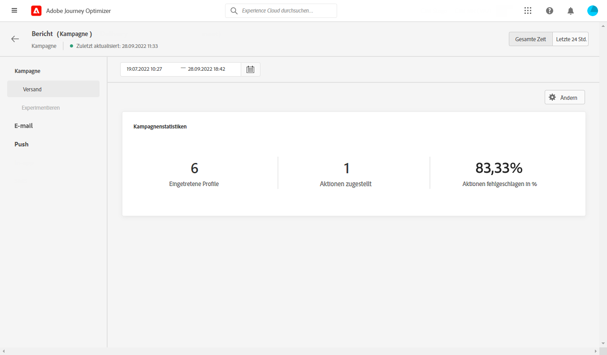
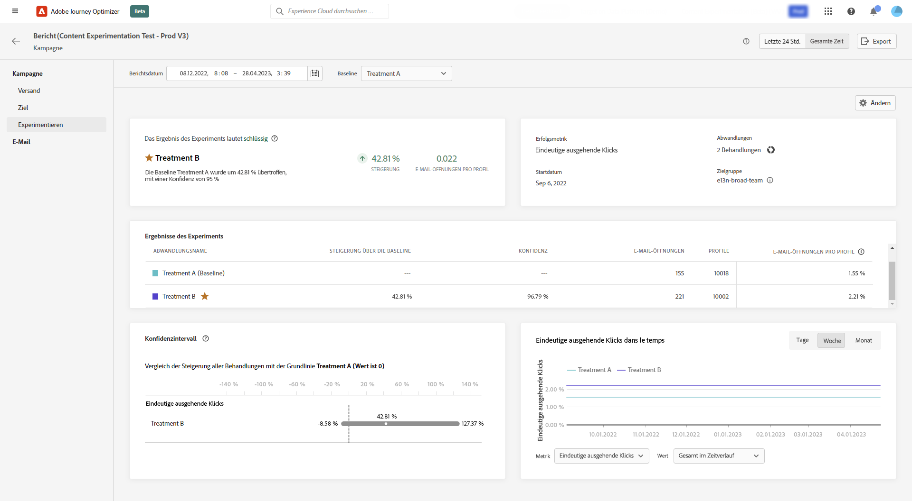

# Globaler Bericht zu Kampagnen {#objective-report}

Über die Schaltfläche **[!UICONTROL Bericht anzeigen]** ist der direkte Zugriff in einer Campaign-Instanz auf den globalen Bericht in Campaign möglich.

Der **[!UICONTROL Globale Bericht]** in Campaign ist in verschiedene Widgets unterteilt, die Erfolge und Fehler bei Ihrer Kampagne detailliert beschreiben. Jedes Widget kann bei Bedarf angepasst und gelöscht werden. Weitere Informationen dazu finden Sie unter <!--[section](../reports/global-report.md#modify-dashboard)-->.

Eine detaillierte Liste aller in Adobe Journey Optimizer verfügbaren Metriken finden Sie unter <!--[this page](global-report.md#list-of-components-global.md)-->.

## Registerkarte „Kampagne“ {#campaign-global-objectives}

### Versand {#delivery-global-objectives}

<!--

-->

Das Widget **[!UICONTROL Kampagnenstatistiken]** enthält die wichtigsten Informationen zu Ihrer Kampagne:

* **[!UICONTROL Eingetretene Profile]**: Anzahl der Profile, die mit der Journey begonnen haben.

* **[!UICONTROL Bereitgestellte Aktionen]**: Gesamtzahl der eindeutigen Fälle, in denen eine Aktion in der Journey ausgeführt wurde.

* **[!UICONTROL Fehlgeschlagene Aktionen in %]**: Gesamtzahl der eindeutigen Fälle, in denen eine Aktion in der Journey fehlgeschlagen ist, verglichen mit der Gesamtzahl der eindeutigen Fälle, in denen eine Aktion erfolgreich ausgeführt wurde.

### Zielsetzungsbericht {#objective-global}

>[!AVAILABILITY]
>
>Die Funktion für **Zielsetzungsberichte** ist derzeit nur für ausgewählte Organisationen verfügbar (eingeschränkte Verfügbarkeit). Weitere Informationen erhalten Sie beim Adobe-Support.

Auf der Registerkarte **[!UICONTROL Ziele]** können Sie die Berichte Ihrer Sendungen besser anpassen, indem Sie auf eine bestimmte Kennzahl abzielen.

Die aufgeführten **[!UICONTROL Ziele]** sind mit **[!UICONTROL Datensätzen]** verbunden, die eine Verbindung zu einem System definieren, um zusätzliche Informationen abzurufen. Eine Liste mit integrierten **[!UICONTROL Zielen]** ist verfügbar, Sie können jedoch Ihre eigenen hinzufügen, indem Sie einen neuen **[!UICONTROL Datensatz]** hinzufügen. Weiterführende Informationen finden Sie in diesem [Abschnitt](../reports/reporting-configuration.md).

Nach Auswahl der Ziele, die Sie in Angriff nehmen möchten, bieten die beiden Widgets für **[!UICONTROL Performance-Übersicht]** und **[!UICONTROL Kampagnenziel]** eine detaillierte Zusammenfassung Ihrer Versand-Performance.

Mit dem Widget **[!UICONTROL Kampagnenziel]** können Sie auch Ihr Hauptziel mit einer anderen Metrik vergleichen.

### Experimentationsbericht {#experimentation-global-objectives}

<!--

-->

Die Registerkarte **[!UICONTROL Experimentieren]** bietet wichtige Einblicke in die Performance der einzelnen Varianten und ermittelt die erfolgreichste Variante.

Beachten Sie, dass es ein wenig dauern kann, um die beste Leistung zu ermitteln. Sie wird durch das Symbol  gekennzeichnet.

+++Erfahren Sie mehr über die verschiedenen Metriken und Widgets, die für den Experimentbericht verfügbar sind.

Die Widget **[!UICONTROL Experimentergebnis]** liefert Details zur Performance der einzelnen Varianten. Sie können Ihre Baseline ändern, indem Sie eine der Abwandlungen aus der Dropdown-Liste **[!UICONTROL Baseline]** auswählen. Die beste Abwandlung wird mit einem Sternsymbol gekennzeichnet.

Die Tabelle enthält die folgenden Metriken:

* **[!UICONTROL Steigerung über die Baseline]**: Messung der prozentualen Verbesserung der Konversionsrate einer bestimmten Abwandlung im Vergleich zur Baseline.

* **[!UICONTROL Konfidenz]**: Belege dafür, dass eine bestimmte Abwandlung mit der Baseline-Abwandlung identisch ist. [Weitere Informationen](../content-management/experiment-calculations.md#adobes-statistical-methodology-any-time-valid-confidence-sequences)

* **[!UICONTROL Ausgehende Einzelklicks]**: Gesamtanzahl der Klicks in allen ausgehenden Kanälen.

* **[!UICONTROL Profile]**: Anzahl der für diese Abwandlung ausgewählten Profile.

* **[!UICONTROL Eindeutige ausgehende Klicks/Profile]**: Gesamtwert der Erfolgskennzahl, die zuvor beim Erstellen der Experimente ausgewählt wurde, dividiert durch die Anzahl der Profile.

Der Graph **[!UICONTROL Konfidenzintervall]** misst die Unsicherheit im Zusammenhang mit Verbesserungen. Er beschreibt den prozentualen Performance-Unterschied zwischen der Baseline und der Abwandlung mit der besten Performance. [Weitere Informationen](../content-management/experiment-calculations.md#adobes-statistical-methodology-any-time-valid-confidence-sequences).
+++

Einen tiefen Einblick in diese Ergebnisse und ihre Interpretation finden Sie auf [dieser Seite](../content-management/get-started-experiment.md#interpret-results).
