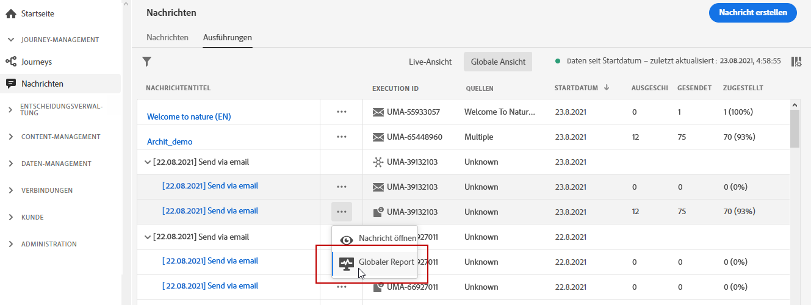
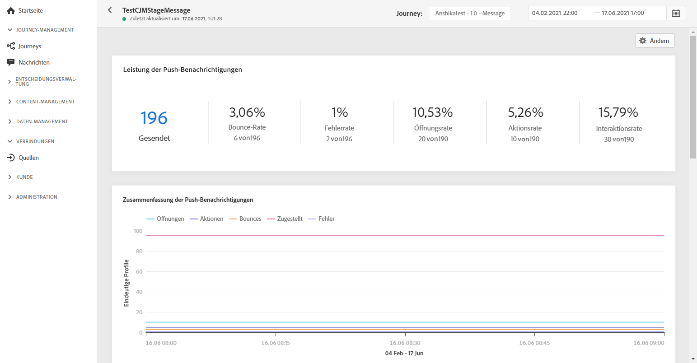
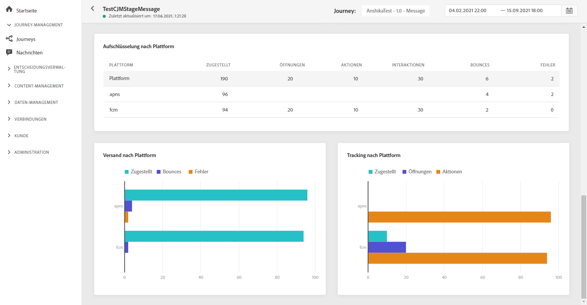

# Globaler Bericht zu Push-Benachrichtigungen {#push-global-report}

Der **[!UICONTROL globale Bericht]** zu Push-Benachrichtigungen zielt nur auf einen bestimmten Versand einer Push-Benachrichtigung ab.

Wählen Sie auf der Registerkarte **[!UICONTROL Ausführungen]** des Menüs **[!UICONTROL Nachrichten]** die Option **[!UICONTROL Globale Ansicht]** und wählen Sie dann im erweiterten Menü des ausgewählten Versands **[!UICONTROL Globaler Bericht]**.

Der **[!UICONTROL globale Bericht]** zu Push-Benachrichtigungen ist in verschiedene Widgets unterteilt, die den Erfolg und die Fehler Ihres Versands detailliert beschreiben. Jedes Widget kann bei Bedarf angepasst und gelöscht werden. Weiterführende Informationen dazu finden Sie in diesem [Abschnitt](global-report.md#modify-dashboard).

Das Widget **[!UICONTROL Leistung von Push-Benachrichtigungen]** enthält die wichtigsten Informationen zu Ihren Push-Benachrichtigungen mit den folgenden KPIs:

* **[!UICONTROL Gesendet]**: Gesamtzahl der gesendeten Nachrichten.

* **[!UICONTROL Bounce-Rate]**: Prozentsatz der Push-Benachrichtigungen, die unzustellbar waren, im Vergleich zu den gesendeten Push-Benachrichtigungen.

* **[!UICONTROL Fehlerrate]**: Prozentualer Anteil der Fehler, die während eines Versands aufgetreten sind und den Versand verhindert haben, im Vergleich zu den gesendeten Push-Benachrichtigungen.

* **[!UICONTROL Aktionsrate]**: Prozentsatz der in der Push-Benachrichtigung ausgeführten Aktionen, z. B. Button-Klick oder Abbruch.

* **[!UICONTROL Interaktionsrate]**: Prozentsatz der Öffnungen und Aktionen für diese Push-Benachrichtigung, d. h. wenn das Profil die Push-Benachrichtigung geöffnet hat oder auf eine Schaltfläche geklickt wurde.

Das Diagramm **[!UICONTROL Zusammenfassung der Push-Benachrichtigung]** enthält die Daten, die für gesendete Push-Benachrichtigungen verfügbar sind, z. B.:

* **[!UICONTROL Öffnungen]**: Anzahl der Öffnungen einer Nachricht in einem Versand.

* **[!UICONTROL Aktionen]**: Gesamtzahl der Aktionen, die bei der gesendeten Push-Benachrichtigung durchgeführt wurden, d. h. Klick auf Schaltfläche oder Abbruch.

* **[!UICONTROL Bounces]**: Gesamtzahl der kumulierten Fehler bei Versand und automatischer Bounce-Verarbeitung in Relation zur Gesamtzahl der gesendeten Nachrichten.

* **[!UICONTROL Zugestellt]**: Zahl der erfolgreich gesendeten Nachrichten im Vergleich zur Gesamtzahl der gesendeten Nachrichten.

* **[!UICONTROL Fehler]**: Gesamtanzahl der Fehler, die während des Versands aufgetreten sind und die Zustellung an Profile verhinderten.

In der Grafik **[!UICONTROL Fehlergründe]** und der Tabelle unten können Sie sehen, welcher Fehler während des Versands aufgetreten ist.

Die Diagramme und Tabellen **[!UICONTROL Tracking nach Plattform]**, **[!UICONTROL Senden nach Plattform]** und **[!UICONTROL Aufschlüsselung nach Plattform]** geben einen Überblick über den Erfolg Ihrer Push-Benachrichtigung, je nach Betriebssystem Ihres Empfängers.
