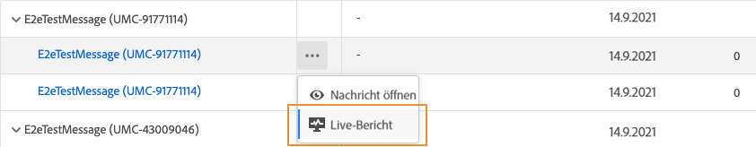
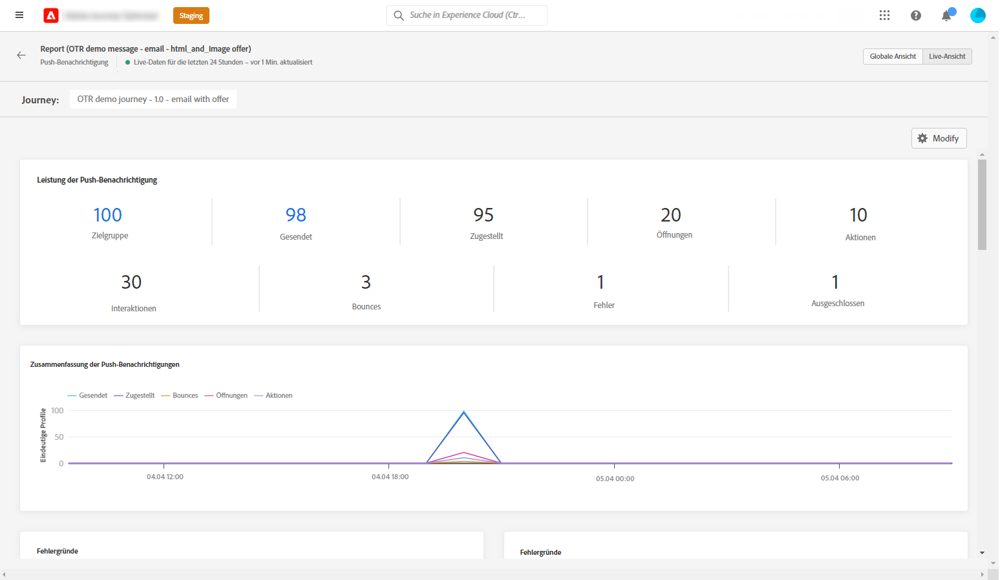
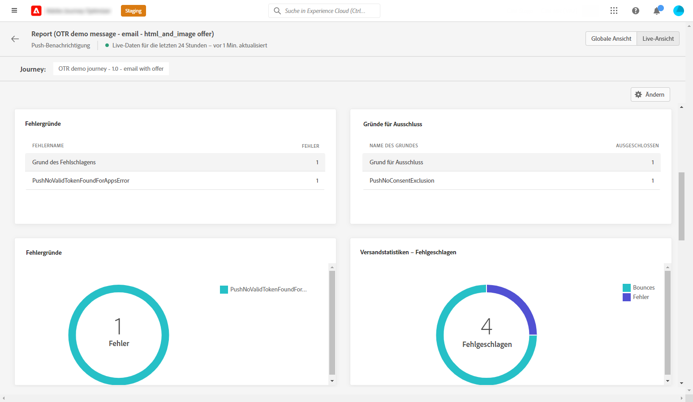
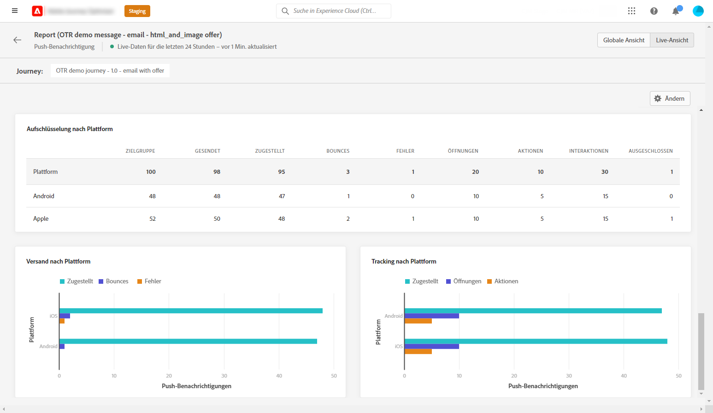

# Live-Bericht zu Push-Benachrichtigungen  {#push-live-report}

Der **[!UICONTROL Live-Bericht]** zu Push-Benachrichtigungen bezieht sich auf einen bestimmten Versand von Push-Benachrichtigungen.

Wählen Sie auf der Registerkarte **[!UICONTROL Ausführungen]** des Menüs **[!UICONTROL Nachrichten]** die Option **[!UICONTROL Live-Ansicht]** und wählen Sie dann im erweiterten Menü des ausgewählten Versands **[!UICONTROL Live-Bericht]**.

Der **[!UICONTROL Live-Bericht]** zu Push-Benachrichtigungen ist in verschiedene Widgets unterteilt, die den Erfolg und die Fehler Ihres Versands detailliert beschreiben. Jedes Widget kann bei Bedarf angepasst und gelöscht werden. Weiterführende Informationen dazu finden Sie in diesem [Abschnitt](live-report.md#modify-dashboard).

Die Widgets **[!UICONTROL Performance der Push-Benachrichtigung]** und **[!UICONTROL Zusammenfassung der Push-Benachrichtigung]** enthalten die wichtigsten Informationen zu Ihrer Nachricht mit Diagramm und KPIs:

* **[!UICONTROL Gesendet]**: Gesamtzahl der gesendeten Nachrichten.

* **[!UICONTROL Zugestellt]**: Zahl der erfolgreich gesendeten Nachrichten im Vergleich zur Gesamtzahl der gesendeten Nachrichten.

* **[!UICONTROL Bounces]**: Gesamtzahl der kumulierten Fehler bei Versand und automatischer Bounce-Verarbeitung in Relation zur Gesamtzahl der gesendeten Nachrichten.

* **[!UICONTROL Fehler]**: Gesamtanzahl der Fehler, die während des Versands aufgetreten sind und die Zustellung an Profile verhinderten.

* **[!UICONTROL Öffnungen]**: Anzahl der Öffnungen einer Nachricht in einem Versand.

* **[!UICONTROL Aktionen]**: Gesamtzahl der Aktionen, die bei der gesendeten Push-Benachrichtigung durchgeführt wurden, d. h. Klick auf Schaltfläche oder Abbruch.

* **[!UICONTROL Interaktionen]**: Gesamtzahl der Öffnungen und Aktionen für diese Push-Benachrichtigung, d. h. wenn das Profil die Push-Benachrichtigung geöffnet hat oder wenn auf eine Schaltfläche geklickt wurde.

Die Tabelle **[!UICONTROL Versandmetriken – nach Push-Benachrichtigung]** zeigt den Erfolg Ihres Versands:

* **[!UICONTROL Ausgewählt]**: Anzahl der Benutzerprofile, die sich als Zielgruppenprofile für diesen Versand eignen.

* **[!UICONTROL Ausgeschlossen]**: Anzahl der Benutzerprofile, die von den Zielgruppenprofilen ausgeschlossen waren und die die Nachricht nicht erhalten haben.

* **[!UICONTROL Gesendet]**: Gesamtzahl der gesendeten Nachrichten.

* **[!UICONTROL Zugestellt]**: Zahl der erfolgreich gesendeten Nachrichten im Vergleich zur Gesamtzahl der gesendeten Nachrichten.

* **[!UICONTROL Bounces]**: Gesamtzahl der kumulierten Fehler bei Versand und automatischer Bounce-Verarbeitung in Relation zur Gesamtzahl der gesendeten Nachrichten.

* **[!UICONTROL Fehler]**: Gesamtanzahl der Fehler, die während des Versands aufgetreten sind und die Zustellung an Profile verhinderten.

* **[!UICONTROL Öffnungen]**: Anzahl der Öffnungen einer Nachricht in einem Versand.

Die **[!UICONTROL Fehlerursachen]** und **[!UICONTROL Ausschlussgründe]** Mit Diagrammen und Tabellen können Sie sehen, welcher Fehler und welche Ausschlüsse während des Versands aufgetreten sind.

Die **[!UICONTROL Versandstatistiken - Fehlgeschlagen]** -Widget können Sie sehen, wie viele Fehler und Bounces aufgetreten sind.

Die Diagramme und Tabellen **[!UICONTROL Tracking nach Plattform]**, **[!UICONTROL Senden nach Plattform]** und **[!UICONTROL Aufschlüsselung nach Plattform]** geben einen Überblick über den Erfolg Ihrer Push-Benachrichtigung, je nach Betriebssystem.

