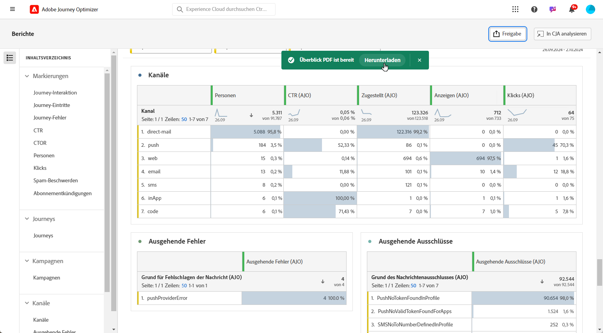

# Verwalten Ihrer Berichte {#channel-cja-manage}

## Durchführen von Analysen in Customer Journey Analytics {#analyze}

Verbessern Sie Ihr Datenanalyseerlebnis mit Ihrer **[!DNL Customer Journey Analytics]**-Lizenz durch Nutzung der Funktion **[!UICONTROL In CJA analysieren]**, die in allen Berichten verfügbar ist.

Diese leistungsstarke Option leitet Sie nahtlos zu Ihrer **[!DNL Customer Journey Analytics]**-Umgebung weiter, sodass Sie Ihre Berichte umfassend personalisieren können. Sie können Ihre Widgets mit spezialisierten Customer Journey Analytics-Metriken anreichern, die Ihre Erkenntnisse auf eine völlig neue Ebene bringen.

[Weitere Informationen zur Customer Journey Analytics-Oberfläche](https://experienceleague.adobe.com/de/docs/analytics-platform/using/cja-overview/cja-getting-started)

## Definieren des Berichtszeitraums {#report-period}

Beim Zugriff auf einen Bericht können Sie einen Zeitraumfilter anwenden, der sich oben rechts im Bericht befindet.

Standardmäßig wird für den Filterzeitraum einer Kampagne oder Journey das Anfangs- und Enddatum herangezogen. Wenn kein Enddatum vorhanden ist, verwendet der Filter standardmäßig das aktuelle Datum.

Um den Filter zu ändern, können Sie ein benutzerdefiniertes Anfangsdatum und eine benutzerdefinierte Dauer auswählen oder aus vordefinierten Optionen wie „Letzte Woche“ oder „Vor zwei Monaten“ wählen.

Der Bericht wird automatisch aktualisiert, sobald ein Filter angewendet oder geändert wird.

## Exportieren Ihrer Berichte {#export-reports}

Sie können Ihre Berichte einfach in PDF- oder CSV-Format exportieren, sodass Sie sie freigeben oder drucken können. Die Schritte zum Exportieren von Berichten werden in den folgenden Registerkarten beschrieben.

>[!BEGINTABS]

>[!TAB Exportieren Ihres Berichts als CSV-Datei]

1. Klicken Sie in Ihrem Bericht auf **[!UICONTROL Exportieren]** und wählen Sie **[!UICONTROL CSV-Datei]** aus, um eine CSV-Datei auf der allgemeinen Berichtsebene zu generieren.

   

1. Die Datei wird automatisch heruntergeladen und ist in Ihren lokalen Dateien zu finden.

   Wenn die Datei auf Berichtsebene generiert wurde, enthält sie detaillierte Informationen für jedes Widget, einschließlich Titel und Daten.

>[!TAB Exportieren Ihres Berichts als PDF-Datei]

1. Klicken Sie in Ihrem Bericht auf **[!UICONTROL Exportieren]** und wählen Sie **[!UICONTROL PDF-Datei]** aus.

   

1. Nachdem der Download angefordert wurde, klicken Sie auf **[!UICONTROL Herunterladen]**.

   

1. Ihre Datei wird automatisch in Ihrem Browser geöffnet.

Ihr Bericht kann jetzt in einer PDF-Datei angezeigt, heruntergeladen oder freigegeben werden.

>[!ENDTABS]
