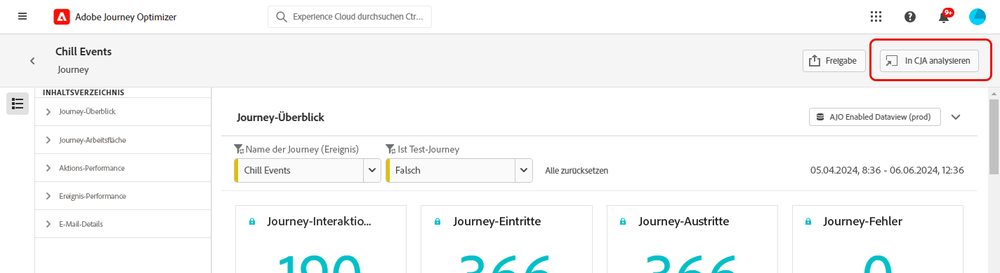
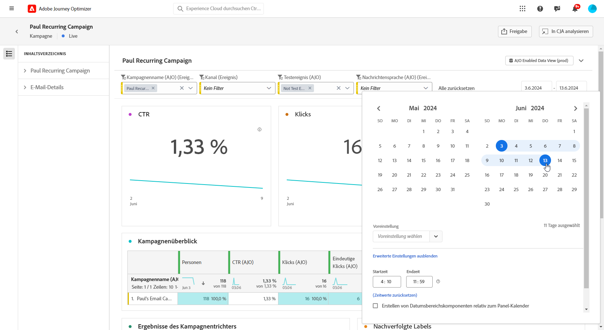
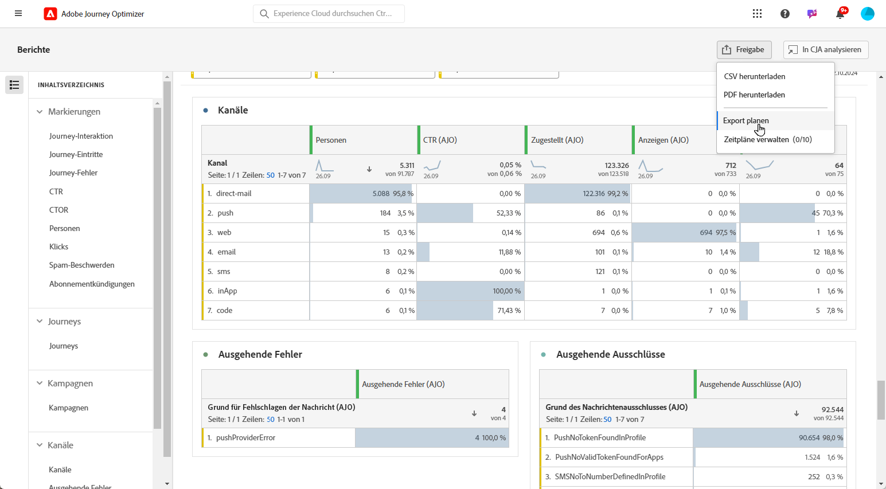
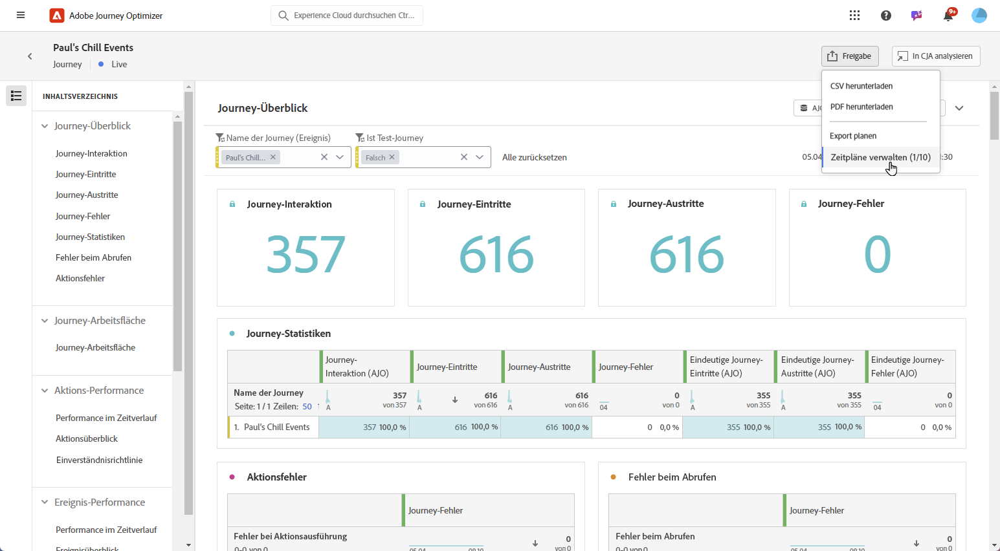
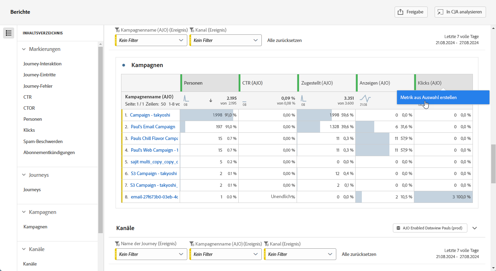
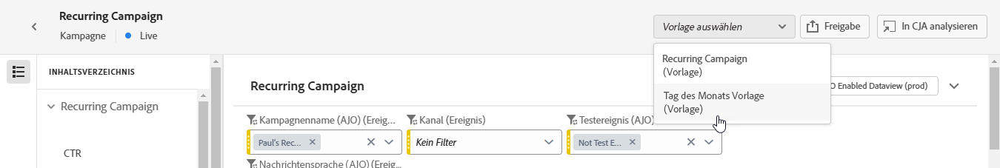
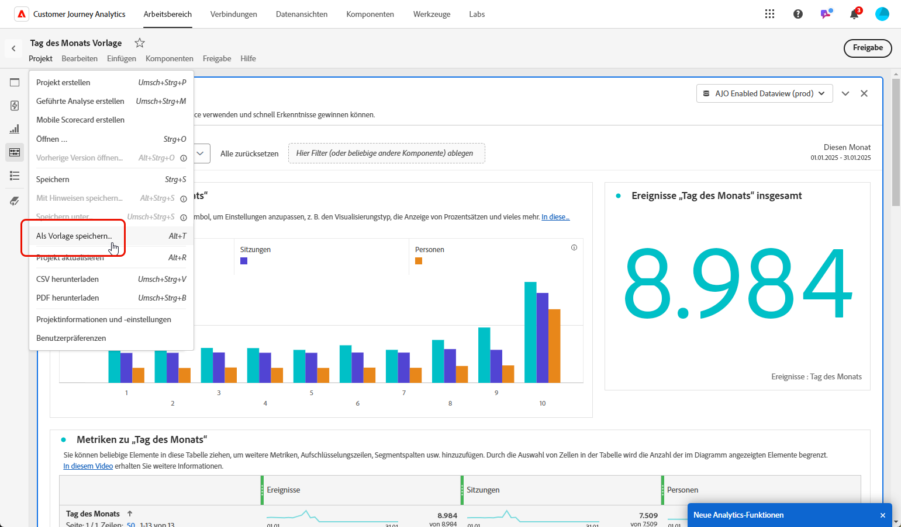
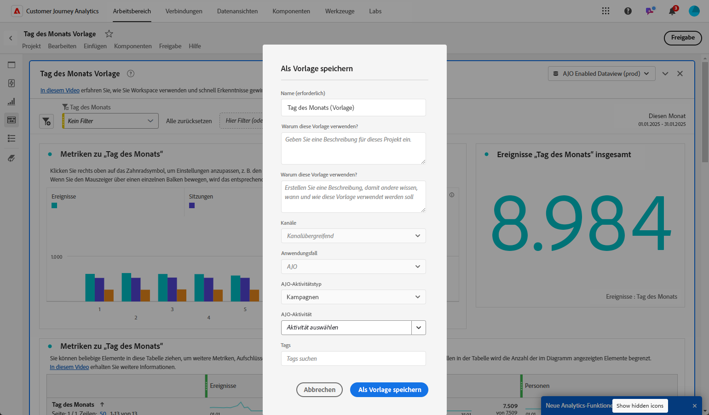
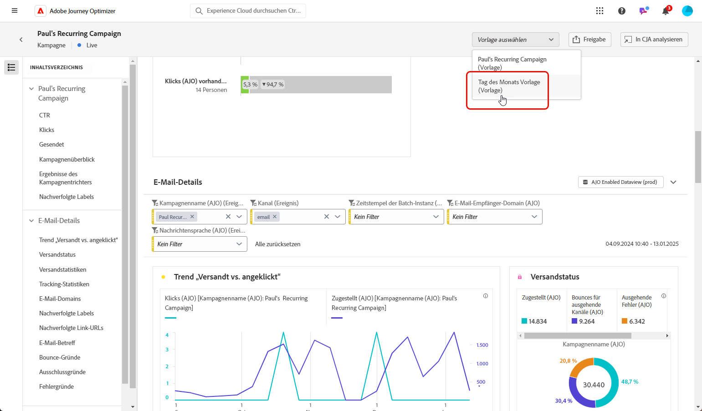

# Verwalten Ihrer Berichte {#channel-cja-manage}

## Durchführen von Analysen in Customer Journey Analytics {#analyze}

>[!AVAILABILITY]
>
> Die Funktion **In CJA analysieren** steht nur Benutzenden mit einer [!DNL Customer Journey Analytics]-Lizenz zur Verfügung.

Verbessern Sie Ihr Datenanalyseerlebnis mit Ihrer **[!DNL Customer Journey Analytics]**-Lizenz durch Nutzung der Funktion **[!UICONTROL In CJA analysieren]**, die in allen Berichten verfügbar ist.

Diese leistungsstarke Option leitet Sie nahtlos zu Ihrer **[!DNL Customer Journey Analytics]**-Umgebung weiter, sodass Sie Ihre Berichte umfassend personalisieren können. Sie können Ihre Widgets mit spezialisierten Customer Journey Analytics-Metriken anreichern, die Ihre Erkenntnisse auf eine völlig neue Ebene bringen.

[Erfahren Sie mehr über die Oberfläche von Customer Journey Analytics.](https://experienceleague.adobe.com/de/docs/analytics-platform/using/cja-overview/cja-getting-started)

## Definieren des Berichtszeitraums {#report-period}

Beim Zugriff auf einen Bericht können Sie einen Zeitraumfilter anwenden, der sich oben rechts im Bericht befindet.

Standardmäßig wird für den Filterzeitraum einer Kampagne oder Journey das Anfangs- und Enddatum herangezogen. Wenn kein Enddatum vorhanden ist, verwendet der Filter standardmäßig das aktuelle Datum.

Um den Filter zu ändern, können Sie ein benutzerdefiniertes Startdatum und eine benutzerdefinierte Dauer auswählen oder aus vordefinierten Optionen wie „Letzte Woche“ oder „Vor zwei Monaten“ wählen.

Der Bericht wird automatisch aktualisiert, sobald ein Filter angewendet oder geändert wird.

## Exportieren Ihrer Berichte {#export-reports}

Sie können Ihre Berichte einfach in PDF- oder CSV-Format exportieren, sodass Sie sie freigeben oder drucken können. Die Schritte zum Exportieren von Berichten werden in den folgenden Registerkarten beschrieben.

>[!BEGINTABS]

>[!TAB Exportieren Ihres Berichts als CSV-Datei]

1. Klicken Sie in Ihrem Bericht auf **[!UICONTROL Freigeben]** und wählen Sie **[!UICONTROL CSV herunterladen]** aus, um eine CSV-Datei auf der Ebene des gesamten Berichts zu generieren.

   

1. Die Datei wird automatisch heruntergeladen und ist in Ihren lokalen Dateien zu finden.

   Wenn die Datei auf Berichtsebene generiert wurde, enthält sie detaillierte Informationen für jedes Widget, einschließlich Titel und Daten.

>[!TAB Exportieren Ihres Berichts als PDF-Datei]

1. Klicken Sie in Ihrem Bericht auf **[!UICONTROL Freigeben]** und wählen Sie **[!UICONTROL PDF herunterladen]** aus.

   

1. Nachdem der Download angefordert wurde, klicken Sie auf **[!UICONTROL Herunterladen]**.

   

1. Ihre Datei wird automatisch in Ihrem Browser geöffnet.

Ihr Bericht kann jetzt in einer PDF-Datei angezeigt, heruntergeladen oder freigegeben werden.

>[!ENDTABS]

## Planen von Exporten {#schedule-export}

Mit der Option **Export planen** können Sie den Versand von bis zu 10 Berichten in wöchentlichen, monatlichen oder jährlichen Intervallen automatisieren. Sie können Ihre geplanten Berichte auch ganz einfach verwalten. Hierzu stehen Ihnen Optionen zum Aktualisieren, Bearbeiten, Abbrechen oder Löschen Ihrer geplanten Exporte zur Verfügung.

1. Klicken Sie in Ihrem Bericht auf **[!UICONTROL Freigeben]** und wählen Sie **[!UICONTROL Export planen]** aus.

   

1. Wählen Sie Ihren **[!UICONTROL Dateityp]** aus: CSV oder PDF.

1. Bei Bedarf können Sie Ihrem Export eine **[!UICONTROL Beschreibung]** hinzufügen.

1. Geben Sie den Namen der Empfangenden an, die diesen automatisierten Versand erhalten.

   

1. Wählen Sie die **[!UICONTROL Häufigkeit]** aus.

1. Geben Sie je nach ausgewählter Häufigkeit die entsprechenden Planungsdetails an, z. B.:

   * Start- und Enddatum

   * Intervall (z. B. alle paar Wochen)

   * Bestimmter Wochentag

   * Woche innerhalb des Monats

   * Tag innerhalb des Monats

   * Monat des Jahres

1. Klicken Sie auf **[!UICONTROL Plangemäß senden]**.

1. Um den zuvor erstellten geplanten Export zu bearbeiten, klicken Sie auf **[!UICONTROL Freigeben]** und wählen Sie **[!UICONTROL Zeitpläne verwalten]** aus.

   

1. Wählen Sie aus der Liste der geplanten Exporte den Export aus, den Sie aktualisieren möchten, und nehmen Sie die erforderlichen Änderungen vor.

1. Um einen geplanten Bericht zu löschen, wählen Sie einen Bericht aus der Liste der verwalteten Zeitpläne aus und klicken Sie auf **[!UICONTROL Löschen]**.

   

## Erstellen einer einfachen Metrik {#create-simple-metric}

Sie können benutzerdefiniert berechnete Metriken direkt in Ihren Berichten erstellen. Sie können zielgerichtetere Einblicke generieren und Ihre Daten besser analysieren, indem Sie zwei vorhandene Metriken so kombinieren, dass sie Ihren jeweiligen Berichtsanforderungen entsprechen.

1. Greifen Sie zunächst auf den Bericht zu, dem Sie eine neue Metrik hinzufügen möchten.

1. Wählen Sie in der Tabelle in Ihrem Bericht die gewünschten Metriken aus, indem Sie die Tasten `Shift` oder `CTRL/CMD` gedrückt halten, während Sie auf die Metriken klicken. Klicken Sie dann mit der rechten Maustaste und wählen Sie **[!UICONTROL Metrik aus Auswahl erstellen]** aus.

   Wenn Sie mehr als zwei Metriken auswählen, werden nur die ersten beiden im Generator für Metriken verwendet.

   

1. Geben Sie im Generator für berechnete Metriken im Feld **[!UICONTROL Titel]** einen Namen für die neue Metrik ein. Sie können auch eine **[!UICONTROL Beschreibung]** hinzufügen.

   >[!NOTE]
   >
   >Wenn Sie Customer Journey Analytics besitzen, können Sie Ihre Metriken mit zusätzlichen Optionen weiter personalisieren. [Weitere Informationen](https://experienceleague.adobe.com/de/docs/analytics-platform/using/cja-components/cja-calcmetrics/cm-workflow/cm-build-metrics#areas-of-the-calculated-metrics-builder)

1. Wählen Sie die entsprechenden **[!UICONTROL Dezimalstellen]** und je nachdem, wie Ihre Metrik angezeigt werden soll, ein **[!UICONTROL Format]** (Dezimal, Zeit, Prozent oder Währung) aus.

1. Wählen Sie den Operator aus, der bestimmt, wie die Metrik berechnet wird, z. B. Addition, Subtraktion, Multiplikation oder Division.

   

1. Sie können die Komponenten bei Bedarf neu anordnen.

1. Wenn Sie mit Ihren Einstellungen zufrieden sind, klicken Sie auf **[!UICONTROL Anwenden]**, um die neue Metrik fertigzustellen.

1. Ihre neue Metrik wird neben den ursprünglichen Metriken in Ihrem Bericht angezeigt.

   

Ihre neu erstellte Metrik wird beim Export des Berichts als PDF oder CSV-Datei einbezogen. Sie wird jedoch aus dem Bericht entfernt, sobald Sie ihn schließen.

## Erkunden von Daten mit dem Insight Builder {#exploratory}

Verwenden Sie das Tool Insight Builder, um mühelos Tabellen und Visualisierungen aus Ihren ausgewählten **[!UICONTROL Dimensionen]** und **[!UICONTROL Metriken]** zu erstellen. Dieses Tool optimiert die Datenforschung und ermöglicht die automatische Anpassung und Analyse von Informationen. Weitere Informationen finden Sie in [dieser Dokumentation](https://experienceleague.adobe.com/de/docs/analytics/analyze/analysis-workspace/panels/quickinsight).

1. Greifen Sie zunächst auf den Bericht zu, in dem Sie Insight Builder verwenden möchten.

1. Wählen Sie im Menü in der linken Leiste das Menü „Insight Builder“ aus.

   

1. Erstellen Sie eine Abfrage, indem Sie mithilfe der Dropdown-Menüs eine **[!UICONTROL Dimension]** und eine **[!UICONTROL Metrik]** auswählen. Sie können bei Bedarf auch ein **[!UICONTROL Segment]** auswählen.

   

1. Definieren Sie den Datumsbereich für Ihre Analyse, um den Zeitraum anzugeben, auf den Sie sich konzentrieren möchten. Der Datumsbereich wird standardmäßig auf den Bereich eingestellt, der im Panel „Bericht“ verwendet wird.

1. Verwenden Sie die Optionen **[!UICONTROL Aufschlüsselung hinzufügen]** oder **[!UICONTROL Metrik hinzufügen]**, um zusätzliche Dimensionen einzubeziehen, sodass eine detailliertere Datenaufschlüsselung möglich ist.

   Beachten Sie, dass Sie nur bis zu drei **[!UICONTROL Dimensionen]**, **[!UICONTROL Metriken]** und **[!UICONTROL Segmente]** hinzufügen können.

Sie können Ihre Daten jetzt mit Ihren benutzerdefinierten Tabellen- und Visualisierungs-Tools analysieren.

<!--## Create a down-funnel metric {#down-funnel}

1. Create a new journey or open an existing one. [Learn more about journey creation](../building-journeys/journey-gs.md)

1. On the canvas editor, select the option to "add a metric".

c. In the metric selector, choose whichever conversion metric seems appropriate and publish your journey

d. Open the report for the journey that you added the metric to and ensure that the metric has been added to the table alongside all the other pre-configured metrics.
-->

## Erstellen einer Zielgruppe aus Berichtsdaten {#create-audience}

>[!IMPORTANT]
>
>Jede Organisation ist auf die Veröffentlichung von 25 Zielgruppen beschränkt. Benutzende können außerdem maximal 5 Zielgruppen pro Stunde und 20 pro Tag veröffentlichen.
> Einmalige Zielgruppen haben eine Lebensdauer von 48 Stunden. Wenn also innerhalb dieses Zeitraums 25 Zielgruppen veröffentlicht werden, können weitere Zielgruppen erst nach Ablauf der 48-Stunden-Frist veröffentlicht werden.

Sie können jetzt bestimmte Daten in der Tabelle auswählen und aus diesen Auswahlen direkt eine Zielgruppe erstellen, um den Erstellungsprozess für Zielgruppen zu optimieren und zu vereinfachen.

1. Navigieren Sie zunächst zur Berichtstabelle, die die Daten enthält, die Sie in eine Zielgruppe umwandeln möchten.

1. Klicken Sie mit der rechten Maustaste auf die gewünschte Zelle und wählen Sie **[!UICONTROL Zielgruppe erstellen]** aus.

   Alternativ können Sie die Erstellung einer Zielgruppe über das Widget **[!UICONTROL Journey-Arbeitsfläche]** starten, indem Sie einen Knoten auswählen und mit der rechten Maustaste darauf klicken.

1. Geben Sie im Fenster **[!UICONTROL Zielgruppe erstellen]** einen **[!UICONTROL Namen]** ein und legen Sie einen **[!UICONTROL einmaligen Datumsbereich]** für die Zielgruppe fest, die Sie veröffentlichen möchten.

   >[!NOTE]
   >
   >Wenn Sie Customer Journey Analytics besitzen, können Sie Ihre Metriken mit zusätzlichen Optionen weiter personalisieren. [Weitere Informationen](https://experienceleague.adobe.com/de/docs/analytics-platform/using/cja-components/audiences/publish)

   

1. Klicken Sie auf die Schaltfläche **[!UICONTROL Erstellen]**, um die Erstellung der Zielgruppe fertigzustellen. Beachten Sie, dass dieser Vorgang möglicherweise einige Zeit in Anspruch nehmen kann.

Sie können jetzt die neu erstellte Zielgruppe mit einer Journey oder Kampagne verwenden.

## Verwalten von Vorlagen {#cja-template}

Sie haben jetzt die Möglichkeit, Ihre Journey Optimizer-Berichte mithilfe von Customer Journey Analytics-Vorlagen zu erweitern. [Weitere Informationen zu Vorlagen in Customer Journey Analytics](https://experienceleague.adobe.com/de/docs/analytics-platform/using/cja-workspace/templates/use-templates#use-reports)

Beim Zugriff auf Ihre Berichte können Sie im Dropdown-Menü **[!UICONTROL Vorlage auswählen]** zwischen zwei Vorlagentypen wählen:

* der von Adobe bereitgestellten Standardvorlage
* kundengenerierten Vorlagen

Wenn keine Vorlage erstellt wurde, wird das Dropdown-Menü **[!UICONTROL Vorlage auswählen]** nicht in Ihrer Reporting-Oberfläche angezeigt.

Gehen Sie wie folgt vor, um eine Vorlage zu erstellen:

1. Navigieren Sie in [!DNL Customer Journey Analytics] zum Menü **[!UICONTROL Arbeitsbereich]** und wählen Sie **[!UICONTROL Adobe-Vorlagen]** aus. [Weitere Informationen über verfügbare Vorlagen](https://experienceleague.adobe.com/de/docs/analytics-platform/using/cja-workspace/templates/use-templates#available-templates)

1. Durchsuchen Sie die verfügbaren vorkonfigurierten Vorlagen und klicken Sie auf **[!UICONTROL Vorlage verwenden]**, um eine auszuwählen.

   

1. Passen Sie Ihren Bericht an Ihre Anforderungen an. Weitere Informationen finden Sie in der [Customer Journey Analytics-Dokumentation](https://experienceleague.adobe.com/de/docs/analytics-platform/using/cja-workspace/home).

1. Öffnen Sie nach Fertigstellung Ihrer benutzerdefinierten Vorlage das Menü **[!UICONTROL Projekt]** und wählen Sie **[!UICONTROL Als Vorlage speichern]** aus.

   

1. Geben Sie die erforderlichen Details für Ihre Vorlage an. Ausführliche Informationen finden Sie in der [Customer Journey Analytics-Dokumentation](https://experienceleague.adobe.com/de/docs/analytics-platform/using/cja-workspace/templates/create-templates#edit-or-delete-a-template).

   >[!IMPORTANT]
   >
   > Wählen Sie unter **[!UICONTROL Anwendungsfälle]** die Option **Journey Optimizer** aus und geben Sie den entsprechenden **Journey Optimizer-Aktivitätstyp** und die **Aktivität** an. Dadurch kann Ihr Bericht in Journey Optimizer angezeigt werden.

   

1. Greifen Sie in [!DNL Journey Optimizer] über Ihren Bericht auf Ihren Bericht zu und wählen Sie Ihre zuvor erstellte Vorlage aus dem Dropdown-Menü **[!UICONTROL Vorlage auswählen]** aus.

   

Um eine Vorlage direkt aus Ihrem Journey Optimizer-Bericht zu erstellen, greifen Sie einfach auf Ihren Kampagnen- oder Journey-Bericht zu, wählen Sie **[!UICONTROL In CJA analysieren]** aus und passen Sie die Standardvorlage an, indem Sie die oben beschriebenen Schritte ausführen.
