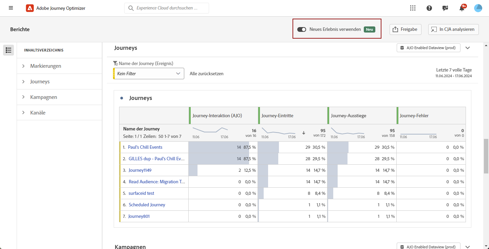

# Erste Schritte mit der neuen Reporting-Oberfläche {#channel-report-gs-cja}

>[!NOTE]
>
> Um zum herkömmlichen Reporting von Journey Optimizer zurückzukehren, schalten Sie einfach die Option **[!UICONTROL Neues Erlebnis verwenden]** wieder aus.

Journey Optimizer Reporting verfügt über eine verbesserte Kompatibilität mit Customer Journey Analytics-Funktionen, wodurch die Berichterstellung plattformübergreifend standardisiert und die Datenkonsistenz und -zuverlässigkeit verbessert wird. Diese nahtlose Integration zwischen Journey Optimizer und Customer Journey Analytics bietet einen klareren Überblick über Leistungsmetriken und ermöglicht es Benutzenden, besser fundierte Entscheidungen zu treffen.

* Wenn Sie eine Journey oder Sendungen innerhalb einer Journey auswählen möchten, greifen Sie im Menü **[!UICONTROL Journeys]** auf Ihre Journey zu und klicken Sie auf die Schaltfläche **[!UICONTROL Bericht anzeigen]**.

  In der Liste der vorhandenen Journeys können Sie auch **[!UICONTROL Bericht]** über das erweiterte Menü Ihrer ausgewählten Journey auswählen. [Weitere Informationen zum Journey-Bericht](journey-global-report-cja.md)

  

* Wenn Sie eine Kampagne als Ziel wählen möchten, wählen Sie im Menü **[!UICONTROL Kampagnen]** Ihre Kampagne aus und klicken auf die Schaltfläche **[!UICONTROL Berichte]**.

  In der Liste der vorhandenen Kampagnen können Sie auch **[!UICONTROL Bericht]** über das erweiterte Menü Ihrer ausgewählten Kampagne auswählen. [Weitere Informationen zum Kampagnen-Bericht](campaign-global-report-cja.md)

  

* Wenn Sie Metriken für alle Kampagnen und Journeys in Ihrer Umgebung als Ziel auswählen möchten, navigieren Sie im Abschnitt **[!UICONTROL Journey-Management]** zum Menü **[!UICONTROL Berichte]** und greifen Sie auf den **Übersichtsbericht** zu. [Weitere Informationen zum Übersichtsbericht](channel-report-cja.md)

  

## Voraussetzungen {#prerequisites}

* Wenn Sie **nicht** im Besitz von Customer Journey Analytics sind oder wenn Sie es besitzen, aber **keinen** Zugriff auf Customer Journey Analytics-Produktprofile haben, werden die Berechtigungen in Journey Optimizer verwaltet. In diesem Fall benötigen Sie nur die Berechtigungen für das **[!UICONTROL Anzeigen von Kanalberichten]** oder verwandte Rollen. [Weitere Informationen zu den Berechtigungen in Journey Optimizer](../administration/permissions.md)
* Wenn Sie im Besitz von Customer Journey Analytics sind und Zugriff auf ein Customer Journey Analytics-Produktprofil haben, gelten die standardmäßigen Berechtigungen von Customer Journey Analytics.  Die Customer Journey Analytics-Admins sind für die Aufrechterhaltung des ordnungsgemäßen Benutzerzugriffs verantwortlich. [Weitere Informationen zu Berechtigungen in Customer Journey Analytics](https://experienceleague.adobe.com/de/docs/analytics-platform/using/technotes/access-control)
* Ihre Customer Journey Analytics-Datenansichten müssen mit der folgenden Einstellung konfiguriert werden: **Als Standarddatenansicht in Adobe Journey Optimizer festlegen**. [Weitere Informationen zur Datenansichten](https://experienceleague.adobe.com/de/docs/analytics-platform/using/cja-dataviews/create-dataview)
* Um auf das Customer Journey Analytics-Dashboard in Journey Optimizer zuzugreifen, aktivieren Sie einfach den Umschalter **[!UICONTROL Neues Erlebnis verwenden]** in Ihrem Bericht.

  

## Anleitungsvideo{#video}

Das folgende Video zeigt Ihnen, wie Sie das erweiterte Reporting in Journey Optimizer mit Customer Journey Analytics verwenden.

>[!VIDEO](https://video.tv.adobe.com/v/3430413)