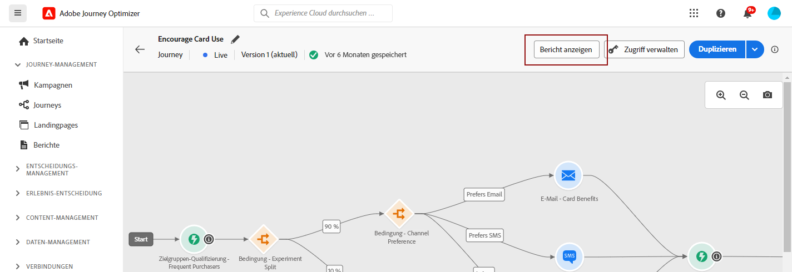
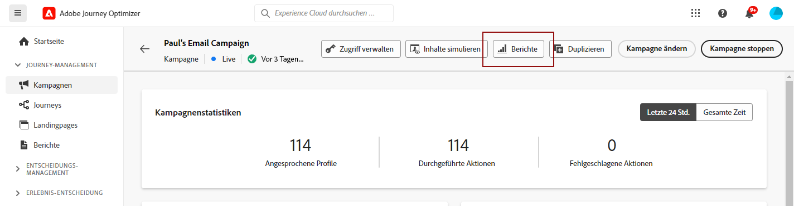
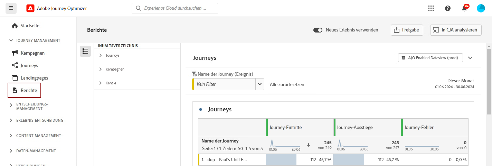

# Erste Schritte mit dem Bericht für die gesamte Zeit {#channel-report-gs-cja}

>[!CONTEXTUALHELP]
>id="cja_connections_enable_cja"
>title="Aktivieren von Customer Journey Analytics"
>abstract="Um diesen Bericht in Customer Journey Analytics zu analysieren, wenden Sie sich an Ihre oder Ihren Admin, um sicherzustellen, dass Ihre Organisation Customer Journey Analytics erworben hat und die Integration ordnungsgemäß konfiguriert ist."
>additional-url="https://experienceleague.adobe.com/de/docs/journey-optimizer/using/channels/email/design-email/add-content/content-components#add-content-components" text="Customer Journey Analytics"

Journey Optimizer Reporting verfügt über eine verbesserte Kompatibilität mit Customer Journey Analytics-Funktionen, wodurch die Berichterstellung plattformübergreifend standardisiert und die Datenkonsistenz und -zuverlässigkeit verbessert wird. Diese nahtlose Integration zwischen Journey Optimizer und Customer Journey Analytics bietet einen klareren Überblick über Leistungsmetriken und ermöglicht es Benutzenden, fundiertere Entscheidungen zu treffen.

Der Zugriff auf diese Reporting-Funktionen hängt vom Kontext und den Produktbereichen ab:

* **Journeys**: Wenn Sie eine Journey oder Sendungen innerhalb einer Journey auswählen möchten, greifen Sie im Menü **[!UICONTROL Journeys]** auf Ihre Journey zu und klicken Sie auf die Schaltfläche **[!UICONTROL Bericht anzeigen]**.

  In der Liste der vorhandenen Journeys können Sie auch **[!UICONTROL Bericht]** über das erweiterte Menü Ihrer ausgewählten Journey auswählen. [Weitere Informationen zum Journey-Bericht](journey-global-report-cja.md)

  

* **Kampagnen**: Wenn Sie eine Kampagne als Ziel wählen möchten, wählen Sie im Menü **[!UICONTROL Kampagnen]** Ihre Kampagne aus und klicken Sie auf die Schaltfläche **[!UICONTROL Berichte]** und anschließend auf **[!UICONTROL Bericht für gesamte Zeit anzeigen]**.

  In der Liste der vorhandenen Kampagnen können Sie auch **[!UICONTROL Bericht]** über das erweiterte Menü Ihrer ausgewählten Kampagne auswählen. [Weitere Informationen zum Kampagnen-Bericht](campaign-global-report-cja.md)

  

* **Global**: Wenn Sie Metriken für alle Kampagnen und Journeys in Ihrer Umgebung als Ziel auswählen möchten, navigieren Sie im Abschnitt **[!UICONTROL Journey-Management]** zum Menü **[!UICONTROL Berichte]** und greifen Sie auf den Bericht **Übersicht** zu. [Weitere Informationen zum Übersichtsbericht](channel-report-cja.md)

  

>[!IMPORTANT]
>
>Das Reporting in Adobe Journey Optimizer ist derzeit standardmäßig auf UTC eingestellt. Die Möglichkeit, die Zeitzone für das Reporting anzupassen, wird in einer zukünftigen Version eingeführt.

## Voraussetzungen {#prerequisites}

* Wenn Sie **nicht** im Besitz von Customer Journey Analytics sind oder wenn Sie es besitzen, aber **keinen** Zugriff auf Customer Journey Analytics-Produktprofile haben, werden die Berechtigungen in Journey Optimizer verwaltet. In diesem Fall benötigen Sie die Berechtigung für das **[!UICONTROL Anzeigen von Kanalberichten]** oder verwandte Rollen. [Weitere Informationen](../administration/permissions.md)

* Wenn Sie Customer Journey Analytics **besitzen** und Zugriff auf ein Customer Journey Analytics-Produktprofil haben, benötigen Sie:

   * Die Berechtigungen **[!UICONTROL Zielgruppen erstellen]** und **[!UICONTROL Zielgruppe anzeigen]** für Customer Journey Analytics. [Weitere Informationen](https://experienceleague.adobe.com/de/docs/analytics-platform/using/technotes/access-control){target="_blank"}

   * Die Berechtigung **[!UICONTROL Profile verwalten]** für Adobe Journey Optimizer. [Weitere Informationen](../administration/permissions.md)

* Ihre Datenansichten in Customer Journey Analytics müssen mit der folgenden Einstellung konfiguriert werden: **Als Standard-Datenansicht in Adobe Journey Optimizer festlegen**. [Weitere Informationen zu Datenansichten](https://experienceleague.adobe.com/de/docs/analytics-platform/using/cja-dataviews/create-dataview){target="_blank"}

## Anleitungsvideo{#video}

Das folgende Video zeigt Ihnen, wie Sie das erweiterte Reporting in Journey Optimizer mit Customer Journey Analytics verwenden.

>[!VIDEO](https://video.tv.adobe.com/v/3443160?captions=ger)