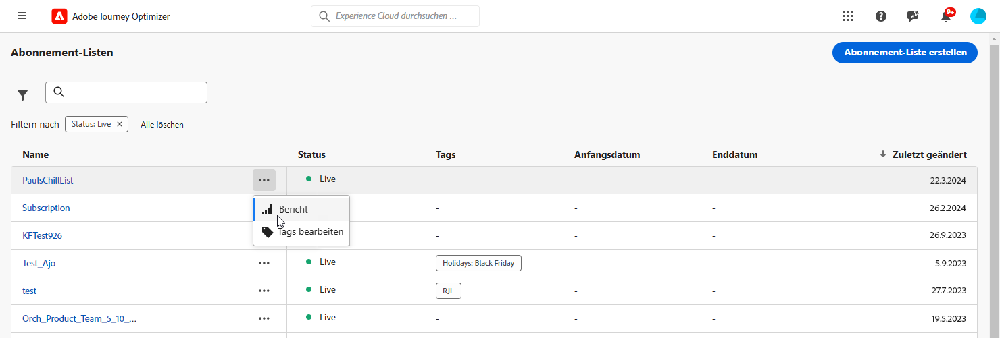
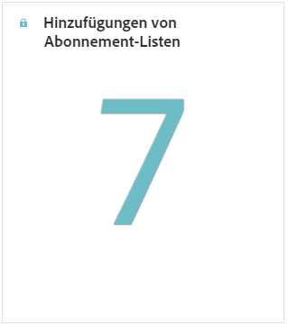
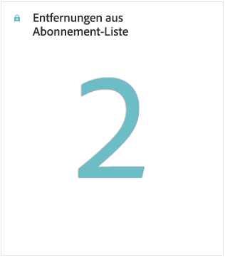
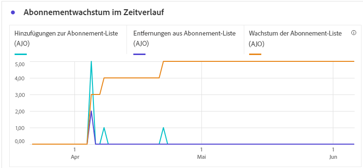
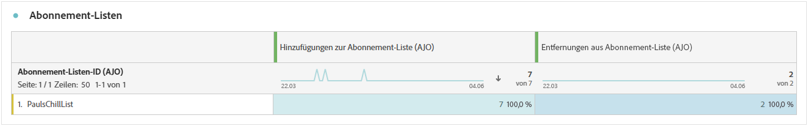
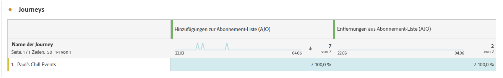
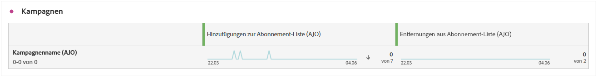
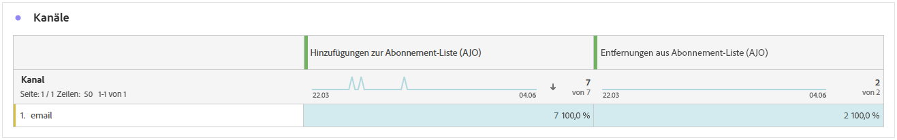

# Abonnementbericht {#subscription-report-global-cja}

Die **Abonnementbericht** bietet wichtige Einblicke in Abonnements und Abmeldungen von Profilen, die mit bestimmten Listen verknüpft sind, und hilft Ihnen, die Effektivität verschiedener Abonnementkampagnen und -initiativen bei der Förderung von Interaktionen und Konversionen zu verstehen.

Um auf Ihre Berichte zuzugreifen, klicken Sie auf das **[!UICONTROL Bericht]** im erweiterten Menü.

Weitere Informationen zum Customer Journey Analytics Workspace und zum Filtern und Analysieren von Daten finden Sie unter [diese Seite](https://experienceleague.adobe.com/en/docs/analytics-platform/using/cja-workspace/home).

## Hinzufügung der Abonnementliste

Die **[!UICONTROL Hinzufügung der Abonnementliste]** KPI bietet einen umfassenden Überblick über die Gesamtzahl der im angegebenen Zeitraum erworbenen Abonnements. Diese Metrik veranschaulicht das Wachstum und die Akquise neuer Abonnenten und bietet wertvolle Einblicke in die Effektivität Ihrer Abonnementkampagnen oder -initiativen.

## Abonnementliste entfernt

Die **[!UICONTROL Abonnementliste entfernt]** Die KPI bietet eine Aufschlüsselung der Gesamtzahl der Abmeldungen, die im angegebenen Zeitraum stattgefunden haben. Diese Metrik bietet wertvolle Einblicke in die Abmeldung von Abonnenten.

## Anhebung der Abonnements im Zeitverlauf

Die **[!UICONTROL Anhebung der Abonnements im Zeitverlauf]** Das Diagramm zeigt visuell den Verlauf von Abonnements über den angegebenen Zeitraum an und vermittelt ein klares Verständnis der Entwicklung Ihrer Abonnentenbasis.

* **[!UICONTROL Hinzufügung der Abonnementliste]**: Gesamtzahl der Anmeldungen für den betreffenden Zeitraum.

* **[!UICONTROL Abonnementliste entfernt]**: Gesamtzahl der Abmeldungen für den betreffenden Zeitraum.

* **[!UICONTROL Anstieg der Abonnementliste]**: Rate, mit der die Abonnentenliste in einem bestimmten Zeitraum wächst.

## Abonnementlisten

Die **[!UICONTROL Abonnementlisten]** bietet wichtige Einblicke in die An- und Abmeldungen Ihrer Profile, die mit bestimmten Abonnementlisten verknüpft sind. Diese Informationen helfen Ihnen dabei, die Effektivität verschiedener Abonnementlisten bei der Förderung von Interaktionen und Konversionen zu verstehen.

* **[!UICONTROL Hinzufügung der Abonnementliste]**: Gesamtzahl der Anmeldungen für den betreffenden Zeitraum.

* **[!UICONTROL Abonnementliste entfernt]**: Gesamtzahl der Abmeldungen für den betreffenden Zeitraum.

## Journeys

Die **[!UICONTROL Journey]** -Tabelle bietet einen umfassenden Überblick, der im Rahmen der Journey detaillierte Informationen über die Abonnements Ihrer Besucher enthält.

* **[!UICONTROL Hinzufügung der Abonnementliste]**: Gesamtzahl der Anmeldungen für den betreffenden Zeitraum.

* **[!UICONTROL Abonnementliste entfernt]**: Gesamtzahl der Abmeldungen für den betreffenden Zeitraum.

## Kampagnen

Die **[!UICONTROL Kampagnen]** -Tabelle bietet wertvolle Einblicke in die von bestimmten Kampagnen ausgelösten Anmeldungen und Abmeldungen Ihrer Profile. Mit dieser umfassenden Ansicht können Sie die Effektivität Ihrer Kampagnen messen und die Interaktion mit Ihren Landingpage-Inhalten effektiv verfolgen.

* **[!UICONTROL Hinzufügung der Abonnementliste]**: Gesamtzahl der Anmeldungen für den betreffenden Zeitraum.

* **[!UICONTROL Abonnementliste entfernt]**: Gesamtzahl der Abmeldungen für den betreffenden Zeitraum.

## Kanal

Die **[!UICONTROL Kanal]** zeigt die Anzahl an Profilanmeldungen und -abmeldungen an, die nach Kanälen kategorisiert sind.

* **[!UICONTROL Hinzufügung der Abonnementliste]**: Gesamtzahl der Anmeldungen für den betreffenden Zeitraum.

* **[!UICONTROL Abonnementliste entfernt]**: Gesamtzahl der Abmeldungen für den betreffenden Zeitraum.
