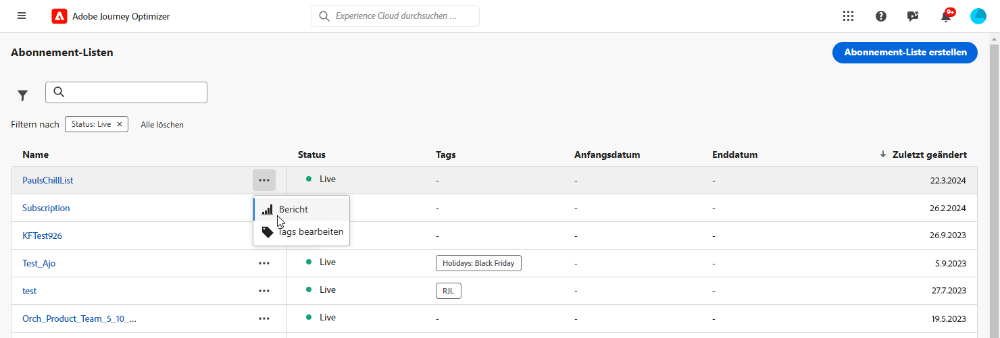
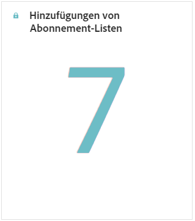
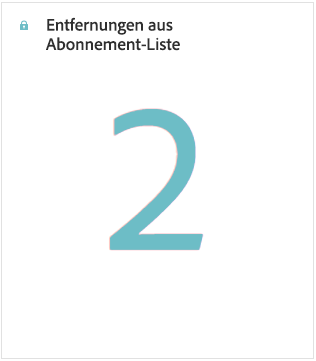
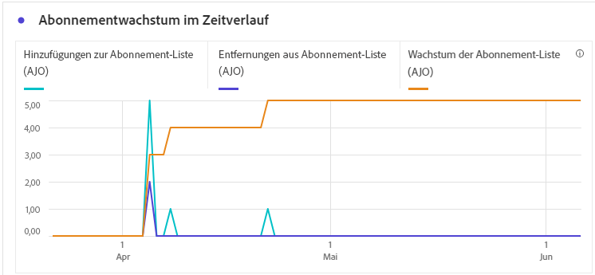
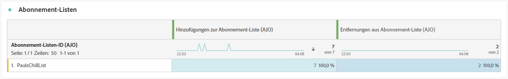
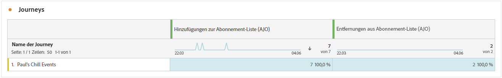
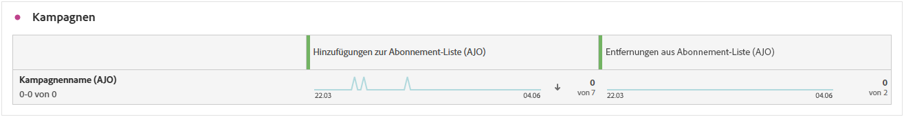
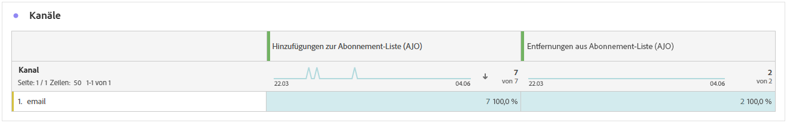

# Abonnementbericht {#subscription-report-global-cja}

>[!BEGINSHADEBOX]

**Auf dieser Seite:** Erfahren Sie, wie Sie mit dem Abonnementbericht Profilabonnements und -abmeldungen über Listen, Journey, Kampagnen und Kanäle hinweg analysieren können, um die Interaktion zu messen.

>[!ENDSHADEBOX]

Der **Abonnementbericht** bietet wichtige Einblicke in Abonnements und Abmeldungen von Profilen, die mit bestimmten Listen verknüpft sind. Er hilft Ihnen dabei, die Effektivität verschiedener Abonnementkampagnen und -initiativen bei der Förderung von Interaktionen und Konversionen zu verstehen.

Um auf Ihre Berichte zuzugreifen, klicken Sie auf das Symbol **[!UICONTROL Bericht]** der von Ihnen gewählten Abonnement-Liste im erweiterten Menü.

Weitere Informationen zu Customer Journey Analytics Workspace und zum Filtern und Analysieren von Daten finden Sie auf [dieser Seite](https://experienceleague.adobe.com/de/docs/analytics-platform/using/cja-workspace/home).

## Abonnement-Liste – Hinzugefügt

Die KPI für **[!UICONTROL Abonnement-Liste – Hinzugefügt]** bietet einen umfassenden Überblick über die Gesamtzahl der im angegebenen Zeitraum erworbenen Abonnements. Diese Metrik hebt das Wachstum und die Akquise neuer Abonnentinnen und Abonnenten hervor und bietet wertvolle Erkenntnisse zur Effektivität Ihrer Abonnementkampagnen oder -initiativen.

## Abonnement-Liste – Entfernt

Die KPI für **[!UICONTROL Abonnement-Liste – Entfernt]** bietet eine Aufschlüsselung der Gesamtzahl der Abmeldungen, die im angegebenen Zeitraum stattgefunden haben. Diese Metrik bietet wertvolle Einblicke in die Abmeldung von Abonnenten.

## Anstieg der Abonnements im Zeitverlauf

Der Graph **[!UICONTROL Anstieg der Abonnements im Zeitverlauf]** zeigt visuell den Verlauf von Abonnements über den angegebenen Zeitraum an und vermittelt ein klares Verständnis der Entwicklung Ihrer Abonnentenbasis.

* **[!UICONTROL Abonnement-Liste – Hinzugefügt]**: Gesamtanzahl der Anmeldungen im betreffenden Zeitraum.

* **[!UICONTROL Abonnement-Liste – Entfernt]**: Gesamtanzahl der Abmeldungen im betreffenden Zeitraum.

* **[!UICONTROL Abonnementliste – Anstieg]**: Rate, mit der die Abonnentenliste in einem bestimmten Zeitraum wächst.

## Abonnement-Listen

Die Tabelle **[!UICONTROL Abonnement-Listen]** bietet wichtige Erkenntnisse zu den Abonnements und Abmeldungen Ihrer Profile, die mit bestimmten Abonnement-Listen verknüpft sind. Anhand dieser Informationen können Sie die Effektivität verschiedener Abonnement-Listen bei der Förderung von Interaktionen und Konversionen nachvollziehen.

* **[!UICONTROL Abonnement-Liste – Hinzugefügt]**: Gesamtanzahl der Anmeldungen im betreffenden Zeitraum.

* **[!UICONTROL Abonnement-Liste – Entfernt]**: Gesamtanzahl der Abmeldungen im betreffenden Zeitraum.

## Journeys

Die Tabelle **[!UICONTROL Journey]** bietet eine umfassende Ansicht mit detaillierten Informationen über die Abonnements Ihrer Besuchenden im Rahmen ihrer Benutzer-Journey.

* **[!UICONTROL Abonnement-Liste – Hinzugefügt]**: Gesamtanzahl der Anmeldungen im betreffenden Zeitraum.

* **[!UICONTROL Abonnement-Liste – Entfernt]**: Gesamtanzahl der Abmeldungen im betreffenden Zeitraum.

## Kampagnen

Die Tabelle **[!UICONTROL Kampagnen]** bietet wertvolle Einblicke in die von bestimmten Kampagnen ausgelösten Abonnements und Abmeldungen Ihrer Profile. Mit dieser umfassenden Ansicht können Sie die Effektivität Ihrer Kampagnen messen und die Interaktion mit Ihren Landingpage-Inhalten effektiv verfolgen.

* **[!UICONTROL Abonnement-Liste – Hinzugefügt]**: Gesamtanzahl der Anmeldungen im betreffenden Zeitraum.

* **[!UICONTROL Abonnement-Liste – Entfernt]**: Gesamtanzahl der Abmeldungen im betreffenden Zeitraum.

## Kanal

Die Tabelle **[!UICONTROL Kanal]** zeigt die Anzahl der Abonnements und Abmeldungen von Profilen an, die nach Kanälen kategorisiert sind.

* **[!UICONTROL Abonnement-Liste – Hinzugefügt]**: Gesamtanzahl der Anmeldungen im betreffenden Zeitraum.

* **[!UICONTROL Abonnement-Liste – Entfernt]**: Gesamtanzahl der Abmeldungen im betreffenden Zeitraum.
