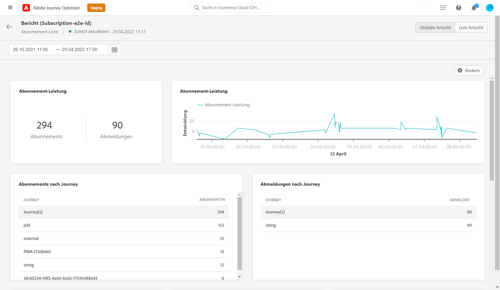
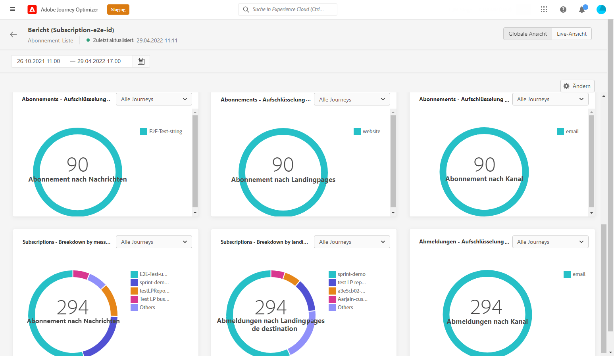

# Globaler Abonnementbericht {#subscription-report-global}

>[!CONTEXTUALHELP]
>id="ajo_subscription_global_report"
>title="Globaler Abonnementbericht"
>abstract="Im globalen Abonnementbericht können Sie die Aktivitäten Ihrer Abonnierenden über einen bestimmten Zeitraum hinweg messen und visualisieren. Der Bericht ist in verschiedene Widgets unterteilt, die Ihre Abonnements und die Abmeldungen detailliert beschreiben. Jedes Reporting-Dashboard kann durch Ändern der Größe oder Entfernen von Widgets verändert werden."

Der **[!UICONTROL globale Bericht]** zu Abonnements enthält Details zur Aktivität Ihrer Abonnenten während eines ausgewählten Zeitraums. Informationen zur Messung Ihrer Abonnements über die letzten 24 Stunden finden Sie im [Abonnement-Live-Bericht](subscription-report-live.md).

Um auf Ihre Berichte zuzugreifen, klicken Sie auf das Symbol **[!UICONTROL Bericht]** der von Ihnen gewählten Abonnementliste.

Der **[!UICONTROL globale Bericht]** ist in verschiedene Widgets unterteilt, die Ihre An- und Abmeldungen detailliert beschreiben. Jedes Widget kann bei Bedarf angepasst und gelöscht werden. Weiterführende Informationen dazu finden Sie in diesem [Abschnitt](global-report.md).

Die KPIs **[!UICONTROL Abonnement-Performance]** und die Tabellen **[!UICONTROL Anmeldungen nach Journey]**/**[!UICONTROL Abmeldungen nach Journey]** enthalten die wichtigsten Informationen zur Interaktion der Besucher mit Ihrer Landingpage. Die Tabellen und KPIs enthalten die für die Landingpage verfügbaren Daten, z. B.:

* **[!UICONTROL Anmeldungen]**: Gesamtanzahl der Anmeldungen im betreffenden Zeitraum.

* **[!UICONTROL Abmeldungen]**: Gesamtanzahl der Abmeldungen im betreffenden Zeitraum.

Das Diagramm **[!UICONTROL Abonnement-Performance]** zeigt die Entwicklung der Anmeldungen im betreffenden Zeitraum.

Die Diagramme **Anmeldungen – Aufschlüsselung** und **Abmeldungen – Aufschlüsselung** geben die Gesamtzahl der Personen an, die sich je nach Nachricht, Landingpage und Kanal im betreffenden Zeitraum an- oder abgemeldet haben.
