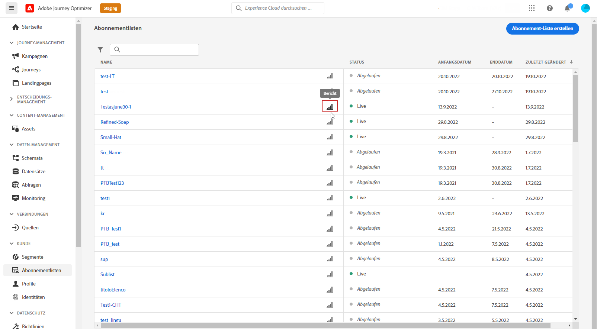
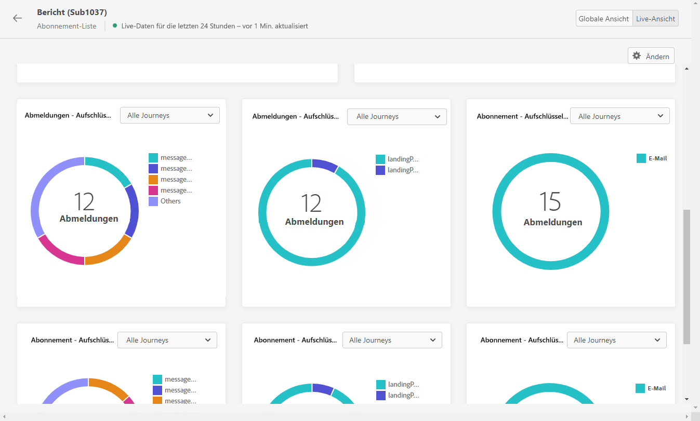

# Live-Bericht zu Abonnements {#subscription-report-live}

>[!CONTEXTUALHELP]
>id="ajo_subscription_live_report"
>title="Live-Bericht zu Abonnements"
>abstract="Mit dem Live-Bericht zu Abonnements können Sie die Aktivität Ihrer Abonnierenden nur in den letzten 24 Stunden in Echtzeit messen und visualisieren. Der Bericht ist in verschiedene Widgets unterteilt, die Ihre Abonnements und die Abmeldungen detailliert beschreiben. Jedes Reporting-Dashboard kann durch Ändern der Größe oder Entfernen von Widgets verändert werden."

Live-Berichte, auf die über die Registerkarte „Letzte 24 Std.“ zugegriffen werden kann, zeigen Ereignisse an, die innerhalb der letzten 24 Stunden stattgefunden haben. Der Zeitraum ab dem Auftreten des Ereignisses beträgt mindestens zwei Minuten. Im Vergleich dazu konzentrieren sich globale Berichte auf Ereignisse, die vor mindestens zwei Stunden aufgetreten sind, und decken Ereignisse über einen ausgewählten Zeitraum ab.

Um auf Ihre Berichte zuzugreifen, klicken Sie auf das Symbol **[!UICONTROL Bericht]** der von Ihnen gewählten Abonnementliste.

Der **[!UICONTROL Live-Bericht]** zu Abonnements ist in verschiedene Widgets unterteilt, die Ihre An- und Abmeldungen detailliert beschreiben. Jedes Widget kann bei Bedarf angepasst und gelöscht werden. Weiterführende Informationen dazu finden Sie in diesem [Abschnitt](live-report.md).

Die KPIs **[!UICONTROL Abonnement-Performance]** und die Tabellen **[!UICONTROL Anmeldungen nach Journey]**/**[!UICONTROL Abmeldungen nach Journey]** enthalten die wichtigsten Informationen zur Interaktion der Besucher mit Ihrer Landingpage. Die Tabellen und KPIs enthalten die für die Landingpage verfügbaren Daten, z. B.:

* **[!UICONTROL Anmeldungen]**: Gesamtzahl der Anmeldungen in den letzten 24 Stunden.

* **[!UICONTROL Abmeldungen]**: Gesamtzahl der Abmeldungen in den letzten 24 Stunden.

Das Diagramm **[!UICONTROL Abonnement-Performance]** zeigt die Entwicklung der Abonnements in den letzten 24 Stunden.

Die Diagramme **Anmeldungen – Aufschlüsselung** und **Abmeldungen – Aufschlüsselung** geben die Gesamtzahl der Personen an, die sich je nach Nachricht, Landingpage und Kanal in den letzten 24 Stunden an- oder abgemeldet haben.
