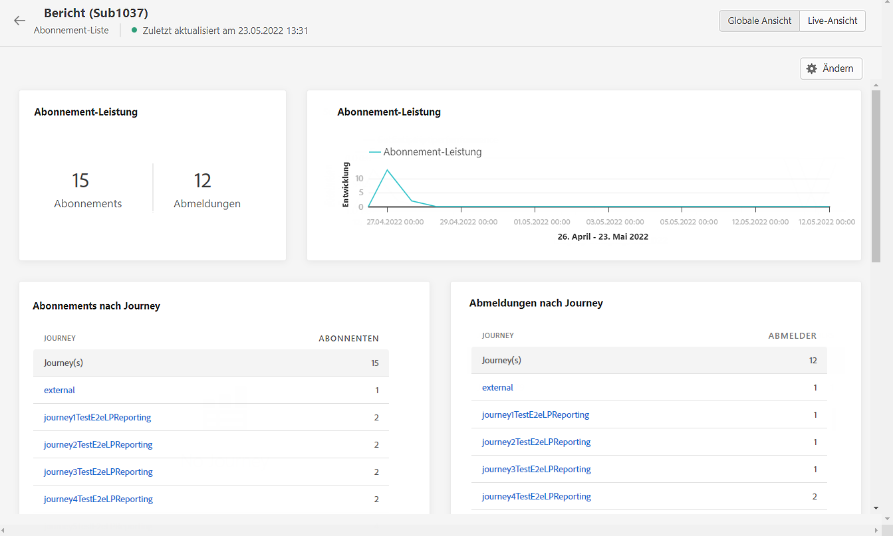

# Abonnement-Live-Bericht {#subscription-report-live}

Das Abonnement **[!UICONTROL Live-Bericht]** zeigt nur Details zur Aktivität Ihrer Abonnenten in den letzten 24 Stunden an. Informationen zum Messen Ihrer Abonnements über einen bestimmten Zeitraum finden Sie im Abschnitt [Globaler Abonnementbericht](subscription-report-global.md).

Um auf Ihre Berichte zuzugreifen, wählen Sie **[!UICONTROL Live-Bericht]** im erweiterten Menü Ihrer ausgewählten Abonnementliste.

Das Abonnement **[!UICONTROL Live-Bericht]** ist in verschiedene Widgets unterteilt, die Ihre An- und Abmeldungen detailliert beschreiben. Jedes Widget kann bei Bedarf angepasst und gelöscht werden. Weiterführende Informationen dazu finden Sie in diesem [Abschnitt](live-report.md).

Die KPIs **[!UICONTROL Abonnement-Performance]** und die Tabellen **[!UICONTROL Anmeldungen nach Journey]**/**[!UICONTROL Abmeldungen nach Journey]** enthalten die wichtigsten Informationen zur Interaktion der Besucher mit Ihrer Landingpage. Die Tabellen und KPIs enthalten die für die Landingpage verfügbaren Daten, z. B.:

* **[!UICONTROL Anmeldungen]**: Gesamtzahl der Anmeldungen in den letzten 24 Stunden.

* **[!UICONTROL Abmeldungen]**: Gesamtzahl der Abmeldungen in den letzten 24 Stunden.

Das Diagramm **[!UICONTROL Abonnement-Performance]** zeigt die Entwicklung der Abonnements in den letzten 24 Stunden.

Die Diagramme **Anmeldungen – Aufschlüsselung** und **Abmeldungen – Aufschlüsselung** geben die Gesamtzahl der Personen an, die sich je nach Nachricht, Landingpage und Kanal in den letzten 24 Stunden an- oder abgemeldet haben.

