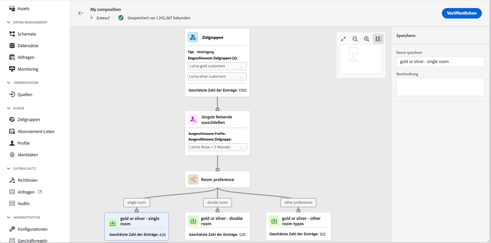
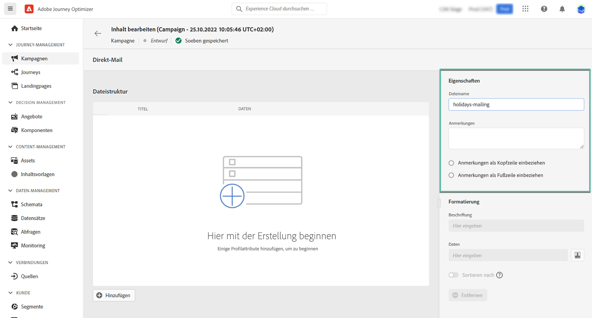
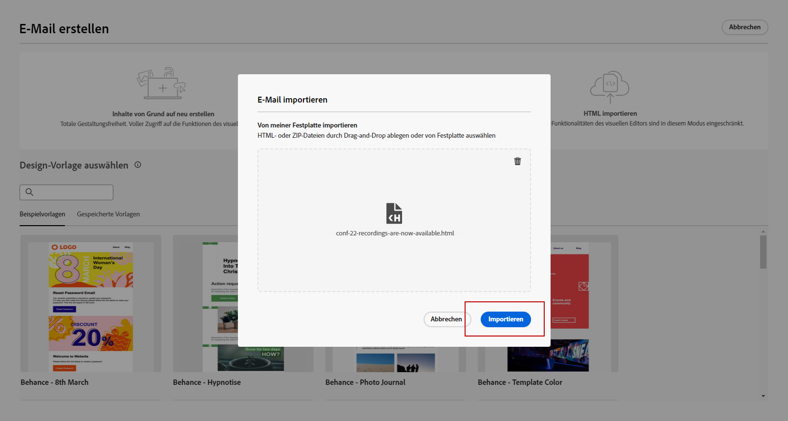

# Frühzeitige Versionshinweise {#e-release-notes}

[!DNL Adobe Journey Optimizer] bietet kontinuierlich neue Funktionen, Verbesserungen vorhandener Funktionen und Fehlerbehebungen. Alle Änderungen werden in der letzten Woche jedes Monats im [Versionshinweise](release-notes.md).

Frühe Versionshinweise unten können bis zum Verfügbarkeitsdatum der Version ohne vorherige Ankündigung geändert werden. Links, Bildschirme und aktualisierte Dokumentation werden im [Versionshinweise](release-notes.md), am Veröffentlichungsdatum.

## Frühzeitige Versionshinweise vom Juli 2023 {#july-rn-2023}

**Veröffentlichungsdatum**: 26.-27. Juli

### Neue Funktionen{#july-2023-features}

Mit dieser Version werden die unten aufgeführten neuen Funktionen eingeführt.

<table>
<thead>
<tr>
<th><strong>Zielgruppenzusammensetzung</strong> </th>
</tr>
</thead>
<tbody>
<tr>
<td>

Sie können jetzt Zusammensetzungs-Workflows erstellen, um bestehende Adobe Experience Platform-Zielgruppen in einer visuellen Arbeitsfläche zu kombinieren und verschiedene Aktivitäten (Aufspaltung, Anreicherung..) zu nutzen, um neue Zielgruppen zu erstellen. Neu erstellte Zielgruppen werden zusammen mit bestehenden Zielgruppen wieder in Adobe Experience Platform gespeichert und können in Journey Optimizer-Kampagnen für die Kundenansprache genutzt werden.

Weitere Informationen finden Sie in der <a href="../audience/get-started-audience-orchestration.md">detaillierten Dokumentation</a>.

Die Audience-Komposition ist vollständig in das neue Adobe Experience Platform-Menü "Zielgruppen"integriert, das als zentralisiertes Portal für Zielgruppen dient. Sie können jetzt eine Durchsuchen-Seite verwenden, die ein neues Dashboard mit Segmenttrends und Überschneidungen enthält, um neue Einblicke zu erhalten und Organisations-Tools für die Ordner- und Tagging-Verwaltung zu erkunden. Eingebettet in dieses Erlebnis sind Governance-Steuerelemente für standardisierte Zielgruppenbeschriftungen sowie Funktionen für das Zielgruppen-Lebenszyklusmanagement zur Verwaltung von Aktivierungs-Workflows. Mit diesem neuen Management-Erlebnis können Sie Zielgruppen jetzt einfach und sicher von einem Ort aus verwalten. Weitere Informationen finden Sie unter <a href="https://experienceleague.adobe.com/docs/experience-platform/segmentation/ui/overview.html?lang=de" target="_blank">Adobe Experience Platform-Dokumentation</a>.

</td>
</tr>
</tbody>
</table>

<table>
<thead>
<tr>
<th><strong>Briefpost-Kanal</strong> </th>
</tr>
</thead>
<tbody>
<tr>
<td>

Sie können jetzt Ihren Kampagnen und Journey Briefpost-Nachrichten hinzufügen. Briefpost ist ein Offline-Kanal, über den Sie die von Briefpost-Dienstleistern benötigten Dateien personalisieren und generieren können, um E-Mails an Ihre Kunden zu senden.

Bei der Vorbereitung eines Briefpost-Versands erzeugt Journey Optimizer eine Datei mit allen Zielgruppenprofilen und den ausgewählten Kontaktinformationen (z. B. Postanschrift). Dann senden Sie diese Datei an Ihren Briefpost-Dienstleister, der den tatsächlichen Versand vornimmt.

Weitere Informationen finden Sie in der <a href="../direct-mail/create-direct-mail.md">detaillierten Dokumentation</a>.

</tr>
</tbody>
</table>

<table>
<thead>
<tr>
<th><strong>HTML-Inhalt für E-Mail-Designer konvertieren</strong> </th>
</tr>
</thead>
<tbody>
<tr>
<td>

Sie können jetzt alle HTML-Inhalte im E-Mail-Editor von Journey Optimizer importieren und konvertieren. Inhaltsbausteine werden automatisch identifiziert und stehen im E-Mail-Designer zur Verfügung: nutzt seine leistungsstarken Designfunktionen, um es zu aktualisieren und zu personalisieren!

<!--p>For more information, refer to the <a href="../audience/get-started-audience-orchestration.md">detailed documentation</a>.</p-->
</td>
</tr>
</tbody>
</table>

<table>
<thead>
<tr>
<th><strong>Verwenden von Tags in Journey Optimizer</strong> </th>
</tr>
</thead>
<tbody>
<tr>
<td>

Zusätzlich zu Kampagnen und Journey können Sie Ihren Landingpages, Vorlagen, Inhaltsfragmenten und Abonnementlisten jetzt Adobe Experience Platform Unified Tags zuweisen. Auf diese Weise können Sie sie einfach klassifizieren und die Suche und Navigation in allen Listen verbessern. 

Weitere Informationen finden Sie in der <a href="../start/search-filter-categorize.md#tags">ausführlichen Dokumentation</a>.

</td>
</tr>
</tbody>
</table>

### Verbesserungen {#july-2023-improvements}

Diese Version enthält die unten aufgeführten Verbesserungen.

**Journeys**

* Sie können jetzt API-Aufrufantworten in benutzerdefinierten Aktionen nutzen und Ihre Journey basierend auf diesen Antworten koordinieren.

**Kampagnen**

* Kontextereignisse im Zusammenhang mit Kampagnen sind jetzt im Menü &quot;Kontextuelle Attribute&quot;des Personalisierungseditors verfügbar.

**Zielgruppen**

Die Zielgruppenauswahl in Journey- oder Kampagnen wurde verbessert, indem neue Spalten hinzugefügt werden, die die Herkunft und Aktualisierungshäufigkeit von Zielgruppen anzeigen.

Mit der Veröffentlichung des Portals &quot;Zielgruppenkomposition&quot;haben Adobe Experience Platform und Adobe Journey Optimizer die Verwendung von &quot;Zielgruppen&quot;und &quot;Segmenten&quot;im System und in der Dokumentation aktualisiert.

* Zielgruppe: eine Gruppe von Personen, Konten, Haushalten oder anderen Entitäten, die gemeinsame Merkmale und Verhaltensweisen aufweisen.
* Segmentdefinition: In Adobe Experience Platform sind dies die Regeln zur Beschreibung der Hauptmerkmale oder des Verhaltens einer Zielgruppe. Dieser Begriff war früher einfach als „Segment“ bekannt.

Daher wird in Adobe Journey Optimizer und auf der Benutzeroberfläche von Adobe Experience Platform „Segmente“ durch „Zielgruppen“ ersetzt, um diesen neuen Pfad der Zielgruppenerstellung und -verwaltung widerzuspiegeln.

