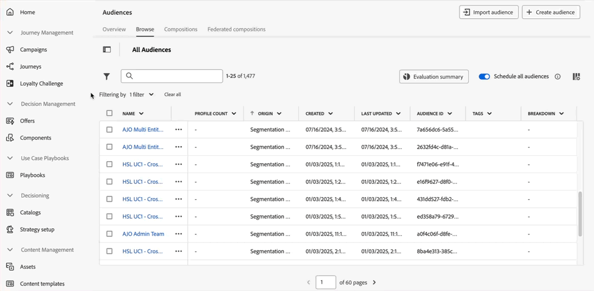

# Frühzeitige Versionshinweise {#e-release-notes}

[!DNL Adobe Journey Optimizer] bietet kontinuierlich neue Funktionen, Verbesserungen vorhandener Funktionen und Fehlerbehebungen. Alle Änderungen werden am Ende jedes Monats in den [Versionshinweisen](release-notes.md) zusammengefasst.

**Die nachfolgenden frühzeitigen Versionshinweise können bis zum Verfügbarkeitsdatum der Version ohne vorherige Ankündigung geändert werden**. Links, Bildschirme und aktualisierte Dokumentation werden in den [Versionshinweisen](release-notes.md) am Veröffentlichungsdatum veröffentlicht.

## Frühzeitige Versionshinweise Februar 2025 {#25-02-rn}

### Neue Funktionen {#25-02-features}

Im Folgenden werden die neuen Funktionen dieser Version beschrieben.

<table>
<thead>
<tr>
<th><strong>Verfahrensregeln</strong> </th>
</tr>
</thead>
<tbody>
<tr>
<td>

Sie können jetzt Geschäftsregeln mithilfe von Regelsätzen erstellen. Regelsätze sind Gruppen von Regeln, mit denen gesendete Nachrichten innerhalb von Kampagnen und Journey-Aktionen kanalübergreifend eingeschränkt und Profileinträge in Journey gesteuert werden können.

<ul><li>Erstellen Sie Kanalregelsätze, um die Anzahl der Nachrichten zu beschränken, die über einen oder mehrere Kanäle gesendet werden. Wenden Sie sie auf Kampagnen oder Journey-Aktionen an, um die im Regelsatz definierten Regeln durchzusetzen. Mit dem Kanalregelsatz können Sie Begrenzungsregeln basierend auf Kommunikationstypen anwenden. Legen Sie beispielsweise einen Regelsatz fest, um „Werbenachrichten“ zu begrenzen, und einen weiteren für „Newsletter“. Wenden Sie den entsprechenden Regelsatz in Ihrer Kampagnen- oder Journey-Aktion an, je nach dem Typ der Kommunikation, die Sie senden.</li>
<li> Erstellen Sie Journey-Regelsätze, um Profileinträge in Journey zu steuern. Begrenzen Sie, wie oft ein Profil innerhalb eines bestimmten Zeitraums auf eine Journey zugreifen kann oder wie viele Journey ein Profil gleichzeitig registrieren kann. Wenden Sie diese auf der Journey-Ebene an, um eine ordnungsgemäße Zugangsverwaltung sicherzustellen.</li>

Bislang für eine Reihe von Organisationen (LA) verfügbar, stehen Geschäftsregeln jetzt für alle Benutzer (GA) zur Verfügung.

<!--p>For more information, refer to the <a href="../configuration/business-rules.md">detailed documentation</a>.</p-->
</td>
</tr>
</tbody>
</table>

<table>
<thead>
<tr>
<th><strong>Multiregionale Unterstützung für SMS</strong> </th>
</tr>
</thead>
<tbody>
<tr>
<td>

Sie können jetzt den SMS-Nachrichtenversand über multiregionale Endpunkte verwalten, indem Sie Versand-, Feedback-, eingehende und Callback-URLs überschreiben. Um dies zu unterstützen, wurde der API-Anmeldedaten-Konfiguration ein neues Feld URL-Überschreibung hinzugefügt. Diese Änderung ist nur beim Sinch-Anbieter verfügbar.

<!--p>For more information, refer to the <a href="../configuration/business-rules.md">detailed documentation</a>.</p-->
</td>
</tr>
</tbody>
</table>

<table>
<thead>
<tr>
<th><strong>Customer Journey Analytics-Vorlagen</strong> </th>
</tr>
</thead>
<tbody>
<tr>
<td>

Sie haben jetzt die Möglichkeit, Ihre Journey Optimizer-Berichte mithilfe von Customer Journey Analytics-Vorlagen zu erweitern. Mit dieser neuen Funktion können Sie Ihren Reporting-Prozess mit vordefinierten Vorlagen optimieren, die auf Ihre Analyseanforderungen zugeschnitten sind.

Weitere Informationen finden Sie in der <a href="../reports/report-cja-manage.md#cja-template">ausführlichen Dokumentation</a>.

Verfügbarkeitsdatum: ab 15. Januar 2025

</tr>
</tbody>
</table>

<table>
<thead>
<tr>
<th><strong>Flexible Zielgruppenbewertung (eingeschränkte Verfügbarkeit)</strong> </th>
</tr>
</thead>
<tbody>
<tr>
<td>

Mit der flexiblen Zielgruppenauswertung können Sie bei Bedarf einen Segmentierungsauftrag für ausgewählte Zielgruppen ausführen, um sicherzustellen, dass Sie immer über die aktuellsten Zielgruppendaten verfügen, bevor Sie sie in Journey Optimizer-Journey und -Kampagnen aufnehmen.

Weitere Informationen finden Sie in der <a href="../audience/about-audiences.md#flexible">ausführlichen Dokumentation</a>.

 Eine flexible Zielgruppenauswertung ist nur für eine Reihe von Organisationen verfügbar (eingeschränkte Verfügbarkeit). Um Zugang zu erhalten, wenden Sie sich an den Adobe-Support.

Verfügbarkeitsdatum: 28. Januar 2025

</tr>
</tbody>
</table>

### Verbesserungen {#25-02-improvements}

Die folgenden Verbesserungen werden mit dem Update vom Februar vorgenommen.

* **Journey** - Sie können jetzt Ihre benutzerdefinierten Journey-Aktionen testen, indem Sie API-Aufrufe über die Administration-Benutzeroberfläche senden. Diese neue Funktion hilft Ihnen bei der Fehlerbehebung bei benutzerdefinierten Aktionen.

* **Datensatz-TTL (Time-to-Live)** - Ab diesem Monat wird eine TTL (Time-to-Live)-Leitplanke wie folgt für Journey Optimizer-systemgenerierte Datensätze in neuen Sandboxes und neuen Organisationen eingeführt:

   * 90 Tage für Daten im Profilspeicher
   * 13 Monate für Daten im Data Lake

  Diese Änderung wird in einer nachfolgenden Phase in bestehenden Kunden-Sandboxes bereitgestellt.

  Weitere Informationen zu diesem Update finden Sie in [diesen speziellen FAQ](../data/datasets-ttl.md#frequently-asked-questions).

<!--* **Playbooks** - You can now create and publish your own Use Case Playbooks in Journey Optimizer.-->

* **Briefpost** - Ein neuer Servertyp, Data Landing Zone, wird jetzt für das Datei-Routing in der Konfiguration des Briefpostkanals unterstützt.

**Personalisierung**

<!--
* The personalization editor has been enhanced with new capabilities such as Auto-complete, Search, and filtering options. You can also show or hide deprecated attributes.-->

* Verfügbarkeitsdatum: 29. Januar 2025 - Neue Datums-/Uhrzeithilfsfunktionen sind für die Verwendung im Personalisierungseditor verfügbar. [Weitere Informationen](../personalization/functions/dates.md)

**E-Mail-**: Verfügbarkeitsdatum: 12. Februar 2025

* Wenn Sie das Einverständnis außerhalb von Adobe verwalten, können Sie jetzt eine benutzerdefinierte Abmelde-E-Mail-Adresse und eine benutzerdefinierte Abmelde-URL mit einem Klick als Teil Ihrer E-Mail-Kanal-Konfigurationseinstellungen festlegen. [Mehr dazu](../email/list-unsubscribe.md#custom-managed)

  {width="80%"}

**Decisioning** - Verfügbarkeitsdatum: 28. Januar 2025

* Decisioning unterstützt jetzt Objektdatentypen beim Bearbeiten des Schemas des Elementkatalogs. [Weitere Informationen](../experience-decisioning/catalogs.md)