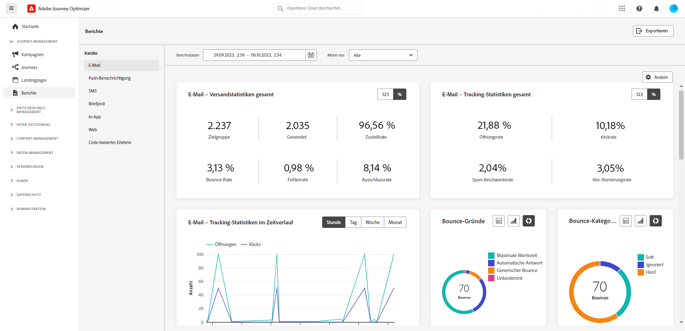

# Frühzeitige Versionshinweise {#e-release-notes}

[!DNL Adobe Journey Optimizer] bietet kontinuierlich neue Funktionen, Verbesserungen vorhandener Funktionen und Fehlerbehebungen. Alle Änderungen werden in der letzten Woche jedes Monats in den [Versionshinweisen](release-notes.md) konsolidiert.

Die nachfolgenden frühzeitigen Versionshinweise können bis zum Verfügbarkeitsdatum der Version ohne vorherige Ankündigung geändert werden. Links, Bildschirme und aktualisierte Dokumentation werden in den [Versionshinweisen](release-notes.md) am Veröffentlichungsdatum veröffentlicht.

## Frühzeitige Versionshinweise vom September 2023 {#sept-rn-2023}

**Veröffentlichungsdatum**: 26.-27. September 2023

### Neue Funktionen{#sept-2023-features}

Mit dieser Version werden die unten aufgeführten neuen Funktionen eingeführt.

<table>
<thead>
<tr>
<th><strong>Konsolidierte Kanalberichte</strong> </th>
</tr>
</thead>
<tbody>
<tr>
<td>

Die Funktion Kanalbericht bietet Analysten und Marketingexperten einen umfassenden Überblick über Traffic- und Interaktionsmetriken auf Kanalebene. Um auf das Menü "Bericht"zugreifen zu können, müssen Sie über die Berechtigung "Kanalberichte anzeigen"verfügen.

<!--p>For more information, refer to the <a href="../in-app/get-started-in-app.md">detailed documentation</a>.</p-->
</tr>
</tbody>
</table>

<table>
<thead>
<tr>
<th><strong>Datensatzexport-Ziele (GA)</strong> </th>
</tr>
</thead>
<tbody>
<tr>
<td>

Der Export von Journey Optimizer-Datensätzen in Cloud-Speicher-Ziele ist jetzt allgemein verfügbar. Diese Funktion ermöglicht es Ihnen, eine Live-Verbindung mit Zielen im Cloud-Speicher herzustellen, um den Inhalt Ihrer Datensätze zu exportieren.

<!--p>For more information, refer to the <a href="../audience/get-started-audience-orchestration.md">detailed documentation</a>.</p-->
</td>
</tr>
</tbody>
</table>

<table>
<thead>
<tr>
<th><strong>Speicherung der Anmeldeinformationen von Per-Sandbox-Mobile Apps</strong> </th>
</tr>
</thead>
<tbody>
<tr>
<td>

Mit dieser neuen Funktion können Sie Push-Anmeldeinformationen einfach in App-Oberflächen verwalten und mit einer dedizierten Sandbox verknüpfen.

Weitere Informationen finden Sie in der <a href="../in-app/inapp-configuration.md">ausführlichen Dokumentation</a>.

</tr>
</tbody>
</table>

### Verbesserungen {#sept-2023-improvements}

Diese Version enthält die unten aufgeführten Verbesserungen.

<!--**Audiences**

* You can now target audiences uploaded from a CSV file into journeys and campaigns.
* You can now target audiences resulting from composition workflows into journeys. -->

**Personalisierung**

* Neben visuellen Fragmenten ist es jetzt möglich, Ausdrucksfragmente über die Journey Optimizer-Benutzeroberfläche über den Ausdruckseditor zu erstellen, zu speichern und wiederzuverwenden. Ausdrucksfragmente ersetzen die zuvor gespeicherten Ausdrücke.
* Sie können jetzt berechnete Adobe Experience Platform-Attribute zur Personalisierung in Journey Optimizer verwenden. Berechnete Attribute sind aggregierte Werte, die anhand von in Adobe Experience Platform erfassten profilaktivierten Erlebnisereignis-Datensätzen berechnet werden.

**Warnhinweise**

* Eine neue Art von Systemwarnung wurde eingeführt. Sie können jetzt benachrichtigt werden, wenn eine gelesene Audience fehlschlägt.

**Web-Kanal**

* Einzelseitenanwendungen (SPA) können jetzt im Web-Visual Editor erstellt werden. Sie können jetzt auswählen, auf welche spezifischen Ansichten Sie die Änderungen Ihrer Webseite anwenden möchten. Eine Ansicht kann als ganze Site oder eine Gruppe visueller Elemente auf einer Site definiert werden, z. B. als Startseite, die gesamte Produktseite oder den Rahmen für Versandvoreinstellungen auf allen Checkout-Seiten. Zur Definition der Ansichten in der Adobe Experience Platform Web SDK-Implementierung ist eine einmalige Einrichtung von Entwicklern erforderlich. Dadurch können Marketing-Experten Adobe Journey Optimizer-Webkampagnen auf SPA erstellen und ausführen.

* Bei der Bearbeitung einer Seite mit dem Webdesigner können Sie neue Änderungen direkt im Bereich Änderungen hinzufügen, ohne eine Komponente auswählen und in der Designer-Oberfläche bearbeiten zu müssen.
* Beim Einrichten von Web-Subdomains haben Sie jetzt die Möglichkeit, Ihre eigene Subdomain hinzuzufügen - zusätzlich zur Verwendung einer Subdomain, die bereits an Adobe delegiert wurde.

**Journeys**

* Unterstützung für benutzerdefinierte Aktionsantworten ist jetzt allgemein verfügbar. Auf diese Weise können Sie API-Aufrufantworten in benutzerdefinierten Aktionen nutzen und Ihre Journey basierend auf diesen Antworten koordinieren. Darüber hinaus wurde ein neuer Schutzmechanismus hinzugefügt, mit dem alle Zollaktionen auf 5000 Anrufe/s pro Endpunkt beschränkt werden können.
* Beim Duplizieren einer Journey können Sie jetzt den Namen der Journey-Kopie definieren.

<!--
* The maximum duration that you can define in the Wait activity is now 29 days instead of 30.
-->

**E-Mail-Kanal**

Eine neue Option in der E-Mail-Oberflächenkonfiguration ermöglicht den Versand von Transaktionsnachrichten an Profile, selbst wenn deren E-Mail-Adressen auf der Adobe Journey Optimizer-Unterdrückungsliste stehen.

**Reporting**

Sie können jetzt Journey Optimizer-Berichte als CSV-Datei exportieren. [Weitere Informationen](../reports/global-report.md#export-reports)

<!--**Decision management**

Enhancements have been made to the audience picker in journeys or campaigns, with the addition of new columns displaying the origin and update frequency of audiences.    -->