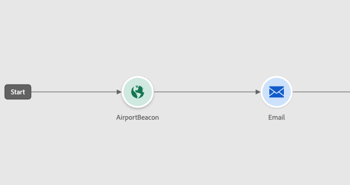

# Willkommen beim verbesserten Journey Designer {#new-canvas}

Journey Optimizer bietet jetzt ein **vereinfachtes Journey-Modell**, das das Benutzererlebnis und interne Prozesse verbessern soll. Ab der April-Version können Sie von den folgenden Funktionen profitieren:

* Eine **neu entworfene Journey-Arbeitsfläche**, die für ein modernisiertes Benutzeroberflächen-Erlebnis erstellt wurde
* Eine direkt auf der Journey-Arbeitsfläche verfügbare **Live-Reporting**-Benutzeroberfläche

>[!NOTE]
>
>Beachten Sie, dass der Rollout für diese Funktion progressiv sein wird. Möglicherweise sehen Sie die Änderungen nicht sofort.

## Aktualisierungen des Journey-Modells

Das neue Journey-Modell wird neben dem vorhandenen Modell leben, was bedeutet, dass Journey mit **zwei verschiedenen Modellen** arbeiten:

* Das alte Modell
* Das neue Modell

Alle Journey im alten Modell bleiben darin. Sie können sie weiterhin bearbeiten, testen oder veröffentlichen. Jede neue Version, die von einer Journey auf dem Legacy-Modell erstellt wurde, bleibt dabei erhalten. Es gibt **keine funktionalen Änderungen** um diese Journey.

Wie Sie im folgenden Screenshot sehen, sind die Knoten rund, was die alte Benutzeroberfläche für Journey auf dem alten Modell ist.

Wenn Sie jedoch **eine neue Journey** oder **eine bestehende duplizieren,**, befindet sich diese auf dem neuen Modell. Journey zum alten Modell werden weiterhin unterstützt, bis die Mehrheit der Kunden zum neuen Modell übergeht.

Das neue Journey-Modell unterliegt einer einzigen Einschränkung. Es ist **nicht möglich, Aktivitäten aus dem alten zu kopieren und in das neue Modell einzufügen und umgekehrt**. Wenn Sie dies wünschen, empfehlen wir Ihnen, Ihre alte Journey zu duplizieren, um sie in das neue Modell zu wechseln, und dann Ihre Aktivitäten zu kopieren.

Im folgenden Screenshot sehen Sie die neu entworfene Benutzeroberfläche für die Journey-Arbeitsfläche (nur mit dem neuen Modell verfügbar):

**Neue Funktionen, die dem Journey-Designer hinzugefügt wurden (einschließlich Live-Berichten), sind ab diesem Zeitpunkt nur noch für Journey verfügbar.**

## Verbessertes Journey-Arbeitsflächendesign

Mit dem neuen Journey-Modell führen wir eine neue und verbesserte Benutzeroberfläche **Journey-Arbeitsfläche** ein, die nahtlos in das Adobe Experience Cloud-Lösungen- und App-Ökosystem passt und ein intuitives und effizientes Benutzererlebnis ermöglicht. Jede Journey im neuen Modell wird auf diesem neuen Design stehen.

Aktivitäten werden jetzt durch eckige Kästchen mit den folgenden Funktionen dargestellt:

* Die erste Zeile, die den Aktivitätstyp darstellt, der häufig durch mehr Kontextinformationen überschrieben wird (in &quot;Zielgruppen lesen&quot;, sie enthält den Namen der ausgewählten Zielgruppe), oder durch eine benutzerdefinierte Bezeichnung, wenn Sie eine definieren.
* Die zweite Zeile, die immer den Aktivitätstyp darstellt.

Diese neue Benutzeroberfläche verbessert die Lesbarkeit der Journey-Arbeitsfläche, indem sie **klarere Aktivitätsbezeichnungen und -typen bereitstellt**.

Außerdem kann das Produktteam mehr Informationen auf der Arbeitsfläche mit weniger Klicks hinzufügen. Ein Beispiel für &quot;weitere Informationen&quot;wäre die Einbeziehung von Live-Berichten in die Journey-Arbeitsfläche, in der Sie sehen können, wie Profile aufgrund von Fehlern in Ihre Aktivitäten eintreten und diese beenden.

## Live-Reporting auf der Journey-Arbeitsfläche

Zusätzlich zum verbesserten Arbeitsflächenlayout für Journey wird eine neue Funktion eingeführt, mit der Benutzer Echtzeitberichtsmetriken aus **den letzten 24 Stunden**, so genannte Live-Berichte, direkt auf der Arbeitsfläche des Journey anzeigen können.

Für jede Aktivität in jeder Live-Journey mit dem neuen Modell haben Sie Zugriff auf:

* Die Anzahl der Profile, die an dieser Aktivität teilnehmen.
* Die Anzahl der Profile, die diese Aktivität aufgrund eines Fehlers verlassen haben.

<!--`
With every live journey on the new model, you will be able to see two types of "last 24 hours" reporting information:

* On a **new insert**, you will see:
    * The number of profiles that have been exported for audience-triggered journeys. You will see the number of profiles available in the last export job alongside the time when that export has been made.
    * The number of profiles who exited the journey
    * The percentage of errors
    
* **On each activity**, you will see the number of profiles who entered that activity and the number who exited because of an error:
    
-->
<!--
Please note that you may see differences between the number of exported profiles and the number of profiles flowing through the journey. The exported profiles count only provides information about the last export job being made while the number of profiles entering an activity only contains profiles who did it in the last 24 hours. This can especially be visible on recurring daily journeys as there could be a data overlap between two days.
-->
