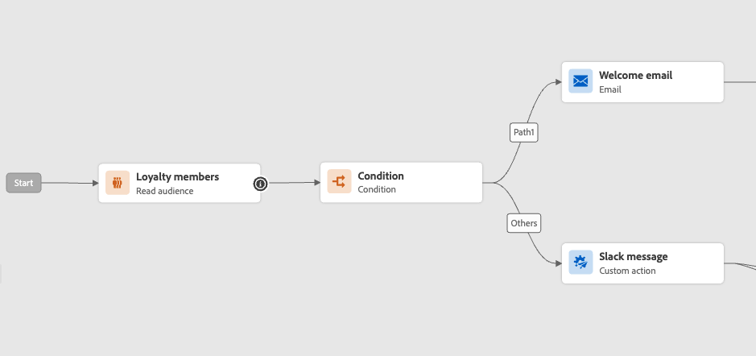

# Willkommen beim verbesserten Journey-Designer {#new-canvas}

>[!CONTEXTUALHELP]
>id="ajo_new_canvas"
>title="Neue Funktionen"
>abstract="Neue Arbeitsfläche"

Herzlich Willkommen beim verbesserten Journey Designer!

Wir haben eine **vereinfachtes Journey-Modell** zur Verbesserung der internen Verfahren. Obwohl dieses neue Modell eine Backend-Verbesserung ist, hat unser Team die Gelegenheit genutzt, Funktionen hinzuzufügen, die für Journey Optimizer-Benutzer sichtbar und von Vorteil sind:

* A **neu entworfene Journey-Arbeitsfläche** wurde für ein modernisiertes Benutzeroberflächenerlebnis entwickelt
* A **Live-Reporting** Direkt auf der Journey-Arbeitsfläche verfügbare Benutzeroberfläche

>[!AVAILABILITY]
>
>Beachten Sie, dass der Rollout für diese Funktion progressiv sein wird. Möglicherweise sehen Sie die Änderungen nicht sofort.

## Aktualisierungen des Journey-Modells

Das neue Journey-Modell wird neben dem vorhandenen Modell existieren, was bedeutet, dass Journey mit **zwei verschiedene Modelle**:

* Die alte Version heißt &quot;v1&quot;
* Und das neue, &quot;v2&quot;genannt

Alle Journey in v1 bleiben in v1. Sie können sie weiterhin bearbeiten, testen oder veröffentlichen. Jede neue Version, die von einer v1 erstellt wurde, verbleibt ebenfalls in v1. Es gibt **keine funktionalen Änderungen** um v1 Journey.

Wie Sie im folgenden Screenshot sehen, sind die Knoten rund, was der alten Benutzeroberfläche für Journey des v1-Modells entspricht.

Wenn Sie **Erstellen einer neuen Journey** oder **Duplizieren einer vorhandenen**, wird es eine v2-Journey sein.  Wir planen, die Journey von v1 weiterhin zu unterstützen, bis die Mehrheit der Kunden auf v2-Journey umgestellt wird.

Es gibt eine Einschränkung für das neue Journey-Modell; es wird **Es ist nicht möglich, Aktivitäten von einer v1-Journey in eine v2 zu kopieren und einzufügen und umgekehrt**. Wenn Sie dies wünschen, empfehlen wir Ihnen, Ihre v1-Journey zu duplizieren, um sie zu einer v2 zu machen, und dann Ihre Aktivitäten zu kopieren.

Im folgenden Screenshot sehen Sie die neu entworfene Benutzeroberfläche für die Journey-Arbeitsfläche (nur verfügbar mit dem v2-Modell):

**Neue Funktionen, die zum Journey-Designer hinzugefügt wurden (einschließlich Live-Reporting), sind ab diesem Zeitpunkt nur für Journey mit v2 verfügbar.**

## Verbessertes Journey-Arbeitsflächendesign

Mit dem neuen Journey-Modell führen wir ein neues und verbessertes Modell ein **Benutzeroberfläche für Journey-Arbeitsfläche**, das nahtlos in das Adobe Experience Cloud-Lösungs- und App-Ökosystem passt und so eine intuitive und effiziente Benutzererfahrung ermöglicht. Jegliche Journey im v2-Stapel wird in diesem neuen Design verwendet.

Aktivitäten werden jetzt durch eckige Kästchen mit den folgenden Funktionen dargestellt:

* Die erste Zeile, die den Aktivitätstyp darstellt, der häufig durch kontextbezogene Informationen überschrieben wird (z. B. bei &quot;Zielgruppen lesen&quot;, enthält sie den Namen der ausgewählten Zielgruppe), oder eine benutzerdefinierte Bezeichnung, wenn Sie eine definieren.
* Die zweite Zeile, die immer den Aktivitätstyp darstellt.

Diese neue Benutzeroberfläche verbessert die Lesbarkeit der Journey-Arbeitsfläche durch Bereitstellung von **klarere Aktivitätsbezeichnungen und -typen**.

Außerdem kann das Produktteam mehr Informationen auf der Arbeitsfläche mit weniger Klicks hinzufügen. Ein Beispiel für &quot;weitere Informationen&quot;wäre die Einbeziehung von Live-Berichten in die Journey-Arbeitsfläche, in der Sie sehen können, wie Profile aufgrund von Fehlern in Ihre Aktivitäten eintreten und diese beenden.

## Live-Reporting auf der Journey-Arbeitsfläche

Neben dem verbesserten Journey-Canvas-Design bieten wir die Möglichkeit, **Berichtsmetriken der letzten 24 Stunden** (als &quot;Live-Reporting&quot;bezeichnet) direkt auf der Journey-Arbeitsfläche.

Mit jeder Live-Journey auf dem neuen Modell können Sie sehen, **für jede Aktivität**, die Anzahl der Profile, die an dieser Aktivität teilgenommen haben, und die Anzahl der Profile, die aufgrund eines Fehlers beendet wurden:

<!--`
With every live journey on the new model, you will be able to see two types of "last 24 hours" reporting information:

* On a **new insert**, you will see:
    * The number of profiles that have been exported for audience-triggered journeys. You will see the number of profiles available in the last export job alongside the time when that export has been made.
    * The number of profiles who exited the journey
    * The percentage of errors
    
* **On each activity**, you will see the number of profiles who entered that activity and the number who exited because of an error:
    
-->

Die Benutzeroberfläche wird jede Minute automatisch aktualisiert.

<!--
Please note that you may see differences between the number of exported profiles and the number of profiles flowing through the journey. The exported profiles count only provides information about the last export job being made while the number of profiles entering an activity only contains profiles who did it in the last 24 hours. This can especially be visible on recurring daily journeys as there could be a data overlap between two days.
-->
