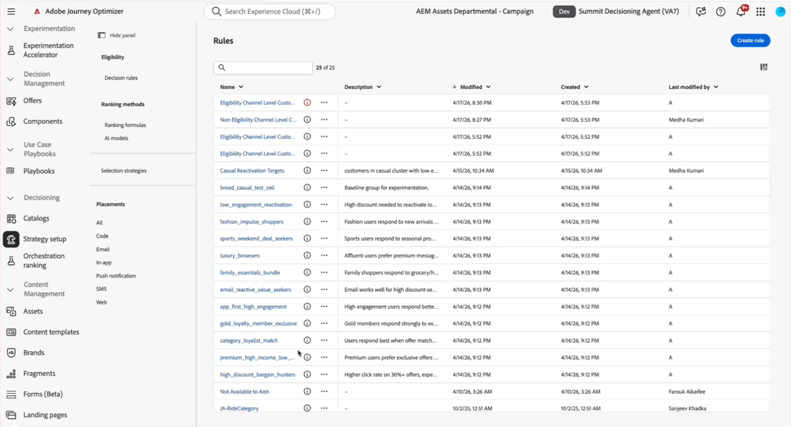

<!-- DRAFT — Topic-based layout exploration. All content is identical to release-notes.md (May '26). The only change is the grouping axis: topic > type. -->

# Versionshinweise {#release-notes}

>[!CONTEXTUALHELP]
>id="ajo_homepage_card1"
>title="Neue Funktionen"
>abstract="**Adobe Journey Optimizer** stellt regelmäßig neue Funktionen, Verbesserungen vorhandener Funktionen und Fehlerbehebungen zur Verfügung. Alle Änderungen werden in der letzten Woche jedes Monats in diesen Versionshinweisen konsolidiert."

[!DNL Adobe Journey Optimizer] verwendet ein kontinuierliches Bereitstellungsmodell, das es Adobe ermöglicht, laufend neue Funktionen, Verbesserungen und Fehlerbehebungen bereitzustellen. Dieser Ansatz ermöglicht ein skalierbares Rollout von Funktionen in Phasen, um die Leistung und Stabilität aller Umgebungen sicherzustellen. Aufgrund dieses Modells werden die Versionshinweise zwischen den monatlichen Versionen aktualisiert. Ausführliche Informationen zum Veröffentlichungszyklus und zur Verfügbarkeitsphase finden Sie unter [Veröffentlichungszyklus für Journey Optimizer](releases.md).

[!DNL Adobe Journey Optimizer] setzt nativ auf [!DNL Adobe Experience Platform] auf und profitiert von den neuesten Innovationen und Verbesserungen. Weitere Informationen zu diesen Änderungen finden Sie in den [Versionshinweisen zu Adobe Experience Platform](https://experienceleague.adobe.com/docs/experience-platform/release-notes/latest.html?lang=de){target="_blank"}.

>[!NOTE]
>
>Die in diesen Versionshinweisen aufgeführten Funktionen umfassen ein **Verfügbarkeitsdatum** das angibt, wann jede Änderung in Ihrer Umgebung verfügbar wird. Einträge mit **Demnächst** sind für die Veröffentlichung in den nächsten Tagen oder Wochen geplant. Die Informationen in diesen Abschnitten können sich ändern.

## Mai &#39;26 - Versionshinweise {#may-26-rn}

### Journeys {#may-26-journeys}

Die folgenden Funktionen und Verbesserungen wurden in dieser Version zu Journey hinzugefügt. Weitere Änderungen werden auch in den kommenden Tagen oder Wochen erwartet - siehe Abschnitt [In Kürze verfügbar](#may-26-journeys-coming-soon) weiter unten.

<table>
<thead>
<tr>
<th><strong>Journey Fragments</strong> </th>
</tr>
</thead>
<tbody>
<tr>
<td>

Sie können jetzt <strong>Journey-Fragmente</strong> in Adobe Journey Optimizer erstellen. Journey-Fragmente sind wiederverwendbare Sets von Journey-Knoten, die Sie einmal erstellen und in einer beliebigen Journey in Ihrer Sandbox ablegen können. Unabhängig davon, ob es sich um eine Eignungsprüfung, eine bevorzugte Kanal-Routing-Logik oder eine Begrüßungssequenz handelt, helfen Fragmente Teams dabei, schneller und konsistent zu arbeiten - ohne jedes Mal dieselbe Logik von Grund auf neu zu erstellen.

Nach der Erstellung werden Fragmente in einem dedizierten <strong>Fragmentinventar) </strong> können mithilfe der Aktivität <strong>Journey-Fragmente} in </strong> Journey eingefügt werden.

<!--

-->

Diese Funktion ist nur für eine Gruppe von Organisationen verfügbar (eingeschränkte Verfügbarkeit). Um Zugriff zu erhalten, wenden Sie sich an den Adobe-Support.

Weitere Informationen finden Sie in der <a href="../building-journeys/journey-fragments.md">ausführlichen Dokumentation</a>.

Verfügbarkeitsdatum: 13. Mai 2026

</td>
</tr>
</tbody>
</table>

<table>
<thead>
<tr>
<th><strong>Journey-Simulation</strong> </th>
</tr>
</thead>
<tbody>
<tr>
<td>

Sie können Ihre Journey jetzt auf <strong>Simulation</strong> setzen. In diesem Modus können Sie Ihre Logik mithilfe von <strong>simulierten Benutzenden</strong> überprüfen. Dies sind temporäre, speziell für die Simulation erstellte Profile, mit denen Sie frei testen können. So müssen Sie keine dauerhaften Testprofile in Adobe Experience Platform verwalten.

Die Hauptfunktionen dieser Funktion sind derzeit eingeschränkt für alle Benutzenden verfügbar.

Weitere Informationen finden Sie in der <a href="../building-journeys/simulate-journey.md">ausführlichen Dokumentation</a>.

Verfügbarkeitsdatum: 5. Mai 2026

</td>
</tr>
</tbody>
</table>

<table>
<thead>
<tr>
<th><strong>Journey-Pfadoptimierung - Targeting (allgemeine Verfügbarkeit)</strong> </th>
</tr>
</thead>
<tbody>
<tr>
<td>

Verwenden Sie den neuen <strong>Optimieren</strong>-Knoten, um bestimmte Zielgruppen anzusprechen und den besten Pfad zur Erfüllung Ihrer geschäftsorientierten KPIs zu ermitteln.

Mit diesem Tool können Sie effektivere Marketing-Kampagnen entwickeln, die mit größerer Wahrscheinlichkeit auf 1:1-Ebene Resonanz finden, die Marketing-Personalisierungsbemühungen für Kunden verbessern und wichtige KPIs für die Kundeninteraktion wie Konversionen und Umsatz verbessern.

Diese Funktion war bisher nur in begrenzter Verfügbarkeit verfügbar und steht nun allen Umgebungen zur Verfügung.

Verfügbarkeitsdatum: 21. Mai 2026

</td>
</tr>
</tbody>
</table>

<table>
<thead>
<tr>
<th><strong>Journey-Schlichtung - Rangfolgeformeln (Allgemeine Verfügbarkeit)</strong> </th>
</tr>
</thead>
<tbody>
<tr>
<td>

Sie können jetzt Formeln verwenden, um anhand von Kundenprofilattributen und Kontextfaktoren automatisch die Journey-Prioritätswerte zu erhöhen und so sicherzustellen, dass Kunden in die relevantesten Journey eintreten.

Diese Funktion war bisher nur in begrenzter Verfügbarkeit verfügbar und steht nun allen Umgebungen zur Verfügung.

Verfügbarkeitsdatum: 21. Mai 2026

</td>
</tr>
</tbody>
</table>

#### Demnächst {#may-26-journeys-coming-soon}

Die folgenden Journey-Funktionen werden in den nächsten Tagen oder Wochen erwartet. Informationen können sich ändern.

<table>
<thead>
<tr>
<th><strong>KI-Assistent für Journey-Ausdrücke</strong> </th>
</tr>
</thead>
<tbody>
<tr>
<td>

Der KI-Assistent arbeitet jetzt im erweiterten Ausdruckseditor von Journey, um Eingabeaufforderungen in natürliche Sprachen in gültige Ausdrücke und Bedingungslogik zu konvertieren. Beschreiben Sie den Ausdruck, den Sie erstellen möchten, und der KI-Assistent generiert einsatzbereiten Code, den Sie sofort anwenden oder durch Folgeaufforderungen verfeinern können.

Diese Funktion steht allen Kunden von as a Public Beta zur Verfügung.

<!--

-->

Verfügbarkeitsdatum: 22. Mai 2026

</td>
</tr>
</tbody>
</table>

<table>
<thead>
<tr>
<th><strong>Journey-Simulation (allgemeine Verfügbarkeit)</strong> </th>
</tr>
</thead>
<tbody>
<tr>
<td>

Journey Simulation wurde bisher nur in begrenztem Umfang veröffentlicht und ist jetzt für alle Umgebungen verfügbar. Mit dieser allgemeinen Verfügbarkeit können Sie jetzt Journey Agent verwenden, um simulierte Benutzende und Ereignisse direkt im Simulationsmenü zu generieren.

Verfügbarkeitsdatum: 1. Juni 2026

</td>
</tr>
</tbody>
</table>

* **Automatischer Abschluss für nicht wiederkehrende Journey des Typs „Zielgruppe lesen** - Nicht wiederkehrende **Zielgruppe lesen** Journey wechseln jetzt automatisch in den Status **Angehalten**, sobald das letzte aktive Profil beendet wurde. Zuvor blieben diese Journey-**bis zum Ablauf der 91-tägigen globalen maximalen Wartezeit** Live), selbst wenn keine Profile mehr durch sie hindurch strömten. Mit dieser Verbesserung spiegelt der Journey-Status den tatsächlichen Ausführungsstatus nach Abschluss wider, sodass der Journey-Bestand ohne manuelles Eingreifen stets korrekt ist.

  Beachten Sie, dass dieses Verhalten nicht für Journey gilt, die Knoten enthalten, die Wartezeiten verursachen, z. B. Warteknoten, Reaktionsknoten oder ereignisausgelöste Transitionen. Diese Journey unterliegen weiterhin der standardmäßigen globalen 91-Tage-Zeitüberschreitung.

  Verfügbarkeitsdatum: 21. Mai 2026

* **Zertifikatbasierte benutzerdefinierte Authentifizierung in benutzerdefinierten Aktionen** - Benutzerdefinierte Aktionen unterstützen jetzt die zertifikatbasierte benutzerdefinierte Authentifizierung. Durch das Hinzufügen von `subType: "certificateCredential"` zu einer benutzerdefinierten Autorisierungskonfiguration verwendet Journey Optimizer das verwaltete Zertifikat von Adobe, um eine JWT-Client-Bestätigung zu signieren und sie gegen ein Zugriffstoken einzutauschen - kein Client-Geheimnis erforderlich. Entwickelt für Unternehmens-APIs, die eine zertifikatbasierte Identitätsüberprüfung erzwingen, z. B. die Azure Entra ID.

  Verfügbarkeitsdatum: 21. Mai 2026

* **Schleifenbasierte Personalisierung für relationale Daten** - Der Personalisierungseditor unterstützt jetzt einen Schleifenblock, der relationale Sammlungen wie Bestellungen, Konten oder Buchungen durchläuft und einen Inhaltsblock pro Datensatz in einer einzelnen E-Mail oder SMS rendert. Sammlungen werden über die Datenauswahl mithilfe von Personalisierungs-Token konfiguriert, ohne dass ein Ausdruck geschrieben werden muss.

  Verfügbarkeitsdatum: 1. Juni 2026

* **Zusätzliche Kennungsunterstützung für externe Zielgruppen** - Zusätzliche Kennungen in Journey werden jetzt für externe Zielgruppen unterstützt, einschließlich Zielgruppen, die aus einer CSV-Datei importiert wurden, und Zielgruppen, die mit Federated Audience Composition erstellt wurden. Sie können ein beliebiges Nicht-Identitätsattribut oder ein beliebiges Identitätsattribut aus der Zielgruppe als zusätzliche ID festlegen, ohne dass eine Schemakennzeichnung erforderlich ist.

  Verfügbarkeitsdatum: 1. Juni 2026

### Orchestrierte Kampagnen {#may-26-oc}

Die folgenden Funktionen und Verbesserungen wurden in dieser Version zu orchestrierten Kampagnen hinzugefügt. Weitere Änderungen werden auch in den kommenden Tagen oder Wochen erwartet - siehe Abschnitt [In Kürze verfügbar](#may-26-oc-coming-soon) weiter unten.

<table>
<thead>
<tr>
<th><strong>Verkettete orchestrierte Kampagnen</strong> </th>
</tr>
</thead>
<tbody>
<tr>
<td>

Orchestrierte Kampagnen können jetzt miteinander verknüpft werden, indem eine orchestrierte Kampagne direkt über die „Endaktivität“ einer anderen orchestrierten <strong> ausgelöst </strong>.

Dies ermöglicht es, komplexe Orchestrierungslogik in kleinere, wiederverwendbare Flüsse zu unterteilen, die von mehreren übergeordneten Kampagnen aufgerufen werden können, anstatt jedes Mal neu aufgebaut zu werden. Die zur Laufzeit übergebene Payload ist für die Segmentierung und Personalisierung in der nachgelagerten Kampagne verfügbar, sodass jede verknüpfte Kampagne sich basierend auf dem empfangenen Kontext verhalten kann.

Weitere Informationen finden Sie in der <a href="../orchestrated/trigger-orchestrated-campaign.md#signal-end">ausführlichen Dokumentation</a>.

Verfügbarkeitsdatum: 20. Mai 2026

</td>
</tr>
</tbody>
</table>

* **Links in Anreicherungsaktivität hinzufügen** - Die Funktion Link hinzufügen ist jetzt in der Anreicherungsaktivität für orchestrierte Kampagnen verfügbar. Auf diese Weise können Sie eine direkte Beziehung zwischen Ihren Arbeitstabellendaten und Ihren vorhandenen Datenbanktabellen erstellen.

  Verfügbarkeitsdatum: 20. Mai 2026

#### Demnächst {#may-26-oc-coming-soon}

Die folgende koordinierte Kampagnenfunktion wird in den kommenden Tagen oder Wochen erwartet. Informationen können sich ändern.

<table>
<thead>
<tr>
<th><strong>Dateibasiertes Targeting für koordinierte Kampagnen</strong> </th>
</tr>
</thead>
<tbody>
<tr>
<td>

Orchestrierte Kampagnen unterstützen jetzt das direkte Laden einer CSV- oder TXT-Datei in die Kampagnen-Arbeitsfläche als Zielgruppe, ohne die Datei zuerst in Adobe Experience Platform aufnehmen zu müssen. Die Dateidaten werden zur Ausführungszeit genutzt und nicht als Adobe Experience Platform-Datensatz beibehalten. Während der Dateieinrichtung können Sie Spaltenzuordnungen, Datentypen, die NULL-Verarbeitung und Fehlerrichtlinien pro Spalte definieren. Dies unterstützt Ad-hoc-Sendungen oder Partnerlisten-Kampagnen, bei denen der Aufbau einer vollständigen Aufnahme-Pipeline nicht praktisch ist.

Diese Funktion ist nur für eine Gruppe von Organisationen verfügbar (eingeschränkte Verfügbarkeit). Um Zugriff zu erhalten, wenden Sie sich an den Adobe-Support.

Verfügbarkeitsdatum: 1. Juni 2026

</td>
</tr>
</tbody>
</table>

### Kampagnen {#may-26-campaigns}

Die folgenden Verbesserungen bei Campaign werden in den kommenden Tagen oder Wochen erwartet - siehe Abschnitt [In Kürze verfügbar](#may-26-campaigns-coming-soon) unten.

#### Demnächst {#may-26-campaigns-coming-soon}

Die folgenden Verbesserungen bei Campaign werden in den kommenden Tagen oder Wochen erwartet. Informationen können sich ändern.

* **Kundenwarnungen für Kampagnen-Lebenszyklus-Ereignisse** - Neue Systemwarnungen benachrichtigen Sie jetzt über wichtige Lebenszyklus-Ereignisse für Aktionen und API-ausgelöste Kampagnen. Abonnieren Sie auf Sandbox-Ebene.

  Verfügbarkeitsdatum: 1. Juni 2026

* **Standard-Ausführungsfeld in Kampagnen überschreiben** - Zuvor auf Journey-Ebene verfügbar, können Sie jetzt das Standard-Ausführungsfeld überschreiben, das in den Kampagnenparametern global für Ihre E-Mail-, SMS- und WhatsApp-Sendungen festgelegt ist.

  Verfügbarkeitsdatum: 1. Juni 2026

### Entscheidungsfindung {#may-26-decisioning}

In dieser Version wurden die folgenden Funktionen und Verbesserungen zu Decisioning hinzugefügt. Weitere Änderungen werden auch in den kommenden Tagen oder Wochen erwartet - siehe Abschnitt [In Kürze verfügbar](#may-26-decisioning-coming-soon) weiter unten.

<table>
<thead>
<tr>
<th><strong>Entscheidungsregeln und KI-Optimierung der Rangfolgenformel</strong> </th>
</tr>
</thead>
<tbody>
<tr>
<td>

[!DNL Adobe Journey Optimizer] verwendet jetzt KI, um Entscheidungsregeln und Rangfolgenformeln zu erkennen, die vereinfacht werden können. Im Bestand wird für jede Regel, für die die KI eine Optimierungsmöglichkeit identifiziert hat, ein roter Indikator angezeigt. Wenn Sie auf den Indikator klicken, wird der ursprüngliche Ausdruck zusammen mit der von KI vorgeschlagenen Version angezeigt. Dort können Sie eine Datei herunterladen, um zu überprüfen, wie simulierte Profile von jeder Version ausgewertet werden, und zu bestätigen, dass sie sich identisch verhalten, und dann den Ausdruck durch den optimierten Ausdruck ersetzen.

Weitere Informationen finden Sie in der <a href="../start/ai-features.md#decisioning-optimization">ausführlichen Dokumentation</a>.

Verfügbarkeitsdatum: 5. Mai 2026

</td>
</tr>
</tbody>
</table>

* **Decisioning-Migrations-Workflow**-APIs - Der API-Vertrag zum Erstellen von Abhängigkeitsanalysen und Migrations-Workflows wurde aktualisiert: Übergeben Sie **`request-level`** als **Abfrageparameter** an die Anfrage-URL (`sandbox`, `offer` oder `decision`). Anfrageebene darf nicht mehr im JSON-Text gesendet werden. [Weitere Informationen](../experience-decisioning/decisioning-migration-api.md)

  Verfügbarkeitsdatum: 6. Mai 2026

* **Adobe Experience Manager-Inhaltsfragmente in Decisioning** - Sie können jetzt Adobe Experience Manager-Inhaltsfragmente Entscheidungselementen in Decisioning zuordnen und sie innerhalb von Entscheidungsrichtlinien nutzen, um das richtige Fragment zum richtigen Zeitpunkt für den richtigen Kunden bereitzustellen. [Weitere Informationen](../integrations/aem-fragments.md#aem-decisioning)

  Diese Funktion ist nur für eine Gruppe von Organisationen verfügbar (eingeschränkte Verfügbarkeit). Um Zugriff zu erhalten, wenden Sie sich an den Adobe-Support.

  Verfügbarkeitsdatum: 20. Mai 2026

#### Demnächst {#may-26-decisioning-coming-soon}

Die folgende Entscheidungsfunktion wird in den kommenden Tagen oder Wochen erwartet. Informationen können sich ändern.

<table>
<thead>
<tr>
<th><strong>Unterstützung von Entscheidungen im Briefpost-Kanal</strong> </th>
</tr>
</thead>
<tbody>
<tr>
<td>

Sie können jetzt Entscheidungsrichtlinien zu Briefpost-Journey und -Kampagnen hinzufügen. Entscheidungsrichtlinien sind Container für Ihre Angebote, die die Decisioning-Engine nutzen, um dynamisch den besten Inhalt für jedes Zielgruppenmitglied zurückzugeben. Die Briefpost-Entscheidungsfindung unterstützt auch Anwendungsfälle für Batch-Entscheidungen, mit denen Sie die entsprechenden Angebotselemente für jedes Profil in einer bestimmten Adobe Experience Platform-Zielgruppe exportieren können.

<!--

-->

Verfügbarkeitsdatum: 1. Juni 2026

</td>
</tr>
</tbody>
</table>

### E-Mail-Kanal {#may-26-email}

In dieser Version wurden die folgenden Funktionen und Verbesserungen zum E-Mail-Kanal hinzugefügt. Weitere Änderungen werden auch in den kommenden Tagen oder Wochen erwartet - siehe Abschnitt [In Kürze verfügbar](#may-26-email-coming-soon) weiter unten.

<table>
<thead>
<tr>
<th><strong>Deeplinks im E-Mail-Designer</strong> </th>
</tr>
</thead>
<tbody>
<tr>
<td>

Es ist jetzt möglich, über eine dedizierte Option im E-Mail-Designer Deeplinks zu Ihren E-Mail-Inhalten hinzuzufügen. Dadurch wird sichergestellt, dass Benutzende direkt zu den richtigen In-App-Inhalten weitergeleitet werden, anstatt zu Browsern oder App-Stores, wodurch der Kontext und die Interaktion erhalten bleiben.

Weitere Informationen finden Sie in der <a href="../email/deeplinks.md">ausführlichen Dokumentation</a>.

Verfügbarkeitsdatum: 12. Mai 2026

</td>
</tr>
</tbody>
</table>

#### Demnächst {#may-26-email-coming-soon}

Die folgenden Verbesserungen am E-Mail-Kanal werden in den kommenden Tagen oder Wochen erwartet. Informationen können sich ändern.

* **E-Mail-Absenderdetails nach Empfänger und Kampagne personalisieren** - Orchestrierte Kampagnen unterstützen jetzt die Personalisierung von E-Mail-Header-Feldern, einschließlich Absendername, Absenderadresse und Antwortadresse, mithilfe von Profilattributen oder relationalen Daten. Auf diese Weise können Absenderdetails den relevanten Berater, Standort oder die Zweigstelle für jeden Empfänger widerspiegeln, anstatt alle Sendungen über eine einzelne Unternehmensadresse weiterzuleiten.

  Header-Werte können auf Kanalebene festgelegt und pro Kampagne überschrieben werden, indem kontextuelle Daten verwendet werden, um die Kontrolle zu verbessern.

  Verfügbarkeitsdatum: 1. Juni 2026

* **Rich-Text in bearbeitbaren Fragmentfeldern** - Sie können jetzt anpassbaren Fragmenten, die in Ihrem E-Mail-Inhalt verwendet werden, Rich-Text hinzufügen. Wenn Sie beispielsweise die Textkomponente als bearbeitbares Feld in der E-Mail-Designer verwenden, können Sie den Inhalt direkt formatieren (z. B. fett und kursiv) und Hyperlinks einfügen.

  Verfügbarkeitsdatum: 1. Juni 2026

* **Einschränkung der Vererbung bei Fragmenten** - Beim Erstellen oder Bearbeiten eines Fragments können Sie jetzt auswählen, ob es bei der Verwendung in E-Mails geändert werden kann. Durch das Sperren eines Fragments wird sichergestellt, dass es überall synchronisiert bleibt, wo es angezeigt wird. Dadurch werden lokale Bearbeitungen verhindert, die Markenstandards oder Compliance-Anforderungen beschädigen könnten. Diese Einstellung kann später aktualisiert werden und auf zukünftige Verwendungen angewendet werden.

  Verfügbarkeitsdatum: 21. Mai 2026

### Mobile Messaging (SMS, MMS und RCS) {#may-26-mobile}

In dieser Version wurden die folgenden Funktionen und Verbesserungen zu Mobile Messaging hinzugefügt.

<table>
<thead>
<tr>
<th><strong>Neuer Mobile-Nachrichtenkanal und verbessertes RCS-Messaging</strong> </th>
</tr>
</thead>
<tbody>
<tr>
<td>

SMS, MMS und RCS sind jetzt in Adobe Journey Optimizer in einer einzigen <strong>Mobile Message</strong>-Aktion zusammengefasst, wodurch die Verwaltung aller Nachrichtentypen auf Mobilgeräten an einem Ort erleichtert wird. Im Rahmen dieses Updates können Sie jetzt Rich-Media-RCS-Nachrichten, einschließlich Bildern, Karussells und empfohlenen Aktionen, über ein neues natives Authoring-Erlebnis direkt in Journey Optimizer erstellen.

Weitere Informationen finden Sie in der <a href="../mobile/get-started-mobile.md">ausführlichen Dokumentation</a>.

Verfügbarkeitsdatum: 20. Mai 2026

</td>
</tr>
</tbody>
</table>

* **Zeichenanzahl** - Sie können jetzt die Zeichenanzahl verwenden, um die Länge Ihrer SMS-Nachrichten in Echtzeit zu überwachen. Auf diese Weise lässt sich erkennen, wann eine Nachricht in mehrere Segmente aufgeteilt wird. So kann die Formatierung besser verwaltet und ein unerwartetes Ansteigen der Versandkosten vermieden werden. [Weitere Informationen](../mobile/create-mobile-message.md)

* **SMS-Eingänge in einen benutzerdefinierten Datensatz**: Leiten Sie in **SMS-API-Anmeldedaten** **eingehende SMS** an einen ausgewählten **benutzerdefinierten, profilaktivierten Erlebnisereignisdatensatz** weiter, anstatt nur an den Standard-Tracking-Datensatz. [Weitere Informationen](../mobile/mobile-webhook.md)

* **Verbesserung der Webhook-Oberfläche**: Die Benutzeroberfläche zur Konfiguration von SMS-Webhooks enthält jetzt ein integriertes Einrichtungshandbuch mit praktischen Beispielen, das die Abstimmung von Anbieter-Payloads und die Fehlerbehebung erleichtert, da der Konfigurationsfluss nicht verlassen werden muss. [Weitere Informationen](../mobile/mobile-webhook.md)

### WhatsApp-Kanal {#may-26-whatsapp}

Die folgenden Verbesserungen wurden in dieser Version zum WhatsApp-Kanal hinzugefügt.

* **Unterstützung und Tracking von WhatsApp-Schaltflächen** - WhatsApp-Vorlagen unterstützen jetzt **Schnellantwort**, **Call to action - URL** und **Call to action - Telefon**, **Code kopieren** wird nicht unterstützt. Journey Optimizer sendet unterstützte Schaltflächen und verfolgt Interaktionen zusammen mit Ihren anderen Kanalberichten.

* **WhatsApp-Kanal-Kontextdaten** - Journey Optimizer erfasst jetzt zusätzliche Interaktionsdaten, die vom WhatsApp-Kanal zurückgegeben werden, und speichert sie im **AJO EmailTrackingExperienceEvent-** unter der `whatsAppChannelContext`.

  +++ Erfasste Felder für die Erstellung von WhatsApp-Zielgruppen und die Interaktionsanalyse

   * **`messageType`** - WhatsApp-Nachrichtentyp (z. B. `templateBased`, `response`)
   * **`inboundMessage`** - Inhalt eingehender Antworten (z. B. `stop`, `start`, `subscribe`)
   * **`inboundNumber`** - Absender-ID, bei der die eingehende Nachricht empfangen wurde
   * **`channelType`** - Kanalkategorie (`Utility`, `Marketing` oder `Promotional`)
   * **`profileNumber`** - Telefonnummer, von der die eingehende Nachricht empfangen wurde
   * **`origTimestamp`** - Original-Zeitstempel von Meta / WhatsApp
   * **`status`** - Versandstatus einschließlich standardisiertem Provider-Feedback (`sent`, `delivered`, `bounce`, `error`, `delay`, `duplicate`, `denylist`, `exclude` oder `unknown`) und der rohen Provider-Statusmeldung
   * **`reactionEvent`** - Inhalt der Benutzerantwort: Emoji für Reaktionen oder Nachrichtentext für Antworten auf eine bestimmte Nachricht
   * **`reactionMessageID`** - ID der ursprünglichen Nachricht, auf die geantwortet wird
   * **`reactionActionName`** - Typ der Antwortaktion (`react`, `unreact` oder `reply`)
   * **`interactiveSelectedTitle`** - Vom Benutzer ausgewählter Titel aus einer interaktiven WhatsApp-Nachricht
   * **`interactiveType`** - Interaktiver Nachrichtentyp (`list reply`, `button reply` oder `button`)
   * **`interactiveSelectedDescription`** - Beschreibung der ausgewählten interaktiven WhatsApp-Option
   * **`interactiveSelectedID`** - ID der aus WhatsApp ausgewählten Option

  +++

### Inhalte und Integrationen {#may-26-content}

In dieser Version wurden die folgenden Funktionen und Verbesserungen zum Content-Management und zu Integrationen hinzugefügt.

<table>
<thead>
<tr>
<th><strong>Content Advisor-Auswahl</strong> </th>
</tr>
</thead>
<tbody>
<tr>
<td>

Journey Optimizer verwendet jetzt den <strong>Content Advisor-Selektor</strong>, ein einheitliches Modal zur Auswahl von Experience Manager Assets und Inhaltsfragmenten. Der neue Selektor umfasst:

<ul>
<li><strong>Durchsuchen, Suchen und Filtern</strong> aller Assets und Fragmente.</li>
<li><strong>KI-Semantische Suche</strong> Beschreiben Sie, was Sie im Klartext benötigen, z. B. „Kaffee in den Bergen“, um kontextuell relevante Assets basierend auf Bedeutung und Inhalt zu präsentieren, nicht nur Textübereinstimmungen. Mehrsprachige Abfragen werden ebenfalls unterstützt.</li>
<li><strong>Kurzer Upload</strong>: Laden Sie eine Marketing-Zusammenfassung hoch, um automatisch Assets zu präsentieren, die basierend auf ihrem Inhalt und ihren Anforderungen an Ihren Kampagnenkontext angepasst sind.</li>
<li><strong>Dynamic Media-Ausgabedarstellungen</strong>: Wählen Sie Bildausgabeformate für dynamische Assets aus und wenden Sie sie an, ohne die Auswahl verlassen zu müssen.</li>
</ul>

Weitere Informationen finden Sie in der <a href="../integrations/aem-content-advisor.md">ausführlichen Dokumentation</a>.

Verfügbarkeitsdatum: 19. Mai 2026

</td>
</tr>
</tbody>
</table>

<table>
<thead>
<tr>
<th><strong>Integrationen (allgemeine Verfügbarkeit)</strong> </th>
</tr>
</thead>
<tbody>
<tr>
<td>

Mit der Funktion <b>Integrationen</b> können Sie Datenquellen von Drittanbietern direkt mit Adobe Journey Optimizer verbinden. Diese Funktion vereinfacht das Einbinden externer Daten und <b>zusammenstellbarer Inhalte</b> und erleichtert so die Bereitstellung personalisierter, dynamischer Nachrichten auf allen Kanälen.

Diese Funktion wurde bereits in Beta veröffentlicht und ist jetzt für alle Umgebungen verfügbar.

Weitere Informationen finden Sie in der <a href="../integrations/integrations.md">ausführlichen Dokumentation</a>.

Verfügbarkeitsdatum: 4. Mai 2026

</td>
</tr>
</tbody>
</table>

* **Organisationsübergreifender Repository-Zugriff im Assets-Selektor** - Sie können jetzt Assets aus Repositorys über mehrere Organisationen hinweg direkt im Adobe Experience Manager-Asset-Selektor auswählen.

### Administration {#may-26-admin}

Die folgenden Verbesserungen bei der Anwendung werden in den nächsten Tagen oder Wochen erwartet - siehe Abschnitt [In Kürze verfügbar](#may-26-admin-coming-soon) weiter unten.

#### Demnächst {#may-26-admin-coming-soon}

Die folgenden Verbesserungen der Anwendung sind in den nächsten Tagen oder Wochen zu erwarten. Informationen können sich ändern.

* **Ordner für Journey und Kampagnen** - Sie können Ihre Journey und Kampagnen jetzt in Ordnern organisieren, um die Navigation und Verwaltung in der Benutzeroberfläche zu verbessern.

  Verfügbarkeitsdatum: 21. Mai 2026

* **Datensatz mit Nachrichten-Feedback-Ereignissen, der zur Batch-Aufnahme** wird`AJO Message Feedback Event Dataset` Der wechselt vom Streaming- in den Batch-Aufnahme-Modus. Durch diese Änderung wird sichergestellt, dass die Datenaufnahme die Streaming-Aufnahmebeschränkungen nicht überschreitet. Wenn Sie diesen Datensatz in Customer Journey Analytics-Berichten verwenden oder Abfragen dafür ausführen, erwarten Sie in Zukunft eine Zunahme der Datenlatenz von bis zu 2 Stunden.

  Verfügbarkeitsdatum: 1. Juni 2026

### Reporting {#may-26-reporting}

Die folgende Verbesserung des Reportings ist in den kommenden Tagen oder Wochen zu erwarten - siehe Abschnitt [Demnächst verfügbar](#may-26-reporting-coming-soon) unten.

#### Demnächst {#may-26-reporting-coming-soon}

Die folgende Verbesserung des Reportings ist in den kommenden Tagen oder Wochen zu erwarten. Informationen können sich ändern.

* **Bot-Klicks für E-Mail- und SMS-Reporting ausschließen** - Neue geschätzte Metriken sind jetzt verfügbar, mit denen Sie nicht menschliche (Bot-)Interaktionen aus E-Mail- und SMS-Berichten herausfiltern können. Dazu gehören geschätzte Klicks, Clickthrough-Raten (CTR) und Clickto-Open-Raten (CTOR), die eine genauere Darstellung der echten Kundeninteraktion bieten. Vorhandene Metriken bleiben unverändert, und diese neuen Metriken können zusammen mit dem aktuellen Reporting für eine verbesserte Analyse verwendet werden.

  Verfügbarkeitsdatum: 1. Juni 2026
