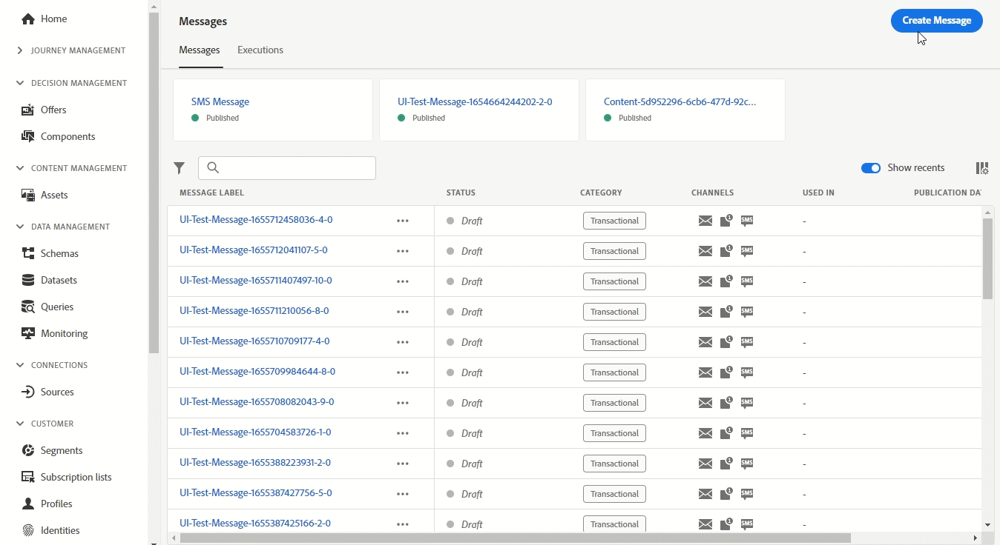

# Versionshinweise 2022 {#release-notes-2022}

Auf dieser Seite sind alle Funktionen und Verbesserungen für [!DNL Journey Optimizer] aufgeführt, die im Jahr 2022 veröffentlicht wurden.

## Version September 2022{#sept-2022-release}

### Neue Funktionen{#sept-2022-features}

<table>
<thead>
<tr>
<th><strong>Dynamischer Inhalt und neuer Builder für bedingte Regeln</strong> </th>
</tr>
</thead>
<tbody>
<tr>
<td>

Sie können jetzt dynamische Inhalte erstellen, um den Inhalt Ihrer Nachrichten basierend auf bedingten Regeln anzupassen.
 

Bedingte Regeln werden mit einem visuellen Regel-Builder im Ausdruckseditor erstellt, in dem Sie sie zur weiteren Wiederverwendung in Ihren Journeys und Kampagnen speichern können.

Weitere Informationen finden Sie in der <a href="../personalization/get-started-dynamic-content.md">detaillierten Dokumentation</a>.
</td>
</tr>
</tbody>
</table>

<table>
<thead>
<tr>
<th><strong>API-ausgelöste Kampagnen</strong> </th>
</tr>
</thead>
<tbody>
<tr>
<td>

Zusätzlich zu bereits geplanten Kampagnen können Sie jetzt API-ausgelöste Kampagnen in Journey Optimizer erstellen und diese über APIs von einem externen System aus aufrufen.

Auf diese Weise können Sie Nutzungsszenarien mit verschiedenen operativen und Transaktionsnachrichten abdecken, wie z. B. das Zurücksetzen von Kennwörtern, OTP-Token usw.

Weitere Informationen finden Sie in der <a href="../campaigns/api-triggered-campaigns.md">detaillierten Dokumentation</a>.
</td>
</tr>
</tbody>
</table>

<table>
<thead>
<tr>
<th><strong>Datenzugriffssteuerung</strong> </th>
</tr>
</thead>
<tbody>
<tr>
<td>

Durch die attributbasierte Zugriffssteuerung können Admins den Zugriff auf bestimmte Objekte auf der Grundlage bestimmter Attribute steuern. Bei diesen Attributen kann es sich um Metadaten handeln, die einem Objekt hinzugefügt werden, wie z. B. Beschriftungen. Ab dieser Version können Admins auch Benutzerrollen definieren, die nur Zugriff auf bestimmte Felder und/oder Objekte haben, sowie auf Daten, die diesen Feldern und/oder Objekten entsprechen.

 Die Verwendung der attributbasierten Zugriffssteuerung ist derzeit auf ausgewählte Kundinnen und Kunden beschränkt und wird in einer zukünftigen Version für alle Umgebungen bereitgestellt.

Weitere Informationen finden Sie in der <a href="../administration/object-based-access.md">detaillierten Dokumentation</a>.
</td>
</tr>
</tbody>
</table>

<table>
<thead>
<tr>
<th><strong>Data Governance und Datenschutz</strong> </th>
</tr>
</thead>
<tbody>
<tr>
<td>

Mit dem Governance-Framework Data Usage Labeling and Enforcement (DULE) kann Journey Optimizer jetzt Governance-Richtlinien von Adobe Experience Platform nutzen, um zu verhindern, dass sensible Felder durch benutzerdefinierte Aktionen in Drittanbieter-Systeme exportiert werden. Wenn das System in den benutzerdefinierten Aktionsparametern ein eingeschränktes Feld identifiziert, wird ein Fehler angezeigt, der die Veröffentlichung der Journey verhindert.

Die Verwendung von Data Usage Labeling and Enforcement (DULE) ist derzeit auf ausgewählte Kundinnen und Kunden beschränkt und wird in einer zukünftigen Version für alle Umgebungen bereitgestellt.

Weitere Informationen finden Sie in der <a href="../action/action-privacy.md">detaillierten Dokumentation</a>.
</td>
</tr>
</tbody>
</table>

<table>
<thead>
<tr>
<th><strong>Automatisierte Durchsetzung von Einverständniserklärungen (Einverständnisrichtlinien)</strong> </th>
</tr>
</thead>
<tbody>
<tr>
<td>

Mit Adobe Experience Platform können Sie einfach Marketing-Richtlinien übernehmen und durchsetzen, um die Einverständnispräferenzen Ihrer Kunden zu respektieren. Einverständniserklärungen werden in Adobe Experience Platform definiert. In Journey Optimizer können Sie diese Einverständniserklärungen auf Ihre benutzerdefinierten Aktionen anwenden. Beispielsweise können Sie Einverständniserklärungen definieren, um Kundinnen und Kunden auszuschließen, die dem Empfang von E-Mail-, Push- oder SMS-Nachrichten nicht zugestimmt haben.

Die automatisierte Durchsetzung von Einverständniserklärungen ist derzeit nur für Organisationen verfügbar, die das Add-on Healthcare Shield erworben haben.

Weitere Informationen finden Sie in der <a href="../action/consent.md">detaillierten Dokumentation</a>.
</td>
</tr>
</tbody>
</table>

<table>
<thead>
<tr>
<th><strong>Berechtigungsverwaltung</strong> </th>
</tr>
</thead>
<tbody>
<tr>
<td>

Journey Optimizer unterstützt das Definieren von Benutzerrollen und Zugriffsrichtlinien zum Verwalten von Berechtigungen für Funktionen und Objekte. Über <strong>Adobe Experience Cloud-Berechtigungen</strong> können Sie Rollen erstellen und verwalten sowie die gewünschten Ressourcenberechtigungen für diese Rollen zuweisen. Mit Berechtigungen können Sie auch die Bezeichnungen, Sandboxes und Benutzende verwalten, die einer bestimmten Rolle zugeordnet sind.

 Die Verwendung von Berechtigungen ist derzeit auf ausgewählte Kundinnen und Kunden beschränkt und wird in einer zukünftigen Version für alle Umgebungen bereitgestellt.

Weitere Informationen finden Sie in der <a href="../administration/attribute-based-access.md">detaillierten Dokumentation</a>.
</td>
</tr>
</tbody>
</table>

<table>
<thead>
<tr>
<th><strong>Alarmierung und Überwachung</strong> </th>
</tr>
</thead>
<tbody>
<tr>
<td>

Als Journey Optimizer-Benutzende können Sie jetzt über die Benutzeroberfläche auf Systemwarnungen zugreifen, um Benachrichtigungen zu erhalten, wenn Journeys nicht wie erwartet funktionieren. Sie können die verfügbaren Warnhinweise einsehen und abonnieren. Der erste Warnhinweis, der mit dieser Version verfügbar ist, warnt Sie, wenn eine Aktivität vom Typ „Segment lesen“ innerhalb des festgelegten Zeitraums kein Profil verarbeitet hat. Weitere werden folgen, sobald dieser Workflow freigeschaltet ist.

Weitere Informationen finden Sie in der <a href="../reports/alerts.md">detaillierten Dokumentation</a>.
</td>
</tr>
</tbody>
</table>

<!--table>
<thead>
<tr>
<th><strong>Data Hygiene</strong> </th>
</tr>
</thead>
<tbody>
<tr>
<td>

Adobe Experience Platform provides a suite of data hygiene capabilities that allow you manage your stored data through programmatic deletions of consumer records and datasets. This capability is now available for Adobe Journey Optimizer. 

You can manage your data stores to ensure that information is used as expected, is updated when incorrect data needs fixing, and is deleted when organizational policies deem it necessary.

<strong>Caution</strong> - Data Hygiene capabilities are currently only available for organizations that have purchased the Healthcare Shield add-on offering.

For more information, refer to the <a href="../building-journeys/read-segment.md#configuring-segment-trigger-activity">detailed documentation</a>.
</td>
</tr>
</tbody>
</table-->

### Verbesserungen{#sept-2022-improvements}

**Journeys**

* Der **Entitätsdatensatz** ist jetzt als vordefinierter Datensatz in Adobe Journey Optimizer verfügbar. Dieser Lookup-Datensatz enthält Metadaten, um die Informationen der Tracking- und Feedback-Datensätze zu erweitern. Auf diese Weise können Sie Ihre Berichte und Abfragen mit leichter verständlichen Daten verbessern. [Weitere Informationen](../data/datasets-query-examples.md#entity-dataset)
* Eine neue Sicherheitseinrichtung wurde zu unitären Journeys hinzugefügt (beginnend mit einem Ereignis oder einer Segmentqualifikation), um zu verhindern, dass Journeys fälschlicherweise mehrfach für dasselbe Ereignis ausgelöst werden. Der erneute Profileintritt wird jetzt standardmäßig fünf Minuten lang vorübergehend blockiert. [Weitere Informationen](../start/guardrails.md#events-g)

**Administration**

* Beim Aktivieren oder Deaktivieren der Zulassungsliste wird nun eine neue Warnung mit Details zu den Auswirkungen jeder Aktion angezeigt. [Weitere Informationen](../configuration/allow-list.md#enable-allow-list)
* Die Benutzeroberfläche zum Erstellen von Kanaloberflächen, zum Erstellen von IP-Pools, zum Verwalten der Unterdrückungsliste und der Zulassungsliste sowie zum Konfigurieren des SMS-Kanals wurde aktualisiert.
* Beim Erstellen der ersten Kanaloberfläche für eine bestimmte Subdomain beträgt die Verarbeitungszeit 10 Minuten bis 10 Tage und bei nachfolgenden Oberflächen, die diese Subdomain verwenden, nur noch bis zu 3 Stunden. [Weitere Informationen](../configuration/channel-surfaces.md#create-channel-surface)
* Die Benutzeroberfläche zum Erstellen von Landingpage-Voreinstellungen und Landingpage-Subdomains wurde aktualisiert. [Weitere Informationen](../configuration/lp-subdomains.md)

**Audit-Kontrollen**

* Mit Journey Optimizer können Sie die von den Nutzenden im System durchgeführten Aktionen für verschiedene Services und Funktionen wie Kampagnen, Journeys, Nachrichten, Landingpages usw. ermitteln. Audit-Protokoll-Ressourcen enthalten jetzt Änderungen an verschiedenen anderen Aktionen und werden automatisch aufgezeichnet, wenn die Aktivität stattfindet. Weiterführende Informationen finden Sie auf [dieser Seite](../privacy/audit-logs.md).

**Archivierungsunterstützung**

* Der neue **Entitätsdatensatz** enthält ein Vorlagenfeld, mit dem Sie das Format und die Struktur der gesendeten Nachrichten zu Archivierungszwecken in alle Kanäle exportieren können. [Weitere Informationen](../configuration/archiving-support.md)

**Landingpages**

* Sie können jetzt kontextbezogene Daten verwenden, die von einer anderen Seite innerhalb derselben Landingpage stammen. Wenn Sie beispielsweise ein Kontrollkästchen mit einer Abonnementliste auf der primären Landingpage verknüpfen, können Sie diese Abonnementliste auf der Unterseite „Vielen Dank“ verwenden. [Weitere Informationen](../landing-pages/lp-content.md#use-primary-page-context)

<!--* When configuring the primary page, you can now create additional data to enable storing information when the landing page is being submitted. [Learn more](../landing-pages/lp-content.md#use-additional-data)-->

<!--* You can now use information that was submitted on a landing page to send communications to your customers. For example, if a user subscribes to a given subscription list, you can leverage that information to send an email recommending other subscription lists to that user.-->

### Weitere Änderungen{#sept-2022-other}

* Der Journey-Burst-Modus wurde durch den Kampagnen-Schnellversand-Modus ersetzt. [Weitere Informationen](../campaigns/create-campaign.md#rapid-delivery)
* Um die Leistung zu verbessern, können Feldergruppen für Erlebnisereignisse nicht mehr in Journeys verwendet werden, die mit einem Lesesegment, einer Segmentqualifikation oder einer Geschäftsereignisaktivität beginnen. Diese Änderung gilt nur für neue Journeys. Bestehende Journeys behalten das aktuelle Verhalten bei. [Weitere Informationen](../start/guardrails.md#expression-editor)
* Die 1-Stunden-Beschränkung für geplante Segment-Lese-Journeys wurde entfernt. Diese Journeys können jetzt ohne Verzögerung ausgeführt werden.

## Version August 2022 {#aug-2022-release}

### Neue Funktionen

<table>
<thead>
<tr>
<th><strong>Erstellen und Verwalten von Kampagnen in Journey Optimizer</strong> </th>
</tr>
</thead>
<tbody>
<tr>
<td>

Verwenden Sie Journey Optimizer-Kampagnen, um mithilfe verschiedener Kanäle einmalige Inhalte für ein bestimmtes Segment bereitzustellen. Bei der Verwendung von Journeys sind Aktionen so konzipiert, dass sie der Reihe nach ausgeführt werden. Bei Kampagnen werden die Aktionen gleichzeitig ausgeführt, entweder sofort oder nach einem bestimmten Zeitplan. 

Wie Sie eine Kampagne erstellen, erfahren Sie in der <a href="../campaigns/get-started-with-campaigns.md">ausführlichen Dokumentation</a> und im <a href="https://video.tv.adobe.com/v/346680">Funktionsvideo</a>.
</td>
</tr>
</tbody>
</table>

<table>
<thead>
<tr>
<th><strong>SMS-Versand an Ihre Nutzer und Nutzerinnen (allgemeine Verfügbarkeit)</strong> </th>
</tr>
</thead>
<tbody>
<tr>
<td>

Sie können jetzt SMS in Journey Optimizer erstellen, personalisieren und senden, indem Sie eine Integration mit <b>Sinch</b> oder <b>Twilio</b> vornehmen.

In dieser <a href="../sms/create-sms.md">detaillierten Dokumentation</a> erfahren Sie, wie Sie eine SMS erstellen und senden.

</td>
</tr>
</tbody>
</table>

<!--table>
<thead>
<tr>
<th><strong>New Dynamic Expression Builder</strong> </th>
</tr>
</thead>
<tbody>
<tr>
<td>

You can now create conditional content blocks across different authoring services to personalize your content.

In addition to the Personalization Expression Library, the Expression Editor provides a new Conditional Rule Builder to help you design and save your content blocks.

For more information, refer to the <a href="../building-journeys/read-segment.md#configuring-segment-trigger-activity">detailed documentation</a>.
</td>
</tr>
</tbody>
</table-->

### Verbesserungen

**Reporting**

* Die Tabelle und das Diagramm zu den Einverständnisrichtlinien sind jetzt in den globalen Journey-Berichten verfügbar. Mit diesen Widgets können Sie die von den Richtlinien ausgeschlossenen Profile in Ihren benutzerdefinierten Aktionen verfolgen. [Weitere Informationen](../reports/journey-global-report.md#journey-global)

   Um Zugriff auf die neuesten Widgets zu erhalten, müssen Sie die verschiedenen Reporting-Dashboards zurücksetzen. Weitere Informationen zur Anpassung von Dashboards finden Sie in [der ausführlichen Dokumentation](../reports/global-report.md).

**Administration**

* Es ist jetzt möglich, die primäre Telefonnummer für den SMS-Kanal zu aktualisieren. [Weitere Informationen](../configuration/primary-email-addresses.md)

## Version Juli 2022 {#july-2022-release}

### Neue Funktionen

<table>
<thead>
<tr>
<th><strong>Neuer Fluss für Inline-Messaging</strong> </th>
</tr>
</thead>
<tbody>
<tr>
<td>

Journey Optimizer bietet einen neuen Fluss für die Nachrichtenbearbeitung in Journeys. Das Inline-Messaging spart Benutzenden viel Zeit und optimiert den Workflow-Prozess zum Erstellen und Versand einer E-Mail, einer Push-Benachrichtigung oder einer SMS in Journey Optimizer. Wenn Sie Nachrichten als separaten Schritt entfernen und sie stattdessen im Rahmen einer Journey-Arbeitsfläche bearbeitbar machen möchten, müssen Benutzende auf weniger Schaltflächen klicken und durch weniger Bildschirme navigieren, um Inhalte zu entwerfen und zu bearbeiten.

</td>
</tr>
</tbody>
</table>

<table>
<thead>
<tr>
<th><strong>Attributbasierte Zugriffssteuerung (begrenzte Verfügbarkeit)</strong> </th>
</tr>
</thead>
<tbody>
<tr>
<td>

Sie können jetzt Schemafelder mit Bezeichnungen identifizieren, die Organisations- oder Datennutzungsbereiche definieren. Admins können über die Benutzeroberfläche „Berechtigungen“ Zugriffsrichtlinien für XDM-Schemafelder definieren und den Zugriff für Benutzende oder Benutzergruppen (interne, externe oder Drittbenutzende) besser verwalten sowie den Zugriff auf bestimmte Datentypen (d. h. sensible personenbezogene Daten/SPD) verwalten.

Die Verwendung der attributbasierten Zugriffssteuerung ist derzeit auf ausgewählte Benutzende beschränkt und wird in einer zukünftigen Version für alle Umgebungen bereitgestellt.

Weitere Informationen finden Sie in der <a href="../administration/attribute-based-access.md">detaillierten Dokumentation</a>.

</td>
</tr>
</tbody>
</table>

<table>
<thead>
<tr>
<th><strong>Batch-Entscheidungsvorgänge</strong> </th>
</tr>
</thead>
<tbody>
<tr>
<td>

Sie können jetzt Batch-Entscheidungsvorgänge über die Benutzeroberfläche ausführen, sodass niemand mit Entwicklungskenntnissen benötigt wird, um Batch-API-Vorgänge auszuführen, und die für das Marketing benötigte Zeit verkürzt wird. Mit dieser neuen Benutzeroberfläche können Sie Vorgänge erstellen und aktuelle/frühere Vorgänge verwalten.

Weitere Informationen finden Sie in der <a href="../offers/batch-delivery.md">detaillierten Dokumentation.

</td>
</tr>
</tbody>
</table>

<table>
<thead>
<tr>
<th><strong>Automatisches Verwenden des Angebots mit der besten Leistung bei Ihren Entscheidungen (begrenzte Verfügbarkeit)</strong> </th>
</tr>
</thead>
<tbody>
<tr>
<td>

Sie können jetzt personalisierte Optimierungsmodellsysteme im Entscheidungs-Management verwenden. Dieser neue Modelltyp ermöglicht die Optimierung und Personalisierung von Angeboten basierend auf Segmenten und der Angebotsleistung.

Die Verwendung personalisierter KI-Modelle zur Optimierung ist derzeit auf ausgewählte Benutzende beschränkt und wird in einer zukünftigen Version in allen Umgebungen bereitgestellt.

Weitere Informationen finden Sie in der <a href="../offers/ranking/personalized-optimization-model.md">detaillierten Dokumentation</a>.

</td>
</tr>
</tbody>
</table>

### Verbesserungen

**Journey**

* **Beenden einer Journey**: Auf der Journey-Arbeitsfläche wurde die Aktivität **Ende** aus der Palette entfernt. End-Tags werden jetzt standardmäßig am Ende jedes Pfades hinzugefügt und können nicht entfernt werden. Diese Verbesserung ermöglicht eine bessere Berichterstellung darüber, wo ein Kunde aus der Journey ausgestiegen ist, ohne dass die Person, die die Journey anwendet, Maßnahmen ergreifen muss. Weitere Informationen erhalten Sie in der [Dokumentation](../building-journeys/end-journey.md) und im [Funktionsvideo](https://video.tv.adobe.com/v/345376){target=&quot;_blank&quot;}.

* Die Option **Zeitzone des Profils** ist jetzt in den Journey-Eigenschaften standardmäßig deaktiviert. [Weitere Informationen](../building-journeys/timezone-management.md#timezone-from-profiles)

**Nachrichten**

* Nachrichtenvoreinstellungen sind jetzt **Kanaloberflächen**. [Weitere Informationen](../configuration/channel-surfaces.md)

**Administration**

* **Bearbeitung von PTR-Einträgen**: Beim Aktualisieren eines PTR-Eintrags dauert die Verarbeitungszeit nur bis zu 3 Stunden. [Weitere Informationen](../configuration/ptr-records.md#processing)

* **Zulassungsliste per Benutzeroberfläche**: Sie können jetzt die Journey Optimizer-Benutzeroberfläche verwenden, um neue E-Mail-Adressen oder Domains zur Zulassungsliste hinzuzufügen. [Weitere Informationen](../configuration/allow-list.md)

* **Aktualisierung der Zulassungslistenlogik**: Die Logik der Zulassungsliste gilt nun, sobald die Funktion aktiviert ist, selbst wenn die Liste leer ist. [Weitere Informationen](../configuration/allow-list.md#logic)

* **URL-Tracking-Parameter**: Sie können jetzt den Ausdruckseditor verwenden, um URL-Tracking-Parameter auf Ihren E-Mail-Oberflächen (d. h. in den Voreinstellungen) zu konfigurieren. [Weitere Informationen](../email/email-settings.md#url-tracking)

**Entscheidungs-Management**

* **Audience-Größe**: In der Benutzeroberfläche wird jetzt als neue Komponente eine Schätzung der Audience-Größe angezeigt, wenn eine Entscheidungsregel erstellt wird, ein Segment oder eine Regel zum Festlegen einer Angebotseignung ausgewählt wird oder ein Segment oder eine Regel zu einem Entscheidungsbereich hinzugefügt wird.

## Version Juni 2022 {#june-2022-release}

### Neue Funktionen

<table>
<thead>
<tr>
<th><strong>SMS an Ihre Benutzer senden (begrenzte Verfügbarkeit)</strong> </th>
</tr>
</thead>
<tbody>
<tr>
<td>

Sie können jetzt SMS in Journey Optimizer erstellen, personalisieren und senden, indem Sie eine Integration mit <b>Sinch</b> oder <b>Twilio</b> vornehmen.

<!--img src="assets/do-not-localize/SMS.gif"/-->

Der SMS-Kanal ist derzeit nur für eine Reihe von ausgewählten Organisationen verfügbar (eingeschränkte Verfügbarkeit). Weitere Informationen erhalten Sie beim Adobe-Support.

In dieser <a href="../sms/create-sms.md">detaillierten Dokumentation</a> erfahren Sie, wie Sie eine SMS erstellen und senden.

</td>
</tr>
</tbody>
</table>

<table>
<thead>
<tr>
<th><strong>Schnellere Suche nach effektiveren Bildern mit Adobe Stock-Integration</strong> </th>
</tr>
</thead>
<tbody>
<tr>
<td>

Das Plug-in für die Integration von Email Designer mit Adobe Stock und Adobe Journey Optimizer bietet Kunden eine einfache Möglichkeit, zur Verwendung bei der Nachrichtenbearbeitung durch Bilder zu navigieren, sie zu lizenzieren und sie zu speichern.   Die neue Option <b>Ähnliche Stock-Fotos suchen</b> ermöglicht es Ihnen auch, Stock-Fotos zu finden, die mit Inhalt, Farbe und Komposition Ihrer Bilder übereinstimmen. 

<!--img src="assets/do-not-localize/stock-rn.gif"/-->

Weitere Informationen finden Sie in der <a href="../email/stock.md">detaillierten Dokumentation</a>.

</td>
</tr>
</tbody>
</table>

<table>
<thead>
<tr>
<th><strong>Verwenden von E-Mail-BCC für alle Ihre E-Mails</strong> </th>
</tr>
</thead>
<tbody>
<tr>
<td>

Sie können jetzt die Funktion „E-Mail-BCC“ (Blind Carbon Copy) verwenden, um von Adobe Journey Optimizer gesendete E-Mails zu speichern. Aktivieren Sie diese Option in Ihren E-Mail-Voreinstellungen, damit jede gesendete E-Mail in Blindkopie an Ihre BCC-Adresse gesendet wird.

<!--img src="assets/do-not-localize/bcc-rn.gif"/-->

Weitere Informationen finden Sie in der <a href="../configuration/archiving-support.md#bcc-email">detaillierten Dokumentation</a>.

</td>
</tr>
</tbody>
</table>

<!--<table>
<thead>
<tr>
<th><strong>Automatically use the best performing offer in your decisions</strong> </th>
</tr>
</thead>
<tbody>
<tr>
<td>

You can now use personalized optimization model systems in Decision Management. This new type of model allows you to optimize and personalize offers based on segments and offer performance.

The use of personalized optimization AI models is currently restricted to selected users, and will be deployed to all environments in a future release.

For more information, refer to the <a href="../offers/ranking/personalized-optimization-model.md">detailed documentation</a>.

</td>
</tr>
</tbody>
</table>-->

<table>
<thead>
<tr>
<th><strong>Kopieren von Objekten zwischen Sandboxes</strong> </th>
</tr>
</thead>
<tbody>
<tr>
<td>

Sie können jetzt die Erlebnisse von einer Journey Optimizer-Sandbox in einer anderen neu erstellen, z. B. von einer Nicht-Produktions-Sandbox zu einer Produktions-Sandbox. Diese neue Funktion kopiert eine ganze Journey, einschließlich aller Objekte, von denen die Journey abhängig ist, um korrekt ausgeführt zu werden, von einer Umgebung in eine andere. Zusätzlich zu Journeys können Sie auch andere Komponenten kopieren, z. B. Angebote, Nachrichten, Schemata, Datensätze, Datenquellen, Ereignisse und Aktionen.

Weitere Informationen finden Sie in der <a href="../building-journeys/copy-to-sandbox.md">detaillierten Dokumentation</a>.
</td>
</tr>
</tbody>
</table>

### Verbesserungen

**Entscheidungs-Management**

* **Unterstützung von HTML- und JSON-Dateien**: Sie können jetzt per Drag-and-Drop externe HTML- und JSON-Dateien aus der Asset-Bibliothek von Adobe Experience Cloud in den Inhalt der Angebotsdarstellung ziehen. [Weitere Informationen](../offers/offer-library/add-representations.md#html-json)

**E-Mail**

* **Als Vorlage speichern**: Sie können jetzt E-Mail-Inhalte als Vorlage speichern und sie bei der Erstellung anderer Nachrichten wiederverwenden. [Weitere Informationen](../email/email-templates.md)

**Administration**

* **Vorschau von Tracking-URL-Parametern**: Wenn Sie bei der Konfiguration einer Nachrichtenvoreinstellung URL-Tracking-Parameter definieren, wird jetzt eine dynamische Vorschau der resultierenden Tracking-URL angezeigt. [Weitere Informationen](../email/email-settings.md#url-tracking)

* **Nachrichtenvoreinstellungsbearbeitung** – Beim Aktualisieren einer Nachrichtenvoreinstellung kann die Verarbeitungszeit jetzt nur noch maximal 3 Stunden dauern. [Weitere Informationen](../configuration/channel-surfaces.md#edit-channel-surface)

* **IP-Pool-Bearbeitung** – Beim Aktualisieren eines IP-Pools kann die Verarbeitungszeit jetzt nur noch maximal 3 Stunden dauern. [Weitere Informationen](../configuration/ip-pools.md#edit-ip-pool)

## Version Mai 2022 {#may-2022-release}

### Neue Funktionen

<table>
<thead>
<tr>
<th><strong>Häufigkeitsregeln für Nachrichten</strong> </th>
</tr>
</thead>
<tbody>
<tr>
<td>

Sie können jetzt kanalübergreifende Geschäftsregeln festlegen, mit denen Profile, die zu oft angesprochen wurden, automatisch aus Nachrichten und Aktionen ausgeschlossen werden.

<!--img src="assets/do-not-localize/frequency-rn.gif"/-->

Weitere Informationen finden Sie in der <a href="../configuration/frequency-rules.md">detaillierten Dokumentation</a>.

</td>
</tr>
</tbody>
</table>

<table>
<thead>
<tr>
<th><strong>Entscheidungs-Management – Modell zur automatischen Optimierung des KI-Rankings</strong> </th>
</tr>
</thead>
<tbody>
<tr>
<td>

Sie können jetzt trainierte Modellsysteme im Entscheidungs-Management verwenden. Mit dieser neuen Funktion wird eine Rangliste der Angebote erstellt, die für ein bestimmtes Profil angezeigt werden.

<!--img src="assets/do-not-localize/optimization.gif"/-->

Weitere Informationen finden Sie in der <a href="../offers/offer-activities/configure-offer-selection.md#use-ranking-strategy">detaillierten Dokumentation</a>.

</td>
</tr>
</tbody>
</table>

<!--table>
<thead>
<tr>
<th><strong>Attribute-based Access Control (ABAC)</strong> </th>
</tr>
</thead>
<tbody>
<tr>
<td>

Permission management in Journey Optimizer has been extended to data access. You can now manage data access for specific teams or groups of users (i.e. internal, external, 3rd parties) ​and manage access to specific types of data (i.e. Sensitive Personal Data/SPD).

This capability is available for a limited set of customers.

For more information, refer to the <a href="../landing-pages/create-lp.md">detailed documentation</a>.

</td>
</tr>
</tbody>
</table-->

<table>
<thead>
<tr>
<th><strong>Journey Optimizer-Auditprotokolle</strong> </th>
</tr>
</thead>
<tbody>
<tr>
<td>

Sie können jetzt Aktionen überwachen, die von Benutzern auf Adobe Journey Optimizer-Ressourcen ausgeführt werden.

<!--img src="assets/do-not-localize/audit-rn.gif"/-->

Weitere Informationen finden Sie in der <a href="../privacy/audit-logs.md">detaillierten Dokumentation</a>.

</td>
</tr>
</tbody>
</table>

### Verbesserungen

**Personalisierung**

* **Neue Hilfsfunktion für ausgeblendete Zeichen**: Mit der Hilfsfunktion `mask` können Sie einen Teil einer Zeichenfolge durch „X“-Zeichen ersetzen. [Weitere Informationen](../personalization/functions/string.md#mask)

**Landingpages**

* **Landingpages ohne Formular**: Sie können jetzt eine Landingpage erstellen und veröffentlichen, die kein Formular enthält und keine Aktion von Besuchern erfordert.
* **Landingpage-Vorlagen**: Sie können jetzt eine Landingpage als Vorlage speichern und sie bei der Erstellung anderer Landingpages wiederverwenden. [Weitere Informationen](../landing-pages/lp-templates.md)
* **Zurück zur primären Seite**: Sie können nun von einer beliebigen Unterseite innerhalb derselben Landingpage aus einen Link zur primären Seite hinzufügen.
* **Unterstützung von benutzerdefiniertem JavaScript**: Sie können jetzt benutzerdefinierten JavaScript-Code zu Ihren Landingpage-Inhalten hinzufügen, um erweiterte Formatierungen durchzuführen oder Ihren Landingpages benutzerspezifische Verhaltensweisen hinzuzufügen.    [Weitere Informationen](../landing-pages/lp-custom-js.md)

**Journey**

* **Segment lesen**: Einmalige Journeys mit dem Schritt „Segment lesen“ gehen jetzt 30 Tage nach der Ausführung der Journey in den Status „Beendet“ über. Folgt der Schritt „Segment lesen“ einem Zeitplan, wird er 30 Tage nach der letzten Ausführung beendet. [Weitere Informationen](../building-journeys/read-segment.md)
* **Ausdruckseditor**: Die Funktion [Limit](../building-journeys/functions/functionlimit.md) wurde hinzugefügt, um die Anzahl der Elemente einer Liste zu begrenzen. Mit der Funktion [Sortierung](../building-journeys/functions/functionsort.md) können Sie jetzt ein Listenobjekt sortieren. Die Unterstützung von listObject wurde auch den Funktionen [distinct](../building-journeys/functions/functiondistinct.md) und [distinctWithNull](../building-journeys/functions/functiondistinctwithnull.md) hinzugefügt.

**Administration**

* **Aktualisierung des Lizenznutzungs-Dashboards**: Das in der Benutzeroberfläche von [!DNL Adobe Journey Optimizer] verfügbare Lizenznutzungs-Dashboard entspricht nun dem genauen Wert für die **lizenzierte** durchschnittliche Reichweite des Profils. In dieser Metrikdarstellung wird ein Rückgang angezeigt, was bedeutet, dass die Lizenzbeschränkung jetzt korrekt gemeldet wird. [Weitere Informationen](../segment/license-usage.md)

## Version April 2022 {#april-2022-release}

### Verbesserungen

**Landingpages**

* **Neue Option für Opt-in-/Opt-out-Kontrollkästchen** - Sie können jetzt ein einziges Kontrollkästchen für das Opt-in/Opt-out in Abonnement-Landingpages einfügen. Benutzer müssen das Kontrollkästchen aktivieren, um ihr Einverständnis zu erteilen (Opt-in), und es deaktivieren, um ihr Einverständnis zurückzuziehen (Opt-out). [Weitere Informationen](../landing-pages/design-lp.md#define-lp-specific-content)

* **Vorausfüllen von Feldern auf Landingpages** - Benutzer können jetzt die Felder auf der Landingpage mit Profilinformationen befüllen. [Weitere Informationen](../landing-pages/create-lp.md#configure-primary-page)

**Entscheidungs-Management**

* **Edge Decisioning-API** – Die Edge Decisioning-API kann personalisierte Angebote bereitstellen und rendern, die im Entscheidungs-Management verwaltet werden. Sie können Ihre Angebote und andere verwandte Objekte über APIs oder die Benutzeroberfläche (UI) des Entscheidungs-Managements erstellen. [Weitere Informationen](../offers/api-reference/offer-delivery-api/edge-decisioning-api.md)

**Administration**

* **PTR-Sendedauer** - PTR-Bearbeitungen werden nun nach ein paar Stunden wirksam. [Weitere Informationen](../configuration/ptr-records.md#processing)

**E-Mail-Design**

* **20 neue E-Mail-Vorlagen** sind jetzt verfügbar, um E-Mail-Inhalte in Journey Optimizer zu erstellen.

**Benutzeroberfläche**

* **Kontexthilfe in der Benutzeroberfläche von Journey Optimizer** - Auf mehreren Seiten in Journey Optimizer wurden Links zur Kontexthilfe hinzugefügt. Wenn verfügbar, klicken Sie auf das Symbol „i“, um eine kurze Beschreibung der aktuellen Funktion anzuzeigen und auf zugehörige Artikel zuzugreifen.

**Integration mit Adobe Campaign Standard**

Als Adobe Campaign Standard-Kunde können Sie jetzt mit Journey Optimizer E-Mails, Push-Benachrichtigungen und SMS versenden. Verwenden Sie die neuen integrierten Aktionen, um die Funktionen für den Transaktionsnachrichtenversand von Campaign Standard in Journey Optimizer zu nutzen.  [Weitere Informationen](../action/acs-action.md)

<!--
### Fixes

* Fixed an issue which caused tracking reports not to be available as the `JourneyActionId` was not properly populated. PLATIR-19854, CJM-26006
* Fixed an error on business events which could block the journey publication. CJM-25931
* Fixed an issue which could prevent images in Email Designer templates from being displayed. PLATIR-18176, CJM-25008
-->

## Version März 2022 {#march-2022-release}

### Verbesserungen

**Journey**

* Um im einheitlichen Profilschema unnötige Felder zu vermeiden, ist das Schema „Journey-Schrittereignisse“ nicht mehr standardmäßig für Profile aktiviert. Bei Bedarf können Sie es aktivieren. [Weitere Informationen](../reports/sharing-overview.md)
* Neue Schrittereignisse im Zusammenhang mit Exportvorgängen werden jetzt von Journey Optimizer an Adobe Experience Platform gesendet. Beispiele für Abfragen wurden der Dokumentation hinzugefügt. [Weitere Informationen](../reports/query-examples.md)

**Entscheidungs-Management**

* Sie können jetzt definieren, ob die Angebotsbegrenzung für alle Benutzer oder für ein bestimmtes Profil bzw. für alle Platzierungen oder nur für eine einzeln Platzierung gelten soll. [Weitere Informationen](../offers/offer-library/add-constraints.md#capping)
* Mit der Batch Decisioning-API können Unternehmen die Funktionalität des Entscheidungs-Managements für alle Profile in einem bestimmten Segment in einem einzigen Aufruf verwenden. Der Angebotsinhalt für jedes Profil im Segment wird in einem AEP-Datensatz platziert, wo er für benutzerdefinierte Batch-Workflows zur Verfügung steht. [Weitere Informationen](../offers/api-reference/offer-delivery-api/batch-decisioning-api.md)

**Administration**

* Sie können jetzt den Abmelde-Link im E-Mail-Header auf der Voreinstellungsebene der Nachricht aktivieren/deaktivieren und eine benutzerdefinierte Abmelde-URL auf Nachrichtenebene festlegen. [Weitere Informationen](../configuration/channel-surfaces.md#list-unsubscribe)
* Die Zulassungsliste kann jetzt über die [!DNL Journey Optimizer]-Benutzeroberfläche für Produktions- und Nicht-Produktions-Sandboxes aktiviert und deaktiviert werden. [Weitere Informationen](../configuration/allow-list.md#enable-allow-list)

**Personalisierung**

* Sie können jetzt mehr als 40 Personalisierungsausdrücke in der Bibliothek speichern. [Weitere Informationen](../personalization/personalization-library.md)

## Version Februar 2022 {#feb-2022-release}

### Neue Funktionen

<table>
<thead>
<tr>
<th><strong>Landingpages für Abonnements</strong> </th>
</tr>
</thead>
<tbody>
<tr>
<td>

Sie können in Journey Optimizer jetzt Landingpages erstellen und gestalten und Ihre Benutzer zu Online-Formularen weiterleiten, über die sie sich für den Erhalt Ihrer Nachrichten anmelden oder abmelden oder einen bestimmten Service wie einen Newsletter abonnieren können.

Weitere Informationen finden Sie in der <a href="../landing-pages/create-lp.md">detaillierten Dokumentation</a> und in diesem <a href="../landing-pages/lp-use-cases.md">Anwendungsfall</a>.

</td>
</tr>
</tbody>
</table>

<table>
<thead>
<tr>
<th><strong>Neue Ausdrucksbibliothek für die Personalisierung</strong> </th>
</tr>
</thead>
<tbody>
<tr>
<td>

Journey Optimizer bietet jetzt eine Bibliothek, in der Sie auf vordefinierte Personalisierungsausdrücke zugreifen können. Diese Ausdrücke werden von Admin-Benutzern konfiguriert.

Weitere Informationen finden Sie in der <a href="../personalization/personalization-library.md">detaillierten Dokumentation</a>.

</td>
</tr>
</tbody>
</table>

<!--table>
<thead>
<tr>
<th><strong>API Developer Site and Suppression API</strong> </th>
</tr>
</thead>
<tbody>
<tr>
<td>

Journey Optimizer provide RESTful APIs that allow you to programmatically perform key operations in your applications.
Developer SDK for Journey Optimizer is now available with the Suppression API (beta).

With this API, you can control your outgoing messages using suppression and allow lists.
The suppression list helps you with honoring the ISPs' feedback to preserve sending IP reputation. The allow list helps you ensure that you send only to those email addresses which are in the allowed list, and typically to ensure that you don't send mails to customers from your development sandbox.

See <a href="https://developer.adobe.com/journey-optimizer-apis/">Adobe Journey Optimizer APIs</a>.

</td>
</tr>
</tbody>
</table-->

<table>
<thead>
<tr>
<th><strong>Übergeben von Informationen zur Nachverfolgung Ihrer Nachrichten mit UTM-Tracking-Parametern</strong> </th>
</tr>
</thead>
<tbody>
<tr>
<td>

In Nachrichteninhalten von Journey Optimizer können Sie jetzt UTM-Parameter zu Ihren Links hinzufügen. Diese können zusätzliche Daten zu diesem Link liefern und Ihnen dabei helfen herauszufinden, wo und warum eine Person auf Ihren Link geklickt hat.

Weitere Informationen finden Sie in der <a href="../configuration/channel-surfaces.md#configure-email-settings">detaillierten Dokumentation</a>.

</td>
</tr>
</tbody>
</table>

### Verbesserungen

**Journey**

* Um die Leistung zu optimieren, wechseln alle Journeys im Testmodus, die seit einer Woche nicht ausgelöst wurden, jetzt wieder in den Entwurfsstatus zurück. [Weitere Informationen](../building-journeys/testing-the-journey.md#important_notes)
* Die Integration zwischen Journey Optimizer und Adobe Campaign Classic wurde optimiert, um die Leistung zu verbessern. Die Standardkonfiguration für Begrenzungen wurde auf 4.000 Aufrufe/5 Minuten geändert.    [Weitere Informationen](../action/acc-action.md#important-notes)

**Berichterstellung**

* Sendungen können nun nach ihrem Status gefiltert werden:
   * In der Liste „Nachrichtenausführung“ können Sie jetzt Testsendungen aus der Versandliste ausschließen.
   * Bei Ihren Live-/Global-Berichten können Sie auswählen, ob Sie Testereignisse ausschließen möchten.

* Sie können jetzt auf Berichte zu Sendezeitoptimierungsdaten zugreifen: die Anzahl der Personen, die unmittelbar benachrichtigt wurden, und die Anzahl der Personen, die mit einer 1-Stunden-Optimierung, einer 2-Stunden-Optimierung usw. benachrichtigt wurden.

<!--* decision management reports are now available in Journey Optimizer. You can access the following metrics: Offers sent - Offers' impression rate - Offers' click rate - Breakdown report on Offers' sent.-->

**Entscheidungs-Management**

* Rangfolgen und KI-Rangfolgen werden jetzt in einer Registerkarte zusammengefasst.

## Version Januar 2022 {#january-2022-release}

### Neue Funktionen

<table>
<thead>
<tr>
<th><strong>Journeys – Optimales Aufwärmen Ihrer IP-Adressen mit Profilbegrenzungsbedingungen</strong> </th>
</tr>
</thead>
<tbody>
<tr>
<td>

Beim Konfigurieren einer <strong>Bedingungs</strong>-Aktivität in einer Journey können Sie jetzt eine Profilobergrenze festlegen. Dieser neue Bedingungstyp ermöglicht es Ihnen, eine Höchstzahl von Profilen für einen Journey-Pfad festzulegen. Wenn diese Grenze erreicht ist, folgen die eintretenden Profile einem alternativen Pfad. Auf diese Weise können Sie das Volumen Ihrer Sendungen erhöhen (IP-Ramp-up). Sie können beispielsweise Ihre Sendungen in einer Domain schrittweise ausführen, indem Sie die Ausführung aufteilen: Sie senden 1.000 Nachrichten am Tag 1, 2.000 am Tag 2 usw.

Weitere Informationen finden Sie in der <a href="../building-journeys/condition-activity.md#profile_cap">detaillierten Dokumentation</a> und in diesem <a href="../building-journeys/ramp-up-deliveries-uc.md">Anwendungsfall</a>.

</td>
</tr>
</tbody>
</table>

<table>
<thead>
<tr>
<th><strong>Journeys – Verbesserung beim Lesen von Segmenten</strong> </th>
</tr>
</thead>
<tbody>
<tr>
<td>

Die Option <strong>Inkrementelles Lesen</strong> wurde zu den wiederkehrenden <strong>Segment lesen</strong>-Aktivitäten hinzugefügt. Mit dieser Option haben Sie die Möglichkeit, nur die Personen anzusprechen, die seit der letzten Ausführung der Journey in das Segment eingetreten sind. Bei der ersten Ausführung sind immer alle Segmentmitglieder ausgewählt.

Weitere Informationen finden Sie in der <a href="../building-journeys/read-segment.md#configuring-segment-trigger-activity">detaillierten Dokumentation</a>.
</td>
</tr>
</tbody>
</table>

### Verbesserungen

**Journey**

* Step-Ereignisse von Journey Optimizer können jetzt mit anderen Datensätzen in [Adobe Customer Journey Analytics](https://experienceleague.adobe.com/docs/analytics-platform/using/cja-overview/cja-overview.html?lang=de) verknüpft werden. Das Feld **profileID** im integrierten Step-Ereignisschema einer Journey ist jetzt als Identitätsfeld definiert. [Weitere Informationen](../reports/sharing-overview.md#integration-cja)

**Entscheidungs-Management**

* Wenn Sie ein Angebot, ein Fallback-Angebot, eine Angebotssammlung oder eine Angebotsentscheidung aktualisieren, auf die direkt oder indirekt in einer veröffentlichten Nachricht verwiesen wird, werden die Aktualisierungen automatisch in der entsprechenden Nachricht angezeigt, ohne dass sie erneut veröffentlicht werden müssen. [Weitere Informationen](../offers/offers-e2e.md#insert-decision-in-email)

* Bei der Simulation, welche Angebote für ein bestimmtes Testprofil bereitgestellt werden sollen, können Sie jetzt die Standardsimulationseinstellungen ändern und den Code anzeigen, der Ihren Simulationen entspricht. Dieser Code kann zur Fehlerbehebung verwendet werden. [Weitere Informationen](../offers/offer-activities/simulation.md#define-simulation-settings)

**Administration**

* Administratoren können jetzt PTR-Einträge mit einer Subdomain bearbeiten, die mit CNAME eingerichtet ist. [Weitere Informationen](../configuration/ptr-records.md#edit-ptr-subdomains-cname)

**Personalisierung**

* **Zu Favoriten hinzufügen** – Um die Arbeit mit der Personalisierung effizienter zu gestalten, haben wir das Konzept des Speicherns von Favoriten eingeführt. Durch das Hinzufügen verschiedener Attribute zum Favoritenmenü erhalten Sie schnellen Zugriff auf die am häufigsten verwendeten Elemente. [Weitere Informationen](../personalization/personalize.md#fav)
