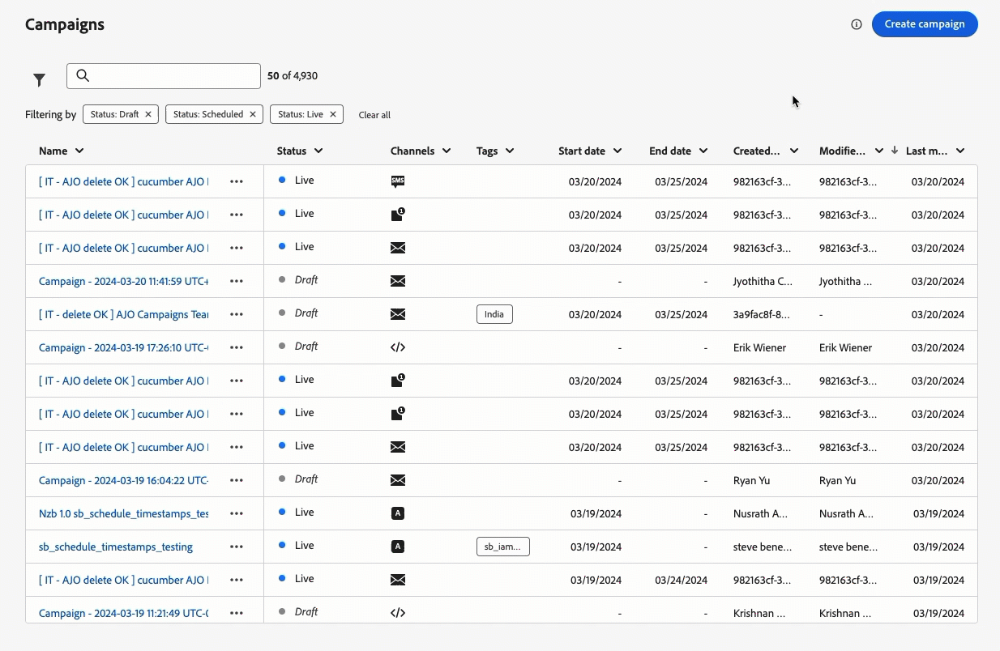
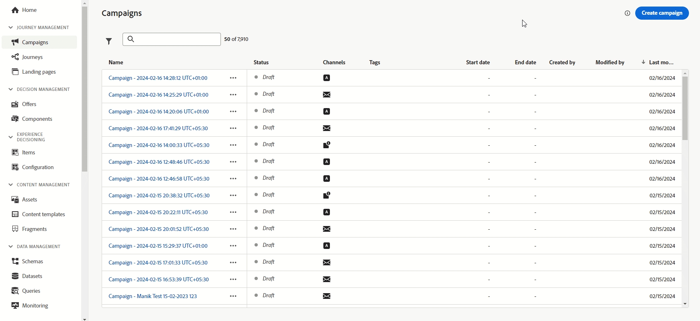

# Versionshinweise 2024 {#release-notes-2024}

Auf dieser Seite sind alle Funktionen und Verbesserungen für [!DNL Journey Optimizer] aufgeführt, die im Jahr 2024 veröffentlicht wurden.

## Version Oktober 2024 {#24-10-rn}

**Veröffentlichungsdatum**: 29.–30. Oktober 2024

### Neue Funktionen {#24-10-features}

Mit dieser Version werden die unten aufgeführten neuen Funktionen eingeführt:

<table>
<thead>
<tr>
<th><strong>Sperren von E-Mail-Inhalten</strong> </th>
</tr>
</thead>
<tbody>
<tr>
<td>

Journey Optimizer ermöglicht es nun, Inhalte in E-Mail-Vorlagen zu sperren, entweder durch Sperren der gesamten Vorlage oder durch Sperren bestimmter Strukturen und Komponenten. Auf diese Weise können Sie unbeabsichtigte Bearbeitungen oder Löschungen verhindern, sodass Sie das Anpassen von Vorlagen besser steuern und die Effizienz sowie Zuverlässigkeit Ihrer E-Mail-Kampagnen optimieren können.

Weitere Informationen finden Sie in der <a href="../content-management/content-locking.md">ausführlichen Dokumentation</a>.

Verfügbar seit dem 24. Oktober 2024

</td>
</tr>
</tbody>
</table>

<table>
<thead>
<tr>
<th><strong>Code-basierte Erlebnisse in Journeys</strong> </th>
</tr>
</thead>
<tbody>
<tr>
<td>

Mit dem Code-basierten Erlebniskanal ermöglicht Ihnen Adobe Journey Optimizer eine erweiterte Personalisierung und Tests für jede Ihrer eingehenden Eigenschaften durchzuführen. Dies ermöglicht den nahtlosen Versand von maßgeschneiderten Erlebnissen über verschiedene Touchpoints wie Web-Apps, Mobile-Apps, Desktop-Apps, Videokonsolen, mit dem Fernseher verbundene Geräte, Smart-TVs, Kioske, Geldautomaten, IoT-Geräte und mehr. Der Code-basierte Erlebniskanal ist jetzt auf der Journey-Arbeitsfläche verfügbar.

Weitere Informationen finden Sie in der <a href="../code-based/create-code-based.md">ausführlichen Dokumentation</a>.

Verfügbar seit dem 1. Oktober 2024

</tr>
</tbody>
</table>

<table>
<thead>
<tr>
<th><strong>Web-Erlebnisse in Journeys</strong> </th>
</tr>
</thead>
<tbody>
<tr>
<td>

Mit dem Web-Kanal ermöglicht Ihnen Adobe Journey Optimizer das Web-Erlebnis zu personalisieren, das Sie Ihren Kundinnen und Kunden über eingehende Web-Journeys bereitstellen. Der Web-Kanal ist jetzt auf der Journey-Arbeitsfläche verfügbar.

Weitere Informationen finden Sie in der <a href="../web/create-web.md">ausführlichen Dokumentation</a>.

Verfügbar seit dem 1. Oktober 2024

</tr>
</tbody>
</table>

<table>
<thead>
<tr>
<th><strong>Konflikt- und Prioritäten-Management (eingeschränkte Verfügbarkeit)</strong> </th>
</tr>
</thead>
<tbody>
<tr>
<td>

In Journey Optimizer ist es wichtig, das Volumen und den Zeitpunkt von Kampagnen und Journeys zu steuern, um zu vermeiden, dass Kundinnen und Kunden mit zu vielen Interaktionen überfordert werden. Journey Optimizer bietet nun mehrere Tools zum Konflikt-Management und zur Priorisierung. 
Weitere Informationen finden Sie in der <a href="../conflict-prioritization/gs-conflict-prioritization.md">ausführlichen Dokumentation</a>.

<ul><li><b>Journey-Frequenzbegrenzung</b>: Sie können nun Regelsätze erstellen, die auf Ihre Journey angewendet werden, sodass Sie die Anzahl der Journeys für ein Profil pro Tag, Woche oder Monat begrenzen und die Anzahl gleichzeitig ausgeführter Journeys kontrollieren können.</li>
<li><b>Prioritätswert</b>: Sie können einer Kampagne oder Journey nun einen Prioritätswert zwischen 0 und 100 zuweisen. Eine höhere Zahl bedeutet eine höhere Priorität. Wenn zwei Kampagnen oder Journeys dieselbe Kanalkonfiguration verwenden, wählt Journey Optimizer die Kampagne oder Journey mit dem höchsten Prioritätswert aus. Wenn die Kampagnen den gleichen Wert aufweisen, wird die Kampagne ausgewählt, die zuletzt geändert wurde.</li>
<li><b>Potenzielle Konflikte anzeigen</b>: Mit der neuen Schaltfläche „Potenzielle Konflikte anzeigen“ in Journeys und Kampagnen können Sie nun Überschneidungen mit anderen Journeys oder Kampagnen identifizieren, z. B. beim Startdatum, bei der Zielgruppe oder bei der ausgewählten Kanalkonfiguration.</li>
<li><b>Journey Arbitration</b>: Mit dieser neuen Funktion können Sie die wichtigsten Journeys für Ihre Kundschaft priorisieren. Sie können eine Regel erstellen, um den Eintritt in eine Journey mit niedrigerer Priorität zu unterdrücken, wenn eine Kundin oder ein Kunde für eine bevorstehende Journey mit höherer Priorität qualifiziert ist.</li>
<li><b>Frequenzbegrenzung nach Kommunikationstyp: </b>Mit Regelsätzen können Sie nun granulare Regeln nach Kommunikationstyp festlegen (z. B. Vertrieb, Verkaufsförderung), um zu verhindern, dass Kundinnen und Kunden mit ähnlichen Nachrichten überhäuft werden. Sie können die Frequenz über mehrere Kanäle hinweg steuern und automatisch Profile ausschließen, die zu oft angesprochen wurden, um ein besseres Kundenerlebnis sicherzustellen.</li></ul>

Die Funktionen zum Konflikt- und Prioritäten-Management sind für eine ausgewählte Gruppe von Kundinnen und Kunden verfügbar (eingeschränkte Verfügbarkeit). Sie werden in Zukunft schrittweise für weitere Benutzende eingeführt. Wenden Sie sich an Ihr Accountteam, wenn Sie auf die Warteliste für diese Funktionen gesetzt werden möchten.

</td>
</tr>
</tbody>
</table>

<table>
<thead>
<tr>
<th><strong>Integration von Movable Ink und Adobe Journey Optimizer</strong> </th>
</tr>
</thead>
<tbody>
<tr>
<td>

Sie können nun Movable Ink Da Vinci und Adobe Journey Optimizer integrieren. Diese neue Integration ermöglicht Ihnen Folgendes: 

<ul><li>Nutzen der leistungsstarken Funktionen von Movable Ink Da Vinci, um E-Mail-Varianten für Batch-Kampagnen zusammenzustellen und zu personalisieren</li>
<li>Beschleunigen praktischer Workflows für Journey Optimizer-Kundschaft, die Da Vinci zum Authoring und Adobe Journey Optimizer zur Optimierung und zum Versand verwendet</li>
<li>Optimieren von Da Vinci-Modellen mit Adobe-Daten</li></ul>

Weitere Informationen finden Sie in der <a href="https://movableink.com/adobe-and-movable-ink">Dokumentation zu Movable Ink Da Vinci</a>.

</tr>
</tbody>
</table>

Die folgenden Funktionen, die zuvor nur für eine Reihe von Organisationen verfügbar gewesen sind (LA), stehen jetzt allen Benutzenden zur Verfügung (GA).

<table>
<thead>
<tr>
<th><strong>Personalisierung der E-Mail-Konfiguration (allgemeine Verfügbarkeit) </strong> </th>
</tr>
</thead>
<tbody>
<tr>
<td>

Sie können jetzt beim Erstellen von E-Mail-Kanal-Konfigurationen dynamische Subdomains und personalisierte Kopfzeilenparameter definieren, um mehr Flexibilität und Kontrolle über Ihre E-Mail-Einstellungen zu erhalten.

Weitere Informationen finden Sie in der <a href="../email/surface-personalization.md">ausführlichen Dokumentation</a>.

Verfügbar seit dem 23. Oktober 2024

</tr>
</tbody>
</table>

<table>
<thead>
<tr>
<th><strong>Genehmigungen in Journeys und Kampagnen (allgemeine Verfügbarkeit)</strong> </th>
</tr>
</thead>
<tbody>
<tr>
<td>

Mit Genehmigungsrichtlinien können Sie nun einen Genehmigungsprozess in Journey Optimizer einrichten, mit dem Marketing-Teams sicherstellen können, dass Kampagnen und Journeys vor ihrer Live-Schaltung von den jeweiligen Stakeholderinnen und Stakeholdern geprüft und abgezeichnet werden.

Weitere Informationen finden Sie in der <a href="../test-approve/gs-approval.md">ausführlichen Dokumentation</a>.

Verfügbar seit dem 22. Oktober 2024

</td>
</tr>
</tbody>
</table>

<table>
<thead>
<tr>
<th><strong>Inhaltsexperimente in Journeys (allgemeine Verfügbarkeit)</strong> </th>
</tr>
</thead>
<tbody>
<tr>
<td>

Adobe Journey Optimizer ist bereits in Kampagnen verfügbar und unterstützt jetzt Experimente in Journeys. Bei Experimenten handelt es sich um randomisierte Test, was im Rahmen von Online-Tests bedeutet, dass Sie einigen zufällig ausgewählten Benutzenden eine bestimmte Variante einer Nachricht anbieten und einer anderen zufällig ausgewählten Gruppe von Benutzenden eine andere Variante oder Abwandlung anbieten. Nach dem Angebot können Sie die Ihre gewünschten Ergebnismetriken messen, z. B. Öffnung von E-Mails, Abonnements oder Käufe.

Weitere Informationen finden Sie in der <a href="../content-management/content-experiment.md">ausführlichen Dokumentation</a>.

</td>
</tr>
</tbody>
</table>

<table>
<thead>
<tr>
<th><strong>Entscheidungsfindung (allgemeine Verfügbarkeit)</strong> </th>
</tr>
</thead>
<tbody>
<tr>
<td>

Die Entscheidungsfindung, die zuvor nur für eine Reihe von Organisationen verfügbar gewesen ist (LA) und „Erlebnis-Entscheidung“  genannt wurde, steht jetzt allen Benutzenden zur Verfügung (GA). Dazu gehören auch Organisationen, die die Zusatzangebote Adobe Healthcare Shield und Privacy and Security Shield erworben haben.

Die Entscheidungsfindung vereinfacht die Personalisierung, indem sie einen zentralisierten Katalog von Marketing-Angeboten, die als „Entscheidungselemente“ bezeichnet werden, und eine ausgereifte Entscheidungs-Engine anbietet. Diese Engine nutzt Regeln und Rangfolgekriterien, um die relevantesten Entscheidungselemente für jeden Kontakt auszuwählen und darzustellen. Diese Entscheidungselemente sind über den Code-basierten Erlebniskanal nahtlos in eine breite Palette eingehender Oberflächen integriert. 

Weitere Informationen finden Sie in der <a href="../experience-decisioning/gs-experience-decisioning.md">ausführlichen Dokumentation</a>.

</td>
</tr>
</tbody>
</table>

<table>
<thead>
<tr>
<th><strong>Mehrsprachige Nachrichten in Journeys und Kampagnen (allgemeine Verfügbarkeit)</strong> </th>
</tr>
</thead>
<tbody>
<tr>
<td>

Sie können jetzt im Rahmen einer Kampagne oder Journey mühelos Inhalte in mehreren Sprachen erstellen.  Mit dieser Funktion können Sie bei der Bearbeitung Ihrer Kampagne oder Journey zwischen Sprachen wechseln, den gesamten Bearbeitungsvorgang optimieren und Ihre mehrsprachigen Inhalte effizienter verwalten.

Weitere Informationen finden Sie in der <a href="../content-management/multilingual-gs.md">ausführlichen Dokumentation</a>.

</td>
</tr>
</tbody>
</table>

<table>
<thead>
<tr>
<th><strong>Aktualisiertes Reporting-Erlebnis (allgemeine Verfügbarkeit)</strong> </th>
</tr>
</thead>
<tbody>
<tr>
<td>

Das Journey Optimizer-Reporting ist nun allgemein verfügbar und bietet eine verbesserte Kompatibilität mit Customer Journey Analytics-Funktionen, wodurch die Berichterstellung plattformübergreifend standardisiert und die Datenkonsistenz und -zuverlässigkeit optimiert wird. Diese nahtlose Integration zwischen Journey Optimizer und Customer Journey Analytics bietet einen klareren Überblick über Leistungsmetriken und ermöglicht es Benutzenden, fundiertere Entscheidungen zu treffen.

Mit der allgemeinen Verfügbarkeit werden vier neue Funktionen eingeführt, die es ermöglichen, einfache Metriken zu erstellen, Zielgruppen zu erstellen und zu veröffentlichen, Ad-hoc-Fragen mit Insight Builder zu stellen und Berichte so zu planen, dass sie automatisch per E-Mail an wichtige Empfängerinnen und Empfänger gesendet werden.

Weitere Informationen finden Sie in der <a href="../reports/report-cja-manage.md">ausführlichen Dokumentation</a>.

Wichtig: Das aktuelle Reporting-Erlebnis wird im Januar 2025 eingestellt. Nach diesem Datum wird das neue Reporting-Erlebnis zum Standard. Wir empfehlen, sich mit den neuen Funktionen und Funktionalitäten vertraut zu machen, um einen reibungslosen Übergang zu gewährleisten. <a href="../reports/report-gs-cja.md">Informationen zu den ersten Schritten mit der neuen Reporting-Oberfläche von Journey Optimizer</a>

Verfügbar seit dem 16. Oktober 2024

</tr>
</tbody>
</table>

<!--The following capabilities are available to all customers in public beta:-->

<table>
<thead>
<tr>
<th><strong>Testen von Inhalten mit Beispieleingabedaten (Beta)</strong> </th>
</tr>
</thead>
<tbody>
<tr>
<td>

Mit Journey Optimizer können Sie nun verschiedene Varianten Ihrer Inhalte testen, indem Sie sie in einer Vorschau anzeigen und Testsendungen mit Beispieleingabedaten durchführen, die aus einer Datei hochgeladen oder manuell hinzugefügt wurden. Alle Profilattribute, die in Ihren Inhalten für die Personalisierung verwendet werden, werden automatisch vom System erkannt und können für Ihre Tests zur Erstellung mehrerer Varianten verwendet werden.

Diese Funktion steht derzeit allen Kundinnen und Kunden als öffentliche Beta-Version für die Benachrichtigungskanäle „E-Mail“, „SMS“ und „Push-Benachrichtigung“ zur Verfügung.

Weitere Informationen finden Sie in der <a href="../test-approve/simulate-sample-input.md">ausführlichen Dokumentation</a>.

</td>
</tr>
</tbody>
</table>

<table>
<thead>
<tr>
<th><strong>Verwenden von Adobe Experience Platform-Daten für die Personalisierung (Beta)</strong> </th>
</tr>
</thead>
<tbody>
<tr>
<td>

Verwenden Sie Daten aus Adobe Experience Platform im Personalisierungseditor, um Ihre Inhalte zu personalisieren.  Hierzu müssen Datensätze, die für die Personalisierung der Suche erforderlich sind, zunächst über einen API-Aufruf aktiviert werden. Anschließend können Sie die Daten verwenden, um Ihre Inhalte in [!DNL Journey Optimizer] zu personalisieren.

Diese Funktion steht derzeit allen Kundinnen und Kunden als öffentliche Betaversion zur Verfügung.

Weitere Informationen finden Sie in der <a href="../personalization/aep-data-perso.md">ausführlichen Dokumentation</a>.

</td>
</tr>
</tbody>
</table>

### Verbesserungen {#24-10-improvements}

Diese Version enthält die unten aufgeführten Verbesserungen.

**SMS-Kanal**

* Sie können nun eine SMS-API-Kanalkonfiguration bearbeiten oder löschen.  [Weitere Informationen](../sms/sms-configuration.md)

* Die folgenden Verbesserungen wurden eingeführt, um Ihre SMS-Nachrichtenfunktionen mit Infobip und Sinch zu verbessern:

   * Sie können eindeutige Keywords für Ihre SMS-Kampagnen und Journeys definieren und verwalten, um eine personalisiertere und effizientere Kommunikation zu ermöglichen.

   * Sie können eine standardmäßige SMS-Nachricht erstellen und senden, wenn ein Keyword nicht erkannt wird.

  Weitere Informationen zu diesen Verbesserungen finden Sie in der Dokumentation zur SMS-Konfiguration für [Infobip](../sms/sms-configuration-infobip.md) und [Sinch](../sms/sms-configuration-sinch.md).

<!--**Journeys**-->

<!--* **Path experiment in journeys** - With the journey path experiment, you can now define and track key metrics for your journey paths, allowing you to measure the impact of your activities and to provide clearer insights into your performance. -->

<!--* **Max number of Live journeys** - Journey Optimizer now has a guardrail of 500 live journeys on production sandboxes, instead of 100. The number of live journeys is visible in the journey canvas. (DOCAC-10977) -->

**Web-Kanal**

* **Nicht visueller Bearbeitungsmodus für den Web-Designer**: Als Alternative zum Web-Designer von Journey Optimizer können Sie nun Änderungen an Ihrer Web-Seite mit einem nicht visuellen Editor hinzufügen. Sie können Ihre Änderungen manuell eingeben, ohne die Seiten im visuellen Editor zu öffnen.  Dieser nicht visuelle Bearbeitungsmodus ist nützlich, wenn Sie keine Browser-Erweiterungen wie Adobe Experience Cloud Visual Helper installieren können, die zum Laden Ihrer Seiten in den Web-Designer erforderlich sind.  [Weitere Informationen](../web/web-non-visual-editor.md)

**Datensätze**

* **Sende- und Öffnungsereignisse**: Ab dem 1. November 2024 unterstützt die Streaming-Segmentierung die Verwendung von Sende- und Öffnungsereignissen aus Tracking- und Feedback-Datensätzen von Journey Optimizer nicht mehr. Diese Änderung gilt für alle Kunden-Sandboxes und Organisationen. [Weitere Informationen](../data/datasets-ttl.md#segmentation-update)

* **Time-to-Live (TTL) für Datensätze**: Ab Februar 2025 wird in neuen Sandboxes und neuen Organisationen für systemgenerierte Journey Optimizer-Datensätze das folgende Time-to-Live(TTL)-Limit eingeführt:

   * 90 Tage für Daten im Profilspeicher
   * 13 Monate für Daten im Data Lake

  Diese Änderung wird in einer nachfolgenden Phase in bestehende Kunden-Sandboxes integriert. [Weitere Informationen](../data/datasets-ttl.md#ttl-guardrail)

* **Parameter in benutzerdefinierten Aktionen** Verfügbarkeitsdatum: 3. Oktober 2024: NULL und optionale Parameter werden nun in benutzerdefinierten Aktionen unterstützt. [Weitere Informationen](../action/about-custom-action-configuration.md#define-the-message-parameters)

**Reporting**

* **Reporting für Entscheidungen** ist nun verfügbar und bietet wichtige Erkenntnisse zur Besucherinteraktion mit Ihren Erlebnissen. [Weitere Informationen](../reports/campaign-global-report-cja-code.md#decisioning-kpis)

**Richtlinien für Data Governance und Einverständnis** – Verfügbarkeitsdatum: 7. Oktober 2024

* Die Durchsetzung der **Data Governance-Richtlinien** erfolgt jetzt über alle Kanäle in Journey Optimizer. Für Kundinnen und Kunden, die Richtlinien in Adobe Experience Platform erstellt haben, werden diese im Rahmen der Einrichtung der Kanalkonfigurationen auf Marketing-Aktionen angewendet. Wenn Sie Inhalte mithilfe einer Konfiguration erstellen, prüft das System alle Personalisierungsfelder auf Verstöße gegen die Data Governance. Wenn ein Verstoß festgestellt wird, ist die Veröffentlichung einer Journey oder Kampagne nicht möglich. [Weitere Informationen](../action/action-privacy.md)

* **Benutzerdefinierte Einverständnisrichtlinien** gelten jetzt für alle Journey Optimizer-Kanäle. Bei der Durchsetzung vor dem Versand einer Nachricht oder der Zustellung eines eingehenden Erlebnisses prüft das System, ob die Benutzerin oder der Benutzer die Zustimmung zur Verwendung von Personalisierungsfeldern in den Inhalten erteilt hat, die erhalten werden. Wenn kein Einverständnis erteilt wird, wird das Erlebnis nicht angezeigt. [Weitere Informationen](../action/consent.md)

  >[!NOTE]
  >
  >Einverständnisrichtlinien sind derzeit nur für Organisationen verfügbar, die die Zusatzangebote Adobe **Healthcare Shield** und **Privacy and Security Shield** erworben haben.

**Zielgruppen** – Verfügbarkeitsdatum: 8. Oktober 2024

* Beim Targeting einer CSV-Datei-Zielgruppe können Sie jetzt Attribute aus der Datei im Personalisierungseditor und im Regel-Builder für Journeys und Kampagnen verwenden. [Weitere Informationen](../audience/about-audiences.md)

* Zielgruppen und Attribute aus benutzerdefinierten Uploads (CSV-Dateien) stehen jetzt zur Verwendung mit Healthcare Shield oder Privacy and Security Shield zur Verfügung.

**Konfiguration** – Verfügbarkeitsdatum: 23. Oktober 2024

* Durch eine personalisierte Konfiguration in einer Kampagne oder Journey können Sie eine Vorschau Ihrer E-Mail-Inhalte anzeigen, um nach potenziellen Fehlern mit den von Ihnen definierten dynamischen Einstellungen zu suchen. [Weitere Informationen](../email/surface-personalization.md#check-configuration)

**Code-basierter Kanal**

* Inhaltsvorlagen sind nun verfügbar. Sie können das Authoring Ihrer Code-basierten Erlebnisse beschleunigen, ausgehend von einer Inhaltsvorlage, die von Ihren Entwickelnden erstellt wurde. Durch Verwendung einer Inhaltsvorlage können Marketing-Fachleute nur einige Werte oder Felder ändern, anstatt die gesamte HTML- oder JSON-Inhalts-Payload zusammenzustellen.  [Weitere Informationen](../content-management/content-templates.md)

**Entscheidungsfindung**

* Benutzende von [Adobe Customer Journey Analytics](https://experienceleague.adobe.com/docs/analytics-platform/using/cja-overview/cja-overview.html?lang=de) können nun bei der Einrichtung eines KI-Modells in der Entscheidungsfindung (zuvor Erlebnis-Entscheidung) benutzerdefinierte Modelle für die Optimierung auswählen. So können Sie z. B. anhand einer benutzerdefinierten „Einkaufstabelle“ und nicht auf Grundlage definierter Einschränkungen wie der Clickthrough-Rate optimieren.  [Weitere Informationen](../experience-decisioning/ranking/ranking.md)

* Beim Hinzufügen einer Entscheidungsrichtlinie zu einer Code-basierten Kampagne mit der Entscheidungsfindung können Sie nun zusätzlich zu den Auswahlstrategien einzelne Entscheidungselemente manuell auswählen. Darüber hinaus können Sie jetzt mehr als ein Fallback-Angebot auswählen. Dadurch wird sichergestellt, dass eine bestimmte Anzahl von Entscheidungselementen zurückgegeben wird. [Weitere Informationen](../experience-decisioning/create-decision.md)

## Version September 2024 {#24-9-rn}

<!--
>[!CAUTION]
>
>**Early release notes below are subject to change without prior notice until the release date**. Links, screens and updated documentation are published at the release date.
>
-->

**Veröffentlichungsdatum**: 24.–26. September 2024

### Neue Funktionen {#24-9-features}

Mit dieser Version werden die unten aufgeführten neue Funktionen eingeführt.

<table>
<thead>
<tr>
<th><strong>Inhaltskarten für mobile Apps und Websites</strong> </th>
</tr>
</thead>
<tbody>
<tr>
<td>

Inhaltskarten sind eine neue Funktion für digitale Nachrichten in Adobe Journey Optimizer, die personalisierte und ansprechende Inhalte direkt in mobilen Apps und Websites bereitstellt. Im Gegensatz zu herkömmlichen Push-Benachrichtigungen integrieren sich Inhaltskarten nahtlos in die Benutzeroberfläche und bieten dauerhafte, nicht störende Aktualisierungen, die die Benutzerinteraktion und das Benutzererlebnis verbessern.

Diese Funktion ermöglicht es Marketing-Fachleuten, Benutzenden relevante Rich-Media-Inhalte präsentieren zu können, wodurch die Interaktion gesteigert und wichtige Nachrichten ohne Unterbrechung der Benutzer-Journey angezeigt werden.

Weitere Informationen finden Sie in der <a href="../../rp_landing_pages/content-card-landing-page.md">ausführlichen Dokumentation</a>.

</td>
</tr>
</tbody>
</table>

<table>
<thead>
<tr>
<th><strong>Genehmigungen in Journeys und Kampagnen (LA)</strong> </th>
</tr>
</thead>
<tbody>
<tr>
<td>

Mit Genehmigungsrichtlinien können Sie nun einen Genehmigungsprozess in Journey Optimizer einrichten, mit dem Marketing-Teams sicherstellen können, dass Kampagnen und Journeys vor ihrer Live-Schaltung von den jeweiligen Stakeholderinnen und Stakeholdern geprüft und abgezeichnet werden.

Genehmigungsrichtlinien sind derzeit nur für eine Gruppe von Organisationen verfügbar (eingeschränkte Verfügbarkeit). Um Zugang zu erhalten, wenden Sie sich an den Adobe-Support.

Weitere Informationen finden Sie in der <a href="../test-approve/gs-approval.md">ausführlichen Dokumentation</a>.

</td>
</tr>
</tbody>
</table>

<!--<table>
<thead>
<tr>
<th><strong>Email Content Locking</strong> </th>
</tr>
</thead>
<tbody>
<tr>
<td>

Journey Optimizer now allows you to lock content in email templates, either by locking the entire template or specific structures and component. This allows you to prevent unintentional edits or deletions, giving you greater control over template customization, and improving the efficiency and reliability of your email campaigns.

For more information, refer to the <a href="../content-management/gs-generative.md">detailed documentation</a>.

</td>
</tr>
</tbody>
</table>-->

<table>
<thead>
<tr>
<th><strong>Globale Ausstiegskriterien in Journeys</strong> </th>
</tr>
</thead>
<tbody>
<tr>
<td>

Es ist nun möglich, Ausstiegskriterien auf Journey-Ebene zu definieren. Durch Hinzufügen von Ausstiegskriterien sorgen Sie dafür, dass Profile die Journey verlassen, sobald ein Ereignis eintritt (z. B. ein Kauf) oder sie sich für eine Zielgruppe qualifizieren. Dadurch wird verhindert, dass Benutzende weitere Nachrichten von der Journey erhalten.

Weitere Informationen finden Sie in der <a href="../building-journeys/journey-properties.md#exit-criteria">ausführlichen Dokumentation</a>.

</td>
</tr>
</tbody>
</table>

<table>
<thead>
<tr>
<th><strong>KI-Assistent</strong> </th>
</tr>
</thead>
<tbody>
<tr>
<td>

Sobald Sie Ihre Nachrichten erstellt und personalisiert haben, können Sie die Inhalte mit dem KI-Assistenten in Adobe Journey Optimizer auf die nächste Stufe bringen. Sie können jetzt den KI-Assistenten verwenden, um die Wirkung Ihrer Nachricht zu optimieren, indem Sie mit verschiedenen Haupttiteln und Bildern experimentieren. Jede Variante wird als eindeutige Abwandlung verwaltet, um zu messen und zu vergleichen, welcher Titel effektiv mehr Klicks generiert.

Machen Sie sich mit <a href="https://experienceleague.adobe.com/de/apps/journey-optimizer/ai-assistant-content-accelerator">unserer Live-Funktionsvorschau</a> auf praktische Weise vertraut, die Ihnen die Möglichkeit gibt, die Funktionen selbst zu entdecken und die entsprechenden Fähigkeiten vollständig zu verstehen.</a>

Weitere Informationen finden Sie in der <a href="../content-management/gs-generative.md">ausführlichen Dokumentation</a>.

Verfügbarkeitsdatum: 12. September 2024

</td>
</tr>
</tbody>
</table>

<table>
<thead>
<tr>
<th><strong>Anleitung zur Kanaleinrichtung</strong> </th>
</tr>
</thead>
<tbody>
<tr>
<td>

Mit der Anleitung zur Kanaleinrichtung können Sie die Kanaleinrichtung in einem einheitlichen Erlebnis automatisieren und validieren und so schneller mit Journey Optimizer beginnen. Diese Anleitung zur Kanaleinrichtung optimiert die schnelle Kanalkonfiguration und stellt sicher, dass alle erforderlichen Ressourcen in Experience Platform, Journey Optimizer und Datenerfassung sofort installiert und verwendet werden. Dadurch können Marketing-, Produkt- und Datenentwicklungsteams schnell mit der Erstellung von Kampagnen und Journeys beginnen.

Weitere Informationen finden Sie in der <a href="../configuration/set-mobile-config.md">ausführlichen Dokumentation</a>.

Verfügbarkeitsdatum: 3. September 2024

 
</td>
</tr>
</tbody>
</table>

### Verbesserungen {#24-9-improvements}

Diese Version enthält die unten aufgeführten Verbesserungen.

**Zielgruppen** – Verfügbarkeitsdatum: 17. September 2024

**Lizenznutzung**: Im Dashboard zur Lizenznutzung werden nun ansprechbare Profile anstelle von ansprechbaren Zielgruppen angezeigt. [Weitere Informationen](../audience/license-usage.md)

**Content-Management**

Sie können jetzt Inhaltsvorlagen und Fragmente zwischen Sandboxes exportieren. [Weitere Informationen](../configuration/copy-objects-to-sandbox.md)

**Journeys**

* **Verbesserungen beim Live-Reporting**: Das Live-Reporting liefert Erkenntnisse zur Performance Ihrer Journeys in den letzten 24 Stunden. Es wurde durch neue Metriken (eingetretene, ausgestiegene, verworfene und fehlerhafte Profile) erweitert, die Ihnen ein tieferes Verständnis für das Verhalten von Benutzerinnen und Benutzern sowie die Performance direkt über die Journey-Arbeitsfläche ermöglichen. [Weitere Informationen](../building-journeys/report-journey.md)

* (Verfügbarkeitsdatum: 10. September) **Automatische Wiederholung bei „Zielgruppe lesen“**: Beim Abrufen des Exportauftrags werden nun standardmäßig weitere Versuche bei zielgruppenseitig ausgelösten Journeys durchgeführt (beginnend mit der Aktivität **Zielgruppe lesen** oder einem **Geschäftsereignis**). Tritt bei der Erstellung des Exportauftrags ein Fehler auf, werden alle 10 Minuten, aber höchstens eine Stunde lang, weitere Versuche unternommen. Danach wird von einem Fehler ausgegangen. Diese Journey-Typen können daher bis zu einer Stunde nach der geplanten Zeit ausgeführt werden. [Weitere Informationen](../building-journeys/read-audience.md#retries)

**E-Mail-Kanal**

* **Nachrichtenkopfzeile in gesendeter E-Mail und Blindkopie (BCC)**: Allen E-Mail-Nachrichten wurde eine neue Kopfzeile hinzugefügt. Der Wert dieser Kopfzeile ist für jede gesendete E-Mail und die zugehörige BCC-E-Mail-Kopie eindeutig. Diese Kopfzeile wird auch in den Nachrichten- und BCC-Feedback-Datensätzen gespeichert, was eine Abstimmung zwischen der Blindkopie und den entsprechenden gesendeten E-Mail-Informationen ermöglicht. [Mehr dazu](../configuration/archiving-support.md#bcc-header)

* **Spam-Bewertung** (GA): Sie können jetzt Ihre Spam-Bewertung von Inhalten in einem speziellen **Spam-Bericht** überprüfen. Mithilfe von SpamAssassin kann Adobe Journey Optimizer jetzt Ihre E-Mail-Inhalte testen und mit einer Punktzahl versehen, die angibt, ob ISPs oder Mailbox-Anbieter sie als Spam betrachten oder nicht. [Weitere Informationen](../content-management/spam-report.md)

**SMS-Kanal**

* **Bearbeiten von API-Anmeldeinformationen**: Sie können nun Einstellungen in SMS-API-Anmeldeinformationen bearbeiten, einschließlich Aktualisierungen von Opt-in-/Opt-out-Keywords und Antworten.

**APIs**

* **Campaign Simulation-API**: Verwenden Sie diese API, um einen Testversand für eine Kampagne auszulösen. Das Senden eines Kampagnen-Testversands ist ein asynchroner Prozess. Die API gibt eine proofJobId zurück, mit der der Status des Testversands überprüft werden kann. [Weitere Informationen](https://developer.adobe.com/journey-optimizer-apis/references/simulations/){target="_blank"}

* (Verfügbarkeitsdatum: 10. September) Die [Adobe Journey Optimizer-API-Dokumentation](https://developer.adobe.com/journey-optimizer-apis/references/simulations/){target="_blank"} ist jetzt interaktiv. Sie können die API-Endpunkte direkt auf den Dokumentationsseiten sondieren, um sofort Feedback zu erhalten und die technische Implementierung zu beschleunigen.

  Alle API-Referenzseiten verfügen jetzt über eine Funktion zum **Ausprobieren**, mit der Sie API-Aufrufe direkt auf der Dokumentationsseite der Website testen können. [Beschaffen Sie sich die erforderlichen Authentifizierungsberechtigungen](https://developer.adobe.com/journey-optimizer-apis/references/authentication/){target="_blank"} und nutzen Sie die Funktion, um mehr über API-Endpunkte zu erfahren.

  Untersuchen Sie mithilfe dieser neuen Funktion die Anfragen an und Antworten von API-Endpunkten, um sofort Feedback zu erhalten und die technische Implementierung zu beschleunigen.

  >[!CAUTION]
  >
  >Beachten Sie, dass Sie durch die Verwendung der interaktiven API-Funktionen auf den Dokumentationsseiten echte API-Aufrufe an die Endpunkte tätigen. Denken Sie daran, wenn Sie mit Produktions-Sandboxes experimentieren.

**Konfiguration**

* **IP-Aufwärmpläne**: Diese Funktion steht nun allen Kundinnen und Kunden zur Verfügung, einschließlich Organisationen, die die Adobe-Zusatzangebote **Helathcare Shield** oder **Privacy and Security Shield** erworben haben. [Weitere Informationen](../configuration/ip-warmup-gs.md)

<!--
 Sign up for the [Adobe Journey Optimizer quarterly newsletter](https://www.adobe.com/subscription/Adobe_Journey_Optimizer_NL.html){target="_blank"} today, and receive the latest product updates, exciting stories, use cases, tips and more delivered directly to your inbox every quarter.-->

## Version August 2024 {#8-2024}

**Veröffentlichungsdatum**: 20.–21. August 2024

### Neue Funktionen {#8-features}

Mit dieser Version werden die unten aufgeführten neue Funktionen eingeführt.

<!--
<table>
<thead>
<tr>
<th><strong>Content Cards (Limited Availability)</strong> </th>
</tr>
</thead>
<tbody>
<tr>
<td>

Content cards are a new digital messaging feature in Adobe Journey Optimizer that delivers personalized and engaging content directly within mobile apps and websites. Unlike traditional push notifications, Content Cards integrate seamlessly into the user interface, offering persistent, non-intrusive updates that enhance user interaction and experience.

This feature enables marketers to present relevant, rich media content to users, driving higher engagement and ensuring important messages are seen without disrupting the user journey.

 

Content card are currently only available for a set of organizations (Limited Availability). To gain access, contact your Adobe representative.

</td>
</tr>
</tbody>
</table-->

<table>
<thead>
<tr>
<th><strong>Verbesserte Kanalkonfigurationen</strong> </th>
</tr>
</thead>
<tbody>
<tr>
<td>

Die aktuellen Kanaloberflächenfunktionen wurden verbessert, um einen einheitlichen Ansatz für alle Kanäle zu gewährleisten. Sie können diese Konfigurationen jetzt für jeden Ihrer Kanäle definieren, verwalten und wiederverwenden, einschließlich Web, In-App-Nachrichten oder Code-basierter Erlebnisse.

<ul>
<li>Kanaloberflächen sind jetzt in <strong>Kanalkonfigurationen</strong> umbenannt.</li>
<li>Sie können eine oder mehrere Marketing-Aktionen anhängen, um Einverständnis- und Data Governance-Richtlinien durchzusetzen.</li>
<li>Die Zugriffskontrolle auf Objektebene (OLAC) ist jetzt für jede Kanalkonfiguration verfügbar, sodass Sie entscheiden können, welche Ihrer Benutzenden bestimmte Konfigurationen erstellen oder verwenden dürfen.</li>
<li>Für einige Kanäle können Sie Kanalkonfigurationen erstellen, die auf mehrere Plattformen abzielt. Ein Beispiel hierfür wäre eine In-App-Messaging-Kanalkonfiguration, die auf eine Webseite, eine iOS-App und eine Android-App abzielt.</li>
</ul>

Weitere Informationen finden Sie in der <a href="../configuration/channel-surfaces.md">ausführlichen Dokumentation</a>.

</td>
</tr>
</tbody>
</table>

<table>
<thead>
<tr>
<th><strong>Benutzerdefinierte Marketo Engage-Aktion</strong> </th>
</tr>
</thead>
<tbody>
<tr>
<td>

Sie können Adobe Journey Optimizer jetzt in Adobe Marketo Engage integrieren, um Ihre B2B-Anwendungsfälle zu erstellen. Eine neue benutzerdefinierte Aktion ermöglicht es Ihnen, von einer Journey aus Daten in Marketo aufzunehmen.

Weitere Informationen finden Sie in der <a href="../action/marketo-engage.md">ausführlichen Dokumentation</a>.

</td>
</tr>
</tbody>
</table>

<table>
<thead>
<tr>
<th><strong>Variablen in Inhaltsfragmenten</strong> </th>
</tr>
</thead>
<tbody>
<tr>
<td>

Globale Fragmentvariablen verbessern die vorhandene Fragmentfunktion, um die Effizienz der Wiederverwendbarkeit und Skripterstellung von Inhalten zu verbessern. Fragmente können jetzt Eingabevariablen verwenden und Ausgabevariablen erstellen, die in Kampagnen- und Journey-Inhalten verwendet werden können. In Fragmenten können Eingabevariablen verwendet werden, sowohl in <a href="../personalization/use-expression-fragments.md">Ausdrucksfragmenten</a> als auch in <a href="../email/use-visual-fragments.md">visuellen Fragmenten</a>. Sie können diese Variablen verwenden, um die Inhalte und Parameter der Nachrichten in Ihren Kampagnen und Journeys zu personalisieren.

Weitere Informationen finden Sie in der <a href="../personalization/use-expression-fragments.md">ausführlichen Dokumentation</a>.

</td>
</tr>
</tbody>
</table>

<table>
<thead>
<tr>
<th><strong>IP-Aufwärm-Workflow</strong> </th>
</tr>
</thead>
<tbody>
<tr>
<td>

Verfügbarkeitsdatum: 13. August

Beim Versenden von E-Mails an eine brandneue IP-Adresse können Sie nun einfach IP-Aufwärm-Workflows direkt über die Benutzeroberfläche ausführen. Adobe Journey Optimizer bietet eine standardisierte und effiziente Methode zum Aufwärmen von IP-Adressen, die den Best Practices für optimale Zustellbarkeit entspricht.

Weitere Informationen finden Sie in der <a href="../configuration/ip-warmup-gs.md">ausführlichen Dokumentation</a>.

</td>
</tr>
</tbody>
</table>

### Verbesserungen {#8-improvements}

Diese Version enthält die unten aufgeführten Verbesserungen.

**Journeys**

* In der Aktivität **Bedingung** ist die **[!UICONTROL Zeit-Bedingung]** jetzt standardmäßig stundenweise festgelegt, von 00:00 bis 12:00. [Mehr dazu](../building-journeys/condition-activity.md#time_condition)
* Beim Erstellen Ihrer Journeys werden Warnhinweise jetzt über die Schaltfläche **Warnungen** angezeigt, um sie mit anderen Warnungen abzugleichen und ein einheitliches Anwendererlebnis zu gewährleisten. [Mehr dazu](../building-journeys/troubleshooting.md#activity-errors)
* Die Zoom-Optionen in der Journey-Symbolleiste wurden verbessert: Der Zoom-Prozentsatz ist jetzt sichtbar, und der Zoom-Wert kann leichter zurückgesetzt werden.

**Push-Kanal**

* Sie können die Push-Anmeldedaten Ihrer App jetzt in den Konfigurationseinstellungen des Adobe Journey Optimizer-Kanals hinzufügen. Das Erstellen einer App-Oberfläche in der Adobe Experience Platform-Datenerfassung ist nicht mehr erforderlich.

### Weitere Änderungen {#changes}

**Reporting**

* Es wurden neue Anwendungsfälle zum neuen Berichtserlebnis hinzugefügt:

   * Erstellen Sie benutzerdefinierte berechnete Metriken direkt in Ihren Berichten.
   * Erstellen Sie eine Zielgruppe aus Berichtsdaten.
   * Verwenden Sie das Tool für die Sondierungsanalyse, um mühelos Tabellen und Visualisierungen aus Ihren ausgewählten **[!UICONTROL Dimensionen]** und **[!UICONTROL Metriken]** zu erstellen.

  Weitere Informationen finden Sie in der [ausführlichen Dokumentation](../reports/report-cja-manage.md).

## Version Juli 2024 {#24-7-2024}

**Veröffentlichungsdatum**: 30.–31. Juli 2024

### Neue Funktionen {#27-4-features}

Mit dieser Version werden die unten aufgeführten neuen Funktionen eingeführt.

<table>
<thead>
<tr>
<th><strong>SMS-Kanal mit beliebigem Anbieter (Beta)</strong> </th>
</tr>
</thead>
<tbody>
<tr>
<td>

Zusätzlich zu den Standardanbietern Sinch, Infobip und Twilio können Sie jetzt weitere SMS-Anbieter in Journey Optimizer konfigurieren.

Weitere Informationen finden Sie in der <a href="../sms/sms-configuration-custom.md">ausführlichen Dokumentation</a>.

</td>
</tr>
</tbody>
</table>

<table>
<thead>
<tr>
<th><strong>Komposition föderierter Zielgruppen (begrenzte Verfügbarkeit)</strong> </th>
</tr>
</thead>
<tbody>
<tr>
<td>

Die Komposition föderierter Zielgruppen ist jetzt in Adobe Journey Optimizer verfügbar. Sie ermöglicht es Unternehmen, Daten für eine bessere Nutzung in verschiedenen Anwendungsfällen zusammenzustellen. Mit diesem neuen Ansatz können Benutzende von Adobe Real-Time Customer Data Platform bzw. Adobe Journey Optimizer Datensätze direkt aus ihrem vorhandenen Data Warehouse zusammenführen, um Zielgruppen und Attribute von Adobe Experience Platform in einem einzigen System anzureichern.

Weitere Informationen finden Sie in der <a href="https://experienceleague.adobe.com/de/docs/federated-audience-composition/using/home"  target="_blank">ausführlichen Dokumentation</a>.

</td>
</tr>
</tbody>
</table>

### Verbesserungen {#27-4-improvements}

Diese Version enthält die unten aufgeführten Verbesserungen.

**Journeys**

* (Verfügbarkeitsdatum: 8. Juli) **Erweiterter Ausdruckseditor bei der Konfiguration von Journey-Ereignissen**: Sie können jetzt bei der Konfiguration eines Ereignisses den erweiterten Ausdruckseditor nutzen und komplexere Ausdrücke definieren oder Funktionen in der Bedingung der Ereignis-ID verwenden. [Weitere Informationen](../event/about-creating.md#adv-exp-editor)

## Version Juni 2024 {#24-6-2024}

**Veröffentlichungsdatum**: 18.–19. Juni 2024

### Neue Funktionen {#june-24-features}

Mit dieser Version werden die unten aufgeführten neue Funktionen eingeführt.

<table>
<thead>
<tr>
<th><strong>Anpassen von Inhaltsfragmenten</strong> </th>
</tr>
</thead>
<tbody>
<tr>
<td>

Es ist nun möglich, bestimmte Felder in einem Fragment zu definieren. Diese Felder können bearbeitet werden, wenn das Fragment zu einer Kampagne oder Journey hinzugefügt wird. Dies ermöglicht die Anpassung von Inhaltsabschnitten zum Zeitpunkt ihrer Verwendung und bietet die Flexibilität zum Überschreiben von Standardwerten mit kontextspezifischen Details.

Weitere Informationen finden Sie in der <a href="../content-management/customizable-fragments.md">ausführlichen Dokumentation</a>.

</td>
</tr>
</tbody>
</table>

<table>
<thead>
<tr>
<th><strong>Reporting mit Customer Journey Analytics (begrenzte Verfügbarkeit)</strong> </th>
</tr>
</thead>
<tbody>
<tr>
<td>

Journey Optimizer Reporting verfügt über eine verbesserte Kompatibilität mit Customer Journey Analytics-Funktionen, wodurch die Berichterstellung plattformübergreifend standardisiert und die Datenkonsistenz und -zuverlässigkeit verbessert wird. Diese nahtlose Integration zwischen Journey Optimizer und Customer Journey Analytics bietet einen klareren Überblick über Leistungsmetriken und ermöglicht es Benutzenden, fundiertere Entscheidungen zu treffen.

Weitere Informationen finden Sie in der <a href="../reports/report-gs-cja.md">ausführlichen Dokumentation</a>.

</td>
</tr>
</tbody>
</table>

<table>
<thead>
<tr>
<th><strong>KI-Assistent in Adobe Journey Optimizer</strong> </th>
</tr>
</thead>
<tbody>
<tr>
<td>

Der KI-Assistent ist eine Funktion der Benutzeroberfläche, mit der Sie durch Adobe-Konzepte navigieren und diese verstehen und operative Erkenntnisse zu Ihrer spezifischen Umgebung erhalten können. Er ist in verschiedenen Produkten in Adobe Experience Cloud verfügbar, einschließlich Adobe Journey Optimizer.

Weitere Informationen finden Sie in der <a href="../start/ai-features.md#ai-assistant">ausführlichen Dokumentation</a>.

</td>
</tr>
</tbody>
</table>

<table>
<thead>
<tr>
<th><strong>Mehrsprachige Nachrichten in Journeys und Kampagnen (begrenzte Verfügbarkeit)</strong> </th>
</tr>
</thead>
<tbody>
<tr>
<td>

Sie können jetzt im Rahmen einer Kampagne oder Journey mühelos Inhalte in mehreren Sprachen erstellen.  Mit dieser Funktion können Sie bei der Bearbeitung Ihrer Kampagne oder Journey zwischen Sprachen wechseln, den gesamten Bearbeitungsvorgang optimieren und Ihre mehrsprachigen Inhalte effizienter verwalten.

Mehrsprachige Inhalte sind derzeit nur für eine Gruppe von ausgewählten Organisationen verfügbar (begrenzte Verfügbarkeit). Um Zugang zu erhalten, wenden Sie sich an den Adobe-Support.

</td>
</tr>
</tbody>
</table>

<table>
<thead>
<tr>
<th><strong>Experimentieren in Journeys (begrenzte Verfügbarkeit)</strong> </th>
</tr>
</thead>
<tbody>
<tr>
<td>

Adobe Journey Optimizer ist bereits in Kampagnen verfügbar und unterstützt jetzt Experimente in Journeys. Bei Experimenten handelt es sich um randomisierte Test, was im Rahmen von Online-Tests bedeutet, dass Sie einigen zufällig ausgewählten Benutzenden eine bestimmte Variante einer Nachricht anbieten und einer anderen zufällig ausgewählten Gruppe von Benutzenden eine andere Variante oder Abwandlung anbieten. Nach dem Angebot können Sie die Ihre gewünschten Ergebnismetriken messen, z. B. Öffnung von E-Mails, Abonnements oder Käufe.

Das Experimentieren in Journeys ist derzeit nur für eine Gruppe von ausgewählten Organisationen verfügbar (begrenzte Verfügbarkeit). Um Zugang zu erhalten, wenden Sie sich an den Adobe-Support.

</td>
</tr>
</tbody>
</table>

<!--table>
<thead>
<tr>
<th><strong>Extended personalization data - Beta</strong> </th>
</tr>
</thead>
<tbody>
<tr>
<td>

You can now lookup and fetch data values within Adobe Experience Platform datasets, and use these values to build conditions in Adobe Journey Optimizer. You can leverage data from a lookup dataset when a relationship has been defined using an attribute inside of an array of objects. You can specify non-profile enabled datasets for lookup. Once enabled, you can use a profile attribute as a join key to the specified dataset to retrive further data for personalization.

This capability is currently available as a public beta.

</td>
</tr>
</tbody>
</table-->

### Verbesserungen {#june24-improvements}

Diese Version enthält die unten aufgeführten Verbesserungen.

#### Entscheidungs-Management

* **Unterstützung mehrerer Regeln im Entscheidungs-Management**: Sie können jetzt bis zu 10 Begrenzungsregeln für ein bestimmtes Angebot im Entscheidungs-Management hinzufügen. Dadurch wird eine bessere Kontrolle über die Art und Weise ermöglicht, wie die Angebote gesendet werden. [Weitere Informationen](../offers/offer-library/add-constraints.md#capping)

<!--* **Audits** - The **Change log** tab allowing you to see all the changes that have been made to an offer or a decision has been removed. Changes related to offers and decisions can now be seen in the **Audits** menu. -->

#### Inhaltsfragmente

>[!AVAILABILITY]
>
>Bitte beachten Sie, dass diese Verbesserungen im Laufe der auf die erste Veröffentlichung folgenden Tage schrittweise eingeführt werden. Während einige Benutzende sofortigen Zugriff haben, kann es bei anderen einige Zeit dauern, bis die Verbesserungen in ihrer Umgebung verfügbar sind.

* Fragmente können nun bearbeitet werden und Änderungen können in allen Live-Journeys und Kampagnen, in denen sie verwendet werden, übernommen werden.
* Es wurden neue Status für Inhaltsfragmente eingeführt: **Entwurf**, **Live**, **Wird veröffentlicht** und **Archiviert**.
* Damit ein Fragment in einer Journey oder Kampagne verwendet werden kann, muss es sich jetzt im Status **Live** befinden. Der Prozess der Fragmenterstellung wurde um einen neuen Schritt erweitert, der es ermöglicht, das Fragment zu veröffentlichen und für die Verwendung in Journeys und Kampagnen verfügbar zu machen. Beachten Sie, dass die Veröffentlichung von Fragmenten eine neue Berechtigung erfordert.

  **ACHTUNG:** Da die Status **Entwurf** und **Live** mit der Version Juni von Journey Optimizer eingeführt wurden, haben alle Fragmente, die vor dieser Version erstellt wurden, den Status **Entwurf**, auch wenn sie in einer Journey oder Kampagne verwendet werden. Wenn Sie Änderungen an diesen Fragmenten vornehmen, müssen Sie sie [veröffentlichen](../content-management/create-fragments.md#publish), um sie „live“ zu schalten und die Änderungen an die zugehörigen Kampagnen und Journeys weiterzugeben. Außerdem müssen Sie eine neue Journey-/Kampagnenversion erstellen und veröffentlichen.

Weitere Informationen finden Sie in der Dokumentation zu [Inhaltsfragmenten](../content-management/fragments.md).

#### Journeys

* Der globale Timeout für Journeys wurde auf 91 Tage verlängert. [Weitere Informationen](../building-journeys/journey-properties.md#global_timeout)

  Bei allen neu erstellten Journeys wird dieser neue Timeout angezeigt. Weitere Informationen finden Sie in diesem [FAQ-Abschnitt](../building-journeys/journey-properties.md#timeout-faq). Bitte beachten Sie, dass diese Änderungen im Laufe des Monats Juni schrittweise eingeführt werden. 

* Adobe Journey Optimizer unterstützt jetzt Datenschutzanfragen zum Löschen von bzw. für den Zugriff auf Daten sowie Anfragen zur Verwaltung des Datenlebenszyklus. [Weitere Informationen](../privacy/requests.md)
* Sie können nun die Spaltenbreite im Journey-Inventar ändern.
  <!--* **Advanced expression editor in Event configuration** is now GA - You can now leverage the advanced expression editor while configuring an event, allowing you to define more complex expressions or use functions in the event id condition. This capability is released in Limited Availability for selected customers. [Read more](../event/about-creating.md)-->
* **Zusammenführungsrichtlinien** sind nun allgemein verfügbar: Die von einer Journey verwendeten Zusammenführungsrichtlinien sind jetzt im gesamten Verlauf der Journey sichtbar und konsistent. [Weitere Informationen](../building-journeys/journey-properties.md#merge-policies)

#### Kampagnen

* Beim Erstellen einer Kampagne in Adobe Journey Optimizer können Sie nun in einem neuen Modal den Kampagnentyp (geplant oder ausgelöst) auswählen. [Weitere Informationen](../campaigns/create-campaign.md)

#### E-Mail-Kanal

* **Abmelde-Link:** Nach den jüngsten Ankündigungen von Gmail und Yahoo für Massenversender unterstützt Journey Optimizer die Option „Post/1-Klick“ für Abmelde-Links. Sehen Sie sich die folgenden Seiten an: [Opt-out-Verwaltung für E-Mails](../email/email-opt-out.md#unsubscribe-header) und [Konfigurieren von E-Mail-Einstellungen](../email/email-settings.md#list-unsubscribe).

  **HINWEIS** – Bei jeder neuen Kanaloberfläche ist standardmäßig die Option „Abmelde-Link in Kopfzeile“ aktiviert. Bei vorhandenen Oberflächen ist die Option „URL zum Abmelden mit einem Klick“ in den Einstellungen für die Kanaloberfläche standardmäßig deaktiviert. Wenn Sie zuvor eine URL zum Abmelden mit einem Klick im Text der E-Mail verwendet haben, ist diese Einstellung weiterhin gültig. Wenn in den Einstellungen der Kanaloberfläche die URL zum Abmelden mit einem Klick aktiviert ist, verwendet Adobe Journey Optimizer stattdessen die standardmäßig generierte URL zum Abmelden mit einem Klick in den Einstellungen der Kanaloberfläche.

#### SMS-Kanal

* Sie können jetzt mit einer einzigen API-Konfiguration eindeutige Kurzwahlnummern für jede Sandbox hinzufügen, was den Prozess effizienter und einfacher macht. [Weitere Informationen](../sms/sms-configuration.md)

* Nach der Erstellung wird das Feld **API-Token** auf der Seite **Details zu API-Anmeldedaten** jetzt maskiert.

<!--* You can now modify existing SMS configurations.-->

#### In-App-Kanal

<!--* **Expression fragment** - Expression fragments are now available for the **In-app channel**. [Read more](../personalization/use-expression-fragments.md)-->

* Sie können jetzt das Edge Delivery-Plug-in verwenden, um Informationen abzurufen, die Sie zum Verständnis Ihrer eingehenden Implementierungen und zur Fehlerbehebung bei diesen benötigen. [Weitere Informationen zur Edge Delivery-Ansicht](https://experienceleague.adobe.com/de/docs/experience-platform/assurance/view/edge-delivery){target="_blank"}

#### Direkt-Mail-Kanal

* Der Direkt-Mail-Kanal ist jetzt für alle Kundinnen und Kunden verfügbar.  [Weitere Informationen](../direct-mail/get-started-direct-mail.md)

## Version Mai 2024 {#may-2024}

**Veröffentlichungsdatum**: 21.–22. Mai 2024

### Neue Funktionen {#e-features}

Mit dieser Version werden die unten aufgeführten neue Funktionen eingeführt.

<table>
<thead>
<tr>
<th><strong>Erlebnis-Entscheidung – begrenzte Verfügbarkeit</strong> </th>
</tr>
</thead>
<tbody>
<tr>
<td>

Die Erlebnis-Entscheidung vereinfacht die Personalisierung, indem sie einen zentralisierten Katalog von Marketing-Angeboten, die als „Entscheidungselemente“ bezeichnet werden, und eine ausgereifte Entscheidungs-Engine anbietet. Diese Engine nutzt Regeln und Rangfolgekriterien, um die relevantesten Entscheidungselemente für jeden Kontakt auszuwählen und darzustellen.

Diese Entscheidungselemente sind über den neuen Code-basierten Erlebniskanal, der jetzt in Journey Optimizer-Kampagnen verfügbar ist, nahtlos in eine breite Palette eingehender Konfigurationen integriert. Entscheidungsrichtlinien für die Erlebnis-Entscheidung sind nur zur Verwendung in Code-basierten Erlebniskampagnen verfügbar.

Erlebnis-Entscheidung ist derzeit nur für eine Gruppe von Organisationen verfügbar (begrenzte Verfügbarkeit). Um Zugang zu erhalten, wenden Sie sich an den Adobe-Support.

Weitere Informationen finden Sie in der <a href="../experience-decisioning/gs-experience-decisioning.md">ausführlichen Dokumentation</a>.

</td>
</tr>
</tbody>
</table>

<table>
<thead>
<tr>
<th><strong>Personalisierung der E-Mail-Konfiguration – Eingeschränkte Verfügbarkeit</strong> </th>
</tr>
</thead>
<tbody>
<tr>
<td>

Sie können jetzt beim Erstellen von E-Mail-Kanal-Konfigurationen dynamische Subdomains und personalisierte Kopfzeilenparameter definieren, um mehr Flexibilität und Kontrolle über Ihre E-Mail-Einstellungen zu erhalten.

Die Personalisierung der E-Mail-Konfiguration ist derzeit nur für eine Gruppe von Organisationen verfügbar (begrenzte Verfügbarkeit). Um Zugang zu erhalten, wenden Sie sich an den Adobe-Support.

Weitere Informationen finden Sie in der <a href="../email/surface-personalization.md">ausführlichen Dokumentation</a>.

</td>
</tr>
</tbody>
</table>

<!--table>
<thead>
<tr>
<th><strong>IP Warmup Workflow</strong> </th>
</tr>
</thead>
<tbody>
<tr>
<td>

If you are sending email on a brand new IP address, you can now easily perform IP warmup workflows directly from the user interface. Adobe Journey Optimizer offers a standardized and efficient way to warm up your IP adresses that follows the best practices for optimal deliverability.

For more information, refer to the <a href="../configuration/ip-warmup-gs.md">detailed documentation</a>.

</td>
</tr>
</tbody>
</table-->

<!--table>
<thead>
<tr>
<th><strong>Business rules - Beta</strong> </th>
</tr>
</thead>
<tbody>
<tr>
<td>

You can now create granular frequency capping rules, and apply them to different types of marketing communications through rule sets. This new capability lets you control how often your audiences receive a message by setting cross-channel rules, that automatically exclude over-solicited profiles from messages and actions.

Business rules capability is currently available as a beta. To join the beta program, contact your Adobe representative.

For more information, refer to the <a href="../configuration/business-rules.md">detailed documentation</a>.

</td>
</tr>
</tbody>
</table-->

<!--table>
<thead>
<tr>
<th><strong>Extended personalization data - Beta</strong> </th>
</tr>
</thead>
<tbody>
<tr>
<td>

You can now lookup and fetch data values within Adobe Experience Platform datasets, and use these values to build conditions in Adobe Journey Optimizer. You can leverage data from a lookup dataset when a relationship has been defined using an attribute inside of an array of objects. You can specify non-profile enabled datasets for lookup. Once enabled, you can use a profile attribute as a join key to the specified dataset to retrive further data for personalization.

This capability is currently available as a public beta.

</td>
</tr>
</tbody>
</table-->

### Verbesserungen {#e-improvements}

Diese Version enthält die unten aufgeführten Verbesserungen.

**Erlebnis-Entscheidung** (begrenzte Verfügbarkeit)

Von der Beta-Version bis hin zu dieser Version wurden die folgenden Verbesserungen hinzugefügt:

* **Erlebnis-Entscheidung und Code-basierte Erlebnisse**: Sie können jetzt die Funktion „Erlebnis-Entscheidung“ nutzen, um Entscheidungselemente in Ihren Code-basierten Kampagnen zu verwenden. Hinweis: Der Code-basierte Erlebniskanal und die Erlebnis-Entscheidung sind nicht für Organisationen verfügbar, die die Zusatzangebote Adobe Healthcare Shield und Privacy and Security Shield erworben haben.  [Weitere Informationen](../code-based/get-started-code-based.md)
* **Kontextdaten**: Sie können jetzt die Kontextdaten von Adobe Experience Platform in Ihren Entscheidungsregeln und Rangfolgeformeln nutzen. [Weitere Informationen](../experience-decisioning/context-data.md)
* **Neue Berechtigung**: Für die Entscheidungs-Management-Ressource ist jetzt die neue Berechtigung „Erlebnis-Entscheidung verwalten“ verfügbar. Sie können damit Berechtigungen im Zusammenhang mit der Erlebnis-Entscheidung verwalten.  [Weitere Informationen](../experience-decisioning/gs-experience-decisioning.md)
* **Begrenzungsregeln**: Sie können jetzt mehrere Begrenzungsregeln für ein bestimmtes Entscheidungselement in der Erlebnis-Entscheidung hinzufügen. Dadurch wird eine bessere Kontrolle über die Art und Weise ermöglicht, wie die Angebote gesendet werden. [Weitere Informationen](../experience-decisioning/items.md#capping)
* **Reporting**: Sie können jetzt benutzerdefinierte Berichts-Dashboards von Erlebnis-Entscheidungs-Kampagnen mit [!DNL Customer Journey Analytics] erstellen. [Weitere Informationen](../experience-decisioning/cja-reporting.md)

<!--**Decision Management**

* **Multi-rule support** - You can now add up to 10 capping rules for a given offer in Decision Management. This allows you to increase the level of control over the way offers are sent.
* **Audits** - The **Change log** tab allowing you to see all the changes that have been made to an offer or a decision has been removed. Changes related to offers and decisions can now be seen in the **Audits** menu. -->

**E-Mail-Kanal**

<!--
* **List-unsubscribe** - Following on the recent Gmail and Yahoo announcements for bulk senders, Journey Optimizer supports the "post/1-click" List-Unsubscribe option. Refer to the following pages: [Email opt-out management](../email/email-opt-out.md#unsubscribe-header) and [Configure email settings](../email/email-settings.md#list-unsubscribe)
-->

* **Spam-Bewertung** (Beta): Sie können jetzt Ihre Spam-Bewertung von Inhalten in einem speziellen Spam-Bericht überprüfen. Mithilfe von SpamAssassin kann Adobe Journey Optimizer jetzt Ihre E-Mail-Inhalte testen und mit einer Punktzahl versehen, die angibt, ob ISPs oder Mailbox-Anbieter sie als Spam betrachten oder nicht. [Weitere Informationen](../content-management/spam-report.md)

  >[!AVAILABILITY]
  >
  >Diese Funktion befindet sich derzeit in der Beta-Version und steht nur der Beta-Kundschaft zur Verfügung. Wenden Sie sich an den Adobe-Support, um am Beta-Programm teilzunehmen.

<!--
**Audiences**

* The use of audiences and attributes from audience composition and custom upload (CSV file) is now available for use with Healthcare Shield or Privacy and Security Shield.-->

<!--**Personalization**

* **Expression fragment** - Expression fragments are now available for the **In-app channel**. [Read more](../personalization/use-expression-fragments.md)-->

**Journeys**

<!--* **Merge policies** (Limited Availability)- Merge policies used by a journey are now visible and consistent throughout the journey.-->
* **Unterstützung von mTLS**: Die mTLS-Authentifizierung wird jetzt in benutzerdefinierten Aktionen unterstützt. Es ist keine zusätzliche Konfiguration in der benutzerdefinierten Aktion oder Journey erforderlich, um mTLS zu aktivieren, sondern dies geschieht automatisch, wenn ein mTLS-fähiger Endpunkt erkannt wird. [Weitere Informationen](../action/about-custom-action-configuration.md#mtls-protocol-support)
* **Suchtabellen in Ereignissen**: Sie können jetzt Daten aus einem Lookup-Datensatz nutzen, wenn eine Beziehung mithilfe eines Attributs innerhalb eines Arrays von Objekten definiert wurde. Die Suchwerte sind in Journeys (Bedingungen, benutzerdefinierte Aktionen) und der Personalisierung von Nachrichten verfügbar.  [Weitere Informationen](../event/experience-event-schema.md#relationships_limitations)
* **Erweiterter Ausdruckseditor in der Ereigniskonfiguration** (LA): Sie können jetzt den erweiterten Ausdruckseditor beim Konfigurieren eines Ereignisses nutzen, um komplexere Ausdrücke zu definieren oder Funktionen in der Ereignis-ID-Bedingung zu verwenden. Diese Funktion wird mit begrenzter Verfügbarkeit (Limited Availability, LA) für eine ausgewählte Gruppe von Kundinnen und Kunden veröffentlicht. [Weitere Informationen](../event/about-creating.md#adv-exp-editor)
* **Zusammenführungsrichtlinien** (LA): Zusammenführungsrichtlinien, die von einer Journey verwendet werden, sind jetzt auf der gesamten Journey sichtbar und konsistent. Diese Funktion wird mit begrenzter Verfügbarkeit (Limited Availability, LA) für eine ausgewählte Gruppe von Kundinnen und Kunden veröffentlicht. [Weitere Informationen](../building-journeys/journey-properties.md#merge-policies)

**Globalisierung**

Im Rahmen unserer laufenden Bemühungen um ein einheitliches Benutzererlebnis harmonisieren wir die Terminologie der Adobe Experience Cloud-Produkte und -Apps. Dies wirkt sich auf den deutschen Begriff „Titel“ aus, der in „Label“ geändert wird, wenn er sich auf den Namen eines Objekts bezieht. Die Änderungen werden schrittweise in der Benutzeroberfläche und Dokumentation angewendet.

## Version April 2024 {#apr-2024}

**Veröffentlichungsdatum**: 02. Mai 2024

### Neue Funktionen {#apr-features}

Mit dieser Version werden die unten aufgeführten neue Funktionen eingeführt.

<table>
<thead>
<tr>
<th><strong>Multimedia Message Service (MMS) – alle Anbieter</strong> </th>
</tr>
</thead>
<tbody>
<tr>
<td>

Mit dem SMS-Kanal können Sie Ihre Kommunikation jetzt verbessern, indem Sie MMS-Nachrichten (Multimedia Message Service) senden, sodass Sie Bilder, GIFs oder Videos mit Ihren Kundinnen und Kunden teilen können. MMS war ursprünglich nur mit Sinch verfügbar, aber ist jetzt auch mit Infobip und Twilio verfügbar.

</td>
</tr>
</tbody>
</table>

<table>
<thead>
<tr>
<th><strong>Verbesserter Journey Designer und Live-Reporting</strong> </th>
</tr>
</thead>
<tbody>
<tr>
<td>

Diese Version enthält eine verbesserte Benutzeroberfläche der Arbeitsfläche für Journeys und bietet ein intuitiveres und effizienteres Anwendererlebnis. Die Aktivitäten sind übersichtlicher und enthalten auf der Journey-Arbeitsfläche mehr Informationen mit weniger Klicks.

Neben dem verbesserten Design der Journey-Arbeitsfläche führen wir die Möglichkeit ein, die Berichtsmetriken der letzten 24 Stunden direkt in der Journey-Arbeitsfläche anzuzeigen. 

<strong>Hinweis</strong>: Diese Änderungen werden ab April schrittweise auf alle Umgebungen ausgeweitet.

Weitere Informationen finden Sie in der <a href="new-canvas.md">ausführlichen Dokumentation</a>.

</td>
</tr>
</tbody>
</table>

<!-- table>
<thead>
<tr>
<th><strong>AI Assistant - Experience Variant Generation - Beta</strong> </th>
</tr>
</thead>
<tbody>
<tr>
<td>

Once you have created and personalized your message, take your content to the next level with AI Assistant. You can now use AI Assistant to optimize your message's impact by experimenting with different main titles, and images. Each variant is managed as a unique Treatment, to measure and compare which title effectively generates more clicks.

</td>
</tr>
</tbody>
</table-->

<!--table>
<thead>
<tr>
<th><strong>Email Surface Personalization - Private beta </strong> </th>
</tr>
</thead>
<tbody>
<tr>
<td>

You can now define dynamic subdomains and personalized header parameters when creating email channel configurations, for increased flexibility and control over your email settings.

</td>
</tr>
</tbody>
</table-->

### Verbesserungen {#apr-improvements}

Diese Version enthält die unten aufgeführten Verbesserungen.

<!--
* **Expression Fragments supported for Web and In-App**: Expression fragments are now available for the Web and In-app channels. 
-->

<!--
* **DULE for AJO channel configuration**: It is now possible to apply a label on certain profile attributes to restrict their usage inside a channel configuration through marketing actions.
-->

<!--
* **List-Unsubscribe updates**: Following on the recent Gmail and Yahoo announcements for bulk senders, Journey Optimizer supports the "post/1-click" List-Unsubscribe option. 
-->

**Konfiguration**

* Sie können jetzt eine Marketing-Aktion auf der Kanalkonfigurationsebene auswählen. Bei Verwendung in einer Konfiguration werden alle mit dieser Marketing-Aktion verknüpften Einverständnisrichtlinien genutzt, um die Voreinstellungen Ihrer Kundinnen und Kunden zu respektieren. [Mehr dazu](../action/consent.md#surface-marketing-actions)
* Die Verwendung der Zugriffssteuerung auf Objektebene ist jetzt für Kanalkonfigurationen verfügbar. [Mehr dazu](../configuration/channel-surfaces.md#create-channel-surface)
* Wenn Sie die Abmeldung von Listen in einer Kanalkonfiguration aktivieren, können Sie jetzt die Einverständnisebene so definieren, dass sie mit der Verwaltung von Einverständniserklärungen aus allen anderen Quellen übereinstimmt. [Weitere Informationen](../email/email-settings.md#list-unsubscribe)

**Content-Management**

* Sie können jetzt Inhaltsvorlagen für alle Kanäle simulieren. [Weitere Informationen](../content-management/content-templates.md#video-templates)

**Personalisierung**

* Die neue Hilfsfunktion **toInt** ist im Ausdruckseditor verfügbar. Damit können Sie jeden dieser Typen (number, double, int, long, float, short, byte, boolean, string) in eine Ganzzahl umwandeln. [Weitere Informationen](../personalization/functions/math.md#to-int)

## Version März 2024 {#mar-2024}

**Veröffentlichungsdatum**: 19.–20. März 2024

### Neue Funktion {#mar-features}

Mit dieser Version wird die unten aufgeführte neue Funktion eingeführt.

<table>
<thead>
<tr>
<th><strong>Code-basierte Erlebnisse</strong> </th>
</tr>
</thead>
<tbody>
<tr>
<td>

Mit dem neuen Code-basierten Erlebniskanal können Sie mit Adobe Journey Optimizer eine erweiterte Personalisierung und Tests für jede Ihrer Inbound-Eigenschaften durchführen. Dies ermöglicht den nahtlosen Versand von maßgeschneiderten Erlebnissen über verschiedene Touchpoints wie Web-Apps, Mobile-Apps, Desktop-Apps, Videokonsolen, mit dem Fernseher verbundene Geräte, Smart-TVs, Kioske, Geldautomaten, IoT-Geräte und mehr.

Die wichtigsten Funktionen ermöglichen Folgendes:

<ul><li> Universelle Personalisierung: Erweiterung personalisierter Erlebnisse über alle Touchpoints hinweg, sodass eine kohärente und maßgeschneiderte Benutzer-Journey sichergestellt ist</li>
<li>Präzise Bearbeitungsgenauigkeit: Bearbeitung bestimmter Inhalte an einzelnen Stellen in Apps oder auf Web-Seiten</li>
<li>Vielseitige Implementierung: Unterstützung für Server-seitige, API-basierte oder SDK-basierte Implementierungsmethoden zur nahtlosen Integration in Ihre Entwicklungsumgebung</li></ul>

Weitere Informationen finden Sie in der <a href="../code-based/get-started-code-based.md">ausführlichen Dokumentation</a>.

 
</tr>
</tbody>
</table>

### Verbesserungen {#mar-improvements}

Diese Version enthält die unten aufgeführten Verbesserungen.

**Inhaltsvorlagen**

* **Miniaturansicht**: Für Inhaltsvorlagen ist jetzt der Modus **Rasteransicht** verfügbar, um den visuellen Zugriff durch die Anzeige von Miniaturansichten zu verbessern. Derzeit werden nur HTML-Vorlagen für E-Mails unterstützt. [Weitere Informationen](../content-management/content-templates.md#template-thumbnails)

  >[!AVAILABILITY]
  >
  >Diese Funktion wird mit begrenzter Verfügbarkeit (Limited Availability, LA) für eine kleine Gruppe von Kundinnen und Kunden veröffentlicht.

**Journeys**

Dem Journey-Authoring-Lebenszyklus wurden neue Zwischenstatus hinzugefügt:

* der Status **Wird veröffentlicht** zwischen dem Status **Entwurf** und dem Status **Live**
* der Status **Wird gestoppt** zwischen dem Status **Live** und dem Status **Gestoppt**
* der Status **Testmodus wird aktiviert** oder **Testmodus wird deaktiviert** zwischen dem Status **Entwurf** und dem Status **Entwurf (Test)**

Wenn sich eine Journey in einem Zwischenzustand befindet, ist sie schreibgeschützt. [Weitere Informationen](../building-journeys/journey-gs.md#filter)

## Version Februar 2024 {#feb-2024}

**Veröffentlichungsdatum**: 21.–22. Feb. 2024

### Neue Funktionen{#feb-features}

Mit dieser Version werden die unten aufgeführten neuen Funktionen eingeführt.

<table>
<thead>
<tr>
<th><strong>Web-In-App-Nachrichten</strong> </th>
</tr>
</thead>
<tbody>
<tr>
<td>

Sie können jetzt die neue Web-In-App-Nachrichten-Funktion verwenden, um personalisierte Inhalte direkt auf Websites über modale Überlagerungsnachrichten anzuzeigen. Diese Funktion ermöglicht es Ihnen, effektiv mit Besucherinnen und Besuchern im Web zu interagieren und die Benutzerinteraktion, -bindung und Konversionsraten zu verbessern.  

Weitere Informationen finden Sie in der <a href="../in-app/create-in-app-web.md">ausführlichen Dokumentation</a>.  

</tr>
</tbody>
</table>

<table>
<thead>
<tr>
<th><strong>Multi-Channel-Inhaltsvorlagen</strong> </th>
</tr>
</thead>
<tbody>
<tr>
<td>

Neben „E-Mail“ stehen nun auch Inhaltsvorlagen für die folgenden Kanäle zur Verfügung: „Push“, „In-App“, „SMS“ und „Briefpost“. Dabei verfügt jeder Kanal über dedizierte Vorlagentypen. Für „E-Mail“ können Sie nun den Inhaltstyp auswählen, mit dem Sie den Betreff als Teil Ihrer E-Mail-Vorlage speichern können.   

Weitere Informationen finden Sie in der <a href="../content-management/content-templates.md">ausführlichen Dokumentation</a>.  

 
</tr>
</tbody>
</table>

### Verbesserungen {#feb-improvements}

Diese Version enthält die unten aufgeführten Verbesserungen.

**Zielgruppen**

* **Testadressenlisten**: bei der Verwendung von **Testadressenlisten** werden jetzt Varianten unterstützt. Die Testadressen erhalten eine Kopie aller Varianten derselben Nachricht (z. B. die verschiedenen Behandlungen eines Inhaltsexperiments). [Weitere Informationen](../configuration/seed-lists.md)

Die folgenden Verbesserungen, die bisher als Beta-Version verfügbar waren, stehen jetzt allen Benutzenden zur Verfügung:

* Sie können jetzt **Zielgruppen auswählen, die durch die Zielgruppenkomposition erstellt wurden**, und Anreicherungsattribute in Journeys nutzen. [Weitere Informationen](../building-journeys/read-audience.md)

* Sie können jetzt **Zielgruppen auswählen, die aus einer CSV-Datei** in Journeys und Kampagnen hochgeladen wurden. [Weitere Informationen](../audience/about-audiences.md#about-segments)

  >[!AVAILABILITY]
  >
  >* Die Verwendung von Zielgruppen und Attributen aus der Zielgruppenkomposition und dem benutzerdefinierten Upload (CSV-Datei) ist derzeit nicht für die Verwendung mit dem Health Care Shield oder dem Privacy and Security Shield verfügbar.
  >* Der **Zielgruppen-Upload aus einer CSV-Dateiverbesserung** wird im Laufe von mehreren Tagen nach der ersten Veröffentlichung schrittweise durchgeführt. Einige Benutzerinnen und Benutzer haben zwar sofort Zugriff, bei anderen kann es jedoch zu einer Verzögerung kommen, bevor dies in ihrer Umgebung verfügbar wird.

**Journeys**

* **Filtern von Journeys**: Sie können jetzt zusätzlich zu den vorhandenen vordefinierten Datumsfiltern **eigene Daten zum Filtern des Inventars von Journeys** verwenden. Sie können die Liste verfeinern, indem Sie sich Journeys anzeigen lassen, die an einem bestimmten Datum, in einem bestimmten Monat, in einem ganzen Jahr oder in bestimmten Zeiträumen erstellt oder veröffentlicht wurden. [Weitere Informationen](../building-journeys/journey-gs.md#filter)
* **Benutzerdefinierte Aktionen**: Sie können jetzt den **Content-Typ**-Header aktualisieren. Dieser neue **Content-Typ** sollte auf JSON-Inhalte verweisen. [Weitere Informationen](../action/about-custom-action-configuration.md#url-configuration)
* **Konfiguration**: Das Attribut „identityMap“ in „stepEvents“ ist jetzt vorausgefüllt. Die primäre Identität wird als „primary = true“ definiert. [Weitere Informationen](../reports/sharing-field-list.md)
* **Benutzeroberfläche**: Die obere Leiste in den Journey-Bildschirmen wurde für ein besseres Erlebnis umgestaltet. Unter den verschiedenen Updates sehen Sie, dass das Stiftsymbol, das Ihnen den Zugriff auf die Journey-Eigenschaften ermöglicht, nun links in der oberen Leiste neben dem Journey-Namen angezeigt wird. [Weitere Informationen](../building-journeys/journey-properties.md)

**SMS-Kanal**

* **Opt-in/Opt-out-Keywords**: Bei der Konfiguration Ihres SMS-Kanals können Sie jetzt die **Opt-in- und Opt-out-Keywords** nach Ihren Wünschen anpassen. Journey Optimizer löst die Antwort anhand dieser angegebenen Keywords aus. [Weitere Informationen](../sms/sms-configuration.md)

**Kampagnen**

* **API-ausgelöste Kampagnen**: Der cURL-Code, der nach der Aktivierung einer API-ausgelösten Kampagne generiert wurde, wurde verbessert. Er enthält jetzt alle Personalisierungsvariablen (Profil und Kontext), die in der Nachricht verwendet werden. [Weitere Informationen](../campaigns/api-triggered-campaigns.md#execute)

**Häufigkeitsregeln**

* Zusätzlich zu „E-Mail“ und „Push“ können Sie nun Häufigkeitsregeln für SMS- und Briefpost-Kanäle erstellen. Häufigkeitsregeln schließen automatisch die zu oft angeforderten Profile aus Nachrichten und Aktionen aus, wenn die Frequenzbegrenzung erreicht wird. [Weitere Informationen](../conflict-prioritization/rule-sets.md)

<!--**Decision management**

* **Capping rules** - You can now add **multiple capping rules** for one offer. This allows you to increase the level of control over the way offers are sent.-->

## Version Januar 2024 {#jan-2024}

**Veröffentlichungsdatum**: 30.–31. Jan. 2024

### Neue Funktionen{#jan24-features}

Mit dieser Version werden die unten aufgeführten neuen Funktionen eingeführt.

<table>
<thead>
<tr>
<th><strong>Zustellbarkeits-Updates</strong> </th>
</tr>
</thead>
<tbody>
<tr>
<td>

Journey Optimizer unterstützt jetzt die DMARC-Authentifizierungstechnologie.

Ab dem 1. Februar 2024 verlangen Google und Yahoo!, dass Sie einen DMARC-Eintrag für jede Domain haben, über die Sie E-Mails an sie senden. Stellen Sie sicher, dass Sie den DMARC-Eintrag für alle Subdomains eingerichtet haben, die Sie in Journey Optimizer an Adobe delegiert haben oder an Adobe delegieren.

Weitere Informationen finden Sie in der <a href="../configuration/dmarc-record-update.md">ausführlichen Dokumentation</a>.

 
</tr>
</tbody>
</table>

<table>
<thead>
<tr>
<th><strong>Anwendungsfall-Playbooks</strong> </th>
</tr>
</thead>
<tbody>
<tr>
<td>

Nutzen Sie einen Katalog mit branchenspezifischen Anwendungsfall-Playbooks in Real-Time CDP und Journey Optimizer für gängige Anwendungsfälle, die Sie mit Adobe Experience Platform und Adobe Journey Optimizer durchführen können.

Nachdem Sie das Playbook ausgewählt haben, das Ihren Anforderungen am besten entspricht, können Sie es aktivieren, um die Assets zu generieren, die zur Unterstützung Ihres Anwendungsfalls benötigt werden, wie z. B. Journeys, Nachrichten, Schemata oder Segmente, und diese für eine schnellere Amortisierungszeit an Ihr Schema anpassen.

Weitere Informationen finden Sie in der <a href="../start/ai-features.md#playbooks">ausführlichen Dokumentation</a>.

 
</tr>
</tbody>
</table>

### Verbesserungen {#jan24-improvements}

Diese Version enthält die unten aufgeführten Verbesserungen.

**Reporting**

* **Neue Domain-basierte Widgets zur Aufschlüsselung** – Es wurden neue Widgets hinzugefügt, mit denen Sie Ihre Campaign- und Journey-Berichte optimieren können. Die Widgets **Bounce-Gründe nach Domain**, **Gesendet und zugestellt nach Domains**, **Öffnungen und Klicks nach Domains** und **Bounces und Fehler nach Domains** bieten eine detaillierte Aufschlüsselung für wichtige E-Mail-Versand- und Tracking-Metriken auf Domain-Ebene. [Weitere Informationen](../reports/channel-report-cja.md)

**SMS-Kanal**

* **Double-Opt-in** – Der Workflow „Double-Opt-in“ für SMS garantiert, dass Benutzende sich explizit für den Empfang von Nachrichten anmelden, wenn die Anfrage von ihrem Gerät aus initiiert wird. Benutzende starten den Einverständnisprozess durch Senden einer eingehenden SMS. Nach der Bestätigung des Einverständnisses wird eine Folgenachricht gesendet, in der eine letzte Überprüfung angefordert wird. Wenn kein Benutzerprofil vorhanden ist, wird es nach erfolgreicher Bestätigung erstellt. [Weitere Informationen](../sms/sms-configuration.md)

  Hinweis: Diese Funktion ist bei Sinch- und Infobip-SMS-Anbietern verfügbar.

**Journeys**

* **Dauer von Reaktionsereignissen** – Die maximale Dauer, die Sie in den **Reaktionsereignissen** definieren können, beträgt jetzt 29 Tage statt 30 Tage. [Weitere Informationen](../building-journeys/reaction-events.md)

<!--* **Date filters** - You can now use custom dates to filter the journeys inventory, in addition to the existing predefined date filters. This allows you to refine the list by displaying journeys published on a specific date, within a particular month, throughout an entire year, or within specified time ranges. [Learn more](../building-journeys/journey-gs.md#filter)-->

* **Zielgruppe lesen** – Die Aktivität **Zielgruppe lesen** basiert jetzt auf dem Profil-Schnappschuss-Datensatz für Batch-Segmente, der nur einmal täglich nach der Ausführung des geplanten täglichen Batch-Auftrags generiert wird. Die Daten sind also bis zum letzten täglichen Batch-Auftrag aktuell. [Weitere Informationen](../building-journeys/read-audience.md)

* **Feldergruppen** – Mit dieser Version wird ein Problem behoben, das die Speicherung von Feldergruppen in bestimmten Fällen verhinderte.

* Die Unterstützung für `<listObject>` wurde in mehreren Funktionen geändert.

**Häufigkeitsregeln**

* **Wöchentliche Frequenzbegrenzung** – Sie können jetzt neben der monatlichen Anzahl auch die maximale Anzahl an Nachrichten festlegen, die pro Woche an ein Kundenprofil gesendet werden. Die Frequenzbegrenzung basiert auf dem ausgewählten Kalenderzeitraum und wird am Anfang des entsprechenden Zeitraums zurückgesetzt. [Weitere Informationen](../conflict-prioritization/rule-sets.md)

  >[!NOTE]
  >
  >Auf Anfrage ist auch eine tägliche Frequenzbegrenzung möglich. Wenden Sie sich an den Adobe-Support.

**Entscheidungs-Management**

* **Frequenzbegrenzung für Edge** – Der Frequenzbegrenzungszähler wird jetzt in weniger als 3 Sekunden aktualisiert und in einer Entscheidung der Edge Decisioning-API zur Verfügung gestellt. [Weitere Informationen](../offers/api-reference/offer-delivery-api/start-offer-delivery-apis.md)
