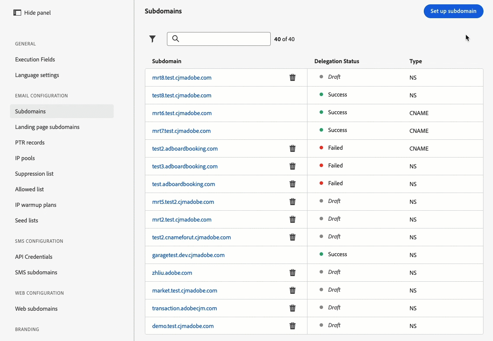

# Versionshinweise 2024 {#release-notes-2024}

Auf dieser Seite sind alle Funktionen und Verbesserungen für [!DNL Journey Optimizer] aufgeführt, die im Jahr 2024 veröffentlicht wurden.

## Versionshinweise für Juni 2024 {#24-6-2024}

**Veröffentlichungsdatum**: 18.–19. Juni 2024

### Neue Funktionen {#june-24-features}

Mit dieser Version werden die unten aufgeführten neue Funktionen eingeführt.

<table>
<thead>
<tr>
<th><strong>Anpassen von Inhaltsfragmenten</strong> </th>
</tr>
</thead>
<tbody>
<tr>
<td>

Es ist nun möglich, bestimmte Felder in einem Fragment zu definieren. Diese Felder können bearbeitet werden, wenn das Fragment zu einer Kampagne oder Journey hinzugefügt wird. Dies ermöglicht die Anpassung von Inhaltsabschnitten zum Zeitpunkt ihrer Verwendung und bietet die Flexibilität zum Überschreiben von Standardwerten mit kontextspezifischen Details.

Weitere Informationen finden Sie in der <a href="../content-management/customizable-fragments.md">ausführlichen Dokumentation</a>.

</td>
</tr>
</tbody>
</table>

<table>
<thead>
<tr>
<th><strong>Reporting mit Customer Journey Analytics (begrenzte Verfügbarkeit)</strong> </th>
</tr>
</thead>
<tbody>
<tr>
<td>

Journey Optimizer Reporting verfügt über eine verbesserte Kompatibilität mit Customer Journey Analytics-Funktionen, wodurch die Berichterstellung plattformübergreifend standardisiert und die Datenkonsistenz und -zuverlässigkeit verbessert wird. Diese nahtlose Integration zwischen Journey Optimizer und Customer Journey Analytics bietet einen besseren Überblick über Leistungsmetriken und ermöglicht es Benutzenden, fundiertere Entscheidungen zu treffen.

Weitere Informationen finden Sie in der <a href="../reports/report-gs-cja.md">ausführlichen Dokumentation</a>.

</td>
</tr>
</tbody>
</table>

<table>
<thead>
<tr>
<th><strong>KI-Assistent in Adobe Journey Optimizer</strong> </th>
</tr>
</thead>
<tbody>
<tr>
<td>

Der KI-Assistent ist eine Funktion der Benutzeroberfläche, mit der Sie durch Adobe-Konzepte navigieren und diese verstehen und operative Erkenntnisse zu Ihrer spezifischen Umgebung erhalten können. Er ist in verschiedenen Produkten in Adobe Experience Cloud verfügbar, einschließlich Adobe Journey Optimizer.

Weitere Informationen finden Sie in der <a href="../start/ai-assistant.md">ausführlichen Dokumentation</a>.

</td>
</tr>
</tbody>
</table>

<table>
<thead>
<tr>
<th><strong>Mehrsprachige Nachrichten in Journeys und Kampagnen (begrenzte Verfügbarkeit)</strong> </th>
</tr>
</thead>
<tbody>
<tr>
<td>

Sie können jetzt im Rahmen einer Kampagne oder Journey mühelos Inhalte in mehreren Sprachen erstellen.  Mit dieser Funktion können Sie bei der Bearbeitung Ihrer Kampagne oder Journey zwischen Sprachen wechseln, den gesamten Bearbeitungsvorgang optimieren und Ihre mehrsprachigen Inhalte effizienter verwalten.

Mehrsprachige Inhalte sind derzeit nur für eine Gruppe von ausgewählten Organisationen verfügbar (begrenzte Verfügbarkeit). Um Zugang zu erhalten, wenden Sie sich an den Adobe-Support.

</td>
</tr>
</tbody>
</table>

<table>
<thead>
<tr>
<th><strong>Experimentieren in Journeys (begrenzte Verfügbarkeit)</strong> </th>
</tr>
</thead>
<tbody>
<tr>
<td>

Adobe Journey Optimizer ist bereits in Kampagnen verfügbar und unterstützt jetzt Experimente in Journeys. Bei Experimenten handelt es sich um randomisierte Test, was im Rahmen von Online-Tests bedeutet, dass Sie einigen zufällig ausgewählten Benutzenden eine bestimmte Variante einer Nachricht anbieten und einer anderen zufällig ausgewählten Gruppe von Benutzenden eine andere Variante oder Abwandlung anbieten. Nach dem Angebot können Sie die Ihre gewünschten Ergebnismetriken messen, z. B. Öffnung von E-Mails, Abonnements oder Käufe.

Das Experimentieren in Journeys ist derzeit nur für eine Gruppe von ausgewählten Organisationen verfügbar (begrenzte Verfügbarkeit). Um Zugang zu erhalten, wenden Sie sich an den Adobe-Support.

</td>
</tr>
</tbody>
</table>

<!--table>
<thead>
<tr>
<th><strong>Extended personalization data - Beta</strong> </th>
</tr>
</thead>
<tbody>
<tr>
<td>

You can now lookup and fetch data values within Adobe Experience Platform datasets, and use these values to build conditions in Adobe Journey Optimizer. You can leverage data from a lookup dataset when a relationship has been defined using an attribute inside of an array of objects. You can specify non-profile enabled datasets for lookup. Once enabled, you can use a profile attribute as a join key to the specified dataset to retrive further data for personalization.

This capability is currently available as a public beta.

</td>
</tr>
</tbody>
</table-->

### Verbesserungen {#june24-improvements}

Diese Version enthält die unten aufgeführten Verbesserungen.

#### Entscheidungs-Management

* **Unterstützung mehrerer Regeln im Entscheidungs-Management**: Sie können jetzt bis zu 10 Begrenzungsregeln für ein bestimmtes Angebot im Entscheidungs-Management hinzufügen. Dadurch wird eine bessere Kontrolle über die Art und Weise ermöglicht, wie die Angebote gesendet werden. [Weitere Informationen](../offers/offer-library/add-constraints.md#capping)

<!--* **Audits** - The **Change log** tab allowing you to see all the changes that have been made to an offer or a decision has been removed. Changes related to offers and decisions can now be seen in the **Audits** menu. -->

#### Inhaltsfragmente

>[!AVAILABILITY]
>
>Bitte beachten Sie, dass diese Verbesserungen im Laufe der auf die erste Veröffentlichung folgenden Tage schrittweise eingeführt werden. Während einige Benutzende sofortigen Zugriff haben, kann es bei anderen einige Zeit dauern, bis die Verbesserungen in ihrer Umgebung verfügbar sind.

* Fragmente können nun bearbeitet werden und Änderungen können in allen Live-Journeys und Kampagnen, in denen sie verwendet werden, übernommen werden.
* Es wurden neue Status für Inhaltsfragmente eingeführt: **Entwurf**, **Live**, **Wird veröffentlicht** und **Archiviert**.
* Damit ein Fragment in einer Journey oder Kampagne verwendet werden kann, muss es sich jetzt im Status **Live** befinden. Der Prozess der Fragmenterstellung wurde um einen neuen Schritt erweitert, der es ermöglicht, das Fragment zu veröffentlichen und für die Verwendung in Journeys und Kampagnen verfügbar zu machen. Beachten Sie, dass die Veröffentlichung von Fragmenten eine neue Berechtigung erfordert.

  **ACHTUNG:** Da die Status **Entwurf** und **Live** mit der Version Juni von Journey Optimizer eingeführt wurden, haben alle Fragmente, die vor dieser Version erstellt wurden, den Status **Entwurf**, auch wenn sie in einer Journey oder Kampagne verwendet werden. Wenn Sie Änderungen an diesen Fragmenten vornehmen, müssen Sie sie [veröffentlichen](../content-management/create-fragments.md#publish), um sie „live“ zu schalten und die Änderungen an die zugehörigen Kampagnen und Journeys weiterzugeben. Außerdem müssen Sie eine neue Journey-/Kampagnenversion erstellen und veröffentlichen.

Weitere Informationen finden Sie in der Dokumentation zu [Inhaltsfragmenten](../content-management/fragments.md).

#### Journeys

* Die globale maximale Wartezeit für Journeys wurde auf 91 Tage verlängert. [Weitere Informationen](../building-journeys/journey-properties.md#global_timeout)

  Bei allen neu erstellten Journeys wird diese neue maximale Wartezeit angezeigt. Weitere Informationen finden Sie in diesem [FAQ-Abschnitt](../building-journeys/journey-properties.md#timeout-faq). Bitte beachten Sie, dass diese Änderungen im Laufe des Monats Juni schrittweise eingeführt werden. 

* Adobe Journey Optimizer unterstützt jetzt Datenschutzanfragen zum Löschen von bzw. für den Zugriff auf Daten sowie Anfragen zur Verwaltung des Datenlebenszyklus. [Weitere Informationen](../privacy/requests.md)
* Sie können nun die Spaltenbreite im Journey-Inventar ändern.
  <!--* **Advanced expression editor in Event configuration** is now GA - You can now leverage the advanced expression editor while configuring an event, allowing you to define more complex expressions or use functions in the event id condition. This capability is released in Limited Availability for selected customers. [Read more](../event/about-creating.md)-->
* **Zusammenführungsrichtlinien** sind nun allgemein verfügbar: Die von einer Journey verwendeten Zusammenführungsrichtlinien sind jetzt im gesamten Verlauf der Journey sichtbar und konsistent. [Weitere Informationen](../building-journeys/journey-properties.md#merge-policies)

#### Kampagnen

* Beim Erstellen einer Kampagne in Adobe Journey Optimizer können Sie nun in einem neuen Modal den Kampagnentyp (geplant oder ausgelöst) auswählen. [Weitere Informationen](../campaigns/create-campaign.md)

#### E-Mail-Kanal

* **Abmelde-Link:** Nach den jüngsten Ankündigungen von Gmail und Yahoo für Massenversender unterstützt Journey Optimizer die Option „Post/1-Klick“ für Abmelde-Links. Sehen Sie sich die folgenden Seiten an: [Opt-out-Verwaltung für E-Mails](../email/email-opt-out.md#unsubscribe-header) und [Konfigurieren von E-Mail-Einstellungen](../email/email-settings.md#list-unsubscribe).

  **HINWEIS** – Bei jeder neuen Kanaloberfläche ist standardmäßig die Option „Abmelde-Link in Kopfzeile“ aktiviert. Bei vorhandenen Oberflächen ist die Option „URL zum Abmelden mit einem Klick“ in den Einstellungen für die Kanaloberfläche standardmäßig deaktiviert. Wenn Sie zuvor eine URL zum Abmelden mit einem Klick im Text der E-Mail verwendet haben, ist diese Einstellung weiterhin gültig. Wenn in den Einstellungen der Kanaloberfläche die URL zum Abmelden mit einem Klick aktiviert ist, verwendet Adobe Journey Optimizer stattdessen die standardmäßig generierte URL zum Abmelden mit einem Klick in den Einstellungen der Kanaloberfläche.

#### SMS-Kanal

* Sie können jetzt mit einer einzigen API-Konfiguration eindeutige Kurzwahlnummern für jede Sandbox hinzufügen, was den Prozess effizienter und einfacher macht. [Weitere Informationen](../sms/sms-configuration.md)

* Nach der Erstellung wird das Feld **API-Token** auf der Seite **Details zu API-Anmeldedaten** jetzt maskiert.

<!--* You can now modify existing SMS configurations.-->

#### In-App-Kanal

<!--* **Expression fragment** - Expression fragments are now available for the **In-app channel**. [Read more](../personalization/use-expression-fragments.md)-->

* Sie können jetzt das Edge Delivery-Plug-in verwenden, um Informationen abzurufen, die Sie zum Verständnis Ihrer eingehenden Implementierungen und zur Fehlerbehebung bei diesen benötigen. [Weitere Informationen zur Ansicht „Edge Delivery“](https://experienceleague.adobe.com/de/docs/experience-platform/assurance/view/edge-delivery){target="_blank"}.

#### Direkt-Mail-Kanal

* Der Direkt-Mail-Kanal ist jetzt für alle Kundinnen und Kunden verfügbar.  [Weitere Informationen](../direct-mail/get-started-direct-mail.md)

## Versionshinweise Mai 2024 {#may-2024}

**Veröffentlichungsdatum**: 21.–22. Mai 2024

### Neue Funktionen {#e-features}

Mit dieser Version werden die unten aufgeführten neue Funktionen eingeführt.

<table>
<thead>
<tr>
<th><strong>Erlebnis-Entscheidung – begrenzte Verfügbarkeit</strong> </th>
</tr>
</thead>
<tbody>
<tr>
<td>

Die Erlebnis-Entscheidung vereinfacht die Personalisierung, indem sie einen zentralisierten Katalog von Marketing-Angeboten, die als „Entscheidungselemente“ bezeichnet werden, und eine ausgereifte Entscheidungs-Engine anbietet. Diese Engine nutzt Regeln und Ranking-Kriterien, um die relevantesten Entscheidungselemente für jeden Kontakt auszuwählen und darzustellen.

Diese Entscheidungselemente sind über den neuen Code-basierten Erlebniskanal, der jetzt in Journey Optimizer-Kampagnen verfügbar ist, nahtlos in eine breite Palette eingehender Oberflächen integriert. Entscheidungsrichtlinien für die Erlebnis-Entscheidung sind nur zur Verwendung in Code-basierten Erlebniskampagnen verfügbar.

Erlebnis-Entscheidung ist derzeit nur für eine Gruppe von Organisationen verfügbar (begrenzte Verfügbarkeit). Um Zugang zu erhalten, wenden Sie sich an den Adobe-Support.

Weitere Informationen finden Sie in der <a href="../experience-decisioning/gs-experience-decisioning.md">ausführlichen Dokumentation</a>.

</td>
</tr>
</tbody>
</table>

<table>
<thead>
<tr>
<th><strong>Personalisierung der E-Mail-Oberfläche - Eingeschränkte Verfügbarkeit</strong> </th>
</tr>
</thead>
<tbody>
<tr>
<td>

Sie können jetzt beim Erstellen von E-Mail-Kanal-Oberflächen dynamische Subdomains und personalisierte Kopfzeilenparameter definieren, um mehr Flexibilität und Kontrolle über Ihre E-Mail-Einstellungen zu erhalten.

Die Personalisierung der E-Mail-Oberfläche ist derzeit nur für eine Gruppe von Organisationen verfügbar (begrenzte Verfügbarkeit). Um Zugang zu erhalten, wenden Sie sich an den Adobe-Support.

Weitere Informationen finden Sie in der <a href="../email/surface-personalization.md">ausführlichen Dokumentation</a>.

</td>
</tr>
</tbody>
</table>

<!--table>
<thead>
<tr>
<th><strong>IP Warmup Workflow</strong> </th>
</tr>
</thead>
<tbody>
<tr>
<td>

If you are sending email on a brand new IP address, you can now easily perform IP warmup workflows directly from the user interface. Adobe Journey Optimizer offers a standardized and efficient way to warm up your IP adresses that follows the best practices for optimal deliverability.

For more information, refer to the <a href="../configuration/ip-warmup-gs.md">detailed documentation</a>.

</td>
</tr>
</tbody>
</table-->

<!--table>
<thead>
<tr>
<th><strong>Business rules - Beta</strong> </th>
</tr>
</thead>
<tbody>
<tr>
<td>

You can now create granular frequency capping rules, and apply them to different types of marketing communications through rule sets. This new capability lets you control how often your audiences receive a message by setting cross-channel rules, that automatically exclude over-solicited profiles from messages and actions.

Business rules capability is currently available as a beta. To join the beta program, contact your Adobe representative.

For more information, refer to the <a href="../configuration/business-rules.md">detailed documentation</a>.

</td>
</tr>
</tbody>
</table-->

<!--table>
<thead>
<tr>
<th><strong>Extended personalization data - Beta</strong> </th>
</tr>
</thead>
<tbody>
<tr>
<td>

You can now lookup and fetch data values within Adobe Experience Platform datasets, and use these values to build conditions in Adobe Journey Optimizer. You can leverage data from a lookup dataset when a relationship has been defined using an attribute inside of an array of objects. You can specify non-profile enabled datasets for lookup. Once enabled, you can use a profile attribute as a join key to the specified dataset to retrive further data for personalization.

This capability is currently available as a public beta.

</td>
</tr>
</tbody>
</table-->

### Verbesserungen {#e-improvements}

Diese Version enthält die unten aufgeführten Verbesserungen.

**Erlebnis-Entscheidung** (begrenzte Verfügbarkeit)

Von der Beta-Version bis hin zu dieser Version wurden die folgenden Verbesserungen hinzugefügt:

* **Erlebnis-Entscheidung und Code-basierte Erlebnisse**: Sie können jetzt die Funktion „Erlebnis-Entscheidung“ nutzen, um Entscheidungselemente in Ihren Code-basierten Kampagnen zu verwenden. Hinweis: Der Code-basierte Erlebniskanal und die Erlebnis-Entscheidung sind nicht für Organisationen verfügbar, die die Zusatzangebote Adobe Healthcare Shield und Privacy and Security Shield erworben haben.  [Weitere Informationen](../code-based/get-started-code-based.md)
* **Kontextdaten**: Sie können jetzt die Kontextdaten von Adobe Experience Platform in Ihren Entscheidungsregeln und Rangfolgeformeln nutzen. [Weitere Informationen](../experience-decisioning/context-data.md)
* **Neue Berechtigung**: Für die Entscheidungs-Management-Ressource ist jetzt die neue Berechtigung „Erlebnis-Entscheidung verwalten“ verfügbar. Sie können damit Berechtigungen im Zusammenhang mit der Erlebnis-Entscheidung verwalten.  [Weitere Informationen](../experience-decisioning/gs-experience-decisioning.md)
* **Begrenzungsregeln**: Sie können jetzt mehrere Begrenzungsregeln für ein bestimmtes Entscheidungselement in der Erlebnis-Entscheidung hinzufügen. Dadurch wird eine bessere Kontrolle über die Art und Weise ermöglicht, wie die Angebote gesendet werden. [Weitere Informationen](../experience-decisioning/items.md#capping)
* **Reporting**: Sie können jetzt benutzerdefinierte Berichts-Dashboards von Erlebnis-Entscheidungs-Kampagnen mit [!DNL Customer Journey Analytics] erstellen. [Weitere Informationen](../experience-decisioning/cja-reporting.md)

<!--**Decision Management**

* **Multi-rule support** - You can now add up to 10 capping rules for a given offer in Decision Management. This allows you to increase the level of control over the way offers are sent.
* **Audits** - The **Change log** tab allowing you to see all the changes that have been made to an offer or a decision has been removed. Changes related to offers and decisions can now be seen in the **Audits** menu. -->

**E-Mail-Kanal**

<!--
* **List-unsubscribe** - Following on the recent Gmail and Yahoo announcements for bulk senders, Journey Optimizer supports the "post/1-click" List-Unsubscribe option. Refer to the following pages: [Email opt-out management](../email/email-opt-out.md#unsubscribe-header) and [Configure email settings](../email/email-settings.md#list-unsubscribe)
-->

* **Spam-Bewertung** (Beta): Sie können jetzt Ihre Spam-Bewertung von Inhalten in einem speziellen Spam-Bericht überprüfen. Mithilfe von SpamAssassin kann Adobe Journey Optimizer jetzt Ihre E-Mail-Inhalte testen und mit einer Punktzahl versehen, die angibt, ob ISPs oder Mailbox-Anbieter sie als Spam betrachten oder nicht. [Weitere Informationen](../content-management/spam-report.md)

  >[!AVAILABILITY]
  >
  >Diese Funktion befindet sich derzeit in der Beta-Version und steht nur Beta-Kundschaft zur Verfügung. Wenden Sie sich an den Adobe-Support, um am Beta-Programm teilzunehmen.

<!--
**Audiences**

* The use of audiences and attributes from audience composition and custom upload (CSV file) is now available for use with Healthcare Shield or Privacy and Security Shield.-->

<!--**Personalization**

* **Expression fragment** - Expression fragments are now available for the **In-app channel**. [Read more](../personalization/use-expression-fragments.md)-->

**Journeys**

<!--* **Merge policies** (Limited Availability)- Merge policies used by a journey are now visible and consistent throughout the journey.-->
* **Unterstützung von mTLS**: Die mTLS-Authentifizierung wird jetzt in benutzerdefinierten Aktionen unterstützt. Es ist keine zusätzliche Konfiguration in der benutzerdefinierten Aktion oder Journey erforderlich, um mTLS zu aktivieren, sondern dies geschieht automatisch, wenn ein mTLS-fähiger Endpunkt erkannt wird. [Weitere Informationen](../action/about-custom-action-configuration.md#mtls-protocol-support)
* **Suchtabellen in Ereignissen**: Sie können jetzt Daten aus einem Lookup-Datensatz nutzen, wenn eine Beziehung mithilfe eines Attributs innerhalb eines Arrays von Objekten definiert wurde. Die Suchwerte sind in Journeys (Bedingungen, benutzerdefinierte Aktionen usw.) und der Nachrichtenpersonalisierung verfügbar. [Weitere Informationen](../event/experience-event-schema.md#relationships_limitations)
* **Erweiterter Ausdruckseditor in der Ereigniskonfiguration** (LA): Sie können jetzt den erweiterten Ausdruckseditor beim Konfigurieren eines Ereignisses nutzen, um komplexere Ausdrücke zu definieren oder Funktionen in der Ereignis-ID-Bedingung zu verwenden. Diese Funktion wird mit begrenzter Verfügbarkeit (Limited Availability, LA) für eine ausgewählte Gruppe von Kundinnen und Kunden veröffentlicht. [Weitere Informationen](../event/about-creating.md#adv-exp-editor)
* **Zusammenführungsrichtlinien** (LA): Zusammenführungsrichtlinien, die von einer Journey verwendet werden, sind jetzt auf der gesamten Journey sichtbar und konsistent. Diese Funktion wird mit begrenzter Verfügbarkeit (Limited Availability, LA) für eine ausgewählte Gruppe von Kundinnen und Kunden veröffentlicht. [Weitere Informationen](../building-journeys/journey-properties.md#merge-policies)

**Globalisierung**

Im Rahmen unserer laufenden Bemühungen um ein einheitliches Benutzererlebnis harmonisieren wir die Terminologie der Adobe Experience Cloud-Produkte und -Apps. Dies wirkt sich auf den deutschen Begriff „Titel“ aus, der in „Label“ geändert wird, wenn er sich auf den Namen eines Objekts bezieht. Die Änderungen werden schrittweise in der Benutzeroberfläche und Dokumentation angewendet.

## Versionshinweise April 2024 {#apr-2024}

**Veröffentlichungsdatum**: 02. Mai 2024

### Neue Funktionen {#apr-features}

Mit dieser Version werden die unten aufgeführten neue Funktionen eingeführt.

<table>
<thead>
<tr>
<th><strong>Multimedia Message Service (MMS) – alle Anbieter</strong> </th>
</tr>
</thead>
<tbody>
<tr>
<td>

Mit dem SMS-Kanal können Sie Ihre Kommunikation jetzt verbessern, indem Sie MMS-Nachrichten (Multimedia Message Service) senden, sodass Sie Bilder, GIFs oder Videos mit Ihren Kundinnen und Kunden teilen können. MMS war ursprünglich nur mit Sinch verfügbar, aber ist jetzt auch mit Infobip und Twilio verfügbar.

</td>
</tr>
</tbody>
</table>

<table>
<thead>
<tr>
<th><strong>Verbesserter Journey Designer und Live-Reporting</strong> </th>
</tr>
</thead>
<tbody>
<tr>
<td>

Diese Version enthält eine verbesserte Benutzeroberfläche der Arbeitsfläche für Journeys und bietet ein intuitiveres und effizienteres Anwendererlebnis. Die Aktivitäten sind übersichtlicher und enthalten auf der Journey-Arbeitsfläche mehr Informationen mit weniger Klicks.

Neben dem verbesserten Design der Journey-Arbeitsfläche führen wir die Möglichkeit ein, die Berichtsmetriken der letzten 24 Stunden direkt in der Journey-Arbeitsfläche anzuzeigen. 

<strong>Hinweis</strong>: Diese Änderungen werden ab April schrittweise auf alle Umgebungen ausgeweitet.

Weitere Informationen finden Sie in der <a href="new-canvas.md">ausführlichen Dokumentation</a>.

</td>
</tr>
</tbody>
</table>

<!-- table>
<thead>
<tr>
<th><strong>AI Assistant - Experience Variant Generation - Beta</strong> </th>
</tr>
</thead>
<tbody>
<tr>
<td>

Once you have created and personalized your message, take your content to the next level with the AI assistant. You can now use the AI assistant to optimize your message's impact by experimenting with different main titles, and images. Each variant is managed as a unique Treatment, to measure and compare which title effectively generates more clicks.

</td>
</tr>
</tbody>
</table-->

<!--table>
<thead>
<tr>
<th><strong>Email Surface Personalization - Private beta </strong> </th>
</tr>
</thead>
<tbody>
<tr>
<td>

You can now define dynamic subdomains and personalized header parameters when creating email channel surfaces, for increased flexibility and control over your email settings.

</td>
</tr>
</tbody>
</table-->

### Verbesserungen {#apr-improvements}

Diese Version enthält die unten aufgeführten Verbesserungen.

<!--
* **Expression Fragments supported for Web and In-App**: Expression fragments are now available for the Web and In-app channels. 
-->

<!--
* **DULE for AJO Channel Surface**: It is now possible to apply a label on certain profile attributes to restrict their usage inside a channel surface through marketing actions.
-->

<!--
* **List-Unsubscribe updates**: Following on the recent Gmail and Yahoo announcements for bulk senders, Journey Optimizer supports the "post/1-click" List-Unsubscribe option. 
-->

**Konfiguration**

* Jetzt können Sie eine Marketing-Aktion auf der Ebene der Kanaloberfläche auswählen. Bei Verwendung in einer Oberfläche werden alle mit dieser Marketing-Aktion verknüpften Einverständnisrichtlinien genutzt, um die Vorlieben Ihrer Kundinnen und Kunden zu respektieren.  [Weitere Informationen](../action/consent.md#surface-marketing-actions)
* Die Verwendung der Zugriffssteuerung auf Objektebene ist jetzt für Kanaloberflächen verfügbar. [Weitere Informationen](../configuration/channel-surfaces.md#create-channel-surface)
* Wenn Sie die Abmeldung von Listen in einer Kanaloberfläche aktivieren, können Sie jetzt die Einverständnisebene so definieren, dass sie mit der Verwaltung von Einverständniserklärungen aus allen anderen Quellen übereinstimmt. [Weitere Informationen](../email/email-settings.md#list-unsubscribe)

**Content-Management**

* Sie können jetzt Inhaltsvorlagen für alle Kanäle simulieren. [Weitere Informationen](../content-management/content-templates.md#test-templates)

**Personalisierung**

* Die neue Hilfsfunktion **toInt** ist im Ausdruckseditor verfügbar. Damit können Sie jeden dieser Typen (number, double, int, long, float, short, byte, boolean, string) in eine Ganzzahl umwandeln. [Weitere Informationen](../personalization/functions/math.md#to-int)

## März 2024 – Versionshinweise {#mar-2024}

**Veröffentlichungsdatum**: 19.–20. März 2024

### Neue Funktion {#mar-features}

Mit dieser Version wird die unten aufgeführte neue Funktion eingeführt.

<table>
<thead>
<tr>
<th><strong>Code-basierte Erlebnisse</strong> </th>
</tr>
</thead>
<tbody>
<tr>
<td>

Mit dem neuen Code-basierten Erlebniskanal können Sie mit Adobe Journey Optimizer eine erweiterte Personalisierung und Tests für jede Ihrer Inbound-Eigenschaften durchführen. Dies ermöglicht den nahtlosen Versand von maßgeschneiderten Erlebnissen über verschiedene Touchpoints wie Web-Apps, Mobile-Apps, Desktop-Apps, Videokonsolen, mit dem Fernseher verbundene Geräte, Smart-TVs, Kioske, Geldautomaten, IoT-Geräte und mehr.

Die wichtigsten Funktionen ermöglichen Folgendes:

<ul><li> Universelle Personalisierung: Erweiterung personalisierter Erlebnisse über alle Touchpoints hinweg, sodass eine kohärente und maßgeschneiderte Benutzer-Journey sichergestellt ist</li>
<li>Präzise Bearbeitungsgenauigkeit: Bearbeitung bestimmter Inhalte an einzelnen Stellen in Apps oder auf Web-Seiten</li>
<li>Vielseitige Implementierung: Unterstützung für Server-seitige, API-basierte oder SDK-basierte Implementierungsmethoden zur nahtlosen Integration in Ihre Entwicklungsumgebung</li></ul>

Weitere Informationen finden Sie in der <a href="../code-based/get-started-code-based.md">ausführlichen Dokumentation</a>.

 
</tr>
</tbody>
</table>

### Verbesserungen {#mar-improvements}

Diese Version enthält die unten aufgeführten Verbesserungen.

**Inhaltsvorlagen**

* **Miniaturansicht**: Für Inhaltsvorlagen ist jetzt der Modus **Rasteransicht** verfügbar, um den visuellen Zugriff durch die Anzeige von Miniaturansichten zu verbessern. Derzeit werden nur HTML-Vorlagen für E-Mails unterstützt. [Weitere Informationen](../content-management/content-templates.md#template-thumbnails)

  >[!AVAILABILITY]
  >
  >Diese Funktion wird mit begrenzter Verfügbarkeit (Limited Availability, LA) für eine kleine Gruppe von Kundinnen und Kunden veröffentlicht.

**Journeys**

Dem Journey-Authoring-Lebenszyklus wurden neue Zwischenstatus hinzugefügt:

* der Status **Wird veröffentlicht** zwischen dem Status **Entwurf** und dem Status **Live**
* der Status **Wird gestoppt** zwischen dem Status **Live** und dem Status **Gestoppt**
* der Status **Testmodus wird aktiviert** oder **Testmodus wird deaktiviert** zwischen dem Status **Entwurf** und dem Status **Entwurf (Test)**

Wenn sich eine Journey in einem Zwischenzustand befindet, ist sie schreibgeschützt. [Weitere Informationen](../building-journeys/journey-gs.md#filter)

## Februar 2024 – Versionshinweise {#feb-2024}

**Veröffentlichungsdatum**: 21.–22. Feb. 2024

### Neue Funktionen{#feb-features}

Mit dieser Version werden die unten aufgeführten neuen Funktionen eingeführt.

<table>
<thead>
<tr>
<th><strong>Web-In-App-Nachrichten</strong> </th>
</tr>
</thead>
<tbody>
<tr>
<td>

Sie können jetzt die neue Web-In-App-Nachrichten-Funktion verwenden, um personalisierte Inhalte direkt auf Websites über modale Überlagerungsnachrichten anzuzeigen. Diese Funktion ermöglicht es Ihnen, effektiv mit Besucherinnen und Besuchern im Web zu interagieren und die Benutzerinteraktion, -bindung und Konversionsraten zu verbessern.  

Weitere Informationen finden Sie in der <a href="../in-app/create-in-app-web.md">ausführlichen Dokumentation</a>.  

</tr>
</tbody>
</table>

<table>
<thead>
<tr>
<th><strong>Multi-Channel-Inhaltsvorlagen</strong> </th>
</tr>
</thead>
<tbody>
<tr>
<td>

Neben „E-Mail“ stehen nun auch Inhaltsvorlagen für die folgenden Kanäle zur Verfügung: „Push“, „In-App“, „SMS“ und „Briefpost“. Dabei verfügt jeder Kanal über dedizierte Vorlagentypen. Für „E-Mail“ können Sie nun den Inhaltstyp auswählen, mit dem Sie den Betreff als Teil Ihrer E-Mail-Vorlage speichern können.   

Weitere Informationen finden Sie in der <a href="../content-management/content-templates.md">ausführlichen Dokumentation</a>.  

 
</tr>
</tbody>
</table>

### Verbesserungen {#feb-improvements}

Diese Version enthält die unten aufgeführten Verbesserungen.

**Zielgruppen**

* **Testadressenlisten**: bei der Verwendung von **Testadressenlisten** werden jetzt Varianten unterstützt. Die Testadressen erhalten eine Kopie aller Varianten derselben Nachricht (z. B. die verschiedenen Behandlungen eines Inhaltsexperiments). [Weitere Informationen](../configuration/seed-lists.md)

Die folgenden Verbesserungen, die bisher als Beta-Version verfügbar waren, stehen jetzt allen Benutzenden zur Verfügung:

* Sie können jetzt **Zielgruppen auswählen, die durch die Zielgruppenkomposition erstellt wurden**, und Anreicherungsattribute in Journeys nutzen. [Weitere Informationen](../building-journeys/read-audience.md)

* Sie können jetzt **Zielgruppen auswählen, die aus einer CSV-Datei** in Journeys und Kampagnen hochgeladen wurden. [Weitere Informationen](../audience/about-audiences.md#segments-in-journey-optimizer)

  >[!AVAILABILITY]
  >
  >* Die Verwendung von Zielgruppen und Attributen aus der Zielgruppenkomposition und dem benutzerdefinierten Upload (CSV-Datei) ist derzeit nicht für die Verwendung mit dem Health Care Shield oder dem Privacy and Security Shield verfügbar.
  >* Der **Zielgruppen-Upload aus einer CSV-Dateiverbesserung** wird im Laufe von mehreren Tagen nach der ersten Veröffentlichung schrittweise durchgeführt. Einige Benutzerinnen und Benutzer haben zwar sofort Zugriff, bei anderen kann es jedoch zu einer Verzögerung kommen, bevor dies in ihrer Umgebung verfügbar wird.

**Journeys**

* **Filtern von Journeys**: Sie können jetzt zusätzlich zu den vorhandenen vordefinierten Datumsfiltern **eigene Daten zum Filtern des Inventars von Journeys** verwenden. Sie können die Liste verfeinern, indem Sie sich Journeys anzeigen lassen, die an einem bestimmten Datum, in einem bestimmten Monat, in einem ganzen Jahr oder in bestimmten Zeiträumen erstellt oder veröffentlicht wurden. [Weitere Informationen](../building-journeys/journey-gs.md#filter)
* **Benutzerdefinierte Aktionen**: Sie können jetzt den **Content-Typ**-Header aktualisieren. Dieser neue **Content-Typ** sollte auf JSON-Inhalte verweisen. [Weitere Informationen](../action/about-custom-action-configuration.md#url-configuration)
* **Konfiguration**: Das Attribut „identityMap“ in „stepEvents“ ist jetzt vorausgefüllt. Die primäre Identität wird als „primary = true“ definiert. [Weitere Informationen](../reports/sharing-field-list.md)
* **Benutzeroberfläche**: Die obere Leiste in den Journey-Bildschirmen wurde für ein besseres Erlebnis umgestaltet. Unter den verschiedenen Updates sehen Sie, dass das Stiftsymbol, das Ihnen den Zugriff auf die Journey-Eigenschaften ermöglicht, nun links in der oberen Leiste neben dem Journey-Namen angezeigt wird. [Weitere Informationen](../building-journeys/journey-properties.md)

**SMS-Kanal**

* **Opt-in/Opt-out-Keywords**: Bei der Konfiguration Ihres SMS-Kanals können Sie jetzt die **Opt-in- und Opt-out-Keywords** nach Ihren Wünschen anpassen. Journey Optimizer löst die Antwort anhand dieser angegebenen Keywords aus. [Weitere Informationen](../sms/sms-configuration.md)

**Kampagnen**

* **API-ausgelöste Kampagnen**: Der cURL-Code, der nach der Aktivierung einer API-ausgelösten Kampagne generiert wurde, wurde verbessert. Er enthält jetzt alle Personalisierungsvariablen (Profil und Kontext), die in der Nachricht verwendet werden. [Weitere Informationen](../campaigns/api-triggered-campaigns.md#execute)

**Häufigkeitsregeln**

* Zusätzlich zu „E-Mail“ und „Push“ können Sie nun Häufigkeitsregeln für SMS- und Briefpost-Kanäle erstellen. Häufigkeitsregeln schließen automatisch die zu oft angeforderten Profile aus Nachrichten und Aktionen aus, wenn die Frequenzbegrenzung erreicht wird. [Weitere Informationen](../configuration/frequency-rules.md)

<!--**Decision management**

* **Capping rules** - You can now add **multiple capping rules** for one offer. This allows you to increase the level of control over the way offers are sent.-->

## Januar 2024 – Versionshinweise {#jan-2024}

**Veröffentlichungsdatum**: 30.–31. Jan. 2024

### Neue Funktionen{#jan24-features}

Mit dieser Version werden die unten aufgeführten neuen Funktionen eingeführt.

<table>
<thead>
<tr>
<th><strong>Zustellbarkeits-Updates</strong> </th>
</tr>
</thead>
<tbody>
<tr>
<td>

Journey Optimizer unterstützt jetzt die DMARC-Authentifizierungstechnologie.

Ab dem 1. Februar 2024 verlangen Google und Yahoo!, dass Sie einen DMARC-Eintrag für jede Domain haben, über die Sie E-Mails an sie senden. Stellen Sie sicher, dass Sie den DMARC-Eintrag für alle Subdomains eingerichtet haben, die Sie in Journey Optimizer an Adobe delegiert haben oder an Adobe delegieren.

Weitere Informationen finden Sie in der <a href="../configuration/dmarc-record-update.md">ausführlichen Dokumentation</a>.

 
</tr>
</tbody>
</table>

<table>
<thead>
<tr>
<th><strong>Anwendungsfall-Playbooks</strong> </th>
</tr>
</thead>
<tbody>
<tr>
<td>

Nutzen Sie einen Katalog mit branchenspezifischen Anwendungsfall-Playbooks in Real-Time CDP und Journey Optimizer für gängige Anwendungsfälle, die Sie mit Adobe Experience Platform und Adobe Journey Optimizer durchführen können.

Nachdem Sie das Playbook ausgewählt haben, das Ihren Anforderungen am besten entspricht, können Sie es aktivieren, um die Assets zu generieren, die zur Unterstützung Ihres Anwendungsfalls benötigt werden, wie z. B. Journeys, Nachrichten, Schemata oder Segmente, und diese für eine schnellere Amortisierungszeit an Ihr Schema anpassen.

Weitere Informationen finden Sie in der <a href="../start/playbooks.md">ausführlichen Dokumentation</a>.

 
</tr>
</tbody>
</table>

### Verbesserungen {#jan24-improvements}

Diese Version enthält die unten aufgeführten Verbesserungen.

**Reporting**

* **Neue Domain-basierte Widgets zur Aufschlüsselung** – Es wurden neue Widgets hinzugefügt, mit denen Sie Ihre Campaign- und Journey-Berichte optimieren können. Die Widgets **Bounce-Gründe nach Domain**, **Gesendet und zugestellt nach Domains**, **Öffnungen und Klicks nach Domains** und **Bounces und Fehler nach Domains** bieten eine detaillierte Aufschlüsselung für wichtige E-Mail-Versand- und Tracking-Metriken auf Domain-Ebene. [Weitere Informationen](../reports/channel-report.md)

**SMS-Kanal**

* **Double-Opt-in** – Der Workflow „Double-Opt-in“ für SMS garantiert, dass Benutzende sich explizit für den Empfang von Nachrichten anmelden, wenn die Anfrage von ihrem Gerät aus initiiert wird. Benutzende starten den Einverständnisprozess durch Senden einer eingehenden SMS. Nach der Bestätigung des Einverständnisses wird eine Folgenachricht gesendet, in der eine letzte Überprüfung angefordert wird. Wenn kein Benutzerprofil vorhanden ist, wird es nach erfolgreicher Bestätigung erstellt. [Weitere Informationen](../sms/sms-configuration.md)

  Hinweis: Diese Funktion ist bei Sinch- und Infobip-SMS-Anbietern verfügbar.

**Journeys**

* **Dauer von Reaktionsereignissen** – Die maximale Dauer, die Sie in den **Reaktionsereignissen** definieren können, beträgt jetzt 29 Tage statt 30 Tage. [Weitere Informationen](../building-journeys/reaction-events.md)

<!--* **Date filters** - You can now use custom dates to filter the journeys inventory, in addition to the existing predefined date filters. This allows you to refine the list by displaying journeys published on a specific date, within a particular month, throughout an entire year, or within specified time ranges. [Learn more](../building-journeys/journey-gs.md#filter)-->

* **Zielgruppe lesen** – Die Aktivität **Zielgruppe lesen** basiert jetzt auf dem Profil-Schnappschuss-Datensatz für Batch-Segmente, der nur einmal täglich nach der Ausführung des geplanten täglichen Batch-Vorgangs generiert wird. Die Daten sind also bis zum letzten täglichen Batch-Vorgang aktuell. [Weitere Informationen](../building-journeys/read-audience.md)

* **Feldergruppen** – Mit dieser Version wird ein Problem behoben, das die Speicherung von Feldergruppen in bestimmten Fällen verhinderte.

* Die Unterstützung für `<listObject>` wurde in mehreren Funktionen geändert.

**Häufigkeitsregeln**

* **Wöchentliche Frequenzbegrenzung** – Sie können jetzt neben der monatlichen Anzahl auch die maximale Anzahl an Nachrichten festlegen, die pro Woche an ein Kundenprofil gesendet werden. Die Frequenzbegrenzung basiert auf dem ausgewählten Kalenderzeitraum und wird am Anfang des entsprechenden Zeitraums zurückgesetzt. [Weitere Informationen](../configuration/frequency-rules.md#create-new-rule)

  >[!NOTE]
  >
  >Auf Anfrage ist auch eine tägliche Frequenzbegrenzung möglich. Wenden Sie sich an den Adobe-Support.

**Entscheidungs-Management**

* **Frequenzbegrenzung für Edge** – Der Frequenzbegrenzungszähler wird jetzt in weniger als 3 Sekunden aktualisiert und in einer Entscheidung der Edge Decisioning-API zur Verfügung gestellt. [Weitere Informationen](../offers/api-reference/offer-delivery-api/start-offer-delivery-apis.md)
