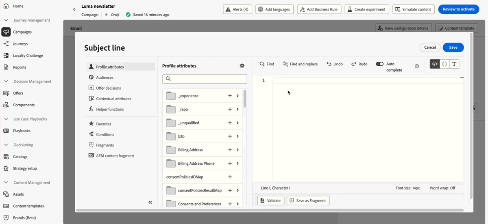

# Versionshinweise 2025 {#release-notes-2025}

Auf dieser Seite sind alle Funktionen und Verbesserungen für [!DNL Journey Optimizer] aufgeführt, die im Jahr 2025 veröffentlicht wurden.

## Versionshinweise Juli 2025 {#25-7-rn}

**Veröffentlichungsdatum**: 29. Juli 2025

### Neue Funktionen {#features-25-7}

Im Folgenden werden die neuen Funktionen dieser Version beschrieben.

#### Funktionen

<table>
<thead>
<tr>
<th><strong>Marken</strong> </th>
</tr>
</thead>
<tbody>
<tr>
<td>

Sie können jetzt Ihre eigenen Marken erstellen und anpassen, um Ihre visuelle und verbale Identität in der gesamten Kommunikation klar zu definieren. Der Markenausrichtungswert liefert Ihnen Echtzeit-Feedback dazu, wie gut Ihr Inhalt den Ton, den Stil und die Richtlinien Ihrer Marke widerspiegelt. So wird sichergestellt, dass alle von Ihnen versendeten Nachrichten markenkonform sind.

Diese Funktion wurde zuvor als Beta-Version veröffentlicht, steht aber nun für alle Umgebungen zur Verfügung (allgemeine Verfügbarkeit).

Weitere Informationen finden Sie in der <a href="../content-management/brands.md">ausführlichen Dokumentation</a>.

</td>
</tr>
</tbody>
</table>

<table>
<thead>
<tr>
<th><strong>Verwenden der Entscheidungsfindung im E-Mail-Kanal</strong> </th>
</tr>
</thead>
<tbody>
<tr>
<td>

Sie können jetzt Entscheidungsrichtlinien zu E-Mail-Journeys und -Kampagnen hinzufügen. Entscheidungsrichtlinien sind Container für Angebote, die die Entscheidungs-Engine nutzen, um für jedes Zielgruppenmitglied die besten Inhalte bereitzustellen.

Diese Funktion ist nur eingeschränkt verfügbar. Wenden Sie sich an den Adobe-Support, um Zugang zu erhalten.

Weitere Informationen finden Sie in der <a href="../experience-decisioning/create-decision.md">ausführlichen Dokumentation</a>.

</td>
</tr>
</tbody>
</table>

<table>
<thead>
<tr>
<th><strong>LINE-Kanal</strong> </th>
</tr>
</thead>
<tbody>
<tr>
<td>

Adobe Journey Optimizer hat seine kanalübergreifenden Funktionen um die Unterstützung des LINE-Kanals erweitert. Diese Verbesserung ermöglicht es Ihnen, LINE-Erlebnisse zu erstellen, zu bearbeiten und in der Vorschau anzuzeigen, was eine stärker personalisierte und ansprechendere Interaktion ermöglicht. Mit LINE können Sie mit mehr Kundinnen und Kunden in Kontakt treten, relevante Inhalte versenden und Ihre Interaktion verbessern.

Der LINE-Kanal war zuvor nur auf Anfrage verfügbar, steht aber nun allen Benutzenden zur Verfügung (allgemeine Verfügbarkeit).

Weitere Informationen finden Sie in der <a href="../../rp_landing_pages/line-landing-page.md">ausführlichen Dokumentation</a>.
</td>
</tr>
</tbody>
</table>

<table>
<thead>
<tr>
<th><strong>Journey-Probelauf</strong> </th>
</tr>
</thead>
<tbody>
<tr>
<td>

Der Journey-Probelauf ist ein spezieller Journey-Veröffentlichungsmodus in Adobe Journey Optimizer, der es Journey-Anwendenden ermöglicht, eine Journey mit echten Produktionsdaten zu testen, ohne echte Kundinnen und Kunden zu kontaktieren oder Profilinformationen zu aktualisieren. Mit dieser Funktion können Journey-Anwendende Vertrauen in ihr Journey-Design und die Zielgruppenbestimmung gewinnen, bevor sie die Journey live veröffentlichen.

Diese Funktion war zuvor nur eingeschränkt verfügbar, steht aber nun für alle Umgebungen zur Verfügung (allgemeine Verfügbarkeit).

Weitere Informationen finden Sie in der <a href="../building-journeys/journey-dry-run.md">ausführlichen Dokumentation</a>.

</td>
</tr>
</tbody>
</table>

<table>
<thead>
<tr>
<th><strong>Zusätzliche ID für Journeys</strong> </th>
</tr>
</thead>
<tbody>
<tr>
<td>

Sie können nun Journeys auslösen, indem Sie eine Profilkennung zusammen mit einer anderen Kennung wie einer Bestell-, Abonnement- oder Rezept-ID verwenden, sodass dasselbe Profil mehrmals in derselben Journey vorhanden sein kann. Dies ermöglicht Szenarien wie die parallele Verwaltung mehrerer Bestellungen oder Abonnements, wobei jede Instanz ihrem eigenen Pfad durch die Journey folgt.

Die Verwendung zusätzlicher IDs in Journeys war zuvor nur eingeschränkt verfügbar, steht nun aber für alle Umgebungen zur Verfügung. Im Rahmen dieser allgemein verfügbaren Version bietet diese Funktion nun Unterstützung für Journeys des Typs „Zielgruppe lesen“.

Weitere Informationen finden Sie in der <a href="../building-journeys/supplemental-identifier.md">ausführlichen Dokumentation</a>.

</td>
</tr>
</tbody>
</table>

### Warnhinweise im Produkt

Sie können nun **E-Mail- und Warnhinweise im Produkt** für Journey Optimizer-Produktversionen abonnieren.

So abonnieren Sie sie:

* Navigieren Sie zu den **Voreinstellungen für Adobe Experience Cloud**.
* Suchen Sie unter **Benachrichtigungen** nach **neuen Versionen von Journey Optimizer**
* Aktivieren von In-App- und E-Mail-Benachrichtigungen

{width="70%" align="left"}

### Änderung bei den Journey-Bedingungen {#ee-change@}

Seit dem 8. Juli wird das Erstellen von Ausdrücken mit Erlebnisereignissen in neuen Kundenorganisationen in dem in Journey-Bedingungen verwendeten Ausdruckseditor nicht mehr unterstützt. Daher können Erlebnisereignisse in der [Experience Platform-Datenquelle](../datasource/adobe-experience-platform-data-source.md) nicht zum Erstellen von Ausdrücken verwendet werden. Alternative Ansätze und Best Practices zum Erstellen von Ausdrücken/Logik mit Erlebnisereignissen sind [hier](../building-journeys/exp-event-lookup.md) zu finden.

Der Zugriff auf Journey-Kontextereignisdaten in unitären Journeys wird nicht geändert. In den Ausdrucks- und Personalisierungseditoren können Benutzende weiterhin auf Daten zugreifen, die mit dem ersten Journey-Ereignis übergeben wurden.

Weitere Informationen finden Sie [in diesen FAQ](../building-journeys/exp-event-lookup.md#faq-ee).

### Verbesserungen {#25-7-improv}

Im Folgenden sind die Verbesserungen dieser Version aufgeführt.

* **Kampagnen**

   * **Mehrere eingehende Aktionen in Kampagnen**: Um die Kampagnenorchestrierung zu vereinfachen, können Sie jetzt mehrere eingehende Aktionen in einer einzigen Kampagne definieren. Mit dieser Funktion können Sie mehrere Code-basierte Erlebnisse, In-App-Nachrichten, Inhaltskarten oder Web-Aktionen gleichzeitig an verschiedenen Orten bereitstellen, wobei jede Aktion einen bestimmten Inhalt enthält.
     [Weitere Informationen](../campaigns/campaign-action.md#multi-action)

   * **Neuorganisation des Kampagneninventars**: Geplante und API-ausgelöste Kampagnen sind jetzt im Kampagneninventar zur leichteren Navigation und Verwaltung in separate Registerkarten unterteilt.

[Mehr dazu](../campaigns/manage-campaigns.md)

* **Daten-Management**
   * **Aktualisierung der Systemdatensätze des Entscheidungs-Managements**: Die gelöschten personalisierten Angebote und Fallback-Angebote werden jetzt in den Datensätzen „decision_object_repository_personalized_offers“ und „decision_object_repository_fallback_offers“ als archiviert gekennzeichnet. Die vorhandenen Einträge im Datensatz werden nicht geändert.

[Mehr dazu](../offers/export-catalog/access-dataset.md)

* **Journeys**
   * **Verbesserungen an den Sandbox-Tools von Journeys**: Beim Kopieren von Journeys über mehrere Sandboxes hinweg mithilfe der Paketexport- und -importfunktionen sind jetzt auch die folgenden Funktionen verfügbar:
      * Auswählen eines vorhandenen Ereignisses am Ziel
      * Kopieren eines Ereignisses unabhängig von einer Journey
      * Erkennen von Feldergruppen-/Datenquellenbeziehungen und Verknüpfen dieser am Ziel, wenn sie vorhanden sind bzw. Erstellen dieser, wenn sie nicht vorhanden sind

[Mehr dazu](../configuration/copy-objects-to-sandbox.md)

* **Kanal: In-App**
   * **In-App-Schlüssel-Wert-Paare**: Bei In-App-Nachrichten können Sie Schlüssel-Wert-Paare definieren, um benutzerdefinierte Variablen in die Nachrichten-Payload einzuschließen. Diese Schlüssel-Wert-Paare ermöglichen es Ihnen, zusätzliche Daten basierend auf Ihrer spezifischen Konfiguration und Ihrem Anwendungsfall zu übergeben. [Weitere Informationen](../in-app/design-in-app.md)

* **Kanal: Inhaltskarte**

   * **Regelbasierte Kampagnendisqualifizierung**: Für die Bearbeitung zusätzlicher Versandregeln wurde die frühere Versandregeloption durch drei verschiedene Regeltypen ersetzt, um den Zeitpunkt und die Sichtbarkeit von Nachrichten besser zu steuern:
      * „Meldung anzeigen, wenn“: Bedingungen, die bestimmen, wann die Inhaltskarte angezeigt wird.
      * „Meldung verwerfen, wenn“: Bedingungen, die die Inhaltskarte vorübergehend ausblenden. Sie kann erneut angezeigt werden, wenn die Anzeigebedingungen wieder erfüllt sind.
      * „Meldung disqualifizieren, wenn“: Bedingungen, die dauerhaft verhindern, dass die Inhaltskarte erneut angezeigt wird.

[Mehr dazu](../content-card/design-content-card.md)

* **Entscheidungsfindung**
   * **Migration-Tooling-APIs**: Das Journey Optimizer-Team arbeitet derzeit an Migration-Tooling-APIs, um Entitäten für das Entscheidungs-Management in die Entscheidungsfindung zu migrieren. Diese Tools ermöglichen eine nahtlose Migration zwischen Sandboxes mit Funktionen zur Abhängigkeitsauflösung und zum Rollback. Wenden Sie sich bei Interesse an den Adobe-Support.

* **Personalisierung**
   * Im Personalisierungseditor wurde die neue Hilfsfunktion „SHA256“ hinzugefügt. Diese Funktion wird verwendet, um den SHA256-Hash einer Zeichenfolge zu berechnen und zurückzugeben.

[Mehr dazu](../personalization/functions/string.md#sha256)

## Versionshinweise für Juni 2025 {#25-6-rn}

**Veröffentlichungsdatum**: 18. Juni 2025

### Neue Funktionen {#25-06-features}

Im Folgenden werden die neuen Funktionen dieser Version beschrieben.

<table>
<thead>
<tr>
<th><strong>Adobe Experience Platform-Datensätze in der Entscheidungsfindung (Beta)</strong> </th>
</tr>
</thead>
<tbody>
<tr>
<td>

Adobe Experience Platform-Datensätze, die zuvor bereits für die Personalisierung verfügbar waren, können jetzt auch für die Entscheidungsfindung genutzt werden. So können Sie die Definition Ihrer Entscheidungsattribute auf zusätzliche Daten in Datensätzen erweitern, um sie bei sich regelmäßig ändernden Massen-Updates zu nutzen, ohne dass Sie die Attribute einzeln manuell aktualisieren müssen. Beispielsweise Verfügbarkeit, Wartezeiten usw.

Diese Funktion steht derzeit allen Kundinnen und Kunden als öffentliche Beta-Version zur Verfügung. Wenden Sie sich an Ihren Kontakt in der Kundenbetreuung, wenn Sie Zugriff wünschen.

Weitere Informationen finden Sie in der <a href="../experience-decisioning/aep-data-exd.md">ausführlichen Dokumentation</a>.

Verfügbarkeitsdatum: 20. Juni 2025

</td>
</tr>
</tbody>
</table>

<table>
<thead>
<tr>
<th><strong>RCS-Messaging</strong> </th>
</tr>
</thead>
<tbody>
<tr>
<td>

Sie können jetzt Rich-Communication-Services (RCS)-Nachrichten über einen Drittanbieter konfigurieren, anpassen und bereitstellen, indem Sie sie mit einer benutzerdefinierten SMS-Anbieterlösung integrieren.

</td>
</tr>
</tbody>
</table>

<table>
<thead>
<tr>
<th><strong>Formularfelder in Code-basierten Erlebnisinhalten</strong> </th>
</tr>
</thead>
<tbody>
<tr>
<td>

Sie können jetzt bestimmte bearbeitbare Felder in JSON- oder HTML-Inhaltsvorlagen definieren, die es technisch nicht versierten Benutzenden ermöglichen, Inhalte in einer Formularansicht innerhalb der Code-basierten Erlebniskanalerstellung einfach und ohne Code-Änderungen zu bearbeiten. Darüber hinaus können Sie bei der Definition der Inhaltsvorlagen für Code-basierte Erlebnisse jetzt Entscheidungsrichtlinien in die Vorlage einfügen, was die Wiederverwendbarkeit und Benutzerfreundlichkeit erhöht.

Weitere Informationen finden Sie in der <a href="../code-based/code-based-form-fields.md">ausführlichen Dokumentation</a>.

</td>
</tr>
</tbody>
</table>

<!--
<table>
<thead>
<tr>
<th><strong>Custom delegation method for subdomains</strong> </th>
</tr>
</thead>
<tbody>
<tr>
<td>

In addition to the full delegation and the CNAME method, a new subdomain configuration method is now available: the Custom delegation method, which enables you to fully own controlling and maintaining all aspects of DNS that are required for delivering, rendering and tracking messages.

</td>
</tr>
</tbody>
</table>
-->

<table>
<thead>
<tr>
<th><strong>Aktivität „Inhaltsentscheidung“ in Journeys</strong> </th>
</tr>
</thead>
<tbody>
<tr>
<td>

Sie können jetzt personalisierte Angebote über eine dedizierte Aktivität „Inhaltsentscheidung“ in Ihre Journeys auf der Journey-Arbeitsfläche einbeziehen und sie in Journey-Aktivitäten verwenden, einschließlich Bedingungen und benutzerdefinierten Aktionen.

Diese Funktion ist nur für ausgewählte Organisationen verfügbar (eingeschränkte Verfügbarkeit) und wird in einer zukünftigen Version global eingeführt.

Weitere Informationen finden Sie in der <a href="../building-journeys/content-decision.md">ausführlichen Dokumentation</a>.

</td>
</tr>
</tbody>
</table>

<table>
<thead>
<tr>
<th><strong>Journey-Probelauf</strong> </th>
</tr>
</thead>
<tbody>
<tr>
<td>

Der Journey-Probelauf ist ein spezieller Journey-Veröffentlichungsmodus in Adobe Journey Optimizer, der es Journey-Anwendenden ermöglicht, eine Journey mit echten Produktionsdaten zu testen, ohne echte Kundinnen und Kunden zu kontaktieren oder Profilinformationen zu aktualisieren. Mit dieser Funktion können Journey-Anwendende Vertrauen in ihr Journey-Design und die Zielgruppenbestimmung gewinnen, bevor sie die Journey live veröffentlichen.

Diese Funktion ist nur für ausgewählte Organisationen verfügbar (eingeschränkte Verfügbarkeit) und wird in einer zukünftigen Version global eingeführt.

Weitere Informationen finden Sie in der <a href="../building-journeys/journey-dry-run.md">ausführlichen Dokumentation</a>.

</td>
</tr>
</tbody>
</table>

<table>
<thead>
<tr>
<th><strong>Pausieren und Fortsetzen von Journeys</strong> </th>
</tr>
</thead>
<tbody>
<tr>
<td>

Sie können Ihre Journeys jetzt pausieren und fortsetzen. Diese Funktion gibt Journey-Anwendenden mehr Kontrolle und Flexibilität, da Live-Journeys vorübergehend ausgesetzt werden können, ohne das Kundenerlebnis zu stören. Während der Pause werden keine Nachrichten gesendet und die Profile verbleiben in einem ausgesetzten Zustand, bis die Journey fortgesetzt wird.

Sie können nur eine Journey pausieren und fortsetzen oder Vorgänge zur Massenpause und -fortsetzung von einer Gruppe von Journeys durchführen.

Darüber hinaus können Sie globale Filter auf pausierte Journeys anwenden, um Profile auf der Grundlage ihrer Attribute auszuschließen.

Diese Funktion ist nur für ausgewählte Organisationen verfügbar (eingeschränkte Verfügbarkeit) und wird in einer zukünftigen Version global eingeführt.

Weitere Informationen finden Sie in der <a href="../building-journeys/journey-pause.md">ausführlichen Dokumentation</a>.

</td>
</tr>
</tbody>
</table>

<table>
<thead>
<tr>
<th><strong>Skalieren der Gewinner von Experimenten</strong> </th>
</tr>
</thead>
<tbody>
<tr>
<td>

Mit der Funktion zum Skalieren des Gewinners von Experimenten können Sie die erfolgreichste Variante eines Experiments automatisch oder manuell für Ihre gesamte Zielgruppe einführen. Dadurch wird sichergestellt, dass Sie die Reichweite und Effektivität einmal identifizierter Top-Performer ohne ständige manuelle Überwachung maximieren können.

Weitere Informationen finden Sie in der <a href="../content-management/content-experiment.md">ausführlichen Dokumentation</a>.

Verfügbarkeitsdatum: 2. Juni 2025
</td>
</tr>
</tbody>
</table>

<table>
<thead>
<tr>
<th><strong>Konflikte und Priorisierung</strong> </th>
</tr>
</thead>
<tbody>
<tr>
<td>

In Journey Optimizer ist es wichtig, das Volumen und den Zeitpunkt von Kampagnen und Journeys zu verwalten, um zu vermeiden, dass Kundinnen und Kunden mit zu vielen Interaktionen überfordert werden. Journey Optimizer bietet nun mehrere Tools für das Konflikt-Management und die Priorisierung, die bisher nur eingeschränkt für bestimmte Organisationen verfügbar waren (LA) und jetzt allgemein zur Verfügung stehen (GA).

Diese Funktion wurde zuvor mit eingeschränkter Verfügbarkeit veröffentlicht und steht nun allen Umgebungen zur Verfügung. Mit dieser allgemein verfügbaren Version werden die folgenden Verbesserungen eingeführt:

<ul>
<li>Erweiterte Unterstützung: Konflikt-Management-Tools unterstützen nun neben Journeys vom Typ „Zielgruppen lesen“ auch unitäre Journeys und Journeys vom Typ „Zielgruppen-Qualifizierung“.</li>
<li>Verbesserte Fehlerbehebung: Im Abfrage-Service sind nun zwei neue Schrittereignisfelder verfügbar, mit denen Sie analysieren können, warum ein Profil von einer Journey oder Kampagne abgelehnt wurde.</li>
<li>Erweitertes Reporting: Berichte zeigen jetzt an, durch welche spezifische Regel ein Profil von einer Journey oder Kampagne ausgeschlossen wurde, was für mehr Transparenz und verwertbare Erkenntnisse sorgt.</li></ul>

Weitere Informationen finden Sie in der <a href="../conflict-prioritization/gs-conflict-prioritization.md">ausführlichen Dokumentation</a>.

Verfügbarkeitsdatum: 3. Juni 2025

</td>
</tr>
</tbody>
</table>

### Verbesserungen {#25-06-improv}

Im Folgenden sind die Verbesserungen dieser Version aufgeführt.

* **Kanalregelsätze**

   * **Benutzerdefiniertes Zeitfenster** für die Begrenzung – Im Konfigurationsbildschirm für Kanalregelsätze ist jetzt ein neues Feld **Alle** verfügbar, mit dem Sie Frequenzbegrenzungsregeln je nach angegebener Dauer für mehrere Tage, Wochen oder Monate anwenden können.

   * **Stündliches Zurücksetzen der Begrenzungsfrequenz** – Sie können jetzt eine Begrenzung auf stündlicher Basis für Kanalregelsätze anwenden. Diese Funktion ist nur für eine ausgewählte Gruppe von Organisationen verfügbar (eingeschränkte Verfügbarkeit). Wenden Sie sich an die Kundenunterstützung, um die Funktion aktivieren zu lassen.

   * **Tägliche Dauer** – Die zuvor nur eingeschränkt verfügbare Frequenzbegrenzung „Täglich“ ist in Kanalregelsätzen jetzt für alle Kundinnen und Kunden verfügbar.

  Weitere Informationen finden Sie in der [ausführlichen Dokumentation](../conflict-prioritization/channel-capping.md).

* **Code-basierte Erlebnisse**

   * Das Hinzufügen einer Entscheidungsrichtlinie ist jetzt in Code-basierten Erlebnis-Inhaltsvorlagen verfügbar. Dort kann sie zur Nutzung von Angeboten in bearbeitbaren Formularfeldern verwendet werden. [Weitere Informationen](../code-based/code-based-form-fields.md)

   * Auf dem Bearbeitungsbildschirm der Code-basierten Erlebnis-Journey oder -Kampagne können Sie jetzt direkt eine Entscheidungsrichtlinie hinzufügen, ohne den Personalisierungseditor zu öffnen. [Weitere Informationen](../code-based/create-code-based.md#edit-code)

* **Unterstützung für benutzerdefiniertes CSS im E-Mail-Designer**

  Mit Journey Optimizer können Sie Ihrem E-Mail-Inhalt jetzt benutzerdefiniertes CSS direkt im E-Mail-Designer hinzufügen. [Weitere Informationen](../email/custom-css.md)

* **Neue Registerkartennavigation für Kampagnen**

  Ein neues Navigationsmuster ermöglicht einen schnelleren Zugriff auf das Content-Authoring und unterstützt die weitere Erweiterung der Einstellungen in allen Kampagnen. [Weitere Informationen](../campaigns/create-campaign.md)

* **Entscheidungsfindung**

   * **Sandbox – Kopien und Entscheidungsfindung** (Verfügbarkeitsdatum: 3. Juni 2025) – Entscheidungsobjekte können jetzt zwischen Sandboxes kopiert werden, um Test- und Bereitstellungs-Workflows zu optimieren. [Weitere Informationen](../configuration/copy-objects-to-sandbox.md#decisioning)

   * **Unterstützung von Entscheidungselementattributen für Entscheidungsregeln** (Verfügbarkeitsdatum: 4. Juni 2025) * Sie können jetzt Entscheidungselementattribute bei der Erstellung von Entscheidungsregeln verwenden. [Weitere Informationen](../experience-decisioning/rules.md#create)

* **Aktualisierung des API für die Ausführung interaktiver Nachrichten** – Verfügbarkeitsdatum: 6. Juni 2025

  Mit dem API für die Ausführung interaktiver Nachrichten können Sie jetzt den Zeitplan der bevorstehenden Kampagnenausführung löschen. [Weitere Informationen](https://developer.adobe.com/journey-optimizer-apis/references/messaging/){target="_blank"}

## Versionshinweise Mai 2025 {#25-5-rn}

<!--**Release date**: May 20-21, 2025-->

### Neue Funktionen {#25-05-features}

Im Folgenden werden die neuen Funktionen dieser Version beschrieben.

<table>
<thead>
<tr>
<th><strong>Kalenderansicht für Kampagnen- und Journey-Inventar</strong> </th>
</tr>
</thead>
<tbody>
<tr>
<td>

Eine Kalenderansicht ist nun in den Journey- und Kampagnenlisten verfügbar. Damit können Sie alle Journey- und Kampagnenaktivierungen in den jeweiligen Listen visualisieren.

Diese Änderung ist nur für eine Reihe von Organisationen verfügbar (eingeschränkte Verfügbarkeit). Verwenden Sie zum Anfordern des Zugriffs <a href="https://forms.cloud.microsoft/r/FC49afuJVi" target="_blank">dieses Formular</a>.

Weitere Informationen finden Sie in diesen Abschnitten: <a href="../building-journeys/journey-ui.md">Durchsuchen und Filtern von Journeys</a>, <a href="../campaigns/manage-campaigns.md">Zugriff auf Kampagnen</a>.

Verfügbarkeitsdatum: 28. Mai 2025

</td>
</tr>
</tbody>
</table>

<table>
<thead>
<tr>
<th><strong>Integration von Adobe Experience Manager-Inhaltsfragmenten</strong> </th>
</tr>
</thead>
<tbody>
<tr>
<td>

Durch die Integration von Adobe Experience Manager und Adobe Journey Optimizer können Sie nun Adobe Experience Manager-Inhaltsfragmente mühelos in Ihren Journey Optimizer-Inhalten verwenden. Diese nahtlose Verbindung erleichtert den direkten Zugriff auf und die Verwendung von AEM-Inhalten in Journey Optimizer.

Diese Funktion, die zuvor nur für eine begrenzte Anzahl von Organisationen verfügbar war (LA), steht jetzt mit den folgenden Verbesserungen allgemein zur Verfügung (GA): Sie können jetzt im Editor-Modus Platzhalter definieren und Personalisierungswerte in der Fragmentsignatur zuordnen.

<ul>
<!--li>Create offers by directly selecting an AEM Content Fragment.</li>
<li>Define placeholders and map personalization values within the fragment signature using the Editor mode.</li-->
</ul>
 

Weitere Informationen finden Sie in der <a href="../integrations/aem-fragments.md">ausführlichen Dokumentation</a>.

Verfügbarkeitsdatum: Samstag, 23. Mai 2025

</td>
</tr>
</tbody>
</table>

<table>
<thead>
<tr>
<th><strong>Integration von Adobe Experience Manager Dynamic Media</strong> </th>
</tr>
</thead>
<tbody>
<tr>
<td>

Dynamic Media-Assets sind jetzt direkt in Journey Optimizer verfügbar und zugänglich. Die Integration bietet folgende Möglichkeiten:

<ul>
<li>Zentrales Verwalten von Assets mit Echtzeit-Updates</li>
<li>Sofortiges Ändern von Asset-Einstellungen wie Breite und Höhe</li>
<li>Anpassen von Dynamic Media-Vorlagen durch Aktualisieren von Inhalten und Hinzufügen von Personalisierungsfeldern</li>
</ul>
 

Diese Funktion war zuvor nur eingeschränkt verfügbar, steht aber nun für alle Umgebungen zur Verfügung (allgemeine Verfügbarkeit).

Weitere Informationen finden Sie in der <a href="../integrations/aem-dynamic.md">ausführlichen Dokumentation</a>.

Verfügbarkeitsdatum: Samstag, 23. Mai 2025

</td>
</tr>
</tbody>
</table>

<table>
<thead>
<tr>
<th><strong>Zusätzliche ID für von einem Ereignis ausgelöste Journeys</strong> </th>
</tr>
</thead>
<tbody>
<tr>
<td>

Sie können nun Journeys auslösen, indem Sie eine Profilkennung zusammen mit einer anderen Kennung wie einer Bestell-, Abonnement- oder Rezept-ID verwenden, sodass dasselbe Profil mehrmals in derselben Journey vorhanden sein kann. Dies ermöglicht Szenarien wie die parallele Verwaltung mehrerer Bestellungen oder Abonnements, wobei jede Instanz ihrem eigenen Pfad durch die Journey folgt.

Weitere Informationen finden Sie in der <a href="../building-journeys/supplemental-identifier.md">ausführlichen Dokumentation</a>.

Diese Funktion ist nur für eine Gruppe von Organisationen verfügbar (eingeschränkte Verfügbarkeit). Um Zugriff zu erhalten, wenden Sie sich an den Adobe-Support.

Verfügbarkeitsdatum: Samstag, 23. Mai 2025

</td>
</tr>
</tbody>
</table>

<table>
<thead>
<tr>
<th><strong>Simulieren von Inhaltsvarianten</strong> </th>
</tr>
</thead>
<tbody>
<tr>
<td>
<!--p>Previously available in beta, content variations simulation is now generally available (GA). It allows you to preview different variations of your content using sample input data uploaded from a CSV or JSON file or added manually. All the attributes used in your content for personalization are automatically detected by the system and can be used for your tests to create multiple variants.</p-->

Diese Funktion wurde zuvor mit eingeschränkter Verfügbarkeit veröffentlicht und steht nun allen Umgebungen zur Verfügung. Im Rahmen dieser allgemeinen Verfügbarkeit bietet die Funktion jetzt Unterstützung für mehrsprachige Inhalte und Inhaltsexperimente, sodass Sie Varianten über verschiedene Sprachen und Abwandlungen hinweg testen können. Darüber hinaus unterstützt sie jetzt kontextuelle Attribute (zusätzlich zu Profilattributen), was noch dynamischere und situationsbezogener Inhaltstests ermöglicht.

Weitere Informationen finden Sie in der <a href="../test-approve/simulate-sample-input.md">ausführlichen Dokumentation</a>.

Verfügbarkeitsdatum: Samstag, 23. Mai 2025

</td>
</tr>
</tbody>
</table>

<table>
<thead>
<tr>
<th><strong>Synchronisieren des Zeitplans „Zielgruppe lesen” mit Batch-Segmentierungsauftrag</strong> </th>
</tr>
</thead>
<tbody>
<tr>
<td>

Sie können nun tägliche Journey-Ausführungen nach Abschluss der Batch-Segmentierung auslösen. Diese Option ist jetzt bei täglich geplanten Journeys für alle Kundinnen und Kunden verfügbar. Sie können damit ein Zeitfenster von bis zu 6 Stunden definieren, in dem auf Zielgruppendaten aus Batch-Segmentierungsaufträgen gewartet wird. So wird sichergestellt, dass Journeys mit den aktuellen Daten ausgeführt oder übersprungen werden, falls sie noch nicht bereit sind. 

Diese Funktion war zuvor nur eingeschränkt verfügbar, steht aber nun für alle Umgebungen zur Verfügung (allgemeine Verfügbarkeit).

Weitere Informationen finden Sie in der <a href="../building-journeys/read-audience.md#schedule">ausführlichen Dokumentation</a>.

Verfügbarkeitsdatum: 20. Mai 2025

</td>
</tr>
</tbody>
</table>

<table>
<thead>
<tr>
<th><strong>Benutzerdefinierter SMS-Anbieter</strong> </th>
</tr>
</thead>
<tbody>
<tr>
<td>

Mit Journey Optimizer können Sie nun zusätzliche SMS-Anbieter neben den Standardoptionen Sinch, Infobip und Twilio konfigurieren. Durch die Konfiguration benutzerdefinierter SMS-Anbieter können Sie Drittanbieter direkt integrieren, die erweiterte Payload-Anpassung für dynamisches Messaging nutzen und Einverständnisvoreinstellungen (Opt-in/Opt-out) verwalten, um Compliance sicherzustellen.

Weitere Informationen finden Sie in der <a href="../sms/sms-configuration-custom.md">ausführlichen Dokumentation</a>.

Diese Funktion war zuvor nur eingeschränkt verfügbar, steht aber nun für alle Umgebungen zur Verfügung (allgemeine Verfügbarkeit).

Verfügbarkeitsdatum: 20. Mai 2025

</td>
</td>
</tr>
</tbody>
</table>

<table>
<thead>
<tr>
<th><strong>Designs im E-Mail-Designer</strong> </th>
</tr>
</thead>
<tbody>
<tr>
<td>

Sie können jetzt schnell vorab genehmigte Designs anwenden, um Markenkonsistenz über alle E-Mails hinweg sicherzustellen, den Prozess der Kampagnenerstellung zu beschleunigen und eigenständig hochwertige E-Mails zu erstellen, während Sie die Abhängigkeit von Designteams reduzieren.

Diese Funktion befindet sich derzeit in der Beta-Version und steht nur der Beta-Kundschaft zur Verfügung. Wenden Sie sich an den Adobe-Support, um am Beta-Programm teilzunehmen.

Weitere Informationen finden Sie in der <a href="../email/apply-email-themes.md">ausführlichen Dokumentation</a>.

Verfügbarkeitsdatum:14. Mai 2025

</td>
</tr>
</tbody>
</table>

<table>
<thead>
<tr>
<th><strong>Entscheidungsfindung – neuer KI-Formel-Builder</strong> </th>
</tr>
</thead>
<tbody>
<tr>
<td>

Sie können jetzt spezifische Rangfolgeformeln für die Entscheidungsfindung erstellen, indem Sie Kriterien in einer neuen, verbesserten Oberfläche definieren und kombinieren. Anstatt sich nur auf eine statische Angebotspriorität zu verlassen, können Sie benutzerdefinierte Rangfolgeformeln definieren, die KI-Modellbewertungen, Angebotsprioritäten, Profilattribute, Angebotsattribute und kontextuelle Signale über eine geführte Benutzeroberfläche kombinieren.

Weitere Informationen finden Sie in der <a href="../experience-decisioning/ranking/ranking-formulas.md">ausführlichen Dokumentation</a>.

Verfügbarkeitsdatum:14. Mai 2025

</td>
</tr>
</tbody>
</table>

### Verbesserungen {#25-05-improv}

Im Folgenden sind die Verbesserungen dieser Version aufgeführt.

* **Unterstützung neuer Kampagnenobjekte für Sandbox-Kopien** – Verfügbarkeitsdatum: 15. Mai 2025

  Beim Kopieren von Kampagnen mithilfe der Paketexport- und Paketimportfunktionen über mehrere Sandboxes hinweg werden nun auch die folgenden Abhängigkeiten kopiert: Kanalkonfigurationen, Experimentvarianten und -einstellungen, Entscheidungsrichtlinien und -elemente. [Weitere Informationen](../configuration/copy-objects-to-sandbox.md)

* **Ordner für Landingpages** – Verfügbarkeitsdatum: 9. Mai 2025

  Für eine einfache Verwaltung Ihrer Landingpages können Sie nun Ordner verwenden, um sie effektiver in einer strukturierten Hierarchie zu organisieren. [Weitere Informationen](../landing-pages/manage-lp.md)

* **Direkt-Mail: SSH-Schlüsselunterstützung für SFTP-Verbindungen** – Verfügbarkeitsdatum: 5. Mai 2025

  Bei der Direkt-Mail-Datei-Routing-Konfiguration können Sie nun zusätzlich zum vorhandenen SFTP mit passwortbasierter Authentifizierung Ihre Direkt-Mail-Datei auf einen SFTP-Server mittels SSH-Schlüsselauthentifizierung exportieren. [Weitere Informationen](../direct-mail/direct-mail-configuration.md)

* **Pillenaktivierung zur Personalisierung** – Verfügbarkeitsdatum: 5. Mai 2025

  Im Personalisierungseditor wurde die neue Schaltfläche „Pillen“ hinzugefügt. Wenn diese Option aktiviert ist, werden Profil- und kontextuell Attribute als Pillen angezeigt, was die Lesbarkeit Ihres Codes verbessert. [Weitere Informationen](../personalization/personalization-build-expressions.md#options)

  >[!AVAILABILITY]
  >
  >Diese Funktion wird in den nächsten 30 Tagen schrittweise in allen Umgebungen eingeführt.

* **Unterstützung für „Zu URL umleiten“ im Web-Kanal** – Verfügbarkeitsdatum: 20. Mai 2025

  Mit dem Journey Optimizer-Web-Kanal können Sie nun Besuchende zu einer anderen bestehenden URL umleiten, anstatt im visuellen Editor eine neue Variante zu erstellen. Mit dieser Funktion können Experimente durchgeführt werden, bei denen zwei völlig verschiedene Seiten verglichen und nicht nur einige Elemente auf einer Seite geändert werden. [Weitere Informationen](../web/create-web.md#web-redirect-to-url)

* **Ordner für Vorlagen und Fragmente** – Verfügbarkeitsdatum: 20. Mai 2025

  Mit Ordnern können Sie Ihre Objekte einfacher und effektiver in einer strukturierten Hierarchie organisieren. Ordner, die zuvor nur für eine Reihe von Organisationen verfügbar waren (LA), stehen nun allen Benutzenden zur Verwaltung ihrer Inhaltsvorlagen und Fragmente zur Verfügung (GA). Weitere Informationen finden Sie in den Abschnitten zu [Inhaltsvorlagen](../content-management/access-content-templates.md#folders) und [Fragmenten](../content-management/manage-fragments.md#folders).

* **Klick-Tracking in E-Mail-Vorlagen** – Verfügbarkeitsdatum: 20. Mai 2025

  Das Klick-Tracking für `<area>`-Elemente in Imagemaps im E-Mail-Inhalt wird jetzt nativ in [!DNL Journey Optimizer] unterstützt. Dadurch soll sichergestellt werden, dass Imagemap-Bereiche dasselbe Tracking-Wrapping sowie dieselben Tracking-Daten und angehängten Parameter wie Standard-Hyperlinks erhalten. [Weitere Informationen zum Tracking von Nachrichten](../email/message-tracking.md#manage-tracking)

<!--
* **Decisioning - Leverage Adobe Experience Platform datasets** 
  
  Journey Optimizer now allows you to leverage Adobe Experience Platform datasets in the following Decisioning objects: eligibility rules, ranking formulas, and capping rules.-->

* **Rechte Leiste in der Kampagnenliste** – Verfügbarkeitsdatum: 20. Mai 2025

  Wenn Sie in der Kampagnenliste eine Kampagne auswählen, wird jetzt ein Bereich mit den zugehörigen Details geöffnet.

<!--* **Form fields in code-based experience content**

  In content templates, you can now define specific JSON or HTML fields which enable non-technical users to easily edit content in code-based experiences without the need to manipulate code.-->

<!--* **Subdomains - 'Custom delegation' method**  
  In addition to the full delegation and the CNAME method, a new subdomain configuration method is now available: the Custom delegation method, which enables you to fully own controlling and maintaining all aspects of DNS that are required for delivering, rendering, and tracking messages.
  -->

## Versionshinweise April 2025 {#25-4-rn}

**Veröffentlichungsdatum**: 29.–30. April 2025

### Neue Funktionen {#25-04-features}

Im Folgenden sind die neuen Funktionen dieser Version aufgeführt.

<table>
<thead>
<tr>
<th><strong>Personalisierungseditor – Lernen durch praktische Anwendung</strong> </th>
</tr>
</thead>
<tbody>
<tr>
<td>

Es ist jetzt ein Personalisierungs-Playground verfügbar, in dem Sie mit Personalisierungsausdrücken experimentieren können. So können Sie Beispielvorlagen und Payloads erkunden, um erste Schritte zu unternehmen und eigene Personalisierungsausdrücke auszuprobieren.

Weitere Informationen finden Sie in der <a href="../personalization/personalize.md#playground">ausführlichen Dokumentation</a>.

Verfügbarkeitsdatum: Freitag, 24. April 2025

</td>
</tr>
</tbody>
</table>

<!--table>
<thead>
<tr>
<th><strong>Adobe Experience Manager as a Cloud Service integration</strong> </th>
</tr>
</thead>
<tbody>
<tr>
<td>

The integration between Adobe Journey Optimizer and Adobe Experience Manager as a Cloud Service is now released in General Availability (GA). This integration enables seamless content sourcing and management for personalized customer journeys.

For more information, refer to the <a href="../integrations/aem-templates.md">detailed documentation</a>.

</td>
</tr>
</tbody>
</table-->

<!--<table>
<thead>
<tr>
<th><strong>Simulate content variations (General Availability)</strong> </th>
</tr>
</thead>
<tbody>
<tr>
<td>

Previously available in beta, content variations simulation is now generally available (GA). It allows you to preview different variations of your content using sample input data uploaded from a CSV or JSON file or added manually. All the attributes used in your content for personalization are automatically detected by the system and can be used for your tests to create multiple variants.

With the General Availability release, the feature now includes support for multilingual content and content experiments, enabling you to test variations across different languages and treatments. Additionally, it now supports contextual attributes (in addition to profile attributes), allowing for even more dynamic and situational content testing.

</td>
</tr>
</tbody>
</table>-->

<table>
<thead>
<tr>
<th><strong>LINE-Kanal</strong> </th>
</tr>
</thead>
<tbody>
<tr>
<td>

Adobe Journey Optimizer hat seine kanalübergreifenden Funktionen um die Unterstützung des LINE-Kanals erweitert. Diese Verbesserung ermöglicht es Ihnen, LINE-Erlebnisse zu erstellen, zu bearbeiten und in der Vorschau anzuzeigen, was eine stärker personalisierte und ansprechendere Interaktion ermöglicht. Mit LINE können Sie mit mehr Kundinnen und Kunden in Kontakt treten, relevante Inhalte versenden und Ihre Interaktion verbessern.

Der LINE-Kanal wird für Adobe Journey Optimizer-Kundinnen und -Kunden auf Anfrage aktiviert. Wenden Sie sich an die Kundenunterstützung von Adobe oder den Adobe-Support, um diese Funktion für Ihre Organisation zu erhalten.

Weitere Informationen finden Sie in der <a href="../../rp_landing_pages/line-landing-page.md">ausführlichen Dokumentation</a>.
</td>
</tr>
</tbody>
</table>

<!--table>
<thead>
<tr>
<th><strong>Custom SMS provider (General Availability)</strong> </th>
</tr>
</thead>
<tbody>
<tr>
<td>

Adobe Journey Optimizer now supports custom SMS providers, allowing you to integrate your preferred SMS services for enhanced communication flexibility.

For more information, refer to the <a href="../sms/sms-configuration-custom.md">detailed documentation</a>.
</td>
</tr>
</tbody>
</table-->

<table>
<thead>
<tr>
<th><strong>Journey-Metriken</strong> </th>
</tr>
</thead>
<tbody>
<tr>
<td>

Die jetzt verfügbaren Journey-Metriken ermöglichen es Ihnen, die Wirkung Ihrer Aktivitäten anhand der Schlüsselmetriken Ihres Unternehmens zu messen und bessere Erkenntnisse zu Ihrer Leistung zu erhalten.

 

Weitere Informationen finden Sie in der <a href="../building-journeys/success-metrics.md">ausführlichen Dokumentation</a>.

Verfügbarkeitsdatum: 9. April 2025

</td>
</tr>
</tbody>
</table>

<!--<table>
<thead>
<tr>
<th><strong>Calendar view for campaign and journey inventory (Limited Availability)</strong> </th>
</tr>
</thead>
<tbody>
<tr>
<td>

A new calendar view is now available for campaigns and journey activations. This feature provides a visual representation of scheduled activities, allowing you to view and manage your campaigns and journeys more effectively. Selecting a calendar item opens a right rail with detailed information. This feature is currently in Limited Availability.

</td>
</tr>
</tbody>
</table>-->

<table>
<thead>
<tr>
<th><strong>Adobe Express-Integration (eingeschränkte Verfügbarkeit)</strong> </th>
</tr>
</thead>
<tbody>
<tr>
<td>

Adobe Journey Optimizer lässt sich nun mit Adobe Express integrieren, sodass Sie Ihre Kreativ-Assets nahtlos mit der Journey-Orchestrierung verbinden können. Diese Integration vereinfacht die kampagnenübergreifende Gestaltung und Bereitstellung personalisierter Inhalte. 

Die Integration ist derzeit nicht für Healthcare Shield oder Privacy and Security Shield verfügbar.

Weitere Informationen finden Sie in der <a href="../integrations/express.md">ausführlichen Dokumentation</a>.

</td>
</tr>
</tbody>
</table>

<table>
<thead>
<tr>
<th><strong>Auslösen täglicher Journey-Ausführungen nach Abschluss der Batch-Segmentierung (eingeschränkte Verfügbarkeit)</strong> </th>
</tr>
</thead>
<tbody>
<tr>
<td>

Für täglich geplante Journeys können Sie mit einer neuen Option ein Zeitfenster von bis zu 6 Stunden definieren, um auf Zielgruppendaten aus Batch-Segmentierungsaufträgen zu warten. So wird sichergestellt, dass die Journeys mit den neuesten Daten ausgeführt oder übersprungen werden, falls sie noch nicht bereit sind. Die Option „Nach Auswertung der Batch-Zielgruppe auslösen“ ist nur für ausgewählte Organisationen verfügbar (eingeschränkte Verfügbarkeit). Um Zugriff zu erhalten, wenden Sie sich an den Adobe-Support.

Weitere Informationen finden Sie in der <a href="../building-journeys/read-audience.md#schedule">ausführlichen Dokumentation</a>.

</td>
</tr>
</tbody>
</table>

<!--table>
<thead>
<tr>
<th><strong>Themes in the Email Designer (Beta)</strong> </th>
</tr>
</thead>
<tbody>
<tr>
<td>

You can now quickly apply pre-approved styling themes to your email content to ensure brand consistency across all emails, speed up your campaign creation process and independently produce hight-quality emails while reducing dependency on design teams.

This capability is currently in beta version and only available to beta customers. To join the beta program, contact your Adobe representative.

For more information, refer to the <a href="../content-management/brands-score.md">detailed documentation</a>.

Availability date: May 5, 2025

</td>
</tr>
</tbody>
</table-->

<table>
<thead>
<tr>
<th><strong>Markenausrichtungswert (Beta)</strong> </th>
</tr>
</thead>
<tbody>
<tr>
<td>

Die Funktion „Markenausrichtungswert“ liefert direkt im E-Mail-Designer klares Feedback, sodass Sie sehen können, ob der Inhalt dem Ton, dem Stil und den Richtlinien Ihrer Marke entspricht. Diese Funktion ist in der Betaversion verfügbar.

Weitere Informationen finden Sie in der <a href="../content-management/brands-score.md">ausführlichen Dokumentation</a>.

</td>
</tr>
</tbody>
</table>

<!--
<table>
<thead>
<tr>
<th><strong>Decisioning - New AI formula builder</strong> </th>
</tr>
</thead>
<tbody>
<tr>
<td>

You can now create specific Decisioning ranking formulas by defining and combining criteria from a new improved interface. Ranking formulas allow you to define rules that will determine which decision items should be presented first, rather than taking into account the priority scores.

For more information, refer to the <a href="../content-management/brands-score.md">detailed documentation</a>.

Availability date: May 5, 2025

</td>
</tr>
</tbody>
</table>
-->

### Verbesserungen {#25-04-improv}

**APIs zur Kampagnenvorschau**

Zusätzlich zu den vorhandenen Funktionen für den Testversand stehen neue APIs zur Verfügung, um Kampagnen in einer Vorschau anzuzeigen. [Weitere Informationen](https://developer.adobe.com/journey-optimizer-apis/references/simulations/#operation/createCampaignPreview){target="_blank"}.

**Sandbox-Werkzeuge**

* **Sandbox-Werkzeuge für benutzerdefinierte Aktionen**

  Benutzerdefinierte Aktionen sind nun in der Liste der Adobe Journey Optimizer-Objekte enthalten, die mithilfe der Sandbox-Werkzeuge-Funktion kopiert werden können. Tests und Bereitstellungen werden dadurch optimiert. [Weitere Informationen](../configuration/copy-objects-to-sandbox.md)

* **Sandbox-Werkzeuge für Kampagnen** – Verfügbarkeitsdatum: 3. April 2025

  Sie können nun Kampagnen über mehrere Sandboxes hinweg kopieren, indem Sie die Funktionen für den Paketexport und -import verwenden. Kampagnen werden zusammen mit allen Elementen im Zusammenhang mit dem Profil, der Zielgruppe, dem Schema, Inline-Nachrichten und abhängigen Objekten kopiert. Einige Elemente werden nicht kopiert, z. B. Entscheidungselemente, Datennutzungs-Labels und Spracheinstellungen. [Weitere Informationen](../configuration/copy-objects-to-sandbox.md#custom-actions)

**Personalisierung**

* **Neues kontextuelles Attribut**

  Ein neues kontextuelles Attribut, **Nachrichtenprofil-ID**, kann nun im Personalisierungseditor ausgewählt werden. Hierbei handelt es sich um ein nachrichtenorientiertes Attribut, das jede Nachricht, die an die einzelnen Zielprofile in einem Versand gesendet wird, eindeutig identifiziert. Diese eindeutige Kennung kann beispielsweise als URL-Tracking-Parameter verwendet werden, um jeden von Empfängerinnen und Empfängern geöffneten oder angeklickten Link zu unterscheiden.

* **Ausgefüllte Attribute im Bereich „Attribute“** – Verfügbarkeitsdatum: 2. April 2025

  Im Bereich „Attribute“ des Personalisierungseditors werden nun standardmäßig nur noch ausgefüllte Attribute angezeigt. Um alle Attribute anzuzeigen, deaktivieren Sie die Option **[!UICONTROL Nur ausgefüllte Attribute anzeigen]** mithilfe der Schaltfläche „Einstellungen“. [Weitere Informationen](../personalization/personalization-build-expressions.md)

**E-Mail-Kanal**

* **Personalisiertes URL-Tracking** – Verfügbarkeitsdatum: 30. April 2025

  Für mehr Flexibilität und Kontrolle über Ihre E-Mail-Einstellungen können Sie nun alle URL-Tracking-Parameter gleichzeitig auf E-Mail-Kanal-Konfigurationsebene personalisieren. Sie müssen diesen Schritt also nicht mehr für jeden einzelnen im Inhalt vorhandenen Link im E-Mail-Designer durchführen. [Weitere Informationen](../email/surface-personalization.md#personalize-url-tracking)

* **E-Mail-Designer** – Verfügbarkeitsdatum: 1. April 2025

  Um die Barrierefreiheit in Journey Optimizer zu verbessern, sind im E-Mail-Designer nun zwei neue Felder verfügbar: Sie entsprechen dem Element `<title>` und dem Attribut `lang` im Element `<html>` Ihres E-Mail-Inhalts. Sie können diese Einstellungen zusätzlich zum Feld **[!UICONTROL Preheader]** auch im Abschnitt für den **[!UICONTROL E-Mail-Text]** definieren. [Weitere Informationen](../email/email-metadata.md)

**Playbooks für Anwendungsfälle**

* **Erstellung und Freigabe von Playbooks (Private Beta)** – Sie können nun eigene Playbooks für Anwendungsfälle erstellen, verwalten und freigeben. Diese Funktion ist derzeit nur für eine Reihe von Organisationen als Private Beta verfügbar. Um Zugriff zu erhalten, wenden Sie sich an den Adobe-Support. [Weitere Informationen](../start/playbooks.md)

**Navigation**

* **Content-Management** – Verfügbarkeitsdatum: 2. April 2025

  Um die Verwaltung Ihrer Inhaltsvorlagen und Fragmente zu vereinfachen, können Sie nun Ordner verwenden, die eine effektivere Organisation in einer strukturierten Hierarchie ermöglichen. Weitere Informationen finden Sie unter [Inhaltsvorlagen](../content-management/access-content-templates.md#folders) und [Fragmente](../content-management/manage-fragments.md#folders).

  >[!AVAILABILITY]
  >
  >Diese Verbesserung ist nur für eine Reihe von Organisationen verfügbar (eingeschränkte Verfügbarkeit). 

<!--- **Folders for content templates and fragments** - Availability date: May 5, 2025

  Previously available for a set of organizations (LA), folders are now available to all users (GA) to manage their content templates and fragments. Folders let you organize your content templates and fragments more easily and effectively into a structured hierarchy.

<!--- **Right rail in campaigns list**  

  A right rail has been added to the campaigns list, providing detailed information when a campaign is selected.-->

<!--**Playbooks**

- **Create your own playbooks (Beta)**
  
  You can now create your own playbooks in Adobe Journey Optimizer, enabling greater customization and flexibility in journey planning.-->

## März 2025 – Versionshinweise {#25-3-rn}

### Neue Funktionen {#25-03-features}

Im Folgenden werden die neuen Funktionen dieser Version beschrieben.

<!--table>
<thead>
<tr>
<th><strong>Integration with Adobe Express (Limited Availability)</strong> </th>
</tr>
</thead>
<tbody>
<tr>
<td>

The Adobe Express integration in Adobe Journey Optimizer lets you use Adobe Express's editing tools directly during content creation, enabling you to resize, remove backgrounds, crop, and convert assets to JPEG or PNG.

Adobe Express integration in Adobe Journey Optimizer is currently only available for a set of organizations (Limited Availability). It cannot be deployed for use with Healthcare Shield or Privacy and Security Shield.

For more information, refer to the <a href="../integrations/express.md">detailed documentation</a>.

 

</td>
</tr>
</tbody>
</table-->

<!--table>
<thead>
<tr>
<th><strong>Journey metrics</strong> </th>
</tr>
</thead>
<tbody>
<tr>
<td>

Journey metrics are now available, allowing you to measure the impact of your activities across the key metrics of your business and to provide clearer insights into your performance.

For more information, refer to the <a href="../building-journeys/success-metrics.md">detailed documentation</a>.

</td>
</tr>
</tbody>
</table-->

<!-- table>
<thead>
<tr>
<th><strong>Calendar view for journeys (Limited Availability)</strong> </th>
</tr>
</thead>
<tbody>
<tr>
<td>

A calendar view is now available in Journey Optimizer to visualize all journeys activations. From this view, you can browse your journeys and check details and properties.

This change is only available for a set of organizations (Limited Availability). To gain access, contact your Adobe representative.

For more information, refer to the <a href="../conflict-prioritization/rule-sets.md">detailed documentation</a>.

</td>
</tr>
</tbody>
</table-->

<table>
<thead>
<tr>
<th><strong>Integration mit Dynamic Media (begrenzte Verfügbarkeit)</strong> </th>
</tr>
</thead>
<tbody>
<tr>
<td>

Dynamic Media-Assets sind jetzt direkt in Journey Optimizer verfügbar und zugänglich. Die Integration bietet folgende Möglichkeiten:
<ul>
<li>Zentrale Verwaltung von Assets mit Echtzeit-Updates</li>
<li>Sofortiges Ändern von Asset-Einstellungen wie Breite und Höhe</li>
<li>Anpassen von Dynamic Media-Vorlagen durch Aktualisieren von Inhalten und Hinzufügen von Personalisierungsfeldern</li>
</ul>

Diese Integration ist nur für eine Reihe von Organisationen verfügbar (eingeschränkte Verfügbarkeit). Um Zugriff zu erhalten, wenden Sie sich an den Adobe-Support.

Weitere Informationen finden Sie in der <a href="../integrations/aem-dynamic.md">ausführlichen Dokumentation</a>.

</td>
</tr>
</tbody>
</table>

<table>
<thead>
<tr>
<th><strong>Integration mit Adobe GenStudio (eingeschränkte Verfügbarkeit)</strong> </th>
</tr>
</thead>
<tbody>
<tr>
<td>

Um die Marketing-Effizienz zu steigern und Markenkonsistenz zu gewährleisten, können Sie jetzt GenStudio for Performance Marketing-Erlebnisse nahtlos mit Journey Optimizer integrieren. Nutzen Sie so die KI-gestützte Inhaltserstellung von GenStudio zusammen mit den erweiterten Orchestrierungsfunktionen von Journey Optimizer.

Die Verwendung der GenStudio-Integration in Journey Optimizer ist derzeit nicht für die Verwendung mit Healthcare Shield oder Privacy and Security Shield verfügbar (eingeschränkte Verfügbarkeit).

Weitere Informationen finden Sie in der <a href="../integrations/genstudio.md">ausführlichen Dokumentation</a>.

</td>
</tr>
</tbody>
</table>

<table>
<thead>
<tr>
<th><strong>Flexible Zielgruppenauswertung (GA)</strong> </th>
</tr>
</thead>
<tbody>
<tr>
<td>

Die flexible Zielgruppenauswertung, die zuvor nur für eine Reihe von Organisationen verfügbar war (LA), steht jetzt allen Benutzenden zur Verfügung (GA). Mit dieser Funktion können Sie nach Bedarf einen Segmentierungsauftrag für ausgewählte Zielgruppen ausführen, um sicherzustellen, dass Sie immer über die neuesten Zielgruppendaten verfügen, bevor Sie sie in Journey Optimizer-Journeys und -Kampagnen für das Targeting auswählen.

Weitere Informationen finden Sie in der <a href="../audience/creating-a-segment-definition.md#flexible">ausführlichen Dokumentation</a>.

</tr>
</tbody>
</table>
</table>

<!--table>
<thead>
<tr>
<th><strong>LINE channel (Limited Availability)</strong> </th>
</tr>
</thead>
<tbody>
<tr>
<td>

Adobe Journey Optimizer has expanded its cross-channel capabilities to include support for the LINE channel. This enhancement allows you to create, edit, and preview LINE experiences enabling more personalized and engaging interactions. With LINE, you can connect with more customers, send relevant content, and improve your engagement.

This capability is only available for a set of organizations (Limited Availability). To gain access, contact your Adobe representative.

For more information, refer to the <a href="../conflict-prioritization/rule-sets.md">detailed documentation</a>.

</td>
</tr>
</tbody>
</table-->

### Verbesserungen {#25-03-improv}

**Personalisierungseditor** (Verfügbarkeitsdatum: 12. März)

Der Personalisierungseditor in Journey Optimizer wurde um neue Funktionen erweitert:
* **Aktualisiertes Design für den Code-Editor**: Eine sauberere, moderne Benutzeroberfläche für verbesserte Benutzerfreundlichkeit und Fokus.
* **Suchen und Ersetzen**: Es wurde eine Funktion hinzugefügt, mit der Content im Editor schnell gesucht und ersetzt werden kann.
* **Unterstützung zum Rückgängigmachen und Wiederholen**: Ermöglicht das einfache Zurücksetzen oder erneute Anwenden von Änderungen.
* **Anpassbarer Schriftgrad**: Ermöglicht die Anpassung des Schriftgrads im Editor, um die Lesbarkeit zu verbessern.
* **Inline-JSON-Validierung**: Bietet die Client-seitige Validierung von JSON-Inhalten in Echtzeit, um die Fehlererkennung zu beschleunigen.
* **Automatische Vervollständigung für Profil- und Kontextattribute**: Bietet intelligente Vorschläge zur Optimierung der Content-Erstellung.
* **Verbesserte Syntaxhervorhebung**: Verbessert die Lesbarkeit, indem die Code-Struktur visuell stärker hervorgehoben wird.

Weitere Informationen finden Sie in der [ausführlichen Dokumentation](../personalization/personalization-build-expressions.md).

**Genehmigungen**

Beim Definieren der Bedingungen für eine Genehmigungsrichtlinie haben Sie jetzt die Möglichkeit, nach Tag und/oder Objektkategorie zu filtern.

Weitere Informationen finden Sie in der [ausführlichen Dokumentation](../test-approve/approval-policies.md).

**Konfiguration**

* Sie können nun Ihren Kanalkonfigurationen einheitliche Adobe Experience Platform-Tags zuweisen. Auf diese Weise können Sie sie einfach klassifizieren und die Suche und Navigation in allen Listen verbessern. [Weitere Informationen](../configuration/channel-surfaces.md#channel-config-tags)

* Beim Einrichten oder Bearbeiten einer E-Mail-Subdomain in Journey Optimizer können Sie nun festlegen, dass Sie den zugehörigen DMARC-Eintrag eigenständig verwalten, sofern er in der übergeordneten Domain verfügbar ist. [Weitere Informationen](../configuration/dmarc-record.md#set-up-dmarc)

**Geschäftsregeln**

Sie können jetzt die tägliche Frequenzbegrenzung in Journeys und Kampagnen mit Batch-Segmentierung verwenden. Um die Genauigkeit der Regeln für die tägliche Frequenzbegrenzung zu gewährleisten, müssen Sie beim Erstellen einer Kampagne oder Journey den Namespace mit der höchsten Priorität auswählen. Weitere Informationen zur Namespace-Priorität finden Sie im [Handbuch zum Platform Identity Service](https://experienceleague.adobe.com/de/docs/experience-platform/identity/features/identity-graph-linking-rules/namespace-priority){target="_blank"}.

Zur Erinnerung: Die tägliche Frequenzbegrenzung in Regelsätzen ist nur für ausgewählte Organisationen verfügbar (eingeschränkte Verfügbarkeit). Um Zugriff zu erhalten, wenden Sie sich an den Adobe-Support.

Weitere Informationen zu Geschäftsregeln finden Sie in der [ausführlichen Dokumentation](../conflict-prioritization/rule-sets.md).

**Inhaltsvorlagen**

HTML-Inhaltsvorlagen werden jetzt nicht mehr unterstützt. Beachten Sie, dass Sie weiterhin vorhandene HTML-Inhaltsvorlagen verwenden können, die zuvor in [!DNL Journey Optimizer] erstellt wurden. [Weitere Informationen zu Inhaltsvorlagen](../content-management/content-templates.md)

<!--**Deliverability**

You can now choose to have your emails relayed to your SMTP servers instead of being sent directly from Journey Optimizer to ISPs. This allows you to route final email deliveries through your own Mail Transfer Agents and IPs, or to perform final validations on the emails before sending them to your recipients. The SMTP relay capacity is available on demand - contact your Adobe representative.-->

## Februar 2025 – Versionshinweise {#25-02-rn}

**Veröffentlichungsdatum**: 18.–19. Februar 2025

### Neue Funktionen {#25-02-features}

Im Folgenden werden die neuen Funktionen dieser Version beschrieben.

<table>
<thead>
<tr>
<th><strong>Erstellen und Verwalten von Geschäftsregeln</strong> </th>
</tr>
</thead>
<tbody>
<tr>
<td>

Sie können jetzt Geschäftsregeln mithilfe von Regelsätzen erstellen. Regelsätze sind Gruppen von Regeln, mit denen innerhalb von Kampagnen gesendete Nachrichten und kanalübergreifende Journey-Aktionen eingeschränkt sowie Profileintritte in Journeys gesteuert werden können.

<ul><li>Erstellen Sie Kanalregelsätze, um die Anzahl der Nachrichten zu beschränken, die über einen oder mehrere Kanäle gesendet werden. Wenden Sie sie auf Kampagnen- oder Journey-Aktionen an, um die im Regelsatz definierten Regeln durchzusetzen. Mit einem Kanalregelsatz können Sie Begrenzungsregeln basierend auf Kommunikationstypen anwenden. Legen Sie beispielsweise einen Regelsatz fest, um sich auf „Werbenachrichten“ zu begrenzen, und einen weiteren für „Newsletter“. Wenden Sie den entsprechenden Regelsatz in Ihrer Kampagnen- oder Journey-Aktion an, je nach dem Kommunikationstyp, den Sie verwenden.</li>
<li> Erstellen Sie Journey-Regelsätze, um Profileintritte in Journeys zu steuern. Schränken Sie etwa ein, wie oft ein Profil innerhalb eines bestimmten Zeitraums auf eine Journey zugreifen kann oder für wie viele Journeys ein Profil gleichzeitig registriert sein kann. Wenden Sie diese Regeln auf der Journey-Ebene an, um eine ordnungsgemäße Eintrittsverwaltung sicherzustellen.</li></ul>

Geschäftsregeln, die zuvor nur für eine Reihe von Organisationen verfügbar waren (LA), stehen jetzt allen Benutzenden zur Verfügung (GA). Geschäftsregeln für Journey-Domains sind weiterhin nur für eine begrenzte Anzahl von Organisationen verfügbar (LA).

Weitere Informationen finden Sie in der <a href="../conflict-prioritization/rule-sets.md">ausführlichen Dokumentation</a>.

</td>
</tr>
</tbody>
</table>

<table>
<thead>
<tr>
<th><strong>Generieren von Landingpages mit dem KI-Assistenten</strong> </th>
</tr>
</thead>
<tbody>
<tr>
<td>

Mithilfe des KI-Assistenten können Sie jetzt überzeugende Inhalte für Ihre Landingpages erstellen, einschließlich ganzseitiger Designs, personalisierter Texte und benutzerdefinierter visueller Elemente.

Weitere Informationen finden Sie in der <a href="../content-management/generative-lp.md">ausführlichen Dokumentation</a>.

</td>
</tr>
</tbody>
</table>

<table>
<thead>
<tr>
<th><strong>Marken mit dem KI-Assistenten (Beta)</strong> </th>
</tr>
</thead>
<tbody>
<tr>
<td>

Sie können jetzt Ihre eigenen Marken festlegen, um die visuelle und sprachliche Identität Ihrer Marke zu definieren. 

Diese Funktion wird als Private Beta für eine begrenzte Anzahl von Kundinnen und Kunden veröffentlicht. Sie wird in zukünftigen Versionen schrittweise allen Kundinnen und Kunden zur Verfügung stehen.

Weitere Informationen finden Sie in der <a href="../content-management/brands.md">ausführlichen Dokumentation</a>.

</td>
</tr>
</tbody>
</table>

<table>
<thead>
<tr>
<th><strong>Fehlerbehebung bei benutzerdefinierten Aktionen</strong> </th>
</tr>
</thead>
<tbody>
<tr>
<td>

Sie können jetzt eine benutzerdefinierte Aktionskonfiguration validieren, indem Sie echte API-Aufrufe direkt aus Adobe Journey Optimizer durchführen. Mit dieser neuen Funktion können Sie Fehler bei benutzerdefinierten Aktionen beheben, bevor oder nachdem diese in einer Journey verwendet werden.  

Weitere Informationen finden Sie in der <a href="../action/troubleshoot-custom-action.md">ausführlichen Dokumentation</a>.

<!--p> This capability is only available for a set of organizations (Limited Availability). To gain access, contact your Adobe representative.</p-->
</td>
</tr>
</tbody>
</table>

<table>
<thead>
<tr>
<th><strong>Flexible Zielgruppenauswertung (eingeschränkte Verfügbarkeit)</strong> </th>
</tr>
</thead>
<tbody>
<tr>
<td>

Mit der flexiblen Zielgruppenauswertung können Sie nach Bedarf einen Segmentierungsauftrag für ausgewählte Zielgruppen ausführen, um sicherzustellen, dass Sie immer über die neuesten Zielgruppendaten verfügen, bevor Sie sie in Journey Optimizer-Journeys und -Kampagnen aufnehmen.

Weitere Informationen finden Sie in der <a href="../audience/creating-a-segment-definition.md#flexible">ausführlichen Dokumentation</a>.

Diese Funktion ist nur für eine Gruppe von Organisationen verfügbar (eingeschränkte Verfügbarkeit). Um Zugriff zu erhalten, wenden Sie sich an den Adobe-Support.

Verfügbarkeitsdatum: 28. Januar 2025

</tr>
</tbody>
</table>
</table>

### Verbesserungen {#25-02-improvements}

Die folgenden Verbesserungen werden mit dem Februar-Update vorgenommen.

* **Time-to-Live (TTL) für Datensätze**: Ab diesem Monat werden in neuen Sandboxes und neuen Organisationen für systemgenerierte Journey Optimizer-Datensätze als Schutzmechanismen die folgenden Limits für die Time-to-Live (TTL) eingeführt:

   * 90 Tage für Daten im Profilspeicher
   * 13 Monate für Daten im Data Lake

  Diese Änderung wird in einer nachfolgenden Phase in bestehende Kunden-Sandboxes integriert.

  Weitere Informationen zu diesem Update finden Sie in [den häufig gestellten Fragen zu diesem Thema](../data/datasets-ttl.md#frequently-asked-questions).

<!--* **Playbooks** - You can now create and publish your own Use Case Playbooks in Journey Optimizer.-->

* **Briefpost**: Ein neuer Server-Typ, Data Landing Zone, wird jetzt für das Datei-Routing in der Konfiguration des Direkt-Mail-Kanals unterstützt. [Weitere Informationen](../direct-mail/direct-mail-configuration.md#file-routing-configuration)

* **SMS**: Sie können jetzt den SMS-Nachrichtenversand über multiregionale Endpunkte verwalten, indem Sie Versand-, Feedback- und Callback-URLs sowie URLs eingehender Nachrichten überschreiben. Um dies zu unterstützen, wurde zur Konfiguration der API-Anmeldedaten das neue Feld „Überschreibungs-URL“ hinzugefügt. Diese Änderung ist nur beim Anbieter Sinch verfügbar. [Weitere Informationen](../sms/sms-configuration-sinch.md)

* **Personalisierung** (Verfügbarkeitsdatum: 29. Januar 2025): Es stehen neue Hilfsfunktionen für Datum/Uhrzeit zur Verwendung im Personalisierungseditor zur Verfügung. [Weitere Informationen](../personalization/functions/dates.md)

<!--
* The personalization editor has been enhanced with new capabilities such as Auto-complete, Search, and filtering options. You can also show or hide deprecated attributes.-->

* **E-Mail-Konfiguration**: Im Falle einer Einverständnisverwaltung außerhalb von Adobe können Sie nun eine benutzerdefinierte Abmelde-E-Mail-Adresse und eine benutzerdefinierte URL zum Abmelden mit einem Klick im Rahmen Ihrer Konfigurationseinstellungen für den E-Mail-Kanal festlegen. [Weitere Informationen](../email/list-unsubscribe.md#custom-managed)

  {width="80%"}

* **Entscheidungsfindung** (Verfügbarkeitsdatum: 28. Januar 2025): Bei der Entscheidungsfindung werden nun Objektdatentypen beim Bearbeiten des Schemas des Elementkatalogs unterstützt. [Weitere Informationen](../experience-decisioning/catalogs.md)
