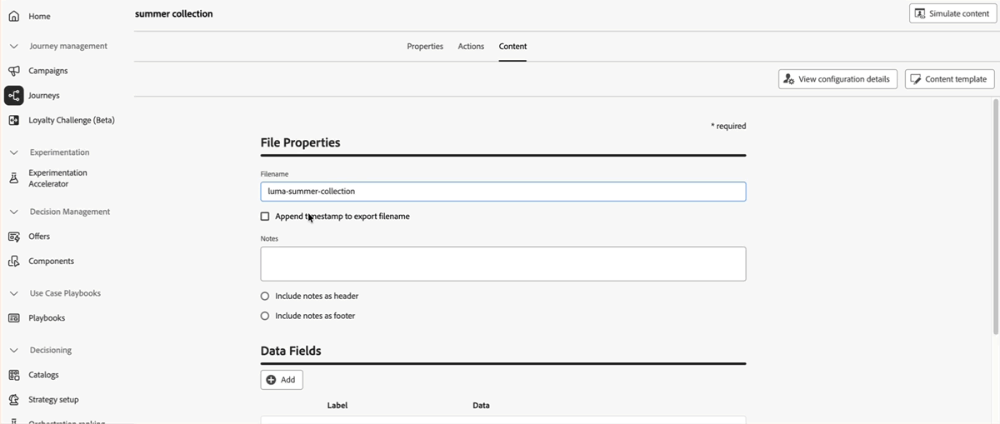

# Versionshinweise 2026 {#release-notes-2026}

Auf dieser Seite sind alle Funktionen und Verbesserungen für [!DNL Journey Optimizer] aufgeführt, die im Jahr 2026 veröffentlicht wurden.

## Versionshinweise Februar 2026 {#feb-26-01-rn}

### Neue Funktionen {#feb-26-01-features}

<table>
<thead>
<tr>
<th><strong>Journey-Schlichtung</strong> </th>
</tr>
</thead>
<tbody>
<tr>
<td>

Sie können jetzt <strong>Rangfolgeformeln</strong> verwenden, um die Journey-Prioritätswerte basierend auf Kundenprofilattributen und Kontextfaktoren automatisch zu erhöhen, sodass Kundinnen und Kunden in die relevantesten Journey gelangen.

Diese Funktion ist nur für eine Gruppe von Organisationen verfügbar (eingeschränkte Verfügbarkeit). Um Zugriff zu erhalten, wenden Sie sich an den Adobe-Support.

Weitere Informationen finden Sie in der <a href="../conflict-prioritization/journey-ranking-formulas.md">ausführlichen Dokumentation</a>.

Verfügbarkeitsdatum: Mittwoch, 24. Februar 2026

</td>
</tr>
</tbody>
</table>

<table>
<thead>
<tr>
<th><strong>Aktionsaktivität in Journeys</strong> </th>
</tr>
</thead>
<tbody>
<tr>
<td>

Journey Optimizer unterstützt eine neue generische <strong>Aktionsaktivität</strong> mit der Sie sowohl Einzelaktionen als auch eingehende Aktionsgruppen mit mehreren Aktionen konfigurieren können, was eine optimierte Aktionskonfiguration innerhalb der Journey-Arbeitsfläche ermöglicht. Diese neue Funktion ermöglicht insbesondere Folgendes:

<ul>
<li>Eine vereinfachte, native Aktionskonfiguration innerhalb der Journey-Arbeitsfläche</li>
<li>Die Möglichkeit, eingehende Aktionsgruppen mit mehreren Aktionen zu erstellen</li>
<li>Die Möglichkeit, jeder integrierten Kanalaktion eine Optimierung hinzuzufügen</li>
<li>Die Möglichkeit, jeder Aktion sowohl experimentelle als auch mehrsprachige Optionen hinzuzufügen.</li>
</ul>

Diese Funktion war zuvor nur eingeschränkt verfügbar, steht aber nun für alle Umgebungen zur Verfügung (allgemeine Verfügbarkeit).

Weitere Informationen finden Sie in der <a href="../building-journeys/journey-action.md">ausführlichen Dokumentation</a>.

Verfügbarkeitsdatum: Samstag, 20. Februar 2026

<strong>Hinweis:</strong> Alle nativen Kanäle sind jetzt über die Aktion-Journey-Aktivität zugänglich. Ältere native Kanalaktivitäten werden mit der März-Version eingestellt. Vorhandene Journey mit Legacy-Aktionen funktionieren weiterhin wie bisher - es ist keine Migration erforderlich.

</td>
</tr>
</tbody>
</table>

<table>
<thead>
<tr>
<th><strong>Senden ausgehender Nachrichten schwenken</strong> </th>
</tr>
</thead>
<tbody>
<tr>
<td>

Sie können jetzt einen Zeitplan für Nachrichten aus Journey Optimizer-Kampagnen oder Journeys festlegen, die im Laufe der Zeit in kontrollierten Batches versendet werden.

Der Wave-Versand bietet die folgenden Vorteile:

<ul>
<li>Bessere Zustellbarkeit: Spread sendet im Laufe der Zeit, um einen guten Ruf als Absender zu wahren und das Risiko zu reduzieren, als Spam gekennzeichnet zu werden.</li>
<li>Laststeuerung - Vermeiden Sie die Überlastung nachgelagerter Systeme (z. B. Callcenter, Landingpages), indem Sie einschränken, wie viele Nachrichten gleichzeitig gesendet werden.</li>
<li>Anwendungsfälle mit hohem Volumen und zeitkritischer Relevanz - geeignet für große Zielgruppen oder zur Steuerung des Timings (z. B. Call-Center-Kapazität, Anlaufphase oder zeitlich begrenzte Angebote).</li>
</ul>

In <strong>Kampagnen</strong> ist diese Funktion für alle Umgebungen verfügbar (allgemeine Verfügbarkeit). Weitere Informationen finden Sie in der <a href="../campaigns/send-using-waves.md">ausführlichen Dokumentation</a>.

In <strong>Journey</strong> ist diese Funktion nur für eine Reihe von Organisationen verfügbar (eingeschränkte Verfügbarkeit). Wenden Sie sich an Ihren Adobe-Support-Mitarbeiter, um Zugriff zu erhalten. Weitere Informationen finden Sie in der <a href="../building-journeys/send-using-waves.md">ausführlichen Dokumentation</a>.

Verfügbarkeitsdatum: Freitag, 19. Februar 2026

</td>
</tr>
</tbody>
</table>

<table>
<thead>
<tr>
<th><strong>Migrieren von Subdomains zur benutzerdefinierten Delegierung</strong> </th>
</tr>
</thead>
<tbody>
<tr>
<td>

Sie können jetzt Subdomains mit dem CNAME-Delegierungsmodus direkt über die Benutzeroberfläche in die benutzerdefinierte Delegierung migrieren, damit Sie strengere Sicherheitsrichtlinien gemäß den Richtlinien Ihres Unternehmens einhalten können, ohne die Kanalkonfigurationen neu erstellen zu müssen.

Diese Funktion ist nur für eine Gruppe von Organisationen verfügbar (eingeschränkte Verfügbarkeit). Um Zugriff zu erhalten, wenden Sie sich an den Adobe-Support.

Weitere Informationen finden Sie in der <a href="../configuration/custom-subdomain-migration.md">ausführlichen Dokumentation</a>.

Verfügbarkeitsdatum: Freitag, 19. Februar 2026

</td>
</tr>
</tbody>
</table>

<table>
<thead>
<tr>
<th><strong>Web-Push-Benachrichtigungskanal</strong> </th>
</tr>
</thead>
<tbody>
<tr>
<td>

Adobe Journey Optimizer unterstützt jetzt <strong>Web-Push-Benachrichtigungen</strong> und erweitert den Push-Kanal über Mobile hinaus. Sie können Benachrichtigungen nahtlos an <strong>mobile und Desktop-Browser</strong> senden, sodass Ihre Kundinnen und Kunden direkt auf ihren Geräten erreicht werden, ohne dass eine App erforderlich ist. Diese Verbesserung ermöglicht es Ihnen, Benutzende in Echtzeit mit zeitnahen, personalisierten Nachrichten anzusprechen, unter Nutzung derselben Authoring-Workflows und Targeting-Funktionen, die bereits für mobile Push-Benachrichtigungen verfügbar sind.

Diese Funktion wurde bereits in Beta veröffentlicht und steht allen Umgebungen zur Verfügung (allgemeine Verfügbarkeit).

Weitere Informationen finden Sie in der <a href="../push/push-configuration-web.md">ausführlichen Dokumentation</a>.

Verfügbarkeitsdatum: Samstag, 13. Februar 2026

</td>
</tr>
</tbody>
</table>

<table>
<thead>
<tr>
<th><strong>Aktivität „Inhaltsentscheidung“ </strong> </th>
</tr>
</thead>
<tbody>
<tr>
<td>

Eine neue <strong>Aktivität Inhaltsentscheidung</strong> ist jetzt auf der Journey-Arbeitsfläche verfügbar, um personalisierte Angebote direkt in die Journey Ihrer Kunden zu integrieren. Mit dieser Aktivität können Sie entscheidungsbasierte Inhalte bereitstellen und diese Angebote auf Ihrem gesamten Journey referenzieren - unter Bedingungen für die Erstellung von Verzweigungen auf der Grundlage der Eignung, bei benutzerdefinierten Aktionen zur Weitergabe von Angebotsdaten an externe Systeme und bei anderen Aktivitäten zur Erstellung vollständig personalisierter Kundenerlebnisse.

Diese Funktion war zuvor nur eingeschränkt verfügbar, steht aber nun für alle Umgebungen zur Verfügung (allgemeine Verfügbarkeit).

Weitere Informationen finden Sie in der <a href="../building-journeys/content-decision.md">ausführlichen Dokumentation</a>.

Verfügbarkeitsdatum: Mittwoch, 10. Februar 2026

</td>
</tr>
</tbody>
</table>

<table>
<thead>
<tr>
<th><strong>APIs für Self-Service-Migrations-Tools</strong> </th>
</tr>
</thead>
<tbody>
<tr>
<td>

Migrations-Tool-APIs sind jetzt verfügbar, um <strong> (Entscheidungs-Management)-</strong> programmgesteuert nach <strong>Decisioning</strong> zu migrieren, mit:

<ul>
<li>Flexible Migrationsbereiche (Sandbox-, Angebots- oder Entscheidungsebene)</li>
<li>Automatische Analyse und Validierung von Abhängigkeiten</li>
<li>Rollback-Unterstützung für abgeschlossene Migrationen</li>
<li>Detaillierte Migrationsberichte mit Objektzuordnungen</li>
</ul>

Weitere Informationen finden Sie in der <a href="../experience-decisioning/decisioning-migration-api.md">ausführlichen Dokumentation</a>.

Verfügbarkeitsdatum: 3. Februar 2026

</td>
</tr>
</tbody>
</table>

<table>
<thead>
<tr>
<th><strong>Monitoring von benutzerdefinierten Aktionen</strong> </th>
</tr>
</thead>
<tbody>
<tr>
<td>

Vertiefen Sie insight in den Zustand und die Leistung Ihrer benutzerdefinierten Aktionsendpunkte mit einem neuen Überwachungs-Dashboard und angereicherten Journey-Schritt-Ereignisdaten. Verfolgen Sie erfolgreiche Aufrufe, Fehler, Durchsatz, Antwortzeiten und Warteschlangenwartezeiten nach, um schnell zu erkennen, wann, wo und warum Anomalien auftreten.

Diese Funktion war zuvor nur eingeschränkt verfügbar, steht aber nun für alle Umgebungen zur Verfügung (allgemeine Verfügbarkeit).

Weitere Informationen finden Sie in der <a href="../action/reporting.md">ausführlichen Dokumentation</a>.

Verfügbarkeitsdatum: 3. Februar 2026

</td>
</tr>
</tbody>
</table>

<table>
<thead>
<tr>
<th><strong>Entscheidungsunterstützung im SMS-Kanal</strong> </th>
</tr>
</thead>
<tbody>
<tr>
<td>

Sie können jetzt den Inhalt Ihrer SMS-Nachrichten mit Decisioning personalisieren und optimieren. Verwenden Sie Prioritätswerte, Formeln oder KI-Modelle, um Ihren Kundinnen und Kunden den besten Inhalt anzuzeigen.

Weitere Informationen finden Sie in der <a href="../experience-decisioning/create-decision.md">ausführlichen Dokumentation</a>.

Verfügbarkeitsdatum: 2. Februar 2026

</td>
</tr>
</tbody>
</table>

### Verbesserungen {#feb-26-01-improv}

Im Folgenden sind die Verbesserungen dieser Version aufgeführt.

#### Konfiguration

* **Nutzung von Erlebnisereignissen in Journey-Ausdrücken** - Ab dem 1. April 2026 wird die Verwendung von Erlebnisereignisattributen in Journey-Ausdrücken für Organisationen, die diese Funktion in den letzten 90 Tagen nicht verwendet haben, nicht mehr unterstützt. Diese Funktion ist bereits seit dem 8. Juli 2025 für neue Kundenorganisationen nicht mehr verfügbar. Alternativen finden Sie unter [Suche nach Erlebnisereignissen in Journey](../building-journeys/exp-event-lookup.md).

#### Content-Management

<!--
* **Update brands with new color tab** - Brand guidelines help ensure your brand is presented consistently across all touchpoints. The new <strong>Colors</strong> section defines the standards for your brand's color system, outlining how colors are selected, organized, and applied across experiences. It ensures consistent use of primary, secondary, accent, and neutral colors to support a cohesive, accessible, and recognizable brand identity. [Read more](../content-management/brands.md)
-->

* **Verwenden von Designs zum Konvertieren von Bildern in E-Mail-Vorlagen** - Beim Konvertieren eines Bildes in eine E-Mail-Vorlage in Journey Optimizer können Sie jetzt ein Design als Eingabe verwenden, sodass die generierte HTML Ihren Markenparametern entspricht. Stile wie Hintergrundfarbe, Schaltflächenfarbe, Schriftarten, Zeilenabstand, Ränder und Abstand werden automatisch angewendet, wodurch die manuelle Entwurfsarbeit reduziert wird und eine Vorlage bereitgestellt wird, die mit minimalen Bearbeitungen verwendet werden kann. [Weitere Informationen](../content-management/image-to-html.md)

  Verfügbarkeit: 17. Februar 2026.

<!--* **Text mode for fragments** - You can now create and manage text versions of your fragments, supporting workflows that rely on plain text content and providing the same flexibility as in email content. [Read more](../content-management/create-fragments.md)-->

#### E-Mail-Designer

* **Texteinzug** - Sie können jetzt eine anpassbare linke Einrückung auf die erste Zeile von Absätzen in Textkomponenten direkt über das Eigenschaftenbedienfeld anwenden. <!--The new **Indentation** control lets you define indentation in pixels or percentage via a numeric input or slider, with live preview on the canvas. -->Dies verbessert die Lesbarkeit von Langforminhalten wie Leitartikeln und Artikeln. [Weitere Informationen](../email/get-started-email-style.md)

  Verfügbarkeit: 18. Februar 2026.

#### Entscheidungsfindung

* **Eingehende Edge-Unterstützung für die Verwendung von Adobe Experience Platform-Daten in Decisioning** - Die Verwendung von Adobe Experience Platform-Daten in Decisioning unterstützt jetzt eingehende Edge-Anwendungsfälle zusätzlich zu E-Mail und benutzerdefinierten Aktionen in Journey. [Weitere Informationen](../experience-decisioning/aep-data-exd.md)

  Diese Funktion ist nur für eine Gruppe von Organisationen verfügbar (eingeschränkte Verfügbarkeit). Um Zugriff zu erhalten, wenden Sie sich an den Adobe-Support.

* **Entscheidungsvorschau im Code-basierten Erlebniskanal** - Sie können jetzt Entscheidungselemente in der Vorschau anzeigen, wenn Sie Decisioning mit dem Code-basierten Erlebniskanal konfigurieren. Die Vorschau ist vor der Live-Schaltung direkt in der Authoring-Oberfläche verfügbar. [Weitere Informationen](../code-based/test-code-based.md#preview-code-based)

  Verfügbarkeitsdatum: Donnerstag, 18. Februar 2026

* **Anhängen von Fragmenten an Entscheidungselemente** – Journey Optimizer bietet jetzt die Möglichkeit, Fragmente an Entscheidungselemente anzuhängen, die in Code-basierten Erlebniskampagnen über Entscheidungsrichtlinien genutzt werden können. [Weitere Informationen](../experience-decisioning/fragments-decision-policies.md)

  Diese Funktion war zuvor nur eingeschränkt verfügbar, steht aber nun für alle Umgebungen zur Verfügung (allgemeine Verfügbarkeit).

  Verfügbarkeit: 12. Februar 2026.

#### Personalisierung

* **Execution Metadata Helper** - Die Hilfsfunktion `executionMetadata` ist jetzt für alle Journey Optimizer-Kunden verfügbar. Verwenden Sie diese Option, um kontextuelle Informationen dynamisch an eine native Aktion anzuhängen und in einem Datensatz zu erfassen, damit sie in externe Systeme exportiert werden können. [Weitere Informationen](../personalization/functions/helpers.md#execution-metadata)

  Diese Funktion war zuvor nur eingeschränkt verfügbar, steht aber nun für alle Umgebungen zur Verfügung (allgemeine Verfügbarkeit).

  Verfügbarkeit: 20. Februar 2026.

#### SMS

* **SMS-Webhooks** - Webhooks werden jetzt von allen SMS-Anbietern unterstützt. Sie können jeden Webhook für einen bestimmten Zweck konfigurieren: eingehende Webhooks zur Erfassung eingehender Nachrichten und Feedback-Webhooks für den Empfang von Versandbestätigungen, Statusaktualisierungen und anderen nachrichtenbezogenen Ereignissen. [Weitere Informationen](../sms/sms-webhook.md)

  Verfügbarkeit: 2. Februar 2026.

## Januar 2026 – Versionshinweise {#jan-26-rn}

<!--**Release date**: January 27-28, 2026-->

### Neue Funktionen {#jan-26-01-features}

<table>
<thead>
<tr>
<th><strong>Unterstützung von Entscheidungen im Push-Kanal</strong> </th>
</tr>
</thead>
<tbody>
<tr>
<td>

Sie können jetzt den Inhalt Ihrer <strong>Push-Benachrichtigungen“ mit </strong>Decisioning<strong> personalisieren und </strong>. Verwenden Sie Prioritätswerte, Formeln oder KI-Modelle, um Ihren Kundinnen und Kunden den besten Inhalt anzuzeigen.

Für Experience Decisioning mit Push-Benachrichtigungen ist eine bestimmte Version der Mobile SDK erforderlich. Bevor Sie diese Funktion implementieren, überprüfen Sie die <a href="https://developer.adobe.com/client-sdks/home/release-notes/" target="_blank">Versionshinweise</a>, um die erforderliche Version zu identifizieren und sicherzustellen, dass Sie das Upgrade entsprechend durchgeführt haben. Sie können auch alle verfügbaren SDK-Versionen für Ihre Plattform in <a href="https://developer.adobe.com/client-sdks/home/current-sdk-versions/" target="_blank">diesem Abschnitt</a> anzeigen.

Weitere Informationen finden Sie in der <a href="../experience-decisioning/create-decision.md">ausführlichen Dokumentation</a>.

Verfügbarkeitsdatum: 30. Januar 2026

</td>
</tr>
</tbody>
</table>

<table>
<thead>
<tr>
<th><strong>Direkt-Mail-Kanal in Journeys</strong> </th>
</tr>
</thead>
<tbody>
<tr>
<td>

Der Kanal <strong>Direkt-Mail</strong> war bisher auf Kampagnen beschränkt und ist jetzt auf der Journey-Arbeitsfläche verfügbar, sodass Sie Direkt-Mail in Ihre Journeys integrieren können. Direkt-Mail kann jetzt sowohl in <strong>Batch- als auch in 1:1-Journey-Szenarien verwendet werden</strong>, mit Unterstützung für die Dateiextraktionskonfiguration und zeitbasierte Häufigkeitseinstellungen.

Diese Funktion war zuvor nur eingeschränkt verfügbar, steht aber nun für alle Umgebungen zur Verfügung (allgemeine Verfügbarkeit).

Weitere Informationen finden Sie in der <a href="../direct-mail/get-started-direct-mail.md">ausführlichen Dokumentation</a>.

Verfügbarkeitsdatum: Freitag, 29. Januar 2026

</td>
</tr>
</tbody>
</table>

<table>
<thead>
<tr>
<th><strong>Ruhezeiten (zeitbasierte Ausschlüsse)</strong> </th>
</tr>
</thead>
<tbody>
<tr>
<td>

Mithilfe von <strong>Ruhezeiten</strong> können Sie zeitbasierte Ausschlüsse für den E-Mail-, SMS-, Push- und WhatsApp-Kanal definieren. Sie stellen sicher, dass während bestimmter Zeiträume keine Nachrichten gesendet werden, und helfen Ihnen so, Kundenpräferenzen und Compliance-Anforderungen zu erfüllen. Ruhezeiten können über <strong>Regelsätze</strong> angewendet werden, die zur präzisen Steuerung Einzelaktionen in Kampagnen oder Journeys zugewiesen werden können.

Diese Funktion wurde zuvor mit eingeschränkter Verfügbarkeit veröffentlicht und steht nun allen Umgebungen zur Verfügung. Mit dieser allgemeinen Verfügbarkeit bietet die Funktion jetzt die Möglichkeit, dass Kundinnen und Kunden eine Kampagnenaktion bis zum Abschluss der Ruhezeiten in die Warteschlange stellen und die aktivierte Regel für Ruhezeiten in der Vorschau anzeigen können.

Weitere Informationen finden Sie in der <a href="../conflict-prioritization/quiet-hours.md">ausführlichen Dokumentation</a>.

Verfügbarkeitsdatum: Freitag, 29. Januar 2026

</td>
</tr>
</tbody>
</table>

<table>
<thead>
<tr>
<th><strong>Nachrichtenexport</strong> </th>
</tr>
</thead>
<tbody>
<tr>
<td>

Eine neue Funktion zum <strong>Nachrichtenexport</strong> ist jetzt für den E-Mail- und SMS-Kanal verfügbar. Mit dieser Funktion können Sie Inhalte gesendeter Nachrichten automatisch in einen dedizierten Experience Platform-Datensatz exportieren, um Folgendes zu ermöglichen:

<ul>
<li>Einhaltung behördlicher Auflagen (z. B. HIPAA)</li>
<li>Archivieren von Nachrichten für Rechtsansprüche und Anfragen an die Kundenunterstützung</li>
<li>Aufbewahren von Kopien der an Kontakte gesendeten personalisierten Inhalte</li>
</ul>

Einträge werden nach der Aufnahme 7 Kalendertage lang im AJO-Nachrichtenexport-Datensatz aufbewahrt. Während dieses Aufbewahrungszeitraums können Sie sie über Experience Platform-Ziele in Ihren eigenen Speicher exportieren. Die Funktion wird auf der Ebene der Kanalkonfiguration aktiviert, sodass Sie <strong>granulare Kontrolle</strong> über die exportierten Nachrichten erhalten.

Diese Funktion ist nur für den E-Mail- und SMS-Kanal verfügbar und steht Unternehmen zur Verfügung, die das Add-on für den Nachrichtenexport erworben haben. Weitere Informationen erhalten Sie beim Adobe-Support.

Weitere Informationen finden Sie in der <a href="../configuration/message-export.md#message-export">ausführlichen Dokumentation</a>.

Verfügbarkeitsdatum: 28. Januar 2026

</td>
</tr>
</tbody>
</table>

<table>
<thead>
<tr>
<th><strong>Direkt-Mail-Kanal in orchestrierten Kampagnen</strong> </th>
</tr>
</thead>
<tbody>
<tr>
<td>

Der Direkt-Mail-Kanal ist jetzt in orchestrierten Kampagnen verfügbar.  Die <strong>Direkt-Mail-Aktivität</strong> erleichtert den Direkt-Mail-Versand innerhalb der orchestrierten Kampagne und ermöglicht sowohl einmalige als auch wiederkehrende Nachrichten. Sie dient dazu, das Generieren der von Direkt-Mail-Dienstleistern benötigten <strong>Extraktionsdatei</strong> zu automatisieren. Kanalaktivitäten können in der Arbeitsfläche für orchestrierte Kampagnen kombiniert werden, um kanalübergreifende Kampagnen zu erstellen, mit denen basierend auf Kundenverhalten und Daten Aktionen ausgelöst werden können.

Weitere Informationen finden Sie in der <a href="../orchestrated/activities/channels.md#channel">ausführlichen Dokumentation</a>.

Verfügbarkeitsdatum: 28. Januar 2026

</td>
</tr>
</tbody>
</table>

<table>
<thead>
<tr>
<th><strong>Journey Agent – Erstellen einer Journey</strong> </th>
</tr>
</thead>
<tbody>
<tr>
<td>

Journey Agent bietet jetzt Funktionen zur Inhaltserstellung, mit denen Benutzende von Journey Optimizer über eine <strong>Schnittstelle für natürliche Sprache</strong> Marketing-Journeys erstellen und konfigurieren können. Mit diesen neuen Fähigkeiten können Fachleute schnell Journeys erstellen, indem sie ihre Anforderungen einfach in <strong>Dialog-Prompts</strong> beschreiben. Diese Neuerung optimiert den Prozess der Journey-Erstellung und ermöglicht es Marketing-Fachleuten, sich auf die Strategie statt auf die technische Konfiguration zu konzentrieren.

Weitere Informationen finden Sie in der <a href="../start/ai-features.md#journey-agent">ausführlichen Dokumentation</a>.

Verfügbarkeitsdatum: 12. Januar 2026

</td>
</tr>
</tbody>
</table>

<table>
<thead>
<tr>
<th><strong>API zum Abrufen von Aktionskampagnen</strong> </th>
</tr>
</thead>
<tbody>
<tr>
<td>

Eine neue Journey Optimizer-API ist jetzt verfügbar, mit der Sie <strong>kampagnenbezogene Daten</strong> wie Details, Versionen und Konfigurationen programmgesteuert abrufen und überprüfen können.

Weitere Informationen finden Sie in der <a href="https://developer.adobe.com/journey-optimizer-apis/references/campaigns-retrieve/" target="_blank">ausführlichen Dokumentation</a>.

Verfügbarkeitsdatum: 24. November 2025

</td>
</tr>
</tbody>
</table>

<table>
<thead>
<tr>
<th><strong>Designs im E-Mail-Designer</strong> </th>
</tr>
</thead>
<tbody>
<tr>
<td>

Sie können jetzt schnell <strong>vorab genehmigte Designs</strong> anwenden, um <strong>Markenkonsistenz</strong> über alle E-Mails hinweg sicherzustellen, den Prozess der Kampagnenerstellung zu beschleunigen und eigenständig hochwertige E-Mails zu erstellen, während Sie die Abhängigkeit von Designteams reduzieren.

Diese Funktion wurde bereits in der Beta-Version veröffentlicht und ist jetzt für ausgewählte Organisationen verfügbar (eingeschränkte Verfügbarkeit). Um Zugriff zu erhalten, wenden Sie sich an den Adobe-Support.

Weitere Informationen finden Sie in der <a href="../email/apply-email-themes.md">ausführlichen Dokumentation</a>.

Verfügbarkeitsdatum: 5. November 2025

</td>
</tr>
</tbody>
</table>

### Verbesserungen {#jan-26-01-improv}

#### KI

* **Inhaltsqualitätsprüfungen mit dem KI-Assistenten** – Zusätzlich zur Markenausrichtung können Sie jetzt die gesamte <strong>Inhaltsqualität</strong> bewerten, um potenzielle Probleme mit <strong>Lesbarkeit</strong>, Kohärenz und Effektivität unabhängig von Ihren Markenrichtlinien aufzudecken. Diese automatisierten Prüfungen helfen bei der Erkennung von unklaren Botschaften, inkonsistentem Ton oder strukturellen Lücken. [Weitere Informationen](../content-management/brands-score.md#validate-quality).

   [Funktion im Video kennenlernen](https://video.tv.adobe.com/v/3470544/?learn=on).

#### Journeys

* **Kombinieren von Aktionen für native und Adobe Campaign-Nachrichten** – Mit Journey Optimizer können Sie jetzt Aktionen von <strong>Adobe Campaign v7/v8</strong>-Nachrichten mit <strong>nativen Kanalaktionen</strong> in derselben Journey kombinieren. [Weitere Informationen](../building-journeys/using-adobe-campaign-v7-v8.md)

  Verfügbarkeitsdatum: Mittwoch, 27. Januar 2026

* **Fehlerantwort-Payload für benutzerdefinierte Aktionen** – Sie können jetzt eine optionale <strong>Fehlerantwort-Payload</strong> für benutzerdefinierte Aktionen definieren. Wenn ein Aufruf fehlschlägt, wird die Fehler-Payload im Journey-Kontext (unter dem errorResponse-Knoten der Aktion) verfügbar gemacht und ist in der Verzweigung <strong>Timeout/Fehler</strong> verfügbar, um eine umfassendere Fallback-Logik und `jo_status_code` Debugging zu unterstützen. [Weitere Informationen](../action/about-custom-action-configuration.md#define-the-message-parameters)

  Verfügbarkeitsdatum: Mittwoch, 27. Januar 2026

* **Validierung der Journey-Payload-Größe in Journeys** – Journey Optimizer validiert jetzt <strong>Payload-Größen</strong>, um eine optimale Leistung und Systemstabilität sicherzustellen. Beim Erstellen oder Veröffentlichen von Journeys erhalten Sie deutliche <strong>Warnungen und Fehler</strong>, wenn die Payload-Größe die empfohlenen Grenzwerte erreicht oder überschreitet, sowie praktische Anleitungen zur Optimierung Ihrer Journey-Konfiguration. Diese proaktive Validierung hilft Ihnen, potenzielle Probleme frühzeitig zu erkennen und die Journey-Leistung aufrechtzuerhalten. [Weitere Informationen](../start/guardrails.md#journey-payload-size)

  Verfügbarkeitsdatum: Mittwoch, 27. Januar 2026

* **Journey-Warnhinweise** – Neue <strong>vorkonfigurierte Warnhinweise</strong> sind für Journeys verfügbar.
   * <strong>Verwerfungsrate für Profile überschritten</strong> – Das Verhältnis von verworfenen Profilen zu eingetretenen Profilen in den letzten 5 Minuten hat den Schwellenwert überschritten
   * <strong>Fehlerrate bei benutzerdefinierter Aktion überschritten</strong> – Das Verhältnis von Fehlern bei benutzerdefinierten Aktionen zu erfolgreichen HTTP-Aufrufen in den letzten 5 Minuten hat den Schwellenwert überschritten
   * <strong>Fehlerrate für Profile überschritten</strong> – Das Verhältnis von fehlerhaften Profilen zu eingetretenen Profilen in den letzten 5 Minuten hat den Schwellenwert überschritten

  Weitere Informationen finden Sie in der [ausführlichen Dokumentation](../reports/alerts.md).

  Verfügbarkeitsdatum: 14. Oktober 2025

#### Orchestrierte Kampagnen

* **Vererbung von Datennutzungs-Labels für Zielgruppen** – Labels, die in Adobe Experience Platform angewendet werden, werden jetzt beim Speichern von <strong>Zielgruppen</strong> in orchestrierten Kampagnen automatisch übernommen, wodurch das manuelle <strong>DULE-Tagging</strong> reduziert wird. [Weitere Informationen](../orchestrated/activities/save-audience.md)

* **Vordefinierte Filter mit Parametern** – Sie können jetzt <strong>vordefinierte Filter</strong> mit <strong>Parametern</strong> in orchestrierten Kampagnen erstellen, um wiederverwendbare, bearbeitbare Regeln zu erhalten. [Weitere Informationen](../orchestrated/predefined-filters.md)

* **Auswählen von Attributen und Kopieren von Verteilungswerten** – Sie können jetzt direkt in der Ansicht <strong>Werteverteilung</strong> in orchestrierten Kampagnen <strong>Werte auswählen oder kopieren</strong>. [Weitere Informationen](../orchestrated/build-query.md)

* **Nachrichtenbestätigung vor dem Versand** – Ein <strong>Bestätigungsschritt</strong> ist jetzt standardmäßig aktiviert, bevor orchestrierte Kampagnen gesendet werden, um versehentliche Sendungen zu reduzieren. [Weitere Informationen](../orchestrated/activities/channels.md#confirm-message-sending)

* **Vordefinierte Retargeting-Filter** – Um das Retargeting für Anwendungsfälle mit orchestrierten Kampagnen zu erleichtern, werden in dieser Version neue <strong>Kampagnen-Feedback-Filter</strong> eingeführt. Mit diesen Filtern können Sie Zielgruppen direkt ansprechen, die auf <strong>Interaktionen mit Nachrichten</strong> basieren, z. B. gesendet, nur geöffnet, geöffnet oder geklickt oder geöffnet und geklickt, und die spezifische Kampagne oder Kampagne in der Transitionsphase auswählen, die Sie erneut ansprechen möchten. [Weitere Informationen](../orchestrated/retarget.md)

* **Unterstützung der Ratensteuerung** – Orchestrierte Kampagnen unterstützen jetzt <strong>Ratensteuerung</strong>, um Sendungen zu beschleunigen und <strong>Volumenbeschränkungen</strong> einzuhalten. [Weitere Informationen](../orchestrated/activities/channels.md#rate-control)

* **Schaltfläche „Neu starten“** – Orchestrierte Kampagnen enthalten jetzt eine <strong>Schaltfläche „Neu starten“</strong>, damit Sie bei Bedarf schnell <strong>Ausführungen neu starten</strong> können, bevor Sie die Kampagne veröffentlichen. [Weitere Informationen](../orchestrated/start-monitor-campaigns.md)

* **Unterstützung benutzergenerierter Metadaten** – Die Helper-Funktion <strong>executionMetadata</strong> ist jetzt für orchestrierte Kampagnen im Personalisierungseditor verfügbar, damit Sie jeder nativen Aktion Kontextinformationen anhängen und sie in einem Datensatz speichern können, um sie in externe Systeme zu exportieren. [Weitere Informationen](../personalization/functions/helpers.md#execution-metadata)

  Verfügbarkeitsdatum: Mittwoch, 27. Januar 2026

* **Live-Kampagnen auf Entwurfsstatus zurücksetzen** - Sie können jetzt orchestrierte Live-Kampagnen auf den Entwurfsstatus zurücksetzen, wenn Ausführungsfehler auftreten oder Sie geplante Kampagnen ändern müssen, bevor sie ausgeführt werden können. Diese Option ist verfügbar, bis die erste Nachricht gesendet wird. [Weitere Informationen](../orchestrated/start-monitor-campaigns.md#back-to-draft)

#### Kampagnen

* **Kampagne mithilfe der Zeitzone des Profils planen** - Die Kampagnenplanung kann jetzt die <strong>Zeitzone“ jedes Profils verwenden, </strong> Nachrichten zur gewünschten lokalen Zeit zu versenden. [Weitere Informationen](../campaigns/campaign-schedule.md)

  **Hinweis**: Diese Verbesserung steht nur einer Reihe von Organisationen zur Verfügung (eingeschränkte Verfügbarkeit).

  Verfügbarkeitsdatum: Mittwoch, 27. Januar 2026

#### Berechtigungen

* **Verhindern von Selbstvalidierung für Journeys und Kampagnen** – Beim Erstellen oder Festlegen einer <strong>Validierungsrichtlinie</strong> wurde eine Option hinzugefügt, um Erstellende von Journeys oder Kampagnen daran zu hindern, <strong>ihre eigenen Objekte zu genehmigen</strong>. [Weitere Informationen](../test-approve/approval-policies.md)

  Verfügbarkeitsdatum: Mittwoch, 27. Januar 2026
