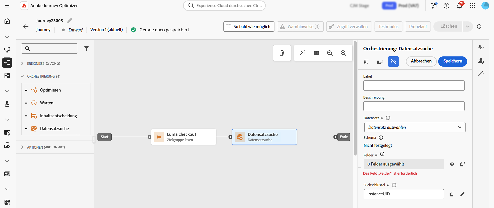
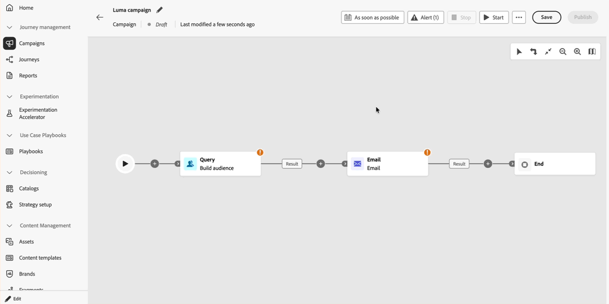
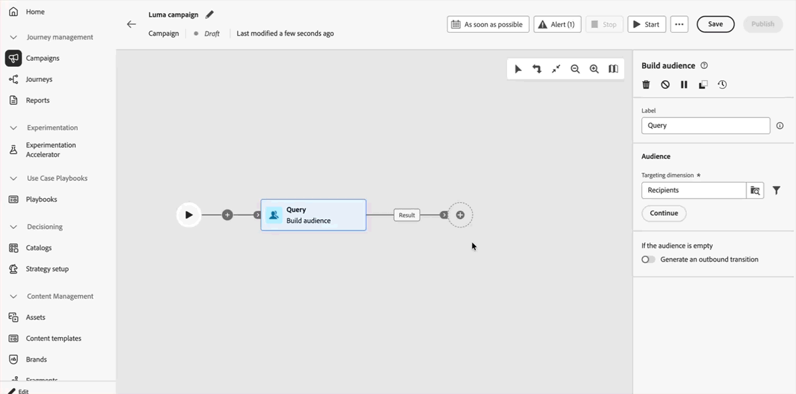
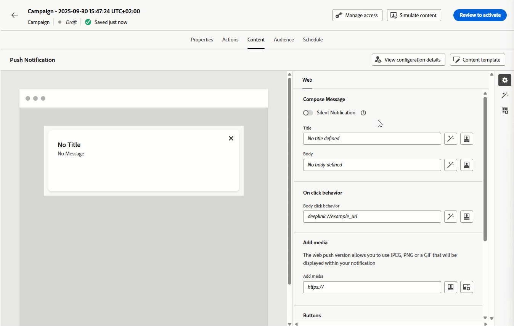

# Versionshinweise 2026 {#release-notes-2026}

Auf dieser Seite sind alle Funktionen und Verbesserungen für [!DNL Journey Optimizer] aufgeführt, die im Jahr 2026 veröffentlicht wurden.

## Versionshinweise April &#39;26 {#april-26-rn}

**Veröffentlichungsdatum**: 28.–29. April 2026

### Neue Funktionen {#april-26-features}

Die folgenden Funktionen wurden im April 2026 veröffentlicht.

<table>
<thead>
<tr>
<th><strong>Aktivität „Inkrementelle Abfrage“ in orchestrierten Kampagnen</strong> </th>
</tr>
</thead>
<tbody>
<tr>
<td>

<strong>Orchestrierte Kampagnen</strong> unterstützen jetzt eine Aktivität vom Typ <strong>Inkrementelle Abfrage</strong>, die nur Profile oder Ereignisse anspricht, die sich seit der letzten Ausführung neu qualifiziert haben.

Dadurch bleiben wiederkehrende Kampagnen auf neue Zielgruppen ausgerichtet (neue Anmeldungen, neu qualifizierte Mitglieder des Treueprogramms und ähnliche Segmente) und Abfrage-Workloads werden reduziert und redundante Sendungen im Laufe der Zeit vermieden.

Weitere Informationen finden Sie in der <a href="../orchestrated/activities/incremental-query.md#incremental-query-configuration">ausführlichen Dokumentation</a>.

Verfügbarkeitsdatum: 30. April 2026

</td>
</tr>
</tbody>
</table>

<table>
<thead>
<tr>
<th><strong>Absenderparameter im E-Mail-Header</strong> </th>
</tr>
</thead>
<tbody>
<tr>
<td>

Mit Journey Optimizer können Sie jetzt E-Mails senden, bei denen sich die sendende Entität (Absender) von der erstellenden Entität (Von) unterscheidet. Unterstützende E-Mail-Clients rendern dies normalerweise als „Absenderin bzw. Absender im Namen von Von“ oder zeigen einen „Über“-Hinweis an. Füllen Sie die optionalen Felder <strong>Absender-Header</strong> in den Einstellungen des E-Mail-Kanals aus, um diese Funktion zu konfigurieren.

Weitere Informationen finden Sie in der <a href="../email/header-parameters.md#sender-header">ausführlichen Dokumentation</a>.

</td>
</tr>
</tbody>
</table>

<table>
<thead>
<tr>
<th><strong>CC-Feld in E-Mail-Kanaleinstellungen</strong> </th>
</tr>
</thead>
<tbody>
<tr>
<td>

Sie können jetzt ein optionales CC-Feld (Carbon Copy) in den Einstellungen für den E-Mail-Kanal konfigurieren. Im Gegensatz zu BCC sind CC-Empfangende für die primäre Empfängerin bzw. den primären Empfänger sichtbar, was eine transparente Kommunikation und eine klarere Eigentümerschaft ermöglicht.

Auf diese Weise können Sie automatisch die richtige Stakeholderin bzw. den richtigen Stakeholder für jede Nachricht kopieren (z. B. eine Beziehungs-Managerin bzw. einen Beziehungs-Manager oder eine Kontoinhaberin bzw. einen Kontoinhaber) und gleichzeitig sicherstellen, dass die Kundschaft weiß, an wen sie sich zwecks weiterer Kommunikation wenden muss.

Das CC-Feld unterstützt Personalisierung, sodass eine einzelne Konfiguration Kopien basierend auf Profildaten dynamisch weiterleiten kann und sie so ohne zusätzliche Einrichtung für mehrere Anwendungsfälle skalierbar ist.

Weitere Informationen finden Sie in der <a href="../configuration/cc-email-field.md">ausführlichen Dokumentation</a>.

</td>
</tr>
</tbody>
</table>

<table>
<thead>
<tr>
<th><strong>Kopieren orchestrierter Kampagnen in Sandboxes</strong> </th>
</tr>
</thead>
<tbody>
<tr>
<td>

Die Sandbox-Tools unterstützen jetzt das Verpacken und Kopieren orchestrierter Kampagnen von einer Sandbox in eine andere. Dadurch entfällt die Notwendigkeit, Kampagnen in jeder Umgebung manuell neu zu erstellen. Wenn eine Kampagne in einem Paket zusammengefasst wird, werden ihre abhängigen Kernobjekte wie Zusammenführungsrichtlinien und Nachrichten automatisch einbezogen, sodass die importierte Kampagne bereit für die Konfiguration und Validierung ist. Zum Schutz der Produktionsumgebungen landen alle importierten Kampagnen im Entwurfsstatus in der Ziel-Sandbox, d. h. vor der Live-Schaltung der Kampagne durchlaufen Teams einen Prüfungs- und Genehmigungsschritt.

Weitere Informationen finden Sie in der <a href="../configuration/copy-objects-to-sandbox.md">ausführlichen Dokumentation</a>.

</td>
</tr>
</tbody>
</table>

<table>
<thead>
<tr>
<th><strong>AI Agent-Integration in Journey Optimizer über MCP</strong> </th>
</tr>
</thead>
<tbody>
<tr>
<td>

Adobe Journey Optimizer bietet jetzt einen <strong>MCP (Model Context Protocol)-Server</strong> der Kampagnen-, Kanalkonfigurations- und Sandbox-Vorgänge direkt in jeder MCP-kompatiblen Anwendung aufbereitet. Mit dieser Integration können verschiedene Personas basierend auf denselben Orchestrierungsdaten zusammenarbeiten. Anstatt Abfragen für die Adobe Journey Optimizer-REST-API zu schreiben oder durch mehrere Bildschirme der Benutzeroberfläche zu navigieren, können Sie Ihre Absicht im Gespräch beschreiben und das LLM die entsprechenden MCP-Tools aufrufen lassen. Diese Funktion ist derzeit in Claude Web und Desktop verfügbar.

Diese Funktion steht allen Kundinnen und Kunden als öffentliche Beta-Version zur Verfügung.

Weitere Informationen finden Sie in der <a href="../integrations/ajo-mcp.md">ausführlichen Dokumentation</a>.

</td>
</tr>
</tbody>
</table>

<table>
<thead>
<tr>
<th><strong>Journey-Schlichtung – KI-Modelle</strong> </th>
</tr>
</thead>
<tbody>
<tr>
<td>

Sie können jetzt <strong>KI-Modelle</strong> in Ihren Rangfolgeformeln verwenden, um die Journey-Prioritätswerte basierend auf Kundenprofilattributen und kontextuellen Faktoren automatisch zu erhöhen, sodass Kundinnen und Kunden in die relevantesten Journeys eintreten.

Diese Funktion ist nur für eine Gruppe von Organisationen verfügbar (eingeschränkte Verfügbarkeit). Um Zugriff zu erhalten, wenden Sie sich an den Adobe-Support.

Weitere Informationen finden Sie in der <a href="../conflict-prioritization/journey-ai-models.md">ausführlichen Dokumentation</a>.

</td>
</tr>
</tbody>
</table>

<table>
<thead>
<tr>
<th><strong>Adobe Express-Integration</strong> </th>
</tr>
</thead>
<tbody>
<tr>
<td>

Durch die <b>Adobe Express-Integration</b> in Adobe Journey Optimizer können Sie die Bearbeitungs-Tools von Adobe Express direkt während der Inhaltserstellung verwenden und so die Größe von Assets ändern, ihre Hintergründe entfernen, sie zuschneiden und sie in JPEG oder PNG konvertieren.

Diese Funktion war zuvor nur eingeschränkt verfügbar, steht aber nun für alle Umgebungen zur Verfügung (allgemeine Verfügbarkeit).

Weitere Informationen finden Sie in der <a href="../integrations/express.md">ausführlichen Dokumentation</a>.

Verfügbarkeitsdatum: 23. April 2026

</td>
</tr>
</tbody>
</table>

<table>
<thead>
<tr>
<th><strong>Optimieren von E-Mails für KI-Posteingänge</strong> </th>
</tr>
</thead>
<tbody>
<tr>
<td>

Adobe Journey Optimizer bietet jetzt eine neue Funktion, mit der sichergestellt wird, dass Ihre E-Mails für KI-gestützte Posteingänge wie Apple Intelligence und Google Gemini in Gmail optimal strukturiert sind.

KI-Assistenten steuern zunehmend, wie Empfängerinnen und Empfänger E-Mails lesen und auf sie reagieren. Diese Funktion hilft Ihnen bei der Generierung und Erstellung von Inhalten, die optimal auf nachgelagerte KI-Aufgaben zugeschnitten sind, einschließlich Zusammenfassung, Klassifizierung, Priorisierung und Extraktion von Absichten.

Weiterführende Informationen finden Sie unter <a href="../email/llm-email-optimizer.md">Optimieren von E-Mails für KI-Posteingänge</a>.

Verfügbarkeitsdatum: 17. April 2026

</td>
</tr>
</tbody>
</table>

<table>
<thead>
<tr>
<th><strong>KI-Assistent für Personalisierungsausdrücke</strong> </th>
</tr>
</thead>
<tbody>
<tr>
<td>

[!DNL Adobe Journey Optimizer] enthält jetzt <strong>KI-Assistent</strong> direkt im Personalisierungseditor und die E-Mail-Designer, die Eingabeaufforderungen in natürliche Sprachen in gültige Personalisierungsausdrücke und bedingte Logik umwandelt, sodass kein Syntaxwissen erforderlich ist. Beschreiben Sie die gewünschte Personalisierung und die KI generiert einsatzbereiten Code, den Sie sofort anwenden oder durch Folge-Prompts verfeinern können.

Der Assistent arbeitet auch rückwärts. Wählen Sie einen vorhandenen Ausdruck aus und bitten Sie ihn, die Logik zu erklären, Probleme zu identifizieren oder Verbesserungen vorzuschlagen. Dies ist nicht nur für das Erstellen neuer Ausdrücke nützlich, sondern auch für die Überprüfung und das Debugging vorhandener Ausdrücke in Ihrem Team.

Weitere Informationen finden Sie unter <a href="../content-management/generative-personalization-expressions.md">KI-Assistent für Personalisierungsausdrücke</a>.

Verfügbarkeitsdatum: 13. April 2026

</td>
</tr>
</tbody>
</table>

<table>
<thead>
<tr>
<th><strong>Journey-Pfadexperiment</strong> </th>
</tr>
</thead>
<tbody>
<tr>
<td>

Verwenden Sie den neuen <strong>Optimierungsknoten</strong>, um A/B-Tests oder Multi-Armed-Bandit-Experimente durchzuführen und so den besten Pfad zum Erreichen Ihrer geschäftsbezogenen KPIs zu ermitteln. Mit diesem Tool können Sie Kommunikation, Sequenzierung und Timing testen, variieren und anpassen, um Ihre Kunden optimal zu erreichen.

Diese Funktion war zuvor nur eingeschränkt verfügbar, steht aber nun für alle Umgebungen zur Verfügung (allgemeine Verfügbarkeit).

Diese Version macht die Auswahl des <strong>Experimenttyps</strong> (A/B oder Multi-Armed-Bandit) und die <strong>Skalierung des Gewinners</strong> für unitäre Journeys allgemein verfügbar.

Weitere Informationen finden Sie in der <a href="../building-journeys/path-experimentation.md">ausführlichen Dokumentation</a>.

Verfügbarkeitsdatum: 7. April 2026

</td>
</tr>
</tbody>
</table>

<table>
<thead>
<tr>
<th><strong>Posteingang</strong> </th>
</tr>
</thead>
<tbody>
<tr>
<td>

Der <strong>Posteingang</strong> ist eine Funktion für Mobilgeräte, die mit Inhaltskarten verfügbar ist und es Kundinnen und Kunden ermöglicht, einen zentralen Ort in ihrer App oder auf ihrer Website zum Anzeigen der an Benutzende gesendeten Nachrichten zu erstellen. Dies verlängert die Lebensdauer der Marketing-Kommunikation, da sichergestellt wird, dass der Zugriff auf Nachrichten bestehen bleibt, auch nachdem diese verworfen wurden.

Weitere Informationen finden Sie in der <a href="../inbox/inbox-gs.md">ausführlichen Dokumentation</a>.

Verfügbarkeitsdatum: 7. April 2026

</td>
</tr>
</tbody>
</table>

<table>
<thead>
<tr>
<th><strong>Unterstützung der Entscheidungsfindung im E-Mail-Kanal</strong> </th>
</tr>
</thead>
<tbody>
<tr>
<td>

Sie können jetzt die Inhalte Ihrer E-Mail-Nachrichten mit <strong>Entscheidungsfindung</strong> personalisieren und optimieren. Nutzen Sie Prioritätswerte, Formeln oder KI-Modelle, um allen Empfangenden die relevantesten Angebote und Inhalte anzuzeigen.

Diese Funktion war zuvor nur eingeschränkt verfügbar, steht aber nun für alle Umgebungen zur Verfügung (allgemeine Verfügbarkeit). Mit dieser allgemein verfügbaren Version werden nun Mirror-Seiten unterstützt.

Weitere Informationen finden Sie in der <a href="../experience-decisioning/create-decision-policy.md">ausführlichen Dokumentation</a>.

Verfügbarkeitsdatum: 6. April 2026

</td>
</tr>
</tbody>
</table>

### Verbesserungen {#april-26-improv}

Die folgenden Verbesserungen wurden ebenfalls im April 2026 veröffentlicht.

#### KI

<!--
* **Brand alignment score in Campaign dashboard** - You can now assess your brand alignment score directly within your Campaign dashboard to ensure content stays on-brand. This allows you to verify guidelines at a glance without having to open the content designer.
-->

* **Verbesserung des Prompt-Assistenten**: Der Prompt-Assistent verbessert die KI-Inhaltsgenerierung, indem er Benutzer-Prompts in Echtzeit analysiert und Lücken bezüglich Klarheit, Vollständigkeit und Kontext erkennt. Es schlägt verbesserte Neufassungen vor und bietet praktische Anleitungen, um Prompts mit wichtigen Details wie Zielgruppe, Ton und Absicht anzureichern. Die Funktion stellt außerdem gezielte klärende Fragen, um Benutzenden zu helfen, ihre Eingaben vor der Generierung zu verfeinern. Dies führt zu genaueren, hochwertigeren Ausgaben in weniger Durchläufen. [Weitere Informationen](../content-management/ai-assistant-prompting-guide.md#prompt-assistant)

  Verfügbarkeitsdatum: 5. Mai 2026

#### Push-Benachrichtigung

* **Personalisieren der App-ID in Kanaleinstellungen**: In den Konfigurationseinstellungen für den Push-Kanal können Sie jetzt das Feld **App-ID** personalisieren, damit alle Empfangenden basierend auf ihren Profilinformationen eine Push-Benachrichtigung von der passenden Marke erhalten können. [Weitere Informationen](../push/push-configuration.md#app-id-personalization)

#### Entscheidungsfindung

* **Decisioning-Migrations-Workflow**-APIs - Der API-Vertrag zum Erstellen von Abhängigkeitsanalysen und Migrations-Workflows wurde aktualisiert: Übergeben Sie **`request-level`** als **Abfrageparameter** an die Anfrage-URL (`sandbox`, `offer` oder `decision`). Anfrageebene darf nicht mehr im JSON-Text gesendet werden. [Weitere Informationen](../experience-decisioning/decisioning-migration-api.md)

  Verfügbarkeitsdatum: 6. Mai 2026

* **Anhängen von Fragmenten an Entscheidungselemente**: Journey Optimizer bietet jetzt die Möglichkeit, Fragmente an Entscheidungselemente anzuhängen, die in Code-basierten Erlebniskampagnen über Entscheidungsrichtlinien genutzt werden können. [Weitere Informationen](../experience-decisioning/fragments-decision-policies.md)

  Diese Funktion war zuvor nur eingeschränkt verfügbar, steht aber nun für alle Umgebungen zur Verfügung (allgemeine Verfügbarkeit).

* **Überspringen von vorübergehend nicht verfügbaren Fragmenten**: Bei der Verwendung von Fragmenten in Entscheidungselementen wird ein Fragment übersprungen, wenn es vorübergehend auf Edge nicht verfügbar ist, und die Journey oder Kampagne wird weiter gerendert, anstatt fehlzuschlagen. [Weitere Informationen](../experience-decisioning/fragments-decision-policies.md#temporary-unavailable-fragments)

  Verfügbarkeitsdatum: 14. April 2026

#### Adobe Experience Manager-Integrationen

* **Unterstützung von Adobe Experience Manager-Inhaltsfragmentvarianten** - Sie können beim Einfügen von Adobe Experience Manager **Inhaltsfragmenten (Inhaltsfragmentvarianten** (z. B. Sprach- oder Kanalvarianten) auswählen, um die Handhabung für Gebietsschema- und mehrsprachige Szenarien zu verbessern. [Weitere Informationen](../integrations/aem-fragments.md#aem-variations)

  Diese Funktion war zuvor nur eingeschränkt verfügbar, steht aber nun für alle Umgebungen zur Verfügung (allgemeine Verfügbarkeit).

* **Adobe Experience Manager-Inhaltsfragmentkontext beim Authoring**: Ihre Inhaltsfragmentauswahl bleibt beim Wechseln zwischen Textfeldern und Inhaltsblöcken aktiv, sodass Sie weitere Fragmentfelder hinzufügen können, ohne die **AEM-Content-Beratung** jedes Mal erneut öffnen zu müssen. [Weitere Informationen](../integrations/aem-fragments.md)

  Diese Funktion war zuvor nur eingeschränkt verfügbar, steht aber nun für alle Umgebungen zur Verfügung (allgemeine Verfügbarkeit).

#### E-Mail-Design

* **Erweiterter HTML-Editor für E-Mail-Inhalt**: Im erweiterten HTML-Modus können Sie die HTML-Quelle Ihres Inhalts im E-Mail-Designer bearbeiten, erweiterte Ausdrücke (wie Bedingungen) in der Quelle hinzufügen und zwischen HTML- und Desktop-Ansicht wechseln, ohne Ihre Änderungen zu verlieren.

  Diese Funktion war bisher nur für E-Mail-Inhaltsvorlagen verfügbar und wird jetzt zusätzlich zu E-Mail-Inhaltsvorlagen für **E-Mail**-Inhalte im E-Mail-Designer bereitgestellt (z. B. E-Mails, die in Journeys und Kampagnen erstellt wurden). Sie ist derzeit nur eingeschränkt verfügbar. Wenden Sie sich an den Adobe-Support, um Zugang zu erhalten. [Weitere Informationen](../email/email-expert-mode.md)

  Verfügbarkeitsdatum: 9. April 2026

#### Journeys

* **Aktuelle Journey-Payload-Größe in den Journey-Eigenschaften sichtbar** - Im Bedienfeld &quot;Journey-Eigenschaften“ wird nun die aktuelle Größe der Journey-Payload im Vergleich zum konfigurierten Limit angezeigt - z. B. *1,5 MB (von 4 MB)*. Dieser schreibgeschützte Indikator hilft Ihnen, die Journey-Komplexität vor der Veröffentlichung zu überwachen und Fehler zu vermeiden, die durch die Überschreitung der Payload-Größenbeschränkung verursacht werden. [Weitere Informationen](../building-journeys/journey-properties.md#journey-payload-size)

  Verfügbarkeitsdatum: 30. April 2026

#### Journey-Pfadoptimierung

* **Experimenttyp**: Bei der Konfiguration eines Pfadexperiments können Sie jetzt zwischen A/B-Experiment (feste Aufspaltung am Beginn) oder Multi-Armed-Bandit (automatische Aufspaltung mit wöchentlichen Gewichtungsaktualisierungen) wählen. [Weitere Informationen](../building-journeys/path-experimentation.md)

  Verfügbarkeitsdatum: 7. April 2026

* **Pfadexperiment – Skalieren des Gewinners**: Sie können jetzt den erfolgreichsten Pfad eines Experiments automatisch oder manuell für Ihre gesamte Zielgruppe einführen. Sobald ein Gewinner bestimmt wurde, können Sie die Reichweite und Wirkung steigern, ohne das Experiment ständig überwachen zu müssen. [Weitere Informationen](../building-journeys/path-experimentation.md#scale-winner)

  Diese Funktion ist nur in unitären Journeys verfügbar (durch Ereignis ausgelöst und Zielgruppenqualifikationen). Sie ist nicht für Journeys des Typs „Zielgruppe lesen“ verfügbar.

  Verfügbarkeitsdatum: 7. April 2026

* **Bedingungen**: Die Aktivität [Optimieren](../building-journeys/optimize.md) ist die neue Möglichkeit zum Erstellen bedingter Pfade in Journeys. Sie ersetzt die frühere Aktivität **Bedingung**, die aus der Benutzeroberfläche entfernt wurde. Die gesamte Bedingungslogik wird beibehalten und jetzt über die Bedingungen der Aktivität **Optimieren** verarbeitet. [Weitere Informationen](../building-journeys/conditions.md)

  Diese Funktion war zuvor nur eingeschränkt verfügbar, steht aber nun für alle Umgebungen zur Verfügung (allgemeine Verfügbarkeit).

  Verfügbarkeitsdatum: 7. April 2026

#### Orchestrierte Kampagnen

* **Globale Variablen in orchestrierten Kampagnen**: Orchestrierte Kampagnen unterstützen jetzt globale Variablen, die einmal definiert und über alle Aktivitäten innerhalb eines Workflows hinweg wiederverwendet werden können, um die Konfiguration zu vereinfachen und die Konsistenz von dynamischen Werten, Ausdrücken und der Personalisierung von Inhalten sicherzustellen. [Weitere Informationen](../orchestrated/global-variables.md)
* **Verbesserungen des Daten-Modelers**: Orchestrierte relationale Schemata unterstützen jetzt zusammengesetzte Schlüssel, die mehrere Felder umfassen. Beim Laden eines Schemas aus einer DDL-Datei werden auch Auflistungen importiert und beim Laden aus einer DDL- oder einer Excel-Datei werden automatisch zusammengesetzte Beziehungen erstellt. In der Ansicht der Entitätsbeziehung zeigen zusammengesetzte Verknüpfungen jetzt den vollständigen Satz an Feldpaaren zwischen Tabellen an, nachdem eine Datei hochgeladen wurde. [Weitere Informationen](../orchestrated/gs-schemas.md)

## März 2026 – Versionshinweise {#march-26-rn}

Die Abschnitte [Neue Funktionen](#march-26-features) und [Verbesserungen](#march-26-improv) stellen Funktionen vor, die bereits verfügbar sind. <!--The [Coming soon](#coming-soon) section lists features and improvements scheduled for release later in March.-->

<!--
**The pre-release notes below are subject to change without prior notice until the release availability date**. Links, screens and updated documentation are published in the release notes, at the release date.

See also [Adobe Experience Platform pre-release notes](https://experienceleague.adobe.com/de/docs/experience-platform/release-notes/pre-release-notes){target="_blank"}.
-->

**Veröffentlichungsdatum**: 24.–25. März 2026

### Neue Funktionen {#march-26-features}

<table>
<thead>
<tr>
<th><strong>URL-Parameterverschlüsselung</strong> </th>
</tr>
</thead>
<tbody>
<tr>
<td>

URL-Parameter in Tracking- und Landingpage-Links, die Ihren E-Mail-Nachrichten hinzugefügt wurden, können jetzt verschlüsselt werden, was eine zusätzliche Sicherheitsebene für vertrauliche Parameterdaten bietet.

<ul>
<li>Registrieren und verwalten Sie Verschlüsselungsschlüssel in der dedizierten <strong>Administrationsregistrierung</strong>.</li>
<li>Verwenden Sie die neue Hilfsfunktion „Verschlüsseln“ in Ausdrücken, um vertrauliche Daten in URLs für die Abfrageparameter zu verschlüsseln, die Sie zum Render-Zeitpunkt schützen möchten.</li>
</ul>

Diese Funktion ist nur für eine Gruppe von Organisationen verfügbar (eingeschränkte Verfügbarkeit). Um Zugriff zu erhalten, wenden Sie sich an den Adobe-Support.

Weitere Informationen finden Sie in der <a href="../personalization/url-parameter-encryption.md">ausführlichen Dokumentation</a>.

Verfügbarkeitsdatum: 31. März 2026

</td>
</tr>
</tbody>
</table>

<table>
<thead>
<tr>
<th><strong>Konvertieren von Bildern in E-Mail-Inhaltsvorlagen</strong> </th>
</tr>
</thead>
<tbody>
<tr>
<td>

Sie können jetzt Bilder direkt in Journey Optimizer in E-Mail-Inhaltsvorlagen konvertieren. Verwenden Sie die KI-gestützte Analyse, um automatisch strukturierte HTML-Vorlagen aus visuellen Referenzen zu generieren, wodurch die Zeit für die Gestaltung von E-Mails erheblich verkürzt wird.

Diese Funktion war zuvor nur eingeschränkt verfügbar, steht aber nun für alle Umgebungen zur Verfügung (allgemeine Verfügbarkeit).

Weitere Informationen finden Sie in der <a href="../content-management/image-to-html.md">ausführlichen Dokumentation</a>.

Verfügbarkeitsdatum: 31. März 2026

</td>
</tr>
</tbody>
</table>

<table>
<thead>
<tr>
<th><strong>Benutzerdefinierte Formulare für Landingpages</strong> </th>
</tr>
</thead>
<tbody>
<tr>
<td>

Mit [!DNL Journey Optimizer] können Sie Profilattribute über Ihre Landingpages erfassen.

Erstellen, entwerfen und verwalten Sie benutzerdefinierte Formulare, die auf Ihre Anforderungen zugeschnitten sind und auf einem bestimmten Datensatz basieren. Sie können diese Formulare dann in Landingpages nutzen, um die Profilattribute Ihrer Wahl zu dem für jedes Formular definierten Datensatz hinzuzufügen.

Diese Funktion war zuvor für Kundinnen und Kunden in den USA und Australien eingeschränkt verfügbar und steht nun für alle Umgebungen zur Verfügung (allgemeine Verfügbarkeit).

Weitere Informationen finden Sie in der <a href="../landing-pages/lp-forms.md">ausführlichen Dokumentation</a>.

Verfügbarkeit: 26. März 2026.

</td>
</tr>
</tbody>
</table>

<table>
<thead>
<tr>
<th><strong>Aktivität „Testen“ in orchestrierten Kampagnen</strong> </th>
</tr>
</thead>
<tbody>
<tr>
<td>

Die neue Aktivität <strong>Testen</strong> ist jetzt in orchestrierten Kampagnen verfügbar. Diese Aktivität leitet die Workflow-Ausführung basierend auf definierten Bedingungen an verschiedene Verzweigungen weiter, sodass Sie Kampagnenlogik und -konfigurationen vor der Aktivierung von Live-Sendungen validieren können.

Weitere Informationen finden Sie in der <a href="../orchestrated/activities/test.md">ausführlichen Dokumentation</a>.

</td>
</tr>
</tbody>
</table>

<table>
<thead>
<tr>
<th><strong>Unterstützung der Datensatzsuche in Journeys</strong> </th>
</tr>
</thead>
<tbody>
<tr>
<td>

Die neue Aktivität <strong>Datensatzsuche</strong> in Journeys ermöglicht das dynamische Abrufen von Daten aus Adobe Experience Platform-Eintragsdatensätzen zur Laufzeit. Dadurch erhalten Sie Zugriff auf Informationen, die nicht zur Profil- oder Ereignis-Payload gehören, sodass Kundeninteraktionen relevant und zeitnah bleiben.

Die zuvor in eingeschränkter Verfügbarkeit für eine begrenzte Anzahl von Unternehmen veröffentlichte Aktivität „Datensatzsuche“ in Journeys ist jetzt für alle Kundinnen und Kunden verfügbar, die zur [Datensatzsuche](../data/lookup-aep-data.md) berechtigt sind, bleibt jedoch eingeschränkt verfügbar.

Weitere Informationen finden Sie in der <a href="../building-journeys/dataset-lookup.md">ausführlichen Dokumentation</a>.

</td>
</tr>
</tbody>
</table>

<table>
<thead>
<tr>
<th><strong>Aktivität „Aktion“ ersetzt kanalspezifische Journey-Aktivitäten</strong> </th>
</tr>
</thead>
<tbody>
<tr>
<td>

Nachdem die Aktivität <strong>Aktion</strong> im Februar 2026 allgemein verfügbar wurde, sind frühere native Kanalaktivitäten (E-Mail, Push, SMS, In-App, Web, Code-basiertes Erlebnis und Inhaltskarte) in der Journey-Arbeitsfläche nun veraltet.

Sie müssen jetzt die Einzelaktivität „Aktion“ verwenden, um alle Kanalaktionen zu konfigurieren, was die Notwendigkeit für eigene kanalspezifische Knoten beseitigt.

Vorhandene Journeys, die veraltete Kanalaktivitäten verwenden, funktionieren weiterhin, ohne dass Änderungen oder eine Migration erforderlich sind.

Weitere Informationen finden Sie in der <a href="../building-journeys/journey-action.md">ausführlichen Dokumentation</a>.

</td>
</tr>
</tbody>
</table>

<table>
<thead>
<tr>
<th><strong>Erweiterter HTML-Editor für E-Mail-Vorlagen</strong> </th>
</tr>
</thead>
<tbody>
<tr>
<td>

Im erweiterten HTML-Modus für E-Mail-Inhaltsvorlagen können Sie die HTML-Quelle Ihres Inhalts im E-Mail-Designer bearbeiten, erweiterte Ausdrücke (z. B. Bedingungen) in der Quelle hinzufügen und zwischen der HTML-Ansicht und der Desktop-Ansicht wechseln, ohne Ihre Änderungen zu verlieren.

Diese Funktion steht nur in Inhaltsvorlagen für den E-Mail-Kanal zur Verfügung. Sie ist derzeit nur eingeschränkt verfügbar. Wenden Sie sich an den Adobe-Support, um Zugang zu erhalten.

Weitere Informationen finden Sie in der <a href="../email/email-expert-mode.md">ausführlichen Dokumentation</a>.

Verfügbarkeitsdatum: 10. März 2026

</td>
</tr>
</tbody>
</table>

<table>
<thead>
<tr>
<th><strong>Integration von benutzerdefinierten Firefly-Modellen und Bildgenerierungsmodellen von Drittanbietern</strong> </th>
</tr>
</thead>
<tbody>
<tr>
<td>

Ermöglichen Sie die nahtlose Integration von standardmäßigen und benutzerdefinierten Firefly-Modellen zusammen mit genehmigten Bildmodellen von Drittanbietern, um die Flexibilität, Kontrolle und Markenausrichtung beim Generieren von Bildern zu verbessern.

Wählen Sie das richtige Modell für Ihre Anforderungen:

<ul><li> <strong>Adobe-Modell</strong> (unterstützt von Firefly Image Model 4) für die sofortige Bildgenerierung ohne zusätzliches Setup</li><li> <strong>Partnermodell</strong> (unterstützt von Gemini 2.5 Flash) für spezielle Funktionen</li><li><strong>Benutzerdefinierte Modelle</strong> (markenspezifische Modelle, die auf Grundlage Ihrer eigenen Assets trainiert werden) für markenkonforme Generierung, die genau auf Ihre Markenidentität, Ihren Stil und Ihre visuellen Richtlinien abgestimmt ist.</li></ul>

Weitere Informationen finden Sie in der <a href="../content-management/generative-models.md">ausführlichen Dokumentation</a>.

Verfügbarkeitsdatum: 2. März 2026

</td>
</tr>
</tbody>
</table>

<table>
<thead>
<tr>
<th><strong>Live-Aktivität für iOS</strong> </th>
</tr>
</thead>
<tbody>
<tr>
<td>

Mit der <strong>iOS-Live-Aktivität</strong> in Adobe Journey Optimizer können Sie Ihren Kundinnen und Kunden Echtzeit-Erlebnisse direkt auf Sperrbildschirmen und Dynamic Island bieten. Stellen Sie Live-Updates bereit, ohne dass Benutzende die App öffnen müssen – angefangen von Auftrags-Tracking und Flugstatus bis hin zu Ereignis-Countdowns, Live-Spielergebnisse und Versandstatus. Stellen Sie Ihrer Zielgruppe zum richtigen Zeitpunkt und dort, wo sie sich gerade befindet, Informationen bereit und interagieren Sie mit ihr.

Diese Funktion wurde zuvor als Beta-Version veröffentlicht, steht aber nun für alle Umgebungen zur Verfügung (allgemeine Verfügbarkeit).

Weitere Informationen finden Sie in der <a href="../mobile-live/get-started-mobile-live.md">ausführlichen Dokumentation</a>.

Verfügbarkeitsdatum: 3. März 2026

</td>
</tr>
</tbody>
</table>

<table>
<thead>
<tr>
<th><strong>Journey Agent: Erstellen von Kanalinhalten</strong> </th>
</tr>
</thead>
<tbody>
<tr>
<td>

Mit <strong>Adobe Experience Platform Agent Orchestrator</strong> ist <strong>Journey Agent</strong> in Journey Optimizer verfügbar und ermöglicht die Analyse von Journeys über eine Schnittstelle für natürliche Sprache. Sie können jetzt auch direkt in Journey Agent Inhalte generieren und verwalten, Inhalte für Kanäle wie E-Mail und Push erstellen, Vorlagen anwenden und in der Vorschau anzeigen, den Ton und Stil mit Prompts verfeinern und Inhalte im <strong>Content-Designer</strong> zur kontextbezogenen Bearbeitung öffnen.

Diese Funktion ist nur für eine Gruppe von Organisationen verfügbar (eingeschränkte Verfügbarkeit). Um Zugriff zu erhalten, wenden Sie sich an den Adobe-Support.

Weitere Informationen finden Sie in der <a href="https://experienceleague.adobe.com/docs/experience-cloud-ai/experience-cloud-ai/agents/ajo-agent.html?lang=de" target="_blank">ausführlichen Dokumentation</a>.

Verfügbarkeitsdatum: 4. März 2026

</td>
</tr>
</tbody>
</table>

<table>
<thead>
<tr>
<th><strong>KI-Modell-Monitoring</strong> </th>
</tr>
</thead>
<tbody>
<tr>
<td>

Mit Journey Optimizer können Sie jetzt den Gesamtstatus, den Trainings-Status und die Leistung Ihrer KI-Modelle für die Entscheidungsfindung überwachen. Auf diese Weise können Sie Trainings-Erfolg überprüfen, Fehler beheben und Auswirkungen auf Ihre Ergebnisse verstehen, um mithilfe von KI die besten Angebote für jede Kundin bzw. jeden Kunden auszuwählen. Beachten Sie, dass diese Funktion nur für die <strong>Entscheidungsfindung</strong> verfügbar ist (nicht für ältere Entscheidungs-Management-Modelle).

Diese Funktion ist derzeit nur für Modelle für <strong>personalisierte Optimierung</strong> verfügbar (nicht für automatische Optimierung).

Weitere Informationen finden Sie in der <a href="../experience-decisioning/ranking/ai-model-observability.md">ausführlichen Dokumentation</a>.

Verfügbarkeitsdatum: 9. März 2026

</td>
</tr>
</tbody>
</table>

<table>
<thead>
<tr>
<th><strong>Auslösen von orchestrierten Kampagnen durch ein Signal</strong> </th>
</tr>
</thead>
<tbody>
<tr>
<td>

Orchestrierte Kampagnen können jetzt über ein <strong>API-Signal</strong> ausgelöst werden. Um dies einzurichten, konfigurieren Sie die Zielkampagne als <strong>Ausgelöst durch ein Signal</strong>, veröffentlichen Sie sie und lösen Sie sie dann mithilfe eines API-Aufrufs aus. Alle im API-Aufruf enthaltenen Parameter sind als Variablen innerhalb der laufenden Kampagne verfügbar. Beachten Sie, dass durch Signal ausgelöste orchestrierte Kampagnen <strong>Batch</strong>-Kampagnen bleiben und sich von durch API ausgelösten Kampagnen unterscheiden.

Weitere Informationen finden Sie in der <a href="../orchestrated/trigger-orchestrated-campaign.md">ausführlichen Dokumentation</a>.

</td>
</tr>
</tbody>
</table>

<table>
<thead>
<tr>
<th><strong>Transaktionskategorie in orchestrierten Kampagnen</strong> </th>
</tr>
</thead>
<tbody>
<tr>
<td>

In orchestrierten Kampagnen können Sie jetzt die Kategorie <strong>Transaktion</strong> für eine Kanalaktivität festlegen. Dies wendet Transaktionskanalkonfigurationen auf diese Aktivität an und ist nützlich, wenn Geschäftsregeln nicht angewendet werden sollen oder wenn kein Opt-in von Kundinnen und Kunden erforderlich ist.

Weitere Informationen finden Sie in der <a href="../orchestrated/activities/channels.md#add">ausführlichen Dokumentation</a>.

Diese Funktion wird in den nächsten Tagen schrittweise in allen Regionen eingeführt.

</td>
</tr>
</tbody>
</table>

### Verbesserungen {#march-26-improv}

Im Folgenden sind die Verbesserungen dieser Version aufgeführt.

#### Personalisierung

* **Vollständige/Basis-URL-Personalisierung**: Sie können Ziel-URLs mithilfe von Profilattributen personalisieren (z. B. für die Domain oder den Pfad). Um diese Funktion zu aktivieren, stellen Sie Adobe Ihre Liste mit zulässigen Domains zur Verfügung. [Weitere Informationen](../personalization/personalization-build-expressions.md#where)

  Diese Funktion war zuvor nur eingeschränkt zur Verwendung in Journeys verfügbar, steht aber nun für alle Umgebungen zur Verfügung (allgemeine Verfügbarkeit).

  Verfügbarkeitsdatum: 1. April 2026

#### Reporting

* **Sendezeitoptimierung: aktualisierter Standort für Steuerelemente und neuer Steigerungsbericht**: Die Steuerelemente für die Sendezeitoptimierung (STO) wurden in das Menü „Aktionskonfiguration“ verschoben. Darüber hinaus ist jetzt ein neuer Steigerungsbericht in den Journey-Berichten verfügbar, um die Auswirkungen der STO auf Ihre Kampagnenleistungsmetriken zu messen. [Weitere Informationen](../reports/channel-report-cja.md#optimization-models)

  Verfügbarkeitsdatum: 27. März 2026

<!--
* **Exclude bot clicks for email and SMS reporting** - Email and SMS reporting now automatically filters out bot clicks from click metrics, providing more accurate engagement data and preventing automated traffic from inflating your performance figures.

#### Email Designer

* **Email Designer displayed in Unified Shell** - The Email Designer is now displayed within the Unified Shell experience, providing a consistent navigation and header experience that aligns with other Adobe applications.

* **Text mode support in fragments** - To support text-based email workflows, you can now create and manage text versions of your visual fragments for optimal use in the plain text version of emails that include that fragment.

  **Caution:** When using a fragment that was created before the current release, the fragment text version may be incorrectly rendered—both in the Email Designer and in the final email delivered to your recipients. For best results with older fragments, edit, save and republish each fragment.
-->

#### Konfiguration

<!--* **Folders for journeys and campaigns** - You can now organize your journeys and campaigns into folders, enabling structured navigation and easier management for teams working with large volumes of content. This capability is only available for a set of organizations (Limited Availability). To gain access, contact your Adobe representative.-->

* **Fehlgeschlagene Verlängerung von AJO-Domain-Zertifikaten**: Sie können jetzt Systemwarnhinweise per E-Mail oder im Journey Optimizer-Benachrichtigungszentrum abonnieren, wenn ein für die E-Mail-Zustellbarkeit verwendetes Domain-Zertifikat bald abläuft oder bereits abgelaufen ist. [Weitere Informationen](../reports/alerts.md#alert-certificates-renewal-unsuccessful)

  Verfügbarkeitsdatum: 26. März 2026

* **Umbenennen des Ereignisdatensatzes mit AJO-Feedback von sekundären Empfangenden**: Der `AJO Email BCC Feedback Event`-Datensatz wurde in `AJO Secondary Recipient Feedback Event`-Datensatz umbenannt. Die Auswirkungen variieren je nach Situation:

   * **Bestehende Benutzende**: Nur der Anzeigename wird aktualisiert. Der zugrunde liegende Tabellenname bleibt unverändert.
   * **Neue Benutzende und Sandboxes**: Sowohl der Anzeigename als auch der Tabellenname verwenden den neuen Namen.
   * **Bestehende Benutzende mit neuen Sandboxes**: Sowohl der Anzeigename als auch der Tabellenname werden auf den neuen Namen aktualisiert.

  >[!NOTE]
  >
  >In neuen Datensätzen wird der neue Name sofort angezeigt. Bei älteren Datensatznamen werden Aufstockung und Abstimmung schrittweise durchgeführt, was mehrere Wochen dauern kann.

  Verfügbarkeitsdatum: 2. März 2026

#### Journeys

* **Aktion „Profil aktualisieren“: Unterstützung für mehrere Profilattribute**: Die Aktionsaktivität **Profil aktualisieren** unterstützt jetzt die Aktualisierung von bis zu fünf Profilattributen in einem einzelnen Knoten. Zuvor konnte jede Aktion jeweils nur ein Attribut aktualisieren, sodass mehrere Knoten mehrere Attribute aktualisieren mussten. Verwenden Sie die neue Schaltfläche **Weiteres Feld aktualisieren**, um zusätzliche Feld/Wert-Paare hinzuzufügen, wodurch die Komplexität der Arbeitsfläche reduziert und die Leistung verbessert wird. [Weitere Informationen](../building-journeys/update-profiles.md)

* **Senden ausgehender Nachrichten in Journeys in Schüben**: Sie können jetzt den Versand von Nachrichten aus Journey Optimizer-Journeys in kontrollierten Batches über einen bestimmten Zeitraum planen. [Weitere Informationen](../building-journeys/send-using-waves.md)

  Diese Funktion war zuvor nur eingeschränkt zur Verwendung in Journeys verfügbar, steht aber nun für alle Umgebungen zur Verfügung (allgemeine Verfügbarkeit).

  Verfügbarkeitsdatum: 16. März 2026

* **Details zum Pausieren und Wiederaufnehmen in den technischen Details der Journey**: Die **technischen Details** der Journey enthalten jetzt zusätzliche Informationen zum Pausieren und Wiederaufnehmen: das Datum und die Uhrzeit der letzten Pause und Wiederaufnahme, den Anzeigenamen und die interne Kennung der Person, die die jeweilige Aktion ausgeführt hat, sowie einen vollständigen Satz von Einstellungen für die pausierte Journey wie Pausenverhalten, die maximale Pausendauer und den Status der automatischen Wiederaufnahme. [Weitere Informationen](../building-journeys/journey-properties.md)

  Verfügbarkeitsdatum: 2. März 2026

#### Entscheidungsfindung

* **Migration der Entscheidungsfindung – Angebots- und Kontextattribute**: Die Entitätszuordnung der Migrations-API führt jetzt **Angebotsattribute** (`migratedofferattributes` im Schema für personalisierte Angebotselemente) und **Kontexteigenschaften** (`migratedcontextattributes` im Schema für den Migrationsdatensatz) auf. [Weitere Informationen](../experience-decisioning/decisioning-migration-api.md#entity-mapping)

  Verfügbarkeitsdatum: 31. März 2026

<!--
## Coming soon {#coming-soon}

The features and improvements below are planned for release later in March/early April. Release dates and scope are **subject to change without prior notice**.

WAITING RELEASE DATE CONFIRMATION * **Target dimension simplification in Orchestrated Campaigns** - The active targeting dimension is now shown on the workflow canvas, so you can see which dimension is used by a channel activity. The multi-entity segmentation flow is simpler as you no longer need a separate "Change dimension" activity. Moreover, you can now choose explicitly whether messages are sent at the profile level or at a secondary dimension level.

WAITING RELEASE DATE CONFIRMATION
* **Target dimension simplification in Orchestrated Campaigns** - The active targeting dimension is now shown on the workflow canvas, so you can see which dimension is used by a channel activity. The multi-entity segmentation flow is simpler as you no longer need a separate "Change dimension" activity. Moreover, you can now choose explicitly whether messages are sent at the profile level or at a secondary dimension level.
-->

## Versionshinweise Februar 2026 {#feb-26-01-rn}

### Neue Funktionen {#feb-26-01-features}

<table>
<thead>
<tr>
<th><strong>Journey-Schlichtung</strong> </th>
</tr>
</thead>
<tbody>
<tr>
<td>

Sie können jetzt <strong>Rangfolgeformeln</strong> verwenden, um die Journey-Prioritätswerte basierend auf Kundenprofilattributen und Kontextfaktoren automatisch zu erhöhen, sodass Kundinnen und Kunden in die relevantesten Journey gelangen.

Diese Funktion ist nur für eine Gruppe von Organisationen verfügbar (eingeschränkte Verfügbarkeit). Um Zugriff zu erhalten, wenden Sie sich an den Adobe-Support.

Weitere Informationen finden Sie in der <a href="../conflict-prioritization/journey-ranking-formulas.md">ausführlichen Dokumentation</a>.

Verfügbarkeitsdatum: 24. Februar 2026

</td>
</tr>
</tbody>
</table>

<table>
<thead>
<tr>
<th><strong>Aktionsaktivität in Journeys</strong> </th>
</tr>
</thead>
<tbody>
<tr>
<td>

Journey Optimizer unterstützt eine neue generische <strong>Aktionsaktivität</strong> mit der Sie sowohl Einzelaktionen als auch eingehende Aktionsgruppen mit mehreren Aktionen konfigurieren können, was eine optimierte Aktionskonfiguration innerhalb der Journey-Arbeitsfläche ermöglicht. Diese neue Funktion ermöglicht insbesondere Folgendes:

<ul>
<li>Eine vereinfachte, native Aktionskonfiguration innerhalb der Journey-Arbeitsfläche</li>
<li>Die Möglichkeit, eingehende Aktionsgruppen mit mehreren Aktionen zu erstellen</li>
<li>Die Möglichkeit, jeder integrierten Kanalaktion eine Optimierung hinzuzufügen</li>
<li>Die Möglichkeit, jeder Aktion sowohl experimentelle als auch mehrsprachige Optionen hinzuzufügen.</li>
</ul>

Diese Funktion war zuvor nur eingeschränkt verfügbar, steht aber nun für alle Umgebungen zur Verfügung (allgemeine Verfügbarkeit).

Weitere Informationen finden Sie in der <a href="../building-journeys/journey-action.md">ausführlichen Dokumentation</a>.

Verfügbarkeitsdatum: 20. Februar 2026

<strong>Hinweis:</strong> Alle nativen Kanäle sind jetzt über die Aktion-Journey-Aktivität zugänglich. Ältere native Kanalaktivitäten werden mit der März-Version eingestellt. Vorhandene Journey mit Legacy-Aktionen funktionieren weiterhin wie bisher - es ist keine Migration erforderlich.

</td>
</tr>
</tbody>
</table>

<table>
<thead>
<tr>
<th><strong>Senden ausgehender Nachrichten schwenken</strong> </th>
</tr>
</thead>
<tbody>
<tr>
<td>

Sie können jetzt einen Zeitplan für Nachrichten aus Journey Optimizer-Kampagnen oder Journeys festlegen, die im Laufe der Zeit in kontrollierten Batches versendet werden.

Der Wave-Versand bietet die folgenden Vorteile:

<ul>
<li>Bessere Zustellbarkeit: Spread sendet im Laufe der Zeit, um einen guten Ruf als Absender zu wahren und das Risiko zu reduzieren, als Spam gekennzeichnet zu werden.</li>
<li>Laststeuerung - Vermeiden Sie die Überlastung nachgelagerter Systeme (z. B. Callcenter, Landingpages), indem Sie einschränken, wie viele Nachrichten gleichzeitig gesendet werden.</li>
<li>Anwendungsfälle mit hohem Volumen und zeitkritischer Relevanz - geeignet für große Zielgruppen oder zur Steuerung des Timings (z. B. Call-Center-Kapazität, Anlaufphase oder zeitlich begrenzte Angebote).</li>
</ul>

In <strong>Kampagnen</strong> ist diese Funktion für alle Umgebungen verfügbar (allgemeine Verfügbarkeit). Weitere Informationen finden Sie in der <a href="../campaigns/send-using-waves.md">ausführlichen Dokumentation</a>.

In <strong>Journey</strong> ist diese Funktion nur für eine Reihe von Organisationen verfügbar (eingeschränkte Verfügbarkeit). Wenden Sie sich an Ihren Adobe-Support-Mitarbeiter, um Zugriff zu erhalten. Weitere Informationen finden Sie in der <a href="../building-journeys/send-using-waves.md">ausführlichen Dokumentation</a>.

Verfügbarkeitsdatum: 19. Februar 2026

</td>
</tr>
</tbody>
</table>

<table>
<thead>
<tr>
<th><strong>Migrieren von Subdomains zur benutzerdefinierten Delegierung</strong> </th>
</tr>
</thead>
<tbody>
<tr>
<td>

Sie können jetzt Subdomains mit dem CNAME-Delegierungsmodus direkt über die Benutzeroberfläche in die benutzerdefinierte Delegierung migrieren, damit Sie strengere Sicherheitsrichtlinien gemäß den Richtlinien Ihres Unternehmens einhalten können, ohne die Kanalkonfigurationen neu erstellen zu müssen.

Diese Funktion ist nur für eine Gruppe von Organisationen verfügbar (eingeschränkte Verfügbarkeit). Um Zugriff zu erhalten, wenden Sie sich an den Adobe-Support.

Weitere Informationen finden Sie in der <a href="../configuration/custom-subdomain-migration.md">ausführlichen Dokumentation</a>.

Verfügbarkeitsdatum: 19. Februar 2026

</td>
</tr>
</tbody>
</table>

<table>
<thead>
<tr>
<th><strong>Web-Push-Benachrichtigungskanal</strong> </th>
</tr>
</thead>
<tbody>
<tr>
<td>

Adobe Journey Optimizer unterstützt jetzt <strong>Web-Push-Benachrichtigungen</strong> und erweitert den Push-Kanal über Mobile hinaus. Sie können Benachrichtigungen nahtlos an <strong>mobile und Desktop-Browser</strong> senden, sodass Ihre Kundinnen und Kunden direkt auf ihren Geräten erreicht werden, ohne dass eine App erforderlich ist. Diese Verbesserung ermöglicht es Ihnen, Benutzende in Echtzeit mit zeitnahen, personalisierten Nachrichten anzusprechen, unter Nutzung derselben Authoring-Workflows und Targeting-Funktionen, die bereits für mobile Push-Benachrichtigungen verfügbar sind.

Diese Funktion wurde bereits in Beta veröffentlicht und steht allen Umgebungen zur Verfügung (allgemeine Verfügbarkeit).

Weitere Informationen finden Sie in der <a href="../push/push-configuration-web.md">ausführlichen Dokumentation</a>.

Verfügbarkeitsdatum: 13. Februar 2026

</td>
</tr>
</tbody>
</table>

<table>
<thead>
<tr>
<th><strong>Aktivität „Inhaltsentscheidung“</strong> </th>
</tr>
</thead>
<tbody>
<tr>
<td>

Eine neue <strong>Aktivität Inhaltsentscheidung</strong> ist jetzt auf der Journey-Arbeitsfläche verfügbar, um personalisierte Angebote direkt in die Journey Ihrer Kunden zu integrieren. Mit dieser Aktivität können Sie entscheidungsbasierte Inhalte bereitstellen und diese Angebote auf Ihrem gesamten Journey referenzieren - unter Bedingungen für die Erstellung von Verzweigungen auf der Grundlage der Eignung, bei benutzerdefinierten Aktionen zur Weitergabe von Angebotsdaten an externe Systeme und bei anderen Aktivitäten zur Erstellung vollständig personalisierter Kundenerlebnisse.

Diese Funktion war zuvor nur eingeschränkt verfügbar, steht aber nun für alle Umgebungen zur Verfügung (allgemeine Verfügbarkeit).

Weitere Informationen finden Sie in der <a href="../building-journeys/content-decision.md">ausführlichen Dokumentation</a>.

Verfügbarkeitsdatum: 10. Februar 2026

</td>
</tr>
</tbody>
</table>

<table>
<thead>
<tr>
<th><strong>APIs für Self-Service-Migrations-Tools</strong> </th>
</tr>
</thead>
<tbody>
<tr>
<td>

Migrations-Tool-APIs sind jetzt verfügbar, um <strong> (Entscheidungs-Management)-</strong> programmgesteuert nach <strong>Decisioning</strong> zu migrieren, mit:

<ul>
<li>Flexible Migrationsbereiche (Sandbox-, Angebots- oder Entscheidungsebene)</li>
<li>Automatische Analyse und Validierung von Abhängigkeiten</li>
<li>Rollback-Unterstützung für abgeschlossene Migrationen</li>
<li>Detaillierte Migrationsberichte mit Objektzuordnungen</li>
</ul>

Weitere Informationen finden Sie in der <a href="../experience-decisioning/decisioning-migration-api.md">ausführlichen Dokumentation</a>.

Verfügbarkeitsdatum: 3. Februar 2026

</td>
</tr>
</tbody>
</table>

<table>
<thead>
<tr>
<th><strong>Monitoring von benutzerdefinierten Aktionen</strong> </th>
</tr>
</thead>
<tbody>
<tr>
<td>

Vertiefen Sie insight in den Zustand und die Leistung Ihrer benutzerdefinierten Aktionsendpunkte mit einem neuen Überwachungs-Dashboard und angereicherten Journey-Schritt-Ereignisdaten. Verfolgen Sie erfolgreiche Aufrufe, Fehler, Durchsatz, Antwortzeiten und Warteschlangenwartezeiten nach, um schnell zu erkennen, wann, wo und warum Anomalien auftreten.

Diese Funktion war zuvor nur eingeschränkt verfügbar, steht aber nun für alle Umgebungen zur Verfügung (allgemeine Verfügbarkeit).

Weitere Informationen finden Sie in der <a href="../action/reporting.md">ausführlichen Dokumentation</a>.

Verfügbarkeitsdatum: 3. Februar 2026

</td>
</tr>
</tbody>
</table>

<table>
<thead>
<tr>
<th><strong>Entscheidungsunterstützung im SMS-Kanal</strong> </th>
</tr>
</thead>
<tbody>
<tr>
<td>

Sie können jetzt den Inhalt Ihrer SMS-Nachrichten mit Decisioning personalisieren und optimieren. Verwenden Sie Prioritätswerte, Formeln oder KI-Modelle, um Ihren Kundinnen und Kunden den besten Inhalt anzuzeigen.

Weitere Informationen finden Sie in der <a href="../experience-decisioning/create-decision.md">ausführlichen Dokumentation</a>.

Verfügbarkeitsdatum: 2. Februar 2026

</td>
</tr>
</tbody>
</table>

### Verbesserungen {#feb-26-01-improv}

Im Folgenden sind die Verbesserungen dieser Version aufgeführt.

#### Konfiguration

* **Nutzung von Erlebnisereignissen in Journey-Ausdrücken** - Ab dem 1. April 2026 wird die Verwendung von Erlebnisereignisattributen in Journey-Ausdrücken für Organisationen, die diese Funktion in den letzten 90 Tagen nicht verwendet haben, nicht mehr unterstützt. Diese Funktion ist bereits seit dem 8. Juli 2025 für neue Kundenorganisationen nicht mehr verfügbar. Alternativen finden Sie unter [Suche nach Erlebnisereignissen in Journey](../building-journeys/exp-event-lookup.md).

#### Content-Management

<!--
* **Update brands with new color tab** - Brand guidelines help ensure your brand is presented consistently across all touchpoints. The new <strong>Colors</strong> section defines the standards for your brand's color system, outlining how colors are selected, organized, and applied across experiences. It ensures consistent use of primary, secondary, accent, and neutral colors to support a cohesive, accessible, and recognizable brand identity. [Read more](../content-management/brands.md)
-->

* **Verwenden von Designs zum Konvertieren von Bildern in E-Mail-Vorlagen** - Beim Konvertieren eines Bildes in eine E-Mail-Vorlage in Journey Optimizer können Sie jetzt ein Design als Eingabe verwenden, sodass die generierte HTML Ihren Markenparametern entspricht. Stile wie Hintergrundfarbe, Schaltflächenfarbe, Schriftarten, Zeilenabstand, Ränder und Abstand werden automatisch angewendet, wodurch die manuelle Entwurfsarbeit reduziert wird und eine Vorlage bereitgestellt wird, die mit minimalen Bearbeitungen verwendet werden kann. [Weitere Informationen](../content-management/image-to-html.md)

  Verfügbarkeit: 17. Februar 2026.

<!--* **Text mode for fragments** - You can now create and manage text versions of your fragments, supporting workflows that rely on plain text content and providing the same flexibility as in email content. [Read more](../content-management/create-fragments.md)-->

#### E-Mail-Designer

* **Texteinzug** - Sie können jetzt eine anpassbare linke Einrückung auf die erste Zeile von Absätzen in Textkomponenten direkt über das Eigenschaftenbedienfeld anwenden. <!--The new **Indentation** control lets you define indentation in pixels or percentage via a numeric input or slider, with live preview on the canvas. -->Dies verbessert die Lesbarkeit von Langforminhalten wie Leitartikeln und Artikeln. [Weitere Informationen](../email/get-started-email-style.md)

  Verfügbarkeit: 18. Februar 2026.

#### Entscheidungsfindung

* **Eingehende Edge-Unterstützung für die Verwendung von Adobe Experience Platform-Daten in Decisioning** - Die Verwendung von Adobe Experience Platform-Daten in Decisioning unterstützt jetzt eingehende Edge-Anwendungsfälle zusätzlich zu E-Mail und benutzerdefinierten Aktionen in Journey. [Weitere Informationen](../experience-decisioning/aep-data-exd.md)

  Diese Funktion ist nur für eine Gruppe von Organisationen verfügbar (eingeschränkte Verfügbarkeit). Um Zugriff zu erhalten, wenden Sie sich an den Adobe-Support.

* **Entscheidungsvorschau im Code-basierten Erlebniskanal** - Sie können jetzt Entscheidungselemente in der Vorschau anzeigen, wenn Sie Decisioning mit dem Code-basierten Erlebniskanal konfigurieren. Die Vorschau ist vor der Live-Schaltung direkt in der Authoring-Oberfläche verfügbar. [Weitere Informationen](../code-based/test-code-based.md#preview-code-based)

  Verfügbarkeitsdatum: 18. Februar 2026

<!--
THIS WAS FINALLY NOT RELEASED IN FEBRUARY

* **Attach fragments to decision items** - Journey Optimizer now provides the ability to attach fragments to decision items which can be leveraged in code-based experience campaigns through decision policies. [Read more](../experience-decisioning/fragments-decision-policies.md)

  Previously released in Limited Availability, this capability is now available to all environments (General Availability).

  Availability date: February 12, 2026.
-->

#### Personalisierung

* **Execution Metadata Helper** - Die Hilfsfunktion `executionMetadata` ist jetzt für alle Journey Optimizer-Kunden verfügbar. Verwenden Sie diese Option, um kontextuelle Informationen dynamisch an eine native Aktion anzuhängen und in einem Datensatz zu erfassen, damit sie in externe Systeme exportiert werden können. [Weitere Informationen](../personalization/functions/helpers.md#execution-metadata)

  Diese Funktion war zuvor nur eingeschränkt verfügbar, steht aber nun für alle Umgebungen zur Verfügung (allgemeine Verfügbarkeit).

  Verfügbarkeit: 20. Februar 2026.

#### SMS

* **SMS-Webhooks** - Webhooks werden jetzt von allen SMS-Anbietern unterstützt. Sie können jeden Webhook für einen bestimmten Zweck konfigurieren: eingehende Webhooks zur Erfassung eingehender Nachrichten und Feedback-Webhooks für den Empfang von Versandbestätigungen, Statusaktualisierungen und anderen nachrichtenbezogenen Ereignissen. [Weitere Informationen](../sms/sms-webhook.md)

  Verfügbarkeit: 2. Februar 2026.

## Januar 2026 – Versionshinweise {#jan-26-rn}

<!--**Release date**: January 27-28, 2026-->

### Neue Funktionen {#jan-26-01-features}

<table>
<thead>
<tr>
<th><strong>Unterstützung von Entscheidungen im Push-Kanal</strong> </th>
</tr>
</thead>
<tbody>
<tr>
<td>

Sie können jetzt den Inhalt Ihrer <strong>Push-Benachrichtigungen“ mit </strong>Decisioning<strong> personalisieren und </strong>. Verwenden Sie Prioritätswerte, Formeln oder KI-Modelle, um Ihren Kundinnen und Kunden den besten Inhalt anzuzeigen.

Für Experience Decisioning mit Push-Benachrichtigungen ist eine bestimmte Version der Mobile SDK erforderlich. Bevor Sie diese Funktion implementieren, überprüfen Sie die <a href="https://developer.adobe.com/client-sdks/home/release-notes" target="_blank">Versionshinweise</a>, um die erforderliche Version zu identifizieren und sicherzustellen, dass Sie das Upgrade entsprechend durchgeführt haben. Sie können auch alle verfügbaren SDK-Versionen für Ihre Plattform in <a href="https://developer.adobe.com/client-sdks/home/current-sdk-versions" target="_blank">diesem Abschnitt</a> anzeigen.

Weitere Informationen finden Sie in der <a href="../experience-decisioning/create-decision.md">ausführlichen Dokumentation</a>.

Verfügbarkeitsdatum: 30. Januar 2026

</td>
</tr>
</tbody>
</table>

<table>
<thead>
<tr>
<th><strong>Direkt-Mail-Kanal in Journeys</strong> </th>
</tr>
</thead>
<tbody>
<tr>
<td>

Der Kanal <strong>Direkt-Mail</strong> war bisher auf Kampagnen beschränkt und ist jetzt auf der Journey-Arbeitsfläche verfügbar, sodass Sie Direkt-Mail in Ihre Journeys integrieren können. Direkt-Mail kann jetzt sowohl in <strong>Batch- als auch in 1:1-Journey-Szenarien verwendet werden</strong>, mit Unterstützung für die Dateiextraktionskonfiguration und zeitbasierte Häufigkeitseinstellungen.

Diese Funktion war zuvor nur eingeschränkt verfügbar, steht aber nun für alle Umgebungen zur Verfügung (allgemeine Verfügbarkeit).

Weitere Informationen finden Sie in der <a href="../direct-mail/get-started-direct-mail.md">ausführlichen Dokumentation</a>.

Verfügbarkeitsdatum: Freitag, 29. Januar 2026

</td>
</tr>
</tbody>
</table>

<table>
<thead>
<tr>
<th><strong>Ruhezeiten (zeitbasierte Ausschlüsse)</strong> </th>
</tr>
</thead>
<tbody>
<tr>
<td>

Mithilfe von <strong>Ruhezeiten</strong> können Sie zeitbasierte Ausschlüsse für den E-Mail-, SMS-, Push- und WhatsApp-Kanal definieren. Sie stellen sicher, dass während bestimmter Zeiträume keine Nachrichten gesendet werden, und helfen Ihnen so, Kundenpräferenzen und Compliance-Anforderungen zu erfüllen. Ruhezeiten können über <strong>Regelsätze</strong> angewendet werden, die zur präzisen Steuerung Einzelaktionen in Kampagnen oder Journeys zugewiesen werden können.

Diese Funktion wurde zuvor mit eingeschränkter Verfügbarkeit veröffentlicht und steht nun allen Umgebungen zur Verfügung. Mit dieser allgemeinen Verfügbarkeit bietet die Funktion jetzt die Möglichkeit, dass Kundinnen und Kunden eine Kampagnenaktion bis zum Abschluss der Ruhezeiten in die Warteschlange stellen und die aktivierte Regel für Ruhezeiten in der Vorschau anzeigen können.

Weitere Informationen finden Sie in der <a href="../conflict-prioritization/quiet-hours.md">ausführlichen Dokumentation</a>.

Verfügbarkeitsdatum: Freitag, 29. Januar 2026

</td>
</tr>
</tbody>
</table>

<table>
<thead>
<tr>
<th><strong>Nachrichtenexport</strong> </th>
</tr>
</thead>
<tbody>
<tr>
<td>

Eine neue Funktion zum <strong>Nachrichtenexport</strong> ist jetzt für den E-Mail- und SMS-Kanal verfügbar. Mit dieser Funktion können Sie Inhalte gesendeter Nachrichten automatisch in einen dedizierten Experience Platform-Datensatz exportieren, um Folgendes zu ermöglichen:

<ul>
<li>Einhaltung behördlicher Auflagen (z. B. HIPAA)</li>
<li>Archivieren von Nachrichten für Rechtsansprüche und Anfragen an die Kundenunterstützung</li>
<li>Aufbewahren von Kopien der an Kontakte gesendeten personalisierten Inhalte</li>
</ul>

Einträge werden nach der Aufnahme 7 Kalendertage lang im AJO-Nachrichtenexport-Datensatz aufbewahrt. Während dieses Aufbewahrungszeitraums können Sie sie über Experience Platform-Ziele in Ihren eigenen Speicher exportieren. Die Funktion wird auf der Ebene der Kanalkonfiguration aktiviert, sodass Sie <strong>granulare Kontrolle</strong> über die exportierten Nachrichten erhalten.

Diese Funktion ist nur für den E-Mail- und SMS-Kanal verfügbar und steht Unternehmen zur Verfügung, die das Add-on für den Nachrichtenexport erworben haben. Weitere Informationen erhalten Sie beim Adobe-Support.

Weitere Informationen finden Sie in der <a href="../configuration/message-export.md#message-export">ausführlichen Dokumentation</a>.

Verfügbarkeitsdatum: 28. Januar 2026

</td>
</tr>
</tbody>
</table>

<table>
<thead>
<tr>
<th><strong>Direkt-Mail-Kanal in orchestrierten Kampagnen</strong> </th>
</tr>
</thead>
<tbody>
<tr>
<td>

Der Direkt-Mail-Kanal ist jetzt in orchestrierten Kampagnen verfügbar. Die <strong>Direkt-Mail-Aktivität</strong> erleichtert den Direkt-Mail-Versand innerhalb der orchestrierten Kampagne und ermöglicht sowohl einmalige als auch wiederkehrende Nachrichten. Sie dient dazu, das Generieren der von Direkt-Mail-Dienstleistern benötigten <strong>Extraktionsdatei</strong> zu automatisieren. Kanalaktivitäten können in der Arbeitsfläche für orchestrierte Kampagnen kombiniert werden, um kanalübergreifende Kampagnen zu erstellen, mit denen basierend auf Kundenverhalten und Daten Aktionen ausgelöst werden können.

Weitere Informationen finden Sie in der <a href="../orchestrated/activities/channels.md#channel">ausführlichen Dokumentation</a>.

Verfügbarkeitsdatum: 28. Januar 2026

</td>
</tr>
</tbody>
</table>

<table>
<thead>
<tr>
<th><strong>Journey Agent – Erstellen einer Journey</strong> </th>
</tr>
</thead>
<tbody>
<tr>
<td>

Journey Agent bietet jetzt Funktionen zur Inhaltserstellung, mit denen Benutzende von Journey Optimizer über eine <strong>Schnittstelle für natürliche Sprache</strong> Marketing-Journeys erstellen und konfigurieren können. Mit diesen neuen Fähigkeiten können Fachleute schnell Journeys erstellen, indem sie ihre Anforderungen einfach in <strong>Dialog-Prompts</strong> beschreiben. Diese Neuerung optimiert den Prozess der Journey-Erstellung und ermöglicht es Marketing-Fachleuten, sich auf die Strategie statt auf die technische Konfiguration zu konzentrieren.

Weitere Informationen finden Sie in der <a href="../start/ai-features.md#journey-agent">ausführlichen Dokumentation</a>.

Verfügbarkeitsdatum: 12. Januar 2026

</td>
</tr>
</tbody>
</table>

<table>
<thead>
<tr>
<th><strong>API zum Abrufen von Aktionskampagnen</strong> </th>
</tr>
</thead>
<tbody>
<tr>
<td>

Eine neue Journey Optimizer-API ist jetzt verfügbar, mit der Sie <strong>kampagnenbezogene Daten</strong> wie Details, Versionen und Konfigurationen programmgesteuert abrufen und überprüfen können.

Weitere Informationen finden Sie in der <a href="https://developer.adobe.com/journey-optimizer-apis/references/campaigns-retrieve" target="_blank">ausführlichen Dokumentation</a>.

Verfügbarkeitsdatum: 24. November 2025

</td>
</tr>
</tbody>
</table>

<table>
<thead>
<tr>
<th><strong>Designs im E-Mail-Designer</strong> </th>
</tr>
</thead>
<tbody>
<tr>
<td>

Sie können jetzt schnell <strong>vorab genehmigte Designs</strong> anwenden, um <strong>Markenkonsistenz</strong> über alle E-Mails hinweg sicherzustellen, den Prozess der Kampagnenerstellung zu beschleunigen und eigenständig hochwertige E-Mails zu erstellen, während Sie die Abhängigkeit von Designteams reduzieren.

Diese Funktion wurde bereits in der Beta-Version veröffentlicht und ist jetzt für ausgewählte Organisationen verfügbar (eingeschränkte Verfügbarkeit). Um Zugriff zu erhalten, wenden Sie sich an den Adobe-Support.

Weitere Informationen finden Sie in der <a href="../email/apply-email-themes.md">ausführlichen Dokumentation</a>.

Verfügbarkeitsdatum: 5. November 2025

</td>
</tr>
</tbody>
</table>

### Verbesserungen {#jan-26-01-improv}

#### KI

* **Inhaltsqualitätsprüfungen mit dem KI-Assistenten** – Zusätzlich zur Markenausrichtung können Sie jetzt die gesamte <strong>Inhaltsqualität</strong> bewerten, um potenzielle Probleme mit <strong>Lesbarkeit</strong>, Kohärenz und Effektivität unabhängig von Ihren Markenrichtlinien aufzudecken. Diese automatisierten Prüfungen helfen bei der Erkennung von unklaren Botschaften, inkonsistentem Ton oder strukturellen Lücken. [Weitere Informationen](../content-management/brands-score.md#validate-quality).

  [Funktion im Video kennenlernen](https://video.tv.adobe.com/v/3470544/?learn=on).

#### Journeys

* **Kombinieren von Aktionen für native und Adobe Campaign-Nachrichten** – Mit Journey Optimizer können Sie jetzt Aktionen von <strong>Adobe Campaign v7/v8</strong>-Nachrichten mit <strong>nativen Kanalaktionen</strong> in derselben Journey kombinieren. [Weitere Informationen](../building-journeys/using-adobe-campaign-v7-v8.md)

  Verfügbarkeitsdatum: Mittwoch, 27. Januar 2026

* **Fehlerantwort-Payload für benutzerdefinierte Aktionen** – Sie können jetzt eine optionale <strong>Fehlerantwort-Payload</strong> für benutzerdefinierte Aktionen definieren. Wenn ein Aufruf fehlschlägt, wird die Fehler-Payload im Journey-Kontext (unter dem errorResponse-Knoten der Aktion) verfügbar gemacht und ist in der Verzweigung <strong>Timeout/Fehler</strong> verfügbar, um eine umfassendere Fallback-Logik und `jo_status_code` Debugging zu unterstützen. [Weitere Informationen](../action/about-custom-action-configuration.md#define-the-message-parameters)

  Verfügbarkeitsdatum: Mittwoch, 27. Januar 2026

* **Validierung der Journey-Payload-Größe in Journeys** – Journey Optimizer validiert jetzt <strong>Payload-Größen</strong>, um eine optimale Leistung und Systemstabilität sicherzustellen. Beim Erstellen oder Veröffentlichen von Journeys erhalten Sie deutliche <strong>Warnungen und Fehler</strong>, wenn die Payload-Größe die empfohlenen Grenzwerte erreicht oder überschreitet, sowie praktische Anleitungen zur Optimierung Ihrer Journey-Konfiguration. Diese proaktive Validierung hilft Ihnen, potenzielle Probleme frühzeitig zu erkennen und die Journey-Leistung aufrechtzuerhalten. [Weitere Informationen](../start/guardrails.md#journey-payload-size)

  Verfügbarkeitsdatum: Mittwoch, 27. Januar 2026

* **Journey-Warnhinweise** – Neue <strong>vorkonfigurierte Warnhinweise</strong> sind für Journeys verfügbar.
   * <strong>Verwerfungsrate für Profile überschritten</strong> – Das Verhältnis von verworfenen Profilen zu eingetretenen Profilen in den letzten 5 Minuten hat den Schwellenwert überschritten
   * <strong>Fehlerrate bei benutzerdefinierter Aktion überschritten</strong> – Das Verhältnis von Fehlern bei benutzerdefinierten Aktionen zu erfolgreichen HTTP-Aufrufen in den letzten 5 Minuten hat den Schwellenwert überschritten
   * <strong>Fehlerrate für Profile überschritten</strong> – Das Verhältnis von fehlerhaften Profilen zu eingetretenen Profilen in den letzten 5 Minuten hat den Schwellenwert überschritten

  Weitere Informationen finden Sie in der [ausführlichen Dokumentation](../reports/alerts.md).

  Verfügbarkeitsdatum: 14. Oktober 2025

#### Orchestrierte Kampagnen

* **Vererbung von Datennutzungs-Labels für Zielgruppen** – Labels, die in Adobe Experience Platform angewendet werden, werden jetzt beim Speichern von <strong>Zielgruppen</strong> in orchestrierten Kampagnen automatisch übernommen, wodurch das manuelle <strong>DULE-Tagging</strong> reduziert wird. [Weitere Informationen](../orchestrated/activities/save-audience.md)

* **Vordefinierte Filter mit Parametern** – Sie können jetzt <strong>vordefinierte Filter</strong> mit <strong>Parametern</strong> in orchestrierten Kampagnen erstellen, um wiederverwendbare, bearbeitbare Regeln zu erhalten. [Weitere Informationen](../orchestrated/predefined-filters.md)

* **Auswählen von Attributen und Kopieren von Verteilungswerten** – Sie können jetzt direkt in der Ansicht <strong>Werteverteilung</strong> in orchestrierten Kampagnen <strong>Werte auswählen oder kopieren</strong>. [Weitere Informationen](../orchestrated/build-query.md)

* **Nachrichtenbestätigung vor dem Versand** – Ein <strong>Bestätigungsschritt</strong> ist jetzt standardmäßig aktiviert, bevor orchestrierte Kampagnen gesendet werden, um versehentliche Sendungen zu reduzieren. [Weitere Informationen](../orchestrated/activities/channels.md#confirm-message-sending)

* **Vordefinierte Retargeting-Filter** – Um das Retargeting für Anwendungsfälle mit orchestrierten Kampagnen zu erleichtern, werden in dieser Version neue <strong>Kampagnen-Feedback-Filter</strong> eingeführt. Mit diesen Filtern können Sie Zielgruppen direkt ansprechen, die auf <strong>Interaktionen mit Nachrichten</strong> basieren, z. B. gesendet, nur geöffnet, geöffnet oder geklickt oder geöffnet und geklickt, und die spezifische Kampagne oder Kampagne in der Transitionsphase auswählen, die Sie erneut ansprechen möchten. [Weitere Informationen](../orchestrated/retarget.md)

* **Unterstützung der Ratensteuerung** – Orchestrierte Kampagnen unterstützen jetzt <strong>Ratensteuerung</strong>, um Sendungen zu beschleunigen und <strong>Volumenbeschränkungen</strong> einzuhalten. [Weitere Informationen](../orchestrated/activities/channels.md#rate-control)

* **Schaltfläche „Neu starten“** – Orchestrierte Kampagnen enthalten jetzt eine <strong>Schaltfläche „Neu starten“</strong>, damit Sie bei Bedarf schnell <strong>Ausführungen neu starten</strong> können, bevor Sie die Kampagne veröffentlichen. [Weitere Informationen](../orchestrated/start-monitor-campaigns.md)

* **Unterstützung benutzergenerierter Metadaten** – Die Helper-Funktion <strong>executionMetadata</strong> ist jetzt für orchestrierte Kampagnen im Personalisierungseditor verfügbar, damit Sie jeder nativen Aktion Kontextinformationen anhängen und sie in einem Datensatz speichern können, um sie in externe Systeme zu exportieren. [Weitere Informationen](../personalization/functions/helpers.md#execution-metadata)

  Verfügbarkeitsdatum: Mittwoch, 27. Januar 2026

* **Live-Kampagnen auf Entwurfsstatus zurücksetzen** - Sie können jetzt orchestrierte Live-Kampagnen auf den Entwurfsstatus zurücksetzen, wenn Ausführungsfehler auftreten oder Sie geplante Kampagnen ändern müssen, bevor sie ausgeführt werden können. Diese Option ist verfügbar, bis die erste Nachricht gesendet wird. [Weitere Informationen](../orchestrated/start-monitor-campaigns.md#back-to-draft)

#### Kampagnen

* **Planen von Kampagnen mithilfe der Zeitzone des Profils** – Die Kampagnenplanung kann jetzt die <strong>Zeitzone</strong> jedes Profils verwenden, um Nachrichten zur gewünschten lokalen Zeit zu versenden. [Weitere Informationen](../campaigns/campaign-schedule.md)

  **Hinweis**: Diese Verbesserung steht nur einer Reihe von Organisationen zur Verfügung (eingeschränkte Verfügbarkeit).

  Verfügbarkeitsdatum: Mittwoch, 27. Januar 2026

#### Berechtigungen

* **Verhindern von Selbstvalidierung für Journeys und Kampagnen** – Beim Erstellen oder Festlegen einer <strong>Validierungsrichtlinie</strong> wurde eine Option hinzugefügt, um Erstellende von Journeys oder Kampagnen daran zu hindern, <strong>ihre eigenen Objekte zu genehmigen</strong>. [Weitere Informationen](../test-approve/approval-policies.md)

  Verfügbarkeitsdatum: Mittwoch, 27. Januar 2026
